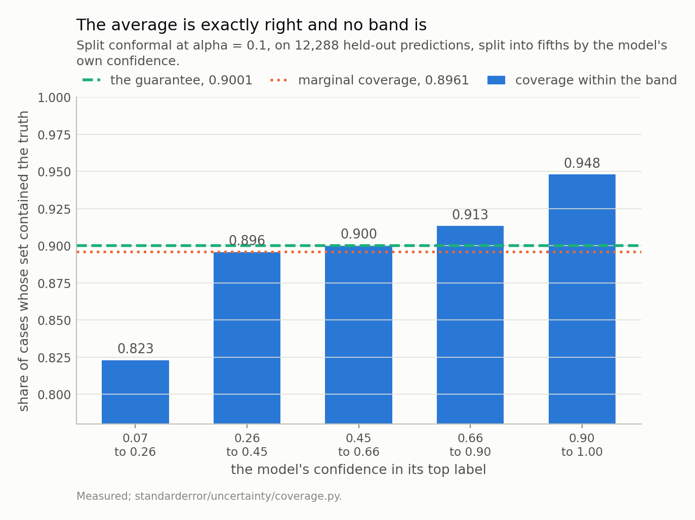
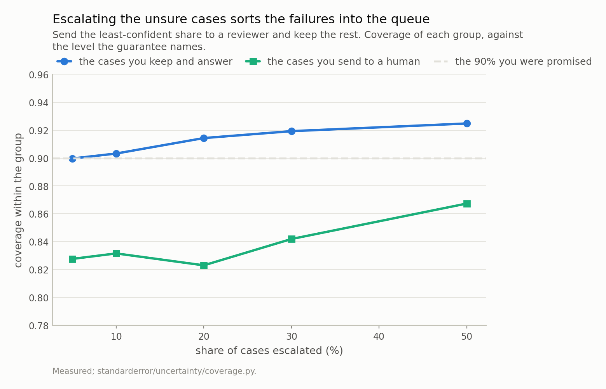
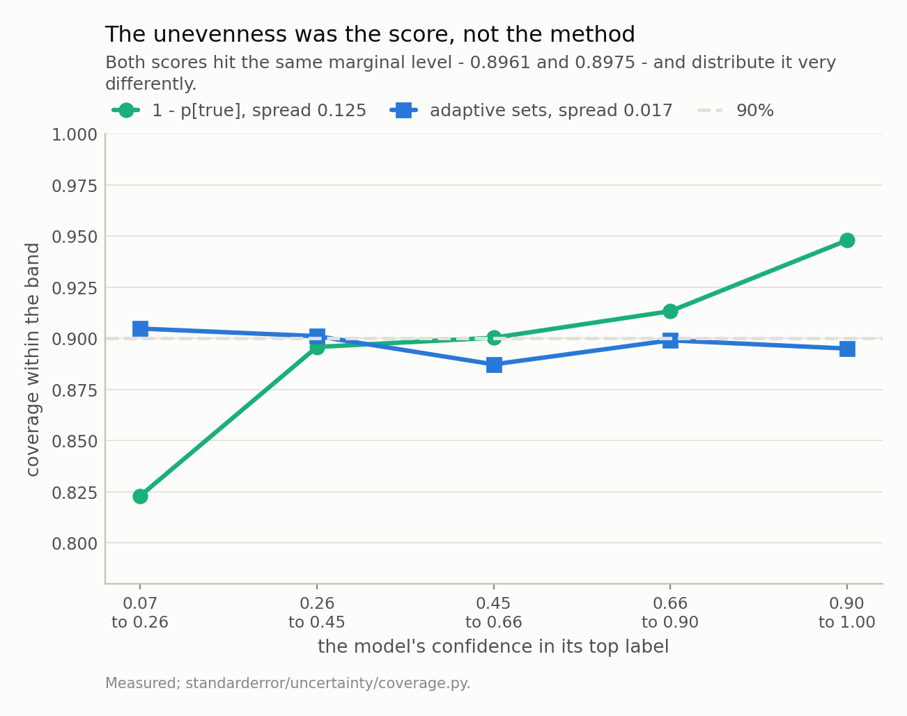
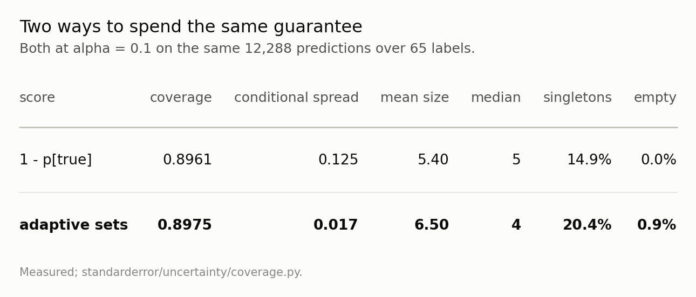

Disclosure: this post was written with the assistance of an AI system (Claude), which wrote the analysis code, ran the experiments and drafted the text. The topic, the constraints, the data choices and the final review are the author's.

*Split conformal at alpha = 0.1 on 24,576 held-out predictions split in half delivers 0.8961 coverage against a finite-sample guarantee of 0.9001, and over 200 calibration splits a mean of 0.8999. Exactly what was promised. Conditioned on the model's own confidence in fifths it runs 0.823 to 0.948, a spread of 0.125, with the shortfall on the least-confident cases - so escalating the least-sure 20% hands a reviewer 0.823 coverage while keeping 0.914. Set sizes tell the same story from the other side: 5.40 labels of 65 on average but 11.6 where the model is unsure against 1.3 where it is not. And then the reversal: swapping the non-conformity score for randomised adaptive sets holds the marginal level at 0.8975 and cuts the conditional spread to 0.017 - a factor of 7.1 - for 20% more labels per set and a 0.9% chance of returning nothing.*

Episode 1 of *Uncertainty for Language Models, Taught Through What Breaks*. The syllabus and the other episodes: https://jongha-jeon-dev.github.io/standarderror/lectures/

## A guarantee with a quantifier in it

Conformal prediction is the rare thing in machine learning that comes with a proof. Give it any model, any way of scoring how badly a label fits, and a calibration set; it returns a set of labels for each new input, and that set contains the truth with probability at least 1 − α. No assumption about the model, no assumption about the distribution, no appeal to asymptotics. One assumption: that the calibration and test points are exchangeable.

It is a real guarantee and it is delivered. It is also a statement about an average, and the average is over the test distribution rather than over anything you selected. This episode is about what that costs, and then about how much of the cost is avoidable, which turned out to be most of it.

## The guarantee, and it is exact

Take the committed character-level model, run it on held-out text, and use the simplest score there is: 1 − *p* assigned to the true label. Hold out half the predictions to calibrate, take the ⌈(*n*+1)(1−α)⌉-th smallest score, and include every label whose probability clears the corresponding threshold.

```python
from standarderror.uncertainty import coverage as cv

# The model's probabilities on held-out text, then split conformal.
pred = cv.predictions(count=24, size=16, seed=1)
fit = cv.split_conformal(pred, alpha=0.1)
print(f"predictions      {pred['rows']:,} over "
      f"{pred['classes']} labels")
print(f"model accuracy   {pred['accuracy']:.4f}")
print()
print(f"guarantee        {fit['guarantee']:.4f}"
      f"   = ceil((n+1)(1-alpha))/(n+1)")
print(f"coverage         {fit['coverage']:.4f}")
print(f"mean set size    {fit['mean_size']:.2f} of "
      f"{pred['classes']}  ({fit['size_share']:.1%})")
print(f"singletons       {fit['singletons']:.1%}"
      f"   empty {fit['empty']:.1%}")
```

```text
predictions      24,576 over 65 labels
model accuracy   0.5342

guarantee        0.9001   = ceil((n+1)(1-alpha))/(n+1)
coverage         0.8961
mean set size    5.40 of 65  (8.3%)
singletons       14.9%   empty 0.0%
```

0.8961 against 0.9001. Note that the target is not 0.90 but slightly above it — the construction achieves a specific finite-sample level, and the realised coverage should land just under *that*. Over 200 random calibration splits the mean is 0.8999.

The sets are usable too: 5.40 labels out of 65 on average, 8.3% of the vocabulary, and 14.9% of predictions get a single label. Nothing is broken here. The method promised a number and produced it.

## Conditioned on the one thing you would condition on

Now ask the question anyone deploying this would ask: is the guarantee even? Not across some protected attribute — across the model's own confidence, because that is what you would route on.

```python
# Now condition on the one thing anyone would condition on.
for b in cv.conditional(pred, fit, bands=5):
    print(f"confidence {b['low']:.3f} to {b['high']:.3f}   "
          f"n {b['n']:5d}   coverage {b['coverage']:.4f}   "
          f"mean size {b['mean_size']:5.2f}")
```

```text
confidence 0.070 to 0.260   n  2458   coverage 0.8230   mean size 11.63
confidence 0.260 to 0.448   n  2457   coverage 0.8958   mean size  6.46
confidence 0.448 to 0.661   n  2458   coverage 0.9003   mean size  4.64
confidence 0.661 to 0.895   n  2457   coverage 0.9133   mean size  2.99
confidence 0.895 to 1.000   n  2458   coverage 0.9479   mean size  1.28
```

0.823 in the least-confident fifth, 0.948 in the most confident. A spread of 0.125 around a marginal 0.896, and it slopes the wrong way.

Nothing has been violated. The guarantee constrains the average of those five numbers and says nothing about their spread, so a method that delivers 0.82 and 0.95 has kept its promise exactly as much as one that delivers 0.90 twice. But the arithmetic means **the cases where the model is unsure are the cases where the set is least likely to contain the answer**, which is the opposite of the property you wanted when you reached for prediction sets.

The set sizes say the same thing from the other side: 11.6 labels where the model is unsure against 1.3 where it is sure. The set is short and reliable when you did not need it and long and unreliable when you did.



*The marginal coverage is 0.8961 against a finite-sample guarantee of 0.9001 - the method delivered exactly what it promised. Within bands it runs 0.823 to 0.948, a spread of 0.125, and **the shortfall is on the left**: the guarantee is weakest where the model is least sure.*

## What that does to the obvious policy

The obvious policy is to escalate. Answer the confident cases, send the rest to a human. Which sorts the test set on exactly the axis the coverage varies along.

At a 20% escalation rate the cases you answer have 0.914 coverage and the queue has 0.823. Every escalation rate I measured does the same thing: the kept group is above the promised level and the queue is below it, and the queue's sets are also the long ones — 11.6 labels against 3.8.

So the reviewer receives the cases with the longest prediction sets *and* the lowest chance those sets contain the answer, and the number on the tin said 90%. If you are going to tell a human "this set covers the truth nine times in ten", the set you hand them is the one where it does not.



*At a 20% escalation rate the cases you answer have 0.914 coverage and the queue has 0.823. Both groups are what the guarantee allows, and the policy anyone would write hands the reviewer the cases whose sets are **least** likely to contain the answer - while also being the longest, 11.6 labels against 3.8.*

## And now the part that undoes most of the complaint

Everything above is true and I would have stopped there, except that the unevenness is not conformal prediction's. It belongs to the score.

1 − *p*(true) puts a single global threshold on the top probability, so a row whose mass is spread across many labels gets a set built by the same rule as a row that is nearly certain. The adaptive score does something different: it accumulates probability from the most likely label downwards and asks how much mass you must take before reaching the truth. Rows that are diffuse then get longer sets *by construction* rather than by accident.

Both satisfy the same theorem. So the comparison is fair, provided the adaptive score is randomised — without the uniform jitter it is discrete and overcovers, measured at 0.98 against a target of 0.90, which would compare two different coverage levels and prove nothing.

```python
# Same guarantee, different non-conformity score.
aps = cv.aps_conformal(pred, alpha=0.1)
for name, f in (("1 - p[true]", fit), ("adaptive sets", aps)):
    bands = cv.conditional(pred, f, bands=5)
    print(f"{name:<14} coverage {f['coverage']:.4f}   "
          f"conditional spread {cv.conditional_range(bands):.3f}   "
          f"size {f['mean_size']:5.2f}   "
          f"empty {f['empty']:.1%}")
```

```text
1 - p[true]    coverage 0.8961   conditional spread 0.125   size  5.40   empty 0.0%
adaptive sets  coverage 0.8975   conditional spread 0.017   size  6.50   empty 0.9%
```

Same marginal coverage, 0.8961 and 0.8975. Conditional spread 0.125 down to 0.017 — a factor of 7.1.

The bill is 20% more labels per set, 6.50 against 5.40, and one thing that is easy to miss: 0.9% of the adaptive sets are **empty**. The randomisation that makes the score exact can put the threshold below even the top label's contribution, and then the honest output is nothing at all. The first score never does that; it always contains the argmax.

That failure mode deserves more than a footnote, because the natural reflex is to patch it. An empty set is awkward to return from an API, so the obvious thing is to fall back to the top label — and the moment you do, the guarantee is gone. Those 0.9% of cases are exactly the ones the calibration decided it could afford to miss; filling them with a guess does not make them covered, it makes the coverage unverifiable, because the set you return is no longer the set the theorem is about. If you need a non-empty answer, the correct move is to use a score that cannot produce one, which is the first score, and to accept the conditional spread that comes with it. The choice is between two honest options and one dishonest one.

Which of the two honest failure modes you prefer is a question about your application, and the marginal guarantee is silent on it.



*Swapping the non-conformity score cuts the conditional spread from 0.125 to 0.017, a factor of 7.1, at the same marginal coverage. The bill is 20% more labels per set and a 0.9% chance of returning **nothing**, which the first score never does.*

What it is not is a fix. Barber, Candès, Ramdas and Tibshirani proved that exact conditional coverage cannot be had distribution-free: a procedure valid conditional on the input, for every distribution, is forced in the worst case to return sets carrying no information — intervals of infinite expected length in the continuous case, and the whole label list in ours. So 0.017 is not on its way to zero by picking a cleverer score, and a score that flattened these bands completely would be worth distrusting rather than adopting.

Which makes the honest summary a choice rather than a defect. Two scores, one guarantee, and a spread that differs 7.1-fold between them. The marginal guarantee does not pick, so you are picking, and if you have not looked at a table like the one below you are picking by default.



*The **bold** row buys conditional coverage and pays in size and in occasional silence. Neither row is the right answer; the point is that the marginal guarantee does not choose between them, so it is a choice you are making whether or not you know it.*

## What tighter coverage costs

One more thing the guarantee does not tell you, and it is the number you will actually be asked for. If 90% is not enough, what does 99% cost?

Measured on the same predictions, with the same simple score, as alpha tightens:

- α = 0.20 — coverage 0.7995, mean set 3.19 labels, worst set 9
- α = 0.10 — 0.8961, 5.40, worst 18
- α = 0.05 — 0.9473, 7.74, worst 28
- α = 0.02 — 0.9780, 11.47, worst 44
- α = 0.01 — 0.9888, 14.54, worst 54

Coverage lands just under its guarantee at every level, which is the theorem doing its job five times over. The price is the second column: 1.7 times the set size for the step from 80% to 90%, and 2.7 times for the step from 90% to 99%.

The third column is the one worth staring at. At alpha = 0.10 the largest set anyone gets is 18 labels of 65 — 28% of the vocabulary, which is an unhelpful answer but not an absurd one. At alpha = 0.01 it is 54 of 65, or **83% of every label there is**. The set is still correct: it contains the truth, as promised, 99% of the time. It is simply not a prediction any more. Asking for 99% coverage from a model that is right 53% of the time gets you exactly what it should, which is a shrug with a certificate attached.

## Why the marginal guarantee is still the right default

Having spent four sections on what the average hides, the balance is worth stating, because the obvious conclusion — "demand conditional coverage instead" — is not available.

Barber, Candès, Ramdas and Tibshirani's result is not a difficulty, it is an impossibility: a procedure valid conditional on the input, against every distribution, is forced in the worst case to return sets that say nothing — and over a finite label list, saying nothing means handing back the list. You cannot have a distribution-free promise about individuals. So the choice is not between a marginal guarantee and a conditional one; it is between a marginal guarantee you can verify in four lines and a conditional claim that would require assumptions you cannot check.

Put that way, the average is the right thing to promise. What is wrong is reading it as a promise about the case in front of you, and the correction is not to want a better theorem but to print the 5-band table. That table is not a diagnostic for a broken method. It is the missing half of the output.

Which is roughly where the previous series in this project ended as well: an exact statement that is true, that people over-read, and whose useful content sits one question further in. Here the question is "over what?", the answer is "over the test distribution, and not over your routing rule", and the fix is a different score and a table you were not printing.

## One assumption, and it is the next episode

There is a loose end I am deliberately leaving. Everything above rests on exchangeability, and I have been treating 12,288 calibration rows as 12,288 exchangeable draws when they are characters taken from overlapping contexts inside 384 sequences.

The marginal coverage survives it — 0.8999 over 200 splits. What does not survive is the *error bar* on that number, and by a factor I did not expect and in a direction that gets worse when you do the obvious thing about it. That is episode 5.

## What to keep

1. Split conformal's coverage guarantee is exact, finite-sample and distribution-free, and the level is ⌈(*n*+1)(1−α)⌉/(*n*+1) rather than 1 − α. Measured: 0.8961 against 0.9001, and 0.8999 averaged over 200 calibration splits.

2. It is an average over the test distribution. Conditioned on the model's own confidence it runs 0.823 to 0.948 here, a spread of 0.125, and nothing was violated.

3. The slope runs the wrong way: **least coverage where the model is least sure**, together with the longest sets — 11.6 labels against 1.3.

4. So the obvious escalation policy sorts the failures into the queue. At 20% escalation, 0.914 kept against 0.823 escalated.

5. But that is the **score**, not the method. Randomised adaptive sets hold the marginal level and cut the spread by 7.1×.

6. The price is 20% more labels and a 0.9% chance of an empty set. The simple score always contains the argmax; the adaptive one sometimes contains nothing.

7. And it cannot be driven to zero — exact conditional coverage is impossible distribution-free. What is available is most of it, cheaply, and the marginal guarantee will not tell you that you had a decision to make.

## Exercise

Take whatever conformal wrapper you are using and print one table: coverage within five equal-mass bands of your model's own confidence. It is four lines and it is the only number that tells you whether your guarantee applies to the cases you route on. If the bands are flat, your score is already doing the adaptive thing and you can stop reading about this.

Then swap the score and print the same table. You are looking for two columns: the conditional spread, and the mean set size. One buys the other at a rate you can measure in an afternoon, and neither the α you chose nor the coverage you verified has any opinion about where on that curve you want to sit.

The uncomfortable version: check your empty-set rate. Every adaptive, randomised score has one, and a wrapper that silently returns the argmax when the set comes out empty has quietly given back the guarantee you were paying for.

---

### Data

- No external data. Every number is a coverage rate or a set size computed on held-out text from the corpus the model was trained on, and no values from that text are published.
- The model: an 816,128-parameter character-level transformer trained for this series - four blocks, four heads, width 128, context 64, validation loss 1.573 against a uniform-guess 4.174. Weights, training script and a verified sha256 are committed: `standarderror/llm/tiny.py`, `scripts/train_tiny.py`, `data/tiny_gpt/`.
- Machinery: `standarderror/uncertainty/coverage.py`, tested in `tests/test_uncertainty.py`, which pins the finite-sample level exactly and the model findings as inequalities.
- Where this stops: Vovk, Gammerman and Shafer, *Algorithmic Learning in a Random World* (2005), for conformal prediction; Angelopoulos and Bates, "A gentle introduction to conformal prediction and distribution-free uncertainty quantification" (2021), for split conformal as used here; Romano, Sesia and Candes, "Classification with valid and adaptive coverage", *NeurIPS* (2020), for the adaptive score and its randomisation; Barber, Candes, Ramdas and Tibshirani, "The limits of distribution-free conditional predictive inference", *Information and Inference* (2021), for the theorem that says the gap above cannot be closed entirely.

### Reproducibility

- **environment**: standarderror=0.1.0, python=3.11.15, torch=2.14.0, numpy=2.4.4, scipy=1.16.3
- **code blocks**: executed at build time; the values the prose quotes are pinned, so drift fails the build
- **model**: the committed checkpoint, hash-verified on load, so every coverage rate is measured on the same weights
- **determinism**: the calibration and test halves come from a fixed permutation; the variability figure repeats the split 200 times with seeds 0 to 199; the adaptive score's randomisation uses the same generator, so the comparison is reproducible and does depend on that seed

Code: <https://github.com/jongha-jeon-dev/standarderror>
