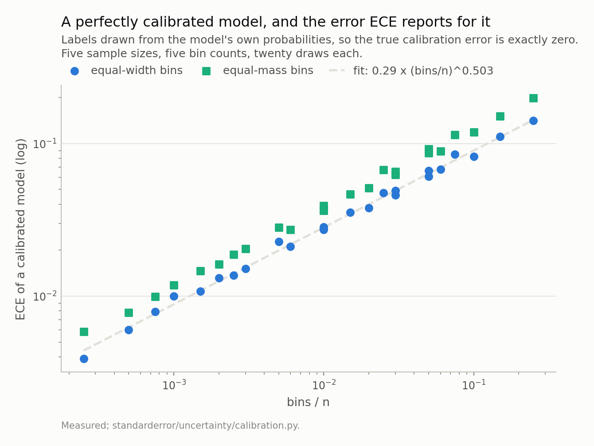
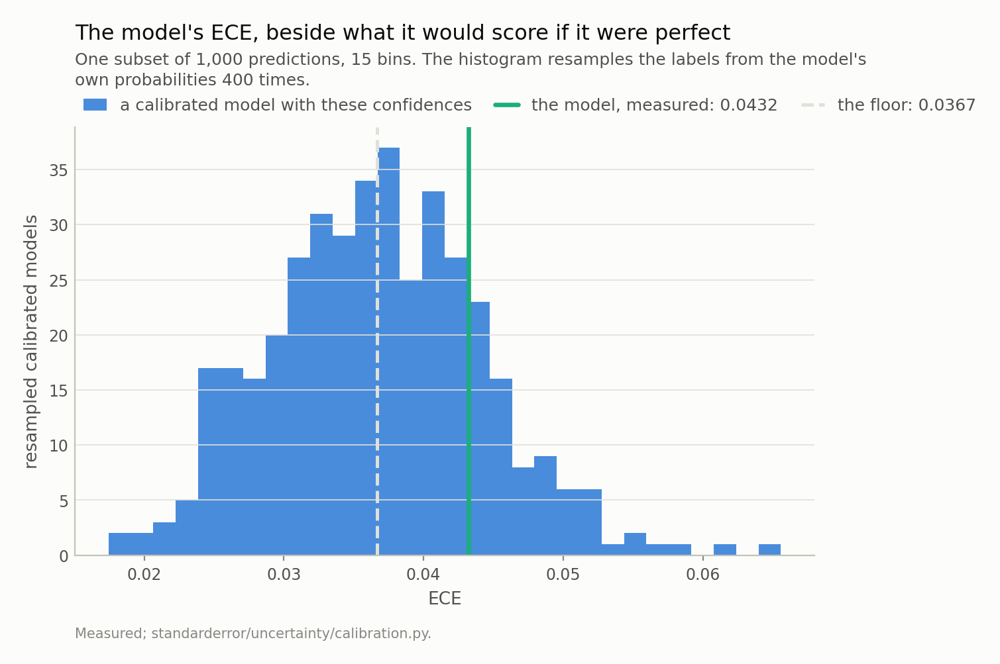
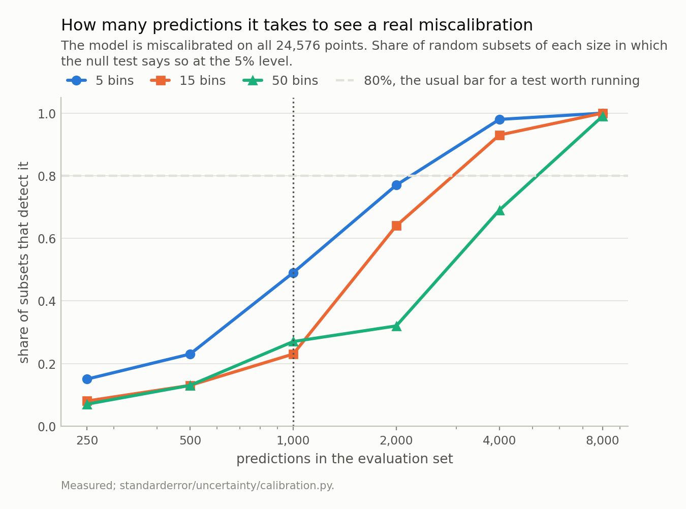
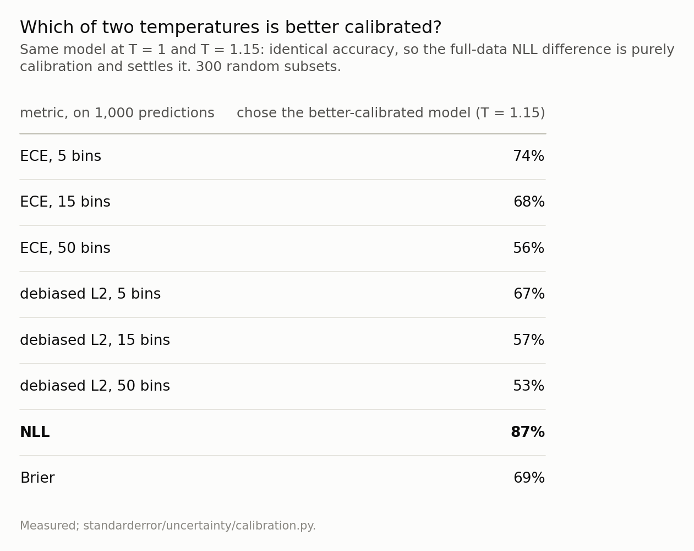
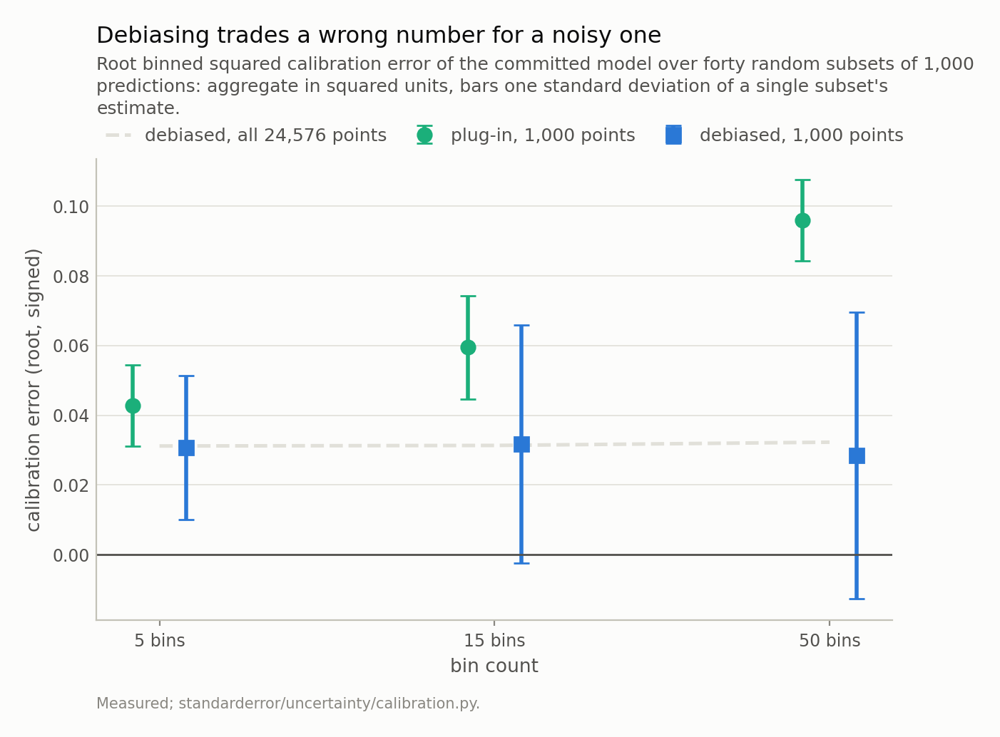

Disclosure: this post was written with the assistance of an AI system (Claude), which wrote the analysis code, ran the experiments and drafted the text. The topic, the constraints, the data choices and the final review are the author's.

*A model calibrated by construction - labels drawn from its own probabilities - scores an ECE of 0.085 on 200 predictions, 0.035 on 1,000 and 0.008 on 20,000 at 15 bins, and the fitted slope against bins/n is 0.503, where a binomial argument predicts one half. Equal-mass bins raise it. The floor also depends on the confidence profile, so the right comparison is the model against itself with resampled labels. On 1,000 predictions from the committed language model, 80% of the measured ECE is that floor on average, and a miscalibration that is real on all 24,576 rows is detected in 23% of subsets; it takes about 4,000 points, and fewer bins detect it sooner. Choosing between two temperatures of the model, ECE on 1,000 points picks the better-calibrated one 68% of the time at 15 bins and NLL 87%. Subtracting each bin's binomial variance removes the floor and the bin dependence on average - and leaves single estimates so noisy that 32% of them come out below zero.*

Episode 2 of *Uncertainty for Language Models, Taught Through What Breaks*. The syllabus and the other episodes: https://jongha-jeon-dev.github.io/standarderror/lectures/

## A number with a floor

The question people ask of a calibration number is "is it small?". Report an expected calibration error of 0.04 and a reader will hear "well calibrated, slightly off". The question that has to come first is "small compared with what?", because ECE is not a measurement of a model. It is an *estimate*, computed from finitely many predictions, and it has a floor.

The floor is easy to state. Sort the predictions into bins by confidence; in each bin compare the mean confidence with the share that were right; average the gaps. The share that were right is a binomial average, so it is noisy, and the gap is taken in absolute value, so the noise cannot cancel. A model whose probabilities are exactly right still reports a positive number.

How large that number is decides whether anything said about calibration on an ordinary benchmark means anything. This episode measures it, then measures how much of a real model's ECE it accounts for, and ends with the standard fix and what it actually buys.

## Calibrated by construction, and still not zero

The cleanest possible test: build a model whose calibration error is zero by definition. Draw a probability vector over ten classes, then draw the label *from that vector*. The reported confidence is then the true probability of being right, every time.

```python
from standarderror.uncertainty import calibration as cb

# Labels drawn from the model's own probabilities: calibrated by
# construction, so the true calibration error is exactly zero.
sweep = cb.bias_sweep()          # 5 sizes x 5 bin counts x 20 draws
for n in (200, 1000, 20000):
    row = "  ".join(f"{b:2d} bins {sweep['grid'][(n, b)]:.3f}"
                    for b in (5, 15, 50))
    print(f"n = {n:6,d}   {row}")
print(f"log-log slope against bins/n: {sweep['slope']:.3f}")
```

```text
n =    200    5 bins 0.048  15 bins 0.085  50 bins 0.141
n =  1,000    5 bins 0.023  15 bins 0.035  50 bins 0.061
n = 20,000    5 bins 0.004  15 bins 0.008  50 bins 0.014
log-log slope against bins/n: 0.503
```

On 1,000 predictions with the default 15 bins, a perfect model scores 0.035. On 200 it scores 0.085. The fitted slope against bins/n on a log-log scale is 0.503; the binomial argument predicts exactly one half, so the floor is not mysterious, it is the square root of bins over n with a constant in front.

Two things worth knowing from the same table. Equal-mass bins, the usual first suggestion for fixing ECE, sit *above* equal-width bins at every size here — 0.046 against 0.035 at 1,000 points. And the syllabus for this series originally quoted 0.120 for 200 predictions. That was a single draw; the average over twenty is 0.085. The estimate of the estimator's bias is itself noisy enough to mislead a table, which is a fair preview of the rest of the episode.



*Every point should be zero. The fitted slope is 0.503 against a binomial prediction of one half, so the floor is predictable - and equal-mass bins, the usual first fix, sit **above** equal-width ones (slope 0.513).*

## There is no table of floors

The obvious fix is to look up the floor for your n and bin count and subtract it. It does not work, because the floor depends on something else as well: the shape of the confidence distribution. The same 1,000 predictions and 15 bins give a floor of 0.034 for a ten-class calibrated model and 0.015 for a 65-class one — less than half, from nothing but where the confidences happen to sit.

So the comparison a measured ECE needs is not against a published constant. It is against *this model with this confidence profile*, made calibrated. That is easy to construct: keep the model's probabilities, throw away the labels, and draw new labels from the probabilities. Under those labels the model is perfect by construction and has exactly its own confidences. Do it a few hundred times and you have the distribution of ECE a calibrated version of your model would report. Weather forecasters have done this since at least 2007, under the name consistency resampling.

## The committed model, against itself

Same 816,128-parameter character model as episode 1, same held-out predictions.

```python
import numpy as np
from standarderror.uncertainty import coverage as cv

pred = cv.predictions(count=24, size=16, seed=1)
p, y = pred["p"], pred["y"]
i = np.random.default_rng(3).permutation(len(y))[:1000]

for label, rows in (("1,000 predictions", i),
                    (f"all {len(y):,}", slice(None))):
    t = cb.null_test(p[rows], y[rows], bins=15, draws=400, seed=5)
    print(f"{label:18s} ECE {t['ece']:.4f}   "
          f"calibrated floor {t['null_mean']:.4f}   "
          f"p = {t['p_value']:.3f}")
```

```text
1,000 predictions  ECE 0.0432   calibrated floor 0.0367   p = 0.185
all 24,576         ECE 0.0302   calibrated floor 0.0076   p = 0.000
```

On all 24,576 predictions the model is miscalibrated, and clearly: ECE 0.0302 against a calibrated floor of 0.0076, and no resampled perfect model came close. That is the real signal and it is worth keeping in mind for the next paragraph.

On a random 1,000 of those predictions, the same model reports 0.0432 — and a calibrated model with the same confidences averages 0.0367, exceeding the measured value 18% of the time. On that subset there is no evidence of miscalibration whatsoever. At 50 bins the measured ECE, 0.0641, is *below* the calibrated floor of 0.0673.

One subset is an anecdote, so over thirty: on 1,000 predictions, the floor accounts for 65% of the measured ECE at 5 bins, 80% at 15 and 90% at 50. Most of the number is the estimator.



*Measured 0.0432; a perfectly calibrated model with exactly these confidences averages 0.0367, and exceeds the measured value in 18% of draws. On this subset there is **no evidence of miscalibration at all**.*

## How many predictions it takes

If the miscalibration is real but the floor hides it at 1,000 points, the useful question is how many points it takes to see it. That is a power calculation, and it can be done directly: draw subsets of each size, run the null test on each, and count how often it rejects.

```python
# The model IS miscalibrated (p < 0.005 on all of it). How often does
# a subset of a given size show that?
for n in (1000, 4000):
    for bins in (15, 50):
        r = cb.detection_rate(p, y, n=n, bins=bins, subsets=100,
                              seed=11)
        print(f"n = {n:5,d}  {bins:2d} bins   detected in {r:.0%}")
```

```text
n = 1,000  15 bins   detected in 23%
n = 1,000  50 bins   detected in 27%
n = 4,000  15 bins   detected in 93%
n = 4,000  50 bins   detected in 69%
```

At 1,000 predictions a miscalibration that is really there is detected in 23% of subsets at 15 bins. It reaches the conventional 80% somewhere between 2,000 and 4,000 points — 64% at 2,000, 93% at 4,000.

And bins cost power. At 1,000 points the gap between 15 and 50 bins is inside the noise of a hundred subsets — 23% against 27%, the wrong way round — but from 2,000 up it is not: 77% with 5 bins, 64% with 15, 32% with 50. More bins sound like more resolution. What they actually buy is more bins with a handful of points each, each contributing its own binomial noise to a sum that cannot cancel.



*At 1,000 predictions the test detects a miscalibration that is really there in 23% of subsets at 15 bins. At 4,000 it is 93%. **More bins cost power** - at 4,000 points, 50 bins detect it 69% of the time.*

## The comparison everyone makes

Most ECE numbers are not used to ask "is this calibrated?". They are used to ask "is this one better calibrated than that one?". That question has an advantage: two models scored on the same predictions at the same bin count share most of their floor, so it partly cancels. Whether it cancels enough is measurable.

The cleanest pair is one model at two temperatures. Dividing every logit by the same positive number cannot change any argmax, so accuracy is identical to the last digit — here 0.5342 both times — and the full-data NLL difference is then *purely* a calibration difference. At T = 1.15 the NLL is 1.5564 against 1.5621 at T = 1, and the full-data ECE is lower at every bin count (0.0181 against 0.0302 at 15 bins): T = 1.15 is the better-calibrated model, and that is settled.

```python
# Two temperatures of one model: identical accuracy, so the full-data
# NLL settles which is better calibrated.
warm = cb.temperature(p, 1.15)
r = cb.ranking(p, warm, y, n=1000, bins=(5, 15, 50),
               subsets=300, seed=2)
print(f"full data: NLL at T=1 {r['full']['nll_a']:.4f}, "
      f"at T=1.15 {r['full']['nll_b']:.4f}")
for metric, share in r["prefers_a"].items():
    print(f"  {metric:22s} picks T=1.15 in {1 - share:.0%}")
```

```text
full data: NLL at T=1 1.5621, at T=1.15 1.5564
  ECE, 5 bins            picks T=1.15 in 74%
  ECE, 15 bins           picks T=1.15 in 68%
  ECE, 50 bins           picks T=1.15 in 56%
  debiased L2, 5 bins    picks T=1.15 in 67%
  debiased L2, 15 bins   picks T=1.15 in 57%
  debiased L2, 50 bins   picks T=1.15 in 53%
  NLL                    picks T=1.15 in 87%
  Brier                  picks T=1.15 in 69%
```

On 1,000 points, 15-bin ECE picks the better model 68% of the time; at 50 bins it is 56%, barely better than a coin. NLL picks it 87% of the time. Brier, the other proper score, manages 69% — no better than five-bin ECE — so "use a proper score" is not quite the lesson; NLL is, on this model, for this comparison.

The row worth staring at is the debiased one, which picks the right model *less* often than the plug-in at every bin count. That is the next section.



*The **bold** row is the only metric that does clearly better than the binned estimators: NLL picks the right model in 87% of subsets. Brier, also a proper score, manages 69% - no better than five-bin ECE - and the debiased estimator is *worse* than the plug-in at every bin count.*

## The fix, and what it buys

The standard correction is old and simple. Each bin's observed accuracy carries binomial variance of about a(1 − a)/(k − 1), and squaring the gap turns that variance into a positive bias. So work with the squared gap and subtract the variance, bin by bin. What is left is an unbiased estimate of the true squared calibration error.

```python
st = cb.stability(p, y, n=1000, bins=(5, 15, 50), subsets=40,
                  seed=4)
full = cb._conf_correct(p, y)
for bins, v in st.items():
    print(f"{bins:2d} bins  plug-in {v['l2']:.3f}  "
          f"debiased {v['debiased']:.3f} +/- {v['debiased_sd']:.3f}  "
          f"below zero {v['negative']:.0%}  "
          f"all rows {cb.l2_error(*full, bins=bins):.3f}")
```

```text
 5 bins  plug-in 0.043  debiased 0.031 +/- 0.021  below zero 15%  all rows 0.031
15 bins  plug-in 0.059  debiased 0.032 +/- 0.034  below zero 32%  all rows 0.031
50 bins  plug-in 0.096  debiased 0.028 +/- 0.041  below zero 32%  all rows 0.032
```

It works exactly as advertised on average. The plug-in moves from 0.043 to 0.096 as the bin count goes from 5 to 50, which is the floor again. The debiased estimate, aggregated over forty subsets, is 0.031, 0.032 and 0.028 — within a few thousandths of the full-data values (0.031, 0.031, 0.032) at every bin count, where the plug-in was off by a factor of three at 50 bins.

And on any *one* set of 1,000 predictions it is useless in a different way. Its spread from subset to subset is 0.034 at 15 bins, about the size of the quantity it estimates, and 32% of single estimates come out **below zero**, which is the estimator's way of saying the true value is smaller than its own noise. On a model that is, in fact, miscalibrated.

One detail cost me a wrong figure on the way. Averaging the per-subset *roots* of the debiased estimate gives 0.018 at 15 bins and appears to shrink as the bin count rises. That is Jensen's inequality — a square root is concave, so the mean of roots sits below the root of the mean, and more so as the variance grows. The unbiased quantity is the squared one, and it has to be averaged as such.

So the fix trades a wrong number for a noisy one. That is why it ranks models worse than the plug-in: in a comparison on shared data most of the plug-in's bias cancels anyway, while the variance the correction adds does not.



*The plug-in moves from 0.043 to 0.096 with the bin count. The debiased estimate, aggregated, sits on the full-data value at every bin count - but one 1,000-point estimate has a spread of 0.034 at 15 bins, and **32% of them come out below zero** on a model that is genuinely miscalibrated.*

## Where this breaks

**One model, one confidence profile.** The floor shares and the detection rates are properties of this model's predictions. The scaling law is general; the constants are not, which is the whole argument against tables of floors — and an argument against reading these numbers as anyone else's.

**Top-label calibration only.** Everything here is about the confidence of the predicted class. A model can be calibrated on its top label and badly miscalibrated on the rest of the distribution, and none of these numbers would show it. NLL, which does see the rest of the distribution, is part of why it ranks better.

**NLL is a clean calibration comparison only when accuracy is fixed.** Two temperatures of one model are the special case where it is. Between two different models NLL mixes calibration with sharpness, and a better NLL is not a calibration claim on its own.

**The null is the model's own probabilities.** Consistency resampling asks "could a calibrated model with these confidences have produced this ECE?". It does not test whether the confidence *profile* is reasonable, and a model that put every prediction at 0.53 would pass it while being useless.

## What to keep

1. ECE has a floor: a perfectly calibrated model scores 0.035 on 1,000 predictions at 15 bins, scaling as the square root of bins over n (fitted slope 0.503).

2. Equal-mass bins do not remove it; here they raise it.

3. The floor depends on the confidence profile, so compare a measured ECE with the model itself under resampled labels, not with a constant.

4. On 1,000 predictions, 80% of this model's ECE is the floor, and a real miscalibration is detected in 23% of subsets. It takes about 4,000 points to see it reliably.

5. Fewer bins detect it sooner: at 2,000 points, 77% with 5 bins against 32% with 50.

6. Choosing the better-calibrated of two models on 1,000 points, 15-bin ECE is right 68% of the time and NLL 87%.

7. Debiasing removes the floor on average and makes single estimates as noisy as the quantity — 32% of them negative. Unbiased and informative are different properties.

## Exercise

Take the ECE you last reported. Keep the model's probabilities, resample the labels from them two hundred times, and compute ECE each time with the same bins. If your number sits inside that distribution, you have not measured a miscalibration; you have measured your sample size.

Then take the comparison you last made between two models and run it on twenty random halves of the evaluation set. Count how often the ranking flips. If it flips more than a few times, the difference you reported was not a property of the models.

The uncomfortable version: do both with fifty bins, which is what reliability-diagram code often defaults to, and watch how much of your result was the plotting choice.

## Next

Episode 3 is temperature scaling itself: why dividing every logit by the same number cannot change a single prediction — accuracy is bit-identical from T = 0.5 to T = 3 — and why it nevertheless reorders which predictions a model is *most* confident about, which is the ordering abstention and escalation actually use.

---

### Data

- No external data. Every number is a calibration statistic of the committed model's predictions on held-out text, or of synthetic models calibrated by construction; no values from the text are published.
- The model: an 816,128-parameter character-level transformer - four blocks, four heads, width 128, context 64, validation loss 1.573 against a uniform-guess 4.174. Weights, training script and a verified sha256 are committed: `standarderror/llm/tiny.py`, `scripts/train_tiny.py`, `data/tiny_gpt/`.
- Machinery: `standarderror/uncertainty/calibration.py`, tested in `tests/test_uncertainty.py`, which pins the floor, the single-draw correction, the profile dependence and the bias-variance trade as regressions.
- Where this stops: Guo et al., "On calibration of modern neural networks", *ICML* (2017), for ECE as commonly computed; Bröcker and Smith, "Increasing the reliability of reliability diagrams", *Weather and Forecasting* (2007), for consistency resampling; Kumar, Liang and Ma, "Verified uncertainty calibration", *NeurIPS* (2019), for the debiased estimator; Roelofs et al., "Mitigating bias in calibration error estimation", *AISTATS* (2022), for the bias as a function of bins and n.

### Reproducibility

- **environment**: standarderror=0.1.0, python=3.11.15, torch=2.14.0, numpy=2.4.4
- **code blocks**: executed at build time; the values the prose quotes are pinned, so drift fails the build
- **model**: the committed checkpoint, hash-verified on load, so every rate is measured on the same weights
- **determinism**: every subset, null draw and synthetic model is seeded; the floor is averaged over twenty draws and the detection rates over a hundred subsets

Code: <https://github.com/jongha-jeon-dev/standarderror>
