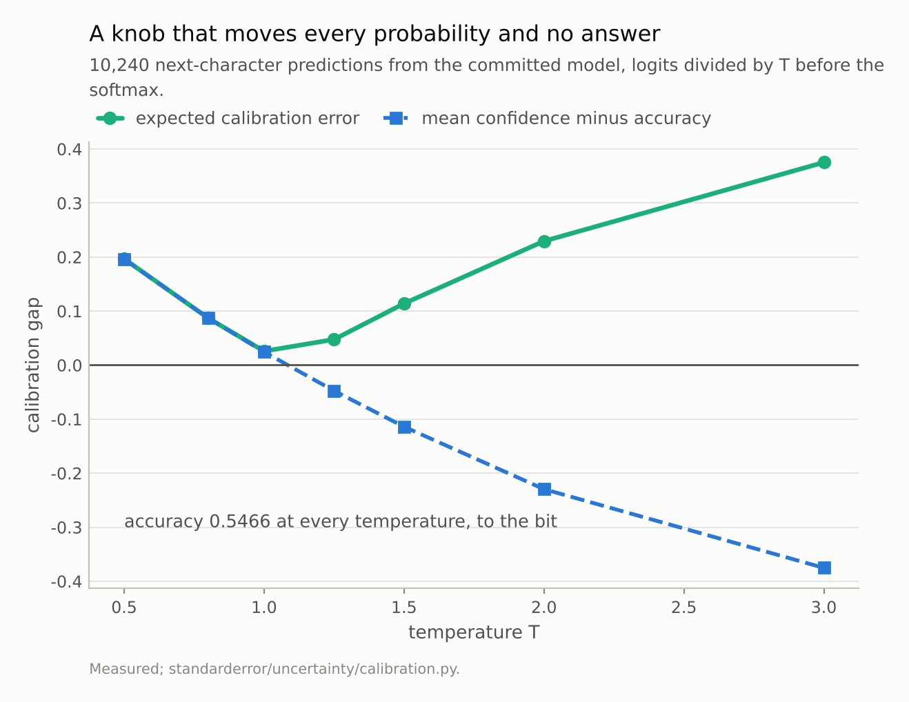
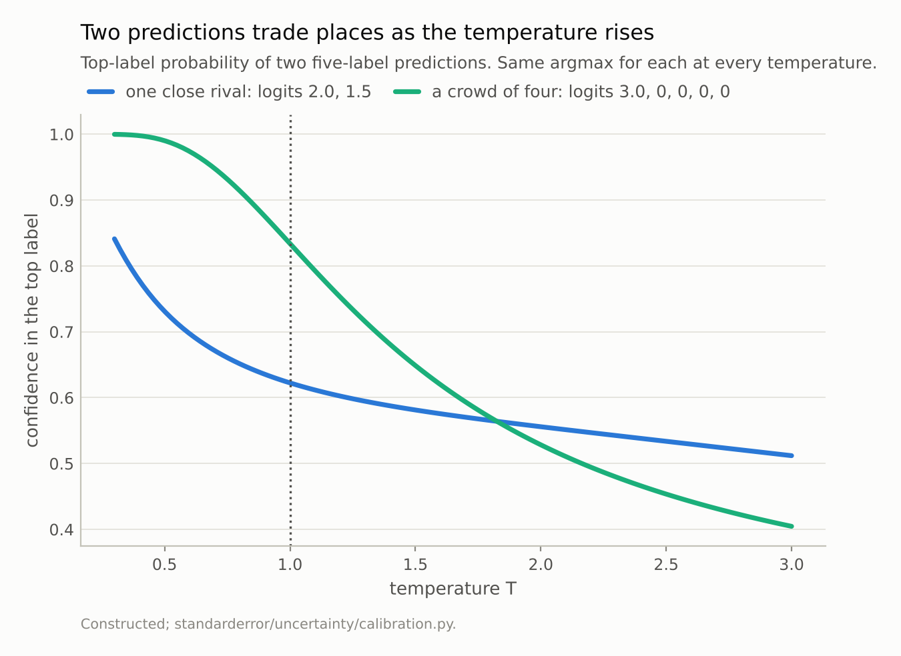
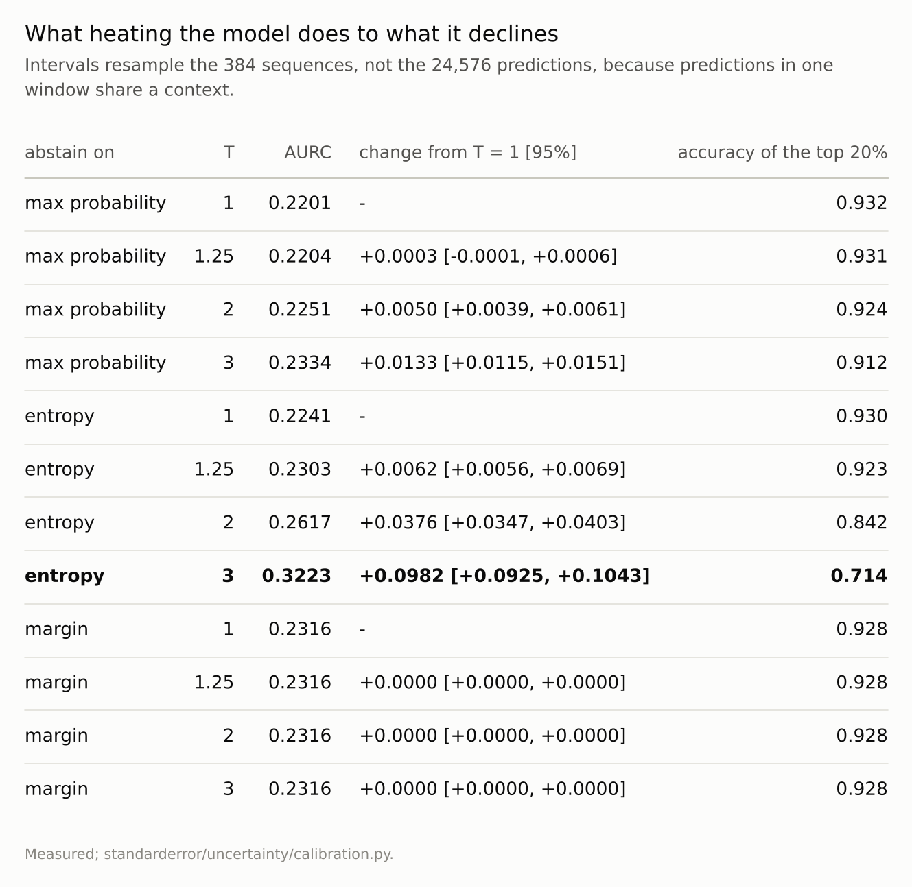
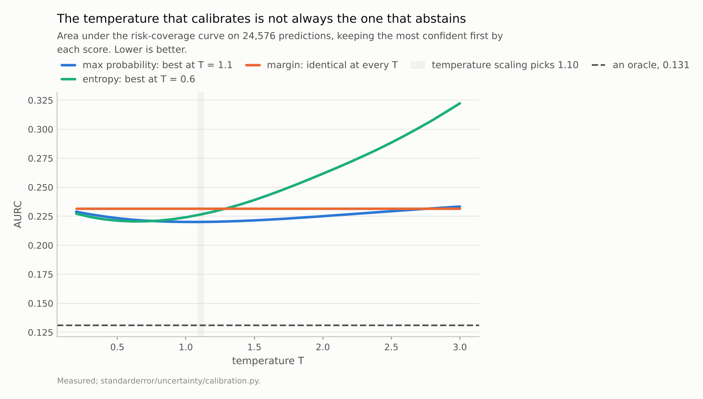

Disclosure: this post was written with the assistance of an AI system (Claude), which wrote the analysis code, ran the experiments and drafted the text. The topic, the constraints, the data choices and the final review are the author's.

*On 10,240 next-character predictions from the committed model, accuracy is 0.5466 at all seven temperatures from 0.5 to 3, identical to the bit, while ECE runs from 0.026 to 0.375. Between predictions the confidence order moves: at T = 2 Kendall's tau against T = 1 is 0.857 and 22.5% of the most confident one per cent leaves it. On 24,576 predictions, abstaining on max probability barely notices - AURC changes by +0.0003 at T = 1.25, inside the noise - while abstaining on entropy gets 44% worse at T = 3, and ranking by logit margin cannot move at all. Temperature scaling fitted on NLL picks T = 1.10, which is also the best temperature for max-probability abstention and the wrong direction for entropy, whose best is 0.6.*

Episode 3 of *Uncertainty for Language Models, Taught Through What Breaks*. The syllabus and the other episodes: https://jongha-jeon-dev.github.io/standarderror/lectures/

## A knob that cannot change an answer

Temperature scaling is the standard first fix for a miscalibrated classifier, and it comes with a guarantee that sounds like reassurance: it cannot change a single prediction. Divide every logit by the same positive number T before the softmax. Within one prediction that is a strictly increasing map, so the largest logit stays the largest, and so does every ordering below it. The argmax cannot move.

The guarantee is exact, and it is easy to check rather than trust.

```python
from standarderror.uncertainty import calibration as cb

# Divide every logit by T, then softmax. 10,240 predictions.
table = cb.temperature_table()
for r in table["rows"]:
    print(f"T = {r['temperature']:4.2f}   accuracy {r['accuracy']:.4f}"
          f"   NLL {r['nll']:.4f}   ECE {r['ece']:.4f}")
print("identical predictions at every T:", table["accuracy_identical"])
```

```text
T = 0.50   accuracy 0.5466   NLL 1.9573   ECE 0.1966
T = 0.80   accuracy 0.5466   NLL 1.5862   ECE 0.0871
T = 1.00   accuracy 0.5466   NLL 1.5251   ECE 0.0258
T = 1.25   accuracy 0.5466   NLL 1.5319   ECE 0.0475
T = 1.50   accuracy 0.5466   NLL 1.5886   ECE 0.1140
T = 2.00   accuracy 0.5466   NLL 1.7745   ECE 0.2295
T = 3.00   accuracy 0.5466   NLL 2.2037   ECE 0.3752
identical predictions at every T: True
```

Accuracy is 0.5466 at all seven temperatures — not approximately, identically: the same predicted character at every position, at every T. Meanwhile ECE runs from 0.026 at T = 1 to 0.375 at T = 3, and 0.197 at T = 0.5. The knob moves every probability and no answer.

That is usually where the description stops: temperature fixes calibration and costs nothing. This episode is about the one thing that sentence leaves out.



*ECE runs from 0.026 at T = 1 to 0.375 at T = 3, and the model goes from overconfident to underconfident through the same range. Accuracy is **0.5466 at all seven temperatures** - the same predictions, bit for bit.*

## The order between predictions moves

The guarantee is *within* a prediction. Plenty of what a deployed model does compares *across* predictions: abstain on the least confident 10%, send the bottom fifth to a reviewer, surface the top-confidence answers first. All of those sort predictions by a confidence score, and nothing in the guarantee says that sort survives a change of temperature.

```python
# Within a prediction nothing moves. Between predictions:
for r in cb.reordering(table):
    if r["temperature"] in (1.25, 2.0, 3.0):
        print(f"T = {r['temperature']:4.2f}   Kendall tau {r['tau']:.3f}"
              f"   pairs reordered {r['pairs_reordered']:.1%}"
              f"   top 1% kept {r['top_overlap']:.1%}")
```

```text
T = 1.25   Kendall tau 0.957   pairs reordered 2.2%   top 1% kept 94.1%
T = 2.00   Kendall tau 0.857   pairs reordered 7.2%   top 1% kept 77.5%
T = 3.00   Kendall tau 0.780   pairs reordered 11.0%   top 1% kept 64.7%
```

At T = 2, Kendall's tau between the old and new confidence orderings is 0.857: 7.2% of all pairs of predictions swap which one is more confident, and 22.5% of the predictions that were in the most confident one per cent are no longer in it. The answers did not change. The queue did.

The mechanism fits in two predictions over five labels.

```python
pair = cb.swap_pair()
for t, (one, crowd) in pair["confidence"].items():
    first = "one rival" if one > crowd else "crowd"
    print(f"T = {t:3.1f}   one rival {one:.3f}   crowd {crowd:.3f}"
          f"   more confident: {first}")
```

```text
T = 0.5   one rival 0.731   crowd 0.990   more confident: crowd
T = 1.0   one rival 0.622   crowd 0.834   more confident: crowd
T = 2.0   one rival 0.556   crowd 0.528   more confident: one rival
T = 3.0   one rival 0.512   crowd 0.405   more confident: one rival
```

The first prediction has one close rival; the second beats a crowd of four distant ones. Cold, the crowd barely registers and the second is more confident. Heated, probability spreads across rivals, and four rivals absorb more of it than one does, so the order flips. Neither top label changed at any temperature. Real predictions sit everywhere between those two shapes, which is why the reordering is partial and grows with T.



*At T = 1 the crowd row is the more confident, 0.834 against 0.622. At T = 2 the order has flipped. Heat spreads probability across rivals, and a crowd of four takes more of it than one rival does - **neither prediction changed**.*

## Does the order matter? Ask the abstention

A reordering is only a problem if it reorders the wrong way, so the useful measurement is not tau but what an abstaining system loses. Sort predictions by a confidence score, keep the most confident first, and track the error rate of what you kept as you keep more. The area under that risk-coverage curve, AURC, summarises it; lower is better, and an oracle that keeps every right answer before any wrong one scores 0.131 here.

Three scores, because three are in common use: the probability of the top label, the entropy of the whole distribution, and the logit margin between the top two labels. The intervals resample the 384 sequences rather than the 24,576 predictions, because predictions inside one 64-character window share their context and are not independent draws.

```python
from standarderror.uncertainty import coverage as cv

pred = cv.predictions(count=24, size=16, seed=1)
p, y, seq = pred["p"], pred["y"], pred["sequence"]
ab = cb.abstention(p, y, seq, temperatures=(0.5, 1.0, 1.25, 1.5, 2.0, 3.0), draws=300)
for score in ("max probability", "entropy", "margin"):
    for t in (1.25, 2.0, 3.0):
        r = ab["table"][(score, t)]
        print(f"{score:15s} T = {t:4.2f}  AURC {r['aurc']:.4f}  "
              f"change {r['difference']:+.4f} "
              f"[{r['low']:+.4f}, {r['high']:+.4f}]")
print(f"oracle {ab['oracle']:.4f}")
```

```text
max probability T = 1.25  AURC 0.2204  change +0.0003 [-0.0001, +0.0006]
max probability T = 2.00  AURC 0.2251  change +0.0050 [+0.0039, +0.0061]
max probability T = 3.00  AURC 0.2334  change +0.0133 [+0.0115, +0.0151]
entropy         T = 1.25  AURC 0.2303  change +0.0062 [+0.0056, +0.0069]
entropy         T = 2.00  AURC 0.2617  change +0.0376 [+0.0347, +0.0403]
entropy         T = 3.00  AURC 0.3223  change +0.0982 [+0.0925, +0.1043]
margin          T = 1.25  AURC 0.2316  change +0.0000 [+0.0000, +0.0000]
margin          T = 2.00  AURC 0.2316  change +0.0000 [+0.0000, +0.0000]
margin          T = 3.00  AURC 0.2316  change +0.0000 [+0.0000, +0.0000]
oracle 0.1309
```

The three scores behave completely differently.

**Max probability barely notices.** At T = 1.25 its AURC changes by +0.0003, with an interval [-0.0001, +0.0006] that contains zero. Even at T = 3 the loss is +0.0133, 6% — and the accuracy of the most confident fifth goes from 0.932 to 0.912.

**Entropy is fragile.** Already at T = 1.25 it is measurably worse (+0.0062, interval [+0.0056, +0.0069]), and at T = 3 it is +0.0982, **44% worse**, with the top fifth at 0.714 accuracy. Entropy is the score most exposed to the crowd: it sums over every label, and heating the model hands the crowd of irrelevant labels a larger say in it.

**Margin cannot move.** The gap between the top two logits is divided by T like every logit, so every margin shrinks by the same factor and the order of margins is unchanged, exactly. It is not free, though: margin's AURC is 0.2316 against 0.2201 for max probability at T = 1. Immune and best are different properties.



*The **bold** row is the size of the risk: abstaining on entropy after heating the model by three. Max probability at T = 1.25 is inside the noise; margin is identical by construction.*

## What temperature scaling would actually choose

Everything above sweeps T by hand. In practice T is fitted, by minimising NLL on held-out data, so the question that matters is where that fit lands and what it does to each score.

```python
fit = cb.fitted_temperature(p, y, seq, halves=40)
print(f"temperature scaling picks T = {fit['mean']:.3f} "
      f"(range {fit['low']:.3f} to {fit['high']:.3f}, 40 halves)")
for score in ("max probability", "entropy"):
    b = cb.best_temperature(p, y, score)
    print(f"{score:15s} abstains best at T = {b['temperature']:.1f}"
          f"   AURC {b['aurc']:.4f}")
# Margin has no best temperature: its curve is flat, so argmin
# would just return the first grid point.
m = cb.best_temperature(p, y, "margin")["curve"].values()
print(f"margin          AURC {min(m):.4f} to {max(m):.4f}"
      f" over T = 0.2 to 3.0")
```

```text
temperature scaling picks T = 1.102 (range 1.091 to 1.125, 40 halves)
max probability abstains best at T = 1.1   AURC 0.2201
entropy         abstains best at T = 0.6   AURC 0.2206
margin          AURC 0.2316 to 0.2316 over T = 0.2 to 3.0
```

Fitted on random halves of the sequences, temperature scaling picks T = 1.102, between 1.091 and 1.125 across forty halves. This model is close to calibrated already, so the correction is small.

For max probability that is good news twice over: its own best temperature for abstention is 1.1, inside the fitted range. Calibrating the probabilities and ordering them for abstention want the same thing here.

For entropy they want opposite things. Its best temperature is 0.6 — *colder* than the model as trained — and temperature scaling moves it the other way. At the fitted T, entropy's AURC is 0.2263 against 0.2241 at T = 1 and 0.2206 at its own optimum. Small, at this model's small correction. It would not be small for a model that needed a large one.

Margin's curve is flat: 0.2316 at every one of the 29 temperatures, identical to the bit. Getting there took one fix. An earlier version floored probabilities at 1e-12 before taking logs; at T = 0.2 one row in twenty has its runner-up below that floor, those rows tie there, and margin's AURC moved by 5e-5 — enough for the code to report a "best" temperature for a score that has none. The theory was right and the guard against log(0) was not. The floor is now 1e-300, and the test that pins margin's invariance runs at T = 0.2.



*Max probability abstains best at T = 1.1, inside the band temperature scaling picks. Entropy abstains best at 0.6 and **gets worse in exactly the direction calibration moves it**. Margin does not move at all.*

## Where this breaks

**This model barely needs temperature scaling.** A fitted T of 1.10 is a mild correction, so the practical damage at the fitted temperature is small. Models that are badly overconfident get fitted temperatures well above one, and the effects in the T = 2 and T = 3 rows are the ones they would see. Whether *this* architecture becomes overconfident with longer training is a separate question and the subject of episode 4.

**AURC averages over every coverage.** A deployed system abstains at one coverage, not all of them. The accuracy of the kept top fifth is reported alongside for that reason, and at a specific operating point the picture can be better or worse than the average.

**The swap pair is constructed.** It shows a mechanism, not a frequency. The frequency is the tau and the top-one-per-cent overlap, measured on real predictions.

**Three scores, not all of them.** Ensembles, Monte Carlo dropout and learned confidence heads each have their own relationship to temperature. The argument generalises — any score that depends on more than the ordering of logits within a row can be reordered by T — but the sizes here are only for these three.

## What to keep

1. Temperature scaling cannot change a prediction. Accuracy here is 0.5466 at every temperature from 0.5 to 3, to the bit.

2. It does change calibration, a lot: ECE from 0.026 to 0.375 across the same range.

3. It reorders confidence *between* predictions. At T = 2, 7.2% of pairs swap and 22.5% of the top one per cent leaves it.

4. The mechanism is one close rival against a crowd of distant ones. Heat favours the prediction with fewer rivals.

5. Abstaining on max probability, the effect is small: inside the noise at T = 1.25, 6% worse AURC at T = 3.

6. Abstaining on entropy, it is large: worse beyond the noise at T = 1.25, 44% worse at T = 3. Logit margin is exactly invariant.

7. Fitted temperature here is 1.10, which is also max probability's best abstention temperature — and the wrong direction for entropy, whose best is 0.6.

## Exercise

If you temperature-scale a model and also abstain, find out which score your abstention uses. If it is max probability, refit nothing and sleep well. If it is entropy, rerun the risk-coverage curve after scaling, because the fit that improved your calibration may have quietly worsened the queue.

Then compute the same curve with logit margin. It is one subtraction, it is immune to temperature by construction, and if it is close to your current score you have a choice that removes the question altogether.

The uncomfortable version: if your system calibrates and abstains in two separate places — the calibration fitted by one team, the threshold set by another — check that the threshold was set *after* the calibration. A threshold chosen on uncalibrated confidences and applied to calibrated ones is choosing a different set of predictions from the one anybody looked at.

## Next

This model needed a temperature of only 1.10. Episode 4 asks why: is overconfidence a property of the architecture, or does it arrive at a particular point in training — when validation loss stops improving and the model starts memorising? Answering that needs a training run with checkpoints, which is what the episode is built on.

---

### Data

- No external data. Every number is computed from the committed model's predictions on held-out text; no values from the text are published.
- The model: an 816,128-parameter character-level transformer - four blocks, four heads, width 128, context 64, validation loss 1.573 against a uniform-guess 4.174. Weights, training script and a verified sha256 are committed: `standarderror/llm/tiny.py`, `scripts/train_tiny.py`, `data/tiny_gpt/`.
- Machinery: `standarderror/uncertainty/calibration.py`, tested in `tests/test_uncertainty.py`, which pins the bit-identical accuracy, the swap, the margin invariance and the abstention differences with their intervals.
- Where this stops: Guo et al., "On calibration of modern neural networks", *ICML* (2017), for temperature scaling; El-Yaniv and Wiener, "On the foundations of noise-free selective classification", *JMLR* (2010), and Geifman and El-Yaniv, "Selective classification for deep neural networks", *NeurIPS* (2017), for selective prediction and risk-coverage curves.

### Reproducibility

- **environment**: standarderror=0.1.0, python=3.13.16, torch=2.14.0, numpy=2.4.4
- **code blocks**: executed at build time; the values the prose quotes are pinned, so drift fails the build
- **model**: the committed checkpoint, hash-verified on load, so every number is measured on the same weights
- **determinism**: the abstention intervals resample the 384 sequences 300 times with a fixed seed; the fitted temperature is the mean over 40 seeded random halves

Code: <https://github.com/jongha-jeon-dev/standarderror>
