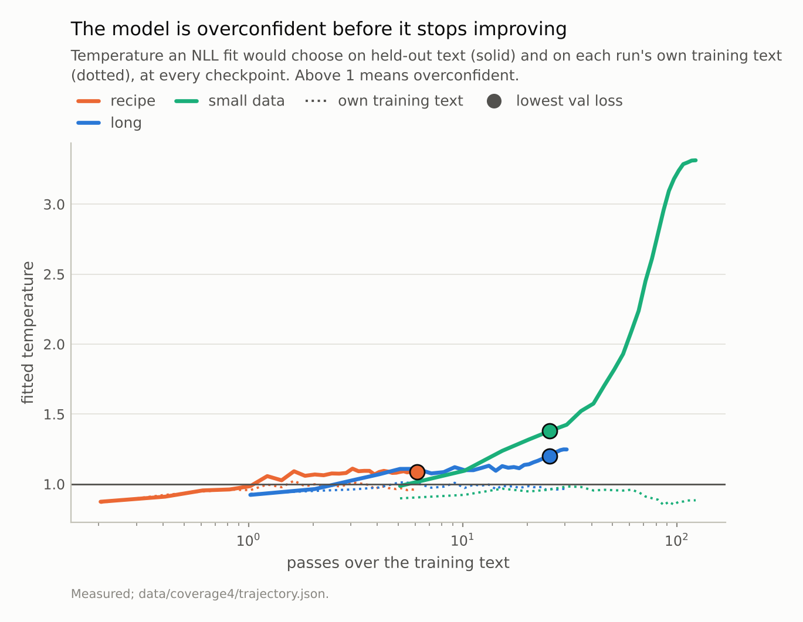
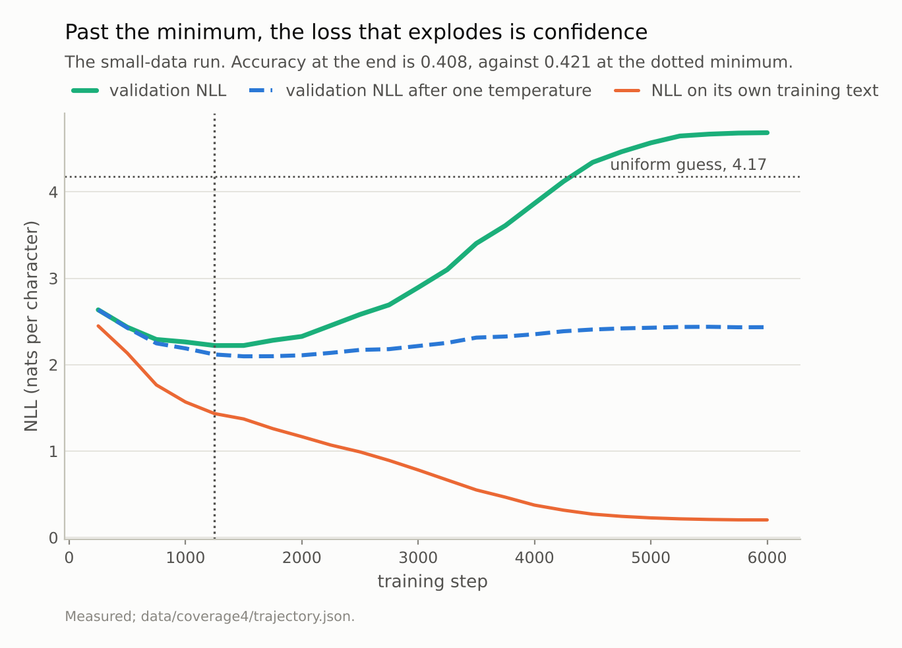
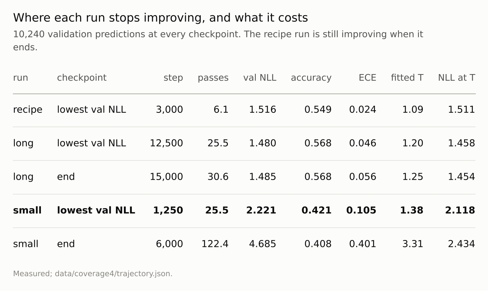

Disclosure: this post was written with the assistance of an AI system (Claude), which wrote the analysis code, ran the experiments and drafted the text. The topic, the constraints, the data choices and the final review are the author's.

*Three training runs of the same 816,128-parameter model, evaluated at every checkpoint on 10,240 held-out predictions. Every run starts slightly underconfident; overconfidence begins after one to ten passes over the training text and grows as training loss pulls away from validation loss. At the lowest validation loss the model already needs a temperature of 1.20 (fifteen thousand steps) or 1.38 (a tenth of the text), and a second seed gives 1.38. On its own training text the fitted temperature never exceeds 1.02. Past the minimum, the small-data run's validation NLL climbs to 4.68, worse than a uniform guess, with accuracy almost unchanged - and one temperature brings it back to 2.43.*

Episode 4 of *Uncertainty for Language Models, Taught Through What Breaks*. The syllabus and the other episodes: https://jongha-jeon-dev.github.io/standarderror/lectures/

## The question episode 3 left

Episode 3 measured a model that needed almost no temperature scaling: a fitted temperature of 1.10, a mild correction. It ended by asking why. Is a small transformer simply well calibrated, or was that the moment training happened to stop?

The syllabus guessed the answer. Overconfidence would arrive at a particular point: when validation loss stops improving and the model starts memorising. That guess is testable, and it needs something episode 3 did not have — the same model at many points in its training.

So the architecture was trained three times, with a checkpoint evaluated every few hundred steps on the same 10,240 validation predictions:

- **recipe** — the committed model's recipe: the full training text, 3,000 steps, about 6 passes over it;
- **long** — the same schedule stretched to 15,000 steps, about 31 passes;
- **small** — a tenth of the training text and 6,000 steps, about 122 passes, so that memorising is easy.

First, whether the rerun recipe is the same kind of model as the committed one.

```python
from standarderror.llm import tiny
from standarderror.uncertainty import trajectory as tj

committed = tj.evaluate(tiny.load()["model"])["val"]
rerun = tj.trajectory()["arms"]["recipe"][-1]["val"]
for name, r in (("committed", committed), ("rerun", rerun)):
    print(f"{name:9s}  val NLL {r['nll']:.4f}  accuracy {r['accuracy']:.4f}"
          f"  fitted T {r['fitted_t']:.3f}")
```

```text
committed  val NLL 1.5251  accuracy 0.5466  fitted T 1.094
rerun      val NLL 1.5162  accuracy 0.5491  fitted T 1.088
```

Close enough to stand in for it: validation NLL 1.516 against 1.525, fitted temperature 1.088 against 1.094. Training is not bit-reproducible across torch versions, so this is a sibling, not a copy, and the episode's claims are about runs, not about one set of weights.

## It arrives early

For every checkpoint, fit the temperature that minimises validation NLL. Below 1 the model is underconfident, above 1 it is overconfident.

```python
traj = tj.trajectory()
for arm in ("recipe", "long", "small"):
    rows = [r for r in traj["arms"][arm] if r["step"] > 0]
    first = next(r for r in rows if r["val"]["fitted_t"] >= 1.05)
    best = tj.turn(rows)
    at = next(r for r in rows if r["step"] == best["step"])
    print(f"{arm:6s}  T >= 1.05 from step {first['step']:>5,}   "
          f"lowest val NLL at {best['step']:>6,}, where T = "
          f"{at['val']['fitted_t']:.2f}")
```

```text
recipe  T >= 1.05 from step   600   lowest val NLL at  3,000, where T = 1.09
long    T >= 1.05 from step 2,000   lowest val NLL at 12,500, where T = 1.20
small   T >= 1.05 from step   500   lowest val NLL at  1,250, where T = 1.38
```

Every run *starts* underconfident — the lowest fitted temperature in each run's first few checkpoints is below 1 — and crosses into overconfidence early: after 1.2 passes for the recipe, 4.1 for the long run and 10 for the small one. Validation loss is still falling fast at that point, and goes on falling for thousands of steps.

When it finally bottoms out the model is not becoming overconfident; it already is. The long run's best checkpoint needs T = 1.20. The small-data run's best needs **T = 1.38**, with an ECE of 0.105 — 4 times the committed model's. The syllabus had the order backwards: stopping when validation loss stops improving does not stop before overconfidence, it stops well inside it.



*At its lowest validation loss the long run already needs T = 1.20 and the small-data run T = 1.38. **On their own training text, every run stays within 2% of 1.***

## It barely registers on the training text

The dotted lines in that figure are the same checkpoints scored on the text each run was trained on — for the small run, on its own tenth.

```python
for arm in ("recipe", "long", "small"):
    rows = [r for r in traj["arms"][arm] if r["step"] > 0]
    ts = [r["train"]["fitted_t"] for r in rows]
    gaps = [r["train"]["gap"] for r in rows]
    print(f"{arm:6s}  own-text T {min(ts):.2f} to {max(ts):.2f}   "
          f"confidence - accuracy {min(gaps):+.3f} to {max(gaps):+.3f}")
```

```text
recipe  own-text T 0.87 to 1.02   confidence - accuracy -0.017 to +0.020
long    own-text T 0.93 to 1.01   confidence - accuracy -0.011 to +0.014
small   own-text T 0.85 to 0.98   confidence - accuracy -0.025 to +0.001
```

On its own training text the model is never more than marginally overconfident. The fitted temperature stays between 0.85 and 1.02 across all runs; it touches 1.02 only briefly, during the high-learning-rate phase of the full-data runs. In the small-data run it never reaches 1 — not even at the end, when its training NLL is 0.20 nats per character and it has effectively memorised the text. If anything the model is slightly *under*confident there.

That reframes the question. Overconfidence is not something the model develops; it is what memorisation looks like from outside. The model learns to be sure of what it has seen, correctly, and carries that certainty to text it has not seen, where it is wrong. The fitted temperature on held-out text rises as the gap between training and validation loss opens, in every run, and the gap opens long before validation loss turns.

## Past the minimum, the loss is confidence

The small-data run shows what happens after the turn. Its validation NLL rises from 2.22 to 4.68 — past 4.17, the loss of guessing uniformly over all 65 characters. Read naively, the model ends up knowing less than nothing.

Its accuracy says otherwise: 0.408 at the end against 0.421 at the minimum, and it peaked at 0.434 *after* the minimum. The answers barely moved. What moved is how sure the model is of them, and a single temperature, T = 3.31, takes the final NLL from 4.68 to 2.43. Most of the "overfitting" in the loss curve is one scalar's worth of confidence.



*Validation NLL ends at 4.68, worse than guessing uniformly. One temperature, T = 3.31, brings it to **2.43**. The answers barely moved; the confidence in them did.*

## A second seed, and what early stopping is choosing

The small-data run is the strongest evidence, so it was repeated from a second seed.

```python
for arm in ("small", "small_seed1"):
    rows = [r for r in traj["arms"][arm] if r["step"] > 0]
    best = tj.turn(rows)
    at = next(r for r in rows if r["step"] == best["step"])
    print(f"{arm:11s}  lowest val NLL {best['value']:.4f} at step "
          f"{best['step']:,}   T there {at['val']['fitted_t']:.2f}   "
          f"T at end {rows[-1]['val']['fitted_t']:.2f}")
```

```text
small        lowest val NLL 2.2214 at step 1,250   T there 1.38   T at end 3.31
small_seed1  lowest val NLL 2.2339 at step 1,250   T there 1.38   T at end 3.31
```

Same picture: the best checkpoint already needs a temperature of 1.38, and the end 3.31. The end temperatures agreeing to the printed precision is a coincidence, not a copied run — the two start from different weights, see the text in a different order, and end at validation NLL 4.685 and 4.626.

That has a practical consequence for the most common way of choosing a checkpoint. Early stopping on raw validation NLL penalises overconfidence that one temperature would remove, so it stops on calibration rather than on what the model knows. Choosing the checkpoint by NLL *after* temperature scaling picks a different one:

```python
for arm in ("long", "small"):
    rows = [r for r in traj["arms"][arm] if r["step"] > 0]
    raw = min(rows, key=lambda r: r["val"]["nll"])
    cal = min(rows, key=lambda r: r["val"]["nll_at_fit"])
    print(f"{arm:5s}  stop on raw NLL: step {raw['step']:>6,} -> "
          f"{raw['val']['nll_at_fit']:.4f} after scaling")
    print(f"{'':5s}  stop on scaled NLL: step {cal['step']:>6,} -> "
          f"{cal['val']['nll_at_fit']:.4f}")
```

```text
long   stop on raw NLL: step 12,500 -> 1.4584 after scaling
       stop on scaled NLL: step 15,000 -> 1.4537
small  stop on raw NLL: step  1,250 -> 2.1183 after scaling
       stop on scaled NLL: step  1,500 -> 2.0966
```

In the long run, the checkpoint raw NLL would keep is beaten after scaling by the final one, 1.4537 against 1.4584: the extra 2,500 steps added knowledge and overconfidence together, and only the second is free to remove. In the small run the scaled choice moves from step 1,250 to 1,500. The differences are small here. The principle is not: if you will temperature-scale anyway, select the checkpoint on the scaled loss.



*The **bold** row is the checkpoint early stopping would keep, and it already needs a temperature of 1.38.*

## Where this breaks

**One architecture, one corpus, one schedule family.** All three runs use a one-cycle schedule, which entangles learning rate with time. The small run overfits while its learning rate is still rising to its peak and the long run while it anneals, and both become overconfident in the same way, which is the best evidence available here that the schedule is not the cause. It is not proof.

**The temperature is fitted on the rows it is scored on.** One parameter on 10,240 rows; the optimism this introduces is of order 1/n, about 0.0001 nats, far below every difference quoted.

**Two seeds for one arm.** The control repeats the arm with the largest effect. The long and recipe runs are single seeds, and the onset steps quoted for them should be read to the nearest few hundred.

**Character-level language modelling is easy to memorise.** A tenth of tinyshakespeare is about 100,385 characters for 816,128 parameters. The size of the effect at the end of the small run is a property of that ratio; the ordering — overconfident before the minimum, calibrated on the training text — held in every run that reached a minimum.

## What to keep

1. A rerun of the committed recipe reproduces it closely: validation NLL 1.516, fitted temperature 1.088.

2. Every run starts slightly underconfident and becomes overconfident early, while validation loss is still falling fast.

3. At the lowest validation loss the model already needs T = 1.20 (long run) or 1.38 (small data; 1.38 on a second seed). Early stopping does not stop before overconfidence.

4. On its own training text the model is at most marginally overconfident: fitted temperature 0.85 to 1.02 throughout, and below 1 for the whole small-data run. Overconfidence is memorisation seen from held-out text.

5. Past the minimum, validation NLL can pass the uniform-guess loss while accuracy holds; one temperature removes most of it (4.68 to 2.43).

6. If you will temperature-scale, choose the checkpoint on the scaled validation loss, not the raw one.

7. Episode 3's T = 1.10 was not a property of the architecture. It was a property of stopping at 6 passes.

## Exercise

If you train with checkpoints, you already have what this episode needed. Fit a temperature on validation data at each checkpoint and plot it against step, next to the validation loss. Note where the temperature crosses 1 and where the loss bottoms out. If the crossing comes first, as it did in every run here, then whichever checkpoint you shipped was overconfident when you shipped it, and the temperature you fitted afterwards was doing more work than you thought.

Then score the same checkpoints on a sample of the training data. If the fitted temperature there stays at 1 while the validation one climbs, your model's overconfidence is a generalisation gap: regularisation and more data are the levers, and temperature scaling is the repair. If the training-data temperature climbs too, something else — label noise, a loss that rewards overconfidence — is at work, and that is a different episode.

## Next

Episode 5 returns to the loose end episode 1 left: the error bar on conformal coverage, which episode 1 said was wider than exchangeability allows. Part of that turns out to have been my arithmetic.

---

### Data

- No external data. Every number is computed from model predictions on held-out text; no values from the text are published.
- Three training runs of the episode-1 architecture - four blocks, four heads, width 128, context 64 - from `scripts/train_coverage4.py`, plus a seed-1 repeat of the small-data run. Per-checkpoint metrics are committed in `data/coverage4/trajectory.json`; the final and lowest-loss checkpoints of each run are committed beside it with their sha256, so the endpoints can be recomputed from weights.
- Machinery: `standarderror/uncertainty/trajectory.py`, tested in `tests/test_coverage4.py`, which reloads the committed checkpoints and checks the trajectory file against them.
- Where this stops: Guo et al., "On calibration of modern neural networks", *ICML* (2017), who observed that overconfidence accompanies NLL overfitting while accuracy still improves; Mukhoti et al., "Calibrating deep neural networks using focal loss", *NeurIPS* (2020), on where in training it starts.

### Reproducibility

- **environment**: standarderror=0.1.0, python=3.13.16, torch=2.14.0+cu130, numpy=2.4.4
- **code blocks**: executed at build time against the committed trajectory file and checkpoint; the values the prose quotes are pinned, so drift fails the build
- **training**: each run restarts from a fixed seed with AdamW, weight decay 0.1, batch 32 and a one-cycle schedule peaking at 3e-3; not bit-reproducible across torch versions, which is why the checkpoints are committed
- **evaluation**: the same 10,240 validation predictions at every checkpoint, and the same number from the text each run trained on; the temperature is fitted on those rows

Code: <https://github.com/jongha-jeon-dev/standarderror>
