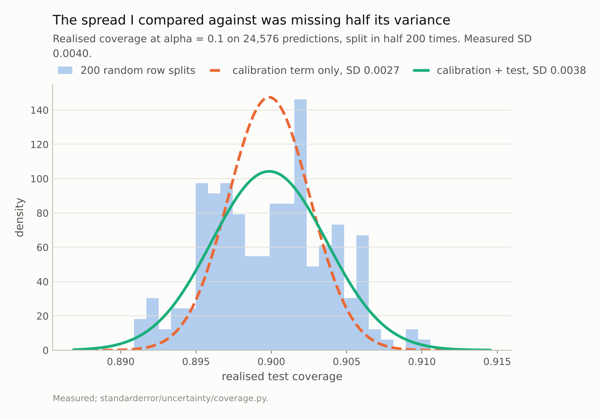
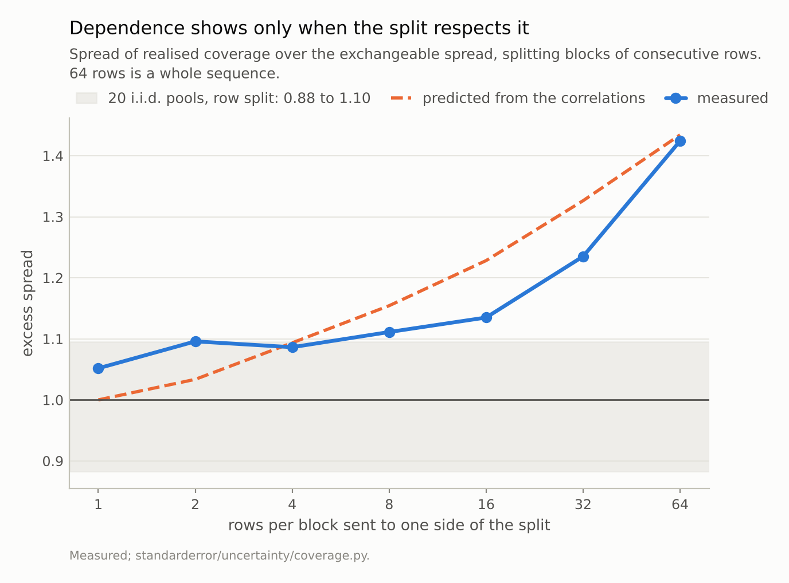
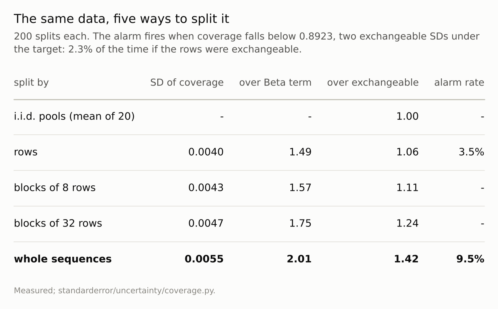

Disclosure: this post was written with the assistance of an AI system (Claude), which wrote the analysis code, ran the experiments and drafted the text. The topic, the constraints, the data choices and the final review are the author's.

*Over 200 random row splits of 24,576 predictions, realised conformal coverage at alpha = 0.1 has an SD of 0.0040, 1.49 times the Beta spread episode 1 compared it with. That comparison was short a term: the coverage is measured on a finite test half, and with the test half's binomial variance added the excess is 1.06, inside the 0.88 to 1.10 that i.i.d. pools of the same size produce. It has to be - a random row split of a fixed pool is exchangeable by construction. Splitting whole sequences instead, as a deployment does, gives 1.42x with the mean still 0.8999, and the within-sequence correlation of the coverage indicator predicts 1.43x before the split is run.*

Episode 5 of *Uncertainty for Language Models, Taught Through What Breaks*. The syllabus and the other episodes: https://jongha-jeon-dev.github.io/standarderror/lectures/

## The number episode 1 left open

Episode 1 ended on a promise. Split conformal's coverage was exactly what it guaranteed on average, but the error bar on that average was wider than exchangeability allows, "by a factor I did not expect and in a direction that gets worse when you do the obvious thing about it."

Here is the measurement behind that sentence.

```python
from standarderror.uncertainty import coverage as cv

pred = cv.predictions(count=24, size=16, seed=1)
row = cv.split_variability(pred, alpha=0.1, draws=200)
print(f"200 row splits: mean {row['mean']:.4f}  SD {row['sd']:.4f}")
print(f"Beta SD for n_cal = 12,288: {row['beta_sd']:.4f}"
      f"   ratio {row['sd_ratio']:.2f}")
```

```text
200 row splits: mean 0.8999  SD 0.0040
Beta SD for n_cal = 12,288: 0.0027   ratio 1.49
```

Two hundred random splits of 24,576 predictions into calibration and test halves, and the realised coverage moves with a standard deviation of 0.0040. The spread I compared it with, 0.0027, is the standard deviation of a Beta distribution: given a calibration set of n points, the coverage that its threshold delivers on fresh data is Beta-distributed, and its variance is alpha (1 - alpha) / (n + 2). The ratio is 1.49. I read that as the 384 sequences' overlapping contexts making the rows less exchangeable than the split pretends.

That reading is wrong, and the rest of this episode is about why, and about what is left once it is corrected.

## The formula was short a term

The Beta distribution describes the coverage a threshold *delivers* — the probability, over fresh test points, that one lands inside its set. Nobody observes that probability. What the split measures is the fraction of 12,288 test rows that landed inside, and that is a finite sample of it, with its own binomial variance alpha (1 - alpha) / n_test.

Two finite samples, two terms. With equal halves they are the same size, so leaving one out understates the spread by exactly the square root of two.

```python
# The threshold's coverage is Beta; the test half then estimates it.
full = cv.exchangeable_sd(12288, 12288, alpha=0.1)
print(f"calibration + test SD {full:.4f}   excess {row['sd'] / full:.2f}")

control = cv.iid_control(pred, alpha=0.1, pools=20, draws=200)
print(f"i.i.d. pools, same procedure: {control['low']:.2f} to "
      f"{control['high']:.2f}, mean {control['mean']:.2f}")
```

```text
calibration + test SD 0.0038   excess 1.06
i.i.d. pools, same procedure: 0.88 to 1.10, mean 1.00
```

With both terms the exchangeable spread is 0.0038, and the measured spread is **1.06 times** it. To know whether 1.06 is anything, the same procedure was run on twenty pools that are i.i.d. by construction: the model's own scores, resampled with replacement to the same size. They give 0.88 to 1.10. The row split sits inside that range. There is no excess to explain.

There could not have been. A random permutation of a fixed pool makes the calibration and test halves exchangeable *whatever* dependence the rows carry, because every assignment of rows to halves is equally likely. The rows inside one sequence are correlated, but a row split scatters each sequence across both halves, and the correlation is averaged away before it can move the threshold. A split that guarantees exchangeability is a test of exchangeability that cannot fail: a good property for a guarantee and a useless one for a test.



*Against the calibration term alone the measured spread is 1.49x; against both terms it is **1.06x**. Episode 1's 'factor I did not expect' was mostly the term I left out.*

## Split the way a deployment does

The question episode 1 was reaching for is a different one. A model is calibrated on some documents and then serves other documents. The split that mirrors that sends whole sequences to one side.

```python
seq = cv.grouped_split(pred, alpha=0.1, draws=200)
print(f"200 sequence splits: mean {seq['mean']:.4f}  SD {seq['sd']:.4f}"
      f"   excess {seq['excess']:.2f}")
```

```text
200 sequence splits: mean 0.8999  SD 0.0055   excess 1.42
```

The guarantee still holds: the mean over 200 sequence splits is 0.8999. Sequences are exchangeable with each other, and that is all split conformal needs. What changes is the spread around it: 0.0055, **1.42 times** the exchangeable spread, well outside anything the i.i.d. pools produced.

So the second half of episode 1's sentence survives. The obvious fix — split by sequence, so calibration and test share no context — does make the error bar wider, and that wider bar is the honest one. The row split is not wrong about the average. It is wrong about how far any one deployment can land from it, because it measures a situation, rows of the same document on both sides of the line, that a deployment never meets.

## The correlations predict it

An excess with no mechanism is a number. This one has a mechanism that can be measured separately and turned into a prediction before the split is run.

Mark each row by whether it would be covered at the pooled threshold, and measure how correlated that mark is between rows a given distance apart inside one sequence.

```python
rho = cv.lag_correlation(pred, alpha=0.1)
print("correlation at lags 1-6:", " ".join(f"{r:.3f}" for r in rho[:6]))
deff = cv.design_effect(rho, 64)
print(f"design effect {deff:.2f}   predicted excess {deff ** 0.5:.2f}"
      f"   rows worth {len(pred['y']) / deff:,.0f} independent ones")
```

```text
correlation at lags 1-6: 0.068 0.076 0.035 0.027 0.020 0.018
design effect 2.06   predicted excess 1.43   rows worth 11,948 independent ones
```

The correlations are small — 0.068 between neighbours, falling to 0.018 six characters apart — but a sequence has 64 rows and every pair contributes. The design effect from survey sampling adds them up: the variance of a block mean, over what it would be if the rows were independent. Its square root is the predicted excess, **1.43**, against 1.42 measured. For the purpose of coverage spread, 24,576 rows are worth about 11,948 independent ones.

The same prediction for blocks of 8 to 32 rows runs high, and the reason is useful. (Below 8 the two are within the noise of each other.) A block of 8 rows cut from a sequence of 64 leaves its neighbours, which it is correlated with, free to land on the other side of the split. The correlation then ties calibration to test and *narrows* the spread — the row split's averaging, in a weaker form. At 32 rows the prediction is 1.33 and the measurement 1.24; only when the block is the whole sequence is nothing left to leak.



*A row split sits inside the i.i.d. band. Whole sequences give **1.42x**, and the correlations predicted 1.43x. For blocks of 8 to 32 rows the prediction runs high: blocks cut from one sequence leave correlated neighbours on both sides.*

## What the wider bar costs

At 24,576 predictions the difference looks small in coverage units: an SD of 0.0055 instead of 0.0040. It is not small in what it does to anything that uses the spread.

Suppose you monitor a deployed conformal predictor and raise an alarm when realised coverage falls more than two exchangeable standard deviations below target, below 0.8923. If the rows were exchangeable that alarm would fire about 2.3% of the time with nothing wrong. Over the row splits it fired 7 times in 200, 3.5%, which is as close to 2.3% as 200 tries can resolve. Over the sequence splits, with the method working exactly as promised, it fired 19 times: **9.5%**.

That is the practical form of the mistake. The row split is the easy simulation to run, it agrees with the textbook once the textbook is read properly, and a threshold validated on it is crossed by chance about 4 times as often as intended once calibration and deployment are separate documents.



*The middle column is the comparison episode 1 made. The **fourth** is the one that tests exchangeability.*

## Where this breaks

**One model, one corpus.** The 1.42x belongs to character-level predictions in 64-character windows of one text. Longer documents, or predictions whose difficulty clusters more strongly within a document, will give more; the design effect is the tool for saying how much before measuring it.

**Sequence is the unit I had.** The 384 windows are drawn from one held-out stretch of text, so they are not independent documents either; a split by act or by speaker might show more. The correlation at long lags is small but positive (0.0038 on average beyond lag 8), which is the signature of difficulty shared across the whole window, and perhaps beyond it.

**The spread estimates have noise of their own.** A standard deviation from 200 splits is uncertain by about 5%. The i.i.d. range is the honest measure of that, and the conclusions here sit well outside it in one case and well inside it in the other.

**Nothing here touches the guarantee.** Marginal coverage held in every split: 0.8999 for rows, 0.8999 for sequences. This episode is about the error bar, not the promise.

## What to keep

1. Realised coverage is measured on a finite test set, so its spread has two terms: the Beta spread of what the calibration set delivers, and the binomial spread of estimating it. With equal halves, leaving out the second understates the spread by the square root of two.

2. With both terms, a random row split shows no excess: 1.06x, inside the 0.88 to 1.10 that i.i.d. pools give. Episode 1's 1.49x was my formula.

3. A random row split cannot detect dependence. It is exchangeable by construction.

4. Splitting whole sequences — the split a deployment makes — gives 1.42x, with marginal coverage intact at 0.8999.

5. The within-sequence correlation of the coverage indicator predicts it: a design effect of 2.06, so 1.43x, before the split is run. 24,576 rows are worth about 11,948.

6. A two-SD alarm that should fire 2.3% of the time fires 9.5% of the time under sequence splits.

## Exercise

Take whatever you used to validate a conformal predictor and find the unit a deployment would split on: the document, the patient, the customer, the day. Rerun the split variability with that unit held together. If the spread does not move, your rows were as good as independent and you have lost nothing. If it does, the larger number is the one to set thresholds with.

Then compute the correlation of the coverage indicator inside that unit and the design effect it implies. If it predicts the spread you measured, you have a way to size the next validation set without running it. If it does not, something other than within-unit correlation is moving your coverage, and that is worth knowing before a monitor tells you.

The uncomfortable version: if you reported an error bar on coverage from row-wise resampling of a dataset with any grouping in it, check whether the grouping was there. It usually is.

## Next

That closes the series. Each episode took a statement that is exactly true and found the gap one question further in: coverage averaged over the wrong population, an estimator biased by its bins, a fix that reorders what you refuse, an overconfidence that arrives before training stops improving, and an error bar that depends on how you split. The last of those gaps was partly mine, which is the reason to measure before writing — and to keep measuring after.

---

### Data

- No external data. Every number is computed from the committed model's predictions on held-out text; no values from the text are published.
- The model: an 816,128-parameter character-level transformer - four blocks, four heads, width 128, context 64, validation loss 1.573 against a uniform-guess 4.174. Weights, training script and a verified sha256 are committed: `standarderror/llm/tiny.py`, `scripts/train_tiny.py`, `data/tiny_gpt/`.
- Machinery: `standarderror/uncertainty/coverage.py`, tested in `tests/test_uncertainty.py`. The test that used to assert the 1.5x as a violation now asserts the opposite and keeps the old comparison alongside, so the mistake stays checkable.
- Where this stops: Vovk, Gammerman and Shafer, *Algorithmic Learning in a Random World* (2005); Angelopoulos and Bates, "A gentle introduction to conformal prediction and distribution-free uncertainty quantification" (2021), whose section on checking coverage gives the beta-binomial distribution of empirical coverage - both terms, which is where I should have looked; Kish, *Survey Sampling* (1965), for the design effect.

### Reproducibility

- **environment**: standarderror=0.1.0, python=3.13.16, numpy=2.4.4
- **code blocks**: executed at build time; the values the prose quotes are pinned, so drift fails the build
- **model**: the committed checkpoint, hash-verified on load, so every number is measured on the same weights
- **determinism**: row splits use seeds 0 to 199, block splits 10,000 to 10,199, and the i.i.d. pools a fixed generator; the sequence-split numbers are identical to the ones episode 1 measured

Code: <https://github.com/jongha-jeon-dev/standarderror>
