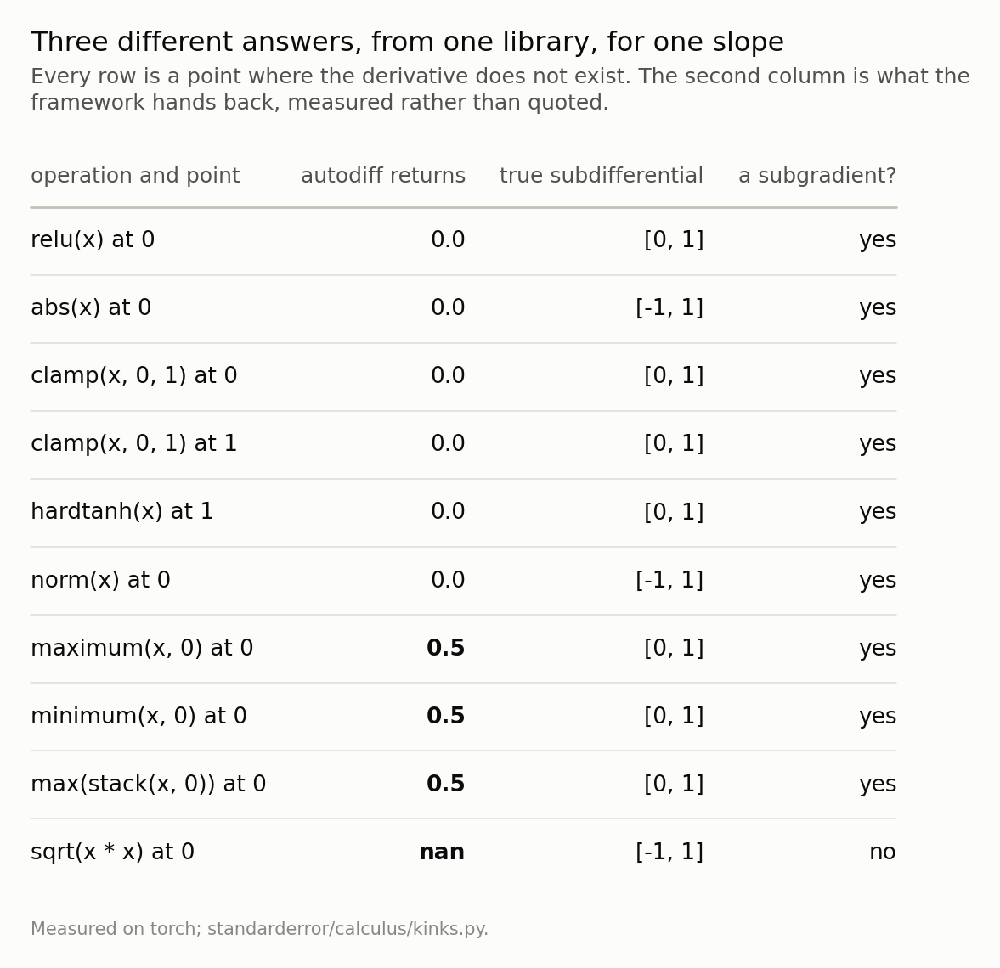
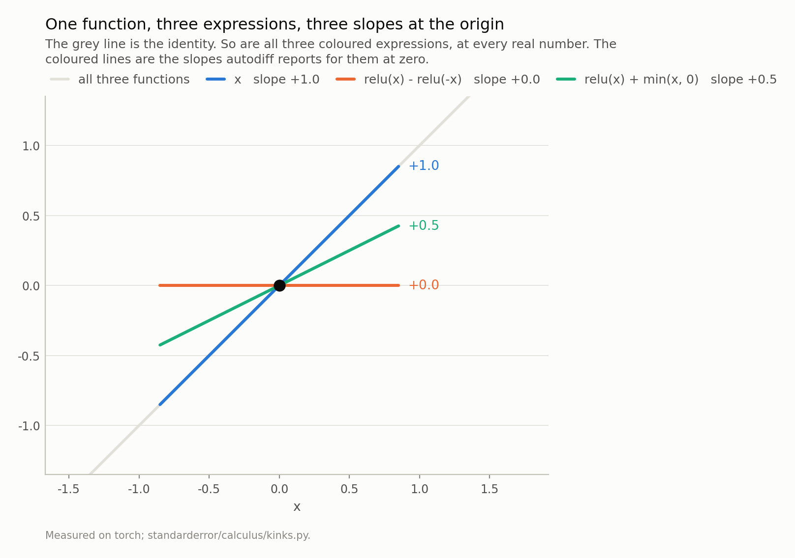
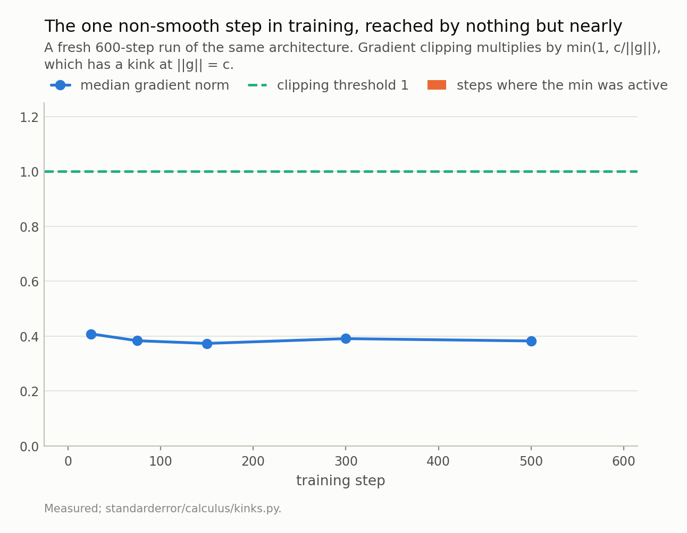
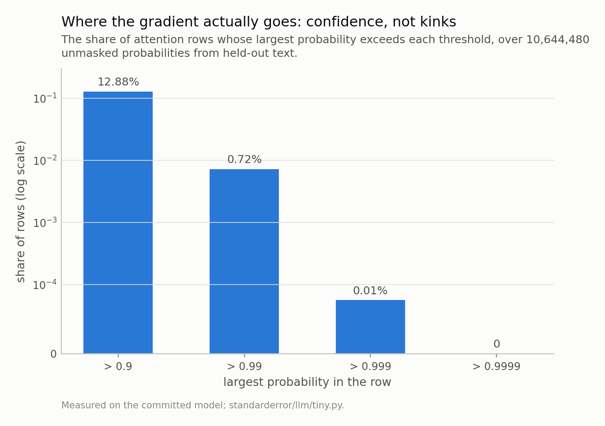

Disclosure: this post was written with the assistance of an AI system (Claude), which wrote the analysis code, ran the experiments and drafted the text. The topic, the constraints, the data choices and the final review are the author's.

*relu, abs, clamp, hardtanh and a vector norm all return 0 at their kinks; maximum, minimum and max split the tie and return 0.5; and sqrt(x·x), which is abs(x), returns nan where abs returns 0. Three answers from one library for one slope. The consequence is sharper than the inconsistency: the identity map written three ways that agree at every real number gives f'(0) = 1.0, 0.0 and 0.5, and two of those are not subgradients of the identity, whose subdifferential is the single point 1. Then the episode goes looking for this in the transformer and does not find it. GELU and LayerNorm are smooth, gradient clipping's min never activates in a 600-step run, and not one of 10.6 million unmasked attention probabilities is exactly 0 or exactly 1 in float32. One structural exception: position 0's attention row is a softmax over a single element, so it is the constant 1 and its gradient is identically zero - 5,120 of 5,120 first rows. What does throttle gradient flow is saturation, which is smooth: 12.9% of rows already have a maximum probability above 0.9, where the softmax passes under a tenth of the gradient.*

Episode 1 of *Calculus for Language Models, Taught Through What Breaks*. The syllabus and the other episodes: https://jongha-jeon-dev.github.io/standarderror/lectures/

## A slope where there is no slope

`relu` has no derivative at zero. The left slope is 0, the right slope is 1, and there is no number that is the derivative — the subdifferential is the whole interval from 0 to 1.

Ask a framework anyway and it will tell you 0.0, without a warning, in about a microsecond.

That is not a scandal. Optimisation on non-smooth functions is a well-developed subject, picking an element of the subdifferential is exactly what subgradient methods do, and the training runs that built every model you have used were full of these points. The interesting part is what the framework picks, whether the picks agree with each other, and — the question this episode was written to answer and then had to answer differently — whether any of it happens in a transformer.

## What the library actually picks

There are more of these points than `relu`. `abs` at zero, `clamp` at either bound, `hardtanh` at either bound, a vector norm at the origin, and every `max` and `min` at a tie. Ask for all of them.

```python
import torch

def slope(f, x0):
    x = torch.tensor([float(x0)], requires_grad=True)
    f(x).sum().backward()
    return float(x.grad[0])

zero = torch.zeros(1)
for name, f, x0 in (
        ("relu(x)          at 0", torch.relu, 0.0),
        ("abs(x)           at 0", torch.abs, 0.0),
        ("clamp(x, 0, 1)   at 1", lambda x: x.clamp(0.0, 1.0), 1.0),
        ("maximum(x, 0)    at 0", lambda x: torch.maximum(x, zero), 0.0),
        ("max(stack(x, 0)) at 0",
         lambda x: torch.stack([x[0], zero[0]]).max(), 0.0),
        ("sqrt(x * x)      at 0", lambda x: torch.sqrt(x * x), 0.0)):
    print(f"{name}   ->  {slope(f, x0):.1f}")
```

```text
relu(x)          at 0   ->  0.0
abs(x)           at 0   ->  0.0
clamp(x, 0, 1)   at 1   ->  0.0
maximum(x, 0)    at 0   ->  0.5
max(stack(x, 0)) at 0   ->  0.5
sqrt(x * x)      at 0   ->  nan
```

6 of the ten operations pick a one-sided slope and return 0. 3 of them split the tie and return 0.5. And `sqrt(x * x)` returns **nan** — which is the same function as `abs(x)`, differing only in how it was typed.

None of those is a mistake. At a kink there is no derivative to be right about, so somebody writing the kernel decided, and the decisions are local to each kernel. The trouble is what happens when you compose them.



*Six operations pick the left slope, three split the tie, and the square root of x squared - which is `abs(x)` - returns nan where `abs(x)` returns 0. None of these is wrong: at a kink there is no derivative to be right about, so the kernel author chose. The trouble is that they chose differently.*

## Differentiation of the expression, not of the function

Here is the sharpest form of it. Take the identity map, and write it three ways.

The first is `x`. The second is `relu(x) - relu(-x)`, which is *x* for positive *x*, *x* for negative *x*, and 0 at 0 — so it is the identity, everywhere, exactly. The third is `relu(x) + min(x, 0)`, same argument, same function.

All three are differentiable at every real number, with derivative 1. There is nothing subtle about the function: its subdifferential at zero is the single point {1}.

```python
# Three expressions. All three are the identity map, at every real
# number, and the last line of each block is the check.
forms = {
    "x":                   lambda x: x,
    "relu(x) - relu(-x)":  lambda x: torch.relu(x) - torch.relu(-x),
    "relu(x) + min(x, 0)": lambda x: torch.relu(x)
                                     + torch.minimum(x, zero),
}
pts = torch.tensor([-1.5, -0.25, 0.0, 0.25, 1.5])
for name, f in forms.items():
    same = bool(torch.allclose(f(pts), pts))
    print(f"{name:>20}  equals x everywhere: {same}   "
          f"autodiff f'(0) = {slope(f, 0.0):+.1f}")
```

```text
                   x  equals x everywhere: True   autodiff f'(0) = +1.0
  relu(x) - relu(-x)  equals x everywhere: True   autodiff f'(0) = +0.0
 relu(x) + min(x, 0)  equals x everywhere: True   autodiff f'(0) = +0.5
```

`x` gives 1.0. `relu(x) - relu(-x)` gives 0.0. `relu(x) + min(x, 0)` gives 0.5.

Two of those are not subgradients of the identity. They are not approximations of the derivative, they are not conservative choices, and they are not off by a little: one of them is 0 where the true and only answer is 1. What autodiff computes is a composition of choices made about the *pieces*, and the composition need not be a subgradient of the whole.

This is understood rather than surprising to the people who work on it. Bolte and Pauwels' object is the *conservative field* — a set-valued map that agrees with the gradient almost everywhere and behaves well enough under composition that gradient descent on it still converges, without being the subdifferential of anything. That is the honest description of what a framework hands you: not a gradient, and not a subgradient, but something that coincides with the gradient off a measure-zero set and is therefore almost always the thing you wanted.

"Almost always" is doing real work in that sentence, and the rest of this episode is about how often the exception is reached.

Before the counting, it is worth saying why this matters at all if the exception is rare, because "rare" is a strange thing to build on. Two reasons.

The first is that a rare event with a structural cause is not rare where it happens. A measure-zero set is invisible to a random probe and perfectly reachable by a construction, and the interesting non-differentiable points in a network are exactly the ones some structure puts there — a mask, an initialisation at zero, a hard threshold in a loss. A gradient check that samples a random input passes every time and says nothing about them.

The second is that the machinery above is what licenses a practice this series will get to: **deliberately** returning a number where no derivative exists. A straight-through estimator does not approximate a gradient that is merely hard to compute. It hands back the gradient of a *different function* and lets the chain rule carry it, which is the identity-written-three-ways trick used on purpose. Whether that is legitimate is not a matter of taste — it is the question of whether the resulting field is conservative for the function you actually care about — and it is episode 4.



*The subdifferential of the identity is the single point {1}, so two of these three answers are not subgradients of the function being differentiated - they are subgradients of the pieces, composed. Away from zero all three return 1.0, so nothing here shows up in a gradient check that samples a random point.*

## Where I expected this to bite, and did not find it

So: how often does a real training run land on a point where the derivative does not exist?

Start with the model. The transformer this series measures has no `relu` anywhere. Its MLP uses `GELU`, which is smooth — infinitely differentiable, no kinks. `LayerNorm` is smooth away from zero variance. The attention softmax is smooth. `masked_fill` is a selection rather than a kink, and its gradient at a masked position is exactly zero because the position genuinely does not participate. There is nothing in the forward pass to land on.

That leaves the training procedure, where there is exactly one non-smooth operation and everybody uses it: gradient clipping multiplies the gradient by `min(1, c / ||g||)`, which has a kink at `||g|| = c`. So I trained a fresh model and counted.

0 of 600 steps clipped — 0.0%. The median gradient norm sits at 0.39, comfortably under the threshold of 1.

But look at the maximum before concluding anything comfortable: the largest norm anywhere in the run was 0.98, which is 2% short of the kink rather than nowhere near it. The count is 0, and it is 0 by a margin of 0.02. A different seed, a slightly larger learning rate or a longer warmup and the answer would not be zero.

So the honest version is not "the kink is unreachable" but "this run did not reach it, narrowly". Which still refuses the premise this episode was drafted on — that non-differentiability is a live problem in practice — while being a weaker statement than I would have written from the median alone.



*0 of 600 steps clipped, 0.0%, on a median gradient norm of 0.39. The bars are the answer and the maximum is the caveat: the largest norm in the run was 0.98, only 2% short of the dashed line. Zero, but not by much.*

One more place to look. A softmax probability of exactly 0 or exactly 1 in float32 would be a point where the gradient is not merely small but identically zero, and where no choice of subgradient could restore it, because the function really is locally constant there.

```python
# And now the model. Are any of its attention probabilities exactly 0
# or exactly 1, where no choice of subgradient could help?
from standarderror.calculus import kinks as kk

a = kk.attention_survey(count=20)
print(f"unmasked probabilities examined  {a['probabilities']:,}")
print(f"  exactly 0.0                    {a['exact_zero']}")
print(f"  exactly 1.0                    {a['exact_one']}")
print(f"  below 1e-6                     {a['below_micro']:,}"
      f"  ({a['below_micro_share']:.1%})")
print()
print(f"first rows (position 0), one per head per layer per sequence")
print(f"  exactly one-hot by the mask    "
      f"{a['first_rows_onehot']:,} of {a['first_rows']:,}")
```

```text
unmasked probabilities examined  10,644,480
  exactly 0.0                    0
  exactly 1.0                    0
  below 1e-6                     762,712  (7.2%)

first rows (position 0), one per head per layer per sequence
  exactly one-hot by the mask    5,120 of 5,120
```

Not one, in 10,644,480 of them. 762,712 are below 1e-6 — 7.2% — which is small, but small is not zero and the chain rule does not care about small.

And then the last line, which is the one thing this search did find. **Every first row is exactly one-hot**: 5,120 of 5,120, in every head, of every layer, for every sequence. Not because the model learned anything. Because the causal mask leaves position 0 attending only to itself, so its attention is a softmax over a single element, so it is the constant function 1, so its gradient is identically zero.

That is the only place in this network where the derivative is exactly zero rather than approximately, and it was put there by the mask rather than by training, and it cannot be fixed by choosing a better subgradient because there is no kink — the function is constant. Whether it matters is a separate question and probably it does not: position 0 has nothing to attend to, so there is nothing for the gradient to say. But it is the honest answer to "where in this model does the chain rule's hypothesis fail", and it is not where I looked.

## The one way this model can produce a non-number

While looking, one genuine trap turned up, and it is worth a paragraph because the usual mental model puts it in the wrong place.

A fully masked attention row — every position masked, which happens when a padding scheme and a causal mask are combined carelessly — is a softmax over all `-inf`. Every exponential is 0, the normaliser is 0, and the row comes out as `nan`. In the **forward** pass, not the backward one: by the time the loss is computed the NaN is already in the activations, and the gradient that follows is a consequence rather than the cause. Measured: `forward_all_nan` is True.

People debugging this look at the backward pass, because "NaN gradient" is the phrase they have heard. The NaN is upstream.

## What actually throttles the gradient

The search failed, and what it turned up instead is the subject of the next episode, so it is worth stating precisely.

The gradient through a softmax scales like *p*(1 − *p*). Nothing in this model reaches *p* = 1, where that would be zero. But it does not need to: the largest probability in the survey is 0.9999, and 12.9% of rows have a maximum above 0.9, where *p*(1 − *p*) is already under a tenth of its value at 0.5. 0.72% are above 0.99, where it is under a hundredth.

That is not a kink, a subgradient choice, or a numerical edge case. It is a smooth function with a small derivative, which is a completely different failure and a much more common one. The chain rule's hypotheses hold perfectly; the product it forms is simply tiny.



*Not one probability in this survey is exactly 0 or exactly 1, and the largest is 0.9999. But the gradient through a softmax scales like p(1 - p), so the 12.9% of rows above 0.9 are already passing under a tenth of it - perfectly smoothly, with a derivative that exists everywhere. That is the next episode.*

## What to keep

1. Autodiff returns a float at every non-differentiable point, and the float is a kernel author's choice. Within one library: 6 of ten operations return 0, 3 split the tie at 0.5, and `sqrt(x*x)` returns nan where `abs(x)` returns 0.
2. So differentiation is a function of the **expression**. The identity written three ways gives f'(0) = 1.0, 0.0 and 0.5, and two of those are not subgradients of the identity at all.
3. What a framework gives you is best described as a conservative field: it agrees with the gradient off a measure-zero set, which is almost always enough and is not the same claim as "it is the gradient".
4. None of it appears in this transformer. GELU and LayerNorm are smooth, and clipping's `min` was active on 0 of 600 steps — though the largest gradient norm reached 0.98 against a threshold of 1, so that zero has a margin of 0.02 and not more.
5. Except structurally: position 0's attention row is a softmax over one element, so its gradient is identically zero — 5,120 of 5,120 first rows, put there by the mask.
6. A fully masked row is `nan` in the **forward** pass. Look upstream of the gradient.
7. What does throttle the gradient is confidence, not kinks: 12.9% of rows are past *p* = 0.9, where a softmax passes under a tenth of the gradient, perfectly smoothly.

## Exercise

Write the identity map in a fourth way that autodiff mis-differentiates at a point of your choosing, and then in a fifth way that it gets right. The difference between your two constructions is the whole content of the conservative-field story, and it is worth having found it yourself rather than read it.

Then instrument your own training loop for one epoch. Count the steps on which gradient clipping was active, and log the smallest and largest element of any softmax the model computes. Two numbers, one hook, no experiment design.

If clipping is active on most steps, your threshold is doing something other than protecting you from outliers and it is worth knowing which. If any probability is exactly 0 or exactly 1, you have found a place where the gradient is identically zero, and the interesting question is whether the mask put it there or the training did.

The uncomfortable part: if neither of those fires, you have learned that the failure you were worried about is not the failure you have, which is the position this episode ended in.

---

### Data

- No external data. The kink catalogue is measured on torch at build time rather than quoted, because kernel choices change between releases; the model measurements are counts over held-out text from the corpus the model was trained on, and no values from it are published.
- The model: an 816,128-parameter character-level transformer trained for this series - four blocks, four heads, width 128, context 64, validation loss 1.573 against a uniform-guess 4.174. Weights, training script and a verified sha256 are committed: `standarderror/llm/tiny.py`, `scripts/train_tiny.py`, `data/tiny_gpt/`.
- Machinery: `standarderror/calculus/kinks.py`, tested in `tests/test_kinks.py`.
- Where this stops: Bolte and Pauwels, "A mathematical model for automatic differentiation in machine learning", *NeurIPS* (2020), for why composing chosen subgradients need not produce a subgradient of anything, and for the conservative fields that make it work for optimisation regardless; Kakade and Lee, "Provably correct automatic subdifferentiation for qualified programs", *NeurIPS* (2018), for the conditions under which the composition is correct; Griewank and Walther, *Evaluating Derivatives* (2nd ed., 2008), for non-smoothness in automatic differentiation generally.

### Reproducibility

- **environment**: standarderror=0.1.0, python=3.11.15, torch=2.14.0, numpy=2.4.4
- **code blocks**: executed at build time; the values the prose quotes are pinned, so drift fails the build
- **model**: the committed checkpoint, hash-verified on load, so every count here is a count over the same weights
- **determinism**: the attention survey draws 20 batches of 16 held-out sequences from a fixed seed; the clipping run is a fresh 600-step training run under torch.manual_seed(0), which is reproducible on this platform and not guaranteed across torch versions

Code: <https://github.com/jongha-jeon-dev/standarderror>
