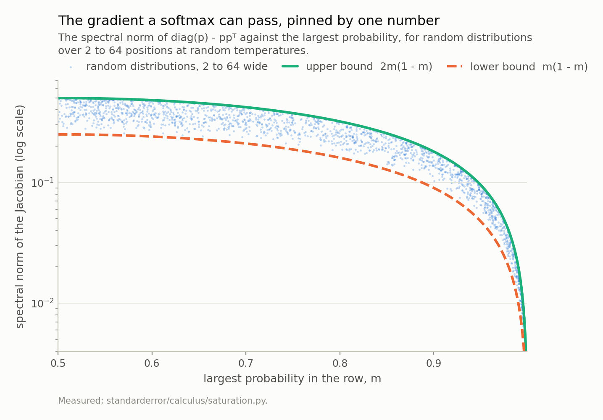
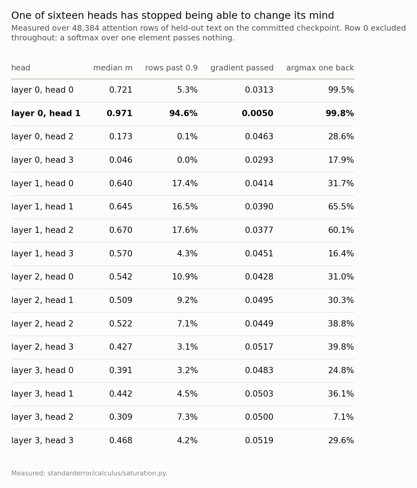
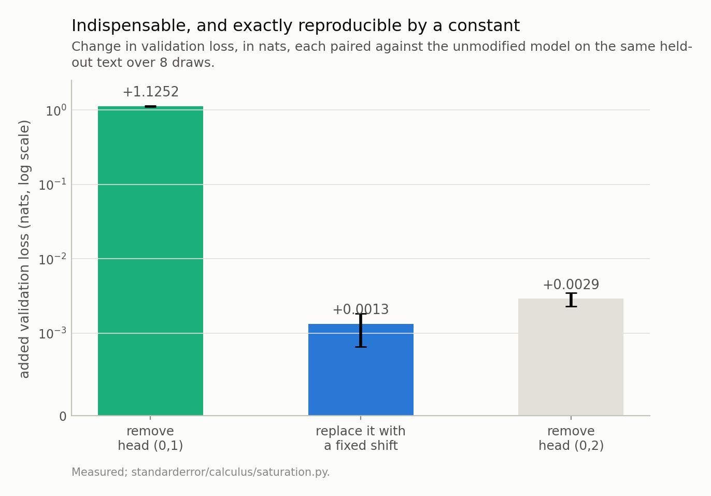
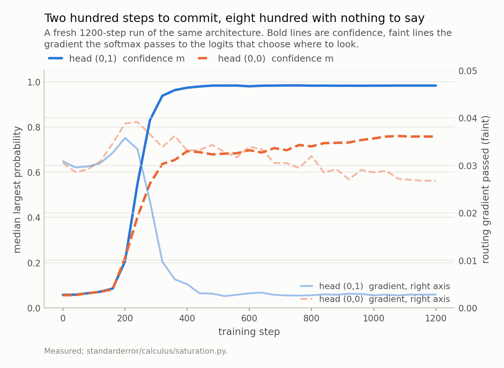

Disclosure: this post was written with the assistance of an AI system (Claude), which wrote the analysis code, ran the experiments and drafted the text. The topic, the constraints, the data choices and the final review are the author's.

*The softmax Jacobian is diag(p) minus p pᵀ, its quadratic form is exactly a variance under p, and so its spectral norm is trapped between m(1 - m) and 2m(1 - m) where m is the largest probability - checked on 25,443 random distributions with no violations and the upper end attained to nine digits. The width of the row does not appear: a 64-way softmax at m = 0.99 has the gradient capacity of a two-way one. On the committed model the bound turns out to be a predictor rather than a ceiling, the realised gain scaling as 2m(1 - m) to the power 1.03. Then the finding: layer 0 head 1 sits at m = 0.97, puts its argmax one position back on 99.8% of rows, and passes 5.9 times less routing gradient than the next-lowest head - while being the head the model cannot lose, since zeroing it costs 1.12 nats and replacing it with a fixed shift-by-one permutation costs 0.0013. Across a fresh run the commitment takes 200 steps and then holds for 800 more while the loss keeps falling.*

Episode 2 of *Calculus for Language Models, Taught Through What Breaks*. The syllabus and the other episodes: https://jongha-jeon-dev.github.io/standarderror/lectures/

## The gradient is a variance

Episode 1 asked where a transformer lands on a point that has no derivative, and the answer was almost nowhere. What it found instead was confidence: 12.8% of this model's attention rows put more than 0.9 of their mass on a single position. That is not a kink. The softmax is smooth there, the chain rule's hypotheses hold exactly, and the number the chain rule produces is nearly zero anyway.

Here is why, in one line. For `p = softmax(z)` the Jacobian is `diag(p) - p p^T`, and for any vector *u*

$$
u^{\top} \big( \operatorname{diag}(p) - p p^{\top} \big) u = \sum_i p_i u_i^2 - \Big( \sum_i p_i u_i \Big)^2 = \operatorname{Var}_p(u).
$$

The quadratic form of the softmax Jacobian is a **variance under its own output**. So the largest amount by which the Jacobian can stretch any unit vector is the largest variance a unit vector can have under *p*, and a distribution that has nearly all its mass on one atom has nearly no variance to give. Confidence and gradient are not two facts about a softmax. They are the same fact.

## How tight that is

Tight enough to be a number rather than an intuition. Write *m* for the largest probability in the row. Then for *m* at least one half,

$$
m(1-m) \le \big\lVert \operatorname{diag}(p) - p p^{\top} \big\rVert_2 \le 2 m(1-m).
$$

Both halves are short. The lower bound is one diagonal entry: a positive semi-definite matrix has its largest eigenvalue at least as big as any diagonal entry, and the winner's diagonal entry is exactly *m*(1 − *m*). The upper bound takes *c* = *u* at the winning coordinate in the inequality Var ≤ E(*u* − *c*)², which leaves a sum over the losers and bounds each squared difference by 2, giving 2(1 − *m*); the sharper constant comes from the losing mass being able to sit on at most one runner-up.

What that says is stronger than it first looks. The bound has no *n* in it. **How many positions the row has does not appear.**

```python
import numpy as np
from standarderror.calculus import saturation as sat

# Two rows with the same largest probability and very different
# widths. The bound depends on m alone, so it cannot tell them apart.
wide = np.r_[0.99, np.full(63, 0.01 / 63)]
narrow = np.array([0.99, 0.01])
for name, p in (("64 positions", wide), ("2 positions", narrow)):
    g = sat.spectrum(p)
    print(f"{name:>13}   ||J|| = {g['spectral_norm']:.6f}   "
          f"bounds {g['lower_bound']:.6f} .. {g['upper_bound']:.6f}")
print()
g = sat.spectrum(narrow)
print(f"trace {g['trace']:.9f}  ==  1 - sum p^2 = "
      f"{g['collision']:.9f}")
print(f"smallest eigenvalue {g['smallest']:+.1e}   "
      f"(the constant direction, deleted)")
```

```text
 64 positions   ||J|| = 0.010057   bounds 0.009900 .. 0.019800
  2 positions   ||J|| = 0.019800   bounds 0.009900 .. 0.019800

trace 0.019800000  ==  1 - sum p^2 = 0.019800000
smallest eigenvalue +9.5e-18   (the constant direction, deleted)
```

A 64-way softmax at *m* = 0.99 and a two-way softmax at *m* = 0.99 have the same gradient capacity, to within the same factor of two. Widening the context window does not give a saturated head more room to change its mind; it gives it more positions to be equally uninterested in.

The other two lines are worth a sentence each. The trace of the Jacobian is exactly 1 − Σ*p*², the complement of the probability that two independent draws from *p* agree — not the Shannon entropy, which is the quantity usually reached for when someone says the attention is diffuse, and which is not equal to it even up to a constant. Checked against the model's own rows, the identity holds to 1.9e-07. And the Jacobian annihilates the all-ones vector exactly - the snippet's smallest eigenvalue is what a float eigensolver prints for zero - because adding a constant to every logit does not move the softmax. That is not a numerical accident: it means **the logit gradients inside any one attention row sum to exactly zero**, always, in every head of every model. Measured on a real backward pass, that sum is 5.4e-08 of the row's own scale, which is float32 saying zero. One direction of the gradient is deleted by the function itself, and that turns out to be the theme of episode 3.



*25,443 random distributions, none outside the band. The two curves are a factor of (1 + m)/m apart, which is under 2.01 above m = 0.99, so the largest probability fixes the gradient capacity to within a factor of two - and the **width of the row does not appear**. The highest measured point sits at 1.000000000 of the upper bound.*

## A bound that predicts rather than caps

A bound on the norm is a bound on the worst case, and the gradient a real backward pass delivers is not the worst case — it is whatever direction the loss happens to want, which is generally not the top eigenvector. So the honest question is not whether the bound holds but whether it is informative.

It is, more than I expected. Over 48,384 attention rows of held-out text, the realised gain — the norm of the logit gradient divided by the norm of the incoming gradient — scales as 2*m*(1 − *m*) to the power 1.03, with a constant of 0.128. Slope one, in other words, with about an eighth of the available capacity actually used, and that fraction roughly constant across confidence levels. The bound is a proportional predictor and not merely a ceiling.

Which lets the whole thing be restated as a rate. If routing changes at a speed proportional to 2*m*(1 − *m*), then relative to a head at *m* = 0.5 a head at *m* = 0.98 needs about 13 times as many steps to make the same change to where it looks, and a head at 0.9999 — the largest probability episode 1 found in this model — needs about 2,500 times as many. Saturation does not forbid a head from changing its mind. It multiplies the time.

## One head of sixteen

So who is saturated? Ask every head.

```python
# Sixteen heads of the committed model, ranked by the gradient their
# softmax lets through to the logits that decide where to look.
g = sat.attention_gain(count=6, size=8)
print(f"rows {g['rows']:,}   "
      f"logit gradients sum to {g['row_sum_median']:.1e} of the "
      f"row L1")
print(f"realised gain scales as 2m(1-m) to the power "
      f"{g['log_slope']:.2f}, constant {g['log_constant']:.3f}")
print()
for h in sorted(g["heads"], key=lambda r: r["median_gain"])[:3]:
    print(f"  layer {h['layer']} head {h['head']}   "
          f"m {h['median_max_p']:.3f}   "
          f"gain {h['median_gain']:.4f}   "
          f"argmax one back on {h['previous_token_share']:.1%}")
```

```text
rows 48,384   logit gradients sum to 5.4e-08 of the row L1
realised gain scales as 2m(1-m) to the power 1.03, constant 0.128

  layer 0 head 1   m 0.971   gain 0.0050   argmax one back on 99.8%
  layer 0 head 3   m 0.046   gain 0.0293   argmax one back on 17.9%
  layer 0 head 0   m 0.721   gain 0.0313   argmax one back on 99.5%
```

Layer 0, head 1 — median confidence 0.971, 94.6% of its rows past 0.9, and a routing gradient of 0.0050 against 0.0293 for the next-lowest head and 0.0519 for the softest. A factor of 5.9 even against its nearest rival, and 10.4 against the far end.

And the last column says what it committed to: on 99.8% of rows its argmax is exactly one position back. It is a previous-token head, which is the most-documented circuit component there is and exactly the thing a first layer is expected to build. This is not a head that got stuck on noise.



*Two heads in layer 0 found the same rule - attend one position back - and only one of them committed to it. Head (0,1) is at m = 0.971 and passes 0.0050; the next-lowest head in the model passes 0.0293 and the softest 0.0519. The last column is why that matters: this is not a head that got stuck on nothing.*

## The part that changes the story

At this point the draft I was writing said: a saturated head has stopped learning, which is a problem. Two measurements later it does not say that.

The first is an ablation. If the head has stopped learning, how much does the model depend on what it learned?

```python
# So the head barely learns any more. Does the model need it?
a = sat.ablations(layer=0, head=1, control=2,
                  draws=8, count=10, size=16)
print(f"baseline validation loss        {a['baseline']:.4f}")
for k, label in (("zeroed", "zero the head"),
                 ("shift_by_one", "force a hard shift-by-one"),
                 ("control_zeroed", "zero head (0,2)")):
    print(f"  {label:<26} {a[k]['delta']:+.4f} nats "
          f"(sd {a[k]['sd']:.4f})")
```

```text
baseline validation loss        1.5580
  zero the head              +1.1252 nats (sd 0.0210)
  force a hard shift-by-one  +0.0013 nats (sd 0.0005)
  zero head (0,2)            +0.0029 nats (sd 0.0006)
```

Removing it costs 1.1252 nats. For scale, the whole distance this model travelled from a uniform guess is 2.60 nats, so removing one head of sixteen undoes 43% of that distance. Ablation deltas do not add up across a network, so that is a scale rather than a decomposition. Zeroing a different head in the same layer costs 0.0029.

The second measurement is the one that reframes it. Replace the head's attention — not its values, just the softmax output that decides where to look — with a hard-wired permutation matrix that always attends exactly one position back. No learning, no logits, a constant.

0.0013 nats. About 841 times less than removing it, and inside the draw-to-draw noise of the loss itself.

So the head is not failing to learn something it needs. It is **already a constant**, functionally, and the gradient that could move it is gone because there is nowhere left for it to go. Saturation here is not a pathology. It is what commitment looks like from the inside of a Jacobian.



*Removing head (0,1) costs 1.125 nats, which is 43% of the distance this model travelled from a uniform guess. Replacing its attention with a fixed shift-by-one permutation matrix costs 0.0013 - about 841 times less. The head is essential and it is also, by now, a constant.*

## When the commitment happened

One checkpoint cannot separate "the gradient vanished and froze the head" from "the head arrived at the right answer and the gradient correctly went quiet". For that you need the path, so here is a fresh 1200-step run of the same architecture under the same seed, with every head's confidence and routing gradient logged every 40 steps.

The shape is unambiguous. For the first 120 steps head (0,1) sits near uniform: confidence 0.07, and its argmax one position back on 10% of rows. Between steps 200 and 400 it crosses — confidence 0.21 to 0.97, previous-token share 0.52 to 1.00 — and its routing gradient **rises** on the way in, peaking at 0.0358 around step 200, before collapsing to 0.0028.

That peak is worth a caveat, because it is not where the capacity peaks. 2*m*(1 − *m*) is largest at *m* = 0.5, and the realised gradient turns over at *m* = 0.21 — earlier. So the incoming gradient is shrinking at the same time the capacity is growing, and what a head actually receives is the product of the two. The bound governs the ceiling and the ceiling's shape; it does not govern when the loss stops asking.

After that it does not move again. 800 more steps within 0.010 of the same confidence, while the loss falls from 2.03 to 1.68. The model kept learning for two thirds of training with that head's routing frozen — and it needed the head the whole time.

The control is in the same layer. Head (0,0) also found the previous-token rule — by the end of the run its argmax is one position back on 98.8% of rows — and it stopped at *m* = 0.76 rather than 0.98. It ended with 10 times more routing gradient, and over the last 800 steps its previous-token share was still climbing, from 0.921 to 0.988, while its neighbour's had been pinned at 1.000 since step 400. Two heads, one rule, one crossed the hump and one did not.

Which is the honest reading of the whole episode, and it is not the one I drafted. The mechanism by which a softmax makes a decision — pushing mass onto one option — is the same mechanism that removes the gradient which could revise it. That is not a flaw to be fixed; it is what deciding *is*, when your only instrument is a derivative. It is also why the `1/sqrt(d)` in front of the attention logits exists: not for numerical stability, but to keep *m* on the near side of the hump at initialisation, so that a head has some gradient with which to choose before it can commit.

Where it would be a flaw is a head that crosses early onto a rule that is merely adequate. This model does not give me that case, and I am not going to manufacture one. But the rate calculation above says what it would cost: a step of routing change at *m* = 0.98 arrives about 13 times slower than the same step at *m* = 0.5, so a head that commits badly at step 300 is not going to think better of it by step 3,000.



*Head (0,1) crosses from near-uniform to m = 0.97 between steps 200 and 400, and its routing gradient collapses on the way through. It then holds that value for the remaining 800 steps while the loss falls from about 2.03 to 1.68. Head (0,0) stopped at roughly three quarters, ended the run passing 10 times more gradient than its neighbour, and was **still** moving at the end.*

## What to keep

1. The softmax Jacobian's quadratic form is a variance under its own output. Everything else here follows from that sentence.

2. So the gradient it passes is trapped between *m*(1 − *m*) and 2*m*(1 − *m*), where *m* is the largest probability — checked on 25,443 random distributions with no violations and the upper end attained to 1.000000000. The number of positions does not enter.

3. The trace is exactly 1 − Σ*p*², a collision probability, and not the entropy. The Jacobian annihilates the all-ones vector exactly, so **the logit gradients within an attention row sum to zero** in every softmax that has ever been trained.

4. On this model the bound predicts rather than caps: the realised gain goes as 2*m*(1 − *m*) to the power 1.03 with a constant near an eighth. Read as a rate, a head at *m* = 0.98 revises its routing about 13 times slower than one at 0.5.

5. Layer 0 head 1 is at *m* = 0.971, is a previous-token head on 99.8% of rows, and passes 5.9 times less routing gradient than the next-lowest head in the model, and 10.4 times less than the softest.

6. It is also the head the model cannot lose — 1.125 nats — and it is reproduced by a fixed permutation matrix for 0.0013. Both of those at once is the finding.

7. So saturation is not a failure mode here. It is the shape of a decision, and the `1/sqrt(d)` scale exists to postpone it.

## Exercise

Take any attention implementation you have and log two numbers per head per step: the median largest probability, and the norm of the gradient reaching the attention logits divided by the norm of the gradient reaching the probabilities. Plot the second against 2m(1 − m) on log axes. If the slope is not close to one, something between your softmax and your loss is not what you think it is, and finding out which thing is a better afternoon than reading about it.

Then find your most confident head and replace its attention with the best fixed pattern you can guess — a shift, a first-token sink, a fixed local window. If the loss barely moves, you have learned that a parameter count and a functional degree of freedom are different things, and you have learned it about your own model rather than about the 816,128-parameter one here.

The uncomfortable version: do it early in training instead. A head you can replace with a constant at step 300 is a head that will be a constant at step 30,000, and the interesting question is whether it picked the constant you would have picked.

---

### Data

- No external data. The bound is checked on distributions drawn at build time; every model number is a count or a loss on held-out text from the corpus the model was trained on, and no values from that text are published.
- The model: an 816,128-parameter character-level transformer trained for this series - four blocks, four heads, width 128, context 64, validation loss 1.573 against a uniform-guess 4.174. Weights, training script and a verified sha256 are committed: `standarderror/llm/tiny.py`, `scripts/train_tiny.py`, `data/tiny_gpt/`.
- Machinery: `standarderror/calculus/saturation.py`, tested in `tests/test_saturation.py`, which pins the algebra exactly and the model findings as inequalities.
- Where this stops: Bridle, "Probabilistic interpretation of feedforward classification network outputs, with relationships to statistical pattern recognition" (1990), for the softmax and its Jacobian; Elhage et al., "A mathematical framework for transformer circuits", *Transformer Circuits Thread* (2021), for previous-token heads and why a first-layer head becomes one; Vaswani et al., "Attention is all you need", *NeurIPS* (2017), for the 1/sqrt(d) scale, which exists precisely to keep m away from 1 at initialisation.

### Reproducibility

- **environment**: standarderror=0.1.0, python=3.11.15, torch=2.14.0, numpy=2.4.4
- **code blocks**: executed at build time; the values the prose quotes are pinned, so drift fails the build
- **model**: the committed checkpoint, hash-verified on load, for every static number; the trajectory is a separate fresh run and is labelled as one
- **determinism**: the survey draws 6 batches of 8 held-out sequences from a fixed seed; the ablations are paired against the unmodified model on the same text over 8 draws; the trajectory is a fresh 1200-step run under torch.manual_seed(0), reproducible on this platform and not guaranteed across torch versions

Code: <https://github.com/jongha-jeon-dev/standarderror>
