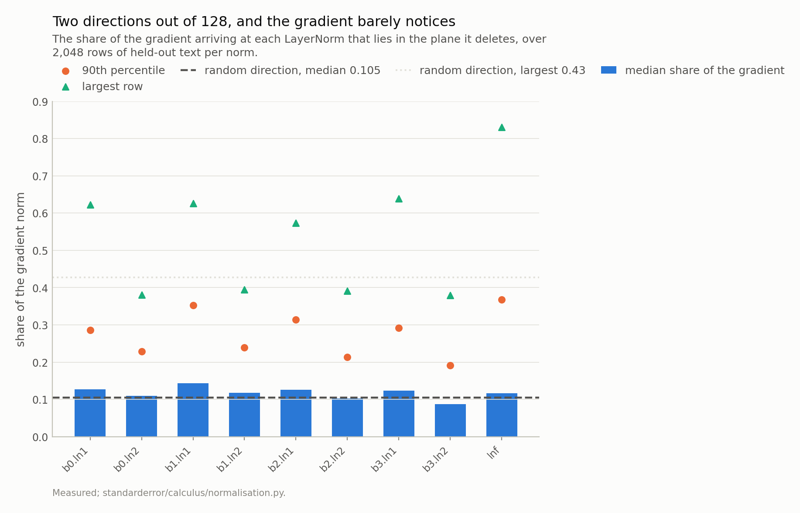
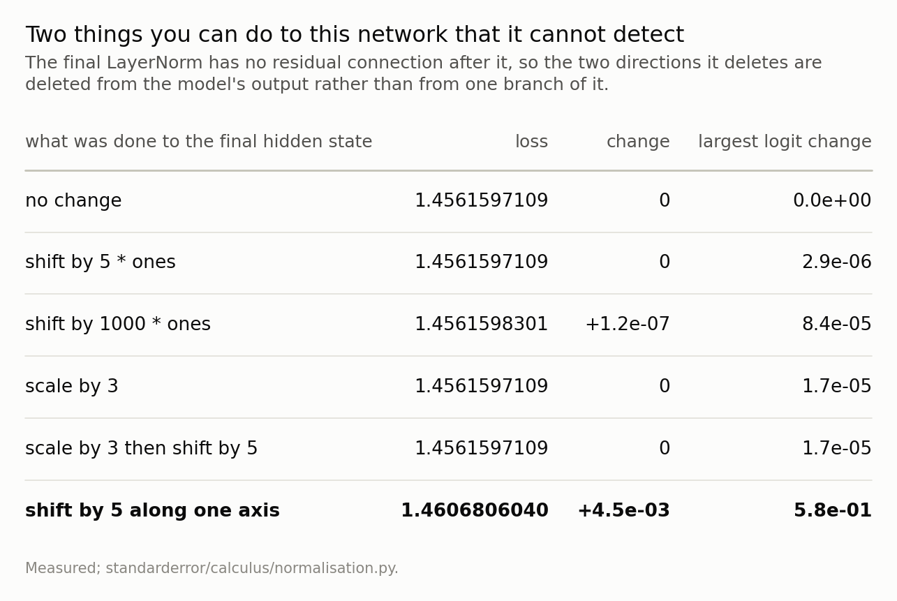
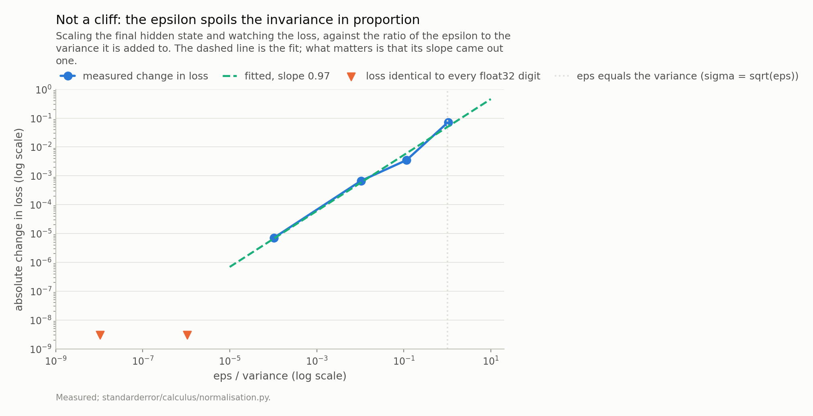
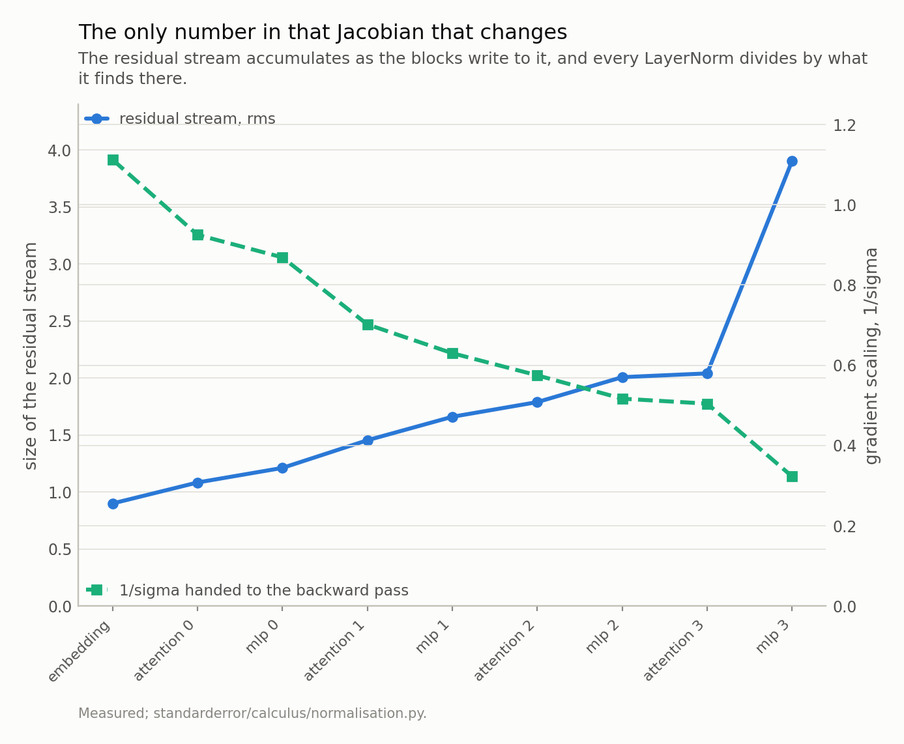

Disclosure: this post was written with the assistance of an AI system (Claude), which wrote the analysis code, ran the experiments and drafted the text. The topic, the constraints, the data choices and the final review are the author's.

*The LayerNorm Jacobian is the orthogonal projector off the plane spanned by the all-ones vector and the normalised input, divided by sigma - verified against autodiff to 2e-16, rank exactly d minus 2, and with a flat nonzero spectrum because it really is a projector. The two dead directions are the tangents of the two invariances the layer has by construction, shift and positive scale, which is the same theorem episode 2 met with one invariance instead of two. Measured on the model, the share of the real gradient lying in that plane has a median of about 0.12 against 0.105 for a random direction, and a deleted component that size costs half a percent of the gradient's length rather than ten. And the residual hides even that: the branch through the first norm measures rank 123 of 128 at a position while the block containing it measures 128. The exception is the final norm, which has no residual after it, so shifting the final hidden state by any multiple of the all-ones vector or scaling it by any positive constant leaves the loss identical to ten digits. The shift is exact in the arithmetic; the scaling turns out to be linear in eps over the variance rather than exact - a log-log slope of 0.97 with a constant near 0.05, over four decades of that ratio - which at this model's scale is far under float32's resolution. What actually varies is the scalar: 1/sigma falls 3.4-fold across depth as the residual stream grows.*

Episode 3 of *Calculus for Language Models, Taught Through What Breaks*. The syllabus and the other episodes: https://jongha-jeon-dev.github.io/standarderror/lectures/

## The hypothesis nobody states

Backpropagation multiplies Jacobians. Nothing in the chain rule requires any of them to be invertible, and the gradient is perfectly well defined when one is not — but a Jacobian with a null space is a Jacobian that throws information away, and it is worth knowing which information.

LayerNorm throws away two dimensions per layer, per position, exactly. Not approximately, not usually, and not as a numerical artefact. The number two is provable in three lines, and this episode is about where those two dimensions go, which turns out to be a more interesting question than whether they exist.

## Three lines

Write *y* = (*x* − μ)/σ with σ = the square root of the variance plus ε, both taken across the *d* features. Differentiating gives

$$
\frac{\partial y}{\partial x} = \frac{1}{\sigma} \left( I - \frac{\mathbf{1} \mathbf{1}^{\top}}{d} - \frac{\hat{x} \hat{x}^{\top}}{d} \right), \qquad \hat{x} = \frac{x - \mu}{\sigma}.
$$

Now look at the bracket rather than through it. The normalised vector x̂ has mean zero and variance one, so the sum of its squares is *d* and the sum of its entries is zero. That makes both subtracted terms **rank-one orthogonal projectors onto orthonormal directions** — the all-ones direction and the x̂ direction, which are perpendicular because x̂ is centred. Subtract two such projectors from the identity and you have the orthogonal projector onto everything else.

So the Jacobian is not merely rank-deficient. It is 1/σ times an orthogonal projection, its rank is exactly *d* − 2, and every one of its nonzero singular values is exactly 1/σ.

```python
import numpy as np
from standarderror.calculus import normalisation as nz

# The closed form against torch's own derivative, then the structure.
print(f"closed form vs autodiff   "
      f"{nz.against_autodiff(d=8)['max_abs_error']:.1e}")
print()
x = np.random.default_rng(0).normal(0.0, 2.0, 128)
g = nz.spectrum(x)
print(f"rank                      {g['rank']} of {g['d']}")
print(f"largest singular value    {g['largest']:.6f}")
print(f"smallest nonzero          {g['smallest_nonzero']:.6f}")
print(f"1 / sigma                 {1 / g['sigma']:.6f}")
print(f"J applied to 1 and xhat   {g['null_residual']:.1e}")
```

```text
closed form vs autodiff   1.7e-16

rank                      126 of 128
largest singular value    0.525682
smallest nonzero          0.525682
1 / sigma                 0.525682
J applied to 1 and xhat   3.3e-16
```

Rank 126 of 128, the largest and smallest nonzero singular values identical to six decimal places and both equal to 1/σ, and the two claimed null directions annihilated to the last bit of a float64.

## Why those two

Not by coincidence. LayerNorm has two invariances by construction: it does not care if you add the same number to every feature, and it does not care if you multiply every feature by the same positive number. Both are deliberate — removing the mean and the scale is the entire point of the layer.

Differentiate an invariance and you get a null direction. If adding *t* times the all-ones vector to *x* leaves *f* alone for every *t*, then the derivative along the all-ones direction is zero, so that direction is in the null space. If multiplying *x* by *a* leaves *f* alone, differentiate at *a* = 1 and the *x* direction is in the null space too — and *x* and x̂ span the same direction once the mean is removed.

Two invariances, two dead directions. Episode 2 met the same theorem with one: a softmax does not change when you add a constant to every logit, so its Jacobian annihilates the all-ones vector and the logit gradients in a row sum to zero. Same statement, one fewer symmetry.

Which reframes the rank deficiency entirely. It is not a leak in the backward pass. It is the derivative correctly reporting that the function ignores those directions, and a gradient that had a component there would be **wrong**.

## What it costs, against the right baseline

So much for whether it happens. How much of an actual gradient falls into the plane that gets deleted?

The question needs a baseline, because two directions out of 128 will catch part of anything. A uniformly random unit vector puts a root-mean-square 0.1250 of its length in any fixed 2-plane, which is exactly the square root of 2/128; the distribution is skewed, so its **median** is the lower 0.105. An indifferent gradient should look like that.

Measured across the model's nine LayerNorms on held-out text, the medians run from 0.087 to 0.144 — straddling 0.105: in the middle of the distribution, LayerNorm deletes roughly what deleting two arbitrary directions would delete. The plane it removes is not a plane the loss particularly wanted.

The tail is the interesting part. A random direction's largest share over 200,000 draws is 0.43; every one of the nine exceeds that, and the final norm reaches 0.83 with a 90th percentile of 0.37 against 0.19. So a small fraction of tokens really do have most of their gradient pointing into the dead plane, and for those the layer removes something. There is structure there; there is just not much of it on average.



*A uniformly random direction in 128 dimensions already puts 0.105 of its length in any fixed 2-plane, and the measured medians sit at 0.087 to 0.144. So in the middle of the distribution LayerNorm deletes about what deleting two arbitrary directions would. The tail is the exception, and it is not one norm: every one of the nine has rows above the random maximum of 0.43, and the final norm reaches 0.83, where the deletion costs 44% of that row's gradient.*

## And then the skip connection

Here is where the famous fact stops mattering, and it is not subtle once seen.

A transformer block is `x + f(LN(x))`. The Jacobian of that is the identity plus something. Whatever rank the branch has, the block has full rank, because the identity is sitting right next to it — and the two directions the norm deleted arrive at the layer below through the skip, undisturbed, at strength one.

```python
# The branch through the norm, and the block that contains it.
b = nz.block_rank(layer=0)
print(f"the ln1 branch alone   rank {b['branch_rank']} of {b['d']}")
print(f"the whole block        rank {b['block_rank']} of {b['d']}")
print(f"  its smallest singular value  {b['block_smallest']:.3f}")
print(f"  its largest                  {b['block_largest']:.3f}")
```

```text
the ln1 branch alone   rank 123 of 128
the whole block        rank 128 of 128
  its smallest singular value  0.361
  its largest                  2.504
```

The branch measures rank 123 — lower than 126, and not because of the norm: attention at a single position also mixes across positions, which removes more. The block measures 128 of 128, with a smallest singular value of 0.36 against a largest of 2.50. Not merely full rank, but comfortably conditioned.

So: **no block in this transformer is rank-deficient because of its LayerNorm.** The exact result from three sections ago is exact, provable, and structurally invisible, in every place a modern architecture puts a normalisation layer — which is to say in front of a residual branch. That is the answer to the episode's own premise, and it is a negative one.

## Except at the end, where there is no skip

With one exception, and it is the last layer. The final norm is not in front of a residual branch. It feeds the output head directly, so what it deletes is deleted from the model's output rather than from one contribution to it.

That makes the two dead directions **exact invariances of the whole network**, which is a claim you can test on the loss rather than on a Jacobian.

```python
# The last norm has no residual after it. So what does the network
# fail to notice?
r = nz.network_invariance()
print(f"baseline loss                       {r['baseline']:.10f}")
for c in r["cases"]:
    print(f"  {c['name']:<28} {c['loss']:.10f}   "
          f"delta {c['delta']:+.1e}")
```

```text
baseline loss                       1.4561597109
  shift by 5 * ones            1.4561597109   delta +0.0e+00
  shift by 1000 * ones         1.4561598301   delta +1.2e-07
  scale by 3                   1.4561597109   delta +0.0e+00
  scale by 3 then shift by 5   1.4561597109   delta +0.0e+00
  shift by 5 along one axis    1.4606806040   delta +4.5e-03
```

Add five times the all-ones vector to the final hidden state: the loss is identical to every digit printed. Add a thousand times: identical to 1e-07, which is one unit in the last place of a float32. Multiply by three: identical. Do both: identical. Move the same distance along a single coordinate instead, and the loss moves by 4.5e-03 with a logit shifting by 0.58.

Two directions of the 128-dimensional final hidden state have no effect on this model's output. Not a small effect. None.



*Adding any multiple of the all-ones vector, or multiplying by any positive constant, leaves the loss identical to every printed digit. The **bold** last row is the control: the same size of change along one coordinate moves a logit by more than half a nat. The invariance is specific to those two directions, and it is a property of the whole network rather than of one layer.*

## "Exact" is a statement about the comparison too

The shift invariance is exact in the arithmetic: subtracting the mean removes a constant offset whatever ε is. The scale invariance is not, and it is worth pushing on, because σ is the square root of the variance **plus ε**, and that sum is not homogeneous in *x*. Scaling by *a* multiplies the variance by *a*² and leaves ε where it is.

So the governing quantity is not σ but the ratio ε/Var, and I expected the invariance to hold until that ratio reached one — at σ = the square root of ε, which for ε = 1e-05 is 0.00316. That is not what the measurement says.

There is no threshold. Over four decades in which ε/Var changes by a factor of ten thousand, the error in the loss is **linear** in it: a log-log slope of 0.97 with a constant of 0.049, and point-to-point scatter of a factor of a few — the individual ratios run 0.030 to 0.070. At σ = 0.31 — a tenth of this model's natural scale, nowhere near any cliff — the ratio is 1e-04 and the loss already moves by 7.2e-06. By σ = the square root of ε the invariance is not breaking; it broke some time ago and is now simply large.

Which means the "exact to ten digits" from the previous section was partly a statement about the ratio and partly a statement about float32. At this model's own scale ε/Var is about 1e-06, and 5% of that is far below the resolution of a float32 loss — so the invariance reads as exact because the error has nowhere to appear, not because it is zero. Which is the useful version of the claim: **the scale invariance is exact up to ε/Var, and at any sane ε that is under the floor.**

One point on the plot has a different cause. Scaling the hidden state *up* by a thousand also perturbs the loss, by 1.2e-07, and ε/Var there is 1e-12 — a hundred thousand times too small to explain it. That one is float32 rounding on a large number, which is a different failure with the same symptom, and it is the reason to compute the ratio rather than eyeball the curve.



*Over four decades of eps/variance the error in the loss is linear in it - a log-log slope of 0.97, constant 0.049 - which is a proportionality, not a threshold. The triangles are the scales at which the loss was identical to every float32 digit, which is what **exact** means here and is a statement about the resolution of the comparison as much as about the layer. The dotted line at 1 is sigma = sqrt(eps), and the invariance is visibly gone well before it.*

## What actually varies

The rank deficiency is exact, provable and mostly invisible. The gradient share is close to what two random directions would take. So the honest question at the end of an episode like this is: what in that Jacobian does move the numbers?

The scalar. 1/σ is the only quantity in `P/σ` that differs from place to place, and it differs a lot.

At the embedding the residual stream has an rms of 0.90 and the norm hands back a factor of 1.112 — a slight amplification. After the last block the stream is at 3.90 and the factor is 0.323. A 3.4-fold ladder, monotone in depth, and it exists for a simple reason: every block **adds** to the residual stream, so the stream grows, so every LayerNorm divides by a larger number than the one before it.

That is the backward-pass view of a fact usually stated about the forward pass. The residual stream growing with depth is normally discussed as a scaling problem for the activations. It is also, and by exactly the same numbers, a depth-dependent gradient scaling — one that no hyperparameter set and no optimiser state knows about.

For comparison, and the conversion matters: a deleted component of relative size 0.105 does not shorten the gradient by 10%. Norms add in quadrature, so it costs 0.55% of the length. Against that, the scalar changes the gradient by 3.4-fold between the first norm and the last. If you were going to worry about one of these, the exact one is not it — the typical deletion is a 0.55% effect and the scaling is a 245% one.



*The residual stream grows 4.3-fold from the embedding to the last block, and 1/sigma falls 3.4-fold with it. That is the one quantity in the LayerNorm Jacobian that varies from place to place, and it varies more than the rank deficiency costs. The **backward** behaviour of the layer is set by a forward fact about depth.*

## What to keep

1. LayerNorm's Jacobian is `(I − 11ᵀ/d − x̂x̂ᵀ/d)/σ`, which is 1/σ times an **orthogonal projector**: rank exactly *d* − 2, and every nonzero singular value exactly 1/σ. Verified against autodiff to 2e-16.

2. The two dead directions are the tangents of the layer's two invariances, shift and positive scale. Differentiate an invariance, get a null direction. A softmax has one invariance and deletes one direction; this is the same theorem.

3. So the rank deficiency is not a leak. A gradient with a component in those directions would be wrong.

4. With the learned gain the rank is still exactly *d* − 2 and the nonzero singular values spread by only 1.99, so the projector picture survives contact with a trained model.

5. Measured, the share of the real gradient in the deleted plane has a median of 0.087 to 0.144 against 0.105 for a random direction. Barely above chance in the middle; above it in every tail, and the final norm reaches 0.83 against a random maximum of 0.43.

6. And the residual makes it moot: the branch is rank 123, the block is rank 128. No block is rank-deficient because of its normalisation.

7. Except the final norm, which has no residual after it — so two directions of the final hidden state are **exact invariances of the whole network**. The shift is exact in the arithmetic; the scaling is exact only up to ε/Var, and the measurement shows that is a straight proportionality with no threshold in it — slope 0.97, constant 0.049.

8. And the sizes are not comparable the way they look. A deleted component of relative size 0.105 costs 0.55% of the gradient's length, because norms add in quadrature. The 1/σ ladder across depth is 3.4-fold, set by the residual stream growing 4.3-fold. That is the part worth watching.

## Exercise

Take your own model, grab the final hidden state, add a hundred times the all-ones vector, and check that nothing happens. It takes two lines and it is worth doing once with your own hands, because "two directions of this representation carry no information" reads as a claim and feels like a fact only after you have watched the logits not move.

Then log the standard deviation of the residual stream at every LayerNorm across a training run. You get the gradient-scaling ladder for free, since it is the reciprocal, and if it is steeper than the threefold in this small model you have found a depth-dependent learning-rate schedule that you did not choose and cannot see in your config.

The harder version: put your epsilon somewhere it matters. Train two models differing only in ε — say 1e-5 and 1e-1 — and measure the scale invariance of each. The second is not normalising in any exact sense at all, and the question is whether it is worse, which I do not know the answer to and would like to.

---

### Data

- No external data. The algebra is checked on vectors drawn at build time; every model number is a rank, a share or a loss on held-out text from the corpus the model was trained on, and no values from that text are published.
- The model: an 816,128-parameter character-level transformer trained for this series - four blocks, four heads, width 128, context 64, validation loss 1.573 against a uniform-guess 4.174. Weights, training script and a verified sha256 are committed: `standarderror/llm/tiny.py`, `scripts/train_tiny.py`, `data/tiny_gpt/`.
- Machinery: `standarderror/calculus/normalisation.py`, tested in `tests/test_normalisation.py`, which pins the algebra exactly and the model findings as inequalities.
- Where this stops: Ba, Kiros and Hinton, "Layer normalization" (2016), for the definition; Xu et al., "Understanding and improving layer normalization", *NeurIPS* (2019), for the derivative and the argument that what normalisation does to the gradient matters more than what it does to the forward pass; Elhage et al., "A mathematical framework for transformer circuits", *Transformer Circuits Thread* (2021), for the residual stream as the object every block reads from and writes to.

### Reproducibility

- **environment**: standarderror=0.1.0, python=3.11.15, torch=2.14.0, numpy=2.4.4
- **code blocks**: executed at build time; the values the prose quotes are pinned, so drift fails the build
- **model**: the committed checkpoint, hash-verified on load, so every rank and every loss here is measured on the same weights
- **determinism**: the gradient survey draws 4 batches of 8 held-out sequences from a fixed seed; the random-direction baseline is 200,000 draws from a fixed seed; the rank measurements are exact linear algebra on one position and do not depend on a seed at all

Code: <https://github.com/jongha-jeon-dev/standarderror>
