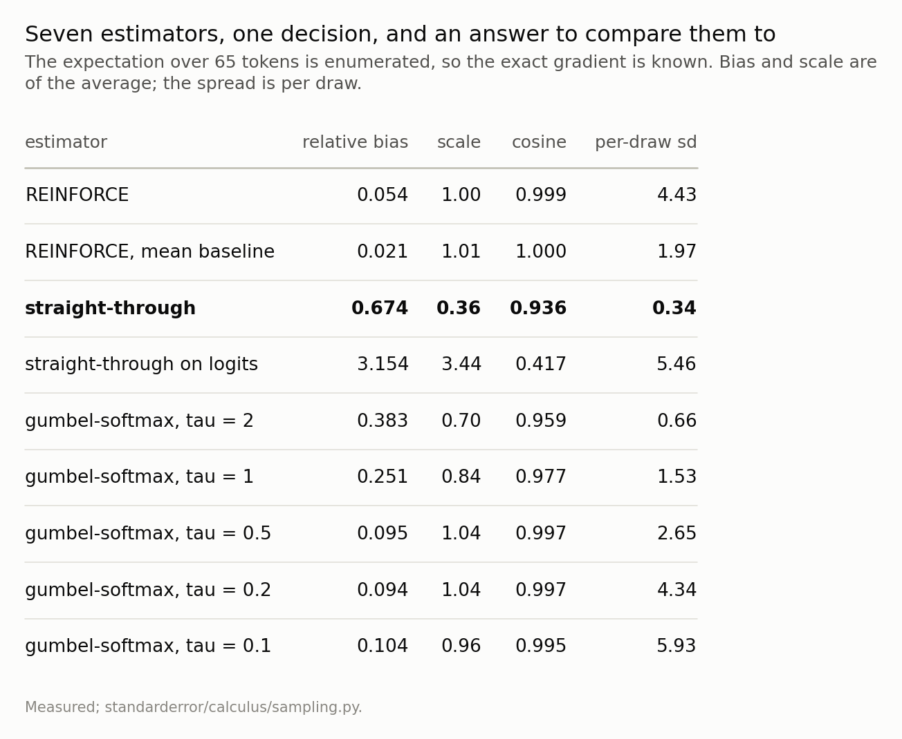
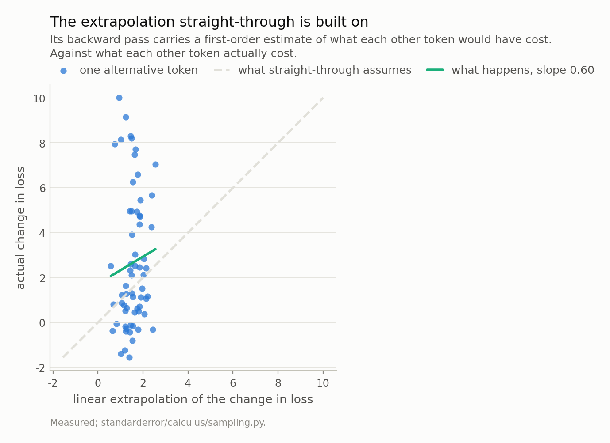
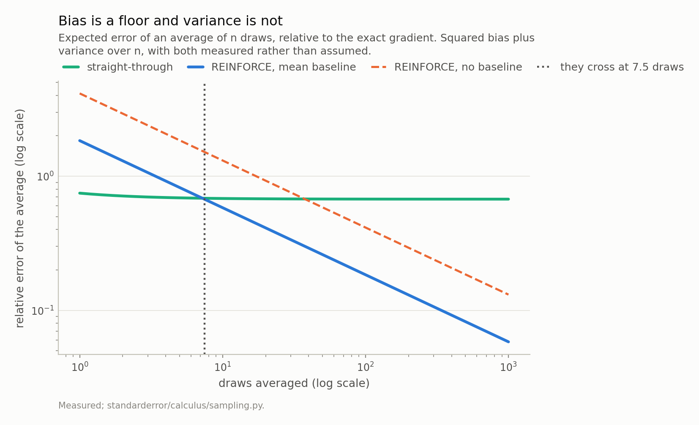
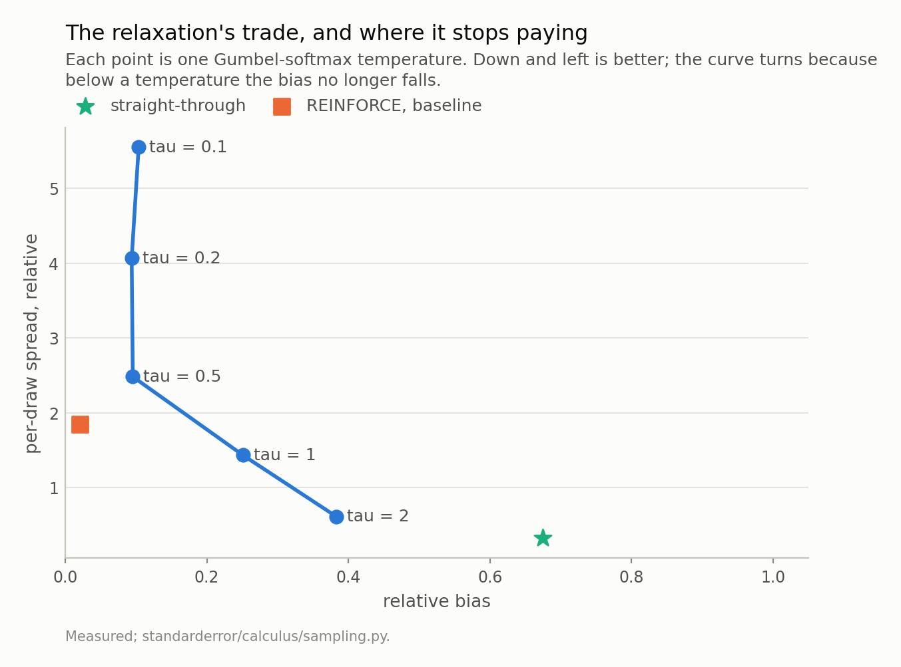

Disclosure: this post was written with the assistance of an AI system (Claude), which wrote the analysis code, ran the experiments and drafted the text. The topic, the constraints, the data choices and the final review are the author's.

*The gradient of the expectation is p times loss minus its mean, which is episode 2's softmax Jacobian applied to the losses and sums to exactly zero. Over 65 tokens it is enumerable, so every estimator has an answer to be wrong against. REINFORCE is unbiased and measurably so, its bias sitting at its own Monte Carlo error. Straight-through is biased by 0.67 of the exact gradient's norm - 42 times its own noise, so no number of draws removes it - and returns 36% of the right size, while the same idea written on the logits instead returns 3.4 times too much. Its cosine of 0.94 with the exact gradient looks like a defence until noise through the same Jacobian scores a 90th percentile of 0.86. What it assumes - that the loss is linear in embedding space between the drawn token and the alternatives - correlates with the truth at -0.04 to +0.54 within a context. And the trade is computable: REINFORCE with a mean baseline overtakes it at 2 to 8 samples.*

Episode 4 of *Calculus for Language Models, Taught Through What Breaks*. The syllabus and the other episodes: https://jongha-jeon-dev.github.io/standarderror/lectures/

## There is nothing to approximate

Sample a token from a distribution and ask for the derivative with respect to the logits. There is not one.

The map from logits to sample is piecewise constant. Nudge a logit by a millionth and almost surely the same token comes out; keep nudging and at some point a different one does, discontinuously. The derivative is zero almost everywhere and undefined on the boundaries, and no choice of subgradient fixes that, because the function really is locally constant — the situation episode 1 found at position 0's attention row, now on purpose and at the centre of everything anyone does with a language model after training.

What exists is the gradient of the **expectation**. And on a small enough problem, that can be computed rather than estimated, which is what makes this episode possible: there is a right answer to be wrong against.

## The answer, enumerated

Take one decision. Give the model 63 tokens of held-out text, sample the next token from its own distribution, append it, and score the token that actually follows. Write *z* for the logits the sample comes from and *ℓ*(*t*) for the loss when token *t* is drawn. Then

$$
L(z) = \mathbb{E}_{t \sim \mathrm{softmax}(z)}\big[\ell(t)\big], \qquad \frac{\partial L}{\partial z_j} = p_j \big( \ell(j) - \mathbb{E}[\ell] \big).
$$

That is episode 2's softmax Jacobian applied to the vector of losses, and by the same argument it sums to exactly zero. The vocabulary here is 65 characters, so the expectation is 65 forward passes rather than a sampling problem.

```python
import numpy as np
from standarderror.calculus import sampling as sm
from standarderror.llm import tiny

# One decision: sample the next token, then score the token after it.
# 65 tokens in the vocabulary, so the expectation is enumerable.
x, y = next(iter(tiny.batches(count=1, size=1, seed=0)))
d = sm.decision(x[0, :tiny.BLOCK - 1], int(y[0, tiny.BLOCK - 1]))
print(f"largest probability      {d['max_p']:.3f}")
print(f"expected loss            {d['expected']:.4f}")
print(f"best token would cost    {d['loss'].min():.4f}")
print(f"worst would cost         {d['loss'].max():.4f}")
print()
print(f"exact gradient norm      {np.linalg.norm(d['exact']):.4f}")
print(f"  and it sums to         {d['exact'].sum():+.1e}")
```

```text
largest probability      0.386
expected loss            3.9184
best token would cost    0.1270
worst would cost         11.6907

exact gradient norm      1.0686
  and it sums to         -3.0e-08
```

The spread of outcomes is the thing to notice: the best token costs 0.127 and the worst 11.69, against an expectation of 3.92. This decision matters, and there is a definite vector saying how to change it.

## Three things people return instead

**REINFORCE** draws one token and returns *ℓ*(*t*)(*e*ₜ − *p*), optionally with a constant subtracted from the loss. It is unbiased for any such baseline, because the expectation of *e*ₜ − *p* is zero whatever multiplies it, and it is famous for its variance.

**Straight-through** draws a token, runs the one-hot forward, and on the way back pretends the one-hot was *p*. In code that is `onehot + p - p.detach()`, which is precisely episode 1's identity-written-three-ways trick applied deliberately: a forward pass that computes one thing and a backward pass that differentiates another.

**Gumbel-softmax** declines to sample, using a relaxed draw at temperature *τ* that is differentiable and wrong by an amount that shrinks with *τ*.

```python
# Two estimators of that one vector.
rf = sm.reinforce(d, draws=6000, baseline=d["expected"])
st = sm.pathwise(d, sm.straight_through("softmax"), draws=400)
for name, e in (("REINFORCE + baseline", rf), ("straight-through", st)):
    print(f"{name:<22} bias {e['relative_bias']:.3f}  "
          f"(its own noise {e['mc_error']:.3f})   "
          f"scale {e['scale']:.2f}   spread {e['sd']:.2f}")
print()
print(f"they cross at {sm.crossover(st, rf):.1f} draws")
```

```text
REINFORCE + baseline   bias 0.021  (its own noise 0.024)   scale 1.01   spread 1.97
straight-through       bias 0.674  (its own noise 0.016)   scale 0.36   spread 0.34

they cross at 7.5 draws
```

Both numbers in that first row are small, and the second one is why the first is meaningful: REINFORCE's measured bias of 0.021 sits at its own Monte Carlo error of 0.024, which is what "unbiased" looks like when you measure it rather than prove it. Straight-through's 0.67 is 42 times its noise. **That bias is not going to average away**, and drawing more samples buys nothing against it.

The column worth staring at is the scale. Straight-through's expected gradient is 36% of the exact one — across six contexts, 4% to 40%. A run using it is taking systematically short steps. And the same idea written on the logits instead of the probabilities, `onehot + z - z.detach()`, returns 3.4 times **too much** with a cosine of 0.42. Same forward pass, same one line of intent, two derivatives that disagree by a factor of 10.



*The two REINFORCE rows are unbiased - their measured bias of 0.021 sits at their own Monte Carlo error of 0.024 - and pay for it in spread. **Straight-through** is biased by 0.67 of the exact gradient's norm, 42 times its own noise, so no number of draws removes it. Note the scale column: it returns 36% of the right size, and the same estimator written on the logits returns 3.4 times too much.*

## The cosine is borrowed

Straight-through's average points at 0.94 cosine to the exact gradient, which is usually where the defence of it begins. Before accepting that, ask what a cosine of 0.94 is worth here.

Both vectors are the softmax Jacobian applied to something: the exact gradient to the true losses, straight-through to its own estimate of them. They share a factor. So push *noise* through that factor and see what it scores.

```python
# The cosine looks reassuring. Is it earned? Push noise through the
# same softmax Jacobian and see what that scores.
c = sm.jacobian_control(d)
print(f"straight-through cosine with the exact gradient  "
      f"{st['cosine']:.3f}")
print(f"noise through the same Jacobian, median          "
      f"{c['median']:.3f}")
print(f"                              90th percentile    "
      f"{c['p90']:.3f}")
print(f"                              largest of 2,000   "
      f"{c['max']:.3f}")
```

```text
straight-through cosine with the exact gradient  0.936
noise through the same Jacobian, median          0.572
                              90th percentile    0.862
                              largest of 2,000   0.990
```

A vector of random numbers, run through the same `p * (r - <p, r>)`, aligns with the exact gradient at a median of 0.57, a 90th percentile of 0.86, and a largest-of-2,000 of 0.99. Straight-through's 0.94 sits between the 90th percentile and the best that noise managed.

That does not make it noise. It does mean the cosine is **not evidence**: the agreement comes from the factor the two share, and the part straight-through contributes itself is not visible in that number at all. Which raises the question of what that part actually is.

## What it is actually assuming

Differentiate the one-hot forward and you get *p* ⊙ (*u* − ⟨*p*, *u*⟩), where *u*ⱼ is the directional derivative of the loss along token *j*'s embedding, evaluated at the token that happened to be drawn. Compare with the exact *p* ⊙ (*ℓ* − E*ℓ*).

Same Jacobian, and in place of the true loss of each alternative, **a first-order extrapolation from the one token you sampled**. Straight-through is exactly as good as the assumption that the loss is linear in embedding space on the scale separating one token from another.

That assumption is testable, because both sides are computable here.

In this context the extrapolation correlates with the truth at +0.09. Across six contexts the correlation runs -0.04 to +0.54, median +0.11, with regression slopes from -0.28 to +1.26. Five of the six are positive and the sixth is -0.04, which on 64 points is not distinguishable from zero. So: weakly positive at best, and mostly noise.

But the correlation is not the interesting axis, and the plot makes that obvious. Look at the two ranges. The true changes in loss span -1.6 to +10.0 nats. The extrapolation spans +0.6 to +2.6 — a standard deviation of 0.44 against the truth's 2.98, a compression of 0.15. **Straight-through's model says roughly the same thing about every alternative.**

Which explains the scale deficit exactly, and better than the correlation does. Push a *constant* vector through `p * (u − <p, u>)` and you get precisely zero, because that is the softmax Jacobian and constants are its null direction — episode 3's theorem, one last time. A nearly constant loss model therefore gives a nearly vanishing gradient, and how nearly is set by how compressed it is. Across the six contexts the compression runs 0.10 to 0.48 and correlates with straight-through's measured scale at +0.70. The 36% is not a mystery about bias; it is the range of a linearisation, divided by the range of the thing it linearises.

**A correction, because the first version of this section said something stronger and wrong.** Pooling the six contexts into a single correlation gives -0.17, and I wrote "anti-correlated, not inaccurate" on the strength of it. That is a Simpson's paradox: each context has its own anchor token and its own spread of losses, so pooling measures variation between contexts and answers a question nobody asked. Five of the six contexts are positive on their own and the sixth is indistinguishable from zero, so the pooled sign belongs to neither. The weaker claim is the true one, and the compression above is what actually explains the bias.



*If the loss were linear in embedding space these points would sit on the dashed line. They correlate at +0.09 - weak but positive. The sharper fact is the **compression**: the true changes span 12 nats and the extrapolation spans 2, a spread ratio of 0.15. A loss model that says nearly the same thing about every alternative gives nearly no gradient, because a constant is the softmax Jacobian's null direction.*

## How much of REINFORCE's variance is a baseline problem

Before comparing budgets it is worth asking whether the unbiased estimator has to be this noisy, because the answer decides what the comparison is about.

A constant baseline is free, and the mean is the obvious choice but not the optimal one. Minimising the variance of (*ℓ* − *b*)(*e*ₜ − *p*) over *b* gives a weighted mean of the losses, weighted by the squared norm of *e*ₜ − *p*, which is larger for unlikely tokens — so the best constant leans towards the tail. Here it sits at 4.56 against a mean of 3.92.

And it buys almost nothing. Going from no baseline to the mean takes the per-draw spread from 4.43 to 1.96, a factor of 2.3. Going from the mean to the optimal constant takes it to 1.88 — a further 4%.

So the variance that remains is **not** a baseline problem. It is the spread of the losses themselves: 0.13 to 11.69 on this decision, and no number subtracted from all of them shrinks a range. Cutting it further needs a baseline that depends on *which token was drawn* — a control variate, which is to say a model of the loss.

Which is where straight-through returns, in a better role than the one it was auditioning for. Its linearisation is exactly such a model: a cheap per-token estimate of what each alternative would have cost. As the whole gradient, a correlation of +0.11 is nowhere near good enough. As a control variate subtracted from an unbiased estimator, a weak positive correlation is **enough to help and unable to hurt**, because the estimator stays unbiased whatever the control variate says. That is the design the literature arrived at, and it is the one these measurements point to.

## So when is a biased estimator the right choice?

Often, and the condition is arithmetic rather than a matter of taste. Averaging *n* draws gives squared error of bias² + variance/*n*. The biased estimator starts lower and stops at its bias; the unbiased one starts higher and keeps falling. They cross somewhere, and both numbers are measured above.

On this decision they cross at 7.5 draws. Across six contexts, 1.8 to 8.4.

That is a low bar. Straight-through's case rests on being cheap, and it is cheap — one backward pass, no baseline to tune, a spread of 0.34 against REINFORCE's 1.97. But the budget at which its cheapness stops paying is a handful of samples, not thousands, and in a setting where you can afford to sample the same decision even ten times the unbiased estimator is simply better. The intuition that "REINFORCE is too high-variance to use" is doing work here that the numbers do not support.

Two caveats I cannot measure from one decision. The crossover is per-decision, and a training run averages over a batch, which is its own *n* — so a batch of 64 sequences is already well past the crossover if the same decision recurs, and not at all past it if every decision is different. And a systematically short step is not the same failure as a noisy one: an optimiser with momentum and a learning rate can absorb a scale error that it cannot absorb as variance. Which of those dominates is an empirical question about a real training run, and this episode does not answer it.



*Straight-through starts ahead because its spread is small, and stops improving at its bias. REINFORCE with a baseline keeps going. On this decision they cross at 7.5 draws; across six the crossover runs 1.8 to 8.4. If you can afford a handful of samples, the **bias is the expensive half**.*

## The relaxation, which trades honestly

Gumbel-softmax sits between the two and lets you choose where. Lower the temperature and the relaxed sample looks more like a draw, so the bias falls; it also concentrates, so the variance rises.

Measured here, the trade is real down to about *τ* = 0.2, where the bias reaches 0.09. Below that the bias stops improving — 0.10 at *τ* = 0.1 — while the per-draw spread keeps climbing, from 0.66 at *τ* = 2 to 5.93. Past the knee you are paying variance for nothing, which is worth knowing before annealing a temperature to zero on principle.



*From tau = 2 down to 0.2 the bias falls from 0.38 to 0.09; below that it stops falling and only the spread grows. The star is straight-through, which is the cheap corner, and the square is REINFORCE with a baseline, which is the honest one.*

## What to keep

1. A sampled token is piecewise constant in its logits, so its derivative is 0 almost everywhere and undefined elsewhere. There is no gradient to approximate; there is only the gradient of the expectation, `p * (loss − E loss)`, which is the softmax Jacobian applied to the losses and sums to zero.

2. On a vocabulary small enough, that expectation is enumerable, and then every estimator can be scored against an answer instead of against each other. Do this once on a toy before trusting any of them at scale.

3. REINFORCE is unbiased and measurably so: its bias sits at its own Monte Carlo error. A mean baseline cuts the spread by 56% and costs nothing.

4. Straight-through is biased by 0.67 of the exact gradient's norm, 42 times its own noise, and returns 36% of the right magnitude. More samples do not help.

5. Written on the logits rather than the probabilities it returns 3.4 times too much at cosine 0.42. Same forward pass. Episode 1's point, in production code.

6. Its cosine with the exact gradient is **not evidence**, because noise through the same softmax Jacobian scores a 90th percentile of 0.86.

7. What it assumes is a first-order extrapolation across embedding space. It correlates with the truth at -0.04 to +0.54 within a context — weak but positive — and, more to the point, it is **compressed**: its spread is 0.10 to 0.48 of the truth's. A nearly constant loss model gives a nearly vanishing gradient, since constants are the softmax Jacobian's null direction, and that compression tracks the measured scale at +0.70.

8. The crossover is arithmetic: bias² against variance/*n*. Here REINFORCE with a baseline wins after 2 to 8 draws.

9. The mean is nearly the best constant baseline there is — the variance-optimal one improves on it by 4% — so REINFORCE's remaining variance is the spread of the losses, not a baseline you failed to tune. Cutting it needs a per-token control variate, and straight-through's linearisation is one. Weak is enough for that job and not for this one.

10. And the pooled correlation of -0.17 that an earlier draft built a claim on is a Simpson's paradox. Correlations across heterogeneous groups are the easiest way to publish a sign error.

## Exercise

Build the smallest version of your own sampling problem that you can enumerate — a vocabulary of a hundred, a single decision, one loss — and score your estimator against the exact gradient. Not its cosine: its **scale**. Cosines are forgiving in a way that will mislead you, for the reason in the control above, and a gradient that points the right way at a fifth of the right size is a learning rate you did not choose.

Then compute your crossover. You need two numbers you probably already have: the bias of your biased estimator, measured once against the enumerated answer, and the per-sample variance of the unbiased one. The ratio tells you the sample count past which the cheap thing costs more than it saves, and it is usually smaller than people expect.

The uncomfortable version: if the crossover for your problem is below your batch size, you have been using the biased estimator for reasons that are not about variance.

---

### Data

- No external data. Every number is a loss, a gradient or a correlation computed on held-out text from the corpus the model was trained on, and no values from that text are published.
- The model: an 816,128-parameter character-level transformer trained for this series - four blocks, four heads, width 128, context 64, validation loss 1.573 against a uniform-guess 4.174. Weights, training script and a verified sha256 are committed: `standarderror/llm/tiny.py`, `scripts/train_tiny.py`, `data/tiny_gpt/`.
- Machinery: `standarderror/calculus/sampling.py`, tested in `tests/test_sampling.py`, which checks the enumerated gradient against autodiff and pins the model findings as inequalities.
- Where this stops: Williams, "Simple statistical gradient-following algorithms for connectionist reinforcement learning", *Machine Learning* (1992), for REINFORCE; Bengio, Leonard and Courville, "Estimating or propagating gradients through stochastic neurons for conditional computation" (2013), for straight-through; Jang, Gu and Poole, "Categorical reparameterization with Gumbel-softmax", *ICLR* (2017) and Maddison, Mnih and Teh, "The concrete distribution", *ICLR* (2017), for the relaxation, published independently within days of each other.

### Reproducibility

- **environment**: standarderror=0.1.0, python=3.11.15, torch=2.14.0, numpy=2.4.4
- **code blocks**: executed at build time; the values the prose quotes are pinned, so drift fails the build
- **model**: the committed checkpoint, hash-verified on load; the enumerated expectation is 65 forward passes through it and involves no sampling at all
- **determinism**: the pathwise estimators draw 400 samples per context and REINFORCE 6000, each from a fixed seed; the reported Monte Carlo error is what separates a measured bias from a real one

Code: <https://github.com/jongha-jeon-dev/standarderror>
