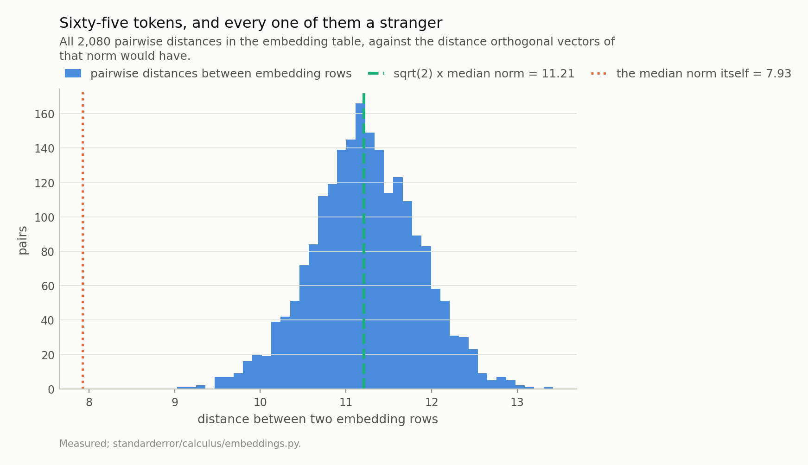
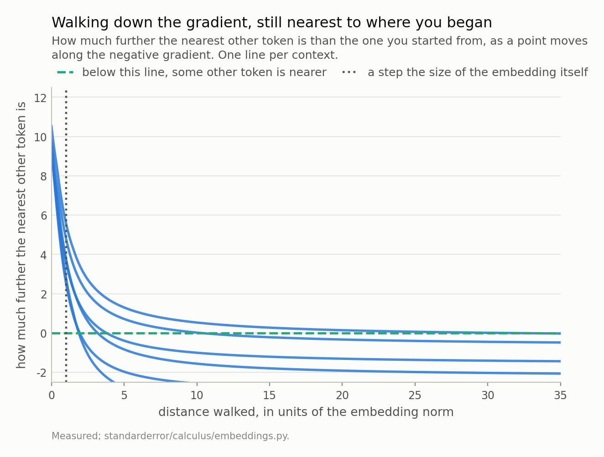
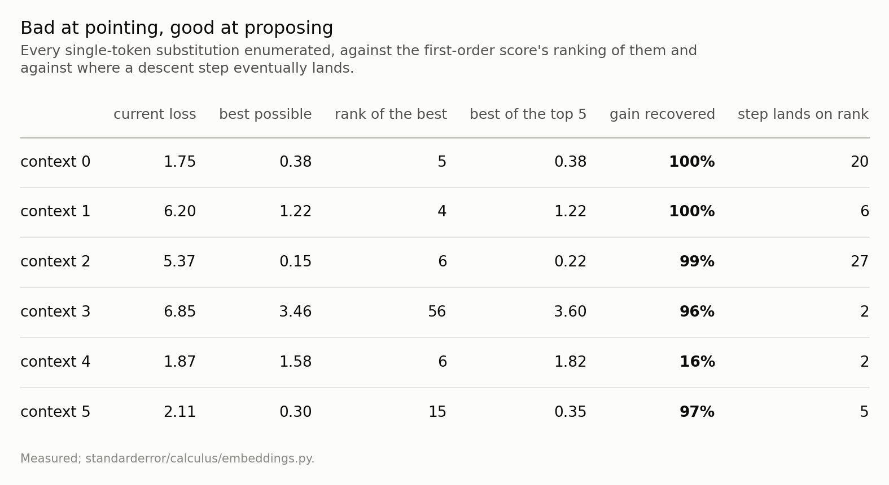
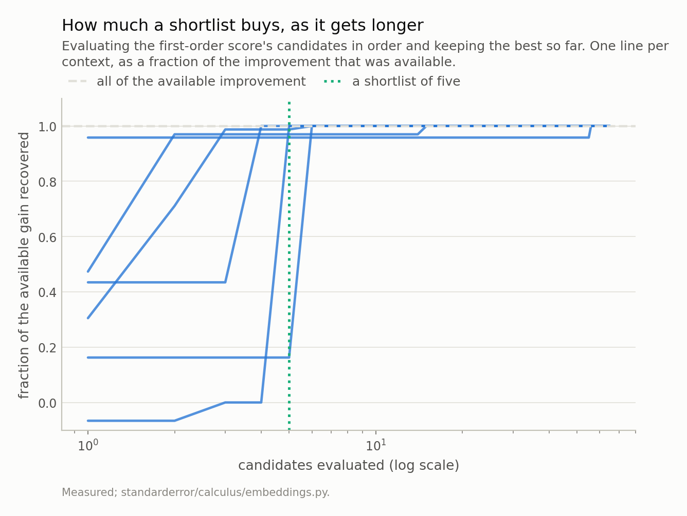

Disclosure: this post was written with the assistance of an AI system (Claude), which wrote the analysis code, ran the experiments and drafted the text. The topic, the constraints, the data choices and the final review are the author's.

*The embedding table's median pairwise distance is 11.214 and sqrt(2) times its median norm is 11.210 - the distance between orthogonal vectors of that length, matched to four figures, with a median pairwise cosine of +0.0003. Random vectors reproduce it, so this is dimension rather than training. The rows are further apart than they are long and the nearest other token sits at 0.88 of the typical distance, so there is no neighbourhood to descend in. Measured: a step against the gradient leaves you nearest to the token you started from for 1.9 to 31.6 embedding norms, and the token you eventually reach is never the best substitution - once it is worse than not moving at all. But graded as a shortlist rather than a direction the same gradient is good: its top five of 65 recovers 96% to 100% of the available improvement in 5 of 6 contexts, including one where the best token ranks 56th. Which is why prompt optimisation is search with a gradient-shaped shortlist, and why the rank of the single best token is the wrong thing to measure.*

Episode 5 of *Calculus for Language Models, Taught Through What Breaks*. The syllabus and the other episodes: https://jongha-jeon-dev.github.io/standarderror/lectures/

## A derivative that is exactly right and no use

The first four episodes were about the chain rule's hypotheses and where a transformer bends them. This one has no complaint about the derivative at all. Take the loss, differentiate with respect to the embedding vector sitting at one input position, and you get a perfectly ordinary gradient: exact, well conditioned, every hypothesis satisfied.

And then you cannot use it, because the thing you want to change is not a vector. It is a token, and tokens are 65 specific points in a space of 128 dimensions. A gradient tells you which way to move. There is nowhere to move to.

How badly that fails is a question about the geometry of the embedding table, and the answer turns out not to be about this model at all.

## Sixty-five strangers

Two numbers settle it.

```python
import numpy as np
from standarderror.calculus import embeddings as em

t = em.table()
print(f"embedding table            {t['rows']} x {t['dim']}")
print(f"median row norm            {t['median_norm']:.3f}")
print(f"median pairwise distance   {t['median_pairwise']:.3f}")
print(f"  if the rows were orthogonal, sqrt(2) x norm ="
      f" {t['orthogonal_prediction']:.3f}")
print(f"median pairwise cosine     {t['median_cosine']:+.5f}")
print()
print(f"nearest other token, as a fraction of the typical distance"
      f"  {t['nearest_over_pairwise']:.3f}")
```

```text
embedding table            65 x 128
median row norm            7.927
median pairwise distance   11.214
  if the rows were orthogonal, sqrt(2) x norm = 11.210
median pairwise cosine     +0.00030

nearest other token, as a fraction of the typical distance  0.881
```

The median distance between two embedding rows is 11.214. The distance between two *orthogonal* vectors of length 7.927 is √2 × 7.927 = 11.210. Those agree to four significant figures, and the median pairwise cosine is +0.00030.

So the table is 65 mutually near-orthogonal vectors sitting on a sphere. Every token is about as far from every other token as it is possible for them to be, and — the line that matters — **they are further apart than they are long**: 11.2 against 7.9.

None of that is learned. Independent vectors in 128 dimensions are near-orthogonal for reasons that have nothing to do with language; the test suite checks that random vectors of the same norm reproduce the same relationship. What training chose was where on the sphere each token goes, and in 128 dimensions there is so much room that the answer is "far from everything else".

The consequence is the one that matters here. The nearest other token sits at 0.88 of the typical pairwise distance — so "the token nearest to this one" is barely a distinguished object. **There is no neighbourhood.** Gradient descent is a procedure for exploiting one.



*The median pairwise distance is 11.214 and the orthogonal prediction is 11.210, which agree to four figures - and the median pairwise cosine is +0.0003. The rows are mutually **further apart than they are long**, so there is no local neighbourhood for a gradient step to move within.*

## So the step goes nowhere

The obvious thing to try: move the embedding against its gradient, then round to the nearest row of the table. That is what "follow the gradient in embedding space" would have to mean.

```python
# Step against the gradient at one input position. How far before the
# nearest embedding row is no longer the token you started from?
from standarderror.llm import tiny
x, y = next(iter(tiny.batches(count=1, size=1, seed=0)))
sub = em.substitutions(x[0, :tiny.BLOCK - 1],
                       int(y[0, tiny.BLOCK - 1]))
land = em.step_landing(sub)
print(f"the step needed       {land['flip_at']:.2f} embedding norms"
      f"  ({land['distance_walked']:.0f} units)")
print(f"it lands on           token {land['landed']}, "
      f"rank {land['landed_rank'] + 1} of {sub['vocab']}")
print(f"loss there            {land['landed_loss']:.3f}")
print(f"loss where you began  {sub['current_loss']:.3f}")
print(f"best available        {sub['best_loss']:.3f}")
```

```text
the step needed       31.60 embedding norms  (282 units)
it lands on           token 48, rank 20 of 65
loss there            1.838
loss where you began  1.748
best available        0.383
```

You have to walk 31.6 embedding norms — 282 units, on a table whose rows are 7.9 long — before the nearest row stops being the one you started from. Across six contexts, 1.9 to 31.6 norms, and at a step of one whole embedding norm not one of the six has crossed. Every step anyone would actually take is a rounding error against that, so **rounding a gradient step to the nearest token is not an operation that does anything**. It returns its input.

The geometry says why. The direction to any other token is nearly orthogonal to any fixed direction you might step along, so walking moves you away from where you were much faster than it moves you towards anywhere else. You escape a Voronoi cell whose neighbours are all at distance 11.2 only by walking about that far, and the linearisation that produced the gradient expired long before.

And when you do arrive, it is not the right token. It ranks 20th of 65 here, and across the six contexts 20, 6, 27, 2, 2, 5 — **never first**. In one of them the token you land on has a *higher* loss than the one you started with: descending the gradient and rounding up made the model worse.



*Every curve starts at that context's nearest-neighbour distance - a median of 9.9 across the table - and has to reach zero before any other token becomes the nearest. At the dotted line - a step the size of the whole embedding, which is already an enormous step - not one has crossed. The crossings happen between 1.9 and 31.6 embedding norms. **Rounding a gradient step to the nearest token is not an operation that does anything**: it returns its input.*

## The other question, which has a different answer

Nobody serious actually rounds a gradient step. What they do is use the gradient to **score** candidates — HotFlip's first-order substitution score, the inner product of the gradient with the difference between two embeddings — and then evaluate the top few for real.

That is a different question and it deserves a different measurement, for a reason worth stating precisely. Episode 4 found this same first-order model compressed to a fraction of the truth's range, which destroyed its magnitude. **Ranking is scale-invariant.** Compress a score by any positive factor and its ordering is untouched. So the defect that made the gradient useless as a direction costs it nothing as a proposal.

```python
# Now grade the same gradient as a shortlist instead of a direction.
r = em.ranking(sub)
print(f"rank of the best substitution     "
      f"{r['rank_of_best'] + 1} of {sub['vocab']}")
print(f"spearman over all candidates      {r['spearman']:+.3f}")
print()
print(f"improvement available             {r['available']:.3f} nats")
print(f"best of the gradient's top five   "
      f"{sub['current_loss'] - r['best_loss_in_top5']:.3f} nats")
print(f"so the shortlist recovers         {r['recovered5']:.1%}")
```

```text
rank of the best substitution     5 of 65
spearman over all candidates      +0.182

improvement available             1.365 nats
best of the gradient's top five   1.365 nats
so the shortlist recovers         100.0%
```

The best substitution ranks 5th, which is fine, and the Spearman correlation of +0.182 over all 65 candidates, which is not. But the last line is the one that matters: evaluating the gradient's top five out of 65 recovers 100% of the improvement that was available.

Those numbers come apart badly across contexts, and the way they come apart is the point. The rank of the single best token runs 4 to 56 of 65 — erratic, and the sort of thing that makes the method look unreliable. The fraction of available gain recovered by a five-candidate shortlist is at or above 95% in 5 of 6 contexts, **including the one where the best token ranks 56th**, because the shortlist contained something nearly as good and near-ties are as good as wins.

So the metric people quote is the wrong one. "Does the gradient find the best token" is a question nobody needs answered. "Does evaluating five of sixty-five get you most of the way" is the question, and the answer is yes.



*The fourth column is the metric people quote and it is erratic - the best token ranks anywhere from 4 to 56 of 65. The **sixth** is the metric that matches how the score is used, and it is at or above 95% in 5 of 6 rows, including the one where the best token ranks 56th. The last column is where a gradient step lands: never first.*

The one failure is worth looking at rather than averaging away. Its shortlist recovers 16%, and it is the context where the least was on offer: 0.28 nats between the current token and the best possible one, against 5.22 in the best case. When every candidate is nearly as good as every other a ranking has nothing to rank, and the fraction-recovered metric divides by a small number and becomes noisy. That is a limitation of the metric as much as of the method.

**And the shortlist needs a control, because five of 65 is already a 7.7% sample.** Draw five tokens uniformly at random instead and evaluate those: the median recovery runs from -3.97 to +0.71 of the available gain — negative in two contexts, meaning a random five routinely contains nothing better than the token already there. And the share of random draws that match or beat the gradient's five is between 0.08 and 0.17, in every context.

So the gradient's ordering is doing real work: between 8% and 17% of random shortlists match it, which across six independent contexts is not close. It is simply the only kind of work this geometry leaves room for.



*Five of six contexts are within 2% of the ceiling after five candidates out of 65. The exception recovers 16%, and it is the context with the least to gain in the first place. **The gradient is a proposal distribution, and it is a good one**; it is the evaluation that turns it into an answer.*

## What this means for the thing people actually do

Prompt optimisation, adversarial suffixes, discrete trigger search — every one of these is a loop that proposes token substitutions and evaluates them. The gradient's role is the proposal, and the reason that architecture exists is not that anyone preferred it. It is forced, by the two measurements above.

Which reframes what "the gradient is informative" should mean here. Its magnitude is not informative: episode 4 measured the same first-order model returning a fraction of the right size. Its direction is not informative: there is nowhere for a direction to point. Its **ordering of a handful of candidates** is informative, and that is a far weaker property than the other two, which is exactly why it survives geometry this hostile.

It also explains a practical asymmetry that otherwise looks arbitrary. Doubling the shortlist from five to ten is cheap and buys very little here, because five was already at the ceiling. Halving it to two or three is where the loss shows up. The gradient's information is concentrated in the very top of its ranking and is roughly exhausted by the fifth candidate, which is a statement about how much a first-order model of a non-linear function can be trusted, and not one I would extrapolate past a 65-token vocabulary without checking.

## Five episodes, one pattern

This is the last of five, and the five turned out to rhyme in a way none of them was drafted to.

Each episode began with an exact statement about a hypothesis of the chain rule, and each exact statement turned out to be true and largely inert. Autodiff's inconsistency at kinks is real, documented, and almost absent from a transformer — GELU and LayerNorm are smooth and clipping never fired. LayerNorm's Jacobian really does have rank exactly *d* − 2, and the residual connection makes that invisible in every block. A sampled token really has no derivative, and the biased substitute everyone uses is beaten by the unbiased one after a handful of samples. The embedding table really has no neighbourhood, and the gradient is useful there anyway, in a different role.

In every case the interesting finding was one question further in, and it was smoother and less dramatic than the headline. What throttles gradient flow is not kinks but confidence. What changes gradient magnitude across depth is not a rank deficiency but a scalar. What makes straight-through biased is not the discreteness but a compressed loss model. What makes a gradient useful over tokens is not its direction but its ordering.

I would not have predicted that pattern, and I do not think it generalises beyond "exact facts about a component are easier to state than facts about what the component does". But it is what happened five times out of five, which is enough to be worth saying out loud.

The caveat that belongs at the end: all of it is measured on one 816,128-parameter character-level model trained on one corpus. The algebra holds at any width — a projector is a projector — and the frequencies do not. Every number here that describes the model rather than the mathematics is a number about that model.

## What to keep

1. The embedding table is 65 near-orthogonal vectors on a sphere: median pairwise distance 11.214 against √2 × the median norm = 11.210, median cosine +0.0003. Random vectors do the same, so this is dimension, not training.

2. The rows are further apart than they are long, and the nearest other token sits at 0.88 of the typical distance. **There is no local neighbourhood**, which is the thing gradient descent exists to exploit.

3. So a descent step leaves you nearest to the token you started from — for 1.9 to 31.6 embedding norms, which is not a step, it is a journey.

4. When you finally cross a boundary, the token there is never the best substitution, and in 1 of 6 contexts it is worse than not moving.

5. But the same gradient used as a **ranking** is good, and ranking is scale-invariant, so episode 4's compression costs it nothing here.

6. Its top five of 65 recovers 96% to 100% of the available improvement in 5 of 6 contexts — including one where the single best token ranks 56th. **Rank of the best is the wrong metric; recovered gain is the right one**, and they disagree sharply.

7. And the ordering is doing the work, not just the evaluation: five tokens drawn at random match the gradient's five only 8% to 17% of the time, and recover a median as low as -3.97 of the gain.

8. Which is why discrete-token optimisation is search with a gradient-shaped shortlist. The gradient earns its keep by turning 65 candidates into 5; the evaluation does the rest.

## Exercise

Measure the two numbers in section two on your own embedding table: the median pairwise distance and √2 times the median norm. If they agree, your tokens are mutually near-orthogonal and nothing in this episode was about a small model. If they disagree — if the distances are much *smaller* than the orthogonal prediction — you have found genuine clustering in embedding space, which is more interesting than anything here and worth knowing about before you trust any nearest-neighbour argument over those vectors.

Then take your favourite gradient-guided token search and log, per step, how far down its own ranking the accepted substitution was. If it is usually first, your shortlist is longer than it needs to be. If it is usually well down the list, the gradient is contributing less than the evaluation, and the random-shortlist control above is the way to find out which.

The uncomfortable version: run that control on your own vocabulary before quoting a success rate for a gradient-guided attack. At 65 tokens a random five is a 7.7% sample and still loses about seven times in eight; at 50,000 tokens a random five is nothing, so a gradient-guided search that works there is doing something this episode has not measured, and a gradient-guided search that does not work may be failing for a reason that has no gradient in it at all.

---

### Data

- No external data. The geometry is a property of the committed weights; every loss is computed on held-out text from the corpus the model was trained on, and no values from that text are published.
- The model: an 816,128-parameter character-level transformer trained for this series - four blocks, four heads, width 128, context 64, validation loss 1.573 against a uniform-guess 4.174. Weights, training script and a verified sha256 are committed: `standarderror/llm/tiny.py`, `scripts/train_tiny.py`, `data/tiny_gpt/`.
- Machinery: `standarderror/calculus/embeddings.py`, tested in `tests/test_embeddings.py`, which includes a random-vector control for the geometry so the claim is not attributed to training.
- Where this stops: Ebrahimi et al., "HotFlip: white-box adversarial examples for text classification", *ACL* (2018), for the first-order substitution score; Wallace et al., "Universal adversarial triggers for attacking and analyzing NLP", *EMNLP* (2019) and Zou et al., "Universal and transferable adversarial attacks on aligned language models" (2023), for the propose-then-evaluate loop this geometry forces; Vershynin, *High-Dimensional Probability* (2018), for why independent vectors in 128 dimensions are near-orthogonal.

### Reproducibility

- **environment**: standarderror=0.1.0, python=3.11.15, torch=2.14.0, numpy=2.4.4, scipy=1.16.3
- **code blocks**: executed at build time; the values the prose quotes are pinned, so drift fails the build
- **model**: the committed checkpoint, hash-verified on load; the geometry is a property of its embedding matrix and involves no data at all
- **determinism**: the substitution tables are exhaustive over 65 tokens and involve no sampling; the 6 contexts come from a fixed seed; the walk is a deterministic line search at a step of 0.05 embedding norms

Code: <https://github.com/jongha-jeon-dev/standarderror>
