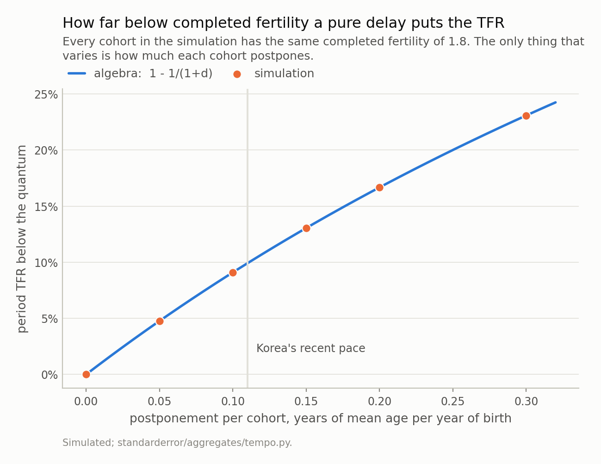
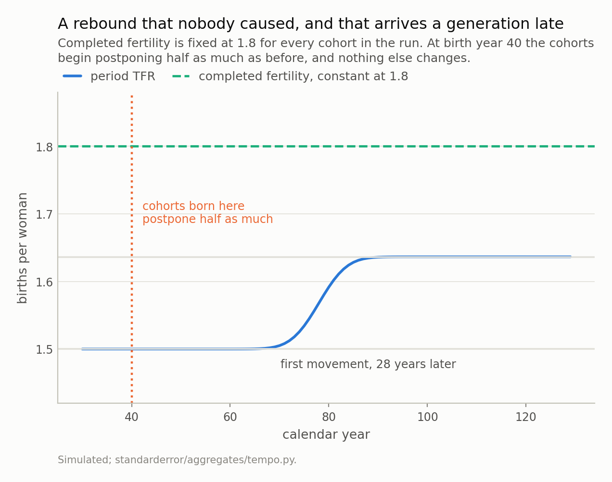
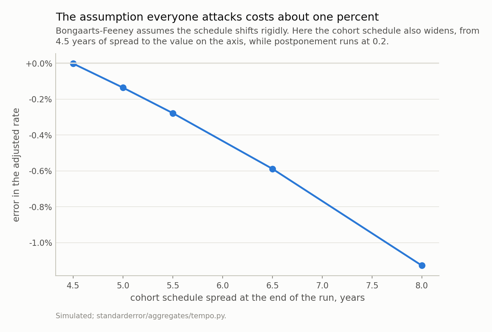

Disclosure: this post was written with the assistance of an AI system (Claude), which wrote the analysis code, ran the experiments and drafted the text. The topic, the constraints, the data choices and the final review are the author's.

*Give every cohort the same completed fertility and let each one postpone by d years relative to the last. The period TFR is then exactly Q/(1+d), the period mean age of childbearing rises at d/(1+d) rather than at d, and dividing the first by one minus the second returns Q to five decimal places — the Bongaarts-Feeney adjustment, which on this schedule is an identity rather than a correction. Two consequences. Postponement at the pace Korea has published puts the period rate about 10% below what the same women would produce with timing held still. And postponement **decelerating** from 0.2 to 0.1 raises the period TFR by 9.1% with the quantum fixed — arriving 28 years after the behaviour changed and taking twenty more to finish. Korea's reported rate rose 11% between 2023 and 2025 while the mean age of mothers rose 0.1 a year against a 2000-2024 average of at least 0.21. Those are the same order of magnitude, which is not a decomposition but is enough to say the rebound does not require anyone to have had more children.*

Episode 1 of *Headline Statistics, Taught Through What Breaks*. The syllabus and the other episodes: https://jongha-jeon-dev.github.io/standarderror/lectures/

## The number that went up

On 25 February 2026 Statistics Korea reported that the country's total fertility rate reached 0.80 in 2025, up from 0.748 the year before and 0.721 in 2023, on 254,500 births. It was covered, reasonably enough, as a rebound: the first sustained rise in more than a decade, after a decade of the lowest fertility ever recorded anywhere.

I want to take the number seriously enough to ask what it measures, because the answer is not the one almost every article assumes, and the gap between the two is large enough to account for a rebound of this size on its own.

This is the first of three episodes about aggregate statistics that get printed as though they described a person, and the three fail in structurally different ways. This one is a summary that is a *synthetic construct*: it describes nobody, so a change in timing moves it without moving anything real. The second is a summary that moves because the *population* changed rather than the people in it — the median wage, which can fall while every individual's wage rises. The third is a summary that is *many-to-one*, so two societies needing opposite policies can share one number, which is the Gini coefficient.

A total fertility rate is not children per woman. It is the sum, over single years of age, of the fertility rates observed among women of each age **in one calendar year**. The 25-year-olds in that sum were born in 2000 and the 40-year-olds in 1985. Nobody has lived the life the number describes. It is the completed family size of a synthetic woman assembled from a single year's cross-section, and it is a perfectly good statistic as long as you remember that timing moves it.

## What a pure delay does, exactly

Here is the cleanest possible version of the problem. Give every cohort of women the same completed fertility *Q* — nobody has fewer children than anybody else, ever — spread over age by a density with mean age *mu* and spread *sigma*. Now let each cohort postpone: cohort *b* has mean age *mu* + *d b*, so successive cohorts have their children slightly later. The rate observed in calendar year *t* among women aged *a* comes from the cohort born in *t* − *a*, so the period schedule is

$$
f(a, t) = Q \phi(a; \mu + d(t - a), \sigma)
$$

Substitute *u* = *a*(1 + *d*) − *mu* − *dt* and integrate over age. The Jacobian is the whole story: *da* = *du*/(1 + *d*), so

$$
\mathrm{TFR}(t) = \frac{Q}{1 + d}
$$

and the period mean age of childbearing works out to (*mu* + *dt*)/(1 + *d*), which rises at

$$
r = \frac{d}{1 + d}
$$

Note what *r* is not. It is not *d*. The period mean age rises **more slowly** than cohorts postpone, because each year's cross-section mixes cohorts at different stages of their own delay. A published mean-age change of 0.1 years per year corresponds to a cohort postponement of about 0.11.

Put the two together. Since 1 − *r* = 1/(1 + *d*),

$$
\frac{\mathrm{TFR}(t)}{1 - r} = Q
$$

That is the Bongaarts-Feeney tempo adjustment, and on this schedule it is not a correction with an error term. It is an identity.

```python
from standarderror.aggregates import tempo as tp

# Every cohort has the same completed fertility. The only thing that
# varies down this table is how much each cohort postpones.
print(f"{'delta':>6} {'period TFR':>11} {'Q/(1+d)':>9} "
      f"{'r':>7} {'d/(1+d)':>8} {'TFR/(1-r)':>10}")
for d in [0.0, 0.05, 0.1, 0.15, 0.2, 0.3]:
    rows = tp.simulate(quantum=1.8, delta=d, years=range(15, 26))
    row = next(x for x in rows if x.year == 20)
    r = tp.mac_change(rows, 20)          # half the change across 2020
    print(f"{d:>6.2f} {row.tfr:>11.5f} "
          f"{tp.period_tfr(1.8, d):>9.5f} {r:>7.4f} "
          f"{tp.mac_rate(d):>8.4f} "
          f"{tp.bongaarts_feeney(row.tfr, r):>10.5f}")
```

```text
 delta  period TFR   Q/(1+d)       r  d/(1+d)  TFR/(1-r)
  0.00     1.79997   1.80000  0.0000   0.0000    1.79997
  0.05     1.71426   1.71429  0.0476   0.0476    1.79996
  0.10     1.63635   1.63636  0.0909   0.0909    1.79996
  0.15     1.56521   1.56522  0.1304   0.1304    1.79996
  0.20     1.49999   1.50000  0.1667   0.1667    1.79997
  0.30     1.38461   1.38462  0.2308   0.2308    1.79998
```

Six rows, and in each one the period TFR matches 1.8/(1 + *d*), the measured mean-age change matches *d*/(1 + *d*), and the adjustment returns 1.8 to five decimal places. The largest disagreement anywhere in the table is 3e-05, which is the cost of summing over whole years of age instead of integrating.

There is a third consequence in that table that is easy to miss. The period schedule's spread is *sigma*/(1 + *d*) — postponement **compresses** the observed schedule, so a period fertility schedule is narrower than any real cohort's. This is why the adjustment is computed separately by birth order in practice, and it is where the assumptions start mattering.



*The dots are the simulation and the line is 1 - 1/(1 + d), which they sit on to within 3e-05. At the pace Korea has recently published, the period rate sits about 9% below what the same women would produce if timing stopped moving. Nobody in this picture has fewer children than anybody else.*

## A rebound with nobody behind it

So far the postponement rate was constant, and a constant delay just parks the period rate below the quantum. The interesting case is when the delay *changes*, because that is what actually happens to a country: first births move later and later, and then at some point they stop moving later quite so fast.

Take the same population — completed fertility fixed at 1.8 for every cohort, forever — and let cohorts born after year 40 postpone half as much as their predecessors, 0.10 instead of 0.20. Nothing else changes. No policy, no incentive, no change in anybody's family size.

```python
# Nothing changes except that cohorts born after year 40 postpone half
# as much as the ones before them. Completed fertility is 1.8 all the
# way through, for everybody.
reb = tp.rebound(quantum=1.8, fast=0.20, slow=0.10, switch=40)
by = {x.year: x for x in reb}

print(f"{'year':>5} {'period TFR':>11} {'quantum':>8} {'gap':>7}")
for y in (60, 70, 75, 80, 85, 90, 110):
    x = by[y]
    print(f"{y:>5} {x.tfr:>11.4f} {x.quantum:>8.2f} "
          f"{x.shortfall:>7.1%}")
```

```text
 year  period TFR  quantum     gap
   60      1.5000     1.80   16.7%
   70      1.5050     1.80   16.4%
   75      1.5343     1.80   14.8%
   80      1.5917     1.80   11.6%
   85      1.6283     1.80    9.5%
   90      1.6359     1.80    9.1%
  110      1.6364     1.80    9.1%
```

The period rate goes from 1.500 to 1.636, a rise of 9.1%, and the algebra says exactly where it lands: 1.8/1.2 to 1.8/1.1. The quantum is printed in the second column of that table so it cannot be misread. It never moves.

Two things about the timing are worth more than the size. The rise does not begin until year 68 — 28 years after the behaviour changed — because the cohorts who changed have to reach childbearing age before the cross-section can see them. And it then takes another 21 years to finish arriving, as those cohorts cross the window. A period fertility rate is a lagging, smeared indicator of behaviour that is decades old, which is an awkward property for a statistic used to evaluate policy on an annual news cycle.



*The period rate rises 9.1%, from 1.500 to 1.636, and the quantum never moves. It does not start rising until year 68 - the cohorts whose behaviour changed have to reach childbearing age first - and takes another 21 years to finish. Three years of period TFR cannot see any of this.*

## Korea's arithmetic

Now the published numbers, and only the published numbers. Statistics Korea reports the mean age of mothers at childbirth as 33.5 in 2022, 33.6 in 2023 and 33.7 in 2024. So *r* is about 0.1 a year, and the correction factor is 1/(1 − 0.1) = 1.111.

Separately, the OECD Family Database records that Korea's mean age at first birth has risen by more than five years since 2000 — it stood at 33.1 in 2024. Over twenty-four years that is an average of at least 0.21 a year, roughly twice the current pace.

```python
# The published Korean figures, and nothing else. Mean age of mother at
# childbirth: 33.5 in 2022, 33.6 in 2023, 33.7 in 2024 (Statistics
# Korea). So r is 0.1 a year, and the adjustment is one division.
tfr = {2023: 0.721, 2024: 0.748, 2025: 0.800}
r_now = 33.7 - 33.6                      # a year of mean age per year
r_long = 5.0 / 24.0                      # OECD: over 5 years since 2000

for name, r in (("recent pace", r_now), ("2000-2024 average", r_long)):
    print(f"{name:>18}  r = {r:.3f}  "
          f"factor 1/(1-r) = {1/(1-r):.3f}  "
          f"adjusted 2024 TFR = {tfr[2024]/(1-r):.3f}")

print(f"\nreported rise 2023 to 2025: "
      f"{tfr[2025]/tfr[2023] - 1:+.1%}")
print(f"fall in the correction factor over the same story: "
      f"{(1/(1-r_now))/(1/(1-r_long)) - 1:+.1%}")
```

```text
       recent pace  r = 0.100  factor 1/(1-r) = 1.111  adjusted 2024 TFR = 0.831
 2000-2024 average  r = 0.208  factor 1/(1-r) = 1.263  adjusted 2024 TFR = 0.945

reported rise 2023 to 2025: +11.0%
fall in the correction factor over the same story: -12.0%
```

Read the last two lines together. The reported total fertility rate rose +11.0% between 2023 and 2025. Over the same story, the tempo correction factor shrank by -12.0%, because postponement decelerating means the distortion it was creating gets smaller.

Those are the same order of magnitude, and that is all I am willing to claim from it. It is not a decomposition: doing this properly needs the mean age by birth order for each year, applied order by order, and the deceleration is measured here as a long-run average against a two-year change rather than as a series. What it is enough for is the negative statement in the title. **A rise of this size does not require anybody to have had more children.** It is fully available from postponement slowing down, and postponement slowing down is exactly what a country produces at the end of a long delay of first births.

Two things this does not say. It does not say the level is fine: 0.748 adjusted at the recent pace is 0.831, which is still the lowest national fertility ever recorded and still far below replacement. And it does not say the rebound is *only* timing — marriages rose sharply in the same period, and marriage in Korea is a strong leading indicator of first births. The claim is about what the statistic can and cannot distinguish, not about which explanation is true.

## Where I expected it to break, and where it actually does

The Bongaarts-Feeney adjustment has one obviously suspect assumption: it assumes the schedule shifts rigidly, keeping its shape and its spread. Real schedules do not. I drafted this episode expecting that to be the punchline, and then measured it.

Let the cohort schedule widen while it shifts, from 4.5 years of spread to 8.0 — a change far larger than any country has produced — with postponement running at 0.2 throughout. The adjusted rate comes out 1.1% low. At a widening of one year it is 0.28% low. The assumption the literature attacks hardest costs about a percent, and the sign is consistent, so it is a bias rather than noise, and a small one.



*A widening far larger than any country has produced leaves the adjustment 1.1% low. This episode was drafted expecting the variance assumption to be where the formula fell over; measured, it is where the formula is fine, which agrees with Mazzuco and Zanotto (2025).*

That agrees with Mazzuco and Zanotto (2025), who find the adjustment robust to shape and scale changes for a reason worth stating: cohort shape changes mostly show up as movements in the **period mean age**, which is the quantity the formula already uses. The formula absorbs them by accident.

So where does it actually break? Two places, and neither is the one I went looking for.

The first is the mean age it is given. The all-order mean age of childbearing moves when the *quantum* moves, not only when timing does — fewer third births pull the all-order mean age down. Korea's 2024 release shows exactly this: the mean age rose 0.1 for first births, was flat for second, and **fell** 0.1 for third. An adjustment computed on the all-order figure, which is what the arithmetic above does, mixes tempo and quantum together. Order-specific is not a refinement here; it is the method.

The second is what the adjusted number is. It is a tempo-free *period* rate: what the TFR would be if timing stopped moving this year. It is not any cohort's completed fertility, and if postponement never stops, the tempo-free rate is a counterfactual nobody lives in. The honest use is comparative — is this year's distortion bigger or smaller than last year's — and that is the use this episode makes of it.

## What to keep

1. The period TFR is one year of age-specific rates stacked into a synthetic person. Timing moves it; family size is not the only thing it responds to.
2. With every cohort at the same completed fertility *Q* and a postponement of *d* per cohort, the period rate is exactly *Q*/(1 + *d*) and the period mean age rises at *d*/(1 + *d*), which is smaller than *d*.
3. So `TFR/(1 − r)` recovers *Q* exactly, where *r* is the annual change in the period mean age. It is an identity on a rigidly shifting schedule, not an approximation.
4. Postponement slowing from 0.2 to 0.1 raises the period rate 9.1% with nobody changing their family size — starting 28 years later and taking 21 more years to finish.
5. Korea's reported +11% rise from 2023 to 2025 and the 12% shrinkage of its tempo correction are the same size. That is not a decomposition, but it is enough to retire the phrase "more children".
6. The assumption everyone attacks — rigid shift, constant spread — costs about 1%. The assumption nobody mentions — that the mean age you feed it is a timing measure rather than a mixture of timing and quantum — is where the method actually needs care.

## Exercise

Take your own country's published total fertility rate and mean age of mothers at childbirth for the last ten years. Compute `TFR/(1 − r)` for each year, with *r* as half the change in the mean age across that year.

Two questions to ask of the result. Does the adjusted series have a different **shape** from the reported one, or only a different level? A constant *r* only shifts the level, and if that is all you find, then the tempo story explains none of your country's change and you have learned something real.

Then find the mean age by birth order and redo it order by order, summing the adjusted order-specific rates. Where the two answers disagree, the all-order mean age was carrying quantum change, and the size of the disagreement is the size of the mistake the one-line version makes.

The uncomfortable part is last. Whatever number you end up with, it is still a period rate — a statement about a synthetic woman in a counterfactual year where timing stopped. Write down what you would need in order to say something about real women's completed families, and notice that all of it is unavailable until they are fifty.

---

### Data

- No external data enters any computation. Every figure and every table here is constructed from the simulation in the code shown, executed when this page was built.
- Published figures quoted in the prose, and used nowhere else: Statistics Korea, *Births and Deaths* releases for 2023, 2024 and the 2025 provisional (total fertility rate; mean age of mother at childbirth 33.5 in 2022, 33.6 in 2023, 33.7 in 2024; 254,500 births in 2025); OECD Family Database SF2.3 for the statement that Korea's mean age at first birth has risen by more than five years since 2000.
- Machinery: `standarderror/aggregates/tempo.py`, tested in `tests/test_tempo.py`.
- Where this stops: Bongaarts and Feeney, "On the quantum and tempo of fertility", *Population and Development Review* 24 (1998), for the adjustment; Kohler and Philipov, "Variance effects in the Bongaarts-Feeney formula", *Demography* 38 (2001), for the correction when the schedule's spread also moves; Mazzuco and Zanotto, *Demographic Research* 52 (2025) art. 19, for the finding that shape changes act largely through the period mean and the adjustment is therefore more robust than that suggests.

### Reproducibility

- **environment**: standarderror=0.1.0, python=3.11.15, numpy=2.4.4
- **code blocks**: executed at build time; the values the prose quotes are pinned, so drift fails the build
- **simulation**: one normal fertility schedule per cohort, summed over single years of age from 12 to 60, with completed fertility fixed at 1.8 for every cohort in every run
- **determinism**: no random numbers anywhere; the schedule is analytic and every quoted value is a closed-form quantity evaluated on a fixed age grid

Code: <https://github.com/jongha-jeon-dev/standarderror>
