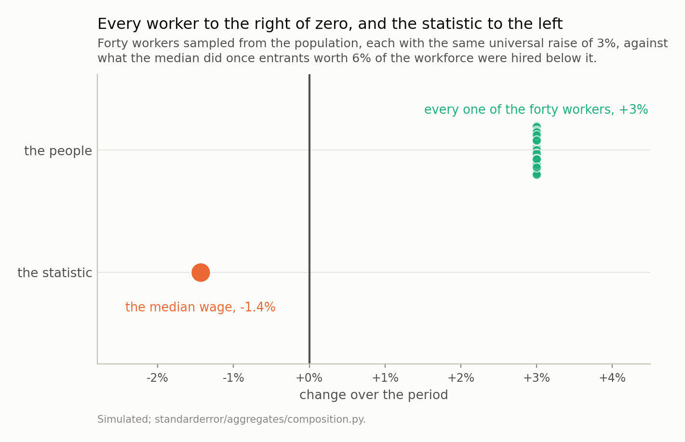
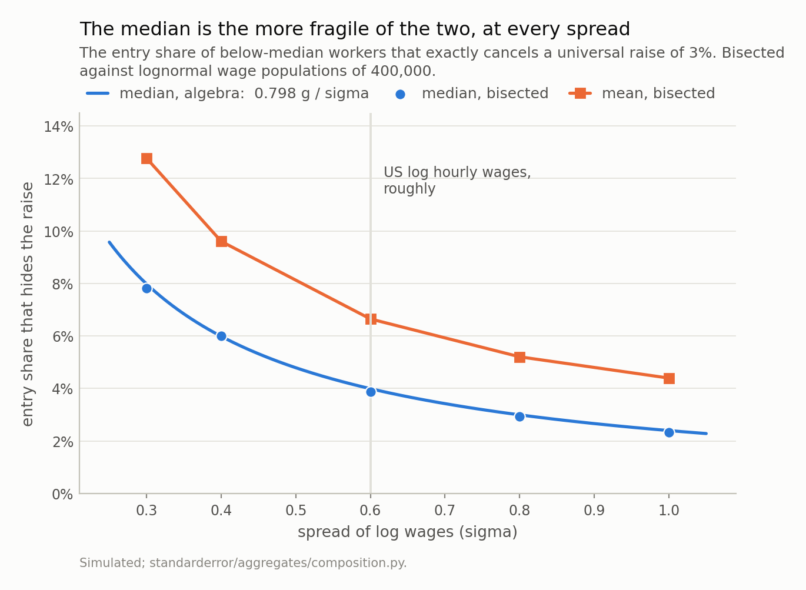
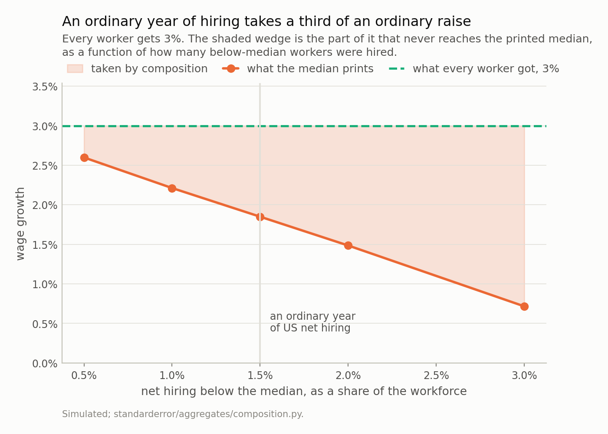
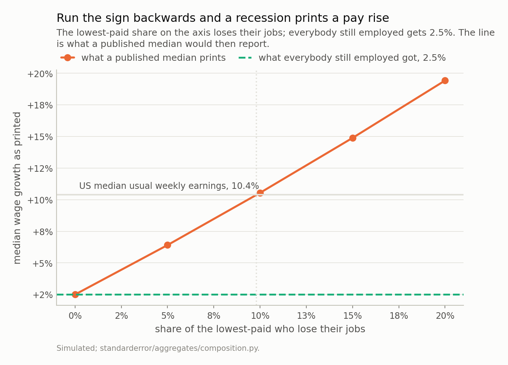

Disclosure: this post was written with the assistance of an AI system (Claude), which wrote the analysis code, ran the experiments and drafted the text. The topic, the constraints, the data choices and the final review are the author's.

*Give every worker a universal raise of g and hire entrants below the median. The median slides m/2 ranks, order statistics near the median are spaced 1/(n f(M)) apart, so the median falls once the entry share passes 2 g M f(M) - which for a lognormal is 0.798 g/sigma, or 4.0% at a 3% raise and the spread of US log wages. Bisected: 3.87%. Two results were backwards from what I expected. The threshold falls as inequality rises, so a wider wage distribution is more fragile to composition rather than less. And the median flips at about 60% of the entry share the mean needs, at every spread tried - the median is robust to outliers, which is not what composition is. Run the sign the other way and it reproduces 2020: losing the lowest-paid 9.8% while everybody still employed gets 2.5% prints a median growth of 10.4%, and 10.4% is what US median usual weekly earnings printed in the quarter the country lost 20.5 million jobs.*

Episode 2 of *Headline Statistics, Taught Through What Breaks*. The syllabus and the other episodes: https://jongha-jeon-dev.github.io/standarderror/lectures/

## A pay rise in the worst month on record

In April 2020 the United States lost 20.5 million jobs in a single month. In the quarter that contained it, published median usual weekly earnings grew 10.4% against the year before.

Both of those are correct. Neither is a mistake in the data, and no revision has taken them back. They sit together because a wage statistic does not compare two payslips. It compares two populations, and once people are hired and laid off between the prints, the difference contains a term that has nothing to do with anybody's pay.

Episode 1 was about a summary that describes nobody. This one is about a summary that describes somebody — just not the same somebody twice.

## The version that fits in three numbers

Before writing any algebra, here is the whole failure at a scale you can check by eye.

```python
import numpy as np

before = np.array([10.0, 20.0, 30.0])
raised = before * 1.1              # everybody, ten percent, no exceptions
after = np.concatenate([raised, [5.0, 5.0]])   # two people are hired

print("wages before     ", before, " median", np.median(before))
print("after the raise  ", raised, " median", np.median(raised))
print("after two hires  ", after, " median", np.median(after))
print("did anyone lose? ", bool(np.any(raised < before)))
```

```text
wages before      [10. 20. 30.]  median 20.0
after the raise   [11. 22. 33.]  median 22.0
after two hires   [11. 22. 33.  5.  5.]  median 11.0
did anyone lose?  False
```

Three workers on 10, 20 and 30. Everybody gets ten percent, so nobody is worse off — the last line of that output is the check. Two people are then hired at 5. The median goes from 20 to 11.

That is not a rounding artefact or a small-sample curiosity. It is the mechanism, and the rest of this episode is about how much churn it takes at realistic scale.

It also has a name, which is worth having because it makes the failure recognisable elsewhere. This is Simpson's paradox with the groups left implicit: incumbents and entrants are two groups, each of which moved up or stayed put, while the pooled summary moved down. The same shape produces a hospital whose survival rate falls as every ward improves, a company whose average deal size shrinks in the year every salesperson closes bigger, and a model whose accuracy drops on a benchmark it got better at, because the benchmark grew a harder section. Wherever a pooled number is reported over two periods and the pool was allowed to change, this term is present and unlabelled.



*There is no dispersion in the upper row to look at: the raise is universal, so every worker is at exactly +3%. The median prints -1.4%. Note also how small a real raise is on a wage axis - 3% is a displacement you could not see if this figure plotted levels, which is part of why the composition term goes unnoticed.*

## How much churn it takes, exactly

Sort the *n* incumbents. The median is the one at rank (*n* + 1)/2. Give everybody a raise of *g*, then hire *m* entrants who all earn less than the old median. In the combined list the first *m* places belong to entrants, so the new median is the incumbent at rank

$$
\frac{n + m + 1}{2} - m = \frac{n - m + 1}{2}
$$

The median has slid *m*/2 ranks **down** the incumbent list. How far is that in money? Consecutive order statistics of a sample from a density *f* are spaced about 1/(*n f*(*M*)) apart near the median — the same order-statistic spacing that decided where a barcode's largest gap falls two series ago. So the slide costs

$$
\frac{m}{2 n f(M)}
$$

while the raises are worth *gM*. Setting them equal gives the entry share at which a universal raise stops showing up at all:

$$
s^{*} = 2 g M f(M)
$$

*Mf*(*M*) is dimensionless. For a lognormal it is 1/(*sigma*√(2π)), so

$$
s^{*} = \frac{0.798 g}{\sigma}
$$

At a three percent raise and a log-wage spread of 0.6, roughly what US hourly wages have, that is **4.0%**. Four percent of new hires below the median is enough to hide a universal three percent raise completely.

```python
from standarderror.aggregates import composition as cp

# The entry share that exactly cancels a universal raise, bisected
# against a population of 400,000, next to the closed form
# s* = 2 g M f(M) = 0.798 g / sigma.
print(f"{'sigma':>6} {'median s*':>10} {'algebra':>9} "
      f"{'mean s*':>9} {'ratio':>7}")
for row in cp.fragility_sweep([0.3, 0.4, 0.6, 0.8, 1.0], g=0.03):
    print(f"{row['sigma']:>6.1f} {row['median_share']:>10.2%} "
          f"{row['median_predicted']:>9.2%} "
          f"{row['mean_share']:>9.2%} {row['ratio']:>7.2f}")
```

```text
 sigma  median s*   algebra   mean s*   ratio
   0.3      7.81%     7.98%    12.77%    0.61
   0.4      6.00%     5.98%     9.60%    0.63
   0.6      3.87%     3.99%     6.65%    0.58
   0.8      2.93%     2.99%     5.20%    0.56
   1.0      2.33%     2.39%     4.39%    0.53
```

The bisected shares sit on the closed form to within 3%. Two things in that table are backwards from what I expected, and both are in the last two columns.

**The threshold falls as inequality rises.** At a log-wage spread of 0.3 it takes 7.8% of new hires to hide the raise; at 1.0 it takes 2.3%. A more unequal country is *more* fragile to composition, not less, and the reason is in the formula: a wide distribution is thin at its median, so the same slide in rank travels further in money.

**The median breaks before the mean, every time.** The ratio column runs 0.61, 0.63, 0.58, 0.56, 0.53 — the median flips at a bit over half the entry share the mean needs. I had assumed the opposite, on the usual grounds that the median is the robust one. It is robust to *outliers*. Composition is not an outlier problem: it moves the median by moving who is standing in the middle, and the mean at least has the decency to weight a new arrival by only 1/*n*.



*Two things here are backwards. The thresholds **fall** as the wage distribution widens, so a more unequal country is more fragile to composition, not less - a wide distribution is thin at its median, so the same slide in rank travels further in money. And the median sits below the mean everywhere, at 0.53 to 0.63 of the mean's threshold. I expected that ordering the other way round.*

## The boring version runs every year

Everything so far has been calibrated to make a point: a raise that vanishes completely needs 4.0% of new hires, which is a lot of churn for one year. That framing undersells the problem, because the interesting case is not the raise vanishing. It is the raise being *quietly reduced*, every year, by an amount nobody reports.

Net employment growth in an ordinary American year is around one to one and a half percent, and hiring skews below the median because entry-level jobs are entry-level. So put an ordinary amount of hiring against an ordinary raise.

```python
# And the boring case, which runs every year rather than once a
# century: net hiring of a percent or two, concentrated below the
# median, against a universal raise of 3%.
print(f"{'below-median hires':>19} {'the print':>10} "
      f"{'the raise':>10} {'swallowed':>10}")
for share in [0.005, 0.01, 0.015, 0.02, 0.03]:
    r = cp.entry_effect(share=share, g=0.03)
    print(f"{share:>19.1%} {r['printed']:>10.2%} "
          f"{r['matched']:>10.1%} {r['swallowed_fraction']:>10.0%}")
```

```text
 below-median hires  the print  the raise  swallowed
               0.5%      2.60%       3.0%        13%
               1.0%      2.21%       3.0%        26%
               1.5%      1.85%       3.0%        38%
               2.0%      1.49%       3.0%        50%
               3.0%      0.72%       3.0%        76%
```

Net hiring of 1.5% — a completely unremarkable year — swallows 1.15 percentage points of a 3% raise, which is 38% of it. The print reads 1.85%.

Put that beside the thing it gets compared against. Real wage growth in a good year is under a point, so a composition term of 1.15 points is not a correction to the story; it is larger than the story. And unlike 2020 it produces no headline, no Federal Reserve blog post and no correction, because 1.85% looks exactly like what a wage series is supposed to look like.

The sign of this one is worth holding onto too. In an expansion, composition **understates** wage growth, because you are hiring at the bottom. In a downturn it **overstates** it, because you are firing at the bottom. So the composition term is procyclical in employment and countercyclical in the printed wage — which means the measured series is systematically flatter than the truth in both directions, and a reader who compares a boom's wage print with a bust's is comparing two numbers whose errors point opposite ways.



*At 1.5% of net hiring the print reads 1.85% against a raise of 3% - a wedge of 1.15 points, or 38%. That is larger than real wage growth in a good year, and it arrives with no headline attached, because the printed number looks exactly like a wage series is supposed to look.*

## The same arithmetic, run backwards, is 2020

Everything above hires people. Fire them instead and every sign reverses: remove workers from the bottom and the median slides *up* the remaining list, printing a pay rise that nobody received.

So take a population where everybody still employed gets an ordinary 2.5%, and delete the lowest-paid share of it.

```python
# Now the 2020 sign: the lowest-paid lose their jobs instead, and
# everybody still employed gets 2.5%. Nothing else changes.
print(f"{'jobs lost':>10} {'median prints':>14} "
      f"{'mean prints':>12} {'anyone actually got':>20}")
for share in [0.0, 0.05, 0.1, 0.15, 0.2]:
    r = cp.exit_effect(share=share, g=0.025)
    print(f"{share:>10.0%} {r['published_median_growth']:>14.2%} "
          f"{r['published_mean_growth']:>12.2%} "
          f"{r['matched_growth']:>20.1%}")
```

```text
 jobs lost  median prints  mean prints  anyone actually got
        0%          2.50%        2.50%                 2.5%
        5%          6.41%        6.56%                 2.5%
       10%         10.54%       10.48%                 2.5%
       15%         14.89%       14.46%                 2.5%
       20%         19.43%       18.56%                 2.5%
```

Read the last column first: it is 2.5% on every row, by construction. Nobody in any of those scenarios received anything other than 2.5%. The first column is the only thing that changes.

Losing the lowest-paid 9.8% prints a median growth of 10.4%. That is the figure the United States printed for median usual weekly earnings in the second quarter of 2020, and April 2020 alone removed 20.5 million jobs concentrated in the country's lowest-paid industries.

I want to be exact about what that is and is not. It is not a decomposition of the real series — I have not touched the microdata, and the simulation's wage distribution is a lognormal rather than the American one. It is a demonstration that a job-loss profile of roughly the observed size and shape reproduces the printed number *with no pay growth anywhere near it*, which is enough to make the printed number unusable as evidence about pay.



*Nobody's pay growth is anything other than 2.5% anywhere on this line. Losing the lowest-paid 9.8% prints 10.4%, which is what US median usual weekly earnings printed in the second quarter of 2020. The dotted rule marks that share; the country lost 20.5 million jobs in the single month of April 2020, concentrated in its lowest-paid industries.*

## What the people who own the statistic did about it

This is not a discovery and the institutions that publish these numbers said so at the time.

The Federal Reserve Bank of Dallas decomposed the spike on CPS data and put the composition term at **5.3 of 7.0 percentage points** — three quarters of the whole move. The Federal Reserve Bank of Atlanta reported that the establishment survey's 4.5-point jump between February and April 2020 falls to 2.6 points once leisure and hospitality are excluded, which is the same statement in a cruder form. And its Wage Growth Tracker, which exists for exactly this reason, removed **nearly 8 percentage points** from the published 10.4%.

The Tracker's method is the fix and it is one line long: restrict the sample to people who were employed in *both* periods, and compute the median of their individual wage changes. That is not a smarter estimator of the same quantity. It is a different quantity — the median change of a person, rather than the change of a median — and only the first one is what a reader means by "wages went up".

## Where the fix stops

Matching individuals removes the arithmetic problem and replaces it with a sampling one, and the replacement is not free.

A matched sample can only contain people who held a job in both periods. In a quarter when 20.5 million people stopped working, that sample is not the workforce; it is the part of the workforce that survived, and survival was not random with respect to pay. So the matched number is an honest answer to a narrower question: what happened to the pay of people who kept working. If you want to know what happened to *earnings* in the economy, the people who went to zero are the story, and no wage statistic that conditions on being employed can see them.

Which leaves the reader with two numbers and no single one that means what they wanted. That is the actual situation, and the useful move is to say which question you are asking before picking the statistic, rather than picking the statistic and inheriting whichever question it happens to answer.

## What to keep

1. A wage statistic compares two populations. The difference is the pay change plus a composition term, and the composition term has no upper bound.
2. Hire entrants below the median and it slides *m*/2 ranks, which costs *m*/(2*n f*(*M*)). A universal raise of *g* disappears once the entry share passes 2*gMf*(*M*), or 0.798*g*/*sigma* on a lognormal — **4.0%** at a 3% raise and the spread of US wages.
3. That threshold **falls** as the wage distribution widens. More unequal means more fragile.
4. The median is the more fragile of the two, at 0.53 to 0.63 of the mean's threshold. Robust to outliers is not robust to composition.
5. In an ordinary year, net hiring of 1.5% below the median swallows 1.15 points of a 3% raise — 38% of it, and more than a good year's real wage growth. The sign flips with the cycle, so booms understate and busts overstate.
6. Reverse the sign and losing the lowest-paid 9.8% prints 10.4% on 2.5% of real growth. The Dallas Fed measured the real thing at 5.3 of 7.0 points.
7. The fix is to match individuals, and it costs you the people who lost their jobs. Choose the question first.

## Exercise

Find your country's published median or average wage series and its employment series, quarterly, over 2019 to 2021. Plot the wage growth against the change in employment over the same quarters.

If the two are negatively related — wage growth printing high exactly when employment fell — you have found the composition term in your own national statistics, without any microdata. That correlation should not exist if the statistic measured pay.

Then do the harder half. Pick the sharpest quarter and ask what job-loss profile would be needed to produce the whole of that quarter's wage print at zero real pay growth, using `s* = 0.798 g / sigma` and a *sigma* estimated from any published wage decile table. If the answer is smaller than the job losses that actually happened, the print carries no information about pay at all, and you have established that with two published series and one division.

The uncomfortable part: go back and find the commentary written about that quarter's wage number at the time. Some of it will have been written by people who knew all of the above.

---

### Data

- No external data enters any computation. Every figure and every table here is constructed from the simulation in the code shown, executed when this page was built.
- Published figures quoted in the prose, and used nowhere else: US Bureau of Labor Statistics, for the 20.5 million jobs lost in April 2020; Federal Reserve Bank of Atlanta, "Compositional distortions to a measure of wage growth during the pandemic", *macroblog* (10 November 2021), for the 10.4% published median usual weekly earnings growth, the nearly 8 percentage points the matched-individual Wage Growth Tracker removes, and the establishment-survey spike of 4.5 points falling to 2.6 with leisure and hospitality excluded; Federal Reserve Bank of Dallas, "Pandemic pushed the U.S. into recession ... and hourly wages rose?" (9 February 2021), for the CPS decomposition in which the composition term is 5.3 of 7 percentage points.
- Machinery: `standarderror/aggregates/composition.py`, tested in `tests/test_composition.py`.
- Where this stops: the fix in the last section - matching individuals across the two periods - removes the arithmetic problem and replaces the question. A matched sample can only contain people who held a job in both periods, so in a quarter when twenty million people stopped working it answers something much narrower than "what happened to wages".

### Reproducibility

- **environment**: standarderror=0.1.0, python=3.11.15, numpy=2.4.4
- **code blocks**: executed at build time; the values the prose quotes are pinned, so drift fails the build
- **simulation**: lognormal wage populations of 200,000 to 400,000 in units of their own median, with the raise applied to every incumbent without exception
- **determinism**: one generator per measurement, seeded from that measurement's own parameters - spread and raise - rather than advanced through a loop

Code: <https://github.com/jongha-jeon-dev/standarderror>
