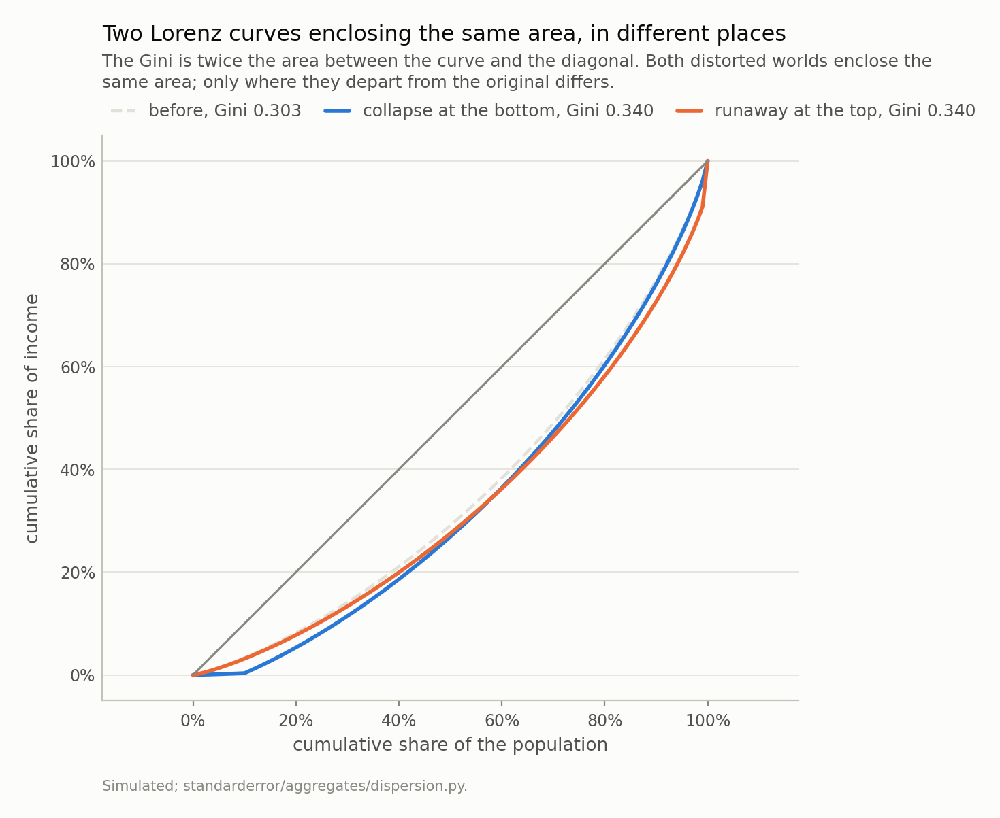
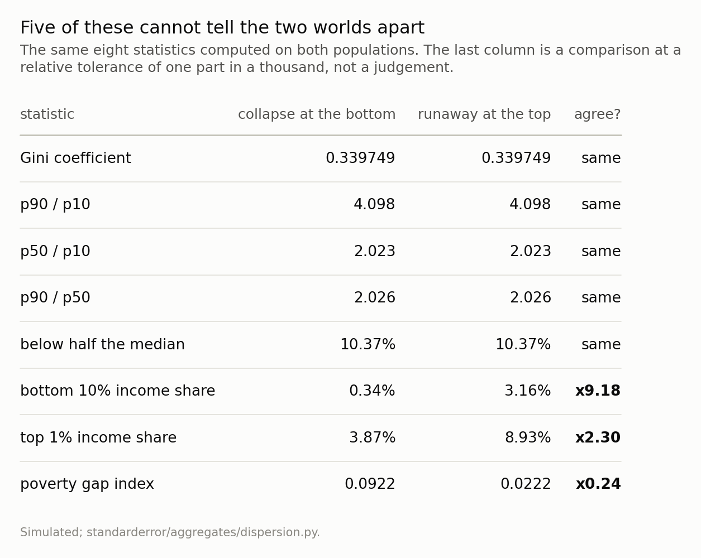
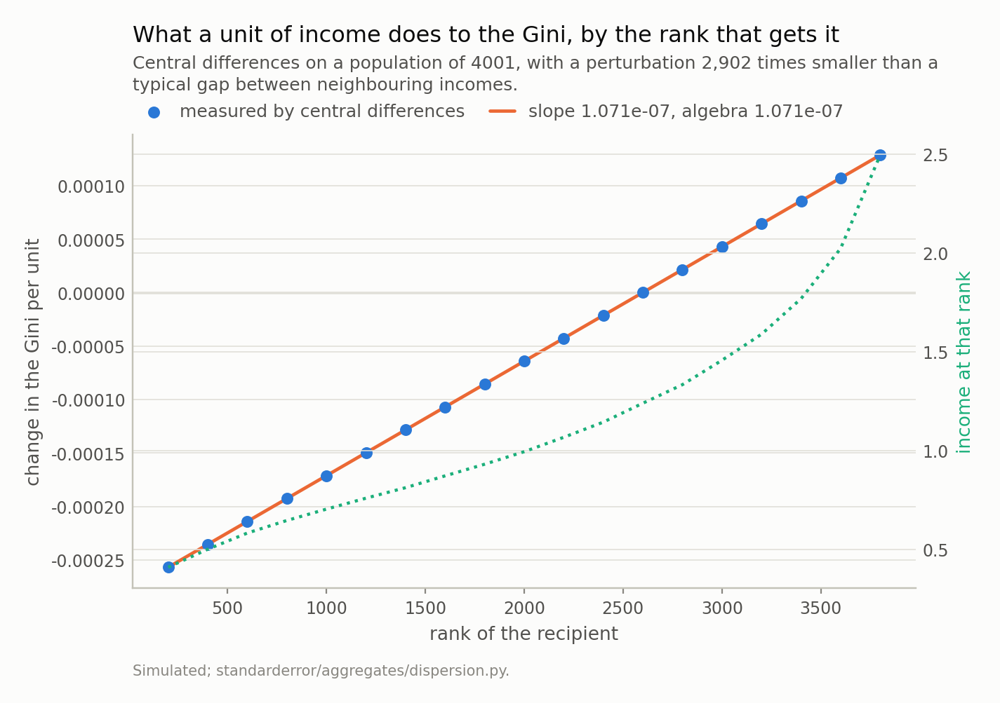

Disclosure: this post was written with the assistance of an AI system (Claude), which wrote the analysis code, ran the experiments and drafted the text. The topic, the constraints, the data choices and the final review are the author's.

*Take one lognormal population and distort it twice: the poorest tenth loses 90% of its income, or the richest hundredth has its income multiplied by 2.51. Tuned to the same Gini, both land on 0.339749 exactly. And the coefficient is not the only thing that cannot separate them - p90/p10, p50/p10, p90/p50 and the poverty headcount are identical too, because each distortion lives inside a tail. Five headline numbers agree while the poorest tenth holds 9.2 times more income in one world than the other. The reason is exact: dG/dx_k = 2k/(n^2 mu) - c, so a unit of income is priced by the recipient's rank and by nothing else about them - measured R-squared 1.0000000000 against rank, slope matching to six figures, over ranks whose incomes differ sixfold. Which bounds what the coefficient could ever have said about the bottom: the poorest tenth holds 3.3% of income here, so destroying all of it moves the Gini by 0.041, about what tripling the top percentile does. What does separate the two worlds is a tail share, or a poverty measure that counts depth: the gap index is 0.092 against 0.022 on an identical headcount.*

Episode 3 of *Headline Statistics, Taught Through What Breaks*. The syllabus and the other episodes: https://jongha-jeon-dev.github.io/standarderror/lectures/

## Two numbers that disagree about which country is worse

Austria's Gini index was 31.2 in 2022 and Cyprus's was 31.8. On the coefficient, Cyprus is the more unequal of the two. Its poorest tenth holds 2.46% of income against Austria's 1.89% — thirty percent more.

Those two columns come from different sources on different definitions, so treat the pair as an illustration rather than a measurement: the Gini figures are World Bank and disposable-income based, and the decile shares are World Inequality Database pre-tax. What the pair illustrates is that the ordering can disagree with itself, and this episode is about why it must.

It is worth being clear about what the coefficient is asked to do, because that is where the strain comes from. A Gini is used for two jobs at once. The first is to rank countries or years — is this place more unequal than that one, is it getting worse — and for that you need a scalar, which is exactly why the measure exists. The second is to justify a response: a rising coefficient is read as a case for redistribution, and a falling one as evidence that something worked. The first job needs only an ordering. The second needs the number to know **where** the inequality is, because the policy that helps a collapsed bottom and the policy that addresses a runaway top are different policies with different budgets, and one of them does nothing for the other.

A scalar can do the first job. This episode is about the fact that it cannot do the second, and about how far apart two worlds sharing one coefficient can be.

Episode 1 was a summary that describes nobody. Episode 2 was a summary that describes somebody, just not the same somebody twice. This one describes something real, and does not say what.

## One population, two distortions, one coefficient

Take a single lognormal income distribution and break it twice, in opposite places.

**Collapse.** The poorest tenth loses 90% of its income. Nobody else is touched.

**Runaway.** The richest hundredth has its income multiplied. Nobody else is touched.

Fix the collapse and solve for the multiple that lands on the same Gini.

```python
from standarderror.aggregates import dispersion as dp

# One population. Two distortions. The collapse is fixed at 90% and the
# runaway multiple is solved for, so that both land on the same Gini.
pair = dp.matched_pair(a=0.9)

print(f"base population        Gini {pair['base_gini']:.6f}")
print(f"poorest tenth loses {pair['a']:.0%}  "
      f"Gini {dp.gini(pair['collapse']):.6f}")
print(f"richest 1% x {1 + pair['b']:.3f}       "
      f"Gini {dp.gini(pair['runaway']):.6f}")
print(f"they differ by         {pair['disagreement']:.1e}")
```

```text
base population        Gini 0.302785
poorest tenth loses 90%  Gini 0.339749
richest 1% x 2.510       Gini 0.339749
they differ by         0.0e+00
```

The poorest tenth losing 90% of everything and the richest hundredth multiplying by 2.51 are, to the Gini coefficient, the same event. Not approximately: the two agree to 0.0e+00, which is zero at this precision because the multiple was solved for.

That much is a construction and it proves nothing on its own — any one-parameter family hits any reachable target. The interesting part is what *else* fails to separate them.



*The blue curve flattens along the bottom tenth, which lost 90% of its income, and then runs parallel to the baseline. The orange one bends only at the far right, where the richest hundredth was multiplied by 2.51 - and sits fractionally below the baseline everywhere else, because raising the top raised the total and so lowered everyone else's *share*. Twice the area between either curve and the diagonal is 0.339749, for both, exactly. The coefficient is an area, and an area does not record where it was.*

```python
# Every headline statistic anyone prints about a distribution, on both.
low, high = dp.describe(pair["collapse"]), dp.describe(pair["runaway"])

print(f"{'statistic':>24} {'collapse':>11} {'runaway':>11} {'':>7}")
for k, v in dp.agreement(low, high).items():
    mark = "same" if v["same"] else f"x{v['ratio']:.2f}"
    print(f"{k:>24} {v['collapse']:>11.5f} {v['runaway']:>11.5f} "
          f"{mark:>7}")
```

```text
               statistic    collapse     runaway        
                    gini     0.33975     0.33975    same
                 p90_p10     4.09768     4.09768    same
                 p50_p10     2.02263     2.02263    same
                 p90_p50     2.02592     2.02592    same
               headcount     0.10367     0.10367    same
          bottom10_share     0.00345     0.03163   x9.18
              top1_share     0.03875     0.08928   x2.30
               gap_index     0.09224     0.02225   x0.24
          mean_shortfall     0.88974     0.21457   x0.24
             mean_median     1.12837     1.22941   x1.09
```

Five of the eight agree. The Gini by construction; the three percentile ratios because each distortion lives **inside** a tail and never reaches the tenth or the ninetieth percentile; and the poverty headcount because both worlds leave exactly the same people below half the median — the collapse pushes them further under it without pushing anyone new across.

The three that see it are a bottom-decile share (9.2 times larger in the runaway world), a top-percentile share (2.3 times larger), and the poverty **gap** index, which is 0.092 against 0.022. The people under the line are 89% below it in one world and 21% below it in the other, and only a measure of depth notices.

So the recommendation cannot be "use the decile ratio instead". It has to be a tail share or the whole curve.



*The percentile ratios agree because each distortion lives **inside** a tail and never reaches the tenth or ninetieth percentile. The poverty headcount agrees because both worlds leave the same people under the line. What separates them is a tail share - the poorest tenth holds 9.2 times more in one world - or a poverty measure that counts depth instead of heads.*

## Why the coefficient cannot see it

This is not an accident of the construction. Write the Gini in its rank-weighted form, on sorted incomes:

$$
G = \frac{2 \sum_i i x_i}{n^2 \mu} - \frac{n + 1}{n}
$$

and differentiate with respect to one person's income. The first term gives 2*k*/(*n*²*mu*); the second is where *mu* itself moves, and it contributes the same amount whichever *k* you perturb. So

$$
\frac{\partial G}{\partial x_k} = \frac{2k}{n^2 \mu} - c
$$

with *c* independent of *k*. **The sensitivity is linear in the recipient's rank, with the same slope everywhere, and depends on nothing else about them** — not on their income, and not on what the money would do for them.

```python
# And why. dG/dx_k = 2k/(n^2 mu) - c, so the sensitivity to a unit of
# income is linear in the recipient's rank and in nothing else.
s = dp.rank_sensitivity(dp.population(n=4001))

print(f"fitted slope     {s['slope']:.6e}")
print(f"2 / (n^2 mu)     {s['predicted_slope']:.6e}")
print(f"ratio            {s['slope_ratio']:.6f}")
print(f"R^2 vs rank      {s['r_squared']:.10f}")
print(f"income spread over the same ranks  "
      f"{s['income_range']:.1f}x")
```

```text
fitted slope     1.071359e-07
2 / (n^2 mu)     1.071357e-07
ratio            1.000001
R^2 vs rank      1.0000000000
income spread over the same ranks  6.1x
```

An R-squared of 1.0000000000 against rank, and a fitted slope matching 2/(*n*²*mu*) to a ratio of 1.000001. Over the same ranks, what those people earn varies by a factor of 6.1.

A unit of income handed to someone at the fifth percentile and the same unit handed to someone at the ninetieth move the coefficient by amounts that differ only through their ranks. The first one changes a life and the second is a rounding error in a portfolio, and the Gini prices them by their positions in a queue.

A note on how not to measure this, because I did it the wrong way first. The obvious experiment is to move a fixed sum some number of ranks down the distribution and watch the coefficient. That measures something else: a sum worth one percent of the mean is about three thousand times a typical gap between neighbouring incomes at this sample size, so it vaults the recipient over thousands of people and the rank distance in the formula is not the rank distance you set. The measurement came out **non-monotone in the distance**, which is what sent me back to the algebra. The perturbation has to be small against the local spacing — the figure above uses one 2,902 times smaller — and then the identity is exact.



*A straight line, R-squared 1.0000000000, with a slope matching 2/(n²μ) to a ratio of 1.000001. The dotted curve is what those people actually earn, and it varies by a factor of 6.1 across the same range. The coefficient prices a unit of income by the recipient's place in the queue and by nothing else about them.*

## What that bounds

The rank-linearity has a consequence worth stating on its own, because it puts a ceiling on what the coefficient could ever have told you about the poor.

In this population the poorest tenth holds 3.3% of total income. So there is only 3.3% of income down there for any redistribution to move, and taking **all** of it — one person in ten with nothing at all — moves the Gini from 0.303 to 0.344, a change of 0.041.

For comparison, multiplying the top percentile's income by 3 moves it 0.048. Complete destitution for a tenth of the population and a tripling at the very top are, on this measure, the same size of event.

This is not a defect that a correction fixes. A summary weighted by income share cannot be sensitive to a group that holds almost none of it, and the poorest decile of any unequal country holds almost none of it. If the bottom is what you care about, the coefficient was never going to be the instrument.

## What to do instead, and what it costs

There is no better scalar. That is the actual finding, and it is worth being blunt about because the literature contains a long shelf of proposed replacements and every one of them is a scalar.

Atkinson's measures pick an inequality-aversion parameter and are explicit that the parameter is a value judgement rather than a measurement. The Theil index is decomposable between groups, which is genuinely useful and does not make it one-to-one. The Palma ratio deliberately looks only at the top decile over the bottom four, which fixes this episode's example and breaks on a different one. Every scalar throws away a shape; choosing one chooses which shape you are willing to lose.

So the practical rule is two lines long. **Publish the Lorenz curve, or a small number of quantile shares, next to any coefficient** — three numbers, the bottom decile's share, the top decile's and the top percentile's, would have separated the two worlds in this episode and take one line of a table. And **say which end of the distribution your question is about before choosing the measure**, because the measure decides which end it can see, and it decides it silently.

The cost of the honest version is that you no longer get a single number to rank countries by, which is exactly what a coefficient is used for. That is not a solvable tension. It is the price of the shape being real.

## What to keep

1. The Gini is many-to-one onto distributions. The poorest tenth losing 90% and the richest hundredth multiplying by 2.51 land on the same coefficient exactly.
2. So do p90/p10, p50/p10, p90/p50 and the poverty headcount — five headline numbers agreeing while the poorest tenth holds 9.2 times more income in one world.
3. Because `dG/dx_k = 2k/(n²μ) − c`: a unit of income is priced by the recipient's rank, linearly, and by nothing else. R-squared 1.000000, over ranks whose incomes differ 6.1-fold.
4. Which bounds the coefficient's reach at the bottom. The poorest tenth holds 3.3% of income, so destroying all of it moves the Gini 0.041 — about what tripling the top percentile does.
5. The poverty **headcount** has the same defect in miniature: it cannot see the poor getting poorer, because nobody crosses the line. The gap index can, at 0.092 against 0.022.
6. There is no better scalar, only a different blind spot. Publish a curve or a few shares beside the coefficient, and decide which end of the distribution the question is about first.

## What the three episodes have in common

This closes the track, and the three failures turn out to be one question asked three ways.

Episode 1's total fertility rate was a **synthetic construct**: it described nobody, so a change in the timing of births moved it while no cohort's family size moved at all. Episode 2's median wage described somebody, but not the same somebody twice — the **population changed** between the prints, and the difference carried a term with no upper bound and no label. This episode's Gini describes something real and complete, and is **many-to-one**: it cannot say which of two opposite worlds produced it.

Those are three distinct mechanisms, and none of them is a data-quality problem. The numbers were correct in all three cases, published by competent institutions, with no revisions pending. What went wrong each time was the step from the number to the sentence a reader forms about it.

Which gives the question worth carrying away, and it is not about demography or wages or inequality. For any summary you rely on: **what are two states of the world this number cannot tell apart, and would I act differently in them?** In episode 1 the two states were "families got smaller" and "births moved later". In episode 2 they were "pay fell" and "the workforce changed". Here they are "the bottom collapsed" and "the top ran away". Each pair took under an hour to construct, and in each pair the two states call for different budgets.

If a summary you use every week survives that question, it is doing its job. If it does not, the honest move is not to stop using it — it is to publish the companion that breaks the tie, which in all three episodes was a small and cheap thing: a mean age by birth order, a matched-individual median, three quantile shares.

## Exercise

Take your own country's published income decile shares — most statistical offices publish them, and they are one table. Compute the Gini from them, then construct a second set of decile shares with the same Gini and a bottom decile half as large. You will not need optimisation; a two-parameter adjustment of the top and bottom deciles has enough freedom.

Now write one sentence describing each of the two countries you have just produced, and notice that the sentences call for different budgets.

Then the part that generalises past income. Find a scalar summary you rely on in your own work — a single accuracy figure, a Sharpe ratio, an average latency, one AUC — and ask the same question of it: what are two states of the world that it cannot tell apart, and would you act differently in them? If you can construct such a pair in ten minutes, the number needs a companion, and this episode is really about that rather than about the Gini.

---

### Data

- No external data enters any computation. Every figure and every table here is constructed from the simulation in the code shown, executed when this page was built.
- Published figures quoted in the prose, and used nowhere else: World Bank Gini index values of 31.2 for Austria and 31.8 for Cyprus (2022), alongside World Inequality Database pre-tax income shares of 1.89% and 2.46% for the bottom decile, as tabulated on Wikipedia's list of countries by income inequality. Those two columns are different sources on different definitions - the Gini is disposable-income based and the shares are pre-tax - so the pair is an illustration of the ordering disagreeing, not a measurement of it.
- Machinery: `standarderror/aggregates/dispersion.py`, tested in `tests/test_dispersion.py`, including agreement with the mean-absolute-difference form and with the Lorenz integral.
- Where this stops: nothing here says the Gini is wrong or should not be published. A scalar cannot carry a shape, every scalar has a blind spot somewhere, and the useful response is to know which one rather than to look for a better scalar. Sen, *On Economic Inequality* (1973), for the axioms the poverty headcount fails; Foster, Greer and Thorbecke, *Econometrica* 52 (1984), for the gap index; Atkinson, *Journal of Economic Theory* 2 (1970), for what choosing an inequality measure commits you to.

### Reproducibility

- **environment**: standarderror=0.1.0, python=3.11.15, numpy=2.4.4, scipy=1.16.3
- **code blocks**: executed at build time; the values the prose quotes are pinned, so drift fails the build
- **simulation**: one lognormal population of 200,001 incomes with a log spread of 0.55, and a smaller one of 4,001 for the sensitivity measurement, which needs a perturbation resolvable against the coefficient
- **determinism**: no random numbers in any published figure beyond the single seeded population; the runaway multiple is solved by bisection to a tolerance of 1e-12

Code: <https://github.com/jongha-jeon-dev/standarderror>
