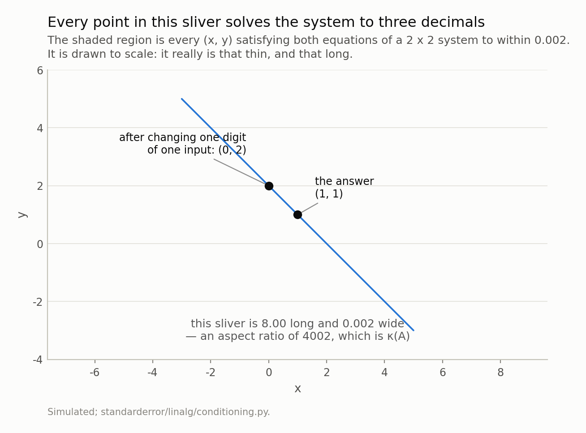
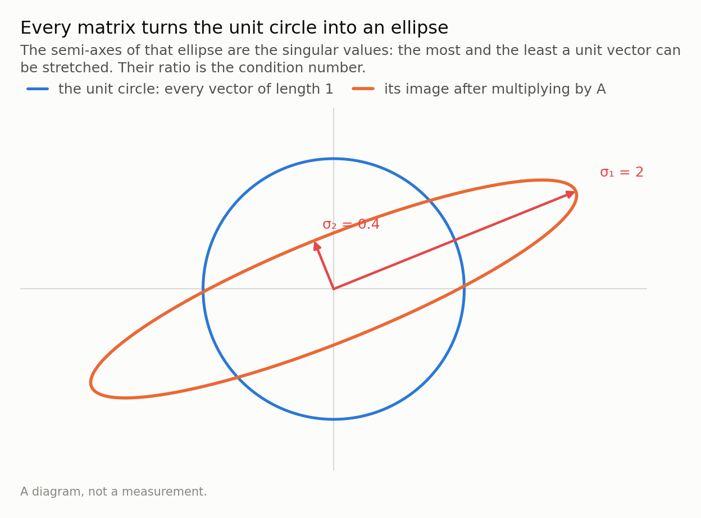
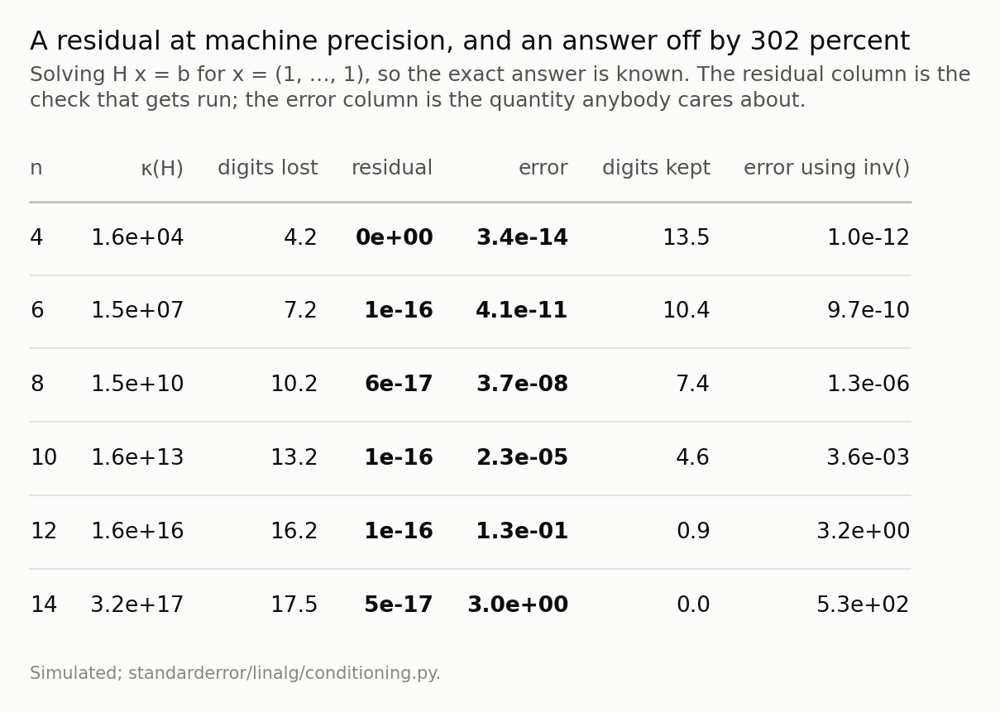
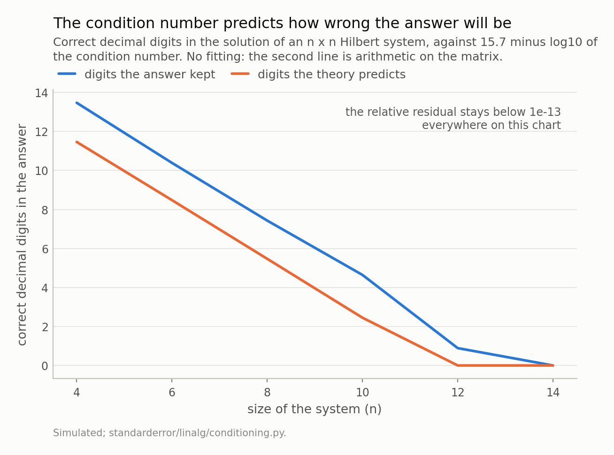
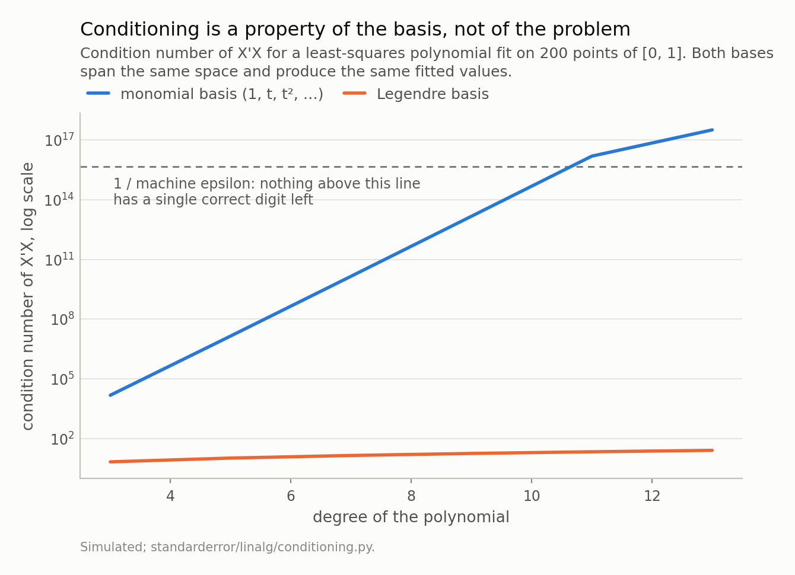
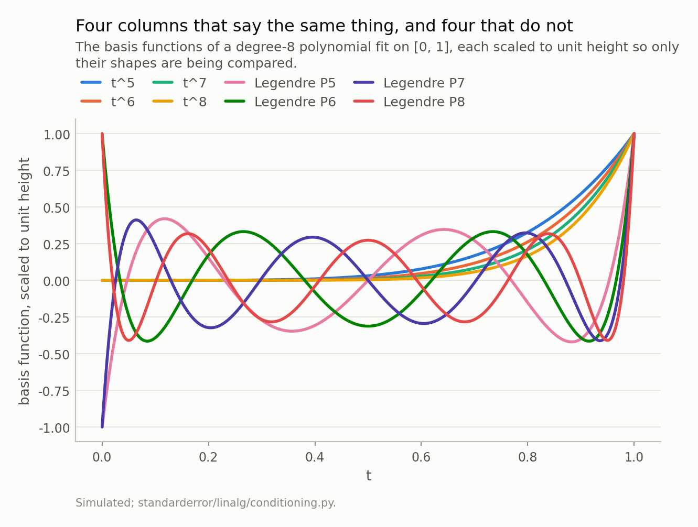

Disclosure: this post was written with the assistance of an AI system (Claude), which wrote the analysis code, ran the experiments and drafted the text. The topic, the constraints, the data choices and the final review are the author's.

*The residual is the check everybody runs after a solve, and it is the one check that cannot detect the most common way a solve goes wrong. The condition number can: it converts the precision of the inputs into an error bar on the output, before any statistics are involved. And the matrices this ruins are not exotic — the textbook example is exactly the Gram matrix of a polynomial fit, so a degree-11 regression by normal equations is a hopeless system with no correct digits, and changing basis removes fifteen orders of magnitude without changing the model.*

Episode 1 of *Linear Algebra for Data Science, Taught Through What Breaks*. The syllabus and the other episodes: https://jongha-jeon-dev.github.io/standarderror/lectures/

## A solve that works, and is wrong

Here is a linear system, its solution, and the check you would run
on it. The matrix is a Hilbert matrix — entry *(i, j)* is 1/(i + j − 1) — which
is symmetric, positive definite, and about as innocent as a matrix looks. The
right-hand side is constructed from a solution of all ones, so the correct
answer is known before we start.

```python
import numpy as np

def hilbert(n):
    "H[i,j] = 1/(i+j-1). Symmetric, positive definite, and hopeless."
    i = np.arange(1, n + 1, dtype=float)
    return 1.0 / (i[:, None] + i[None, :] - 1.0)

n = 14
H = hilbert(n)
x = np.ones(n)          # the answer we are going to ask for back
b = H @ x

x_hat = np.linalg.solve(H, b)

print("every entry of x is   1.0")
print(f"x_hat ranges from    {x_hat.min():.2f} to {x_hat.max():.2f}")
print(f"relative residual    "
      f"{np.linalg.norm(H @ x_hat - b) / np.linalg.norm(b):.1e}")
```

```text
every entry of x is   1.0
x_hat ranges from    -4.87 to 8.49
relative residual    4.8e-17
```

The residual is 4.8e-17. On any reasonable reading that
solve worked: `numpy` found an *x̂* that reproduces *b* to the last bit a double
can hold. And the entries of that *x̂*, every one of which should be exactly 1,
run from -4.87 to 8.49 — a relative error
of 302 percent.

(If you run that block yourself the residual may print as `0e+00` instead. Both
are the same statement — a residual at or below the last representable bit —
and which one you get depends on your BLAS. A number that small is not
reproducible, which is a second reason not to build an argument on it.)

Both statements are true and neither is a bug. `numpy` did nothing wrong, and
neither would LAPACK, MATLAB or R. What has happened is that the residual and
the error are different quantities, and the thing that connects them is a
property of the matrix.

## Two lines that almost agree

Before any of that matrix, here is the same failure at a size that
fits in your head.

Two equations in two unknowns are two straight lines on a page, and solving them
means finding the point where the lines cross. Usually that is a perfectly
definite place. But suppose the two lines are *almost the same line* — they cross
at an angle of 0.029 degrees, three hundredths of one degree.
Now ask where they cross. There is still exactly one answer, and you can still
compute it. But the crossing is barely pinned down: nudge either line by a hair
and the point where they meet slides a long way along their shared direction.

```python
# Two equations. The second is the first with a hair added to one
# coefficient, so the two lines they describe are almost parallel.
A = np.array([[1.0, 1.0],
              [1.0, 1.001]])
b = np.array([2.0, 2.001])
print("solution        ", np.linalg.solve(A, b))

# Now change the last digit of one number on the right. That is a
# relative change of 0.00035 -- three and a half parts in ten thousand.
b_new = np.array([2.0, 2.002])
x_new = np.linalg.solve(A, b_new)
print("after the change", x_new)

# And the *old* answer, on the *new* system: still almost a solution.
x_old = np.array([1.0, 1.0])
print("old answer's relative residual on the new system  "
      f"{np.linalg.norm(A @ x_old - b_new) / np.linalg.norm(b_new):.1e}")
print(f"kappa(A) {np.linalg.cond(A):.0f}")
```

```text
solution         [1. 1.]
after the change [0. 2.]
old answer's relative residual on the new system  3.5e-04
kappa(A) 4002
```

Read what happened. The right-hand side changed by
0.00035 — three and a half parts in ten thousand, the kind
of change you would get from rounding — and the answer went from (1, 1) to
(0, 2). It moved by 100 percent.

And then the third line, which is the one to sit with. The *old* answer, (1, 1),
evaluated on the *new* system, has a relative residual of
3.5e-04. It is wrong by 100 percent and it still satisfies the
equations to four decimal places.

That is not a paradox once you look at the picture. "Satisfies both equations to
within a hair" does not describe a point when the lines are nearly parallel — it
describes a long thin sliver running along them. The true answer is somewhere in
that sliver, the perturbed answer is somewhere else in the same sliver, and both
of them are, to four decimals, solutions. A residual asks *does my answer satisfy
the equations?* An error asks *is my answer right?* Those come apart exactly when
the sliver is long, and nothing about the first question can tell you about the
second.



*Solving a 2 x 2 system is finding where two lines cross. When they cross at a shallow angle the near-solutions form a sliver instead of a point — so the answer is barely pinned down along the sliver, and a point at the far end of it is still, to three decimals, a solution. That second fact is why the residual cannot warn you.*

## What a matrix does to a circle

So the quantity we want is *how long and thin is the sliver*. There is
a standard name for it, and getting to it geometrically is worth the two
paragraphs, because the definition on its own explains nothing.

Take the unit circle — every vector of length one — and apply your matrix to all
of it. Multiplying by a matrix stretches some directions and squashes others, and
the result is always an **ellipse**. (In *n* dimensions: the unit sphere goes to
an ellipsoid. This is a theorem, not a picture — it is what the singular value
decomposition says.) The lengths of that ellipse's semi-axes are the **singular
values** *σ*₁ ≥ *σ*₂ ≥ … ≥ *σ*ₙ: the biggest is how much the matrix can stretch a
unit vector, the smallest is how much it can shrink one.

For the 2 × 2 matrix above, those two numbers are
2.0005 and 0.0005. The matrix takes a circle and
returns something 4002 times longer than it is
wide — not an ellipse so much as a needle.

Now run it backwards, because solving is the backwards direction. If the matrix
squashes one direction by a factor of 0.0005, then *un*-squashing
it — which is what a solve does — multiplies anything in that direction by
2001. Errors included. That is why the sliver in the previous figure
has the shape it has: it is a small square of tolerance, pushed backwards through
the matrix, stretched by 1/*σ* in each direction. Its aspect ratio is therefore
*σ*ₘₐₓ/*σ*ₘᵢₙ — which is the number that figure labels, and which finally has a
name:

$$\kappa(A) = \frac{\sigma_{\max}}{\sigma_{\min}}$$

**The condition number is how eccentric the ellipse is.** One means a circle:
every direction treated alike, nothing amplified. A thousand means a thousand-fold
difference between the direction the matrix handles best and the direction it
handles worst — and a solve amplifies error in the worst direction by exactly
that ratio more than in the best one.



*Drawn with σ₁/σ₂ = 5, which is about as eccentric as fits on a page. The 2 × 2 matrix in the code above has a ratio of 4002 — its ellipse would be 800 times thinner than this one, which is why the sliver in the previous figure looked like a line.*

## The inequality, one line at a time

The geometric statement turns into an algebraic one in three steps,
and they are short enough to do here rather than cite.

Start with the true system, *A**x* = *b*, and a perturbed one where the
right-hand side is slightly off: *A*(*x* + *δx*) = *b* + *δb*. Subtract the first
from the second. The *A**x* and *b* cancel and you are left with

$$A \, \delta x = \delta b \qquad \text{so} \qquad \delta x = A^{-1}
\delta b$$

The error in the answer is the error in the input, run through the inverse. Take
norms — a norm is just a length, and any consistent choice works — and the
definition of a matrix norm gives

$$\lVert \delta x \rVert \;\le\; \lVert A^{-1} \rVert \, \lVert
\delta b \rVert$$

That is the whole mechanism: *how much can the inverse stretch things*. Second
step, and it is only there to make the statement *relative* rather than absolute,
because a relative error is what anybody actually cares about. From *b* = *A**x*,
the same inequality the other way round gives ‖*b*‖ ≤ ‖*A*‖ ‖*x*‖, or

$$\frac{1}{\lVert x \rVert} \;\le\; \frac{\lVert A
\rVert}{\lVert b \rVert}$$

Multiply the two together and the constant that falls out is not a choice
somebody made:

$$\frac{\lVert \delta x \rVert}{\lVert x \rVert} \;\le\;
\underbrace{\lVert A \rVert \, \lVert A^{-1}
\rVert}_{\kappa(A)} \; \frac{\lVert \delta b \rVert}{\lVert b
\rVert}$$

‖*A*‖ ‖*A*⁻¹‖ is what is left over when you ask how far a solution can move, and
in the two-norm it is exactly *σ*ₘₐₓ/*σ*ₘᵢₙ. The geometry and the algebra are the
same fact.

Here is the part that makes this a practical matter rather than a
theoretical one. Read the inequality with **no data error in mind at all**.

A double-precision float is a ruler with about 16
significant marks on it. Writing a number down as a double already moves it, by
roughly 2.2e-16 of its own size — that is not a defect, that is what a
float *is*. So *δb*/*b* is never smaller than about
2e-16, however good your instruments are, and the inequality says the
relative error in the answer cannot be pushed below *κ*(A) ×
2e-16.

The condition number is not a diagnostic of your data. It is an error bar the
matrix puts on your answer before your data arrives. And since a factor of ten in
error is one lost decimal digit, log₁₀ *κ* counts the digits directly: a matrix
with *κ* = 10⁸ eats eight of your 16 marks and hands
you the rest.

## The same failure, measured

All of that is checkable in six lines, and the check is one you can
run on any matrix you are about to solve with — it costs one call.

```python
kappa = np.linalg.cond(H)
eps = np.finfo(float).eps

print(f"kappa(H)             {kappa:.2e}")
print(f"digits available     {-np.log10(eps):.1f}")
print(f"digits lost to kappa {np.log10(kappa):.1f}")
print(f"error bound          {kappa * eps:.1e}")
```

```text
kappa(H)             3.22e+17
digits available     15.7
digits lost to kappa 17.5
error bound          7.1e+01
```

Note the second and third lines together. The ruler has
16 marks; this matrix consumes
17.5 of them. There is nothing left, which is why the
answer came back with entries near 8.5 instead of 1, and why
no better algorithm would have helped.

Run that across sizes and the whole story is one table. The residual column is
the check that gets run in practice; the error column is the quantity anybody
cares about; and they move in opposite directions.



*The last column is the cost of writing inv(A) @ b instead of solve(A, b): the same problem, between five and two hundred times worse.*

The last two columns of that table are the ones to keep. **Digits
kept** reaches zero by *n* = 14, and the prediction
15.7 − log₁₀ *κ* falls with it — not fitted to it,
computed from the matrix alone before the system was ever solved. Plotting the
two together is the whole claim of this episode in one picture: a measurement and
a closed form, agreeing — while the residual, noted on the same chart, sits at
machine precision across the entire range and reports that everything is fine.



*The two lines are not a fit and a model; they are a measurement and a closed form, and the closed form is the lower one because it is a worst case. What the residual does over the same range is why this failure is silent.*

## Is the bound real, or just an inequality?

Bounds in numerical analysis have a reputation for being true and
useless — worst cases over directions nobody's data points in. This one is not.
Nudge *b* by a relative 1e-10, which is the honest version of
*my inputs are good to ten decimal places*, in
200 random directions, and keep the worst.

```python
# Is the bound a prediction or a formality? Nudge b by a relative 1e-10 --
# "my inputs are good to ten decimal places" -- in 200 random directions
# and keep the worst one.
def worst_case(n, relative=1e-10, reps=200, seed=0):
    H, x = hilbert(n), np.ones(n)
    b = H @ x
    rng = np.random.default_rng(seed)
    scale = relative * np.linalg.norm(b)
    errors = []
    for _ in range(reps):
        d = rng.standard_normal(n)
        d *= scale / np.linalg.norm(d)
        x_hat = np.linalg.solve(H, b + d)
        errors.append(np.linalg.norm(x_hat - x) / np.linalg.norm(x))
    return max(errors), np.linalg.cond(H) * relative

for n in (6, 8, 10):
    worst, bound = worst_case(n)
    print(f"n={n:2d}  worst measured {worst:9.2e}   bound {bound:9.2e}"
          f"   ratio {worst / bound:.2f}")
```

```text
n= 6  worst measured  1.14e-03   bound  1.50e-03   ratio 0.76
n= 8  worst measured  1.04e+00   bound  1.53e+00   ratio 0.68
n=10  worst measured  1.02e+03   bound  1.60e+03   ratio 0.64
```

The worst of 200 random directions reaches
64 percent of the bound, so the inequality is close
to attained rather than decorative. Note also the gap between typical and worst:
at *n* = 10 the median direction gives
3.3e+02 against a worst case of 1.0e+03. One draw
looks reassuring. The bound is about the direction you did not draw.

While we are here, one habit with a measurable price. `inv(A) @ b` and
`solve(A, b)` compute the same thing in exact arithmetic, and the last column of
the table above is what the first one costs: at *n* = 10 the error is
157 times larger for no benefit. There
is essentially never a reason to form an explicit inverse. If you find yourself
writing one, what you want is a solve.

## Where you have already met this matrix

So far this is a textbook pathology, and a fair objection is that
nobody has a Hilbert matrix. Everybody does.

Fit a polynomial in the obvious basis — 1, *t*, *t*², … — on the interval
[0, 1], and look at the entry of *X*ᵗ*X* in row *i*, column *j*. It is a sum of
*t^i · t^j* over the sample, which approximates ∫₀¹ *t*^(i+j) d*t* = 1/(i + j +
1). **The Gram matrix of the monomials is the Hilbert matrix.** Not similar to
it: it is it.

```python
from numpy.polynomial import legendre

# Where does a Hilbert matrix come from? A polynomial fit. The (i,j) entry
# of X'X for the monomials on [0,1] is the integral of t^i t^j, which is
# 1/(i+j+1) -- the Hilbert matrix, exactly.
t = np.linspace(0.0, 1.0, 200)
degree = 11

X_mono = np.vander(t, degree + 1, increasing=True)
eye = np.eye(degree + 1)
X_leg = np.column_stack([legendre.legval(2 * t - 1, eye[k])
                         for k in range(degree + 1)])

print(f"kappa(X'X), monomials  {np.linalg.cond(X_mono.T @ X_mono):.2e}")
print(f"kappa(X'X), Legendre   {np.linalg.cond(X_leg.T @ X_leg):.2e}")
print(f"kappa(hilbert({degree + 1}))       "
      f"{np.linalg.cond(hilbert(degree + 1)):.2e}")

# Same span, so the same fit. Only the parameterisation differs.
y = np.sin(6 * t) + 0.3 * t**2
fit = lambda X: X @ np.linalg.lstsq(X, y, rcond=None)[0]
print(f"fitted values differ by {np.max(np.abs(fit(X_mono) - fit(X_leg))):.1e}")
```

```text
kappa(X'X), monomials  1.55e+16
kappa(X'X), Legendre   2.18e+01
kappa(hilbert(12))       1.64e+16
fitted values differ by 3.9e-14
```

A degree-11 polynomial fitted by normal equations is therefore a
system with *κ* = 1.6e+16 — no correct digits — and it will not
warn you, because its residual will be fine.

The third line is the fix, and it is worth dwelling on why it works. The
Legendre polynomials of degree ≤ 11 span **exactly the same
space** as the monomials of degree ≤ 11. Same model, same
achievable fits, same predictions — the last line confirms the fitted values
agree to 4e-14. All that changed is which basis the
coefficients are expressed in, and the condition number went from
1.6e+16 to 22. The comparison across degrees is
plotted below.



*At degree 11 the two differ by a factor of 7e+14. The fitted values agree to 4e-14, so nothing about the model changed.*

Why does that help so much? Because of what the columns of *X* are being asked
to do. Suppose you have to describe a position using two given directions. If
they are *north* and *east*, every position has one obvious, stable pair of
coefficients. If instead you are handed *north-east* and
*north-north-east* — two directions three degrees apart — you can still describe
any position in the plane, because they still span it. But now the coefficients
are enormous and nearly cancel: reaching somewhere due east means going a long
way along one and almost as far back along the other. Move the target a
millimetre and those two large numbers change a lot, even though the position
barely moved.

*t*⁷ and *t*⁸ on the interval [0, 1] are north-east and north-north-east. As
functions on that interval they are almost the same shape, so the coefficients
that use them are large, opposite and unstable. Legendre polynomials are north
and east: mutually orthogonal, each contributing something the others cannot, so
each coefficient answers a question the others do not.



*The monomials are the north-east and north-north-east of the text: on this interval t⁵ through t⁸ are nearly the same function, so the coefficients that use them must be large and nearly cancelling. The Legendre polynomials of the same degrees are mutually orthogonal — each one carries information the others cannot.*

That is the general lesson, and it is bigger than polynomials: **conditioning is
a property of the parameterisation, not of the problem.** A design matrix whose
columns are a duration in seconds, a probability and a currency amount is badly
conditioned for reasons that have nothing to do with the statistics of the data,
and centring and scaling the columns is not cosmetic tidying — it is the cheapest
available reduction in the error bar on your coefficients.

## What to take away, and what is still hiding

Four things, in the order you would use them.

**Ask for the condition number, not for singularity.** A matrix that is singular
on paper almost never has an exactly zero singular value in floating point — it
has one near 1e-16 — so "is it singular?" answers no and tells you nothing.
`np.linalg.cond` is one line and gives you log₁₀ of it as digits gone.

**Do not read a small residual as a correct answer.** They are different
quantities. A backward-stable solver guarantees the first and says nothing about
the second.

**Never form an explicit inverse.** Use `solve`. The table above prices the
alternative.

**Scale your columns, and consider the basis.** Equilibration is free.
Orthogonal bases exist for a reason.

And one thing this episode has quietly avoided. Everything above was a square
system, *A x = b*. A regression is not: it is a least-squares problem, and the
step from one to the other is where the real damage happens, because forming
*X*ᵗ*X* **squares** the condition number. The degree-11 fit above
has a design matrix *X* with *κ*(X) ≈ 1.2e+08 — bad, but
survivable — and normal equations turned it into 1.6e+16, which is
not. There are three standard ways to solve a least-squares problem and only two
of them avoid that. Next episode.

*Exercise.* Take a design matrix you actually use. Compute *κ*(X) three times:
raw, with the columns centred, and with the columns standardised. Which of the
three steps does the work — and does the answer change if one of your columns is
a dummy variable? The answer is at the top of episode 2.

---

### Data

- No external data. Every matrix here is constructed in the episode and every number is produced by the code shown, executed when this page was built.
- Machinery: `standarderror/linalg/conditioning.py`, tested in `tests/test_conditioning.py`.
- Where this stops, and who does it properly: Trefethen and Bau, *Numerical Linear Algebra*, lectures 12 and 18; Higham, *Accuracy and Stability of Numerical Algorithms*, chapters 1 and 7.

### Reproducibility

- **environment**: standarderror=0.1.0, python=3.11.15, numpy=2.4.4
- **code blocks**: executed at build time by standarderror/render/snippet.py; the printed output is captured, not typed, and the values the prose quotes are pinned so drift fails the build
- **perturbation**: 200 random directions at a relative size of 1e-10, worst case reported
- **determinism**: no seeds matter except the perturbation directions; every other number is a property of a fixed matrix

Code: <https://github.com/jongha-jeon-dev/standarderror>
