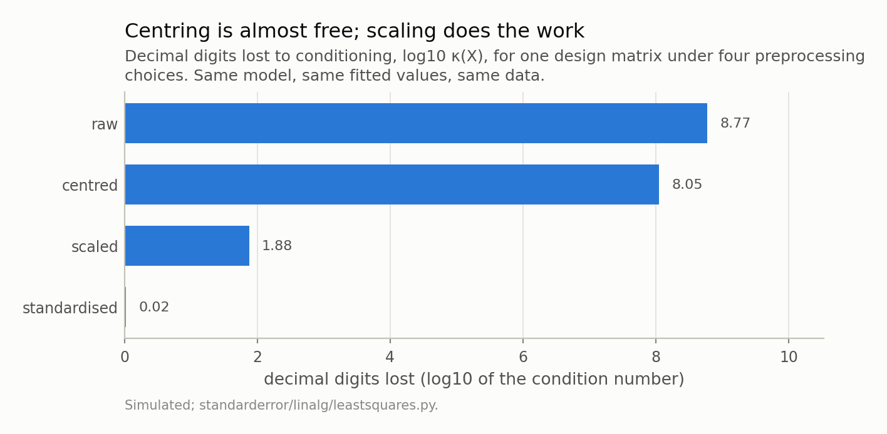
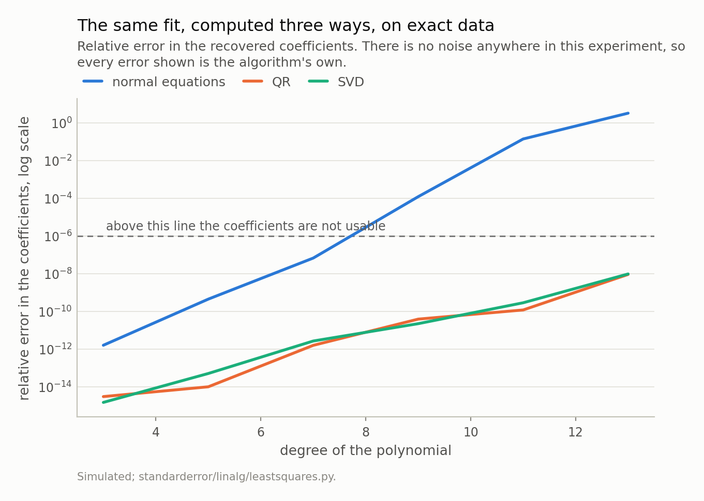
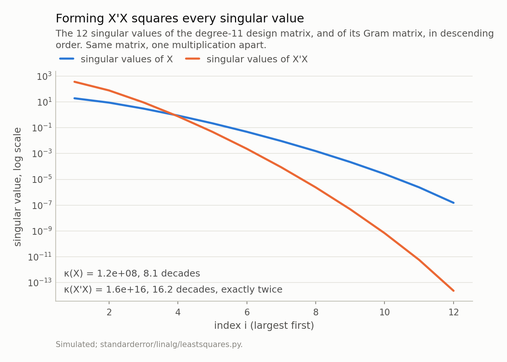
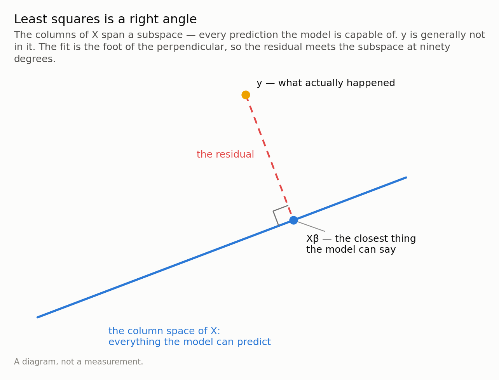
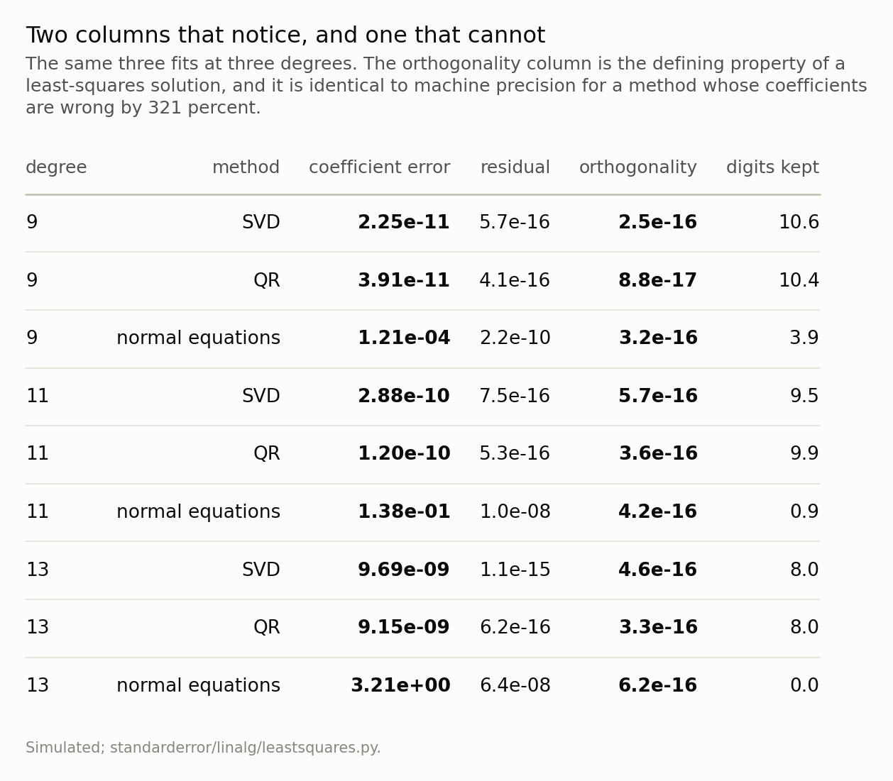

Disclosure: this post was written with the assistance of an AI system (Claude), which wrote the analysis code, ran the experiments and drafted the text. The topic, the constraints, the data choices and the final review are the author's.

*Forming X'X squares the condition number, so the formula everybody learns spends twice the digits of the two factorisations nobody is taught. Underneath, least squares is a right angle — the fit is the foot of a perpendicular onto the column space — and reading it that way explains why QR needs no inversion at all, and why the one check that defines a least-squares solution is blind to a normal-equations fit that is wrong by 321 percent. Opens with the answer to last episode's exercise, which is not the one most people guess.*

Episode 2 of *Linear Algebra for Data Science, Taught Through What Breaks*. The syllabus and the other episodes: https://jongha-jeon-dev.github.io/standarderror/lectures/

## Last episode's exercise

The exercise was: take a design matrix you actually use, compute
*κ*(X) raw, with the columns centred, and with them standardised, and work out
which step does the work.

Here is a design that looks like a real one — an intercept, a duration in
seconds, a probability, an amount of money, and a dummy.

```python
import numpy as np

rng = np.random.default_rng(7)
n = 500
X = np.column_stack([
    np.ones(n),                                # intercept
    rng.normal(3600, 600, n),                  # a duration, in seconds
    rng.normal(0.30, 0.10, n),                 # a probability
    rng.normal(5e7, 1e7, n),                   # an amount of money
    (rng.random(n) < 0.20).astype(float),       # a dummy
])

cols = slice(1, None)          # leave the intercept alone
mean = X[:, cols].mean(0)
sd = X[:, cols].std(0, ddof=1)

variants = {"raw": X}
variants["centred"] = X.copy(); variants["centred"][:, cols] -= mean
variants["scaled"] = X.copy(); variants["scaled"][:, cols] /= sd
variants["standardised"] = X.copy()
variants["standardised"][:, cols] = (X[:, cols] - mean) / sd

for name, Z in variants.items():
    print(f"{name:14s} kappa {np.linalg.cond(Z):11.3e}")
```

```text
raw            kappa   5.897e+08
centred        kappa   1.120e+08
scaled         kappa   7.500e+01
standardised   kappa   1.058e+00
```

Most people guess centring. Centring, on its own, takes *κ* from
5.90e+08 to 1.12e+08 — it removes about
0.7 of a decimal digit, out of
9 lost. Essentially nothing.

**Scaling is what does the work**: dividing each column by its standard
deviation takes *κ* to 75. That is the whole pathology, and it
was never statistical — the money column had entries around
5 × 10⁷ and the probability column around 0.3, and a
condition number is a *ratio* of stretches, so eight orders of magnitude
between two columns' units is eight orders of magnitude of *κ* before any data
enters.

But then look at the last line. Centring *after* scaling takes
75 down to 1.06 — essentially perfect. So
centring is worth almost nothing alone and worth a factor of
71 once the columns are scaled. The two
steps are not independent, and the reason is visible in the numbers: after
scaling, the duration column still has a mean six times its own standard
deviation, so it is *still* nearly a multiple of the intercept column. Centring
is what breaks that. Before scaling, that near-collinearity with the intercept
was there too, but it was not the binding constraint — the units were.

And the dummy? Nothing. At a 20 percent rate its standardised design gives
1.06; drop it to 1 percent and you get
1.08. A rare dummy is a real problem, but it is not a
conditioning problem — it is a leverage problem, and it arrives in episode
six.



*The answer to episode one's exercise, read as digits. Centring removes 0.72 of a digit; scaling removes 6.17. The order they are usually taught in is the reverse of the order of their effect.*

## The formula everyone learns

Now the episode proper. Every regression course arrives at the same
place. You want the *β* minimising ‖*y* − *X**β*‖², you differentiate, you set
the derivative to zero, and out comes

$$X^{\top} X \beta = X^{\top} y \qquad \text{so} \qquad \hat\beta =
(X^{\top} X)^{-1} X^{\top} y$$

This is not wrong. It is the unique correct answer, it is what every textbook
prints, and it is what the standard-error formulas are written in terms of.

It is also a bad way to compute the number. Not subtly — by nine orders of
magnitude on a problem a working analyst might set up. And the reason is one
step of episode one applied to one line of algebra: `X'X` has a condition number
that is the *square* of X's.

```python
# A polynomial design matrix, and coefficients we choose ourselves so the
# right answer is known. y is formed exactly: no noise anywhere, so every
# error below belongs to the algorithm.
t = np.linspace(0.0, 1.0, 200)
degree = 11
X = np.vander(t, degree + 1, increasing=True)
beta = np.random.default_rng(0).standard_normal(degree + 1)
y = X @ beta

# 1. the textbook formula, computed literally
normal = np.linalg.solve(X.T @ X, X.T @ y)

# 2. QR: X = QR with Q'Q = I, then solve R beta = Q'y
Q, R = np.linalg.qr(X)
qr = np.linalg.solve(R, Q.T @ y)

# 3. SVD: X = U S V', invert the singular values
U, sv, Vt = np.linalg.svd(X, full_matrices=False)
svd = Vt.T @ ((U.T @ y) / sv)

for name, b in (("normal", normal), ("QR", qr), ("SVD", svd)):
    err = np.linalg.norm(b - beta) / np.linalg.norm(beta)
    print(f"{name:7s} relative error in the coefficients {err:.2e}")
```

```text
normal  relative error in the coefficients 1.38e-01
QR      relative error in the coefficients 1.20e-10
SVD     relative error in the coefficients 2.88e-10
```

Same design matrix, same data, no noise anywhere — so all three of those numbers
are the algorithm's own error and nothing else. The textbook formula is wrong by
14 percent. The two factorisations
almost nobody is taught are right to ten decimal places.



*At degree 11 the normal equations are wrong by 14 percent and the other two by about 1e-10. The gap is not cleverness; it is one squaring.*

## Why: one squaring

Recall from episode one that the singular values of a matrix are the
semi-axis lengths of the ellipse it turns the unit sphere into, and
*κ* = *σ*ₘₐₓ/*σ*ₘᵢₙ. Now write the Gram matrix in terms of the SVD. If
*X* = *U**Σ**V*ᵗ with *U* and *V* orthogonal, then

$$X^{\top} X = V \Sigma^{\top} U^{\top} U \Sigma V^{\top} = V
\Sigma^{2} V^{\top}$$

because *U*ᵗ*U* = *I*. The middle matrix is *Σ*², so **the singular values of
*X*ᵗ*X* are the squares of the singular values of *X***, and therefore

$$\kappa(X^{\top} X) = \frac{\sigma_{\max}^{2}}{\sigma_{\min}^{2}}
= \kappa(X)^{2}$$

Two lines, no approximation. And by episode one's accounting, a squared condition
number is a *doubled* number of lost digits.

```python
print(f"kappa(X)     {np.linalg.cond(X):.2e}")
print(f"kappa(X'X)   {np.linalg.cond(X.T @ X):.2e}")
print(f"the square   {np.linalg.cond(X)**2:.2e}")

# Why: the singular values of X'X are the squares of X's.
sv_gram = np.linalg.svd(X.T @ X, compute_uv=False)
print(f"largest  sv(X)^2 {sv[0]**2:.3e}   sv(X'X) {sv_gram[0]:.3e}")
print(f"smallest sv(X)^2 {sv[-1]**2:.3e}   sv(X'X) {sv_gram[-1]:.3e}")
```

```text
kappa(X)     1.25e+08
kappa(X'X)   1.55e+16
the square   1.56e+16
largest  sv(X)^2 3.617e+02   sv(X'X) 3.617e+02
smallest sv(X)^2 2.321e-14   sv(X'X) 2.332e-14
```

So the arithmetic of the whole episode is: this design matrix costs
8.1 digits, which leaves about
7.6 of the 15.7 a double carries —
uncomfortable, workable, and roughly what QR delivered. Its Gram matrix costs
16.2, which leaves
0. Nothing. The normal equations did not make a
mistake; they were handed a problem with no answer left in it, and they were
handed it by the act of writing *X*ᵗ*X*.

It is worth being fair to the formula, because it is not there by accident.
*X*ᵗ*X* is *p* × *p* while *X* is *n* × *p*, and for the *n* ≫ *p* case that
regression usually lives in, the normal equations cost about half what a
Householder QR does — roughly *np*² against 2*np*². That is a real saving, it is
why the route survives in production code, and it is almost never worth taking:
you are buying a factor of two in time with half of your significant digits, and
if *κ*(X) is small enough for that to be safe then the fit was never the
expensive part of your pipeline anyway.

The identity is worth looking at rather than only believing, because
*κ* = *σ*ₘₐₓ/*σ*ₘᵢₙ hides that the squaring happens to *every* singular value,
not just to the two at the ends. Plotted on a log axis, squaring is a doubling of
slope, and the two spectra below are the same shape drawn at two scales. One
detail in that figure is not decoration: the computed Gram spectrum matches the
exact squares only to
0.5 percent. The identity is exact in
arithmetic; the discrepancy is the floating-point damage, already visible in the
matrix before any solver has touched it.



*On a log axis, squaring doubles the slope: the Gram spectrum falls twice as far, because σ_i(X'X) = σ_i(X)². That is the whole of κ(X'X) = κ(X)², and it is why one multiplication costs half the digits — nothing the solver does afterwards can undo it. The crossing near 1 is the same fact from the other side: squaring pushes values above 1 up and values below 1 down, and a condition number is exactly how far apart those two ends are.*

## The picture: least squares is a right angle

Why does QR escape? Not by being clever. By not needing the step that
costs.

Here is what a least-squares problem is, geometrically. The columns of *X* are
vectors in *n*-dimensional space, and the set of all their combinations — the
**column space** — is every prediction the model is capable of producing. It is a
*p*-dimensional subspace sitting inside *n* dimensions, so for any realistic
regression it is a very thin slice of the space. The observed *y* is a point in
that space, and it is essentially never *in* the subspace: no combination of your
columns reproduces the data exactly, which is why you are doing least squares
rather than solving.

So the question becomes: which point of the subspace is closest to *y*? And the
answer is the one every geometry course gives — drop a perpendicular. The fit
*X**β̂* is the foot of the perpendicular from *y* onto the column space, and the
residual *y* − *X**β̂* is at right angles to the whole subspace, which means it is
orthogonal to every column:

$$X^{\top} (y - X \hat\beta) = 0$$

Look at what that is. Multiply it out and you get *X*ᵗ*X**β̂* = *X*ᵗ*y*. **The
normal equations are not a formula that fell out of calculus; they are the
statement that the residual meets the column space at ninety degrees.** The name
is not decoration — "normal" means perpendicular.



*The right angle is the whole definition: X'(y − Xβ̂) = 0 says the residual is orthogonal to every column. Those are the normal equations, and reading them as geometry explains both why QR needs no inversion and why the orthogonality check cannot audit them.*

Now the point of the picture. Projecting onto a subspace is easy when
you have an *orthonormal* basis for it: the coefficients are just inner products,
because each basis direction answers a question none of the others touch. It is
hard when your basis is a set of columns pointing in nearly the same direction —
that was the north-east and north-north-east problem at the end of episode one —
and *X*ᵗ*X* is precisely the matrix whose job is to undo that non-orthogonality.
Undoing it is where the digits go.

QR does the opposite thing. *X* = *Q**R* factors the design into an orthonormal
basis *Q* for exactly the same column space, plus a triangular *R* recording how
to get from *Q* back to *X*. Projecting onto *Q* needs no inversion at all —
*Q*ᵗ*y* is the answer — and the remaining solve is triangular, which is
back-substitution. The subspace never changed. The basis did, and the basis was
the problem.

## And the check that defines the answer cannot find the error

There is an obvious diagnostic sitting in the last section. The
defining property of a least-squares fit is that the residual is orthogonal to
the columns. So compute *X*ᵗ(*y* − *X**β̂*) and see how close to zero it is.

```python
# The defining property of a least-squares fit: the residual is
# orthogonal to every column. Check it on all three.
for name, b in (("normal", normal), ("QR", qr), ("SVD", svd)):
    r = y - X @ b
    orth = np.linalg.norm(X.T @ r) / (np.linalg.norm(X, 2) * np.linalg.norm(y))
    res = np.linalg.norm(r) / np.linalg.norm(y)
    print(f"{name:7s} residual {res:.1e}   orthogonality {orth:.1e}")
```

```text
normal  residual 1.0e-08   orthogonality 4.2e-16
QR      residual 5.3e-16   orthogonality 3.6e-16
SVD     residual 5.4e-16   orthogonality 2.1e-16
```

At degree 13 the normal-equations coefficients are wrong by
321 percent, and their residual is
orthogonal to the columns to
6e-16 — the same as the SVD's. The
check does not move.

Once stated it is obvious, and it is worth stating. *X*ᵗ*X**β̂* = *X*ᵗ*y* **is**
the orthogonality condition. A method that solves those equations is enforcing,
to solver precision, exactly the property you were going to use to audit it. A
diagnostic derived from the equations a method solves cannot detect that the
method lost accuracy solving them.

This is episode one's lesson wearing different clothes. There the residual was
useless because a backward-stable solver guarantees it; here the orthogonality is
useless because the normal equations *are* it. The residual norm does carry some
signal — 6e-08 against
6e-16 for QR — but it moves eight orders while
the coefficients lose fourteen, and
6e-08 reads as a converged fit to anybody
who was not looking for this.

The check that does work costs one line and needs no fit at all: compute
*κ*(X) before you solve. That is the number the table is really about.



*Read the last two columns together. Orthogonality does not move at all; the residual moves by eight orders while the coefficients lose fourteen, and 6e-08 still reads as a converged fit.*

## When two columns are the same

One more case, because it separates QR from the SVD and sets up
episode five. Suppose a column of *X* is exactly a copy of another one — you
added a feature twice, or a categorical encoding produced a redundant level. Then
the column space is smaller than the number of columns:
4 columns spanning 3 dimensions, *κ* =
1.1e+16.

Now there is no unique *β̂*. Infinitely many coefficient vectors give the *same*
prediction, because whatever you add to one copy you can subtract from the other.
The projection — the fitted values — is still perfectly well defined; it is only
the coordinates that are not.

The normal equations fail outright here: *X*ᵗ*X* is singular. QR gives you
something, and what it gives depends on the pivoting. The SVD is the only one of
the three with a principled answer: truncate the singular values that are
numerically zero, and what comes back is the **minimum-norm** solution — of all
the coefficient vectors that fit equally well, the smallest one. On the duplicate
above it splits the coefficient evenly between the two copies,
0.500 and 0.500, rather
than picking one and giving it everything.

That truncation threshold is `rcond`, and it is a modelling decision disguised as
a numerical tolerance: it says *how nearly collinear is too collinear*. Episode
five is about what happens when you answer that question with regularisation
instead.

## What to take away

**Never compute `(X'X)^-1 X'y`, or `solve(X.T @ X, X.T @ y)`
either.** Call a least-squares routine — `numpy.linalg.lstsq`, `scipy`'s
`lstsq`, R's `lm`, any of which use QR or the SVD underneath. The textbook
formula is for deriving things with, not for evaluating.

**Know which one your library used.** QR is the default nearly everywhere and is
the right default. The SVD costs more and buys you the rank-deficient case.
Anything advertising a Cholesky solve of the Gram matrix is fast and is paying
*κ*².

**Scale your columns before you do any of it.** Last episode's exercise, and the
cheapest factor of 10⁸ you will ever get.

**Remember that your standard errors were computed from the Gram matrix too.**
The usual covariance of the estimates is *σ*²(*X*ᵗ*X*)⁻¹, so a reported standard
error inherits the squared conditioning whether or not the coefficients did. A
library that fits by QR and then reports uncertainty from an explicitly inverted
Gram matrix has done the careful thing once and the careless thing immediately
afterwards — and the second number is the one that ends up in the table.

**And distrust a diagnostic that is downstream of the method.** Orthogonality
cannot audit the normal equations, and the residual barely can. *κ*(X) is
computed from the design alone, before any fit exists, which is exactly what
makes it useful.

*Exercise.* Take a dataset with missing values and compute its covariance matrix
two ways: dropping every row with any missing entry, and computing each pairwise
covariance from whatever rows have both variables. Then find the smallest
eigenvalue of each. One of them can be negative — which would mean some portfolio
of your variables has negative variance. Which one, and why? Episode three.

---

### Data

- No external data. Every design matrix is constructed in the episode and every number is produced by the code shown, executed when this page was built.
- Machinery: `standarderror/linalg/leastsquares.py`, tested in `tests/test_leastsquares.py`.
- Where this stops: Trefethen and Bau, *Numerical Linear Algebra*, lectures 11, 18 and 19; Golub and Van Loan, *Matrix Computations*, chapter 5.

### Reproducibility

- **environment**: standarderror=0.1.0, python=3.11.15, numpy=2.4.4
- **code blocks**: executed at build time; the values the prose quotes are pinned, so drift fails the build
- **noise**: none. y is formed as X @ beta exactly, so every error reported is numerical rather than statistical

Code: <https://github.com/jongha-jeon-dev/standarderror>
