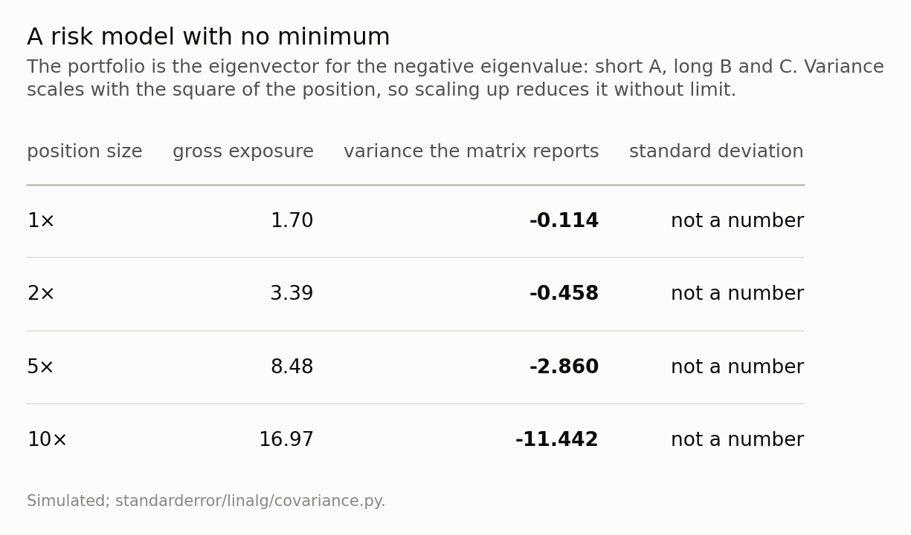
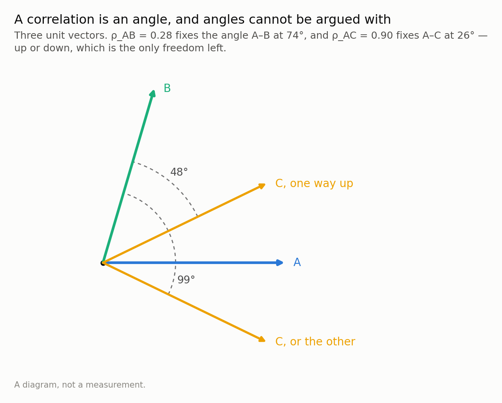
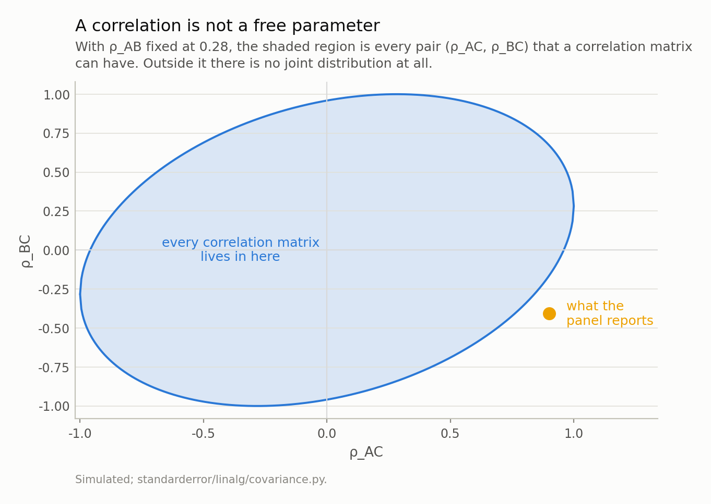
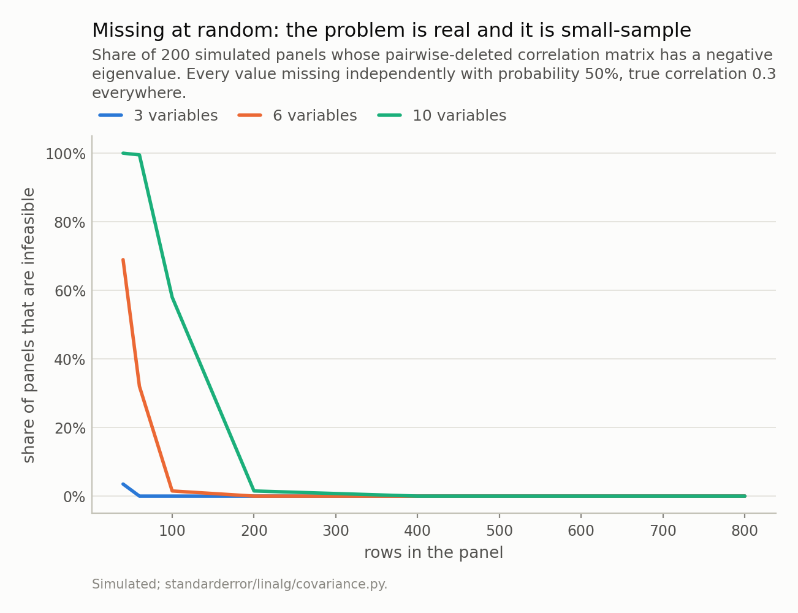
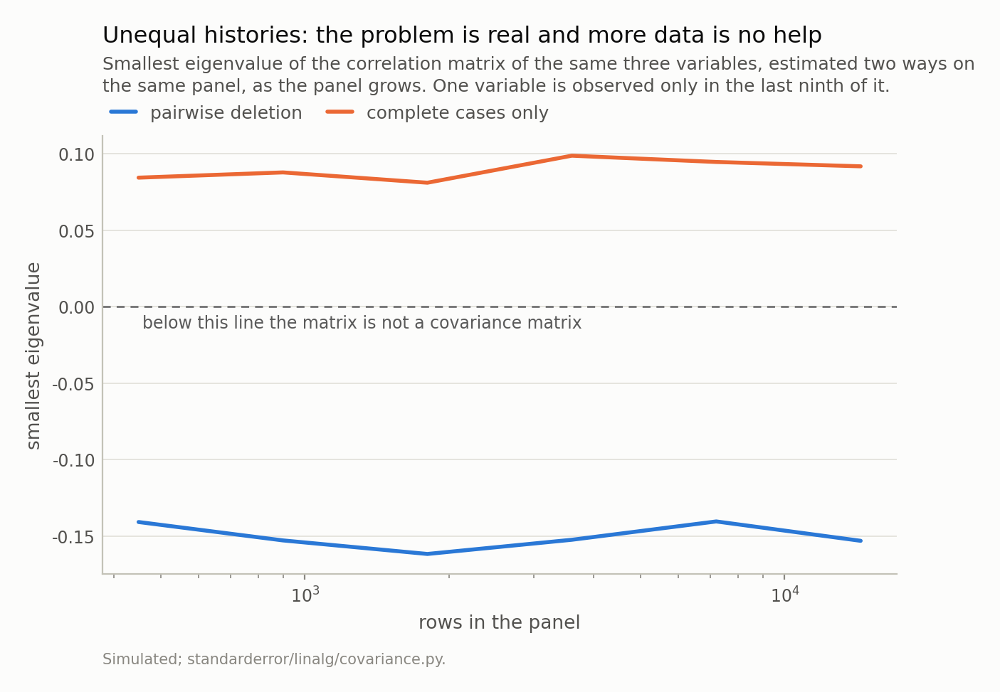
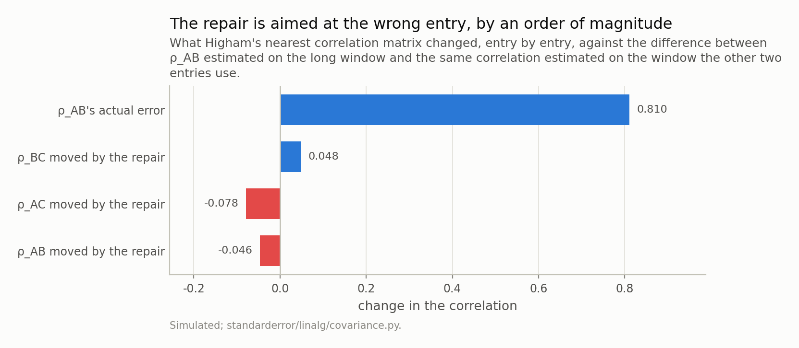

Disclosure: this post was written with the assistance of an AI system (Claude), which wrote the analysis code, ran the experiments and drafted the text. The topic, the constraints, the data choices and the final review are the author's.

*Positive semi-definiteness is usually presented as a technical condition on a matrix. It is not: w'Sw is the variance of the portfolio w'x, so a negative eigenvalue is a combination of your variables whose variance the matrix reports as negative, and the eigenvector names it. This episode builds such a matrix out of ordinary estimates, derives the constraint that was violated — which turns out to be the triangle inequality on angles — separates the sampling-noise version of the failure from the version that more data makes worse, and measures what the standard repair actually changes. It changes the wrong entry, by a factor of ten too little, and afterwards the matrix passes every check.*

Episode 3 of *Linear Algebra for Data Science, Taught Through What Breaks*. The syllabus and the other episodes: https://jongha-jeon-dev.github.io/standarderror/lectures/

## Last episode's exercise

The exercise was: take a dataset with missing values, compute its
correlation matrix twice — once dropping every row with any missing entry, once
computing each pair from whatever rows have both variables — and find the
smallest eigenvalue of each. One of them can come out negative. Which, and why?

**Pairwise deletion can; complete cases cannot**, and the reason is one line of
last episode's algebra. On the rows where everything is observed you have a
single matrix *Z* — centred, scaled — and the correlation matrix is
*Z*ᵗ*Z*/(*n*−1). That is a Gram matrix, the same object whose condition number
we spent last episode complaining about, and for any weights *w*

$$w^{\top} Z^{\top} Z w = \lVert Z w \rVert^{2} \;\ge\; 0$$

A squared length. There is no arrangement of data that makes it negative, so a
complete-case correlation matrix is feasible by construction rather than by
luck. A pairwise matrix is not *Z*ᵗ*Z* for any *Z* at all — each entry comes
from a different set of rows — and nothing in its construction forces the
entries to be consistent with one another.

That is the answer, and it leaves the two questions that make it an episode. How
often does it actually happen? And when it does, what should you do — because
there is a standard repair, and it is worth finding out what it repairs.

## Three numbers that cannot all be true

First the failure at a size that fits in your head, with no missing
data and no estimation at all. Three variables. A and B move together,
ρ = 0.9. A and C move together too, ρ = 0.9. And B and C move
*opposite* each other, ρ = -0.9.

Every one of those is an ordinary number. Two of them are things people say
about data all the time. Put them in a matrix.

```python
import numpy as np

# Three correlations, each one perfectly ordinary on its own.
R = np.array([[ 1.0, 0.9, 0.9],
              [0.9,  1.0, -0.9],
              [0.9, -0.9,  1.0]])

w = np.linalg.eigh(R)[1][:, 0]          # the smallest eigenvalue's vector
print(f"eigenvalues      {np.linalg.eigvalsh(R).round(3)}")
print(f"weights          {w.round(3)}")
print(f"variance of w'x  {w @ R @ w:.3f}")
try:
    np.linalg.cholesky(R)
except np.linalg.LinAlgError as e:
    print(f"cholesky         {e}")
```

```text
eigenvalues      [-0.8  1.9  1.9]
weights          [-0.577  0.577  0.577]
variance of w'x  -0.800
cholesky         Matrix is not positive definite
```

An eigenvalue of -0.8. The weights are
-0.577, 0.577,
0.577 — short A, long B and C in equal size —
and the matrix says that combination has a variance of
-0.8.

Not a small variance. Not an unstable estimate of a variance. A negative one,
which is not a number any variance can be, because a variance is an average of
squares. So the three correlations are not three slightly-inconsistent
measurements of something. They are a description of a joint distribution that
does not exist.

## What positive semi-definiteness actually says

That is worth slowing down on, because "positive semi-definite"
usually arrives as a condition a matrix has to satisfy, with no account of why
anybody would care.

Take any weights *w* and form the combination *w*ᵗ*x* — a portfolio, an index, a
factor score, a difference between two of your variables. Its variance is

$$\operatorname{Var}(w^{\top} x) = \sum_i \sum_j w_i w_j
\operatorname{Cov}(x_i, x_j) = w^{\top} S w$$

That is not a definition being introduced; it is the same expansion you would do
by hand for two variables, written for *n*. And since the left-hand side is a
variance, the right-hand side cannot be negative — **for every *w* at once**.
That requirement, quantified over all *w*, *is* positive semi-definiteness. It is
not a property the matrix ought to have for the linear algebra to be tidy. It is
the statement that the matrix describes something real.

The eigenvalues are how you check it without trying every *w*. If *S**v* = *λ**v*
with ‖*v*‖ = 1, then

$$v^{\top} S v = v^{\top} (\lambda v) = \lambda$$

so each eigenvalue is literally the variance of one particular portfolio — the
one its eigenvector describes. The smallest eigenvalue is the smallest variance
any portfolio can have, and if it is negative, its eigenvector hands you the
combination that proves the matrix is fiction. That is why the code above prints
the eigenvector and not just the eigenvalue: the eigenvector tells you *which
variables are in conflict*, which is the only part of the diagnosis you can act
on.

And the practical consequence is worse than a wrong number, because
*w*ᵗ*S**w* is quadratic in *w*. Double the position and the variance
quadruples — including when it is negative.



*This is why an infeasible covariance matrix is not a rounding problem. A mean-variance optimiser handed this matrix does not return a bad answer; it returns whatever the position limits are, because it has found a direction where risk is free and unbounded.*

One aside on how to test for this, since the code above did it two
ways. `np.linalg.cholesky` raises if and only if the matrix is not positive
*definite*, it costs about a third of what an eigendecomposition does, and it is
what a well-written library calls before it trusts a covariance matrix. But note
the word: *definite*, not *semi-definite*. A genuinely rank-deficient covariance
matrix — two variables that are the same variable, or more variables than
observations — is a perfectly real covariance matrix with a zero eigenvalue, and
Cholesky refuses it. So a Cholesky failure is a reason to look, and the
eigenvalues are what you look at. The distinction matters in the same way
episode one's did: *how negative* is a question with an answer, and *is it
singular* is not.

## A correlation is an angle

So which of the three numbers was wrong? None of them, individually
— and that is the point. What was wrong was the combination, and there is an
exact statement of what combinations are allowed.

Start from the geometry, because it makes the answer obvious before any algebra.
Centre and scale each variable, so each is a vector of length one in *n*
dimensions. Then the correlation between two of them is their inner product,
which is the cosine of the angle between them:

$$\rho_{xy} = \frac{\langle x, y \rangle}{\lVert x \rVert \lVert y
\rVert} = \cos \theta$$

Correlation 1 is a zero-degree angle, correlation 0 is a right angle,
correlation −1 is a hundred and eighty degrees. And now the constraint writes
itself: if A is 74° from B, and A is 26°
from C, then C cannot be anywhere it likes relative to B. It can be as close to
B as the difference of those two angles, 48°, or as far as their
sum, 99°, and nothing in between is ruled out — those are the
endpoints of an interval, not two options. This is the triangle inequality,
on angles rather than on distances.



*The two arcs are the whole feasible set. C is as close to B as it can get at 48° (ρ_BC = 0.67) and as far as it can get at 99° (ρ_BC = -0.16), and there is no third option. The panel below reports ρ_BC = -0.41, which needs 114° — 15° more than the plane has room for, and no number of extra dimensions creates it.*

The algebra says the same thing and is worth having, because it
generalises past three variables where the picture stops. A symmetric matrix is
positive semi-definite only if every determinant you can form by deleting the
same rows and columns comes out non-negative. That direction is the one we need
here — it is necessary, and the sufficient version wants all of those minors
rather than only the leading ones. Take the whole determinant of the 3 × 3
correlation matrix, which multiplies out to

$$\det R = 1 + 2 \rho_{ab} \rho_{ac} \rho_{bc} - \rho_{ab}^{2} -
\rho_{ac}^{2} - \rho_{bc}^{2} \;\ge\; 0$$

and read it as a quadratic in the one correlation we want to solve for:

$$-\rho_{bc}^{2} + 2 \rho_{ab} \rho_{ac} \, \rho_{bc} + \left(1 -
\rho_{ab}^{2} - \rho_{ac}^{2}\right) \;\ge\; 0$$

A downward parabola, so the feasible set is the closed interval between its two
roots, and the quadratic formula gives them directly:

$$\rho_{bc} \in \left[\; \rho_{ab} \rho_{ac} - \sqrt{(1 -
\rho_{ab}^{2})(1 - \rho_{ac}^{2})}, \;\; \rho_{ab} \rho_{ac}
+ \sqrt{(1 - \rho_{ab}^{2})(1 - \rho_{ac}^{2})} \;\right]$$

Now substitute *ρ*_ab_ = cos *α* and *ρ*_ac_ = cos *β*. The square root becomes
sin *α* sin *β*, and the two endpoints are cos *α* cos *β* ∓ sin *α* sin *β* —
which are cos(*α* + *β*) and cos(*α* − *β*). The determinant condition and the
triangle inequality are not two facts that happen to agree. They are the same
fact, written once in coordinates and once in angles.

For the toy matrix: ρ_AB = ρ_AC = 0.9 puts the feasible interval for
the third correlation at [0.62, 1.00]. Not
[−1, 1] — the third correlation is forced to be *strongly positive*, and
-0.9 is not merely outside the interval, it is at the opposite end of
the scale. Two strong positive correlations do not leave room for a negative
one.

It is worth looking at the whole feasible region rather than one
interval, because the shape of it is the useful intuition: a correlation is not
a parameter you get to choose, it is a parameter the other correlations have
already spent.



*The region pinches to nothing at ρ_AC = ±1, which is the sensible limit: if A and C are the same variable then ρ_BC is already determined. The marked point is the panel's estimate, and it is not in the region — no data set on any three variables could have produced those three numbers together.*

## So how does anyone build a matrix like that?

Nobody types in three contradictory correlations on purpose. They
arrive one entry at a time, each from a defensible calculation, and the standard
way that happens is missing data.

Here is a panel of three variables where C simply does not exist for most of the
history — it listed late, the field was added to the form late, the question was
added to the survey late. Each correlation is computed from the rows that have
both variables in it, which is the obvious thing to do and is what
`pandas.DataFrame.corr` does by default.

```python
# A panel of three variables. C does not exist for the first eight
# ninths of it -- it listed late, or the field was added to the form
# late -- and the correlation structure of the last stretch is not the
# structure of the earlier one. Nothing here is missing at random.
def draw(n, R, rng):
    return rng.standard_normal((n, 3)) @ np.linalg.cholesky(R).T

early = np.array([[1.0, 0.35, 0.0],
                  [0.35, 1.0, 0.0],
                  [0.0, 0.0, 1.0]])
late = np.array([[1.0, -0.60, 0.90],
                 [-0.60, 1.0, -0.50],
                 [0.90, -0.50, 1.0]])

rng = np.random.default_rng(11)
X1 = draw(2000, early, rng); X1[:, 2] = np.nan
X2 = draw(250, late, rng)
X = np.vstack([X1, X2])

C = np.eye(3)
for i in range(3):                       # each entry from whatever rows
    for j in range(i + 1, 3):            # have both variables
        ok = ~np.isnan(X[:, i]) & ~np.isnan(X[:, j])
        C[i, j] = C[j, i] = np.corrcoef(X[ok, i], X[ok, j])[0, 1]
        print(f"rho_{'ABC'[i]}{'ABC'[j]} = {C[i, j]:+.3f} "
              f"from {ok.sum():5d} rows")
print(f"smallest eigenvalue, pairwise       {np.linalg.eigvalsh(C)[0]:+.4f}")

rows = ~np.isnan(X).any(axis=1)          # the same data, one subsample
D = np.corrcoef(X[rows].T)
print(f"smallest eigenvalue, complete cases {np.linalg.eigvalsh(D)[0]:+.4f}"
      f"   ({rows.sum()} rows)")
print(f"rho_AB: pairwise {C[0, 1]:+.3f}, complete-case {D[0, 1]:+.3f}")
```

```text
rho_AB = +0.283 from  2250 rows
rho_AC = +0.900 from   250 rows
rho_BC = -0.408 from   250 rows
smallest eigenvalue, pairwise       -0.1144
smallest eigenvalue, complete cases +0.0896   (250 rows)
rho_AB: pairwise +0.283, complete-case -0.528
```

Read the row counts, because they are the diagnosis. ρ_AB was estimated on
2,250 rows and the other two on 250. The
pairwise matrix has a smallest eigenvalue of
-0.1144; the complete-case matrix, on the same
panel, has +0.0896 and is perfectly well behaved.

And the entry that broke it is the one with the most data. ρ_AB is
+0.283 on the long window and -0.528 on the 250
rows the other two entries use — the correlation between A and B is not the same
in the two regimes, so the long-window estimate is a fine estimate of something,
and it is not the same something the other two entries are estimates of. Feed it
to the geometry of the previous section: with ρ_AB = 0.28 and
ρ_AC = 0.90, the angle between B and C has to be between
48° and 99°. The reported ρ_BC = -0.41
needs 114°. It is 15 degrees short of
possible, and using nine times as much data for one entry is exactly what put it
there.

Now the part I expected to go the other way. The folk version of
this is "pairwise deletion gives you non-positive-definite matrices", stated
about missing data in general. So: how often, if the missingness is the benign
kind — every value dropped independently, no relationship to anything?

Hardly ever, at any sample size you would work with. At three
variables and half the values thrown away it happens in
4% of panels of
40 rows and never again. Ten variables is much worse at
40 rows — 100%, because
there are forty-five pairwise constraints to satisfy simultaneously instead of
three — and it is gone by 400 rows all the same. Width drives it, and
sample size cures it, which together say the thing worth knowing: under
missing-at-random the pairwise estimator is *consistent*, so infeasibility is
sampling noise, and noise is what more data removes.



*More variables means more constraints to satisfy at once, so width is what drives this rather than the missing rate. But every curve reaches zero: under missing-at-random the pairwise estimator is consistent, and the infeasibility is sampling noise that more rows remove.*

The unequal-histories version does not behave like that at all.



*Thirty-two times the data, and the pairwise line has not moved. It is not noise: the entries are estimates of different populations, so growing the sample sharpens the contradiction instead of resolving it. The complete-case line cannot go below zero at any sample size, for a reason that is one line of algebra.*

From 450 rows to 14,400 — a
factor of 32 — the smallest
eigenvalue goes from -0.141 to
-0.153. It does not improve, because there is nothing
for it to converge to: the entries are consistent estimates of the correlations
of *different populations*, and a larger sample estimates each of them more
precisely. More data sharpens the contradiction.

Which flips the diagnostic value of the whole thing. A negative eigenvalue in a
small, wide, randomly-incomplete dataset is a nuisance and you should shrink or
regularise your way past it. A negative eigenvalue in a large dataset is
*information*: it is telling you that your entries are not describing the same
population, and the overlap counts will usually show you where.

## The repair, and what it repairs

There is a standard fix, and it is a genuinely nice piece of
mathematics. You want the closest matrix to yours that is a correlation matrix,
in the sense of minimising the sum of squared entry differences. Two constraints
— positive semi-definite, and unit diagonal — and projecting onto either one
breaks the other, so Higham's method alternates between them with a correction
term that keeps it from settling on the wrong point. It converged here in
30 iterations and gives a matrix whose smallest
eigenvalue is 6e-14 — zero, up to the
arithmetic.

The cheap version — take the eigendecomposition, set the negative eigenvalues to
zero, rebuild, then divide through to restore the unit diagonal — is about one
percent further away here in Frobenius norm
(0.1467 against 0.1454). That last
renormalisation is not optional: zeroing an eigenvalue changes the diagonal, and
skipping it leaves you with variances nobody measured.

Both give you a matrix that passes every check. Here is what they changed.



*The repair spreads a correction of 0.08 at most across all three entries, and takes the most out of ρ_AC — which was estimated correctly, on one window, and is merely the most extreme number in the matrix. The entry that was actually wrong is wrong by 0.81. Afterwards the matrix passes every check.*

The repair moved three correlations by at most
0.078, and took the most out of ρ_AC — which was
estimated correctly, on one window, and is guilty only of being the most extreme
number in the matrix. The entry that was actually wrong, ρ_AB, moved by
0.046, and it was wrong by
0.81.

That is not a criticism of the algorithm, which solves exactly the problem it
states. It is a statement about what the problem is. "Find the nearest feasible
matrix" treats infeasibility as damage distributed over the whole matrix,
which is right when the cause is floating point or a small-sample wobble, and
wrong when one entry is an estimate of a different population. In the second
case the repair is a floor over a hole: the matrix now passes Cholesky, the
optimiser now returns a finite answer, and the answer is still built on
ρ_AB = +0.237 when the number consistent with the
rest of the matrix was -0.528.

And the negative eigenvalue was the only evidence you had.

## What to take away, and what is still hiding

Four things.

**Read a negative eigenvalue as a sentence, not as a number.** Its eigenvector
is a portfolio, its value is that portfolio's variance, and "this combination of
my variables has negative variance" tells you where to look. `eigh` returns both
and the vector is the useful half.

**Check the overlap counts before the eigenvalues.** If the entries of your
covariance matrix were computed on different numbers of rows, they were computed
on different samples, and consistency between them is a hope rather than a
property. This is the same failure whether it arrives as pairwise deletion, as a
correlation borrowed from a longer history, or as a stress-test overlay somebody
typed in by hand.

**Distinguish the noise case from the bias case, and the test is sample size.**
If the smallest eigenvalue moves towards zero as you add rows, it was noise and
a repair is honest. If it sits still, no repair is honest, and the fix is to
estimate every entry on one sample even when that means a much smaller one.

**Correlations are not free parameters.** Any scenario written down entry by
entry — a stress test, an elicited prior, a hand-adjusted risk model — needs
checking against the feasible region, and the feasible region is much smaller
than [−1, 1]^(p choose 2). Two strong correlations determine the third to within
a narrow interval, and at higher *p* the constraints compound.

And one thing this episode has quietly leaned on. Every diagnosis above read the
*smallest* eigenvalue and its eigenvector as if that pairing were a stable,
interpretable object. For the smallest eigenvalue of a broken matrix it is,
because it is a long way from its neighbours. It is not in general. When two
eigenvalues are close, their eigenvectors are not individually determined at all
— only the plane they span is — and every principal component analysis that
names its second component is relying on a separation nobody checked. Next
episode.

*Exercise.* Take a dataset with six or more numeric columns and compute the
eigenvalues of its correlation matrix. Bootstrap the rows two hundred times and
recompute. For each pair of adjacent eigenvalues, count how often the two swap
order across the bootstrap. Then look at the loadings of the two components that
swap most, and ask what a sentence beginning "the second component represents"
would have meant. The answer is at the top of episode four.

---

### Data

- No external data. Every panel is simulated by the code shown, from correlation matrices written down in the episode, and executed when this page was built.
- Machinery: `standarderror/linalg/covariance.py`, tested in `tests/test_covariance.py`.
- Where this stops, and who does it properly: Higham, "Computing the nearest correlation matrix — a problem from finance", *IMA J. Numer. Anal.* 22 (2002); Little and Rubin, *Statistical Analysis with Missing Data*, chapter 3.

### Reproducibility

- **environment**: standarderror=0.1.0, python=3.11.15, numpy=2.4.4
- **code blocks**: executed at build time; the values the prose quotes are pinned, so drift fails the build
- **simulation**: 200 replications per point in the missing-at-random sweep; the two-regime panel is a single draw at seed 11, and its smallest eigenvalue is reported across sample sizes rather than averaged

Code: <https://github.com/jongha-jeon-dev/standarderror>
