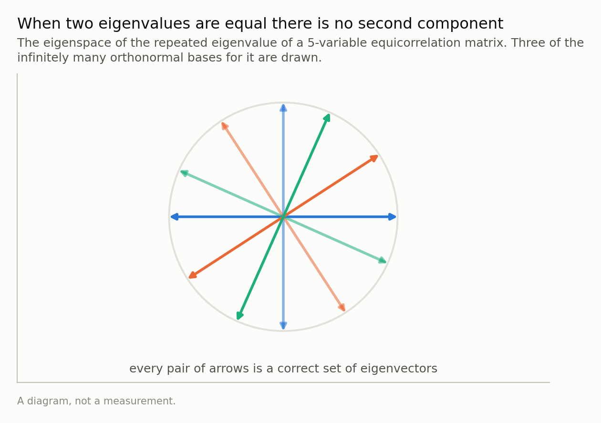
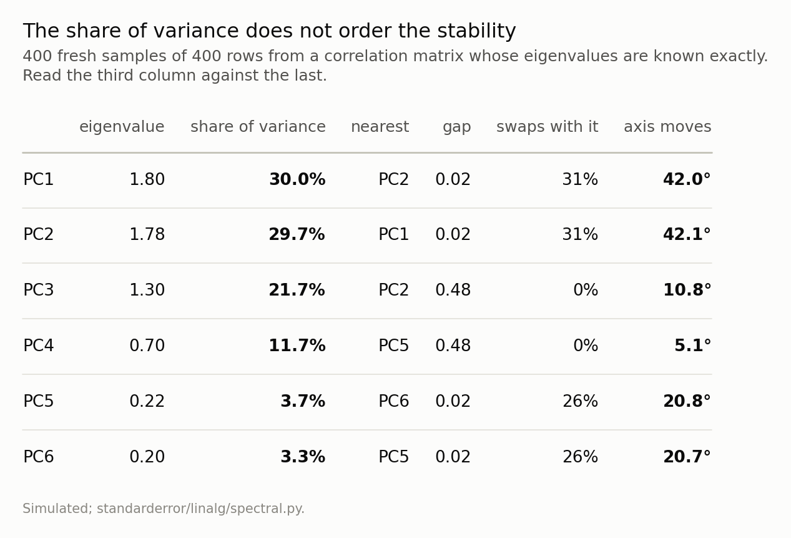
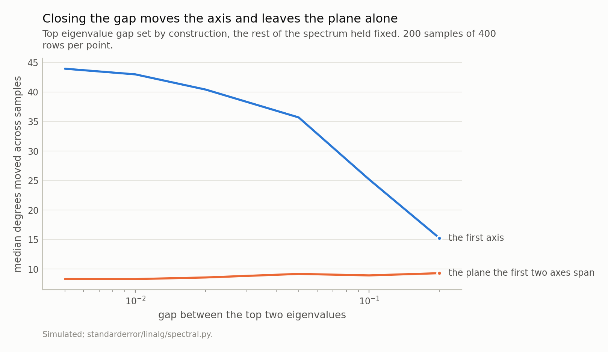
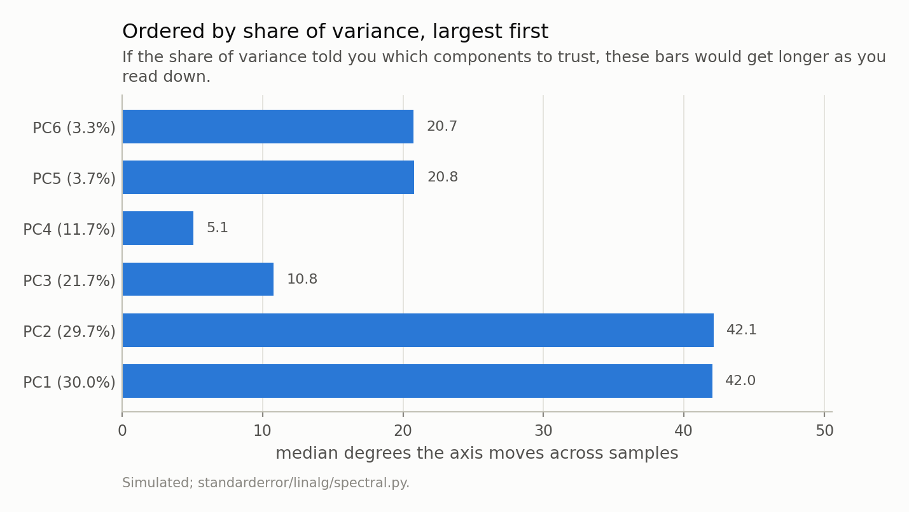
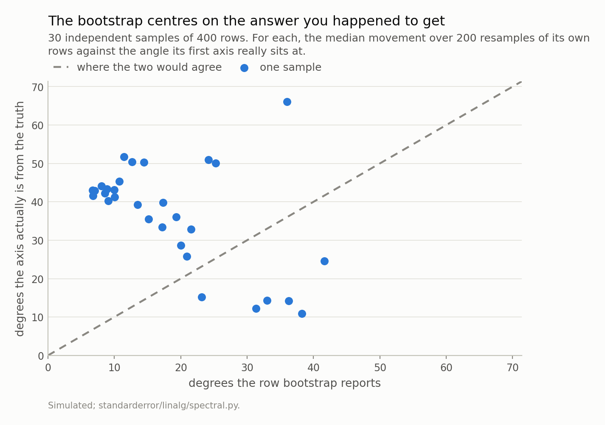

Disclosure: this post was written with the assistance of an AI system (Claude), which wrote the analysis code, ran the experiments and drafted the text. The topic, the constraints, the data choices and the final review are the author's.

*Every applied account of PCA triages components by the share of variance they carry, and stability does not work that way: an eigenvector is determined by the distance from its eigenvalue to the nearest other one, so the largest component in a decomposition can be the least trustworthy axis in it. When two eigenvalues are exactly equal the axes stop existing altogether — any rotation of them rebuilds the same matrix — and when they are merely close, the axes swing by tens of degrees while the plane they span holds still. The bootstrap everybody runs cannot see this, because it centres on the arbitrary answer the sample happened to give.*

Episode 4 of *Linear Algebra for Data Science, Taught Through What Breaks*. The syllabus and the other episodes: https://jongha-jeon-dev.github.io/standarderror/lectures/

## Last episode's exercise

The exercise was: take a dataset with six or more numeric columns, bootstrap the rows, and count how often each adjacent pair of eigenvalues swaps order. Then look at the loadings of the pair that swaps most.

Most people expect the swapping to happen at the bottom, among the small components nobody trusts anyway. It happens wherever two eigenvalues are close, and that can be anywhere — including at the very top. The pair that swaps is not the pair with the smallest eigenvalues. It is the pair with the smallest *gap*.

And then the second half of the exercise, which is the part that matters. When two components swap places between one resample and the next, the sentence "the second component represents ..." has been written about a direction the data does not determine. The plane those two components span is a real feature of the data. Which pair of perpendicular arrows inside that plane your library handed back is not.

## Two eigenvalues that are exactly equal

Start with the case where this is not a matter of degree. Take 5 variables and correlate every pair equally, at 0.4. This matrix has a spectrum you can write down without computing anything: one eigenvalue of 2.6, and 4 eigenvalues of 0.6.

Not approximately 0.6. Exactly, 4 times over.

```python
import numpy as np

# 5 variables, every pair correlated 0.4. The spectrum is
# known in closed form: 1 + (p-1)*rho once, and 1 - rho 4 times.
p, rho = 5, 0.4
R = (1 - rho) * np.eye(p) + rho * np.ones((p, p))
vals, V = np.linalg.eigh(R)
print(f"eigenvalues  {np.sort(vals)[::-1].round(6)}")

# Rotate two of the tied eigenvectors into each other by any angle at all
# and rebuild the matrix from the rotated basis.
t = np.radians(123.4)
W = V.copy()
W[:, 1] = np.cos(t) * V[:, 1] + np.sin(t) * V[:, 2]
W[:, 2] = -np.sin(t) * V[:, 1] + np.cos(t) * V[:, 2]

print(f"still orthonormal   {np.abs(W.T @ W - np.eye(p)).max():.1e}")
print(f"rebuilds the matrix {np.abs(W @ np.diag(vals) @ W.T - R).max():.1e}")
```

```text
eigenvalues  [2.6 0.6 0.6 0.6 0.6]
still orthonormal   2.2e-16
rebuilds the matrix 2.2e-16
```

Read the last line. The rotated basis is still orthonormal, it still consists of eigenvectors of *R*, and rebuilding the matrix from it returns the original to 2e-16 — machine precision. The rotation was by 123.4 degrees, and it could have been by any other number.

So there is no second component here, and no third or fourth either. There is a one-dimensional eigenspace for 2.6 and a 4-dimensional eigenspace for 0.6, and *within* that second eigenspace every orthonormal basis is as correct as every other. The particular arrows `eigh` returned are a fact about the algorithm LAPACK implements. Any interpretation of them is an interpretation of LAPACK.



*Rotating the tied eigenvectors by 123.4 degrees and rebuilding the matrix changes it by 2e-16. The plane is a fact about the data; the arrows in it are a fact about LAPACK.*

## Nearly equal is the same problem, measured in degrees

An exact tie is a mathematical statement, and sampled data never produces one. What sampled data produces constantly is a near tie, and the near tie inherits the problem in proportion.

Here is a correlation matrix built so its spectrum is known before any sample is drawn. Three independent pairs of variables, correlated 0.8, 0.78 and 0.3 within each pair; a matrix like that is block diagonal, and its eigenvalues are exactly 1 ± each of those three numbers.

```python
# Three independent pairs of variables, correlated 0.8, 0.78
# and 0.3 within each pair. The eigenvalues are 1 +- each of those,
# so the top gap is 0.02 by construction rather than by luck.
C = np.eye(6)
for i, c in enumerate([0.8, 0.78, 0.3]):
    C[2 * i, 2 * i + 1] = C[2 * i + 1, 2 * i] = c

vals = np.sort(np.linalg.eigvalsh(C))[::-1]
share = vals / vals.sum()
print("        eigenvalue  share  gap to next")
for k, v in enumerate(vals):
    gap = f"{v - vals[k + 1]:.2f}" if k + 1 < len(vals) else "   -"
    print(f"  PC{k + 1}   {v:9.2f}  {share[k]:5.1%}      {gap}")
```

```text
        eigenvalue  share  gap to next
  PC1        1.80  30.0%      0.02
  PC2        1.78  29.7%      0.48
  PC3        1.30  21.7%      0.60
  PC4        0.70  11.7%      0.48
  PC5        0.22   3.7%      0.02
  PC6        0.20   3.3%         -
```

The top two eigenvalues are 0.02 apart. They carry 30.0% and 29.7% of the variance — the two largest components in the decomposition, the two any analysis would keep and name.

Now draw 400 rows from this population 400 times and ask, for each component, how far its axis lands from the population's.



*PC1 carries the most variance of any component and moves 42 degrees; PC3 carries 22% and moves 11. The column that predicts the last one is the gap, not the share.*

Read the table by comparing its third column with its last. **PC1 carries the most variance of anything in the matrix and its axis moves 42 degrees.** PC3 carries 22% — nine points less — and moves 10.8. PC4 carries 12% and moves 5.1.

The share of variance does not order the stability. It does not even correlate with it. What orders it is the column in between: the distance from each eigenvalue to the nearest other one.

That is not a coincidence of this matrix, it is a theorem. The Davis-Kahan *sin θ* theorem bounds how far an eigenvector can move when the matrix is perturbed by *E*, and in the form Yu, Wang and Samworth state for statisticians it reads

$$
\sin \theta \le \frac{2^{3/2} \lVert E \rVert_{\mathrm{op}}}{\min(\lambda_{j-1} - \lambda_j, \quad \lambda_j - \lambda_{j+1})}
$$

The numerator is how much noise there is. The denominator is the gap. Nothing in that expression is the share of variance.

## The gap is the parameter, so set it

The construction above is worth the two lines it costs, because it makes the gap a *dial*. Change the second pair's correlation and the top gap changes by exactly that amount, while the rest of the spectrum stays where it is. So the relationship between gap and movement can be measured rather than argued about.

At a gap of 0.005, the first axis lands a median of 44 degrees from the truth and swaps places with the second 36% of the time. At 0.2, it moves 15 degrees and never swaps. And the plane those two axes span — the two-dimensional subspace, rather than either arrow in it — sits at 8 to 9 degrees across the entire range, unmoved by the thing that moves the axis by a factor of three.



*Two quantities from the same decomposition, on the same axis, in the same units. One of them is a property of the data and the other is not.*

That flat line is the usable part of the answer, and it is flat for a reason worth stating. The angle between two *subspaces* — the principal angle — does not depend on which basis you chose for either one. Rotate the columns among themselves and it does not move. That is precisely the invariance a single eigenvector does not have, and it is why "these two variables and those two load on a common plane" survives resampling when "PC2 is the size factor" does not.

So a decomposition with a near-tied pair is not uninformative. It is informative about a plane and silent about the axes in it, and the usual reporting format has no way to say that.

## What the share of variance is actually for

It is worth being fair to the share of variance, because it is not a useless number — it is a number answering a different question.

The share tells you how much of the total variance you lose by truncating after *k* components. That is a statement about the *subspace* spanned by the first *k*, and it is correct: keep the top four here and you have kept 93% of the variance, whatever basis those four are expressed in. Reconstruction error, compression, how many components to retain — all subspace questions, all correctly answered by the eigenvalues.

The moment the question becomes *what does this one component mean*, the object under discussion changes from a subspace to an axis, and the number that governed the first question stops applying.



*They do not. The two longest bars belong to the two largest components, because those two are 0.02 apart; the short bars in the middle are the ones with room around them.*

## And the check you would run cannot see it

There is an obvious diagnostic here and it is the one everybody reaches for: bootstrap the rows, recompute the components, and look at how much the loadings move. If they barely move, the component is stable.

Run it on one sample of this matrix.

```python
# One sample, and the check a reader would actually run on it.
rng = np.random.default_rng(121)
X = rng.standard_normal((400, 6)) @ np.linalg.cholesky(C).T

def first_axis(M):
    return np.linalg.eigh(np.corrcoef(M.T))[1][:, -1]

def angle(u, v):
    c = abs(u @ v) / (np.linalg.norm(u) * np.linalg.norm(v))
    return np.degrees(np.arccos(min(c, 1.0)))

truth = np.linalg.eigh(C)[1][:, -1]
mine = first_axis(X)

moves = [angle(first_axis(X[rng.integers(0, 400, 400)]), mine)
         for _ in range(200)]

print(f"the bootstrap says PC1 moves  {np.median(moves):.1f} degrees")
print(f"PC1 is actually this far off  {angle(mine, truth):.1f} degrees")
```

```text
the bootstrap says PC1 moves  8.6 degrees
PC1 is actually this far off  42.3 degrees
```

Both numbers are about the first component of the same sample, and they disagree by a factor of three. Across 30 independent samples the median is 41 degrees actual against 16 reported, and the bootstrap comes in low on 24 of the 30.



*Median 41 degrees against 16 reported, and 24 of 30 samples above the line. Not a bias you could correct for — the per-sample ratio runs from 0.3 to 6.4 — but a check whose answer is unrelated to the question.*

The reason is structural rather than a matter of too few replicates. The bootstrap measures the spread of the estimator *around the estimate*, and the estimate here is one arbitrary direction in a plane the data does not resolve. Every resample lands near the same arbitrary direction, because every resample is mostly the same rows. The spread is genuinely small. It is small around the wrong centre.

This is the third episode in a row where the standard check is blind to the standard failure, and the three are the same shape. Episode one: the residual is at machine precision while the answer is wrong by 302 percent, because a backward-stable solver guarantees the residual. Episode two: the orthogonality check reads 6e-16 for a fit wrong by 321 percent, because the normal equations *are* the orthogonality condition. Here: the bootstrap reports a small movement, because it is measuring movement relative to the answer whose arbitrariness is the problem.

The pattern is worth naming. **A diagnostic computed from the same object it is auditing will confirm that object.** The checks that work in all three episodes are the ones computed from the matrix before the estimate exists — the condition number, the singular values, and here the eigenvalue gap.

## The gap is the denominator, not the whole story

One number in that table has been quietly inconsistent with the account so far, and it is worth stopping on because the honest version of the claim is narrower than the slogan.

PC1 and PC2 are 0.02 apart and the axis moves 42 degrees. PC5 and PC6 are also 0.02 apart — the same gap, in the same matrix, from the same samples — and they move 21. Half as far, on an identical denominator.

First-order perturbation theory says where the rest of it went. The movement of the *j*-th eigenvector under a perturbation *E* is a sum over the other eigenvectors,

$$
\delta v_j \approx \sum_{k \ne j} \frac{v_k^{\top} E v_j}{\lambda_j - \lambda_k} v_k
$$

and the gap is only the denominator. The numerator is how strongly the noise you actually got connects those two particular directions, and it is not a constant: measured across 400 samples it is 0.0587 for the top pair and 0.0078 for the bottom one — a factor of 8, inside one matrix.

Put those together and the first-order estimate for the bottom pair is 21 degrees against 21 measured, which is about as well as a first-order approximation ever does. For the top pair it predicts 71 against 42, and the overshoot is the theory announcing its own failure: when the coupling is 2.9 times the gap, "small perturbation" has stopped being true and a linearisation is the wrong tool.

This is also why the Davis-Kahan bound quoted earlier is so loose. Its numerator is the operator norm of *E* — the worst this perturbation could do to *any* direction — where what governs one eigenvector is what the perturbation does to that direction specifically. At every gap in the sweep above, the bound evaluates to 90 degrees: the axis could be anywhere in the half-space. That is a true statement, and it is the correct one for a worst case. It is also not a measurement, which is why this episode reports the angle rather than the bound.

## What to take away, and what is still hiding

Four things, in the order you would use them.

**Print the gaps, not just the eigenvalues.** One line beside your scree plot: `np.diff(np.sort(vals)[::-1])`. A component whose gap to its neighbour is small compared with your sampling noise has an arbitrary axis, and you now know that before you have written a sentence about it.

**Interpret subspaces when the axes are tied.** "These four variables share a two-dimensional structure" is supportable here; "PC1 is the size factor and PC2 is the shape factor" is not. If you need named axes inside a tied plane, rotate deliberately — varimax and its relatives exist for exactly this — and say that you did, because the rotation is then your modelling choice rather than your library's default.

**Do not read the share of variance as a stability ranking.** It answers how much you lose by truncating, which is a question about the subspace you keep, and it is correct about that.

**And do not let a bootstrap of the loadings reassure you.** It centres on the answer you already have.

One practical trap that is *not* this problem and looks exactly like it. An eigenvector is defined up to sign, and `eigh` makes no promise about which one it hands back, so two runs on nearly identical matrices routinely differ by a factor of -1 on some columns. Compare loadings across resamples without fixing that first and you will see enormous instability that is entirely a sign convention. Align each vector to a reference before you measure anything — one line, `v * np.sign(v @ reference)` — and then whatever movement is left is the real thing.

One thing this episode has assumed throughout. Every matrix here has been a *correlation* matrix, so every variable arrived on the same scale and the eigenvalues were comparable by construction. Take that away — run PCA on raw columns where one is a duration in seconds and another a probability — and episode one's warning about units returns with interest: the leading component is then whichever column has the largest numbers, and the gaps are an artefact of your unit choices. The standard fix is to standardise, which is to say, to use the correlation matrix. The other standard fix is ridge, which does something to the spectrum that looks like a shrinkage and is really a shift, and which spends degrees of freedom you are not told about. Next episode.

*Exercise.* Take the block matrix from this episode and standardise nothing — instead multiply the first variable by 1,000, as a change of units would. Recompute the eigenvalues of the *covariance* matrix and find the new gaps. How many components does the scree plot now suggest keeping, and how much of that answer is about the data? The answer is at the top of episode five.

---

### Data

- No external data. Every correlation matrix here is written down in the episode and every number is produced by the code shown, executed when this page was built.
- Machinery: `standarderror/linalg/spectral.py`, tested in `tests/test_spectral.py`.
- Where this stops, and who does it properly: Davis and Kahan, "The rotation of eigenvectors by a perturbation. III", *SIAM J. Numer. Anal.* 7 (1970); Yu, Wang and Samworth, "A useful variant of the Davis-Kahan theorem for statisticians", *Biometrika* 102 (2015); Anderson, *An Introduction to Multivariate Statistical Analysis*, chapter 11, on the distribution of sample eigenvectors.

### Reproducibility

- **environment**: standarderror=0.1.0, python=3.11.15, numpy=2.4.4
- **code blocks**: executed at build time; the values the prose quotes are pinned, so drift fails the build
- **simulation**: 400 samples of 400 rows for the table, 200 per point in the gap sweep, and 30 independent samples each bootstrapped 200 times for the last figure
- **determinism**: one seed, 21, and every draw derived from it; the correlation matrices themselves are exact

Code: <https://github.com/jongha-jeon-dev/standarderror>
