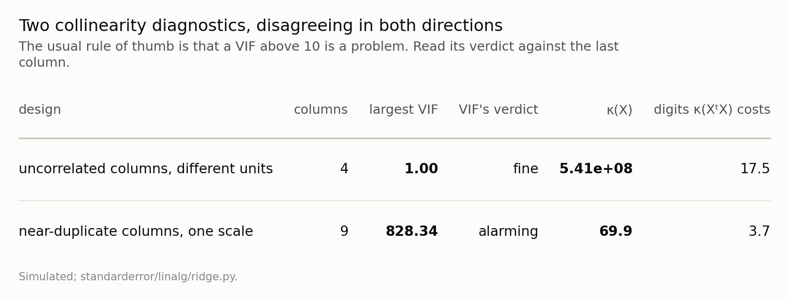
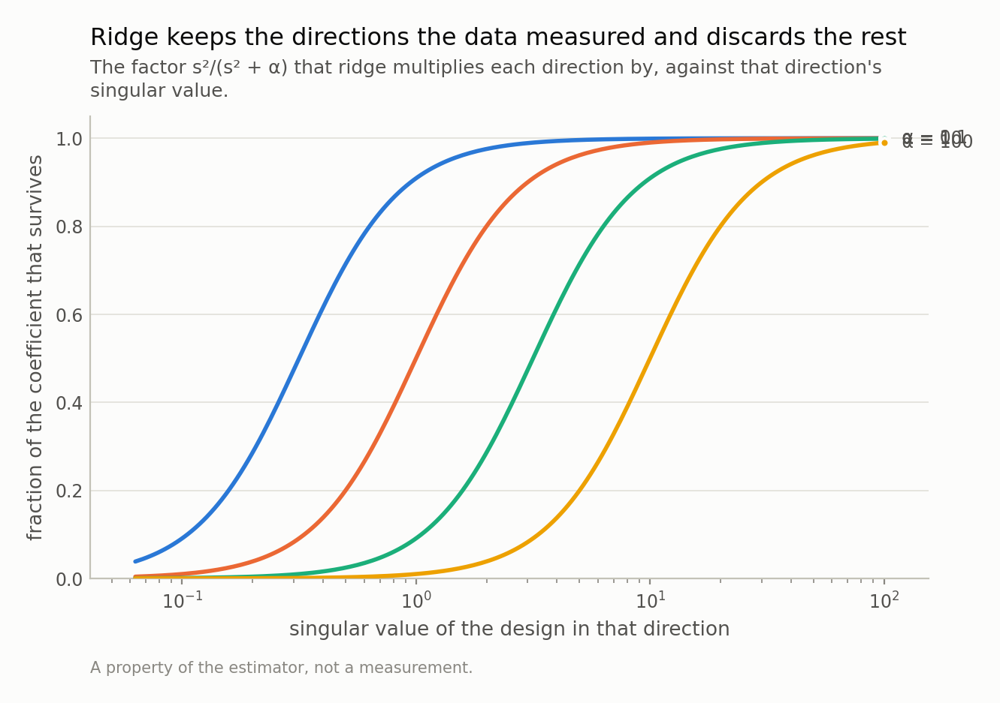
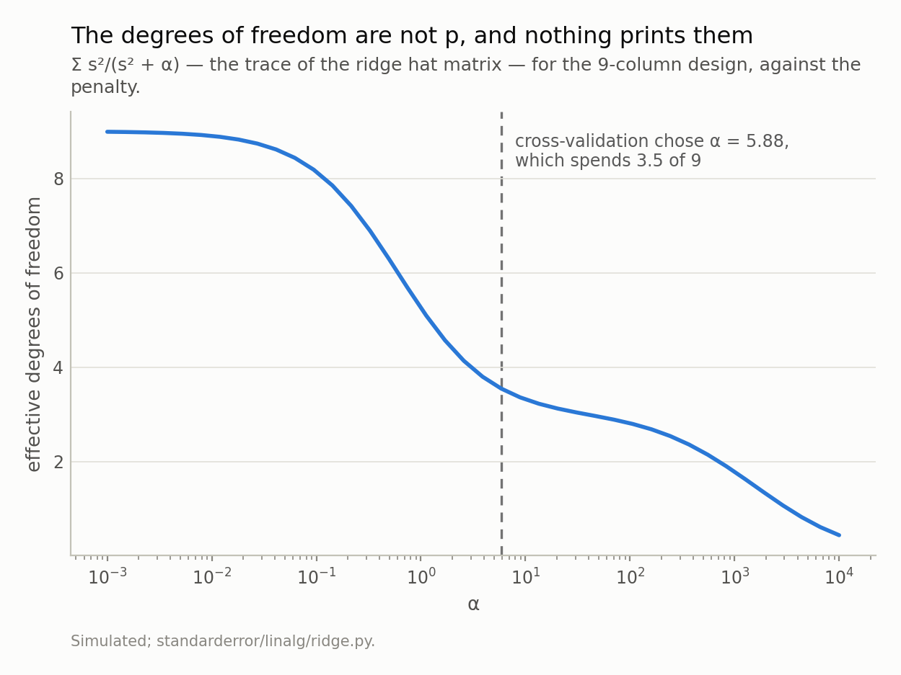
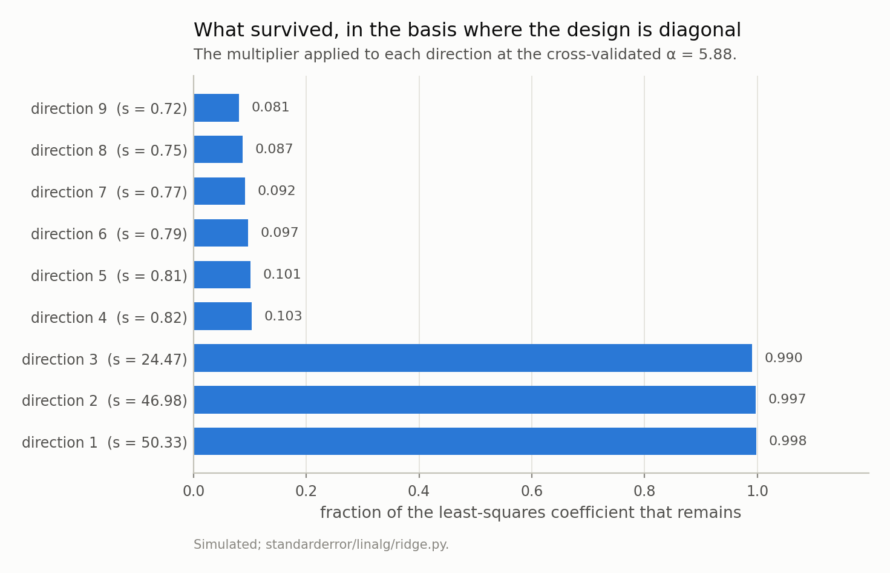
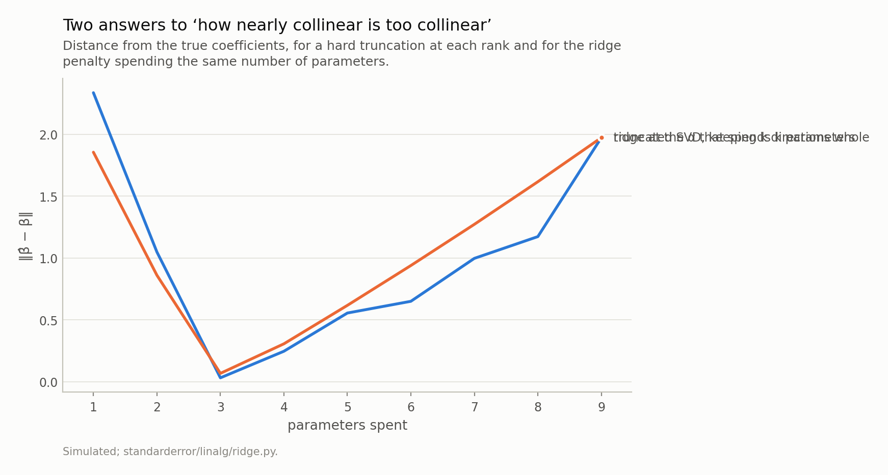
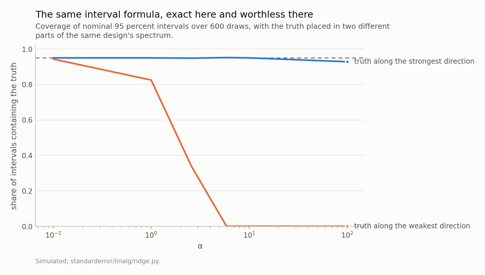

Disclosure: this post was written with the assistance of an AI system (Claude), which wrote the analysis code, ran the experiments and drafted the text. The topic, the constraints, the data choices and the final review are the author's.

*Ridge is introduced as a penalty and works as an operation on the spectrum: in the basis where the design is diagonal it multiplies each direction by s²/(s² + α) and does nothing else, which is why it shrinks hardest exactly where the data saw least. Three consequences the usual output hides — the standard collinearity diagnostic is at its floor on a design with no correct digits, the fit spends far fewer parameters than it reports, and the interval you would quote is exact where the evidence is strong and worthless where it is thin, with nothing in the printout to tell you which.*

Episode 5 of *Linear Algebra for Data Science, Taught Through What Breaks*. The syllabus and the other episodes: https://jongha-jeon-dev.github.io/standarderror/lectures/

## Last episode's exercise

The exercise was: take the block matrix from episode four, multiply one variable by 1,000 as a change of units would, and look at the eigenvalues of the *covariance* matrix instead of the correlation matrix.

```python
import numpy as np

# Episode four's block matrix, and one variable measured in different
# units. Nothing about the data changed; one column is now in grams
# rather than kilograms.
C = np.eye(6)
for i, c in enumerate([0.8, 0.78, 0.3]):
    C[2 * i, 2 * i + 1] = C[2 * i + 1, 2 * i] = c

d = np.ones(6); d[0] = 1000
S = np.outer(d, d) * C                 # the covariance, in the new units

for name, M in (("correlation", C), ("covariance", S)):
    v = np.sort(np.linalg.eigvalsh(M))[::-1]
    print(f"{name:12s} first component carries {v[0] / v.sum():8.4%}"
          f"   top gap {v[0] - v[1]:12.2f}")
```

```text
correlation  first component carries 30.0000%   top gap         0.02
covariance   first component carries 99.9996%   top gap    999998.86
```

The first component now carries 99.9996% of the variance, and the scree plot has one bar. Keep one component and you have kept everything — which is true, and is a fact about the column being in grams.

Notice what else went. The whole of episode four was about two eigenvalues 0.02 apart. In the new units the top gap is 999,999. The near-tie did not get resolved by better data; it got hidden by an arbitrary rescaling, along with everything else in the spectrum.

That is why PCA is run on the correlation matrix, and "standardise your columns first" is the one piece of advice everybody gives. But it raises the question this episode is about. If a change of units can move the spectrum that far, what does the spectrum have to do with the model — and what is a method like ridge, which also modifies the spectrum, actually doing to it?

## First, the diagnostic that cannot see any of this

Before ridge, the thing ridge is usually reached for. Collinearity has a standard diagnostic — the variance inflation factor, `1/(1 - R²ⱼ)` from regressing each predictor on the others — and a standard threshold: above 10, worry.

Here is episode two's exercise design again. An intercept, a duration in seconds, a probability, and an amount of money, all mutually uncorrelated.

```python
# Four columns nobody would call collinear: an intercept, a duration in
# seconds, a probability, and an amount of money. All mutually
# uncorrelated, so every variance inflation factor is at its floor.
rng = np.random.default_rng(31)
X = np.column_stack([np.ones(600), rng.normal(3600, 600, 600),
                     rng.normal(0.30, 0.10, 600),
                     rng.normal(5e7, 1e7, 600)])

def vif(X):
    "1 / (1 - R^2) from regressing each predictor on the others."
    Z, out = X[:, 1:], []
    for j in range(Z.shape[1]):
        A = np.column_stack([np.ones(len(Z)), np.delete(Z, j, axis=1)])
        resid = Z[:, j] - A @ np.linalg.lstsq(A, Z[:, j], rcond=None)[0]
        r2 = 1 - resid.var() / Z[:, j].var()
        out.append(1 / (1 - r2))
    return np.array(out)

sv = np.linalg.svd(X, compute_uv=False)
print(f"VIFs                    {vif(X).round(4)}")
print(f"largest                 {vif(X).max():.4f}   "
      f"(rule of thumb: above 10 is a problem)")
print(f"condition number        {sv.max() / sv.min():.2e}")
print(f"digits kappa(X'X) costs {2 * np.log10(sv.max() / sv.min()):.1f} of 15.7")
```

```text
VIFs                    [1.0013 1.001  1.0018]
largest                 1.0018   (rule of thumb: above 10 is a problem)
condition number        5.41e+08
digits kappa(X'X) costs 17.5 of 15.7
```

Every VIF is at 1.0018. Not "acceptable" — that is the smallest number the statistic can take, and it is what it returns when the columns are perfectly uncorrelated, which they are. Meanwhile the condition number is 5.41e+08, and by episode one's accounting the normal equations for this design consume more digits than a double has.

The VIF is not broken. It is answering a different question, and answering it correctly: *how much do the other columns inflate this coefficient's variance*. That question is deliberately invariant to how each column is scaled, and it excludes the intercept. Both choices are defensible, and both are exactly why it cannot see a problem made of scales and means.

The reverse also happens.



*Neither statistic is wrong. The VIF asks how much the other columns inflate one coefficient's variance, which is scale-free and ignores the intercept; the condition number asks how much the solve can amplify any error at all. Only the second is about the arithmetic you are about to do.*

The second design is eight columns that really are near-duplicates of two underlying directions. Its largest VIF is 828 — eighty times the threshold — and its condition number is 70, which costs about 3.7 digits out of 15.7. Uncomfortable, entirely survivable.

So the two statistics disagree in both directions, and it is not that one of them is unreliable. A VIF of 828 is a true statement that one coefficient's variance is inflated eight hundred-fold, which matters enormously if that coefficient is your result and not at all if you only want predictions. A condition number of 5.4e+08 is a true statement that the arithmetic has no digits left, which matters whatever you wanted. **Run both. They cost one line each and they are not substitutes.**

## What ridge actually does

Ridge is introduced as a penalty: minimise ‖*y* − *Xβ*‖² + *α*‖*β*‖². That is correct and it explains nothing, because the mechanism is one substitution.

Write the design by its singular value decomposition, *X* = *UΣV*ᵗ. Then the ridge solution is

$$
\hat\beta_{\alpha} = V \, \mathrm{diag}\!\left(\frac{s_i}{s_i^{2} + \alpha}\right) U^{\top} y
$$

and comparing it with least squares, which is the same expression with 1/*sᵢ* in the middle, the entire difference is a multiplier per direction:

$$
\frac{s_i^{2}}{s_i^{2} + \alpha}
$$

That number is between 0 and 1, it is close to 1 whenever *sᵢ*² ≫ *α*, and it falls towards 0 when *sᵢ*² ≪ *α*. **Ridge does not shrink the coefficient vector. It shrinks the directions, by different amounts, and the amount depends on how well the design measured each one.**

```python
# Ridge, written the way it actually works: one multiplier per direction.
U, sv, Vt = np.linalg.svd(X, full_matrices=False)
for alpha in (0.0, 1.0, 100.0):
    f = sv**2 / (sv**2 + alpha)
    print(f"alpha {alpha:6.0f}   keeps {np.round(f, 4)}   "
          f"df {f.sum():.3f}")
```

```text
alpha      0   keeps [1. 1. 1. 1.]   df 4.000
alpha      1   keeps [1.     1.     0.9234 0.8414]   df 3.765
alpha    100   keeps [1.     1.     0.1076 0.0504]   df 2.158
```

That is the whole of it, and it is why the method works: the directions it destroys are the ones carrying almost no information, and the price of a small bias there buys a large reduction in variance. It is also why the price is invisible, because nothing in a coefficient table is indexed by direction.



*Not a uniform shrinkage of the coefficient vector. Each curve is flat at one over the well-measured directions and falls off a cliff below a threshold that α sets — so the penalty lands almost entirely on the directions the design saw least.*

## The parameters you spent, and the ones your output reports

Add those multipliers up and you get the trace of the ridge hat matrix, which is the number of parameters the fit actually used:

$$
\mathrm{df}(\alpha) \;=\; \sum_i \frac{s_i^{2}}{s_i^{2} + \alpha}
$$

At *α* = 0 it is *p*. As *α* grows it falls smoothly, and there is nothing discrete about it — a direction can count as 0.3 of a parameter.

On the near-duplicate design, cross-validation picks *α* = 5.88, and at that penalty the fit spends **3.55 of its 9 parameters**.



*At α = 0 this is p. At the α cross-validation chose it is 3.55, so the fit spent under half the parameters the output reports — and every standard error, AIC and residual degree-of-freedom count beside it assumed 9.*

Look at where it went. 3 of the 9 directions pass through essentially untouched; the remaining 6 are cut to under half, most of them to under a tenth. The object that comes out is a 3-parameter fit wearing 9 coefficients.

Now consider everything printed beside it. A residual degree-of-freedom count of *n* − 9. A standard error using that count. An AIC or BIC with a penalty of 9 parameters. An adjusted *R*² correcting for 9. Every one of those is wrong by the same factor, and every one of them is wrong in the optimistic direction, because 3.55 < 9.

The fix is not difficult — `df(α)` is four lines from the singular values, and it belongs wherever *p* currently sits. The difficulty is that no library prints it next to the coefficients.



*Three directions pass through almost untouched and six are cut to under a tenth. The fit that comes out is a three-parameter fit wearing nine coefficients.*

## Which is the question episode two left open

Episode two ended on a rank-deficient design and a threshold called `rcond`: the singular value below which `lstsq` treats a direction as numerically zero and discards it. It was described there as a modelling decision disguised as a numerical tolerance, because it decides *how nearly collinear is too collinear*, and the question was deferred to here.

Here is the answer. Truncating the SVD at rank *k* and ridge at a penalty *α* are the same decision, taken with a cliff and with a ramp. Truncation multiplies each direction by 1 or by 0. Ridge multiplies it by *sᵢ*²/(*sᵢ*² + *α*), which is 1 and 0 with a slope in between. Put them on the same axis — parameters spent — and they can be compared, because `df(α)` is exactly what makes a penalty and a rank commensurable.

Both bottom out at 3 parameters, which is the number of directions this design has: 3 singular values above 24 and 6 below 0.82. Near that point the two are within a few percent of each other. They diverge only at the ends, where the budget is far from what the data supports and neither answer is any good.

So the choice between them is not a choice about how much to regularise — that is the same number either way — but about whether you want a hard rank or a soft one. A rank is easier to report and defend; a ramp is differentiable and does not put a discontinuity in your cross-validation curve.



*Both bottom out at 3, which is how many directions this design actually has. Near that point the two agree to within a few percent; they part company only where the budget is far from what the data supports, and there neither is a good answer.*

## And whether the interval means anything

There is an exact variance formula for the ridge estimator. With *W* = (*X*ᵗ*X* + *αI*)⁻¹ it is *σ*²*W X*ᵗ*X W*, it is not an approximation, and simulating from the design reproduces it to within a few percent. So an interval built from it should be fine.

It is fine, sometimes. Put the truth along the design's strongest direction and nominal 95 percent intervals cover 95% at the cross-validated *α*. Put the same-sized truth along the weakest direction — same design, same formula, same *α* — and they cover 0%, with a bias of 14.2 standard errors on the worst coefficient.



*The variance formula is the exact one and is identical in both cases; what differs is the bias, which no variance formula contains. Which curve you are on depends on where the truth sits relative to your design — which is the thing you do not know.*

The variance formula is not at fault, and this is the part worth sitting with. It describes the spread of the estimator around **its own expectation**, and ridge's expectation is deliberately not the truth — that is what "biased estimator" means, and the bias is the term no variance formula contains. Where the data is strong the shrinkage is negligible and so is the bias; where it is weak the shrinkage is nearly total and the estimate is pulled to zero regardless of where the truth was.

Which case you are in depends on how your *β* sits relative to your design's singular directions, and that is not something you can look up. It is the quantity you were trying to estimate.

This is the fourth episode where the reported check is silent about the actual failure, and it is the first one where the check is not simply blind. The residual in episode one, the orthogonality condition in episode two, the bootstrap in episode four — those are wrong in every case. This one is *right most of the time*, which is worse, because a diagnostic that fails loudly gets fixed and one that fails occasionally gets trusted.

## One more thing the opening exercise was about

The penalty is ‖*β*‖², which adds up the squares of the coefficients. Coefficients are in the units of one over their column, so that sum is adding numbers that are not commensurable unless the columns are.

Take the four-column design from the top of this episode. Its duration column has a standard deviation of about 611, its probability column about 0.10, and its money column about 1.01e+07. Since the penalty presses on each coefficient in proportion to the square of that column's scale, the duration is penalised 3e-08 as hard as the probability and the money 1e-16 as hard — which is to say, not at all. Its coefficient is around 1e-8 because its column is around 1e7, and squaring a number that small contributes nothing to a sum containing a coefficient of order 1. So on this design, ridge is a penalty on the probability column and the intercept, and a rounding error everywhere else.

That is not a subtlety, it is the same units problem the opening exercise made about the eigenvalues, arriving in the penalty instead of in the spectrum. Standardise the columns before you regularise, do not penalise the intercept, and put the coefficients back in their original units afterwards if anybody has to read them.

## What to take away, and what is still hiding

Four things.

**Run the condition number alongside the VIF.** They answer different questions and disagree in both directions. One line each.

**Read ridge as a per-direction multiplier.** `s**2 / (s**2 + alpha)` from the singular values tells you exactly what the penalty did, which no coefficient table can.

**Report `df(α)`, not `p`.** `sum(s**2 / (s**2 + alpha))`. Then put it wherever *p* was: residual degrees of freedom, AIC, adjusted *R*².

**And treat a ridge interval as a statement about prediction, not about a coefficient.** Where the design is strong it means what it says. Where it is weak the estimate is shrunk towards zero by construction and the interval follows it there.

One thing this episode has quietly assumed. Every statement above has been about *directions* — properties of the columns, of *X*ᵗ*X*, of the spectrum. Nothing has depended on any particular **row**. That is a reasonable assumption when no row is special, and the assumption fails more easily than it sounds: the diagonal of the projection matrix *X*(*X*ᵗ*X*)⁻¹*X*ᵗ has to sum to *p*, so its average entry is *p*/*n* — and there is nothing stopping a single entry from being 1. A row with leverage 1 has a residual of exactly zero, contributes nothing to any residual-based diagnostic, and owns its own fitted value completely. Next episode.

*Exercise.* Build a design with an intercept, two ordinary columns, and a dummy variable that is 1 for exactly one row out of a thousand. Compute the diagonal of the hat matrix. What is the leverage of that row, what is its residual, and what happens to Cook's distance — which divides by the residual? Then delete the row and refit, and see which coefficient moves. The answer is at the top of episode six.

---

### Data

- No external data. Every design matrix here is constructed in the episode and every number is produced by the code shown, executed when this page was built.
- Machinery: `standarderror/linalg/ridge.py`, tested in `tests/test_ridge.py`.
- Where this stops: Hoerl and Kennard, "Ridge regression: biased estimation for nonorthogonal problems", *Technometrics* 12 (1970); Belsley, Kuh and Welsch, *Regression Diagnostics* (1980), chapter 3; Hastie, Tibshirani and Friedman, *The Elements of Statistical Learning*, section 3.4.1.

### Reproducibility

- **environment**: standarderror=0.1.0, python=3.11.15, numpy=2.4.4
- **code blocks**: executed at build time; the values the prose quotes are pinned, so drift fails the build
- **simulation**: 600 rows per design, 600 draws per coverage point, five contiguous cross-validation blocks
- **determinism**: one seed, 31, and every draw derived from it

Code: <https://github.com/jongha-jeon-dev/standarderror>
