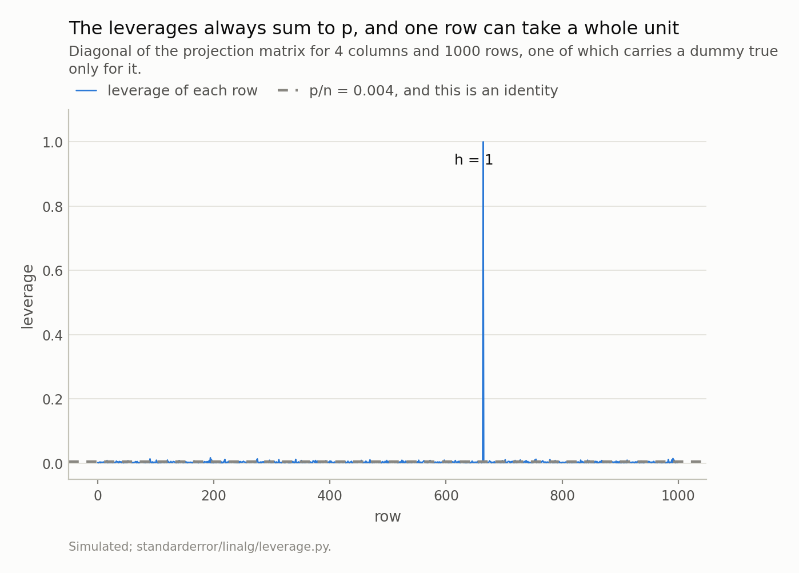
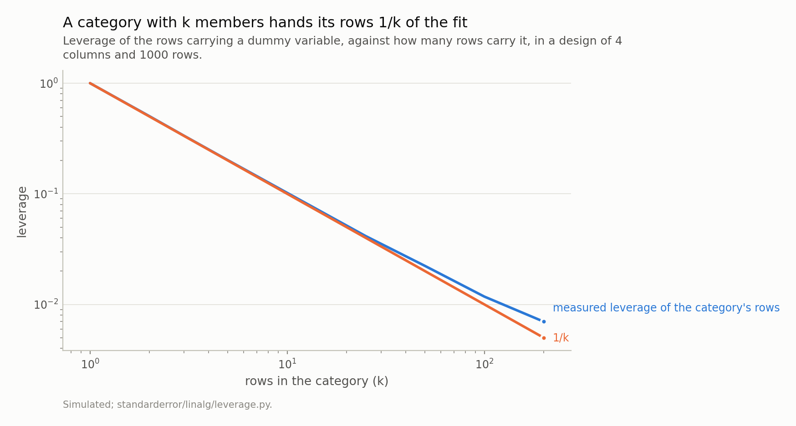
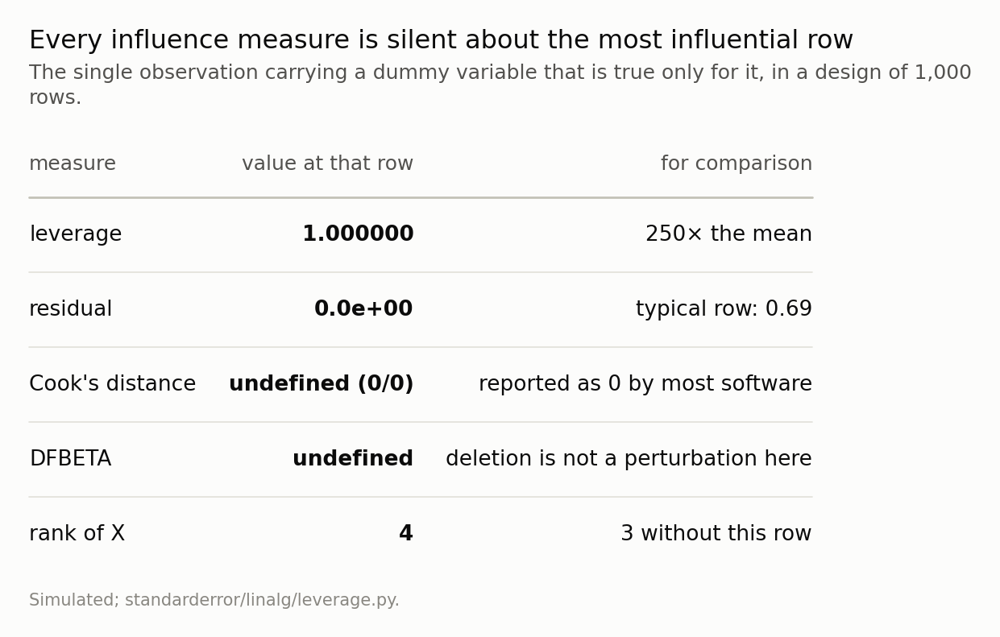
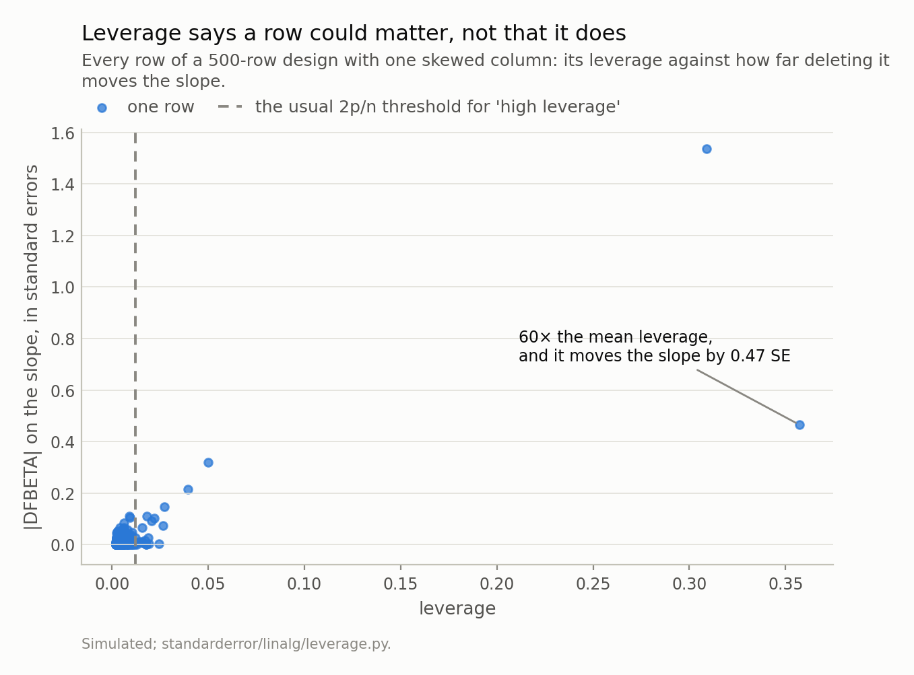
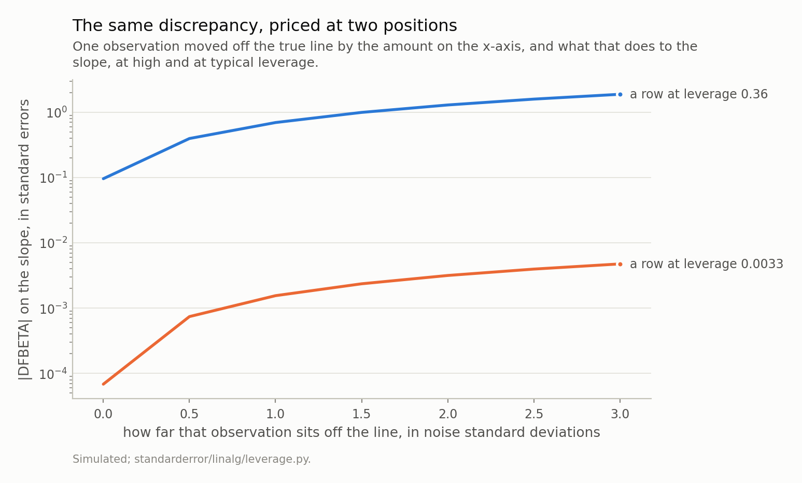

Disclosure: this post was written with the assistance of an AI system (Claude), which wrote the analysis code, ran the experiments and drafted the text. The topic, the constraints, the data choices and the final review are the author's.

*The diagonal of the projection matrix always sums to the number of columns, so average leverage is p/n and no data can change it — but nothing stops one row taking a whole unit. A row at leverage 1 has a residual of exactly zero, which means every diagnostic built on residuals reports nothing about the most influential observation in the design, and a category with one member produces exactly that. The second half is the distinction that matters in ordinary data: leverage says a row could matter and influence needs it to be unusual in x and wrong in y, and the same discrepancy is worth four hundred times more at one position than another.*

Episode 6 of *Linear Algebra for Data Science, Taught Through What Breaks*. The syllabus and the other episodes: https://jongha-jeon-dev.github.io/standarderror/lectures/

## Last episode's exercise

The exercise was: build a design with an intercept, two ordinary columns, and a dummy variable true for exactly one row in a thousand. Then look at the leverage of that row, its residual, and Cook's distance.

```python
import numpy as np

# Episode five's exercise. An intercept, two ordinary columns, and a
# dummy that is true for exactly one row out of 1000.
rng = np.random.default_rng(41)
n = 1000
d = np.zeros(n); d[rng.integers(n)] = 1.0
X = np.column_stack([np.ones(n), rng.standard_normal(n),
                     rng.standard_normal(n), d])
y = X @ np.array([1.0, 2.0, -1.0, 3.0]) + rng.normal(0, 1.0, n)

# The hat diagonal, without forming an inverse -- episode one's rule.
Q = np.linalg.qr(X)[0]
h = np.einsum("ij,ij->i", Q, Q)
i = int(np.argmax(h))

beta = np.linalg.lstsq(X, y, rcond=None)[0]
resid = y - X @ beta

print(f"leverages sum to        {h.sum():.6f}   (p = {X.shape[1]})")
print(f"mean leverage           {h.mean():.6f}   (p/n)")
print(f"leverage of row {i}     {h[i]:.6f}")
print(f"its residual            {resid[i]:+.2e}")
print(f"a typical residual      {np.median(abs(resid)):+.2f}")
```

```text
leverages sum to        4.000000   (p = 4)
mean leverage           0.004000   (p/n)
leverage of row 664     1.000000
its residual            +0.00e+00
a typical residual      +0.69
```

Three numbers, and each is worth its own sentence.

The leverages sum to 4, which is the number of columns. That is not a property of this data — it is an identity, and it is the whole reason the rest of the episode works.

The leverage of that one row is 1. Not "high": one, exactly, which is the largest value the quantity can take.

And its residual is 0e+00, against a typical residual of 0.69 elsewhere in the same fit. The line passes exactly through the point.

## Why the sum is fixed, and what that costs

The fitted values are *Xβ̂* = *Hy* where *H* = *X*(*X*ᵗ*X*)⁻¹*X*ᵗ is the projection onto the column space, and *hᵢ* — the *i*-th diagonal entry — is how much of the *i*-th fitted value comes from the *i*-th observation. Its trace is

$$
\mathrm{tr}(H) \;=\; \mathrm{tr}\!\left( (X^{\top}X)^{-1} X^{\top}X \right) \;=\; p
$$

using only that the trace does not care about the order of a product. So the leverages sum to *p* no matter what the data looks like, the mean is *p*/*n* = 0.004 here, and every threshold you have seen — 2*p*/*n*, 3*p*/*n* — is a multiple of a quantity you already know before collecting anything.

The consequence is the part worth noticing. It is a *fixed budget*. A row at leverage 1 has taken a whole unit out of a total of 4, and every other row is pushed below the mean to pay for it.



*The dashed line is not an average of anything measured — trace(H) = p, so the mean is 0.004 whatever the data. The spike is 250 times it, and every other row is pushed below the mean to pay for it.*

## A category with one member

That design was not a contrivance. A dummy variable true for *k* rows gives each of those rows leverage of at least 1/*k*, and the reason is almost tautological: within that category, the model has one free parameter and *k* observations to spend it on.

At *k* = 2 it is 0.503. At 10 it is 0.102. At 200 it is 0.0070, which is where the other columns' contribution starts to be the larger part.

And at *k* = 1 it is exactly 1, because the model has a parameter whose only evidence is that row.



*Exactly 1/k from the dummy, plus about (p−2)/n from the other columns — which is why the two curves part company only once 1/k has fallen to the same order as p/n. A category of one is the left-hand end of an ordinary curve, not a special case.*

This is the rare dummy episode two set aside. There, standardising a design with a 1 percent dummy left the condition number at 1.08, and the conclusion was that a rare category is not a conditioning problem. It is not. Nothing about *X*ᵗ*X* is ill-behaved; the design is perfectly well conditioned and the solve is exact. The problem is entirely on the other axis of the matrix, and it does not show up in any spectrum.

It is also not rare. Any categorical variable with a long tail — a country field, a product code, a diagnosis, a merchant ID — produces categories of size one by the dozen, and one-hot encoding turns each of them into a column whose only evidence is a single row.

## Where every diagnostic goes quiet

Now run the standard influence checks on the most influential observation in the design.

```python
# The usual advice: drop the influential observation and refit.
keep = np.ones(len(y), bool); keep[i] = False
print(f"rank of X            {np.linalg.matrix_rank(X)}")
print(f"rank without row {i} {np.linalg.matrix_rank(X[keep])}")

# Cook's distance has the residual on top and (1 - h) underneath.
s2 = (resid**2).sum() / (len(y) - X.shape[1])
print(f"Cook numerator       {resid[i]**2 * h[i]:.3e}")
print(f"Cook denominator     {X.shape[1] * s2 * (1 - h[i])**2:.3e}")
```

```text
rank of X            4
rank without row 664 3
Cook numerator       0.000e+00
Cook denominator     1.936e-31
```

Cook's distance is *eᵢ*² *hᵢ* / (*p s*² (1 − *hᵢ*)²). At *hᵢ* = 1 the numerator has the squared residual in it, which is zero, and the denominator has (1 − *hᵢ*)², which is also zero. The statistic is undefined. What software prints depends on which underflows first, and in practice that is usually the numerator — so the most influential row in your design is reported as having no influence at all.

DFBETA is worse in an interesting way. Its closed form divides by (1 − *hᵢ*), so it is undefined too, but the reason is substantive rather than numerical: **deleting this row is not a perturbation of the fit.** Delete it and the dummy column becomes all zeros, the rank drops from 4 to 3, and the coefficient does not move to a different value — it stops existing.



*The residual is zero because the fit passes exactly through the point, and every measure built on residuals inherits that zero. The last row is what actually happens if you take the advice to drop the influential observation.*

## Two members, and they hide each other

One more thing the extreme case makes visible before we leave it. Give the category 2 members instead of one, and put a 6σ error into exactly one of them.

Both rows now sit at leverage 0.5004 — equal to fifteen decimal places, because leverage never looks at *y* and the two rows are interchangeable in *X*. Their Cook's distances agree to 12 decimals as well, 4.0128 against 4.0128. Their DFBETAs differ by 2.0e-03 — 3.997 against 3.995, a gap of 0.05 percent.

Only one of them is wrong, and that is what the diagnostics have to say about which.

The diagnostics cannot separate them, and it is not a limitation of the arithmetic. Deleting either row leaves one observation to determine the coefficient, so either deletion moves it by the full distance between the two. They are symmetric partners in the same parameter, and a measure defined by "what happens if I remove this row" cannot tell a guilty row from the innocent one it is paired with.

What the deletions actually give is worth reading. The fit with both rows puts the coefficient at +5.80 against a truth of +3.0. Drop the wrong row and it goes to +2.97, which is nearly right. Drop the innocent one and it goes to +8.63, which is further from the truth than where you started. Drop both and it is +0.0, because there is nothing left to estimate it from. One of those three is the correct action and nothing in the diagnostics tells you which.

## But leverage is not influence

So far this has been about an extreme case that makes the mechanism visible. The version you will actually meet is quieter, and the quiet version is where the mistake gets made — because the natural response to all of the above is to sort by leverage and look at the top.

Here is a 500-row design with one skewed column, the kind an income or a firm size or a transaction value actually is. No outlier is placed by hand; the column is lognormal and the noise is ordinary.

Its highest-leverage row sits at 0.357, which is 60 times the mean and far beyond any threshold. Deleting it moves the slope by 0.47 standard errors.

That is not a failure of the leverage measure. It is what leverage means. *hᵢ* is computed from *X* alone — it never sees *y* — so it can only tell you that an observation is in a position to matter. Whether it does depends on whether it also disagrees with the rest of the data, and most unusual rows do not.



*The rows furthest to the right are not the rows furthest up. Leverage is a property of x alone; influence needs the observation to be unusual in x **and** off the line in y, and most high-leverage rows are neither surprising nor wrong.*

The two combine multiplicatively, which is what makes the position dangerous rather than merely unusual. The change in a coefficient from deleting row *i* is proportional to *eᵢ* /(1 − *hᵢ*): the residual, amplified by how much of its own fitted value the row supplied.

Take the same design and move one observation off the true line by a fixed amount, first at high leverage and then at typical leverage.

At a discrepancy of 3σ — a size you would see a few times in 500 rows without anything being wrong — the high-leverage row moves the slope by 1.88 standard errors and the ordinary row moves it by 0.0048. The same error, at two positions, worth **396 times as much** at one as at the other.



*At the top of the range the discrepancy is the same size in both cases and its effect differs by a factor of 396. A 3σ outlier at typical leverage is a rounding error; at high leverage it is most of a conclusion.*

And when both arrive together without anyone arranging it: a lognormal column with a heavier tail, ordinary noise, no hand-placed outlier. One row lands at leverage 0.991 — 165 times the mean — with an *x* of 13,263 against a median of 0.94. It moves the slope by **6.23 standard errors**.

A coefficient reported as six standard errors from zero, resting on one observation out of 500. Every number in that sentence came out of a simulation with no adversary in it.

## Which is what episode five's penalty is for

There is a fix for the saturated case, and it is the previous episode.

A category with one member is a direction the design barely measured — that is precisely what a singular value near zero means, and it is the direction ridge shrinks hardest. Apply episode five's penalty to the design with the category of one and watch both numbers move.

At α = 0.0 the coefficient is +3.36 and the residual at that row is -0.00.
At α = 0.5 the coefficient is +2.24 and the residual at that row is +1.12.
At α = 2.0 the coefficient is +1.12 and the residual at that row is +2.24.
At α = 10.0 the coefficient is +0.31 and the residual at that row is +3.07.

At α = 0 the coefficient is +3.36, resting entirely on one observation, and the residual is zero because the fit interpolates it. As the penalty grows the coefficient is pulled towards zero — and, more usefully, **the residual stops being zero**. The row no longer owns its own fitted value, so it re-enters every diagnostic that residuals feed.

That is what partial pooling is, arriving from the linear algebra rather than from the hierarchical-model literature. "This category has one member, so shrink its effect towards the overall mean" and "this direction has a small singular value, so shrink its coefficient" are the same instruction. Episode five described the mechanism; this is the case where you can see what it buys.

## What to take away, and what is still hiding

Four things.

**Compute the hat diagonal. It is one line and no inverse.** `Q = np.linalg.qr(X)[0]` and then `np.einsum("ij,ij->i", Q, Q)`. Compare it against *p*/*n*, which you already know.

**Count your categories before you encode them.** Any level with a handful of members hands those rows leverage near 1/*k*, and a level with one member hands it leverage 1. Pool the tail, or use a partial-pooling model, or accept that the coefficient is a restatement of one row — but decide, rather than discover.

**Never read a zero residual as a good fit.** It is the signature of leverage 1, and it takes Cook's distance and everything else built on residuals down with it.

**Regularise the rare levels rather than deleting their rows.** A penalty un-saturates the leverage, which puts the observation back into the diagnostics instead of removing it from the data.

**And do not sort by leverage.** Leverage is a property of *X* and influence needs *y* as well. Sort by DFBETA for the coefficient you care about, or by Cook's distance if you want a single number — but check the leverages for saturation first, because that is the case those measures cannot see.

One thing this episode assumed without saying so. Every fit here kept all *p* columns, and the question of *how many* to keep has been answered by fiat every time it came up: episode five compared a truncated SVD against ridge at matched degrees of freedom, and simply swept the rank rather than choosing one. That choice has a name and a theorem — Eckart and Young settled which rank-*k* matrix is closest to yours, and the answer is the obvious one — but the theorem says nothing about *which k*, and the scree plot everybody uses to decide has no more authority than the elbow somebody thinks they see in it. Next episode.

*Exercise.* Take a data matrix with a genuine low-rank structure plus noise — say rank 3 in 20 columns — and compute its singular values. Plot them and pick the elbow. Now double the noise and plot again, then halve the number of rows and plot again. How much does the elbow move, and is it moving with the rank or with something else? The answer is at the top of episode seven.

---

### Data

- No external data. Every design here is constructed in the episode and every number is produced by the code shown, executed when this page was built.
- Machinery: `standarderror/linalg/leverage.py`, tested in `tests/test_leverage.py`.
- Where this stops: Belsley, Kuh and Welsch, *Regression Diagnostics* (1980), chapters 2 and 3; Cook and Weisberg, *Residuals and Influence in Regression* (1982); Hoaglin and Welsch, "The hat matrix in regression and ANOVA", *The American Statistician* 32 (1978).

### Reproducibility

- **environment**: standarderror=0.1.0, python=3.11.15, numpy=2.4.4
- **code blocks**: executed at build time; the values the prose quotes are pinned, so drift fails the build
- **simulation**: 1000 rows for the dummy designs, 500 for the skewed ones; no observation is placed by hand except where the text says a discrepancy was introduced
- **determinism**: one seed, 41, and every draw derived from it

Code: <https://github.com/jongha-jeon-dev/standarderror>
