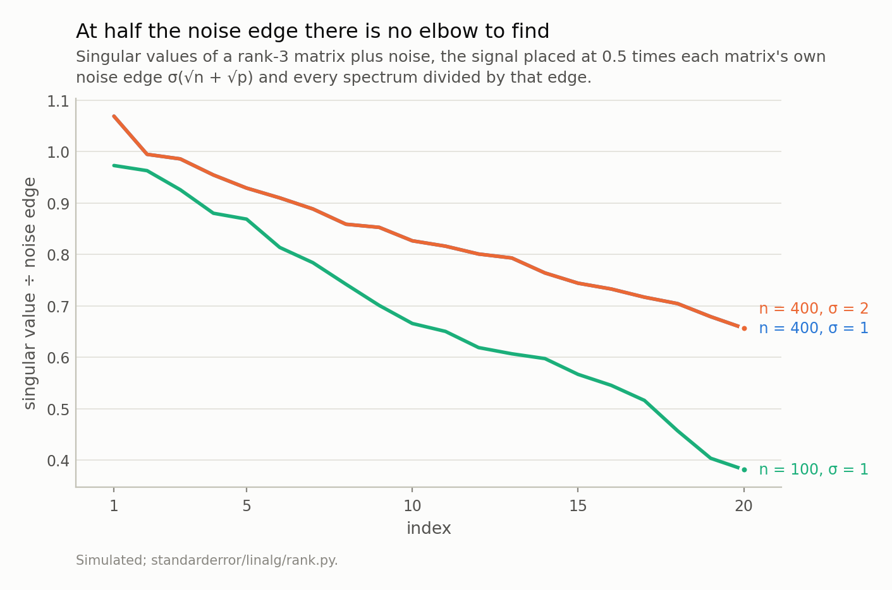
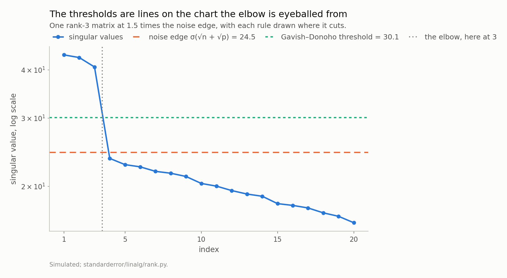
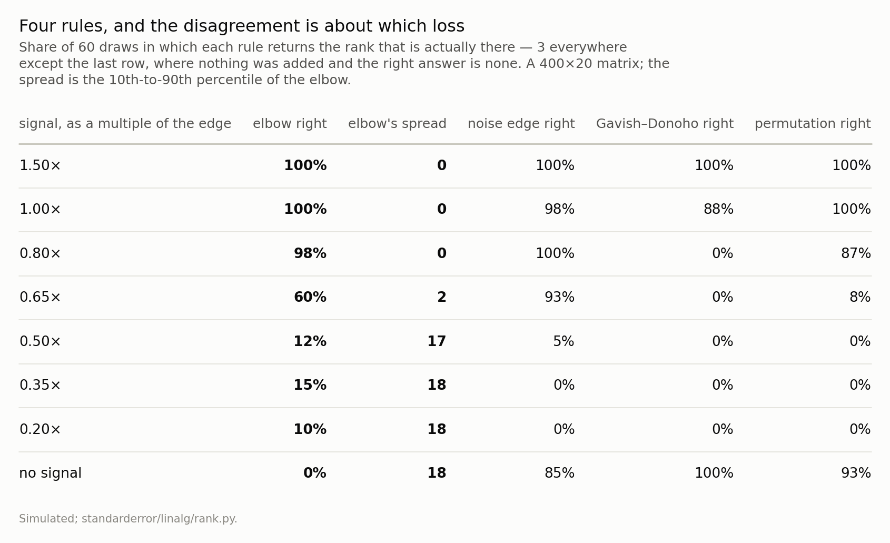
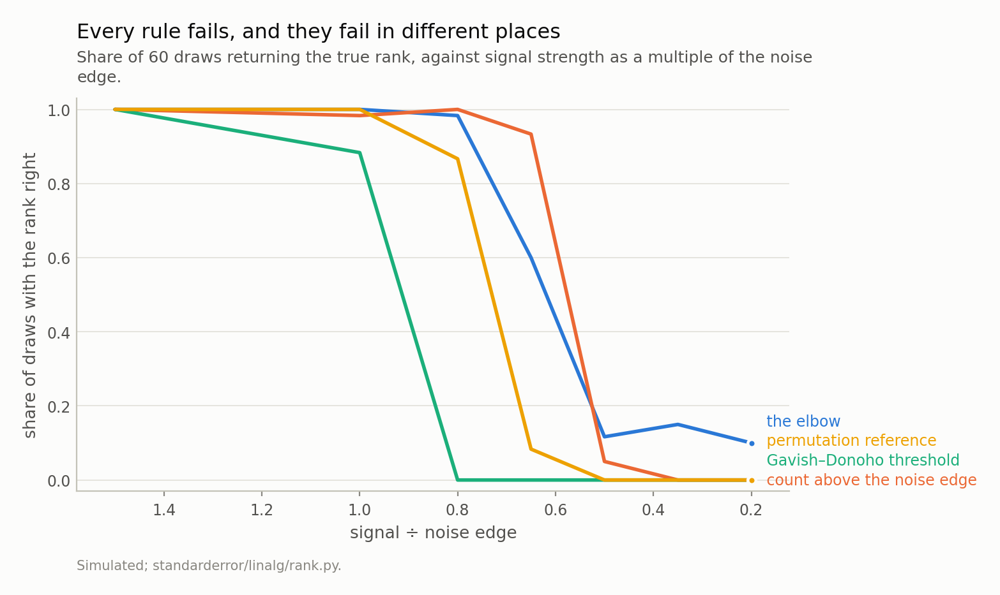
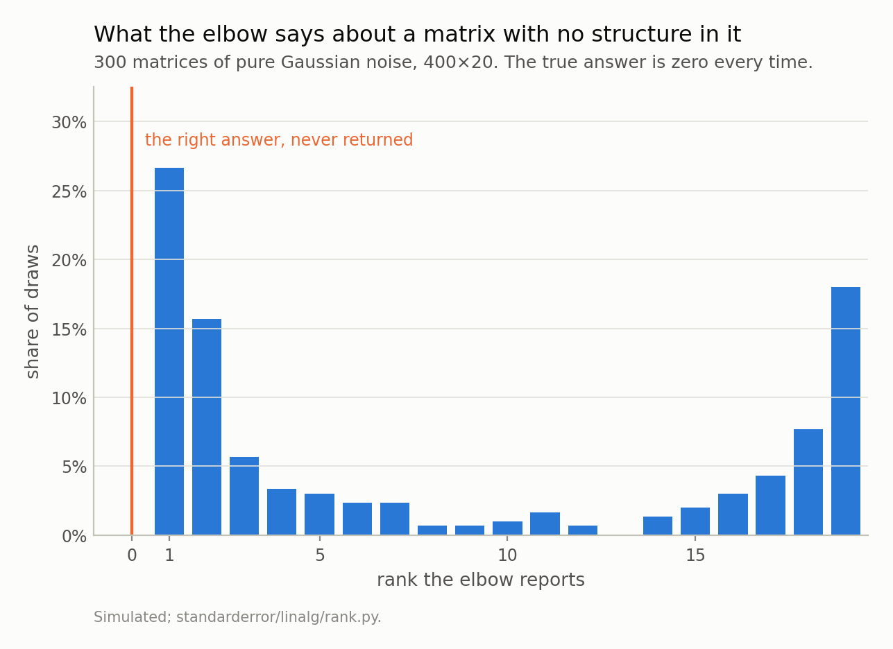

Disclosure: this post was written with the assistance of an AI system (Claude), which wrote the analysis code, ran the experiments and drafted the text. The topic, the constraints, the data choices and the final review are the author's.

*Eckart and Young settled which rank-k matrix is closest to yours — your own truncated SVD — and said nothing about which k. The scree plot fills that gap with a judgement about a shape and no reference distribution, and on a matrix with no structure in it that judgement returns a number every time. Against three calibrated alternatives on matrices whose rank is known in advance: every rule is right when the signal is comfortable, which is why the practice survives; the provably optimal threshold is wrong where the elbow is right, on purpose, because it minimises reconstruction error and not rank; and below about half the noise edge nothing works at all, which is a property of the matrix rather than of the rules. Choosing a rank is a choice of loss function, and the elbow corresponds to none.*

Episode 7 of *Linear Algebra for Data Science, Taught Through What Breaks*. The syllabus and the other episodes: https://jongha-jeon-dev.github.io/standarderror/lectures/

## Last episode's exercise

The exercise was: take a matrix with a genuine rank-3 structure in 20 columns plus noise, pick the elbow of its spectrum, then double the noise and halve the rows and see how much the elbow moves.

Here it is, run 60 times per case instead of once, because a rule you apply by eye to one chart is still a rule and it still has a sampling distribution.

```python
import numpy as np

# Episode six's exercise, made runnable. A rank-3 matrix in 20
# columns, the signal at half the noise edge, and the elbow read off
# 60 times rather than once.
def edge(n, p, sigma):
    return sigma * (np.sqrt(n) + np.sqrt(p))

def elbow(s):                       # "pick the elbow", made precise
    return int(np.argmax(-np.diff(s))) + 1

def draw(n, p, rank, strength, sigma, rng):
    sv = np.full(rank, strength * edge(n, p, sigma))
    U = np.linalg.qr(rng.standard_normal((n, rank)))[0]
    V = np.linalg.qr(rng.standard_normal((p, rank)))[0]
    Y = U @ np.diag(sv) @ V.T + rng.normal(0, sigma, (n, p))
    return np.linalg.svd(Y, compute_uv=False)

cases = [
    ('n = 400, σ = 1', 400, 1.0),
    ('n = 400, σ = 2', 400, 2.0),
    ('n = 100, σ = 1', 100, 1.0),
]

for label, n, sigma in cases:
    rng = np.random.default_rng(51)
    got = np.array([elbow(draw(n, 20, 3, 0.5, sigma, rng))
                    for _ in range(60)])
    exact = (got == 3).mean()
    spread = np.quantile(got, 0.9) - np.quantile(got, 0.1)
    print(f"{label:<12} elbow = 3 in {exact:.0%} of draws, "
          f"10th-90th spread {spread:.1f}")
```

```text
n = 400, σ = 1 elbow = 3 in 13% of draws, 10th-90th spread 17.0
n = 400, σ = 2 elbow = 3 in 13% of draws, 10th-90th spread 17.0
n = 100, σ = 1 elbow = 3 in 15% of draws, 10th-90th spread 11.3
```

Two things in that output, and the second is the more interesting one.

The elbow is right 13% of the time, and when it is wrong it is wrong by a lot: the middle 80% of its answers span 17 of the 19 values available. That is the same rule, on the same generating process, reading the same chart type — and the answer is close to arbitrary.

And the σ = 1 and σ = 2 lines agree to the digit, in both columns. That is not a robustness finding. It is an identity, and seeing why is worth more than the number.



*The rank-3 structure is in all three of these and none of them shows it: the first three values are indistinguishable from the fourth. Two of the curves are the same line, exactly — doubling σ doubles the edge, so the matrix is simply scaled. Reading the elbow off these gives 1 for the 400-row draws and 17 for the 100-row one.*

The signal in that experiment was placed at 0.5 times the noise edge, and the noise edge is proportional to σ. So doubling σ doubles the noise *and* doubles the signal, which means the second matrix is exactly twice the first one:

```python
# Why two of those three lines are identical to the digit: with the
# signal placed at a multiple of the edge, and the edge proportional to
# sigma, the whole matrix scales. The elbow reads a shape.
sv = np.full(3, 0.5 * edge(400, 20, 1.0))
rng = np.random.default_rng(51)
U = np.linalg.qr(rng.standard_normal((400, 3)))[0]
V = np.linalg.qr(rng.standard_normal((20, 3)))[0]
E = rng.normal(0, 1.0, (400, 20))

Y1 = U @ np.diag(sv) @ V.T + E
Y2 = U @ np.diag(2 * sv) @ V.T + 2 * E
print(f"largest difference between Y2 and 2*Y1: {abs(Y2 - 2*Y1).max():.1e}")
```

```text
largest difference between Y2 and 2*Y1: 0.0e+00
```

Not "close to twice" — the same matrix, scaled. And the elbow reads a shape, so it cannot possibly see a difference. Nor can any of the other rules in this episode.

Which means the version of the exercise that changes something is the one where the noise doubles and the signal stays where it was. Do that, and the ratio to the edge halves — from 1.50 to 0.75 — and here is what moves:

The elbow goes from 100% right to 93% right. Barely anything. The Gavish–Donoho threshold, which is the *provably optimal* rule in this episode, goes from 100% to 0%.

So the honest answer to "how much does the elbow move" is: less than you would expect, and less than the rule with a theorem behind it. Halving the rows, meanwhile, does change the shape — 20 columns in 100 rows is a different aspect ratio, not a rescaling — and the elbow's spread narrows from 17.0 to 11.3 while its accuracy barely moves.

That is the shape of the whole episode. The rules disagree, the ranking among them flips depending on where you are, and underneath the accuracy differences is something more basic: they are not all answering the same question.

## What is actually settled

One thing about low-rank approximation is completely settled, and it is worth stating precisely because it is so often stretched into covering the part that is not.

Eckart and Young, 1936. Among all matrices of rank *k*, the one closest to *Y* in Frobenius norm is *Y*'s own truncated SVD, and the error is the tail of the spectrum:

$$
\min_{\mathrm{rank}(B) = k} \| Y - B \|_F \;=\; \sqrt{\sum_{j > k} s_j^2}
$$

Both halves are exact. The minimiser is *U*ₖ diag(*s*ₖ) *V*ₖᵗ and the value is the square root of the sum of the discarded squared singular values — no approximation, no asymptotics, no assumption about where *Y* came from. It is why every low-rank method in use is a truncated factorisation, and it is one of the few results in this series that never breaks.

Checked in the form just stated, on a matrix built for this episode, against 200 competitors per *k* — each one a random *k*-dimensional column space with the least-squares-optimal coefficients for that space, so the competition is the best matrix with *that* subspace rather than a strawman:

At *k* = 1 the truncation error is 100.9733 and the closed form gives 100.9733. At *k* = 3: 81.7617 against 81.7617. At *k* = 8: 64.4679 against 64.4679. Never beaten, 600 attempts, closest margin 8.74.

And now the part the theorem is silent about. It holds for **every** *k*. It ranks nothing. Ask it which *k* to use and it answers, correctly, that larger *k* gives smaller error — all the way to *k* = min(*n*, *p*), where the error is zero and you have reconstructed the noise.

## Four ways to choose k, and only one of them is a picture

So the choice of *k* has to come from somewhere else. Four candidates, and the first is the one everybody actually uses.

**The elbow.** Plot the singular values and pick where the curve bends. To compare it against anything it has to be made precise enough to execute, so: the position of the largest drop, `np.argmax(-np.diff(s)) + 1`. Any other formalisation — largest ratio, largest second difference, largest curvature — has the same property, which is that it is a statement about the shape of one spectrum with nothing to compare it to.

**The noise edge.** Count the singular values above σ(√*n* + √*p*), the almost-sure limit of the largest singular value of a pure-noise matrix of that size.

**Gavish–Donoho.** Count above λ(*p*/*n*) σ √*n*, with λ(1) = 4/√3. Derived, not chosen: it minimises the asymptotic mean squared error of the reconstruction.

**A permutation reference.** Permute each column independently — which preserves every marginal distribution exactly and destroys every relationship between columns — and count the singular values above the permuted spectrum's upper quantile. A reference distribution built out of your own matrix, which is precisely what the scree plot lacks.

```python
# The two calibrated cuts, in full. Neither needs your data.
def gavish_donoho_lambda(beta):
    return np.sqrt(2 * (beta + 1) + 8 * beta
                   / ((beta + 1) + np.sqrt(beta**2 + 14*beta + 1)))

n, p, sigma = 400, 20, 1.0
print(f"noise edge  sigma(sqrt n + sqrt p) = {edge(n, p, sigma):.2f}")
print(f"Gavish-Donoho  lambda(p/n) sigma sqrt n = "
      f"{gavish_donoho_lambda(p/n) * sigma * np.sqrt(n):.2f}")
print(f"lambda(1) = 4/sqrt(3) = {gavish_donoho_lambda(1.0):.4f} "
      f"vs {4/np.sqrt(3):.4f}")
```

```text
noise edge  sigma(sqrt n + sqrt p) = 24.47
Gavish-Donoho  lambda(p/n) sigma sqrt n = 30.13
lambda(1) = 4/sqrt(3) = 2.3094 vs 2.3094
```

Two of those numbers are lines you can draw on the chart you were going to eyeball anyway.



*Two of these are derived from the noise model and one is a judgement about a shape. In this easy case all three agree, which is why the practice survives.*

## Where they part company

60 draws at each of 8 signal strengths, on 400×20 matrices whose rank is 3 before the noise is added. The last row has no signal in it at all, so the rank to recover there is zero.



*Read the last row first: on a matrix with nothing in it the three calibrated rules mostly return no components, which is correct, and the elbow never does. Then read the third row: Gavish–Donoho is wrong where the elbow is right, and it is wrong on purpose.*

Start where the practice lives. At 1.5 times the noise edge every rule returns 3 in every one of 60 draws, and the elbow's spread is 0 — it does not merely get the answer right, it gets the same answer every time. **The scree plot is not wrong in the easy case.** That is why the practice survives, it is why the criticism sounds like pedantry to anyone who has only used it on clean data, and any argument that skips this is not credible.

Now walk down. At 0.8× the edge, the elbow is right 98% of the time and the naive edge count is right 100% of the time — and Gavish–Donoho, the rule with the theorem, is right **0%** of the time. It reports zero components on a matrix with three.

That is not a bug, and it is the single most useful thing in this episode.



*Below about half the noise edge they collapse together, and that is not a failure of the rules: the phase transition is real and the information is not in the matrix. Above it, which rule wins depends entirely on what you were trying to do. The no-signal case is in the table rather than here, because its accuracy is measured against a different answer.*

## The optimal rule is optimal for something else

Gavish–Donoho minimises the mean squared error of the reconstruction. Consider a direction whose true signal is just barely above the noise floor. Keeping it adds its real signal to your reconstruction, and it also adds the noise that came with it, and near the floor the second is larger than the first. So dropping a **real** direction makes the reconstruction **better**. The threshold is doing exactly what it was derived to do.

The two questions are:

*How many directions can I keep before adding them hurts my reconstruction?* — Gavish–Donoho, and it is the right answer.

*How many directions in this matrix are not noise?* — a different question, with a different answer, and the optimal threshold is systematically conservative about it.

Confusing the two is the most common mistake in this area, and it is invited by the word "optimal". If you are denoising an image, compressing a matrix, or filling in missing entries, use the threshold. If you are asking how many factors, how many communities, how many latent dimensions — how many *things are there* — the threshold is answering a question you did not ask, and a permutation reference is answering the one you did.

## And then the floor drops out

Keep walking down. At 0.65× the edge the permutation reference collapses to 8% while the naive edge count is still right 93% of the time — the ranking among the rules has now flipped twice. At 0.5× nothing works: elbow 12%, edge 5%, threshold 0%, permutation 0%.

This one is not the rules' fault. Below a critical signal-to-noise ratio the leading singular vector of the observed matrix carries **no** information about the true one — the phase transition of Baik, Ben Arous and Péché — and no procedure recovers what is not there. A rule that appeared to work in this regime would be reporting an artefact of its own construction.

Which is the useful form of the result: the reason to compute σ(√*n* + √*p*) is not to threshold with it, it is to find out **which regime you are in** before you interpret anything. Signal comfortably above the edge: any rule, and use the cheap one. Signal near the edge: the rules disagree and the disagreement is about your loss function, so decide which one you have. Signal below half the edge: stop, because the question is unanswerable from this matrix and the honest deliverable is a sample-size calculation rather than a rank.

## What only the elbow cannot do

One row of that table is left, and it is the thesis.

Give the rules a matrix of pure Gaussian noise — no structure, nothing to find, the correct answer is *none*.

```python
# The reference distribution the scree plot is missing, built out of your
# own matrix: permute each column on its own, which keeps every marginal
# and destroys every relationship between columns.
def parallel_analysis(Y, rng, reps=30, level=0.95):
    s = np.linalg.svd(Y, compute_uv=False)
    tops = [np.linalg.svd(np.column_stack([rng.permutation(c)
                                           for c in Y.T]),
                          compute_uv=False)[0] for _ in range(reps)]
    return int((s > np.quantile(tops, level)).sum())

rng = np.random.default_rng(51 + 11)
Z = rng.normal(0, 1.0, (400, 20))          # nothing in it at all
print(f"on pure noise: elbow says {elbow(np.linalg.svd(Z, compute_uv=False))}, "
      f"permutation says {parallel_analysis(Z, rng)}")
```

```text
on pure noise: elbow says 6, permutation says 0
```

The permutation reference says zero. So does Gavish–Donoho, in 100% of 60 draws. The naive edge count says zero 85% of the time — it inherits its own false-positive rate, because the edge is where the largest singular value *concentrates* rather than a ceiling it cannot cross, and a finite sample lands above it in 15% of these draws.

The elbow says 6 on that draw. On another it says 1, which is its most common answer, and on another 19, which is the largest value there is — 18 distinct answers across 300 draws, 18% of them that maximum, with a 10th-to-90th spread of 18 out of 19.

Zero never appears, and it cannot: the elbow is defined as the position of the largest gap in a spectrum, and every spectrum has a largest gap. **The rule has no way to express "there is nothing here."** It is not that it is inaccurate on noise. It is that "no components" is outside its range.



*18 different answers, 18% of them the largest value available. Zero is not among them, because the rule has no way to express it: it is defined as the position of the largest gap, and a spectrum always has one.*

There is one more asymmetry in that table worth naming, because it runs the wrong way. Every calibrated rule degrades towards reporting **nothing** as the signal weakens: at a fifth of the edge all three of them return zero components, and the edge count's accuracy is down to 0%. Under-counting is the safe failure — you lose real structure and you know you might have.

The elbow degrades towards **over**-counting, and it gets worse as the signal gets weaker. It returns more than 3 components in 37% of draws at half the edge, 55% at a fifth of it, and 100% of the time on a matrix with nothing in it. The one rule with no reference distribution is also the one whose errors point towards finding structure, and it is the one applied by eye, once, by someone who wants there to be structure.

## What to take away

**Compute σ(√n + √p) before you look at the scree plot.** One line, no data needed beyond the shape and a noise estimate, and it tells you which of the three regimes above you are in. That is worth more than any single rank estimate.

**Draw your thresholds on the plot instead of eyeballing it.** If you are going to look at a spectrum, put the two lines on it. They cost nothing and they turn a judgement into a comparison.

**Pick your rule from your loss.** Reconstructing, denoising or compressing: Gavish–Donoho, and expect it to discard weak real directions on purpose. Counting how many things are there: permute your own columns and use that as the reference. There is no rule that is right for both, because they are different questions.

**Never let the elbow tell you the answer is not zero.** It cannot say zero. If the possibility that your matrix has no low-rank structure matters to your conclusion — and in factor analysis, community detection and "how many regimes are there" it is usually the whole question — the elbow is the one tool that structurally cannot deliver it.

**Report the rank as a decision, not a measurement.** "We kept 3 components" invites the reader to assume 3 was discovered. "We kept the 3 components above a permutation reference at the 95th percentile; the fourth was below it" is the same sentence with its loss function attached.

Which closes the columns half of this series. Seven episodes on *X*: what conditioning is, what it does to a fit, what a penalty buys, what one row can do, and now how many directions are in there. Every one of them has been a linear model — a fit obtained by solving a linear system once, in closed form, where the answer either exists or the matrix tells you why not.

The last episode gives that up. Logistic regression has no closed form, so the coefficients are found by iterating, and the iteration is Newton's method on the log-likelihood dressed up as a weighted least squares problem — the same *X*ᵗ*WX* you already know, with the weights recomputed each pass. Which means every conditioning problem in this series is still there, plus a new one that is worse: the fit can fail to exist at all, the software will not tell you, and the coefficient it reports will look like the most significant result in your table. Next episode, and the last.

*Exercise.* Take any dataset you have used PCA on and kept some number of components from. Compute σ(√*n* + √*p*) for it, using the smallest singular value as a rough noise scale, and see where your chosen cut sits relative to that line. Then permute each column independently, twenty times, and record the largest singular value each time. How many of your components are above the 95th percentile of those twenty numbers? If the answer differs from the number you kept, the difference is your loss function, and it is worth being able to name it.

---

### Data

- No external data. Every matrix here is constructed with its rank fixed before the noise is added, and every number is produced by the code shown, executed when this page was built.
- Machinery: `standarderror/linalg/rank.py`, tested in `tests/test_rank.py`.
- Where this stops: Eckart and Young, "The approximation of one matrix by another of lower rank", *Psychometrika* 1 (1936); Gavish and Donoho, "The optimal hard threshold for singular values is 4/√3", *IEEE Transactions on Information Theory* 60 (2014); Horn, "A rationale and test for the number of factors in factor analysis", *Psychometrika* 30 (1965); Baik, Ben Arous and Péché, "Phase transition of the largest eigenvalue for non-null complex sample covariance matrices", *Annals of Probability* 33 (2005), for the transition below which the signal is undetectable in principle.

### Reproducibility

- **environment**: standarderror=0.1.0, python=3.11.15, numpy=2.4.4
- **code blocks**: executed at build time; the values the prose quotes are pinned, so drift fails the build
- **simulation**: 400×20 matrices of known rank 3; 60 draws per point in the sweep, 300 for the pure-noise histogram
- **determinism**: one seed, 51, and every draw derived from it

Code: <https://github.com/jongha-jeon-dev/standarderror>
