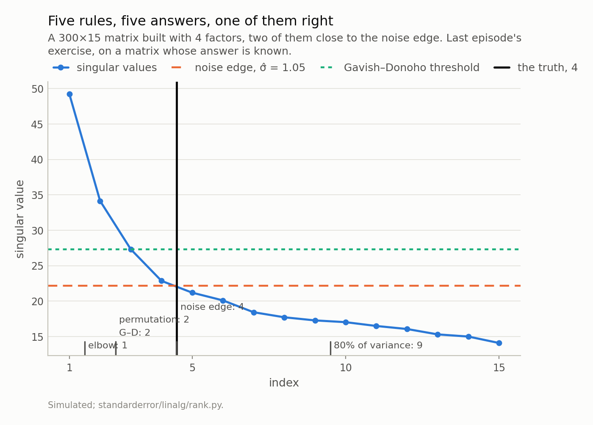
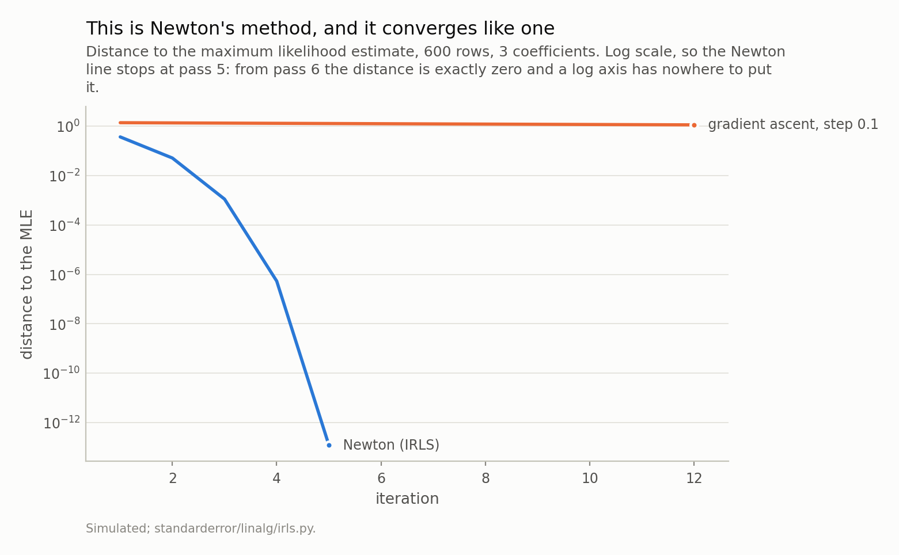
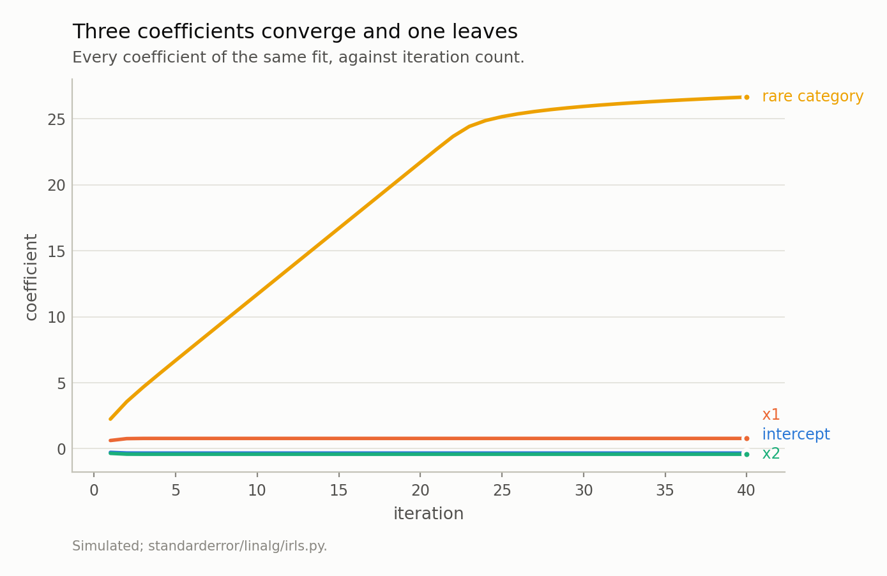
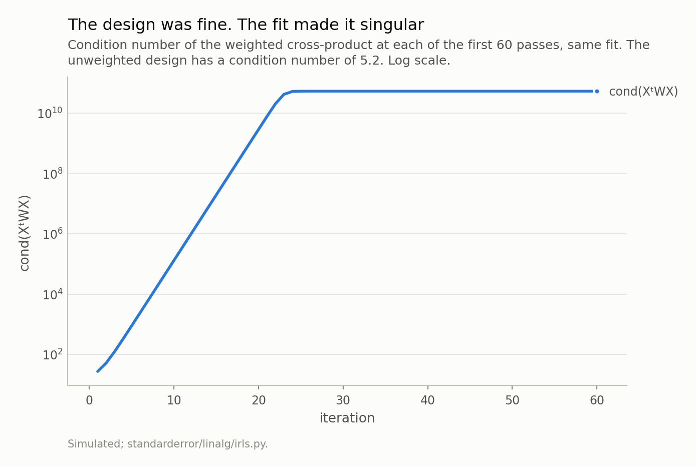
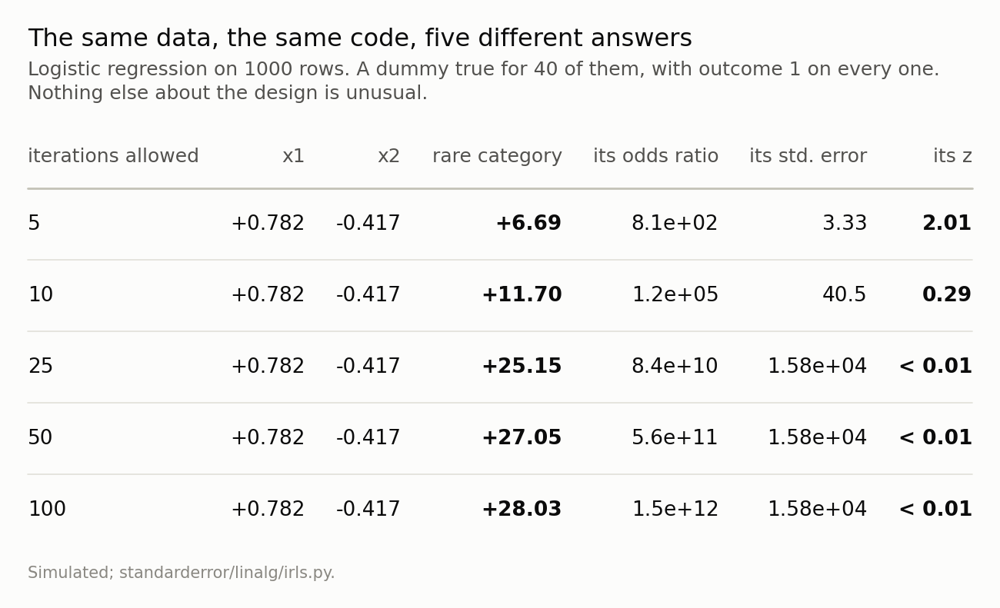
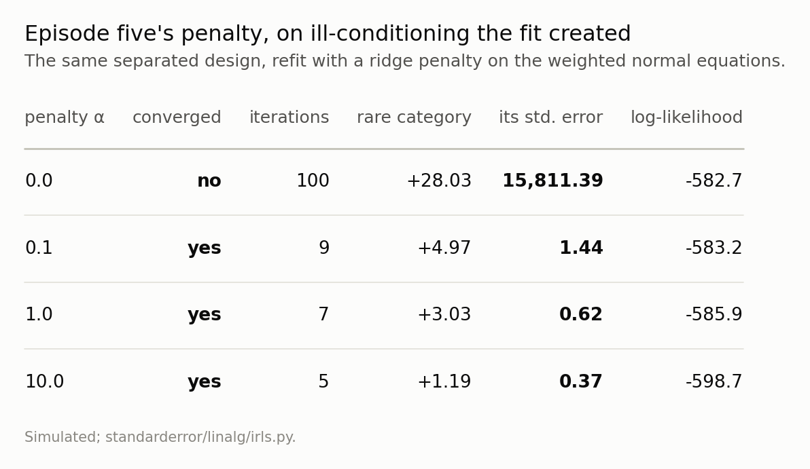

Disclosure: this post was written with the assistance of an AI system (Claude), which wrote the analysis code, ran the experiments and drafted the text. The topic, the constraints, the data choices and the final review are the author's.

*Logistic regression has no closed form, so it is iterated, and the iteration is exactly the weighted least squares of the previous seven episodes: Newton's method on the log-likelihood is a reweighted normal-equations solve, and it converges quadratically when there is something to converge to. When a category is perfectly predictive there is not. The maximum likelihood estimate does not exist, no software raises, and the number returned is the iteration count — measured here growing by exactly 1 per pass while the weighted design's condition number grows by exactly a factor of e. The textbook test for this detects complete separation, which is not the case that ships; the case that ships is a rare dummy with one outcome, and it is caught by looking for an empty cell rather than by watching the optimiser.*

Episode 8 of *Linear Algebra for Data Science, Taught Through What Breaks*. The syllabus and the other episodes: https://jongha-jeon-dev.github.io/standarderror/lectures/

## Last episode's exercise

The exercise was to take a matrix you had run PCA on, compute σ(√*n* + √*p*) using the smallest singular value as a noise scale, build a permutation reference, and compare both against the number of components you had kept.

Your matrix will give its own answer. Here is the same procedure on one where the answer is known before the noise goes in: 300×15, 4 factors, two of them placed close to the noise edge — which is where episode seven said the rules stop agreeing.

The noise scale first, because the exercise glossed it. The smallest singular value of a noise matrix concentrates at σ(√*n* − √*p*), the *lower* edge of the bulk, so dividing by that recovers σ. Here it gives σ̂ = 1.047, against a true σ of 1. Close enough to use.

Then the five verdicts.



*The elbow says 1, Gavish–Donoho 2, a permutation reference 2, the noise edge 4, and the convention everybody actually uses — keep 80% of the variance — says 9. The truth is 4. Note which one is off by a factor of two, and which one is not on this chart at all in most papers.*

The elbow says 1. Gavish–Donoho says 2, and so does the permutation reference, which is episode seven's phase-transition result arriving on schedule: two of the four factors are below the edge and are not recoverable. Counting above the noise edge says 4, which is correct, and is correct partly by luck — that rule over-counts, and here the over-count lands on the truth.

And the convention that gets used more than all four of these combined — keep enough components to explain 80% of the variance — says 9. More than double the truth. At 90% it says 12, which is 12/15 of the columns you started with.

That rule is worth one more sentence, because it is the default in most software and most papers. It has no noise model in it at all. It asks how much of the sum of squared singular values you have captured, and in a 300×15 matrix the noise contributes a large and predictable share of that sum — so "80% of the variance" is mostly a statement about the shape of your matrix, and it will hand you a large number of components whether or not any of them mean anything.

Which is a good place to end the columns half of this series, and start the last episode.

## Every fit so far had a formula. This one does not

Seven episodes, every one of them about *X*ᵗ*X* — its condition number, its inverse, its spectrum, its diagonal, its rank. And every fit obtained by solving a linear system once. The answer existed, or the matrix told you why not.

Logistic regression breaks that. The log-likelihood is

$$
\ell(\beta) \;=\; \sum_i \left[ y_i \, x_i^{\top}\beta - \log\!\left(1 + e^{x_i^{\top}\beta}\right) \right]
$$

and setting its gradient to zero gives *X*ᵗ(*y* − *p*) = 0 where *p* depends on β. Non-linear. No formula.

So it is iterated. And the iteration is not a new piece of machinery — it is the old one, applied repeatedly. Newton's method needs the Hessian, which here is −*X*ᵗ*WX* with *W* = diag(*p*(1 − *p*)), and one Newton step written out is

$$
\beta_{\text{new}} \;=\; \left(X^{\top} W X\right)^{-1} X^{\top} W z, \qquad z \;=\; X\beta + W^{-1}(y - p)
$$

which is a weighted least squares fit of a *working response* `z` on the same *X*. That is the whole algorithm. Iteratively reweighted least squares, and it is Newton's method wearing episode one's clothes.

```python
import numpy as np

def sigmoid(eta):
    # Split at zero so neither branch overflows. It matters below.
    out = np.empty_like(eta)
    pos = eta >= 0
    out[pos] = 1 / (1 + np.exp(-eta[pos]))
    e = np.exp(eta[~pos])
    out[~pos] = e / (1 + e)
    return out

def irls(X, y, max_iter=50, tol=1e-10, floor=1e-10):
    beta = np.zeros(X.shape[1])
    for it in range(1, max_iter + 1):
        eta = X @ beta
        mu = sigmoid(eta)
        w = np.maximum(mu * (1 - mu), floor)     # the weights
        z = eta + (y - mu) / w                   # the working response
        sw = np.sqrt(w)
        step = np.linalg.lstsq(X * sw[:, None], sw * z, rcond=None)[0]
        if np.max(np.abs(step - beta)) < tol:
            return step, it, True
        beta = step
    return beta, max_iter, False

# An ordinary design: 4000 rows, an intercept and two columns.
rng = np.random.default_rng(7)
n = 4000
X = np.column_stack([np.ones(n), rng.standard_normal(n),
                     rng.standard_normal(n)])
truth = np.array([-0.5, 1.0, -0.8])
y = (rng.random(n) < sigmoid(X @ truth)).astype(float)

beta, iters, ok = irls(X, y)
print(f"converged: {ok} in {iters} passes")
print("true  ", np.round(truth, 3))
print("fitted", np.round(beta, 3))
```

```text
converged: True in 6 passes
true   [-0.5  1.  -0.8]
fitted [-0.518  0.977 -0.776]
```

12 lines, 6 passes, and the coefficients come back. Note what is not in there: no learning rate, no schedule, no tolerance to tune beyond a machine-epsilon stopping rule. Newton's method does not need any of that, and the reason is the rate.



*Each Newton error is roughly the square of the last, which is what makes the reweighting worth doing. The gradient line is a fixed step size and therefore a weak opponent — it is here to show what having the Hessian buys, not to argue against first-order methods.*

Quadratic convergence, on a chart: 0.363, then 0.0508, then 1.11e-03, then 5.3e-07, then 1.2e-13 — and at the pass after that, exactly zero, because the step returns the same coefficients bit for bit. Each of those is about the square of the one before (5.3e-07 squared is 2.9e-13, against a measured 1.2e-13), which is the definition of quadratic convergence. It is why nobody fits a GLM with gradient descent. The comparison line is a fixed step of 0.1 and is therefore a weak opponent by construction — after 12 steps it is still 1.12 away — but the point is not that first-order methods fail. It is that when you have the Hessian and it is a cross-product matrix you can invert, you should use it.

Everything above is the case that works. Now the one that does not.

## When the maximum does not exist

Change one thing about the design. Add a dummy variable that is true for 40 rows out of 1000, and let every one of those rows have outcome 1.

That is not a contrived design. It is a rare category — a product, a branch, a diagnosis code, a fraud flag — that happens to be perfectly predictive in the sample you have. Nothing about it looks wrong in a data audit: the column has 40 ones, the outcome rate overall is 46%, no value is missing, no column is a duplicate of another.

```python
# Now change one thing. A dummy true for 40 rows out of
# 1000, and every row where it is true has outcome 1. Nothing else
# about this design is unusual, and nothing about it is rare in practice.
rng = np.random.default_rng(11)
n = 1000
k = max(round(n * 0.04), 2)
d = np.zeros(n); d[rng.choice(n, k, replace=False)] = 1.0
x1, x2 = rng.standard_normal(n), rng.standard_normal(n)
y = (rng.random(n) < sigmoid(-0.3 + 0.8 * x1 - 0.5 * x2)).astype(float)
y[d > 0.5] = 1.0
X = np.column_stack([np.ones(n), x1, x2, d])

for m in (5, 25, 100):
    beta, iters, ok = irls(X, y, max_iter=m)
    print(f"max_iter={m:>4}  converged={str(ok):<5}  "
          f"x1={beta[1]:+.3f}  x2={beta[2]:+.3f}  "
          f"dummy={beta[3]:+.2f}")
```

```text
max_iter=   5  converged=False  x1=+0.782  x2=-0.417  dummy=+6.69
max_iter=  25  converged=False  x1=+0.782  x2=-0.417  dummy=+25.15
max_iter= 100  converged=False  x1=+0.782  x2=-0.417  dummy=+28.03
```

Three things in that output.

`converged=False` every time, including at 100 passes. The coefficient on the dummy is 6.69 at five passes, 28.03 at a hundred, and it was still rising when I stopped it at 300.

And `x1` and `x2` do not move. Not "barely move" — identical to three decimal places across a twentyfold change in the iteration limit. Whatever is wrong is confined to one coefficient, and the rest of the table is exactly as trustworthy as it would be without the problem.

That is what makes this the dangerous version. There is a textbook case — *complete* separation, where a hyperplane separates the classes outright — and it is easy to detect and easy to notice, because every coefficient blows up together. On the completely separated design in the code, the largest coefficient runs 11 → 689 → 855 as the limit is raised, and every fitted probability is at 0 or 1. Nobody ships that table.

This one is not that. There is no separating hyperplane here — I checked, with a linear program, and the answer is no, because the rows where the dummy is false contain both outcomes. The standard test for the standard problem does not fire.

## Why it never stops, and at what rate

The likelihood has no maximum in that direction. Making the dummy's coefficient larger always makes the fit better, because the 40 rows it applies to are all 1 and pushing their fitted probability closer to 1 always raises the likelihood. There is a supremum and it is never attained. The MLE does not exist — that is a statement about the model and the data, not about the optimiser.

What the optimiser does about it is measurable, and it is tidier than I expected.



*The straight part is the tell, and it is straight for a reason: Newton's step on a likelihood with no maximum settles at a constant, and here that constant is 1.000 per pass, which makes the coefficient a restatement of the iteration count. It stays straight to pass 19, where the library's weight floor takes over and the growth turns logarithmic. That bend is what gets read as convergence. It is not: at pass 300 the step is still 0.0036 and still positive.*

Newton's step in that direction settles at a **constant**, and the constant is 1.000. So the coefficient after *t* passes is *t* plus a constant, until something intervenes. The coefficient *is* the iteration count.

And the second measurement follows from the first. A row whose fitted probability is near 1 has weight *p*(1 − *p*) ≈ e^(−|η|), and |η| is rising by 1 each pass, so every weight in that category divides by e each pass, and so does the smallest eigenvalue of *X*ᵗ*WX*.



*A straight line on a log axis is geometric growth, and the ratio is 2.718 per pass — e, which follows from the coefficient rising by 1 each pass and a saturated row's weight going like exp(−|η|). The flat part is not convergence; the paragraph below says what it is.*

The unweighted design has a condition number of about 5. The weighted one reaches 5×10¹⁰, on the same data, because the weights are produced by the fit rather than brought by the data. Episode two spent an entire episode on designs whose conditioning was bad on arrival; this one starts perfect and is destroyed by the fitting procedure.

The flat part of that line is not convergence. It is the weight floor — every library applies one, to stop *X*ᵗ*WX* becoming exactly singular — and past pass 19 the floor is what is being reported rather than the data. The coefficient keeps moving there: at pass 300 the step is still 0.0036, and still positive. A coefficient path that flattens out is the single most convincing false signal in this whole episode, because flattening is what convergence looks like.

## The standard error is not about your data

Which brings us to the number that decides whether any of this reaches a conclusion. The reported standard error is the square root of a diagonal entry of (*X*ᵗ*WX*)⁻¹, and under saturation every weight in that category is pinned at the floor. So the arithmetic is not subtle:

```python
# And the standard error the table reports for it. Every weight in that
# category is pinned at the library's floor, so X'WX contributes
# k * floor in that direction and the inverse gives 1/sqrt(k * floor).
for floor in [1e-08, 1e-10, 1e-12]:
    beta, _, _ = irls(X, y, max_iter=100, floor=floor)
    mu = sigmoid(X @ beta)
    w = np.maximum(mu * (1 - mu), floor)
    se = np.sqrt(np.diag(np.linalg.inv(X.T @ (X * w[:, None]))))
    print(f"floor={floor:.0e}  coef={beta[3]:6.2f}  "
          f"reported s.e.={se[3]:11,.2f}  "
          f"1/sqrt(k*floor)={1/np.sqrt(k*floor):11,.2f}")
```

```text
floor=1e-08  coef= 23.48  reported s.e.=   1,581.14  1/sqrt(k*floor)=   1,581.14
floor=1e-10  coef= 28.03  reported s.e.=  15,811.39  1/sqrt(k*floor)=  15,811.39
floor=1e-12  coef= 32.57  reported s.e.= 158,113.88  1/sqrt(k*floor)= 158,113.88
```

The reported standard error equals 1/√(*k* × floor) to every digit printed, where *k* is the number of rows in the category and the floor is a constant chosen by whoever wrote the library. Change the floor by two orders of magnitude and the standard error changes by one. **There is no information from the data in that number.**

Now put it next to the coefficient, and read down the table.



*x1 and x2 do not move at all — to three decimal places, across a twentyfold change in the iteration limit. The rare category's coefficient never stops growing, and its z statistic crosses 2 on the way down. At five iterations it is a significant finding. At twenty-five it is nothing. There is no fact of the matter.*

At five passes: coefficient +6.69, standard error 3.33, z = 2.01. That is *p* = 0.044. A significant finding, with an odds ratio of 806, ready to write up.

At ten passes: z = 0.29. At a hundred: z = 0.0018. Nothing at all.

Same data. Same code. Same model. The p-value is a function of `max_iter`, and `max_iter` is a default nobody looked at:

```python
# The number that decided the p-value, read out of the library rather
# than remembered. scikit-learn is a dependency of this project, so this
# runs when the page is built.
import inspect
import sklearn
from sklearn.linear_model import LogisticRegression

default = inspect.signature(LogisticRegression).parameters["max_iter"]
print(f"scikit-learn {sklearn.__version__}: "
      f"LogisticRegression(max_iter={default.default})")
```

```text
scikit-learn 1.8.0: LogisticRegression(max_iter=100)
```

Libraries pick different numbers, and they pair them with different stopping criteria, so the same model on the same data can land on either side of 0.05 depending on which package you imported. None of those numbers is a statement about your data.

The direction is worth noticing too, because it is the opposite of the intuition. Under-iterating makes separation look *significant*; iterating properly makes it look like noise. So the failure is not "the software crashed" or even "the coefficient is huge" — it is a plausible odds ratio with a plausible p-value that came out of a fit with no answer in it.

## What to do instead

**Check for empty cells before you fit.** Not convergence warnings — those come too late and are routinely suppressed. For every categorical level and every binary column, cross-tabulate against the outcome and look for a zero:

```python
# The check that finds it, and it is not a convergence check. A 2x2 table
# with an empty cell: one level of a binary column with only one outcome.
for j in range(X.shape[1]):
    col = X[:, j]
    levels = np.unique(col)
    if len(levels) != 2:
        continue
    for lv in levels:
        rows = col == lv
        if rows.any() and len(np.unique(y[rows])) == 1:
            print(f"column {j}: {int(rows.sum())} rows at value {lv:g}, "
                  f"all with y = {y[rows][0]:g} "
                  f"-> this coefficient has no maximum")
```

```text
column 3: 40 rows at value 1, all with y = 1 -> this coefficient has no maximum
```

11 lines, and no model in them. It found the problem in this design, and the linear-programming test for complete separation did not, because complete separation is the wrong thing to test for.

**Check whether the fit converged.** Some APIs return a flag; `scikit-learn` raises a `ConvergenceWarning` and exposes `n_iter_`, which you compare against `max_iter` yourself. Either way it is one line, and almost no analysis pipeline has it. A coefficient from a fit that hit its iteration limit is not an estimate.

**Then choose a fix, knowingly.** There are three, and they are different claims:

*Penalise.* Add a ridge term to the weighted normal equations, which is episode five applied to ill-conditioning the fit created rather than ill-conditioning the design brought.



*Any penalty at all makes the maximum exist, so the fit converges in single digits and the standard error becomes a number about the data again. What it costs is in the last column.*

Any penalty at all makes the maximum exist, and the cost is visible: at α = 0.1 the coefficient is 4.97 with a standard error of 1.44 — a real one — and the log-likelihood falls from -582.7 to -583.2. Half a unit of likelihood for an estimate that exists. But α is now a choice you have to defend, and the coefficient depends on it: 4.97 at α = 0.1, 1.19 at α = 10.

*Use Firth's penalty instead.* It adds ½ log det(*X*ᵗ*WX*) to the log-likelihood, which guarantees finite estimates and — unlike a ridge term — removes the first-order bias rather than adding shrinkage you have to justify. It is the standard answer in the literature for exactly this case, and it has one parameter fewer than a choice of α.

*Or report the category, not a coefficient.* "All 40 rows in this category had the outcome" is a complete and honest description of what the data contains. It is a stronger statement than any odds ratio, and it does not require a model that has no maximum.

The one option that is not available is the one that happens by default: fit it, read the coefficient table, and move on.

## The series, in one page

Eight episodes, and one idea underneath all of them: the linear algebra is not a preliminary to the statistics. It is where the statistics either works or quietly does not.

**Episode 1.** A residual at machine precision does not mean the answer is right. The condition number is the error bar on a solve, and it is a property of the matrix you can compute before you trust anything the solver returns.

**Episode 2.** The closed form in every textbook, β̂ = (*X*ᵗ*X*)⁻¹*X*ᵗ*y*, is a correct formula and a bad algorithm: κ(*X*ᵗ*X*) = κ(*X*)², so forming the cross-product throws away half your digits. QR and SVD do not, and they are one line each.

**Episode 3.** A covariance matrix estimated entry by entry is not guaranteed to be a covariance matrix. Three individually defensible correlations produced a portfolio with a variance of −0.11, because positive definiteness is a joint property and pairwise estimation does not know about it.

**Episode 4.** Two nearly equal eigenvalues make their eigenvectors undetermined. What governs the stability of a principal component is its distance to its *neighbour*, not the share of variance it explains, and a bootstrap will understate the problem because it centres on its own arbitrary axis.

**Episode 5.** Ridge regression is a per-direction multiplier `s²/(s² + α)` on the singular values. That is the whole mechanism. It also explains why every VIF can read 1.00 on a design with a condition number near a billion, and why a nominal 95% interval covered 34%.

**Episode 6.** The leverages sum to *p*, so a single row can take a whole unit of it, and a row at leverage 1 has a residual of exactly zero — invisible to every diagnostic built on residuals. Leverage is not influence; influence needs *y*.

**Episode 7.** Eckart and Young settled which rank-*k* matrix is closest to yours and said nothing about *k*. Choosing a rank is choosing a loss function, and the elbow corresponds to none — it cannot even return zero.

**Episode 8.** When there is no closed form the fit is iterated, the iteration is still weighted least squares, and the weights are now something the fit produces. So the conditioning can be created by the procedure, and the failure mode is a coefficient whose value is the number of passes you allowed.

The thread: in each case the number the software returned was fine, and the meaning attached to it was not. None of these are bugs. Every one of them is a piece of linear algebra that the statistical vocabulary — significance, variance explained, influence, convergence — does not have a word for.

*Thank you for reading the series.* The code for all eight episodes is in the repository, tests included; the tests are where the findings actually live, because each one is a claim that was measured before it was written down, and several of them replaced a first draft that was wrong.

---

### Data

- No external data. Every design here is constructed in the episode and every number is produced by the code shown, executed when this page was built.
- Machinery: `standarderror/linalg/irls.py`, tested in `tests/test_irls.py`.
- Where this stops: Nelder and Wedderburn, "Generalized linear models", *JRSS A* 135 (1972), for the IRLS formulation; Albert and Anderson, "On the existence of maximum likelihood estimates in logistic regression models", *Biometrika* 71 (1984), for the existence conditions; Firth, "Bias reduction of maximum likelihood estimates", *Biometrika* 80 (1993), and Heinze and Schemper, "A solution to the problem of separation in logistic regression", *Statistics in Medicine* 21 (2002), for what to do about it.

### Reproducibility

- **environment**: standarderror=0.1.0, python=3.11.15, numpy=2.4.4
- **code blocks**: executed at build time; the values the prose quotes are pinned, so drift fails the build
- **simulation**: 4000 rows for the well-posed fit, 1000 for the separated one, 200 for the completely separated one; no observation is placed by hand
- **determinism**: one seed per design, each stated in the code shown

Code: <https://github.com/jongha-jeon-dev/standarderror>
