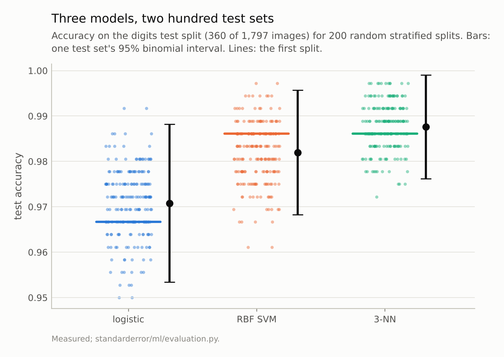
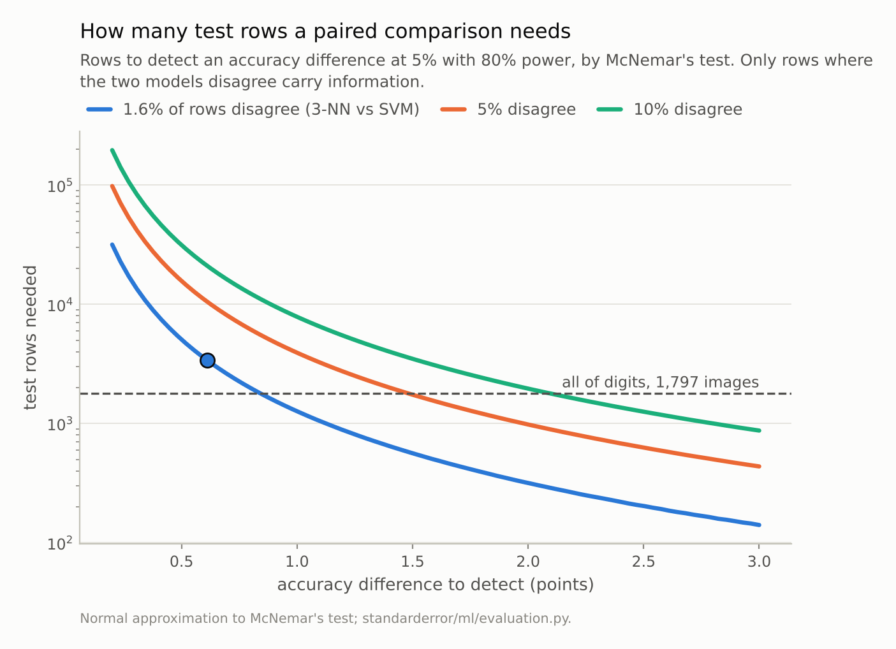
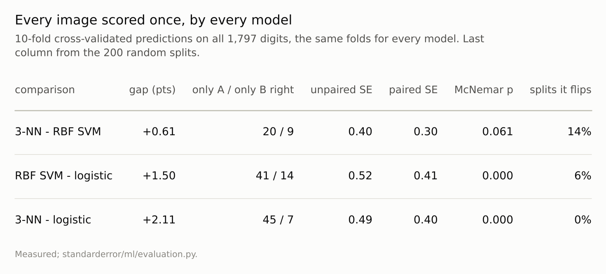

Disclosure: this post was written with the assistance of an AI system (Claude), which wrote the analysis code, ran the experiments and drafted the text. The topic, the constraints, the data choices and the final review are the author's.

*On a 20% test split of the UCI digits, 360 images, logistic regression, an RBF SVM and 3-NN score 0.967, 0.986 and 0.986, and one test set's 95% binomial interval is about +-0.014. Over 200 random splits the SVM and 3-NN swap places 14% of the time. The repeated splits' spread matches test-set noise with a finite-population correction - it measures the pool, not the training sets. Scored on the same rows, every image once, 3-NN beats the SVM by 0.6 points with McNemar p = 0.06; settling a gap that size needs about 3,381 images, and the dataset has 1,797.*

Episode 1 of *Machine Learning, Taught Through What Breaks*. The syllabus and the other episodes: https://jongha-jeon-dev.github.io/standarderror/lectures/

## One split, three models

This series takes one sentence from the standard machine-learning curriculum per episode and measures where it stops being true. Thirty of them, from evaluation through linear models, trees, explanation, training networks and what generalisation looks like in them. The first sentence is the one every other episode leans on: *the model with the higher test score is the better model.*

The rules are the same throughout. Every number is measured by code in the repository and pinned by a test, so a claim that drifts fails the build. The data is either bundled with scikit-learn or simulated with a known answer, so anyone can rebuild it offline. And when a measurement contradicts the sentence I set out to illustrate — it happened twice in the last series — the episode says so rather than quietly changing the question.

Here is the most ordinary experiment there is. Three classifiers on the UCI handwritten digits, one stratified 80/20 split.

```python
from sklearn.model_selection import train_test_split
from standarderror.ml import evaluation as ev

X, y = ev.digits()
Xtr, Xte, ytr, yte = train_test_split(X, y, test_size=0.2,
                                      random_state=0, stratify=y)
for name, make in ev.models().items():
    acc = (make().fit(Xtr, ytr).predict(Xte) == yte).mean()
    print(f"{name:9s} {acc:.4f}  +- {1.96 * ev.binomial_se(acc, len(yte)):.4f}")
```

```text
logistic  0.9667  +- 0.0185
RBF SVM   0.9861  +- 0.0121
3-NN      0.9861  +- 0.0121
```

Read the usual way, the SVM beats logistic regression by 1.9 points and ties 3-NN exactly. The numbers after the +- are the 95% binomial interval for each score: a test accuracy is a proportion measured on 360 images, and its standard error is sqrt(p(1 - p)/n). At 98% that is 0.0070, so the interval is about 1.4 points either way — wider than the gap between the top two models, and not much narrower than the gap between the top and the bottom.

## Repeat the split, and check what you measured

The usual response to "one split is noisy" is to repeat it. Two hundred stratified splits:

```python
sp = ev.split_scores(X, y, splits=200)
cvc = ev.cv_correct(X, y)
for name, acc in sp["accuracy"].items():
    p = acc.mean()
    print(f"{name:9s} SD {acc.std(ddof=1):.4f}  "
          f"binomial {ev.binomial_se(p, 360):.4f}  "
          f"pool {ev.pool_se(p, 360, len(y)):.4f}  "
          f"fixed model {ev.subset_sd(cvc[name], 360):.4f}")
```

```text
logistic  SD 0.0079  binomial 0.0089  pool 0.0079  fixed model 0.0084
RBF SVM   SD 0.0069  binomial 0.0070  pool 0.0063  fixed model 0.0063
3-NN      SD 0.0053  binomial 0.0058  pool 0.0052  fixed model 0.0051
```

The columns are the standard deviation of accuracy over the 200 splits, the binomial standard error of one 360-image test set, the same with a finite-population correction, and a control explained below. The spread over splits, 0.0069 for the SVM, is close to the binomial standard error of 0.0070 — slightly *below* it, for every model. That is the first sign the repetition is measuring something narrower than it looks.

Two hundred splits of one pool of 1,797 images do not draw two hundred fresh test sets. They draw 360-image subsets of the same images, so the finite-population correction applies: the variance of a subset mean is smaller by (N - n)/(N - 1). With it, the predicted spread is 0.0063. The last column is the control that settles what the spread is made of: fix each image's right-or-wrong from one cross-validated run, so the model never changes, and draw random 360-image subsets. That spread, 0.0063 for the SVM, is the pure test-set noise with the training set held still, and it accounts for most of the repeated-split spread. The share of variance left over for retraining on different data is -15% for logistic regression, 15% for the SVM and 8% for 3-NN — a negative share meaning the control alone is already a little wider than the measured spread.

So repeating the split re-measures the test-set noise of *this* pool, slightly understated, and almost none of the variation from training on different data. It does not tell you how the score would move on a new sample of digits; the binomial standard error of one test set is the better answer to that. What the repetition does show plainly is the ranking: the SVM and 3-NN trade places in 14% of the 200 splits.



*The clouds overlap. One test set's 95% interval is about **+-0.014**, wider than the gap between the SVM and 3-NN, which swap places in 14% of splits.*

## Compare on the same rows

The error bars above treat each model's score as an independent measurement, and they are not. Two good classifiers fail on mostly the same hard images, so on a shared test set their errors are correlated, and the difference between them is less noisy than either score. A paired comparison uses that. Only the images where the models *disagree* carry information about which is better; McNemar's test is the exact test on those.

To use every image, score each one once with 10-fold cross-validation, on the same folds for all three models.

```python
r = ev.paired(cvc["3-NN"], cvc["RBF SVM"])
print(f"3-NN - SVM on all {r['n']:,} images: {r['difference']:+.4f}")
print(f"right only for 3-NN: {r['only_a']}   only for SVM: {r['only_b']}")
print(f"SE unpaired {r['unpaired_se']:.4f}   paired {r['paired_se']:.4f}"
      f"   McNemar p = {r['p_value']:.3f}")
print(f"rows needed: {ev.rows_needed(abs(r['difference']), r['discordance']):,}")
```

```text
3-NN - SVM on all 1,797 images: +0.0061
right only for 3-NN: 20   only for SVM: 9
SE unpaired 0.0040   paired 0.0030   McNemar p = 0.061
rows needed: 3,381
```

On 1,797 images, 3-NN is right on 20 that the SVM gets wrong, and the SVM on 9 that 3-NN gets wrong. Pairing takes the standard error of the difference from 0.0040 to 0.0030: when only a fraction d of rows disagree, the per-row difference is zero almost everywhere, and its variance is close to d rather than the sum of the two models' error variances. The gap is 0.6 points and McNemar's p is 0.06: suggestive, not settled, on every image the dataset has.

How many would settle it? With 1.6% of images in disagreement, detecting a 0.6-point difference at the 5% level with 80% power takes about **3,381 images** — 1.9 times the dataset. The SVM's 1.5-point lead over logistic regression, by contrast, is decisive (p < 0.001). Some comparisons this data can answer. The one at the top of the leaderboard is not one of them.



*The measured gap, 0.6% with 1.6% of rows in disagreement, needs **3,381 rows**. The whole dataset is 1,797.*



*Pairing cuts the standard error because two good models fail on mostly the same images. It is still not enough to separate the top two.*

## Where this breaks

**The binomial error bar assumes independent test rows.** If test rows share a source — several digits from one writer, several frames of one video, several sentences of one document — the effective sample is smaller and the error bar wider. The uncertainty series measured that effect for conformal coverage; it applies to accuracy unchanged.

**The pool-corrected spread is not wrong, it is a different quantity.** If the question is how much this particular dataset's split could move the score, the repeated splits answer it. If the question is how the model would do on new data, they understate it, and they say almost nothing about the training-set component.

**The required-rows formula is an approximation.** It is the normal approximation to McNemar's test with the disagreement rate taken as known. At small disagreement counts it is optimistic; it is meant for planning, not for testing.

**Cross-validated predictions are not quite independent either.** Each image is predicted by a model trained on 90% of the others, and those models overlap. Dietterich's 1998 comparison of tests is the standard reference for what that does to type I error; McNemar on a single split is the conservative choice it recommends.

## What to keep

1. A test accuracy is a proportion with standard error sqrt(p(1 - p)/n). On 360 images at 98%, the 95% interval is about +-1.4 points.

2. Repeated random splits of one dataset reproduce that spread with a finite-population correction. They measure the pool's test-set noise, not training-set variation and not the spread on new data.

3. Compare models on the same rows. Only disagreements count, and pairing shrinks the standard error of a difference (0.0040 to 0.0030 here).

4. 3-NN beats the RBF SVM on digits by 0.6 points with p = 0.06. Settling it would take about 3,381 images; the dataset has 1,797.

5. Before reporting an improvement, compute how many test rows it would take to detect it. If the answer is more than you have, the improvement is not yet a result.

## Exercise

Take the last model comparison you reported and redo it as a paired comparison: the same test rows, a count of the rows where only one model was right, and McNemar's p. Then plug the disagreement rate and the gap into the rows-needed formula. If the answer is larger than your test set, write the gap down as "not resolved on this data" and keep the comparison open.

Then check whether your test rows are independent. If they share writers, users, sessions or documents, the binomial error bar is a floor, not an estimate.

## Next

Episode 2 turns to the standard answer to "one split is noisy": cross-validation. It is usually described as estimating the error of the model you fit. Measured on data where that error is known exactly, it is barely correlated with it.

---

### Data

- UCI Optical Recognition of Handwritten Digits, as bundled with scikit-learn (`load_digits`): 1,797 8x8 images, CC BY 4.0. Alpaydin and Kaynak (1998), UCI Machine Learning Repository.
- Machinery: `standarderror/ml/evaluation.py`, tested in `tests/test_ml.py`.
- Where this stops: McNemar, "Note on the sampling error of the difference between correlated proportions or percentages", *Psychometrika* (1947); Dietterich, "Approximate statistical tests for comparing supervised classification learning algorithms", *Neural Computation* (1998), which compares these tests and warns against resampled t-tests.

### Reproducibility

- **environment**: standarderror=0.1.0, python=3.13.16, numpy=2.4.4
- **code blocks**: executed at build time; the values the prose quotes are pinned, so drift fails the build
- **determinism**: splits use random_state 0 to 199, stratified; the 10-fold predictions use one fixed shuffle shared by every model

Code: <https://github.com/jongha-jeon-dev/standarderror>
