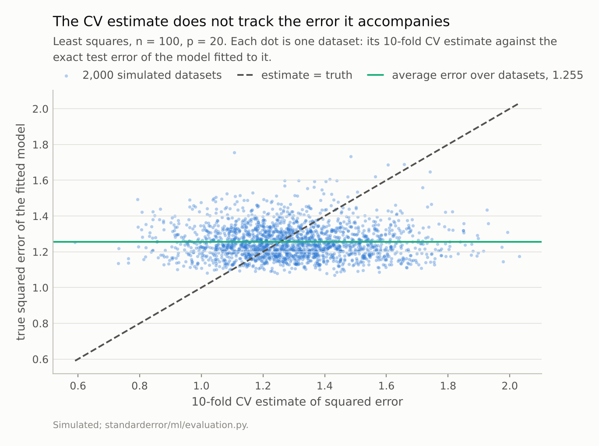
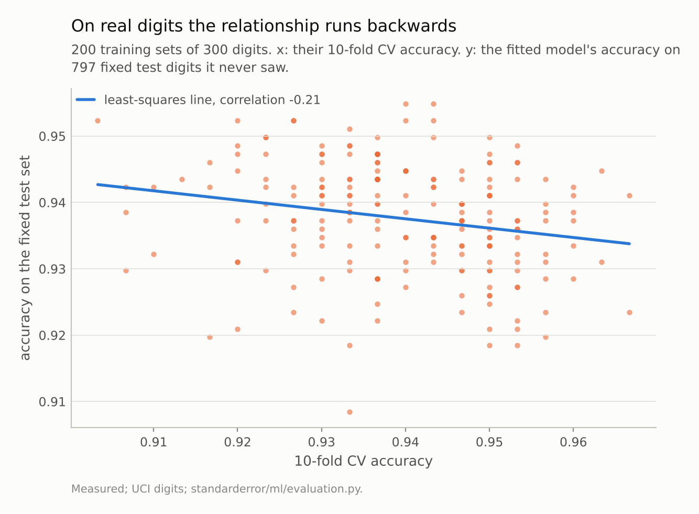
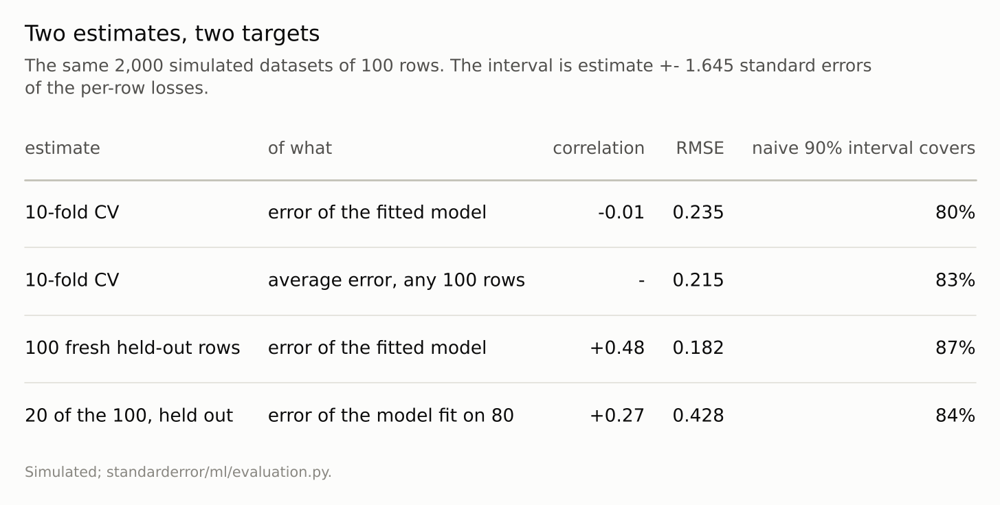

Disclosure: this post was written with the assistance of an AI system (Claude), which wrote the analysis code, ran the experiments and drafted the text. The topic, the constraints, the data choices and the final review are the author's.

*On 2,000 simulated least-squares datasets of 100 rows, where the exact test error of each fitted model is known, the correlation between the 10-fold CV estimate and that error is -0.01. The CV estimates spread 2.3 times as wide as the errors they accompany, and their naive 90% intervals cover the fitted model's error 80% of the time - and the average error, CV's real target, 83%. On the UCI digits, against a fixed 797-image test set, the correlation is -0.21. A held-out set does track the fitted model (+0.48 with 100 fresh rows), at the price of noise and of training on less data.*

Episode 2 of *Machine Learning, Taught Through What Breaks*. The syllabus and the other episodes: https://jongha-jeon-dev.github.io/standarderror/lectures/

## Two different questions

Episode 1 ended where most advice about test-set noise ends: one split is noisy, so cross-validate. K-fold CV uses every row for testing once, averages, and is described — in textbooks, in library documentation, in nearly every report that quotes it — as an estimate of how well *your* model will perform on new data.

There are two quantities that phrase could mean. One is the error of the model you actually fitted, on this data: call it err_xy, because it depends on the particular X and y you were given. The other is the average of that error over all the training sets of the same size you might have been given: call it err. A model fitted to an unlucky sample has err_xy above err; a lucky one, below. The sentence is about err_xy. The question is which one CV estimates.

That is hard to check on real data, because err_xy is never observed. So start where it can be computed exactly. Least squares on 100 rows of 20 standard-normal features: the expected squared error of a fitted coefficient vector b on a fresh row is 1 + |b - β|², no estimation involved.

```python
import numpy as np
from standarderror.ml import evaluation as ev

# 2,000 datasets: 100 rows, 20 features, least squares.
lin = ev.linear_cv_study(n=100, p=20, reps=2000)
cv, err_xy = lin["cv"], lin["err_xy"]
print(f"mean CV estimate      {cv.mean():.3f}   SD {cv.std():.3f}")
print(f"mean true error       {err_xy.mean():.3f}   SD {err_xy.std():.3f}")
print(f"correlation           {np.corrcoef(cv, err_xy)[0, 1]:+.3f}")
```

```text
mean CV estimate      1.294   SD 0.211
mean true error       1.255   SD 0.092
correlation           -0.012
```

The correlation between the CV estimate and the error of the model it accompanies is **-0.012**. Across 2,000 datasets, knowing the CV estimate tells you nothing about whether this particular fit is better or worse than usual.



*Correlation **-0.01**. The CV estimates spread 0.21 wide around a truth that varies by only 0.09: they are tracking the horizontal line, the average, not the dot's own height.*

## What it tracks instead

The figure shows why. The true errors vary by an SD of 0.092 from dataset to dataset; the CV estimates by 0.211, 2.3 times as much. CV's own noise, from which rows landed in which fold and how hard they happened to be, swamps the variation it is supposed to detect. What survives the averaging is the level — the CV estimates centre on 1.294, against an average true error of 1.255, slightly high because each fold's model trained on 90 rows rather than 100.

So CV is an estimate of err, the average over training sets, and a reasonable one: its RMSE against err is 0.215, against 0.235 for err_xy. That is useful — it is the right quantity for choosing between *procedures*, since a procedure is what you would rerun on new data — but it is not the sentence.

The usual interval around it does not cover either target at its nominal rate.

```python
print(f"90% CV interval covers the fitted model's error "
      f"{ev.coverage(cv, lin['cv_se'], err_xy):.1%}")
print(f"90% CV interval covers the average error        "
      f"{ev.coverage(cv, lin['cv_se'], lin['err']):.1%}")
```

```text
90% CV interval covers the fitted model's error 79.6%
90% CV interval covers the average error        83.3%
```

The standard error used there treats the 100 per-row losses as independent, and they are not: every fold's model was trained on most of the other folds' rows, so the losses are correlated, and the interval is too narrow for err and pointed at the wrong target for err_xy. Bates, Hastie and Tibshirani prove the linear-model version of this and propose nested CV to get the width right; the point here is the one before that, about what the centre is.

## On real digits it runs backwards

A simulation is only as good as its assumptions, so the same question on the UCI digits. Split once into a fixed test set of 797 images and a training pool. Draw 200 training sets of 300 images from the pool; for each, cross-validate logistic regression, fit it to all 300, and score that fit on the fixed test set — large enough to stand in for its true accuracy, and disjoint from every training draw.

```python
dig = ev.digits_cv_study(train=300, test=797, reps=200)
print(f"CV accuracy    mean {dig['cv'].mean():.4f}  SD {dig['cv'].std():.4f}")
print(f"test accuracy  mean {dig['true'].mean():.4f}  SD {dig['true'].std():.4f}")
print(f"correlation    {dig['corr']:+.3f}")
```

```text
CV accuracy    mean 0.9396  SD 0.0128
test accuracy  mean 0.9376  SD 0.0085
correlation    -0.212
```

The correlation is **-0.21**: negative. Training sets that cross-validate well produce models that do slightly worse on new digits. The mechanism is the same averaging seen from the other side. A training set that happens to contain more awkward, atypical digits scores poorly in CV, because its held-out folds are full of them, and produces a model that has seen more awkward digits and handles the test set's better. CV rewards the easy sample, not the good model.

The fixed, disjoint test set matters. An earlier version of this experiment scored each fit on all the digits it had not trained on, which makes the test set the complement of the training set: a draw that took the hard digits left an easier test set behind, which exaggerates the effect — that version gave -0.28. With the test set fixed in advance it is -0.21: smaller, and still there.



*Correlation **-0.21**. The training sets that cross-validate best produce models that do slightly *worse* on new digits.*

## What answers the question you asked

If the question really is how well *this* model will do, the instrument is a held-out set the model never saw. Scoring each simulated fit on 100 fresh rows, the correlation with its true error is +0.48 and the naive interval covers 87% of the time.

That comparison is unfair to CV, though: it spends 100 extra rows. On the same budget — fit on 80 of the 100 rows, score on the other 20 —

```python
ho, ho_err = lin["split_holdout"], lin["split_err_xy"]
print(f"fit on 80, score on 20: correlation "
      f"{np.corrcoef(ho, ho_err)[0, 1]:+.3f}   SD {ho.std():.3f}   "
      f"mean true error {ho_err.mean():.3f}")
```

```text
fit on 80, score on 20: correlation +0.266   SD 0.443   mean true error 1.341
```

the held-out estimate still tracks its own model, at +0.27, and pays twice for it: the estimate is noisy, and the model being estimated was fit on less data, so its average true error is 1.341 instead of 1.255.

That is the real choice. Cross-validation gives a stable estimate of how a *procedure* performs on data like yours, which is what you want when choosing between procedures. A held-out set gives a noisy estimate of how one *fitted model* performs, which is what you want when deciding whether to ship it. Most reports use the first and describe it as the second.



*CV is closer to the average than to the fitted model. A held-out set tracks the fitted model, noisily, and its interval covers closer to the nominal rate.*

## Where this breaks

**The zero correlation is for this model and this size.** Bates, Hastie and Tibshirani show it holds for linear models broadly; for flexible models and very large n the conditional and average errors move closer together and the distinction matters less. At 100 rows and 20 features it matters a lot.

**The digits test set is a proxy for the truth.** It is a sample of 797 images, so each model's score on it is its true accuracy plus an error of order 0.008 — shared in part between models, since they face the same images, but not identical. The sign survived the switch to a fixed test set; the size should be read loosely.

**Squared error is skewed.** Part of the interval undercoverage, for every estimator in the table, comes from using a normal interval for a mean of skewed losses. The comparison between rows is fair; the absolute coverages are a little worse than a better interval would give.

## What to keep

1. "The error of your model" can mean the error of the model you fitted (err_xy) or the average error of models fitted to data like yours (err). They are different numbers.

2. On simulated least squares, the 10-fold CV estimate's correlation with err_xy is -0.01. CV estimates err.

3. CV's naive 90% interval covers err_xy 80% of the time and err 83%: the width is wrong because the per-row losses are not independent.

4. On real digits the correlation is -0.21: easy training samples cross-validate well and generalise slightly worse.

5. To evaluate a model you will ship, hold data out. To compare procedures, cross-validate. Say which one you did.

## Exercise

Find a report — your own is best — that quotes a cross-validated score as the expected performance of a deployed model. Rewrite the sentence so it says what was measured: the average performance of the training procedure on samples of that size. If the deployment decision depended on the specific fitted model being good, check whether a held-out score exists, and if not, what it would cost to get one.

Then, if you have a model where two cross-validated scores differ by less than their fold-to-fold spread, ask which question you were trying to answer. For choosing a procedure, the CV comparison is the right one, and episode 1's pairing applies to it. For choosing a fitted model, it is not the right comparison at all.

## Next

Episode 3 takes the rule everyone learns right after cross-validation — fit every preprocessing step inside the folds — and measures seven ways of breaking it. Some leak a third of the accuracy scale. Some leak nothing at all.

---

### Data

- Simulated: standard-normal features, coefficients 0.5, noise SD 1, so each fitted model's expected squared error is exactly 1 + |b - beta|^2.
- UCI Optical Recognition of Handwritten Digits, as bundled with scikit-learn (`load_digits`), CC BY 4.0.
- Machinery: `standarderror/ml/evaluation.py`, tested in `tests/test_ml.py`.
- Where this stops: Bates, Hastie and Tibshirani, "Cross-validation: what does it estimate and how well does it do it?", *JASA* (2023), which proves the linear-model result and proposes nested CV for honest intervals; Hastie, Tibshirani and Friedman, *The Elements of Statistical Learning* (2009), section 7.12, which first reported the weak correlation.

### Reproducibility

- **environment**: standarderror=0.1.0, python=3.13.16, numpy=2.4.4
- **code blocks**: executed at build time; the values the prose quotes are pinned, so drift fails the build
- **determinism**: one seeded generator for the 2,000 simulated datasets; the digits test set and training draws from another, with fold shuffles seeded by replicate

Code: <https://github.com/jongha-jeon-dev/standarderror>
