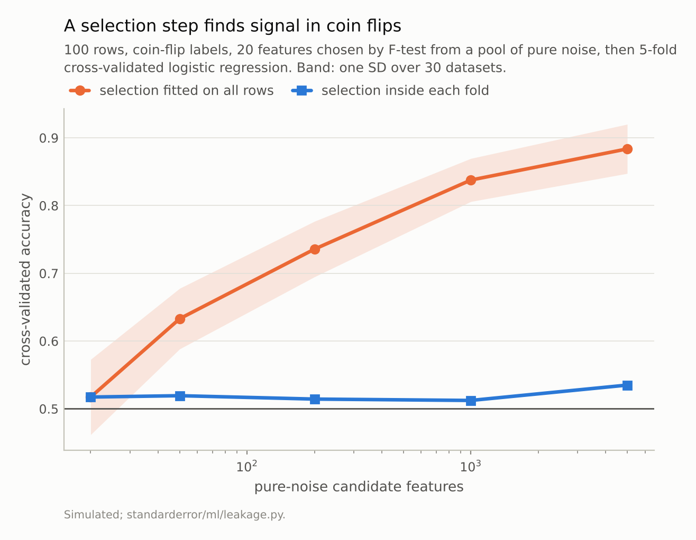
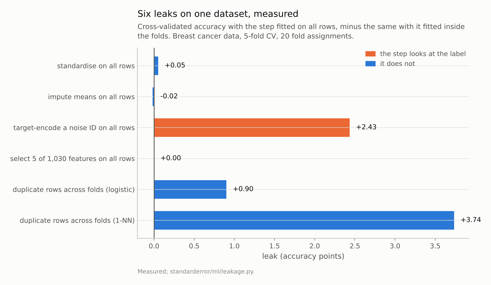
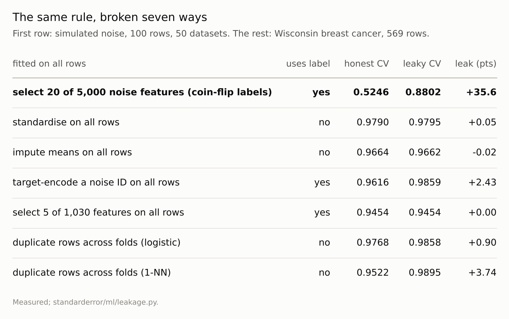

Disclosure: this post was written with the assistance of an AI system (Claude), which wrote the analysis code, ran the experiments and drafted the text. The topic, the constraints, the data choices and the final review are the author's.

*Fit a step on all the rows, then cross-validate, and compare with the same step fitted inside the folds. Standardising leaks +0.05 points on the breast cancer data and mean imputation -0.02: nothing. Selecting 20 of 5,000 pure-noise features turns coin-flip labels into 0.88 cross-validated accuracy against 0.52 done honestly, and the leak grows with the number of candidates - yet selecting 5 of 1,030 features on the real data leaks +0.00, because the real features win anyway. Target-encoding a noise ID leaks +2.4 points; duplicated rows leak +0.9 for logistic regression and +3.7 for 1-NN.*

Episode 3 of *Machine Learning, Taught Through What Breaks*. The syllabus and the other episodes: https://jongha-jeon-dev.github.io/standarderror/lectures/

## One rule, taught as one rule

Episode 2 ended on what cross-validation estimates. This one is about the most common way to make it estimate something else. Every course teaches the rule: anything fitted to data — a scaler, an imputer, a feature selector, an encoder — must be fitted inside each training fold and applied to the held-out fold, never fitted on all the rows first. Violations are called leakage, and Kapoor and Narayanan found them in hundreds of published papers across seventeen fields.

The rule is right. What the usual teaching leaves out is that violations differ in size by orders of magnitude, and the size is predictable. That matters in practice, because the expensive question is never "did we leak?" but "how much of the reported number is leak?"

So here are seven violations, each measured against its honest version on the same folds. Start with the famous one. A hundred rows, 5,000 features of pure noise, labels from a fair coin. Pick the 20 features most associated with the label, then cross-validate logistic regression on them.

```python
from standarderror.ml import leakage as lk

# 100 rows, 5,000 noise features, coin-flip labels, 50 datasets.
r = lk.noise_selection(n=100, p=5000, k=20, reps=50)
print(f"select on all rows, then CV:  {r['leaky'].mean():.3f}"
      f"   (lowest {r['leaky'].min():.2f})")
print(f"select inside each fold:      {r['honest'].mean():.3f}"
      f"   (highest {r['honest'].max():.2f})")
```

```text
select on all rows, then CV:  0.880   (lowest 0.80)
select inside each fold:      0.525   (highest 0.63)
```

Selected on all rows, the coin flips cross-validate at **0.880**; no dataset of the fifty came in below 0.80. Selected inside each fold, 0.525 — which is what labels from a coin deserve. That is Ambroise and McLachlan's result from microarray studies in 2002, reproduced in a few lines.

## The leak is the room to choose

Why so large? The selection step looked at all 100 labels, including the ones each fold would later hold out, and with 5,000 candidates it can always find 20 columns that happen to line up with them. The cross-validation then faithfully measures how well those columns predict labels they were chosen to predict.

That suggests the size of the leak is set by how much choice the step has, and it is. Sweep the number of noise candidates the 20 are chosen from.

The leak is exactly zero with 20 candidates — there is nothing to choose — and climbs steadily: 0.63 with 50, 0.74 with 200, 0.84 with 1,000, 0.88 with 5,000. The honest line never moves off 0.5.



*With 20 candidates there is nothing to choose and nothing leaks. With 5,000 the leaky estimate is **0.88** for labels that are coin flips.*

## Six more, on real data

On the Wisconsin breast cancer data, 569 rows and 30 real features, here are six more violations, each scored with its honest version on 20 fold assignments.

```python
for row in lk.leak_table(reps=20):
    print(f"{row['leak']:40s} honest {row['honest']:.4f}  "
          f"leaky {row['leaky']:.4f}  {row['gap'] * 100:+.2f}")
```

```text
standardise on all rows                  honest 0.9790  leaky 0.9795  +0.05
impute means on all rows                 honest 0.9664  leaky 0.9662  -0.02
target-encode a noise ID on all rows     honest 0.9616  leaky 0.9859  +2.43
select 5 of 1,030 features on all rows   honest 0.9454  leaky 0.9454  +0.00
duplicate rows across folds (logistic)   honest 0.9768  leaky 0.9858  +0.90
duplicate rows across folds (1-NN)       honest 0.9522  leaky 0.9895  +3.74
```

**Standardising and imputing on all rows leak nothing measurable**: +0.05 and -0.02 points. Neither looks at the label, and a mean and a standard deviation estimated from 569 rows instead of 455 differ by too little to move a decision boundary. These are the violations most often flagged in code review, and they are the least consequential.

**Selecting features on all rows leaked nothing either** — +0.00 points — even though the selection looked at every label and chose 5 of 1,030 columns, 1,000 of them pure noise. The real features are so much stronger than any noise column's chance alignment that the selection picks them whether or not it sees the held-out labels. The noise experiment above leaked because there was nothing real to find. Using the label is necessary for this kind of leak and not sufficient: what leaks is the room to fit chance.

**Target-encoding a noise ID leaks +2.4 points.** A column of 200 random categories, each replaced by its mean label, carries no information; encoded on all rows, each category's mean includes the held-out rows' own labels, and the model learns to read them back.

**Duplicated rows leak without looking at the label at all**: +0.9 points for logistic regression, +3.7 for 1-NN. Copy every row once and split at random, and most copies land in a different fold from their twin. A smooth model gains a little from having seen its test row; a nearest-neighbour model *is* a lookup of its test row. Its leaky score is almost exactly what that predicts: with about 80% of twins in another fold and the rest scored honestly, 80% × 1 + 20% × 0.952 = 0.990, against 0.990 measured.



*Neither colour predicts the size. Looking at the label is necessary for a selection leak and not sufficient; duplicates leak without looking at it at all.*

## A rule for sizing a leak

The measurements support one rule of thumb, sharper than "fit everything inside the folds": **a step leaks to the extent that it gives the model room to fit the test rows.** That room comes from two places.

One is choice informed by the labels — selection, encoding, tuning — and its size is set by how many options the step has relative to how much real signal there is to find. Plenty of real signal and the choice is made the same way with or without the held-out labels; pure noise and every candidate is a chance to fit them.

The other is the test row itself, or a near-copy of it, being present in training. Its size is set by how local the model is: logistic regression barely notices a duplicate, 1-NN returns it.

Steps that do neither — estimating a mean, a scale, a missing-value fill from a few hundred rows — do not leak in any amount worth measuring. Fit them inside the folds anyway, because it costs nothing; but when auditing a result, start with the steps that can choose.



*The ranking is the lesson: a leak is the room a step has to fit the test rows, not whether it touched them.*

## Where this breaks

**Small data makes the harmless steps less harmless.** At 569 rows a scaler fitted on 455 or 569 rows is the same scaler. With 30 rows and a heavy-tailed feature it would not be, and standardising could leak a little through one extreme row.

**Real duplicates are rarely exact.** Near-duplicates — augmented images, resampled time series, the same patient twice — leak by the same mechanism with less force, and are much harder to find. The 1-NN number is the upper end of the range.

**Tuning is the leak not measured here.** Choosing hyperparameters on the same cross-validation you report is label-informed choice, so by the rule above its size depends on how many configurations were tried and how much they differ. The earlier post "I Trained 2,000 Models on a Coin Flip and the Best One Looked Great" measures that one: the best of many configurations looks good on noise for the same reason the selected features do.

**One dataset.** The breast-cancer features are strong, which is why selection leaked nothing on them. On a dataset with weak signal and many features — the setting where selection is used most — it will look much more like the noise experiment.

## What to keep

1. Fitting a step on all rows before cross-validating can leak anything from nothing to a third of the accuracy scale. Measure it: run the honest version on the same folds and subtract.

2. Standardising and mean imputation on all rows leaked +0.05 and -0.02 points here. Not worth an alarm; still worth fixing.

3. Feature selection on all rows turned coin flips into 0.88 accuracy, growing with the number of candidates — and leaked +0.00 on real data where the real features dominate.

4. Target-encoding on all rows leaked +2.4 points from a column of pure noise.

5. Duplicates leak without touching the label, +0.9 points for logistic regression and +3.7 for 1-NN.

6. A step leaks to the extent it gives the model room to fit the test rows: label-informed choice, or the test row itself in training.

## Exercise

Take a pipeline you have shipped and list every step that is fitted to data. Mark each one: does it look at the label, and how many options does it choose between? Does any row, or a near-copy of a row, appear on both sides of your splits?

Then measure the one you are least sure of: run the cross-validation with that step fitted on all rows and again fitted inside the folds, on the same fold assignment, and subtract. If the difference is within the error bar from episode 1, you have a style problem. If it is not, the number you reported was partly the leak.

## Next

Episode 4 asks a planning question every project faces before it has a test score at all: will more data help? Learning curves are the standard tool, and the standard extrapolation from them is a power law. Fitted on small samples and checked against what the larger samples actually deliver, it is tested rather than assumed.

---

### Data

- Breast Cancer Wisconsin (Diagnostic), as bundled with scikit-learn (`load_breast_cancer`): 569 rows, 30 features, CC BY 4.0. Wolberg, Street and Mangasarian (1995), UCI Machine Learning Repository.
- Simulated: standard-normal noise features and fair coin-flip labels, so the true accuracy of any model is 0.5.
- Machinery: `standarderror/ml/leakage.py`, tested in `tests/test_ml.py`.
- Where this stops: Ambroise and McLachlan, "Selection bias in gene extraction on the basis of microarray gene-expression data", *PNAS* (2002); Kaufman, Rosset, Perlich and Stitelman, "Leakage in data mining: formulation, detection, and avoidance", *ACM TKDD* (2012); Kapoor and Narayanan, "Leakage and the reproducibility crisis in machine-learning-based science", *Patterns* (2023).

### Reproducibility

- **environment**: standarderror=0.1.0, python=3.13.16, numpy=2.4.4
- **code blocks**: executed at build time; the values the prose quotes are pinned, so drift fails the build
- **determinism**: noise datasets from one seeded generator; every leaky and honest pair uses the same 5-fold assignment, seeded by replicate

Code: <https://github.com/jongha-jeon-dev/standarderror>
