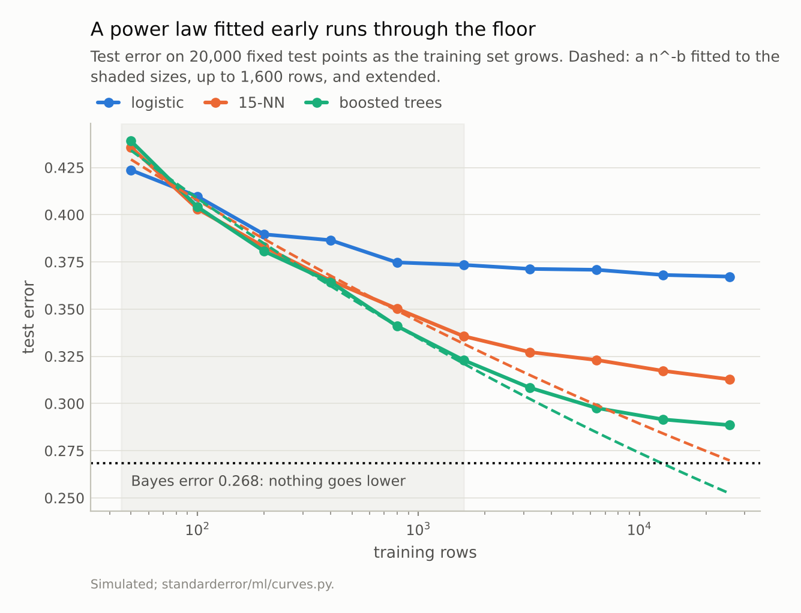
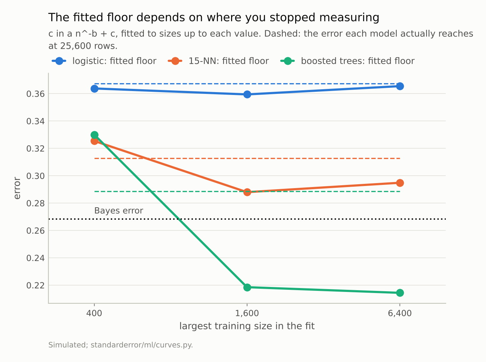
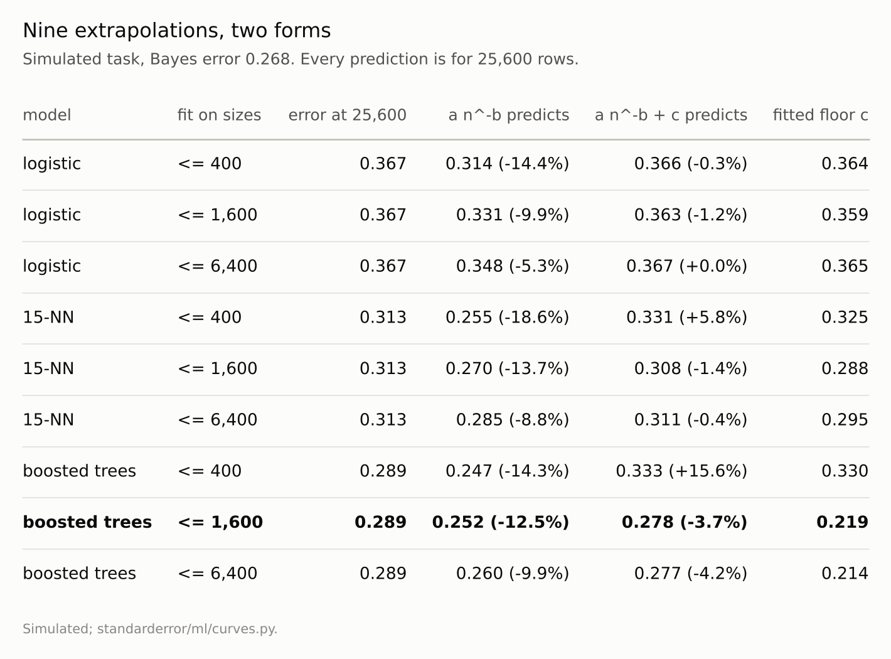

Disclosure: this post was written with the assistance of an AI system (Claude), which wrote the analysis code, ran the experiments and drafted the text. The topic, the constraints, the data choices and the final review are the author's.

*On a simulated task whose Bayes error is 0.268, with training sets grown to 25,600 rows, the two-parameter power law a n^-b fitted to the smaller sizes predicted too low an error in all 9 fits, and in 4 of them predicted an error below the Bayes error - 0.252 for boosted trees that reach 0.289. Adding a floor fixes logistic regression, whose curve has already bent, but the boosted trees' fitted floor is 0.330 from 400 rows and 0.219 from 1,600: first above the error they reach, then below the Bayes error. On the digits all 9 fits were optimistic too, and logistic regression, best at 50 images, is worst at 1,200.*

Episode 4 of *Machine Learning, Taught Through What Breaks*. The syllabus and the other episodes: https://jongha-jeon-dev.github.io/standarderror/lectures/

## The question before the test score

The first three episodes were about reading a score you already have. This one is about the decision made before there is much of one: a pilot study on a few hundred labelled rows, and the question of whether labelling ten or a hundred times as many is worth it.

The standard tool is the learning curve — test error against training-set size — and the standard way to read it forward is a power law. Error falls as a n^-b on a log-log plot as a straight line; fit the line to the pilot sizes, extend it, read off the error at the size you could afford. It is the same move as the scaling laws used to plan large training runs, made at the scale of a spreadsheet.

Whether it works can be checked only where the curve can be followed much further than the fit. So here is a task built for that: two classes in ten dimensions whose covariances differ, so the best possible boundary is quadratic, training sets grown from 50 rows to 25,600, and a 20,000-point test set on which the Bayes error — the error of the true decision rule, which nothing can beat — is computed exactly from the densities.

```python
from standarderror.ml import curves as cu

task = cu.GaussianTask()          # quadratic Bayes boundary, d = 10
curve = cu.task_curve(task)
print(f"Bayes error {task.bayes:.4f}")
for n in (200, 1600, 25600):
    row = "  ".join(f"{k} {curve['error'][k][n]:.4f}"
                    for k in curve["error"])
    print(f"n = {n:>6,}  {row}")
```

```text
Bayes error 0.2684
n =    200  logistic 0.3896  15-NN 0.3830  boosted trees 0.3806
n =  1,600  logistic 0.3734  15-NN 0.3357  boosted trees 0.3230
n = 25,600  logistic 0.3672  15-NN 0.3128  boosted trees 0.2885
```

Three models: logistic regression, which cannot represent a quadratic boundary and stalls; 15-nearest-neighbours, which can, slowly; and boosted trees, which can, faster. At 25,600 rows the boosted trees reach 0.289, still 0.020 above the Bayes error and still improving.

## The power law runs through the floor

Pretend the pilot study stopped at 1,600 rows. Fit a n^-b to each model's errors up to there and extend it.

```python
for model in ("15-NN", "boosted trees"):
    f = cu.fit(curve, model, until=1600, floor=False)
    print(f"{model:13s} a n^-b from n <= 1,600 predicts "
          f"{f['predict'](25600):.4f} at 25,600;  "
          f"actual {curve['error'][model][25600]:.4f}")
```

```text
15-NN         a n^-b from n <= 1,600 predicts 0.2698 at 25,600;  actual 0.3128
boosted trees a n^-b from n <= 1,600 predicts 0.2524 at 25,600;  actual 0.2885
```

The boosted trees' prediction, 0.252, is below the Bayes error of 0.268: no classifier, with any amount of data, can achieve it. The 15-NN prediction, 0.270, is 0.001 above it — a forecast that the slowest of the flexible models will very nearly reach the best possible error, when it is in fact still 0.044 away. Across all nine fits — three models, pilot studies stopping at 400, 1,600 and 6,400 rows — the two-parameter power law predicted a lower error than the model actually reached at 25,600, every time, and 4 of the nine predictions are below the Bayes error.

The reason is visible in the local slope of the curve on log-log axes. A power law has a constant slope. These curves do not:

```python
for model in curve["error"]:
    sl = cu.log_slope(curve, model)
    print(f"{model:13s} local log-log slope  "
          + "  ".join(f"{x:+.3f}" for x in sl[::3]))
```

```text
logistic      local log-log slope  -0.048  -0.045  -0.002
15-NN         local log-log slope  -0.113  -0.060  -0.018
boosted trees local log-log slope  -0.119  -0.096  -0.051
```

Every slope shrinks towards zero as the curve approaches a floor it cannot go through. A straight line fitted to the early, steep part of the curve carries that steepness forward and overshoots.



*Fitted on the shaded range, the power law for the boosted trees predicts **0.252** at 25,600 rows, below the Bayes error of 0.268. They reach 0.289.*

## Adding a floor, and where that fails

The textbook fix is a third parameter: a n^-b + c, where c is the error the model would reach with unlimited data. For logistic regression it works. Its curve has already flattened by a few hundred rows, so the fit can see the floor, and from 6,400 rows it predicts 0.3672 against 0.3672 actual. Its fitted floor, 0.365, is far above the Bayes error, and correctly so: a linear boundary on a quadratic problem has its own limit.

For the boosted trees, which are still improving at every size measured, the floor is not something the fit can see, so it guesses. Fitted to 400 rows the floor is 0.330, above the 0.289 the trees actually reach — the fit concludes that more data will barely help, and predicts 0.333 at 25,600 rows when the trees in fact get to 0.289. Fitted to 1,600 or 6,400 rows the floor is 0.219 and 0.214, below the Bayes error. The predictions at 25,600 rows are closer — 0.278 and 0.277 against 0.289 — but the parameter that is supposed to say how far the model can go has no meaning.

So the floor helps exactly when it is least needed. A curve that has visibly bent tells you more data will not help much, with or without a fit. A curve that is still falling is the case where the decision matters, and there the third parameter is set by noise in the last few points.



*For the boosted trees the floor is 0.330 from 400 rows - above what they reach - and **0.219** from 1,600, below the Bayes error. A floor nobody can reach is not an estimate of anything.*



*Every two-parameter prediction is too low. The floor helps the model that has stopped improving and misleads about the one that has not.*

## On the digits, and the ranking that turns over

The digits allow only 1,200 training images after setting aside a fixed test set, so the check is shorter: fit up to 300, predict 1,200.

```python
dig = cu.digits_curve()
for n in (50, 100, 300, 1200):
    print(f"{n:>5,} images  " + "  ".join(
        f"{k} {dig['error'][k][n]:.3f}" for k in dig["error"]))
```

```text
   50 images  logistic 0.230  RBF SVM 0.355  3-NN 0.256
  100 images  logistic 0.133  RBF SVM 0.163  3-NN 0.132
  300 images  logistic 0.067  RBF SVM 0.060  3-NN 0.052
1,200 images  logistic 0.040  RBF SVM 0.022  3-NN 0.020
```

All nine two-parameter fits — three models, three pilot sizes — were optimistic again: from 300 images, 0.022 predicted against 0.040 for logistic regression (-46%), 0.019 against 0.022 for the SVM, 0.015 against 0.020 for 3-NN. And the three-parameter fit put the floor at zero for 2 of the three models: on curves this short and steep there is no floor to see.

The table also shows the second way a pilot study misleads. Logistic regression has the lowest error at 50 images — it is the most constrained model, and constraint is what small data rewards — and the highest at 1,200, double the error of the other two. A model chosen on the pilot would be the wrong one. On the simulated task the same happens at smaller scale: logistic regression leads at 50 rows, 15-NN at 100, and the boosted trees from 200 on.

## Where this breaks

**These are small models on small data.** The scaling laws used to plan large neural-network runs are fitted over many orders of magnitude, far into the straight part of the curve, and have predicted well there. The failure here is specific to fitting early — which is exactly where a pilot study fits.

**Least squares on the error scale weights the early points.** The large errors at small n dominate an unweighted fit. Fitting on log error, or weighting by each point's variance, changes the numbers; it does not remove the curvature, so it does not change the direction.

**The task was chosen to have a known floor.** Real problems have one too, but nobody computes it, which is the point: the only check on a fitted floor is the Bayes error, and in practice it is unavailable.

**Single training sets at the largest sizes.** The 25,600-row errors average three training sets, the digits' 1,200 is one. Their noise is small next to the gaps quoted, but not zero.

## What to keep

1. A power law a n^-b fitted to a pilot study predicted too low an error at the target size in all 18 fits here, simulated and real.

2. On a task with a known Bayes error of 0.268, 4 of 9 such predictions were below it — errors no classifier can reach.

3. Learning curves flatten towards a floor; the local log-log slope shrinks, so a straight line fitted early overshoots.

4. The floored form a n^-b + c works for curves that have already bent and fails for those still falling: the boosted trees' fitted floor went from 0.330 (above what they reach) to 0.219 (below Bayes) with the fit range.

5. The best model at pilot size need not be the best at full size. On digits, logistic regression went from best at 50 images to worst at 1,200.

## Exercise

If you have a learning curve from a pilot study, refit it twice: once on all the sizes you have, once leaving out the largest. If the prediction at your target size moves by more than the improvement you are hoping for, the curve is not telling you what the extra data will buy.

Then plot the local slope between neighbouring sizes. If it is still steepening or constant, you are in the part of the curve a power law describes; if it is shrinking, there is a floor ahead, and a two-parameter fit will overshoot it. And before committing to a model, check the ranking at the largest size you can afford to test, not at the pilot size.

## Next

Episode 5 closes the first arc with the most common fix for an imbalanced dataset: resampling it until the classes are balanced. It will be measured against the alternatives — class weights and simply moving the decision threshold — on what each does to the ranking, to the probabilities and to the decisions.

---

### Data

- Simulated: two Gaussian classes in 10 dimensions with different covariances, so the Bayes boundary is quadratic; the Bayes error is computed from the true densities on the 20,000-point test set every model is scored on.
- UCI Optical Recognition of Handwritten Digits, as bundled with scikit-learn (`load_digits`), CC BY 4.0.
- Machinery: `standarderror/ml/curves.py`, tested in `tests/test_ml.py`.
- Where this stops: Viering and Loog, "The shape of learning curves: a review", *IEEE TPAMI* (2023); Hestness et al., "Deep learning scaling is predictable, empirically" (2017); Cortes et al., "Learning curves: asymptotic values and rate of convergence", *NeurIPS* (1993), for the a n^-b + c form.

### Reproducibility

- **environment**: standarderror=0.1.0, python=3.13.16, numpy=2.4.4
- **code blocks**: executed at build time; the values the prose quotes are pinned, so drift fails the build
- **determinism**: training sets are drawn from seeds 1000 upward, 3 to 20 per size; the test set and the task's covariance from fixed seeds; boosted trees with early stopping off and a fixed random state

Code: <https://github.com/jongha-jeon-dev/standarderror>
