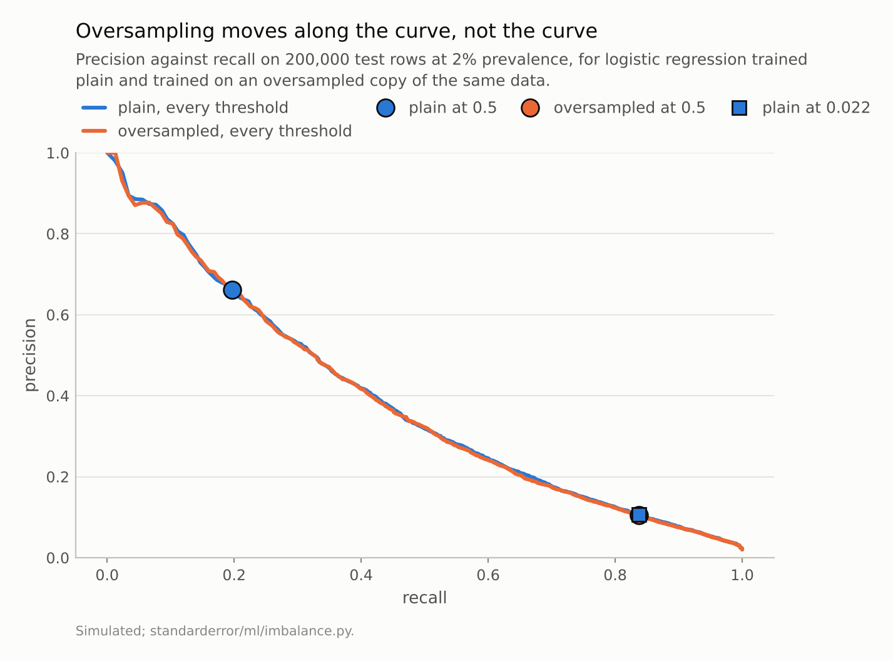
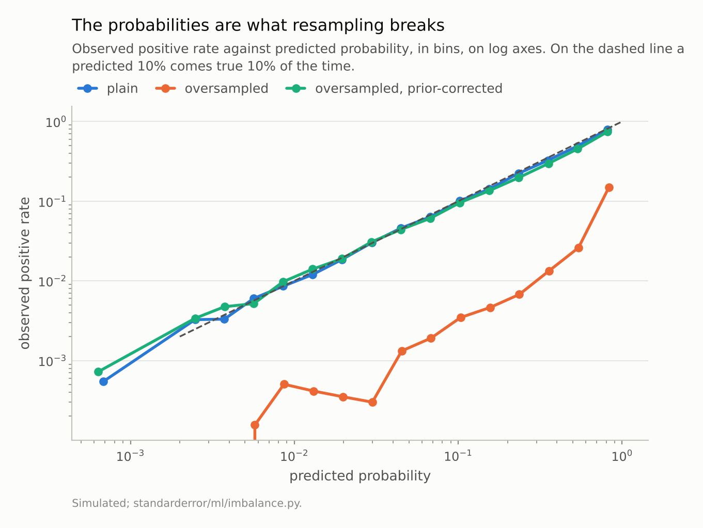
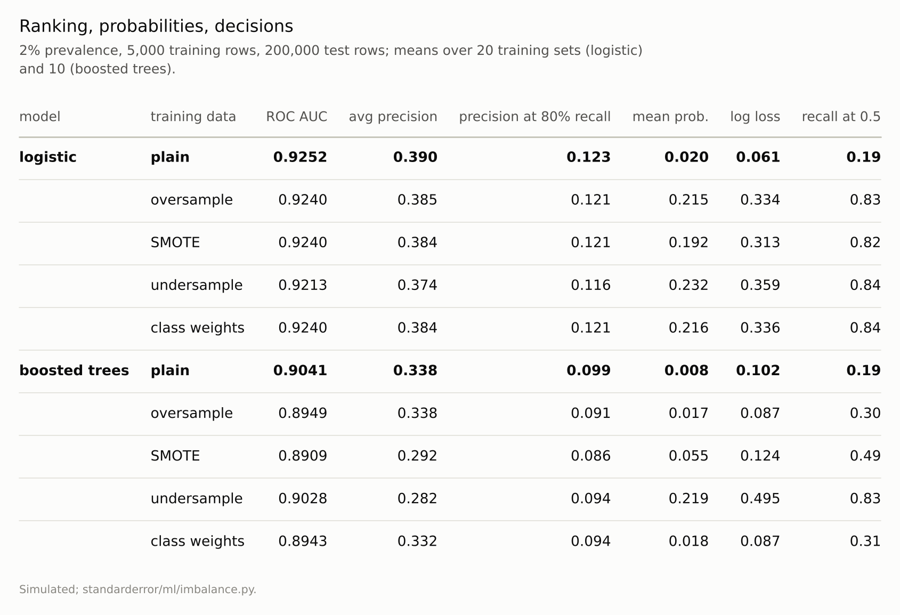

Disclosure: this post was written with the assistance of an AI system (Claude), which wrote the analysis code, ran the experiments and drafted the text. The topic, the constraints, the data choices and the final review are the author's.

*At 2% prevalence, logistic regression trained on an oversampled, SMOTE-augmented or class-weighted copy of the data ranks the test set no better than the plain model - AUC -0.0012 for oversampling, small and consistently negative - while its mean predicted probability goes from 0.020 to 0.215 and its log loss rises 5.4-fold. The recall it gains at the 0.5 cut, 0.19 to 0.83, the plain model gets with a threshold of 0.021, at 0.106 precision against 0.105. On boosted trees the corrections lower the AUC by about 0.01, and SMOTE costs 0.046 of average precision. The digits agree.*

Episode 5 of *Machine Learning, Taught Through What Breaks*. The syllabus and the other episodes: https://jongha-jeon-dev.github.io/standarderror/lectures/

## The fix taught first

When the positive class is rare — fraud, a disease, a defect — a classifier trained on the data as it comes predicts the negative class almost everywhere, and at the default 0.5 cut it catches few positives. The first fix most courses teach is to balance the classes before training: duplicate the minority rows (oversampling), synthesise new ones between them (SMOTE), throw away majority rows (undersampling), or weight the minority class up in the loss. The sentence behind all four is that *imbalance is a problem in the data, and resampling fixes it.*

To see what each actually changes, it helps to separate three things a classifier produces. Its **ranking**: which cases it thinks more likely positive than others, measured by ROC AUC, average precision, or precision at a fixed recall. Its **probabilities**: whether a predicted 10% comes true 10% of the time. And its **decisions**: which cases get flagged at whatever threshold is applied.

A simulated task makes all three measurable at once: positives at 2%, 5,000 training rows — about 100 positives — and a 200,000-row test set at the same prevalence. Logistic regression first, the five versions trained on the same rows, twenty times over.

```python
from standarderror.ml import imbalance as im

lo = im.compare(model="logistic", reps=20)   # 2% positive
for m, v in lo["summary"].items():
    print(f"{m:13s} AUC {v['auc']:.4f}  mean prob {v['mean_p']:.3f}  "
          f"log loss {v['log_loss']:.3f}  recall@0.5 {v['recall_half']:.2f}")
```

```text
plain         AUC 0.9252  mean prob 0.020  log loss 0.061  recall@0.5 0.19
oversample    AUC 0.9240  mean prob 0.215  log loss 0.334  recall@0.5 0.83
SMOTE         AUC 0.9240  mean prob 0.192  log loss 0.313  recall@0.5 0.82
undersample   AUC 0.9213  mean prob 0.232  log loss 0.359  recall@0.5 0.84
class weights AUC 0.9240  mean prob 0.216  log loss 0.336  recall@0.5 0.84
```

The first column barely moves. The second and third move a lot. The last column, the one resampling is used for, moves from 0.19 to 0.82 or more.

## The ranking: no better, slightly worse

Because every version trains on the same rows in each replicate, the differences from the plain model are paired, and their standard errors are small enough to see the sign.

```python
for m, d in lo["paired"].items():
    a, p = d["auc"], d["precision_r80"]
    print(f"{m:13s} AUC {a['mean']:+.4f} +- {a['se']:.4f}   "
          f"precision at 80% recall {p['mean']:+.4f} +- {p['se']:.4f}")
```

```text
oversample    AUC -0.0012 +- 0.0004   precision at 80% recall -0.0023 +- 0.0007
SMOTE         AUC -0.0012 +- 0.0004   precision at 80% recall -0.0023 +- 0.0008
undersample   AUC -0.0039 +- 0.0006   precision at 80% recall -0.0066 +- 0.0011
class weights AUC -0.0012 +- 0.0005   precision at 80% recall -0.0022 +- 0.0009
```

Oversampling, SMOTE and class weights each cost about 0.0012 of AUC — tiny, and consistently negative. None of them improved the ranking in the measurement, and precision at 80% recall fell slightly too. Undersampling, which discards roughly 98% of the majority rows, costs about three times as much.

That is what the algebra predicts for logistic regression. Duplicating positives, or weighting them, mostly shifts the intercept: every log-odds goes up by roughly the same amount, and a shift that applies to every row cannot reorder them. What little reordering there is comes from the slopes being fitted to a reweighted sample, and it does not help.



*The curves are the same. The default cut puts them at different points, and the plain model gets to the oversampled one's point with a threshold of **0.021** instead of 0.5.*

## The decisions: a threshold does the same job

If the ranking did not change, the jump in recall must have come from somewhere else, and it did: shifting every log-odds up is the same as lowering the threshold. The test is to take the plain model and move its threshold until it flags as many positives as each corrected model does at 0.5.

```python
for m in ("oversample", "SMOTE", "class weights"):
    v = lo["matched"][m]
    print(f"{m:13s} recall {v['recall']:.3f}: precision "
          f"{v['method_precision']:.3f} at 0.5, plain "
          f"{v['plain_precision']:.3f} at {v['plain_threshold']:.3f}")
```

```text
oversample    recall 0.834: precision 0.105 at 0.5, plain 0.106 at 0.021
SMOTE         recall 0.819: precision 0.112 at 0.5, plain 0.113 at 0.023
class weights recall 0.836: precision 0.104 at 0.5, plain 0.105 at 0.021
```

At the same recall the plain model is as precise as every corrected one, or slightly more. The oversampled model's 0.5 corresponds to a plain-model threshold of about 0.021 — almost exactly the prevalence, which is what a cost argument says it should be when a missed positive is weighted like 49 false alarms.

That is the real content of "fixing" imbalance: choosing a different trade-off between missed positives and false alarms. It is a decision about costs, and a threshold expresses it directly, can be changed after training, and does not touch the model.

## The probabilities: what resampling breaks

The cost of doing it by resampling shows up in the probabilities. The plain model's mean prediction is 0.020 against a true rate of 0.02: it is calibrated. The oversampled model's is 0.215, about 11 times too high, and its log loss is 5.4 times worse. It was trained on a world where positives are as common as negatives, and it reports probabilities for that world.

Anyone who reads those numbers as probabilities — to rank by expected cost, to set a threshold by a business rule, to combine with another model, to tell a patient a risk — is reading the wrong world. Van den Goorbergh and colleagues found exactly this in clinical risk models: imbalance corrections improved no discrimination measure and produced strongly overestimated risks.

The damage is reversible for logistic regression, because it is mostly an intercept: multiply each predicted odds by the ratio of the true prior odds to the training prior odds.

```python
c = lo["corrected"]
print(f"oversampled, prior-corrected: mean prob {c['mean_p']:.4f}  "
      f"log loss {c['log_loss']:.4f}  AUC {c['auc']:.4f}")
```

```text
oversampled, prior-corrected: mean prob 0.0206  log loss 0.0620  AUC 0.9240
```

Mean prediction and log loss are back to the plain model's. Which is a long way round to arrive where the plain model started.



*Oversampled, a predicted probability is about ten times the real rate: mean prediction 0.215 against a prevalence of 0.02. **One line of algebra** puts it back.*

## For trees it is not even neutral

Logistic regression can only shift and tilt a hyperplane, so resampling has little room to do harm. A flexible model has room. The same comparison with boosted trees, ten training sets:

```python
bo = im.compare(model="boosted trees", reps=10)
for m, d in bo["paired"].items():
    print(f"{m:13s} AUC {d['auc']['mean']:+.4f} +- {d['auc']['se']:.4f}"
          f"   avg precision {d['ap']['mean']:+.4f}")
```

```text
oversample    AUC -0.0093 +- 0.0011   avg precision +0.0006
SMOTE         AUC -0.0133 +- 0.0031   avg precision -0.0457
undersample   AUC -0.0013 +- 0.0030   avg precision -0.0562
class weights AUC -0.0099 +- 0.0012   avg precision -0.0060
```

Oversampling, SMOTE and class weights each lower the AUC by about 0.01, well outside their standard errors, and SMOTE loses 0.046 of average precision. Undersampling barely moves the AUC (-0.0013, inside its standard error) but loses 0.056 of average precision, which is where a rare-class problem is decided. Duplicated positives are fitted exactly; SMOTE's synthetic positives fill in the space *between* real ones, which is not where positives are, and the trees learn that geometry. At its own operating point the SMOTE model reaches 0.221 precision; the plain model with its threshold moved to the same recall reaches 0.288.

The prior correction does not rescue the trees either: their probabilities were not inflated by a clean intercept shift but distorted by memorising the duplicated rows, and the correction applied to them makes the log loss worse, not better.

The digits — "is this an 8?", about 10% positive, logistic regression over 30 splits — agree with the simulation. The plain model has the highest AUC (0.9749) and the highest precision at 80% recall (0.746), against 0.707 oversampled and 0.649 undersampled.



*No column on the left improves on the **plain** row. The right-hand column, the one resampling is used for, is a threshold.*

## Where this breaks

**Severe imbalance with tiny counts.** With about 100 positives the plain model is well estimated. With ten, every method is noisy, and some regularisation from reweighting can help a badly overfitted model; the fix there is regularisation or more positives, not balance.

**Models that ignore the threshold.** Some pipelines take the argmax and have no threshold to move — a deep network's softmax inside a larger system, say. Then reweighting is the only lever available, and it is the threshold in disguise; it should still be corrected before the probabilities are used.

**Losses that are not proper.** The comparison assumes the model is trained on log loss. Trained to maximise accuracy directly, a model on imbalanced data can genuinely learn to ignore the minority class, and reweighting changes what it learns.

**One simulated task.** The tree result depends on how much the trees can memorise; with stronger regularisation the damage shrinks. The direction — no gain in ranking — held in all three settings measured.

## What to keep

1. Separate ranking, probabilities and decisions. Imbalance corrections change the last two and, at best, leave the first alone.

2. On logistic regression at 2% prevalence, oversampling, SMOTE and class weights changed AUC by about -0.0012; undersampling by -0.0039.

3. The recall they gain at 0.5 the plain model gets with a threshold near the prevalence (0.021), at the same precision or better.

4. They inflate predicted probabilities about 11-fold. For a linear model the prior correction undoes it.

5. On boosted trees they made the ranking worse: about -0.01 AUC, and 0.046 of average precision for SMOTE.

6. Imbalance is not a defect in the data. It is a cost question, and a threshold is where costs belong.

## Exercise

Find a model in your stack trained on resampled or reweighted data. Train the same model on the data as it comes, and compare the two on the same test rows: AUC, average precision, and precision at the recall you actually operate at. If the plain model matches or beats the corrected one at that recall, the correction was a threshold; replace it with one.

Then look at what consumes the corrected model's probabilities. If anything treats them as probabilities — a dashboard, an expected-cost calculation, another model — check its mean prediction against the true rate. If it is several times too high, either apply the prior correction or retrain without the resampling.

## Next

That closes the first arc, on what a score means. Arc II turns to linear models pushed past their textbook conditions, starting with the most common classifier there is: logistic regression on data that a straight line separates perfectly, where the maximum-likelihood coefficients the textbook promises do not exist.

---

### Data

- Simulated: 8 standard-normal features, positives at 2% shifted by 1.2 on three features and spread 1.8 times wider on a fourth; 5,000 training rows per replicate, 200,000 test rows at the same prevalence.
- UCI Optical Recognition of Handwritten Digits, as bundled with scikit-learn (`load_digits`), CC BY 4.0, recast as 'is it an 8?' at about 10% positive.
- Machinery: `standarderror/ml/imbalance.py`, including a from-scratch SMOTE, tested in `tests/test_ml.py`.
- Where this stops: Chawla et al., "SMOTE: synthetic minority over-sampling technique", *JAIR* (2002); Elkan, "The foundations of cost-sensitive learning", *IJCAI* (2001); Saerens, Latinne and Decaestecker, "Adjusting the outputs of a classifier to new a priori probabilities", *Neural Computation* (2002); van den Goorbergh et al., "The harm of class imbalance corrections for risk prediction models", *JAMIA* (2022).

### Reproducibility

- **environment**: standarderror=0.1.0, python=3.13.16, numpy=2.4.4
- **code blocks**: executed at build time; the values the prose quotes are pinned, so drift fails the build
- **determinism**: training sets from seeds 0 to 19, the test set from seed 99; every method within a replicate sees the same training set, so differences are paired

Code: <https://github.com/jongha-jeon-dev/standarderror>
