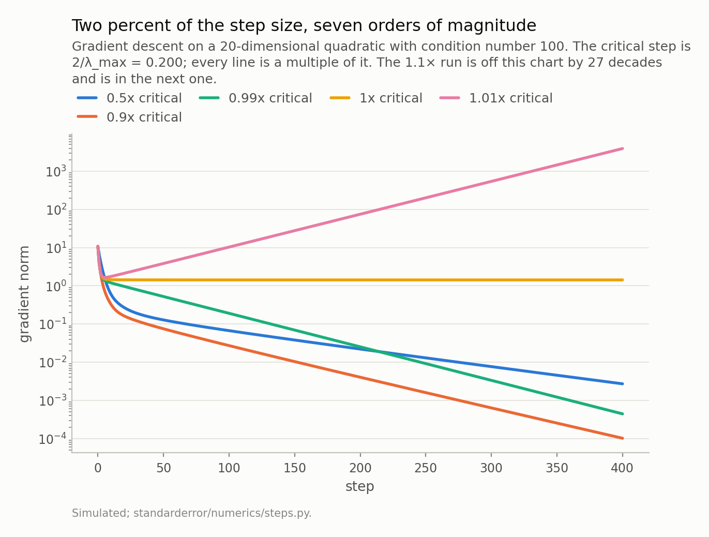
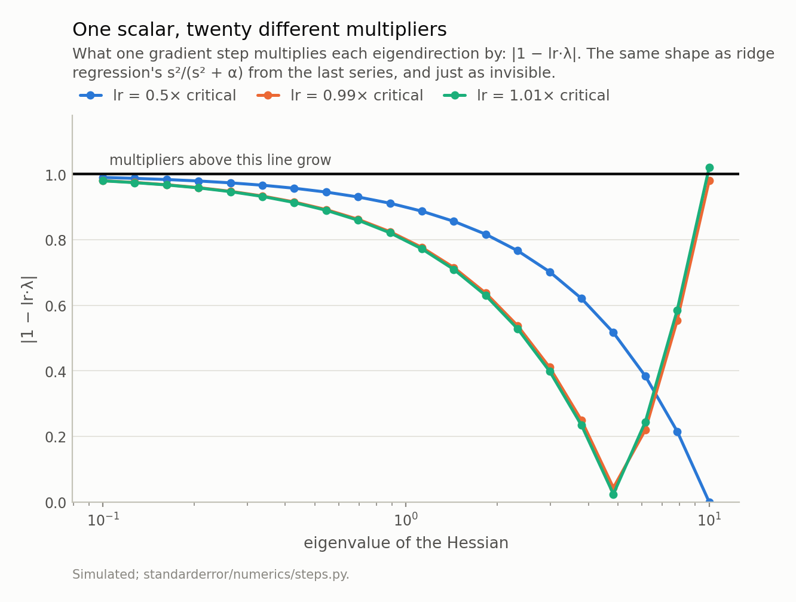
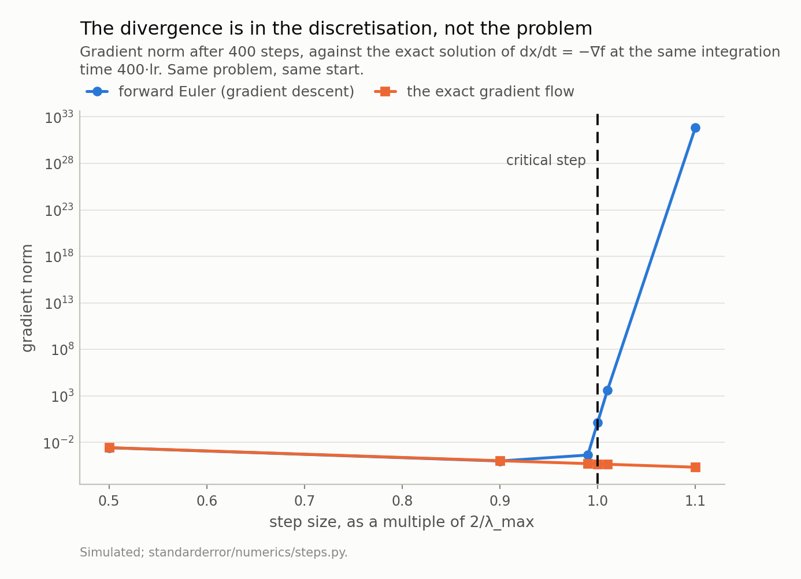
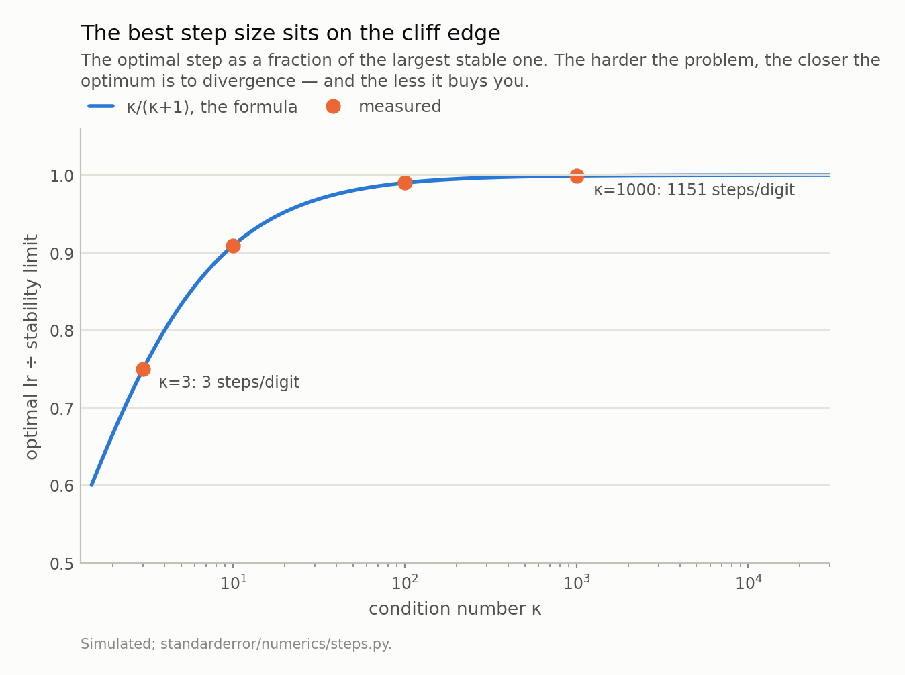
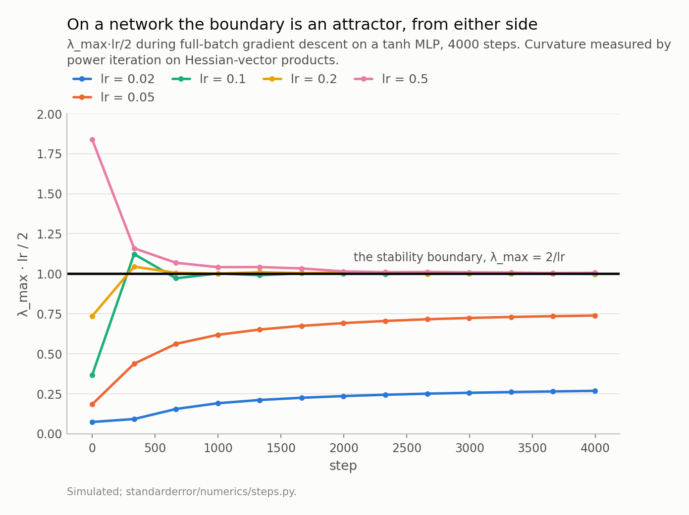

Disclosure: this post was written with the assistance of an AI system (Claude), which wrote the analysis code, ran the experiments and drafted the text. The topic, the constraints, the data choices and the final review are the author's.

*The optimiser everyone uses is an ODE solver, and that is an identity rather than an analogy: gradient descent is forward Euler on the gradient flow. So the learning rate is a step size, and step sizes have stability limits. On a quadratic the limit is 2/λ_max exactly — at 0.99× of it the run ends at 4.4e-04 and at 1.01× at 3.9e+03, while the continuous flow being approximated converges at every step size, which locates the blow-up in the solver rather than the problem. The optimal step sits at κ/(κ+1) of that limit, so on any ill-conditioned problem the best learning rate is within a percent of a cliff. Then the correction the quadratic cannot give you: under full-batch gradient descent on a small MLP, 2/lr is a two-sided attractor for λ_max — pushed down from 7.36 to 4.0 at lr = 0.5 — the boundary only binds above a certain step, and the usable limit is twice the one you would compute at initialisation.*

Episode 1 of *Numerical Analysis for Machine Learning, Taught Through What Breaks*. The syllabus and the other episodes: https://jongha-jeon-dev.github.io/standarderror/lectures/

## The optimiser is an ODE solver, and this is not a metaphor

Write down the differential equation that moves a point downhill as fast as the surface allows:

$$
\frac{dx}{dt} = -\nabla f(x)
$$

This is the *gradient flow*. It has no step size, because it has no steps. It also cannot fail: along any solution, `df/dt` equals minus the squared gradient norm, so the loss decreases monotonically until the gradient vanishes, for every problem, forever. There is no hyperparameter to get wrong.

Now solve it numerically with the simplest method there is. Forward Euler replaces the derivative with a difference over a step `h`:

$$
\frac{x_{n+1} - x_n}{h} = -\nabla f(x_n) \quad\Longrightarrow\quad x_{n+1} = x_n - h \nabla f(x_n)
$$

The right-hand side is gradient descent. The step size `h` is the learning rate. Not "like" the learning rate — the two expressions are character-for-character the same, and every fact numerical analysis knows about forward Euler is therefore a fact about your training run.

The first of those facts is that forward Euler is only *conditionally stable*. There is a largest step beyond which the numerical solution diverges even though the exact solution it approximates does not. For a linear system `dx/dt = -Hx` the condition is that every eigenvalue `lam` of `H` satisfy `|1 - h lam| < 1`, which for positive `lam` means

$$
0 < h < \frac{2}{\lambda_{\max}(H)}
$$

and *f*(*x*) = *x*ᵗ*Hx*/2 — the quadratic — is exactly that linear system. So on a quadratic, gradient descent has a stability limit with a formula in it. Here is the whole claim in twenty lines.

```python
import numpy as np

# A quadratic, so that every claim below has a closed form to check
# against: f(x) = x'Hx/2, gradient Hx, Hessian H.
d, kappa, seed = 20, 100.0, 0
eigs = np.geomspace(1.0, kappa, d) / np.sqrt(kappa)
q, _ = np.linalg.qr(np.random.default_rng(seed).standard_normal((d, d)))
H = q @ np.diag(eigs) @ q.T

def descend(H, x, lr, steps):
    for _ in range(steps):
        x = x - lr * (H @ x)          # forward Euler on dx/dt = -Hx
    return np.linalg.norm(H @ x)

lam_max = np.linalg.eigvalsh(H)[-1]
critical = 2 / lam_max
x0 = np.random.default_rng(seed).standard_normal(d)

print(f"lam_max = {lam_max:.4f}   2/lam_max = {critical:.6f}")
for mult in [0.5, 0.9, 0.99, 1.0, 1.01, 1.1]:
    print(f"  {mult:>5.2f} x critical   "
          f"{descend(H, x0, mult * critical, 400):.3e}")
```

```text
lam_max = 10.0000   2/lam_max = 0.200000
   0.50 x critical   2.714e-03
   0.90 x critical   1.019e-04
   0.99 x critical   4.434e-04
   1.00 x critical   1.425e+00
   1.01 x critical   3.924e+03
   1.10 x critical   6.702e+31
```

Read the last three rows again. At 0.99 times the critical step, four hundred steps take the gradient norm from 10.78 down to 4.43e-04. At 1.01 times — a change of two percent in one number — the same four hundred steps end at 3.92e+03. That is a factor of 8.9e+06 across a 2% change in a hyperparameter that most people set by trying a few values and keeping the one that looked best.

And the row between them is stranger than either.



*At 1× the critical step the run ends at 1.424642, which is exactly the size of the gradient's component along the sharpest eigenvector — preserved to every digit for 400 steps. One row up, at 0.99×, it ends at 4.43e-04. One row down, at 1.01×, 3.92e+03.*

At *exactly* the critical step the sharpest direction's multiplier is |1 − lr·λ_max| = |1 − 2| = 1. Not slightly less, not slightly more. That component of the gradient is neither damped nor amplified, and it is still there, unchanged, after any number of steps:

```python
# At exactly the critical step the sharpest direction's multiplier is
# |1 - lr*lam_max| = |1 - 2| = 1. Nothing happens to it, ever.
_, vecs = np.linalg.eigh(H)
component = abs((vecs.T @ (H @ x0))[-1])
after = descend(H, x0, critical, 400)
print(f"component of the gradient along the top eigenvector: {component:.9f}")
print(f"gradient norm after 400 steps at the critical step:  {after:.9f}")
```

```text
component of the gradient along the top eigenvector: 1.424641673
gradient norm after 400 steps at the critical step:  1.424641674
```

Nine digits. This is the marginal case that stability analysis is *about*: the boundary is not a fuzzy region where things get unreliable, it is the single step size at which one eigendirection is copied forward exactly. On one side of it that direction dies; on the other it grows geometrically. Nothing in the loss curve tells you which side you are on until it does.

## What the blow-up is actually made of

One learning rate, twenty directions, twenty different multipliers. A single step multiplies the component of `x` along each eigenvector of `H` by |1 − lr·λ| — a number you never see, produced by a scalar you chose and a spectrum you did not compute.

Readers of the previous series will recognise the shape. Ridge regression's per-direction multiplier was *s*²/(*s*² + α): one regularisation constant, one multiplier per singular direction, and the geometry hidden behind a single knob. This is the same situation with a different function, and it has the same consequence — the aggregate behaviour is an average over directions that are doing completely different things.



*At 1.01× the critical step exactly 1 of 20 directions has a multiplier above 1 — 1.020 — and the other 19 are contracting hard. That is what the blow-up is made of: nineteen directions converging and one growing 1.02× a step, 400 times.*

Two ends of that curve matter, and they pull in opposite directions.

The **sharpest** direction sets the stability limit. At 1.01× the critical step its multiplier is 1.020 and every other direction is contracting — 1 growing, 19 shrinking. That is the entire divergence: nineteen directions converging nicely while one grows by 2% per step, four hundred times, which is 3e+03.

The **flattest** direction sets the speed. At 0.99× the critical step the worst multiplier is 0.9802, and it belongs to λ_min = 0.10, not to λ_max. The step that is nearly too large for the sharp directions is still barely moving the flat ones. That is what a condition number of 100 means operationally, and it is why the optimum is where it is.

Setting the two ends equal — |1 − lr·λ_min| = |1 − lr·λ_max| — gives the best fixed step in one line:

$$
\mathrm{lr}^{*} = \frac{2}{\lambda_{\min} + \lambda_{\max}} \quad\text{with per-step contraction}\quad \frac{\kappa - 1}{\kappa + 1}
$$

## The problem never diverges. The solver does

Before the optimum, one more thing about the row that reached 6.7e+31.

That number is not a property of the quadratic. The gradient flow on this same quadratic, from this same starting point, integrated to the same time 400·lr, has reached 2.19e-05. It cannot do anything else: the exact solution is `x(t) = exp(-tH)x0`, every eigencomponent decays like `exp(-t λ)`, and there is no step size in that expression to make large.

So `6.7e+31` is a number the discretisation invented. Forward Euler at a step size past its stability limit does not approximate the flow badly; it approximates a different, growing solution.



*The two agree to 1.02× at half the critical step — same object, as they must be. At 1.1× the flow has reached 2.19e-05 and Euler 6.7e+31. Nothing about the problem changed between those two points on the x-axis.*

Which is worth holding onto when a run explodes. Divergence is not evidence that the loss surface is pathological, that the initialisation was bad, or that the data has outliers in it. The default hypothesis, checkable in a few Hessian-vector products, is that the step size is past `2/λ_max` — and at half the critical step, Euler and the exact flow here agree to 1.02×, which is what "the same object" looks like when the discretisation is fine.

## The optimum sits on the cliff edge

Divide the optimal step by the largest stable one and the eigenvalues cancel:

$$
\frac{\mathrm{lr}^{*}}{2/\lambda_{\max}} = \frac{\lambda_{\max}}{\lambda_{\min} + \lambda_{\max}} = \frac{\kappa}{\kappa + 1}
$$

That is exact, it depends on nothing but the condition number, and it says something uncomfortable. At κ = 3 the optimum is at 75% of the limit — comfortable. At κ = 100 it is at 99.0%. At κ = 1000, 99.90%.

Real problems are ill-conditioned. So on a real problem the best learning rate is essentially *at* the largest one that does not diverge — which is why "raise it until it breaks, then back off a little" is not folklore that happens to work, it is very nearly the correct procedure. It is also why that procedure is uncomfortable to run: it aims at a target one percent away from a cliff worth 9e+06 in the final gradient norm.



*The formula and the measurement, on four problems: κ = 10 puts the optimum at 90.9% of the limit and costs 11 steps per digit, κ = 100 at 99.0% and 115 steps. At κ = 1000 the optimal step is 99.90% of the largest stable one — which is to say that on a badly conditioned problem there is no safe distance between the best learning rate and the one that diverges. And the reward for finding it is 1151 steps per decimal digit.*

And look at what the optimum buys. At κ = 100 the best possible contraction is 0.9802 per step, which is **115 steps to gain one decimal digit** — and no fixed step size does better, because the formula above is a minimum over `lr`, not an estimate. At κ = 1000 it is 1151. Tuning the learning rate on an ill-conditioned problem is optimising something that is nearly flat in the only quantity you can move.

Momentum is the thing that changes the exponent rather than the constant, and its stability limit is the same formula with one factor in it:

$$
\mathrm{lr} < \frac{2(1 + \beta)}{\lambda_{\max}}
$$

Bisecting for the true threshold, rather than trusting that: at β = 0 the largest converging step is 0.200067 against a predicted 0.200000, a relative error of 3.4e-04. At β = 0.9 it is 0.379997 against 0.380000, error 8.1e-06. Exactly `1 + β` wider, measured. Which is the whole reason a learning rate that diverges without momentum trains with it — here, lr = 0.30 is 1.5× the plain limit, diverges plain, and converges at β = 0.9.

Tuned properly the pair is β = 0.669 with lr = 0.331, and the rate becomes 0.8182 — the plain rate with √κ substituted for κ. Measured over 400 steps that is 12.2 steps per digit against 115, a factor of 9. Note the ratio comes from replacing a condition number by its square root, which is a change of kind, and no amount of learning-rate tuning reaches it.

## Then the network moves the boundary

Everything above is exact and everything above is about a quadratic, where `H` is a constant. A neural network's Hessian is not a constant. It depends on where the parameters are, the parameters depend on the trajectory, and the trajectory depends on the learning rate — so `λ_max` is a function of the step size you chose, and `2/λ_max` is not a number you can look up before training.

That sounds like the kind of caveat that dissolves the whole analysis. It does not, and what actually happens is more specific than either "the threshold applies" or "the threshold doesn't apply". Here is full-batch gradient descent on a two-hidden-layer tanh MLP — 200 rows, mean squared error, fixed step, no momentum, no schedule — with `λ_max` measured by power iteration on Hessian-vector products every few hundred steps.



*The two smallest steps rise and plateau **below** the boundary — at 0.268 and 0.739. The three largest end on it to within 0.3%. And the lr = 0.5 run starts at 1.84, above the boundary, and is pushed **down** to 1.003: λ_max falls from 7.36 to 4.01, which is 2/lr.*

Three regimes, and the middle one is the surprise.

**Below the boundary the sharpness rises and stops short of it.** At lr = 0.02 the ratio λ_max·lr/2 climbs from 0.074 to 0.268; at lr = 0.05, to 0.739. The curvature does grow during training — from 7.36 to 29.5, a factor of 4.0 — but it grows because the network is fitting, not because it is being pushed, and it plateaus wherever the task's own sharpness plateaus.

**At and above lr = 0.1 the boundary binds.** The ratio ends at 0.999, 1.002 and 1.003 for lr = 0.1, 0.2 and 0.5 — within 0.3% of 1 across a fivefold range of learning rate. `λ_max` ends at 20.0, 10.0 and 4.0, which are 20, 10 and 4. This is the edge of stability, and the sharpness is not converging to a property of the problem — it is converging to a property of your hyperparameter.

**And it arrives from both sides.** The lr = 0.5 run *starts* at a ratio of 1.84, well past the boundary, at a step size which on a fixed quadratic of that curvature would diverge in a few dozen steps. It does not diverge. `λ_max` falls from 7.36 to 4.01 and the run converges. I had written this phenomenon down, before measuring it, as "sharpness rises to meet 2/lr and hovers there". That is the upward half of a two-sided attractor, and stating only the upward half would have implied a network can never be initialised past its own stability boundary, which this run does.

So how large a step does this network actually tolerate? Not `2/λ_max` at initialisation — that is 0.2719, and lr = 0.5 trains fine. Bisecting for the real threshold:

- converges at lr = 0.55537
- diverges at lr = 0.55566

A bracket 0.05% wide, and **2.04 times** the number the formula gives at initialisation. Both halves of that matter. The threshold is real and it is sharp — at lr = 0.8 the loss goes non-finite at step 6, with no degradation on the way — so this is not a case where the classical analysis stops applying. It applies, and its input is wrong, because the curvature you measure before training is not the curvature you will train at.

One more habit the edge regime interferes with. In that regime the training loss is **not monotone**: at lr = 0.2 it rises on 26% of the last 2000 steps — median rise 0.16%, largest 1.1% — while falling 71-fold over that same window. At lr = 0.05, below the boundary, it rises on exactly 0% of them. A loss that ticks upward at a large step size is what convergence looks like there, and treating it as a bug is how people end up lowering a learning rate that was working.

## The measurement that makes this usable

None of the above requires forming a Hessian. `λ_max` comes out of repeated Hessian-vector products, each of which costs about one extra backward pass, and the estimate converges in a few dozen of them — 45 on the quadratic above, to 1e-10 relative. That is affordable every few hundred training steps on a model of any size.

```python
# The one measurement that makes the threshold usable during a run.
# Power iteration needs only Hessian-vector products, and one of those
# costs about one extra backward pass -- so this is affordable every
# few hundred steps, on a model of any size.
def sharpness(hvp, n_params, iters=60, seed=0):
    v = np.random.default_rng(seed).standard_normal(n_params)
    v /= np.linalg.norm(v)
    lam = 0.0
    for _ in range(iters):
        w = hvp(v)                       # one HVP == one extra backward
        lam = float(v @ w)
        v = w / np.linalg.norm(w)
                                         # (a real one stops on tol)
    return lam

lam = sharpness(lambda v: H @ v, H.shape[0])
for lr in (0.05, 0.15, 0.25):
    print(f"lr = {lr:.2f}   lam_max*lr/2 = {lam * lr / 2:.3f}   "
          f"{'stable' if lam * lr / 2 < 1 else 'DIVERGES'}")
```

```text
lr = 0.05   lam_max*lr/2 = 0.250   stable
lr = 0.15   lam_max*lr/2 = 0.750   stable
lr = 0.25   lam_max*lr/2 = 1.250   DIVERGES
```

The only thing that changes on a network is where the product comes from: instead of `H @ v`, differentiate `grad · v` a second time.

One number in that block is worth arguing with, though: `iters`. Sixty iterations is generous on the quadratic and not enough on the trained network, because the top of a trained network's spectrum is crowded and power iteration separates a crowded top slowly. At lr = 0.1, sixty iterations return λ_max = 19.790 and four hundred return 19.998 — a ratio of 0.990 against 1.000, which is the difference between reporting "close to the boundary" and "on it". If you are going to read this number, resolve it.

```python
# The same loop on a network, and the same `sharpness` above -- only the
# Hessian-vector product changes, from `H @ v` to one autograd call.
# Nothing else here is unusual: a two-hidden-layer tanh MLP, mean
# squared error, a fixed step, no momentum, no schedule, full batch.
import torch

torch.set_default_dtype(torch.float64)

def train(lr, steps=4000):
    g = torch.Generator().manual_seed(0)
    net = torch.nn.Sequential(
        torch.nn.Linear(8, 40), torch.nn.Tanh(),
        torch.nn.Linear(40, 40), torch.nn.Tanh(),
        torch.nn.Linear(40, 1))
    for lin in [m for m in net if isinstance(m, torch.nn.Linear)]:
        with torch.no_grad():
            fan_in = lin.weight.shape[1]
            lin.weight.copy_(torch.randn(*lin.weight.shape, generator=g)
                             / fan_in ** 0.5)
            lin.bias.zero_()
    gd = torch.Generator().manual_seed(1)
    X = torch.randn(200, 8, generator=gd)
    y = (torch.sin(2 * X[:, 0]) + 0.5 * X[:, 1] * X[:, 2]).unsqueeze(1)
    ps = list(net.parameters())

    def flat(loss, create_graph=False):
        gs = torch.autograd.grad(loss, ps, create_graph=create_graph)
        return torch.cat([a.reshape(-1) for a in gs])

    def loss_fn():
        return torch.nn.functional.mse_loss(net(X), y)

    for _ in range(steps):
        gvec = flat(loss_fn())
        with torch.no_grad():
            i = 0
            for prm in ps:
                k = prm.numel()
                prm -= lr * gvec[i:i + k].view_as(prm)
                i += k

    # The HVP: differentiate `grad . v` once more.
    gr = flat(loss_fn(), create_graph=True)

    def hvp(v):
        w = torch.autograd.grad(gr @ torch.as_tensor(v), ps,
                                retain_graph=True)
        return torch.cat([a.reshape(-1) for a in w]).detach().numpy()

    # 400, not the default 60: see the note below the block.
    return float(loss_fn().detach()), sharpness(hvp, gr.numel(),
                                                iters=400)

for lr in (0.05, 0.2, 0.5):
    loss, lam = train(lr)
    print(f"lr = {lr:.2f}   loss {loss:.2e}   lam_max {lam:6.2f}   "
          f"lam_max*lr/2 = {lam * lr / 2:.3f}")
```

```text
lr = 0.05   loss 2.29e-04   lam_max  29.54   lam_max*lr/2 = 0.739
lr = 0.20   loss 4.45e-05   lam_max  10.02   lam_max*lr/2 = 1.002
lr = 0.50   loss 1.23e-04   lam_max   4.02   lam_max*lr/2 = 1.006
```

Which gives one number worth printing in a training log next to the loss: **λ_max·lr/2**. Below 1 you have headroom, and if it is well below 1 and the loss is falling slowly, the step is small rather than the problem hard. Near 1 you are at the edge — expect a non-monotone loss and do not read the bumps as a bug. Above 1 and staying there, you are diverging and the next few steps will show it.

## What to keep

1. Gradient descent is forward Euler on the gradient flow. The learning rate is a discretisation step and inherits forward Euler's conditional stability.
2. On a quadratic the limit is exactly `2/λ_max`, and it is a threshold: 4.43e-04 at 0.99× of it, 3.92e+03 at 1.01×.
3. The blow-up belongs to the solver, not the problem. The flow being approximated converges at every step size.
4. The optimal step is at `κ/(κ+1)` of the limit, so on ill-conditioned problems the best learning rate is nearly the largest stable one — and it still costs 115 steps per digit at κ = 100. Momentum widens the limit by exactly `1 + β` and changes the rate's dependence from κ to √κ.
5. On a network `2/lr` is a two-sided attractor for `λ_max` above a certain step size, the usable limit is about twice what the initial curvature suggests, and in that regime the training loss is not monotone.
6. `λ_max·lr/2` is cheap. Print it.

## Exercise

Take a model you are training and a learning rate you chose by trying a few. Estimate `λ_max` with twenty Hessian-vector products at your current checkpoint — twenty extra backward passes — and compute `λ_max·lr/2`.

Then do it again five hundred steps later.

Three outcomes, and each of them tells you a different thing. If the ratio is well below 1 and not moving, your step size is not the binding constraint and tuning it will not help much; look at conditioning. If it is sitting near 1, you are at the edge, your loss curve's bumps are the method rather than a bug, and the largest useful step is close to where you are. And if it is above 1 and rising, you have a few dozen steps before the run ends, which is enough time to checkpoint.

Next episode: the other finite difference in your codebase. A gradient check *is* a finite difference, so it has an optimal step — and it is not the `1e-8` everybody uses, being off by three orders of magnitude in a direction that costs you eight in what the check can detect.

---

### Data

- No external data. Every system here is constructed in the episode and every number is produced by the code shown, executed when this page was built.
- Machinery: `standarderror/numerics/steps.py`, tested in `tests/test_steps.py`.
- Where this stops: Hairer, Nørsett and Wanner, *Solving Ordinary Differential Equations I* (Springer, 1993), for stability of one-step methods; Polyak, "Some methods of speeding up the convergence of iteration methods", *USSR Comp. Math.* 4 (1964), for the heavy-ball rate; Nesterov, *Introductory Lectures on Convex Optimization* (Kluwer, 2004), for the optimal fixed step; and Cohen, Kaur, Li, Kolter and Talwalkar, "Gradient descent on neural networks typically occurs at the edge of stability", *ICLR* (2021), for the network half.

### Reproducibility

- **environment**: standarderror=0.1.0, python=3.11.15, numpy=2.4.4, torch=2.13.0
- **code blocks**: executed at build time; the values the prose quotes are pinned, so drift fails the build
- **simulation**: one 20-dimensional quadratic with condition number 100, and one tanh MLP trained full-batch for 4000 steps on 200 rows
- **determinism**: one seed per system, each stated in the code shown

Code: <https://github.com/jongha-jeon-dev/standarderror>
