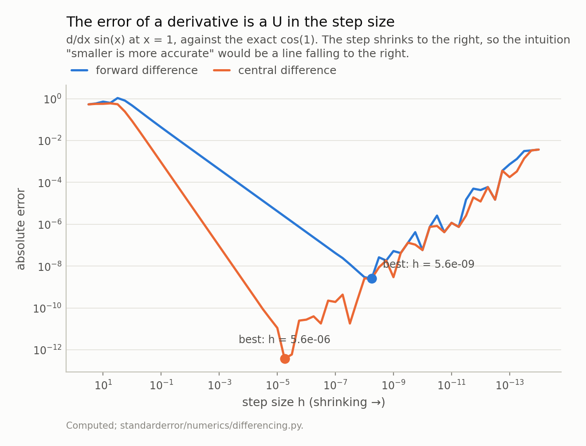
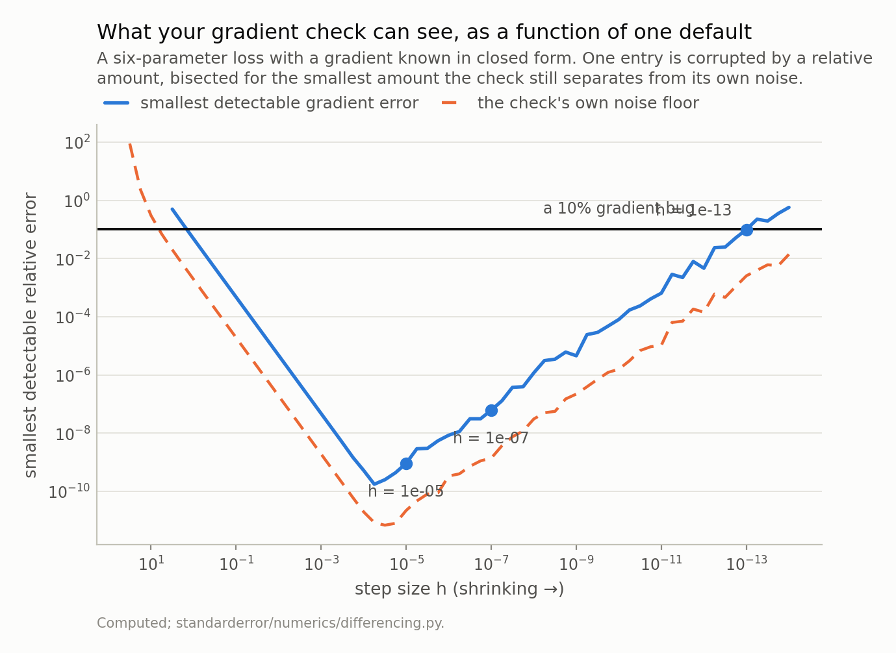
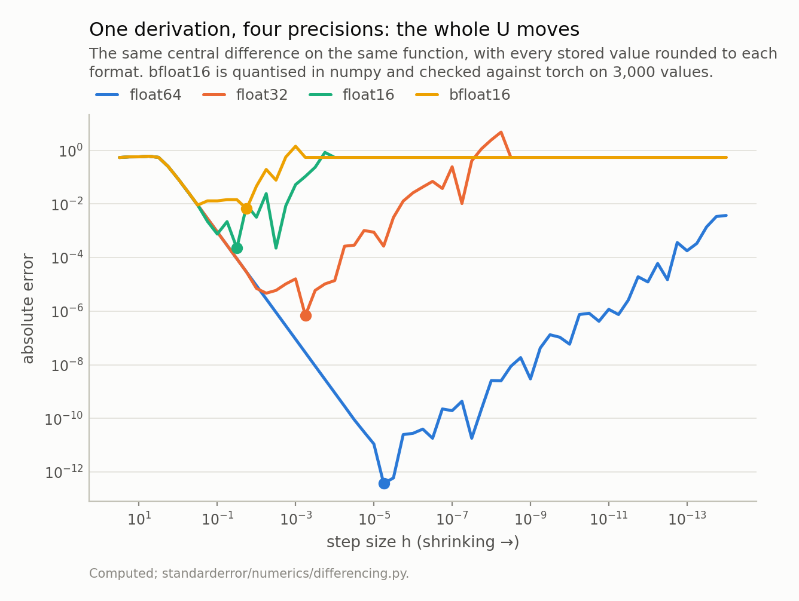
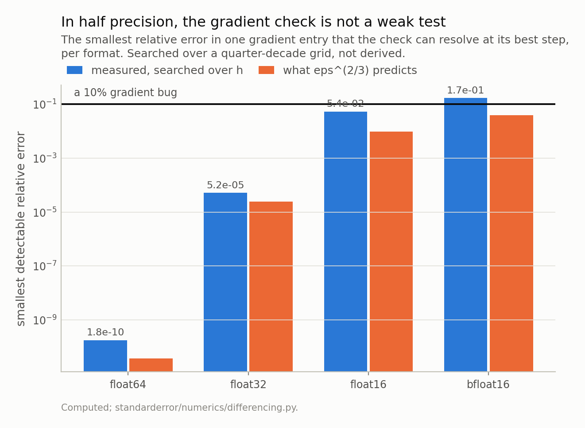
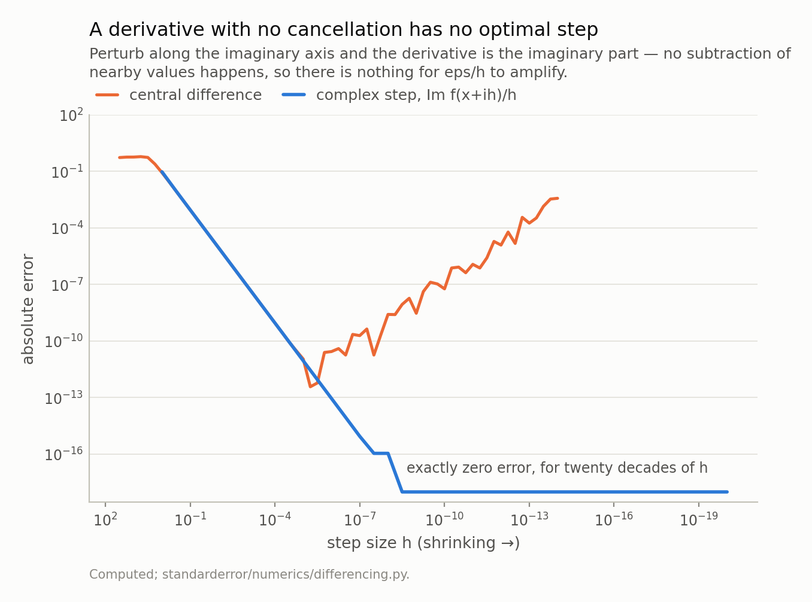

Disclosure: this post was written with the assistance of an AI system (Claude), which wrote the analysis code, ran the experiments and drafted the text. The topic, the constraints, the data choices and the final review are the author's.

*A gradient check is a finite difference, and a finite difference has an optimal step size: truncation error falls as the step shrinks and cancellation rises like eps/h, so the total is a U and refining past its bottom makes the answer worse — 9.9e+09 times worse at h = 1e-14 than at the optimum. Measured on a six-parameter loss with a known gradient, the smallest error in one entry the check can resolve runs from 9.3e-10 at h = 1e-05 to 9.9e-02 at h = 1e-13. Every scale in that derivation is a power of eps, so the precision moves all of them at once: the check resolves 1.8e-10 in float64, 5.2e-05 in float32 and 1.7e-01 in bfloat16, where it is therefore not a weak test but not a test. The way out, where it applies, is a complex step, which has no cancellation and no optimum — and whose failure modes are not the ones you would guess.*

Episode 2 of *Numerical Analysis for Machine Learning, Taught Through What Breaks*. The syllabus and the other episodes: https://jongha-jeon-dev.github.io/standarderror/lectures/

## Every gradient check has a number in it that nobody chose

Somewhere in most training codebases there is a function like this, and it has been passing for years:

```python
num = (loss(x + h) - loss(x - h)) / (2 * h)
assert abs(num - grad(x)).max() < 1e-6
```

The `1e-6` on the second line gets argued about. The `h` on the first line is a default — usually `1e-7` or `1e-8` — and it is the one that decides what the test can detect, because that expression is a finite difference, and a finite difference has an optimal step size that almost nobody computes.

Here is why it has one. Taylor gives the error of the two obvious schemes:

$$
\frac{f(x+h) - f(x)}{h} = f^{\prime}(x) + \frac{h}{2} f^{\prime\prime}(x) + O(h^2)
$$

$$
\frac{f(x+h) - f(x-h)}{2h} = f^{\prime}(x) + \frac{h^2}{6} f^{\prime\prime\prime}(x) + O(h^4)
$$

so the *truncation* error is `O(h)` and `O(h^2)`, and both fall as `h` falls. That is the half everyone remembers.

The other half is that `f(x+h)` and `f(x-h)` are floating-point numbers, and they agree to more and more digits as `h` shrinks — so their difference keeps fewer and fewer of them, and then you divide by a small number, which amplifies whatever is left. That *cancellation* error grows like `eps/h`.

Two errors, opposite directions, one step size. The total is a U.

```python
import numpy as np

def forward(f, x, h):
    return (f(x + h) - f(x)) / h

def central(f, x, h):
    return (f(x + h) - f(x - h)) / (2 * h)

truth = np.cos(1.0)
print(f"{'h':>9}  {'forward':>11}  {'central':>11}")
for h in [1e-2, 1e-5, 1e-8, 1e-11, 1e-14]:
    fe = abs(forward(np.sin, 1.0, h) - truth)
    ce = abs(central(np.sin, 1.0, h) - truth)
    print(f"{h:>9.0e}  {fe:>11.2e}  {ce:>11.2e}")
```

```text
        h      forward      central
    1e-02     4.22e-03     9.00e-06
    1e-05     4.21e-06     1.11e-11
    1e-08     2.97e-09     2.58e-09
    1e-11     1.17e-06     1.17e-06
    1e-14     3.71e-03     3.71e-03
```

Read the last two rows. At `h = 1e-11` and `h = 1e-14` the two schemes agree to every digit printed, and both are wrong by `1.17e-06` and `3.71e-03`. Down there the truncation term is negligible and the whole error is cancellation, which does not care which scheme produced it. Note also that the forward difference is *better* at `1e-11` than at `1e-14`, by three orders of magnitude, having taken a step a thousand times larger.

Balancing the two terms gives the scale of the optimum: for a first-order scheme, `h` against `eps/h` gives `h ~ eps^(1/2)`; for a second-order scheme, `h^2` against `eps/h` gives `h ~ eps^(1/3)`.



*Truncation falls as h falls; cancellation rises like eps/h. The balance point is eps^(1/2) for a first-order scheme and eps^(1/3) for a second-order one, which is 1.5e-08 and 6.1e-06 — against measured optima of 5.6e-09 and 5.6e-06. Past the minimum, refining the step makes the answer worse: at h = 1e-14 the central difference is 9.8e+09 times worse than at its own optimum.*

Which is `1.5e-08` and `6.1e-06`, against measured optima of `5.6e-09` and `5.6e-06`. An order-of-magnitude argument landing within a factor of three is that argument working.

It is worth being exact about what the central difference buys, because this is usually stated wrongly. **It is not more accurate at a given step.** At `h = 1e-08` the two agree to a factor of 1.15. Its advantage is that it is *allowed a larger step* — at `h = 1e-05` it is 3.8e+05 times better, and at their respective optima, 6713 times. So "use a central difference" and "use a small step" are not two halves of the same advice. The first is worth nothing unless you also move the step *up*.

And the cost of ignoring the U: at `h = 1e-14` the central difference is **9.8e+09 times worse** than at its own optimum. Refining a step past the bottom is not a diminishing return, it is a negative one.

## The same U decides what your check can detect

None of that was about gradients, and it did not need to be: a gradient check is a numeric gradient against an analytic one, coordinate by coordinate, and each coordinate is one central difference.

So what does the U do to a *test*? A gradient check has a noise floor — the discrepancy it reports on a gradient that is perfectly correct, which is exactly the finite-difference error above. A bug is detectable when it pushes the reported discrepancy clear of that floor. Raise the floor and you raise the smallest bug the test can find.

```python
# The gradient check as it is actually written, and the only line in it
# that anybody argues about is the value of `h`.
def gradient_check(loss, grad, x, h):
    g = grad(x)
    num = np.empty_like(x)
    for i in range(len(x)):
        step = np.zeros_like(x)
        step[i] = h
        num[i] = (loss(x + step) - loss(x - step)) / (2 * h)
    return abs(num - g).max() / max(abs(g).max(), 1.0)

# A six-parameter loss whose gradient is known in closed form, so a
# failing check can only mean the check failed.
rng = np.random.default_rng(0)
W = rng.standard_normal((6, 6))
sym = 0.5 * (W + W.T)
loss = lambda v: 0.5 * v @ W @ v + np.sum(np.exp(0.3 * v))
grad = lambda v: sym @ v + 0.3 * np.exp(0.3 * v)
v = rng.standard_normal(6)

# Now break one entry of the gradient by 1%, 0.01% and 1e-6, and see
# which of them the check can still tell apart from its own noise.
for h in [1e-5, 1e-9, 1e-13]:
    clean = gradient_check(loss, grad, v, h)
    line = f"h={h:.0e}  noise floor {clean:.1e}  |"
    for rel in [1e-2, 1e-4, 1e-6]:
        def buggy(w, r=rel):
            g = grad(w).copy()
            g[2] *= 1 + r        # one entry, off by r
            return g
        got = gradient_check(loss, buggy, v, h)
        seen = "seen" if got > 2 * clean else "MISSED"
        line += f"  {rel:.0e}: {seen}"
    print(line)
```

```text
h=1e-05  noise floor 2.2e-11  |  1e-02: seen  1e-04: seen  1e-06: seen
h=1e-09  noise floor 2.2e-07  |  1e-02: seen  1e-04: seen  1e-06: MISSED
h=1e-13  noise floor 2.5e-03  |  1e-02: MISSED  1e-04: MISSED  1e-06: MISSED
```

At `h = 1e-05` a relative error of `1e-06` in one gradient entry is caught. At `h = 1e-09` it is not, but a `1e-04` error is. At `h = 1e-13` — a step someone picked because it seemed safely small — **a gradient that is 1% wrong passes.**



*At h = 1e-05 the check resolves a relative error of 9.3e-10 in one entry. At h = 1e-13 it needs 9.9e-02 — a 10% wrong gradient passes. Eight orders of magnitude in what the test can detect, decided by a number that is usually a default. The floor is what the check reports on a **correct** gradient, and it is the reason the curve rises: the bug has to clear the noise.*

Bisecting rather than sampling gives the boundary. The smallest relative error in one entry that the check separates from its own noise:

- `h = 1e-05`: 9.3e-10
- `h = 1e-07`: 6.2e-08
- `h = 1e-09`: 4.6e-06
- `h = 1e-11`: 6.5e-04
- `h = 1e-13`: 9.9e-02

Eight orders of magnitude in the sensitivity of a test, set by a constant that is a default in most codebases.

The two common defaults are not the disaster, and it is worth saying so plainly: `1e-07` resolves 6.2e-08, which is ample for finding a transposed index or a missing factor of two. They are a decade and a half past the optimum and they still work. The failure is at the bottom end, and it is reached by exactly the reasoning that sounds most careful — *this is an approximation, so let me make the step smaller.*

## Every scale here is a power of eps, so the precision moves all of them

`eps` has been in every formula so far: `eps^(1/2)`, `eps^(1/3)`, `eps/h`. It is not a universal constant. It is a property of the format the numbers are stored in, and it moves by thirteen orders of magnitude across the four formats a modern training run touches.

One of those is worth writing out rather than importing, because `bfloat16` is a simpler object than its reputation suggests: it is `float32` with the low sixteen mantissa bits discarded — eight bits of mantissa, `float32`'s exponent range. Four lines.

```python
# bfloat16 is float32 with the low 16 mantissa bits gone. That is the
# whole format, so it can be written in four lines rather than imported
# -- and this agrees with torch.bfloat16 on 3000 of 3000 test values.
def to_bfloat16(x):
    u = np.asarray(x, np.float32).view(np.uint32).astype(np.uint32)
    r = u + np.uint32(0x7FFF) + ((u >> np.uint32(16)) & np.uint32(1))
    return (r.astype(np.uint32) & np.uint32(0xFFFF0000)).view(np.float32)

rounders = {
    "float64":  lambda v: float(v),
    "float32":  lambda v: float(np.float32(v)),
    "float16":  lambda v: float(np.float16(v)),
    "bfloat16": lambda v: float(to_bfloat16(np.float32(v))),
}

for name, q in rounders.items():
    best = min(
        (abs(q((q(np.sin(q(1.0) + q(h))) - q(np.sin(q(1.0) - q(h))))
               / q(2 * h)) - np.cos(1.0)), h)
        for h in 10.0 ** -np.arange(0, 12, 0.25) if q(2 * h) != 0.0)
    eps = {"float64": 2.0 ** -52, "float32": 2.0 ** -23,
           "float16": 2.0 ** -10, "bfloat16": 2.0 ** -7}[name]
    print(f"{name:>9}  eps {eps:8.2e}  best h {best[1]:8.2e}  "
          f"error {best[0]:8.2e}   eps**(1/3) {eps ** (1/3):8.2e}")
```

```text
  float64  eps 2.22e-16  best h 5.62e-06  error 3.76e-13   eps**(1/3) 6.06e-06
  float32  eps 1.19e-07  best h 5.62e-04  error 6.86e-07   eps**(1/3) 4.92e-03
  float16  eps 9.77e-04  best h 3.16e-03  error 2.25e-04   eps**(1/3) 9.92e-02
 bfloat16  eps 7.81e-03  best h 1.78e-02  error 6.57e-03   eps**(1/3) 1.98e-01
```

The exponents transfer. The optimal step moves from `5.6e-06` to `1.8e-02` as `eps` moves twelve decades, which is what a cube root of `eps` predicts.



*The optimum moves from 5.6e-06 in float64 to 1.8e-02 in bfloat16, and the best achievable error from 3.8e-13 to 6.6e-03. Every scale in the derivation is a power of eps, so changing the precision moves all of them at once — and eps runs from 2.2e-16 to 7.8e-03 across these four. The flat tails on the right are worse than they look: there, x + h rounds back to x, so the difference is exactly 0.0 and the error is the whole derivative. In bfloat16 that happens for every step below 5.6e-04.*

The constants do not transfer, and here I have to correct myself rather than the reader. `eps^(2/3)` is supposed to give the error floor, and it is optimistic in every row — by 97×, 35×, 44× and 6× — because the derivation drops the derivative factors. So the formula is the right way to *scale* a step size and the wrong way to predict an error. Hold onto that; the next section is what happens when you forget it.

There is also a factor of two hiding inside the word `eps`. The number `np.finfo` reports is the gap from 1.0 to the next representable number: `2^-52` for float64, `2^-7` for bfloat16. *Unit roundoff* is half of that. Both conventions are in the literature, and quoting bfloat16's epsilon as `3.9e-03` — which is `2^-8`, the unit roundoff — while using a formula calibrated on `np.finfo` mixes them.

And one thing the chart above understates. The flat right-hand tails are not "very inaccurate". There, `x + h` rounds back to `x`, so `f(x+h) - f(x-h)` is exactly `0.0` and the reported derivative is exactly zero. In bfloat16 that happens for **every step below `5.6e-04`**; in float16, below `1.0e-04`. A gradient check in half precision with a `1e-7` default does not return a bad number. It returns zero, for every parameter, with nothing raised anywhere.

## So in half precision the check is not a weak test

Put the two facts together — the U moves with the precision, and the check's sensitivity is set by where the U's bottom is — and search for the smallest gradient error each format can resolve at its *best* step rather than at a default:

- float64: 1.8e-10
- float32: 5.2e-05
- float16: 5.4%
- bfloat16: 17%

A gradient check computed in bfloat16 cannot distinguish a correct gradient from one that is 17% wrong, at any step size. Not "is less sensitive to" — cannot. The span from the first row to the last is 1e+09.



*float64 resolves 1.8e-10; bfloat16 needs 0.17 — a gradient 17% wrong passes, at any step size. That is 1e+09 times across the four formats. The second bar in each pair is what I would have written down without measuring: it is optimistic every time, and by a factor of 4 in the row that matters.*

That 17% is measured, and I want to be explicit about why it had to be. Before running it I derived the figure from `eps^(2/3)`, which for bfloat16 is `3.9e-02`, and wrote down "a bfloat16 gradient check cannot see an error below about 2.5%". The measured answer is 4 times larger. The derivation was not wrong about the *scale* — the constants it drops are exactly the ones the previous section measured, and the check's decision rule contributes one more. It was wrong as a number, which is how I had used it.

The practical form of all this is short. A gradient check is a float64 instrument. If the forward pass runs in half precision, the check has to run on a cast-up copy of the model — and if that is not possible, the check is not evidence.

## The way out, where it applies

The U exists because two nearly equal numbers get subtracted. Remove the subtraction and the U goes with it.

Perturb along the *imaginary* axis instead. If `f` is analytic then `f(x + ih) = f(x) + i h f'(x) - h^2 f''(x)/2 - ...`, so the imaginary part is `h f'(x) + O(h^3)` and the derivative is `Im f(x+ih) / h`. The real part carries `f(x)` and the imaginary part carries the derivative; nothing is subtracted from anything of comparable size, so there is no cancellation for `1/h` to amplify and `h` can be as small as you like.

```python
# No subtraction of nearby values, so no cancellation, so no optimum.
def complex_step(f, x, h=1e-20):
    return (f(x + 1j * h)).imag / h

for h in [1e-8, 1e-20, 1e-100, 1e-200]:
    err = abs(complex_step(np.sin, 1.0, h) - np.cos(1.0))
    print(f"h = {h:.0e}   error {err:.1e}")

# The catch, and it is not the list you would guess.
cases = {
    "abs(x)":      (np.abs, 1.0),
    "real(z)**2":  (lambda z: np.real(z) ** 2, 3.0),
    "x * abs(x)":  (lambda z: z * np.abs(z), 3.0),
    "max(x,0)**2": (lambda z: np.maximum(z, 0) ** 2, 3.0),
}
print()
for name, (f, truth) in cases.items():
    got = complex_step(f, 1.5)
    verdict = "ok" if abs(got - truth) < 1e-6 else "WRONG"
    print(f"{name:>12}  d/dx at 1.5 = {got:5.2f}, truth {truth:4.1f}"
          f"   {verdict}")
```

```text
h = 1e-08   error 1.1e-16
h = 1e-20   error 0.0e+00
h = 1e-100   error 0.0e+00
h = 1e-200   error 0.0e+00

      abs(x)  d/dx at 1.5 =  0.00, truth  1.0   WRONG
  real(z)**2  d/dx at 1.5 =  0.00, truth  3.0   WRONG
  x * abs(x)  d/dx at 1.5 =  1.50, truth  3.0   WRONG
 max(x,0)**2  d/dx at 1.5 =  3.00, truth  3.0   ok
```

Exactly zero error at `h = 1e-200`. Not "accurate to machine precision" — the measured difference from `cos(1)` is `0.0`.



*The flat line is drawn at the bottom of the axis because the measured error is exactly 0.0 at every step from 1e-20 to 1e-200, which a log axis cannot draw. The catch is in the next section: f has to be complex-analytic, and the operations that break that are not the ones you would guess.*

The price is that `f` must be complex-analytic *and implemented so that it stays that way*, and the operations that break it are not the list I would have written down.

`abs` breaks it: `d/dx |x|` at 1.5 comes back `0.0` instead of `1.0`. A real-part cast breaks it: `np.real(z)**2` comes back `0.0` instead of `3.0`. Neither raises anything.

`x * abs(x)` is the interesting one. It preserves the real part perfectly, so the cheap sanity check — does `Re f(x+ih)` still equal `f(x)`? — passes it. And the derivative comes back `1.5` against a truth of `3.0`: **wrong by exactly a factor of two**, which is the most dangerous kind of wrong, because it reads as a units slip rather than as a broken method.

What does *not* break it was a surprise, and it went into the tests after I asserted the opposite in a docstring. `np.maximum` and `np.minimum` compare complex numbers by real part first, so a ReLU network differentiates correctly away from the kink. Checked against a central difference on a small MLP at three inputs: agreement to 5.3e-13, 6.1e-14 and 1.9e-12.

So the guard for this method cannot be a real-part check alone. It has to corroborate against a central difference at that difference's own optimum — which is the one place in this episode where the U-curve is the *reference* rather than the problem.

## A footnote that is not a footnote: conditioning is not stability

One distinction to separate before closing, because it gets collapsed constantly and both halves of it are in this episode.

The condition number of an evaluation, `|x f'(x) / f(x)|`, says how a relative error in the input becomes one in the output. It is a property of the *problem*. Two measurements bracket what it does and does not tell you.

`f(x) = x - 1` at `x = 1.0001` has a condition number of `1e+04`: a relative perturbation of the input is amplified ten thousandfold. Its derivative comes back to `0.0e+00` — exactly, in fact, because a linear function has no truncation term to trade against cancellation. **A badly conditioned evaluation does not imply a hard derivative.**

And `1 - cos x` at `x = 1e-4` has a condition number of `2.0`, as well conditioned as anything, while the obvious way to evaluate it loses seven digits: relative error `5.2e-09`, against `1.7e-16` for `2 sin^2(x/2)`, which is the same function by an exact identity. **A well conditioned problem can have an unstable algorithm.**

That is Higham's distinction, and it belongs here because the U-curve is an instance of the second kind. The derivative of `sin` at 1 is a perfectly conditioned problem. Everything that goes wrong in this episode is the algorithm.

## What to keep

1. A gradient check is a finite difference. Its error is a U in the step size, so a smaller step is not a safer one, and past the optimum it is strictly worse — 9.8e+09 times worse at `h = 1e-14`.
2. The optimum's scale is `eps^(1/2)` for a forward difference and `eps^(1/3)` for a central one: `1.5e-08` and `6.1e-06` in float64.
3. A central difference is not more accurate at a given step — at `1e-08` the two agree to 1.15×. It is *allowed* a larger one. Use both halves of that or neither.
4. The step sets what the check can detect across eight orders of magnitude: 9.3e-10 at `h = 1e-05`, 9.9e-02 at `h = 1e-13`.
5. Every scale is a power of `eps`, so the precision moves all of them. The check resolves 1.8e-10 in float64 and 17% in bfloat16. Run gradient checks in float64.
6. `Im f(x+ih)/h` has no cancellation and no optimum, and its failure modes are quiet. `x * abs(x)` returns exactly half the right answer; a ReLU network is fine.
7. The condition number is about the problem. Whether your algorithm keeps the digits the problem allows is a separate question with a separate answer.

## Exercise

Find the gradient check in your codebase and read its step size. Then run it three times on a gradient you have deliberately broken by 0.1% in one entry: at the step it currently uses, at `1e-05`, and at `6e-06`.

If all three catch it, your check is fine and you have learned the cheapest possible thing. If the current step misses it and `1e-05` catches it, you have been running a test that would have passed a real bug, and the fix is one character.

Then check the dtype the differences are computed in. If the forward pass is in half precision, the interesting question is not what the step is — it is whether the differences are coming back as exact zeros.

Next episode: splitting a matmul's contraction across four accumulators is exact algebra and inexact arithmetic, so the same model on the same input can produce different logits. Whether it produces a different *token* turns out to be a question about precision rather than about determinism — true in bfloat16, and false in float32.

---

### Data

- No external data. Every function here is written down in the episode and every number is produced by the code shown, executed when this page was built.
- Machinery: `standarderror/numerics/differencing.py`, tested in `tests/test_differencing.py`.
- Where this stops: Nocedal and Wright, *Numerical Optimization* (Springer, 2006), section 8.1, for the step-size trade-off; Squire and Trapp, "Using complex variables to estimate derivatives of real functions", *SIAM Review* 40 (1998), for the complex step; Higham, *Accuracy and Stability of Numerical Algorithms* (SIAM, 2002), chapter 1, for conditioning against stability.

### Reproducibility

- **environment**: standarderror=0.1.0, python=3.11.15, numpy=2.4.4
- **code blocks**: executed at build time; the values the prose quotes are pinned, so drift fails the build
- **simulation**: quarter-decade step grids from 3.2e+01 down to 1e-14, and a six-parameter loss whose gradient is known in closed form
- **determinism**: one seed for the loss design, stated in the code shown

Code: <https://github.com/jongha-jeon-dev/standarderror>
