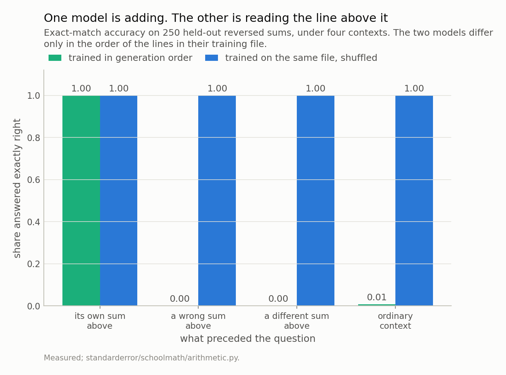
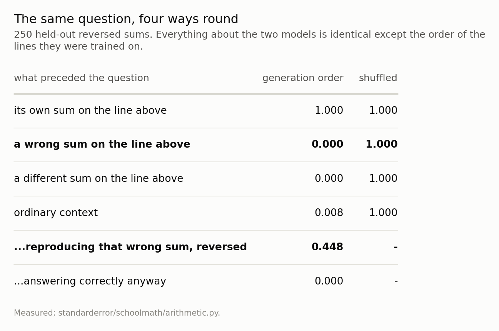
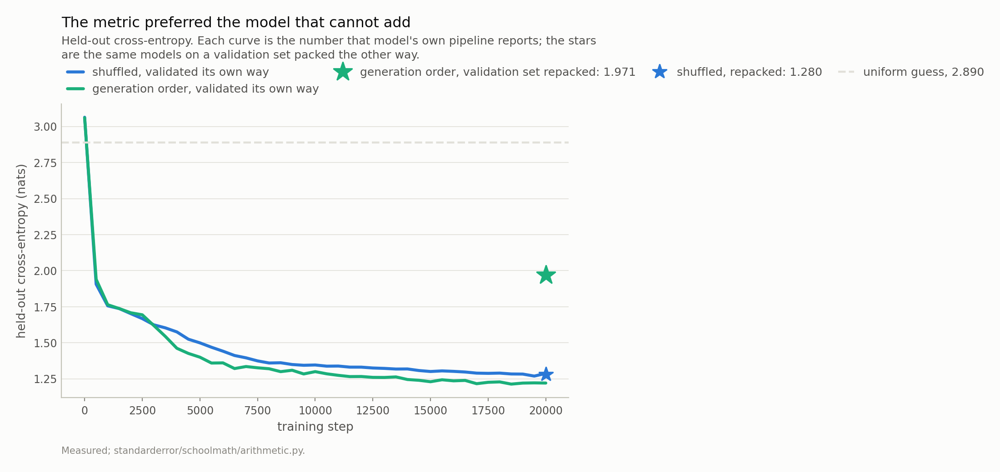
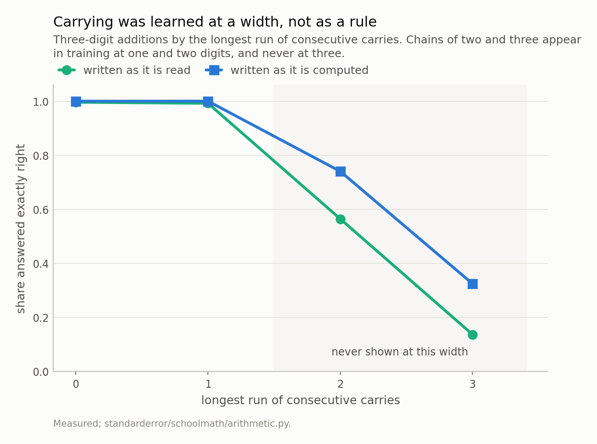

Disclosure: this post was written with the assistance of an AI system (Claude), which wrote the analysis code, ran the experiments and drafted the text. The topic, the constraints, the data choices and the final review are the author's.

*Two character transformers, identical in architecture, parameters, seed, steps, schedule and training problems. The one manipulated variable is the order of the lines in the training file. Packed in generation order, every reversed sum lands directly beneath the forward form of the same sum - 5,076 of 5,076, which is all of them - and 'reverse the line above' answers the question with no arithmetic. That model scores 1.000 on held-out reversed sums with the matching line above it and 0.008 under ordinary context; shown a deliberately wrong forward answer it reproduces that wrong answer, reversed, 45% of the time and the correct answer in 0 of 250 cases. Shuffling the same file fixes it completely. The held-out loss preferred the broken one - 1.2019 against 1.2737 - and it pointed the wrong way for the entire run, because a shortcut created by ordering survives any random split of the rows. Rescoring the same held-out problems packed the other way separates them by 0.7690 nats and costs one line. The honest model then fails somewhere far more interesting: it carries correctly at 0.992 on the chains it was shown and 0.136 on the ones it was not.*

Episode 1 of *School Maths, Taught Through What a Model Gets Wrong*. The syllabus and the other episodes: https://jongha-jeon-dev.github.io/standarderror/lectures/

## The question that does not work

The obvious question about a small model and school arithmetic is whether it can learn to add. It is the wrong question, and not because the answer is boring. It is wrong because you cannot tell from the outside which of two things happened: the model learned to add, or the model learned your file.

This episode is one experiment with one manipulated variable. Two character-level transformers, 804,096 parameters each, four blocks and four heads and a context of 64 — the same architecture the Calculus series in this project spent five episodes taking apart. Same seed, same 20,000 steps, same learning-rate schedule, same batch size, and the same arithmetic problems in the same splits.

The only difference is the order of the lines in the training file.

One of the two models cannot add. Its held-out cross-entropy is 1.2019 against the other's 1.2737 — it is the *better* number, for the whole run — and I want to be precise about that, because the reflex when someone describes a leak is to assume they were not watching the validation curve. I was watching it. It was pointing at the wrong model.

## What the corpus is

Six kinds of problem, one per line, in a character vocabulary of eighteen. Addition, subtraction and multiplication; order of operations; one linear equation in one unknown. And addition written twice — once forwards, the way it is read, and once with the answer's digits reversed, the way the schoolbook algorithm actually produces them:

```
123+456=579
123+456~975
```

The reversed form is there because it is the honest order. A child adding on paper starts at the units, and the digit they write first is the digit a left-to-right reader sees last. A model generating left to right has to commit to the leading digit before it has worked out whether anything carries into it. Those are opposite constraints, and giving the model both notations lets one model's two accuracies answer the question, rather than two training runs.

The hold-outs are structural. Three-digit additions whose carries *propagate* — a carry out of the units that forces a carry out of the tens — never appear at three digits in training, though they appear constantly at two. Four-digit operands never appear at all. So the probes ask for a rule at a size it was not demonstrated, which is the thing a curriculum assumes a child can do and is worth checking on a model.

## Before the model: a property of the file

Here is what I should have checked first, and did not. It needs no model and no GPU.

```python
from standarderror.schoolmath import arithmetic as ar

# A property of the training file. No model involved.
print(f"{'packing':18s} {'reversed':>9s} {'twin above':>11s} {'':>7s}")
for name, row in ar.twin_adjacency().items():
    print(f"{name:18s} {row['reversed_lines']:9,d} "
          f"{row['adjacent']:11,d} {row['share']:7.1%}")
```

```text
packing             reversed  twin above        
generation order       5,076       5,076  100.0%
shuffled               5,076           0    0.0%
```

Every reversed line in the generated stream sits directly beneath the forward form of the same sum. Not most of them: 5,076 of 5,076.

That is a shortcut and it is a complete one. `reverse the answer on the line above` solves the reversed task exactly, on every example, without representing addition in any way. It is also *cheaper* than adding, so a model under a gradient has every reason to find it.

I did shuffle. Every training batch is a randomly positioned 64-character window of the stream, which is the standard thing and which most people would call shuffling. It does not help here, and the reason is worth stating plainly: the adjacency is **inside the window**. Shuffling the order in which you visit windows does nothing about what is in one.

## Four ways to ask the same question

So: take the two models and ask them the same held-out reversed sums under four different contexts. The first puts the matching forward line immediately above the question. The second puts a *wrong* forward answer there. The third puts a different sum's line there. The fourth is ordinary text — a run of unrelated problems, which is what the model saw for the overwhelming majority of training.

```python
from standarderror.schoolmath import model as sm

clean = sm.load()                 # trained on the shuffled stream
leaky = sm.load(adjacent=True)    # same file, generation order
ab = ar.shortcut(clean, leaky, limit=250)

head = "what preceded the question"
print(f"{head:34s} {'gen order':>10s} {'shuffled':>9s}")
for arm in ab["shuffled"]:
    print(f"{arm:34s} {ab['generation order'][arm]:10.3f}"
          f" {ab['shuffled'][arm]:9.3f}")
print()
g = ab["generation order"]
print(f"shown a wrong sum, it reproduced that sum reversed: "
      f"{g['reproduced the wrong sum, reversed']:.3f}")
print(f"          ... and answered correctly anyway: "
      f"{g['answered correctly anyway']:.3f}")
```

```text
what preceded the question          gen order  shuffled
its own sum on the line above           1.000     1.000
a wrong sum on the line above           0.000     1.000
a different sum on the line above       0.000     1.000
ordinary context                        0.008     1.000

shown a wrong sum, it reproduced that sum reversed: 0.448
          ... and answered correctly anyway: 0.000
```

With its twin above it, the generation-order model is at 1.000. Take that one line away and it is at 0.008. The shuffled model does not care: it is at 1.000 in all four, because what is above it is not where its answer comes from.

The second arm is the one that settles it, and it is the reason the experiment has four contexts instead of two. A model that is adding has the right answer available no matter what nonsense precedes it. A model that is copying will copy the nonsense. Shown a forward line carrying a deliberately wrong sum, the generation-order model reproduced **that wrong sum, reversed**, 45% of the time — and produced the correct answer in 0 of 250 cases.

Those two rates together are the finding, not the first one alone. The other 55% is neither: inspecting them, they are mostly near-misses on the number it was shown rather than on the number it was asked for — a digit out of place in a copy, not a calculation gone slightly wrong. What is absent is the right answer, which was available the whole time to anything that was adding. It is not adding badly. It is not adding.



*With the matching forward sum directly above it, the generation-order model scores 1.000. Take that line away and it scores 0.008. The shuffled model stays at 1.000 in all four, because it is doing the arithmetic.*



*The **bold** row is the one that settles it. Shown a wrong forward answer, the generation-order model reverses the wrong answer - the right one was available by adding, and it did not add.*

## And the loss said it was the better model

```python
# The number that was supposed to catch this, both ways round.
table = ar.loss_table(clean, leaky)
print(f"{'model':18s}  {'its own packing':>16s}  {'repacked':>10s}")
for name, row in table.items():
    print(f"{name:18s}  {row['own packing']:16.4f}"
          f"  {row['repacked']:10.4f}")
```

```text
model                its own packing    repacked
shuffled                      1.2737      1.2797
generation order              1.2019      1.9709
```

Read the first column. That is what each pipeline reports about itself: you pack your validation set the way you packed your training set, because that is what a validation set is. The generation-order model reaches 1.2019 and the honest one 1.2737. The broken model is **0.0718 nats ahead**, and it is ahead for the whole run.

I had drafted this section around the claim that the loss stayed silent. It did not. Choosing between these two checkpoints on held-out cross-entropy — which is the thing everyone does — selects the one that cannot add, and does so by a margin that looks like a real improvement rather than a rounding error.

The reason is that the shortcut is available on the held-out stream as well. It was packed the same way. A random split of the *rows* cannot break a regularity that lives in the *order* of the rows, so the validation set inherits it intact, and a model exploiting it genuinely does predict the next character better. Nothing is malfunctioning. The metric is measuring what it says it measures.

Now the second column, which costs one line: score each model on the held-out problems packed the *other* way. The honest model does not notice — 1.2737 to 1.2797, a difference of 0.0059. The generation-order model goes to 1.9709, up 0.7690 nats.

So the loss was never the wrong instrument. It was pointed at one packing of the data, and the defect lived in the packing. Repacking the validation set is not a clever technique; it is the same estimator on a different arrangement of the same problems, and it separates these two models by 0.7690 nats where the standard arrangement separates them by 0.0718 in the wrong direction.



*On its own validation stream the generation-order model reaches 1.2019 against the honest model's 1.2737 - it is **ahead**. Repack the same held-out problems in the other order and it is at 1.9709 while the honest model barely moves, to 1.2797. That one-line diagnostic is the entire difference between the two readings.*

## What the honest model learned, and where it stops

Shuffling the same file — same problems, same splits, same everything else — produces a model that answers reversed sums under any context at all. On the held-out split it scores 0.996 on forward addition, 1.000 reversed, 0.988 on subtraction.

That is the boring part. Here is the interesting one.

```python
# What the honest model did learn, and where it stops.
for row in ar.carry_curve(clean, limit=250):
    flag = "held out here" if row["held_out"] else ""
    print(f"{row['task']:8s} chain {row['carry_chain']}"
          f"  n {row['n']:4d}  {row['accuracy']:.3f}  {flag}")
```

```text
add      chain 0  n  250  0.996  
add      chain 1  n  250  0.992  
add      chain 2  n  250  0.564  held out here
add      chain 3  n  250  0.136  held out here
add_rev  chain 0  n  250  1.000  
add_rev  chain 1  n  250  1.000  
add_rev  chain 2  n  250  0.740  held out here
add_rev  chain 3  n  250  0.324  held out here
```

At carry chains of 0 and 1 it is at 0.996 and 0.992. At a chain of 2 — one carry forcing the next, at a width where that combination was held out — it drops to 0.564, and at 3 to 0.136. It saw propagating carries constantly at two digits. It did not carry the rule across.

And then the same sums, with only the answer's direction changed, come back to 0.740 and 0.324. Same model, same weights, same held-out problems, same forward pass. The only difference is which end of the answer it has to produce first.

That is worth sitting with. Writing the answer in the order a person *reads* it requires deciding the leading digit before the carries beneath it have been resolved, which is a parallel problem. Writing it in the order a person *computes* it makes each digit depend on the one before, which is a sequential problem, and a sequential problem is what the architecture is shaped for. The error positions agree: in the reversed form the first character — the units digit, the one that needs no carry at all — is wrong 0.8% of the time, while 78% of the failures start at the second character, which is exactly where a carry first arrives.



*At chains of 0 and 1 the model is at 0.996 and 0.992. At a chain of 2 it is 0.564 and at 3 it is 0.136. Writing the answer least-significant-digit-first - the order the algorithm actually runs in - recovers it to 0.740 and 0.324, **with nothing else changed**.*

## Where this breaks

Several places, and the first one is the biggest.

**The shortcut is mine.** I generated this corpus, and I put the twins next to each other. I am not claiming that anyone else's training data has this particular defect, and a reader who takes "shuffle your corpus" as the lesson has taken the smallest available one — everybody already shuffles, and it did not help, because the standard kind of shuffling operates on the wrong thing. The transferable claim is narrower and worse: **a regularity in the order of your examples is invisible to any random split of them**, and templated, scraped, versioned or augmented corpora are full of order.

**Two runs differ by more than one thing, strictly.** The seed, steps, schedule, architecture and problem set are identical, but a shuffled stream and an unshuffled one put different characters in the window at step *n*, so the two runs do not see literally the same batches. What I can say is that the content is identical and the sampling procedure is identical; what I cannot say is that no other difference exists.

**The carry result is one model's.** 0.564 at a chain of two is a property of an 804,096-parameter model trained for 20,000 steps, not a theorem about transformers. A bigger model, or a longer run, may well carry the rule across. The *comparison* between the two answer orders is the durable part, because both numbers come from the same weights.

**The leaky model is not uniformly broken**, which is what makes it dangerous rather than merely wrong. Its forward addition scores 1.000 — the shortcut was only available for the reversed task, so it learned the rest more or less normally. A model that failed everywhere would have been caught in an afternoon.

## What to keep

1. Two models differing only in the order of the lines in their training file. One adds; the other reverses the line above it — including when that line is deliberately wrong, which it reproduces 45% of the time while producing the right answer in 0 of 250 cases.

2. Held-out loss did not merely miss it — it **preferred the broken model**, 1.2019 against 1.2737, for the whole run. The shortcut works on held-out data too, because the held-out data was packed the same way.

3. Random batching is not protection. The adjacency lived inside the 64-character window, and shuffling which windows you draw does nothing to what is in one.

4. Two diagnostics did work, and both are one line. **Repack the validation set** in a different order and score again: 0.7690 nats of separation where the standard packing gave 0.0718 in the wrong direction. And **vary the context** and see whether the answer moves — a model doing the arithmetic is indifferent to what precedes the question.

5. The control that settles it is the corrupted one. Feeding a *wrong* premise separates "computed it" from "copied it" in a way that feeding a right one never can.

6. On the honest model, carrying was learned at a width rather than as a rule: 0.992 on chains it saw at three digits, 0.136 on chains it did not.

7. And the same sums, written least-significant-digit-first, recover to 0.324 with nothing else changed. The order you ask for the answer in is not presentation.

## Exercise

Take a model you trained and a task it is good at. Build three contexts for the same question: the one your evaluation harness uses, one with unrelated content in front of it, and one containing a plausible but wrong answer to the question you are about to ask. Then compare the three accuracies.

If they agree, you have learned something solid and it cost you twenty minutes. If the third one is where the accuracy lives, your model has been reading rather than working, and no validation curve was ever going to tell you.

The uncomfortable version: do it on a benchmark rather than your own model. Contamination and context-copying produce exactly the same signature as competence when you only ever score the arm where the answer is nearby.

## Next

Episode 2 is the carry cliff on its own terms: why 0.136 and not zero, where in the answer the error lands, and what the reversed form is actually buying. It ends at a fourth digit, where both forms go to 0.000 and the model stops producing answers of the right length at all — which turns out to be a statement about place value rather than about addition.

---

### Data

- No external data, and in this episode not even a fetched corpus. The training text is arithmetic generated by `standarderror/schoolmath/curriculum.py`, deterministic in its seed, so a reader rebuilds the exact training stream from the source rather than downloading it.
- The models: two 804,096-parameter character-level transformers - four blocks, four heads, width 128, context 64, an eighteen-character vocabulary. Same architecture as the model the Calculus series takes apart. Both checkpoints, the training script and verified sha256s are committed: `standarderror/schoolmath/`, `scripts/train_schoolmath.py`, `data/schoolmath/`.
- Machinery: `standarderror/schoolmath/arithmetic.py`, tested in `tests/test_schoolmath.py`, which pins the carry chain against an independent implementation, the hold-outs against leakage, and both traps in this episode as regressions.
- Where this stops: the shortcut here is one I built, in a corpus I generated, and I am not claiming it is the shortcut in anyone else's data. The transferable part is the mechanism - a regularity in the *order* of the rows is invisible to a random split of the rows - and the diagnostic, which is to vary the context and watch whether the answer moves.

### Reproducibility

- **environment**: standarderror=0.1.0, python=3.11.15, torch=2.14.0, numpy=2.4.4
- **code blocks**: executed at build time; the values the prose quotes are pinned, so drift fails the build
- **models**: both committed checkpoints, hash-verified on load, so every accuracy is measured on the same weights
- **determinism**: `torch.manual_seed(0)` and an identical batch schedule for both runs; the corpus is deterministic in its own seed, and the shuffle that separates the two models is a fixed permutation

Code: <https://github.com/jongha-jeon-dev/standarderror>
