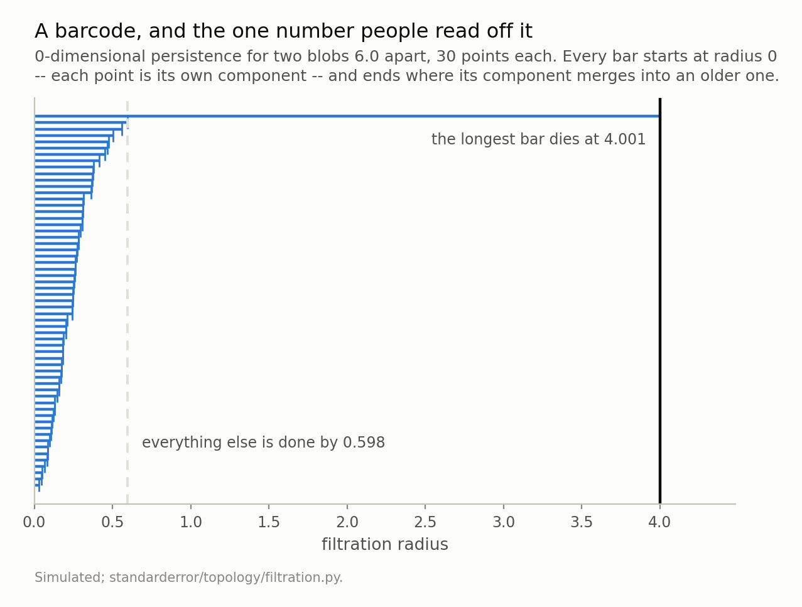
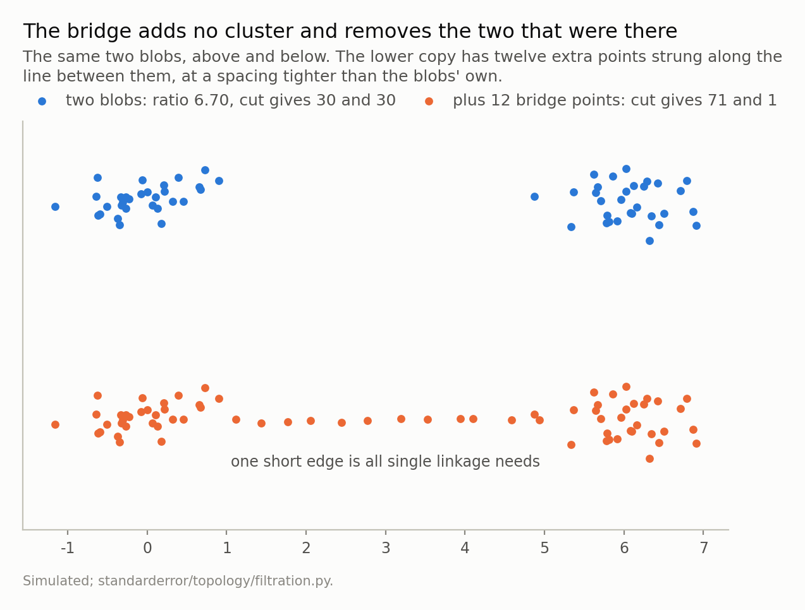
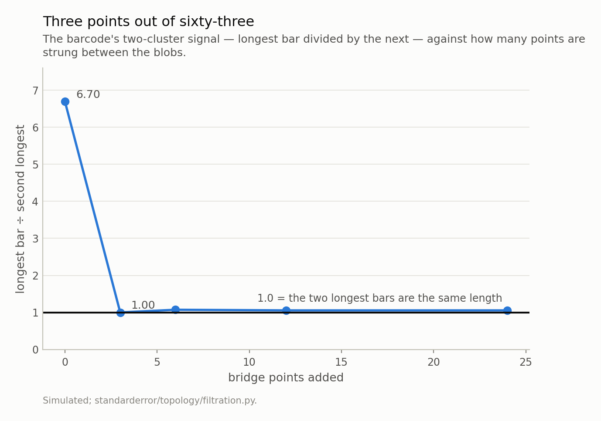
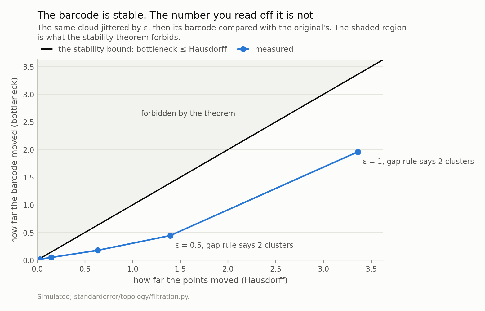
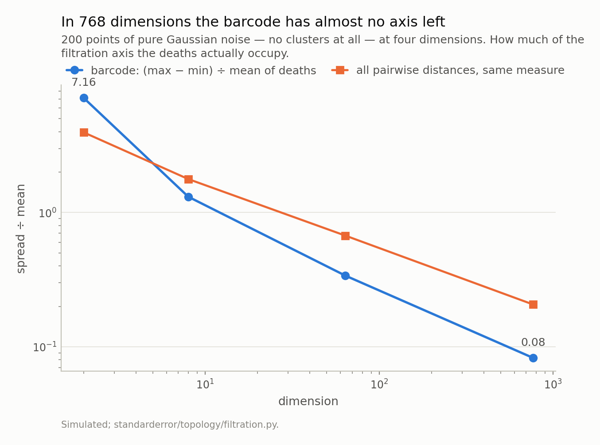

Disclosure: this post was written with the assistance of an AI system (Claude), which wrote the analysis code, ran the experiments and drafted the text. The topic, the constraints, the data choices and the final review are the author's.

*Persistent homology arrives with a large vocabulary and, in dimension zero, a very small computation: walk the edges shortest first and record the length of each one that joins two components. That is the single-linkage dendrogram's merge heights, and not approximately — the two return arrays that are equal float for float, on four designs from 12 to 60 points and 1 to 30 dimensions. Which settles both what H0 is for and what it inherits. Chaining: two blobs 6.0 apart give a longest bar of 4.00 against a second of 0.60, and three points along the line between them make those two bars the same length. The stability theorem is real and not vacuous — jittering by 0.5 moves the points 1.39 and the barcode 0.44 — but it protects the picture, not the answer: over forty noise draws the cluster count read off the largest gap comes back 2 in twenty-two of them and 3, 4 or 5 in the rest, with every barcode inside a bottleneck distance of 1.96.*

Episode 1 of *Topology for Language Models, Taught Through What Breaks*. The syllabus and the other episodes: https://jongha-jeon-dev.github.io/standarderror/lectures/

## A filtration is two choices, and the second one is a slider

Take a set of points and grow a ball of radius *r* around each one. At *r* = 0 nothing touches anything; as *r* grows, balls start to overlap, and two points get joined when their balls meet — which happens at *r* = *d*(*x*, *y*)/2, though by convention the filtration is indexed by the distance itself. Keep going and eventually everything is one blob.

That family of growing graphs is a **filtration**, and it is built out of exactly two decisions: a distance function, and where you stop. Neither is in the data.

Watch what happens to the connected components. Every point starts as its own component, so if there are *n* points there are *n* components at radius 0. Components merge as *r* grows, and each merge kills one of them — the younger, by convention. So the life of the component structure is a list: *n* bars, all born at 0, each dying at the radius where it merged, except for one that never dies.

That list is the **0-dimensional persistent homology** of the filtration, and drawing it is drawing a barcode.

```python
import numpy as np
from scipy.spatial.distance import pdist, squareform

def rips_h0(D):
    # Every point is its own component at radius 0. Walk the edges
    # shortest first; an edge joining two different components kills
    # the younger one, so its length is a death time. That is all of
    # 0-dimensional persistent homology.
    n = len(D)
    iu = np.triu_indices(n, 1)
    order = np.argsort(D[iu], kind="stable")
    parent = list(range(n))

    def find(a):
        while parent[a] != a:
            parent[a] = parent[parent[a]]
            a = parent[a]
        return a

    deaths = []
    for a, b, w in zip(iu[0][order], iu[1][order], D[iu][order]):
        ra, rb = find(int(a)), find(int(b))
        if ra != rb:
            parent[rb] = ra
            deaths.append(float(w))
    return np.sort(np.array(deaths))

# Six points you can check by eye: two triangles, far apart.
X = np.array([[0.0, 0.0], [1.0, 0.2], [0.6, 1.1],
              [4.0, 0.3], [4.8, 1.0], [4.3, -0.6]])
print(np.round(rips_h0(squareform(pdist(X))), 3))
```

```text
[0.949 0.985 1.02  1.063 3.002]
```

Six points arranged as two triangles, four metres apart. Four of the five deaths are around 1.0 — the within-triangle distances — and the fifth is at 3.002, which is where one triangle finally reaches the other. Five bars for six points, because the last component survives.

Here is the same picture for something with more in it.



*Fifty-nine bars for sixty points, because one component never dies. The gap between the longest bar (4.001) and the next (0.598) is a ratio of 6.70, and it is how a barcode says "two clusters". The rest of this episode is about how little it takes to erase that gap, and about the fact that the picture is provably stable while the number is not.*

So a barcode says "two clusters" by having one bar much longer than the rest, and the honest version of that statement is a ratio: 4.001 divided by 0.598 is 6.70. There is a range of radii — anywhere between those two numbers — at which exactly two components are alive, and the width of that range is the strength of the claim.

Everything else in this episode follows from one fact about how that list was computed.

## It is single-linkage clustering, and the same floats come back

Look again at what the code above actually does. It sorts the edges by length and walks them, and an edge only matters if it joins two components that were separate. That is agglomerative clustering where the distance between two clusters is the distance between their *closest* members — which is single linkage, and it has been in every statistics library for fifty years.

Not "is analogous to". The same numbers:

```python
# And it is not a new algorithm. It is the one in scipy, under the
# other name that computation has.
from scipy.cluster.hierarchy import linkage

for n, d, seed in [(60, 5, 0), (40, 2, 1), (25, 30, 2), (12, 1, 3)]:
    Y = np.random.default_rng(seed).standard_normal((n, d))
    D = squareform(pdist(Y))
    mine = rips_h0(D)
    theirs = np.sort(linkage(pdist(Y), method="single")[:, 2])
    print(f"{n:>3} points in {d:>2}d: {len(mine)} bars, "
          f"identical to scipy: {np.array_equal(mine, theirs)}")
```

```text
 60 points in  5d: 59 bars, identical to scipy: True
 40 points in  2d: 39 bars, identical to scipy: True
 25 points in 30d: 24 bars, identical to scipy: True
 12 points in  1d: 11 bars, identical to scipy: True
```

`array_equal` on four designs, from 12 points in one dimension to 60 points in five, with the maximum difference exactly `0.0`.

And it is not a coincidence to be admired, so here is why. Single linkage builds its dendrogram by repeatedly finding the shortest edge between two distinct clusters and merging them at that height. The union-find loop above walks *all* edges in increasing length and merges whenever it finds one between two distinct components — which, at the moment it merges, is the shortest such edge, because every shorter one has already been seen and was either inside a component or merged something else. So the two procedures merge the same pairs in the same order at the same heights. The union-find version simply notices that most edges can be skipped, which is why it is `O(E log E)` rather than a repeated minimum search.

The useful thing is what that lets you carry over. Every property of single-linkage clustering — good and bad, and there is a well-known bad one — is now a property of the 0-dimensional barcode.

It also answers the obvious next question, which is what the topology buys if the computation was already in scipy. Two things, and it is worth being precise about them. The barcode is a summary with a stability theorem attached, which a dendrogram is not usually treated as having; that is the next section, and it turns out to protect less than people think. And in higher dimensions there are features with no clustering analogue at all — H1 counts independent cycles, and no linkage rule has ever returned one. This series gets there. In dimension zero, though, the honest position is that persistence is a notation for something you already had.

## So it chains

Single linkage merges two clusters as soon as *any* pair of their points is close. It does not care that the rest of the two clusters are far apart, or that the close pair is a single point. This is called chaining, it is the reason single linkage is usually the *last* linkage anybody recommends, and it is now a fact about barcodes.

```python
# So whatever single linkage does wrong, a barcode does wrong. Two
# blobs six apart, and then a few points strung between them.
def two_blobs(bridge=0, gap=6.0, per=30, seed=0):
    rng = np.random.default_rng(seed)
    parts = [rng.standard_normal((per, 2)) * 0.5,
             rng.standard_normal((per, 2)) * 0.5 + [gap, 0.0]]
    if bridge:
        t = np.linspace(0.18, 0.82, bridge)[:, None]
        parts.append(t * np.array([gap, 0.0])
                     + rng.standard_normal((bridge, 2)) * 0.05)
    return np.vstack(parts)

for k in (0, 3, 12):
    d = rips_h0(squareform(pdist(two_blobs(k))))
    print(f"bridge {k:>2} (n={30*2+k:>2})  longest {d[-1]:.4f}  "
          f"second {d[-2]:.4f}  ratio {d[-1]/d[-2]:.2f}")
```

```text
bridge  0 (n=60)  longest 4.0012  second 0.5975  ratio 6.70
bridge  3 (n=63)  longest 1.8898  second 1.8878  ratio 1.00
bridge 12 (n=72)  longest 0.5975  second 0.5663  ratio 1.06
```

Three points. Not three percent of the data — three points out of sixty-three, adding no cluster of their own, placed along a line where nothing was before. The ratio goes from 6.70 to 1.00, which is to say the two longest bars are now the same length to three decimals and the barcode has no two-cluster claim left to make.



*Single linkage merges two components as soon as **any** pair of their points is close, so a chain of points at spacing 0.06 joins two blobs 6.0 apart. The longest bar falls from 4.001 to 0.598 — which is exactly the second bar of the cloud above (0.598), so nothing is left but the spacing inside a blob.*

At twelve bridge points it is worse than gone. The longest bar is 0.5975 — which is *exactly* the second bar of the unbridged cloud, 0.5975, so nothing survives but the spacing inside a blob — and cutting the tree at k = 2, which is what you do when you have decided there are two clusters, returns groups of size **71** and **1**. It shaves off one point.

That is the shape of the failure worth remembering. It does not return two wrong clusters. It returns a right answer to a question nobody asked, in the format of an answer to the question you did ask.



*From 6.70 to 1.00 on the addition of three points, and it never recovers. This is not a property of persistence; it is single linkage's chaining, which persistence inherits because — as the next section shows — they are the same computation.*

## The theorem that makes people trust this, and what it covers

There is a good reason persistence has a reputation for robustness, and it is a real theorem. Stating it needs one definition first.

Two barcodes are compared by **matching** their bars: pair each bar of one with a bar of the other, and where a bar has no partner, pair it with nothing — which for a bar `(0, d)` costs `d/2`, its distance to the diagonal of the persistence diagram. The cost of a matching is its single worst pair, and the **bottleneck distance** is the cheapest matching's cost:

$$
d_B(A, B) = \min_{\gamma} \max_{a} \lVert a - \gamma(a) \rVert_{\infty}
$$

A minimum over matchings of a maximum over pairs, which is worth saying twice because getting the two the wrong way round produces a number that is wrong in the direction that flatters you. (It is also worth checking against something that is not itself: `bottleneck_h0` in the repository is validated against brute-force enumeration on small barcodes, and the first version of it failed that test.)

The **stability theorem** then says that for two clouds `X` and `Y`,

$$
d_B\left(\mathrm{Dgm}(X), \mathrm{Dgm}(Y)\right) \le d_H(X, Y)
$$

where `d_H` is the Hausdorff distance between the clouds. Perturb your data a little and the barcode moves a little, with a bound and no assumptions whatever about the data.

That is worth having, and it is not vacuous. Jitter the cloud by ε = 0.5 and the points move by a Hausdorff distance of 1.3924 while the barcode moves by a bottleneck distance of 0.4425 — inside the bound with a factor of 3.1 to spare.



*Every measurement is inside the bound, and not narrowly: at ε = 0.5 the points move 1.392 and the barcode 0.443. That is a real guarantee about the picture. It is not a guarantee about the answer — at ε = 1.0, with the barcode still inside the bound, "clusters at the largest gap" goes from 2 to 2.*

Now read the theorem's statement again, because it is about the barcode. Nothing in it mentions the number you extract from the barcode, and that number is a different object with different behaviour.

The rule in practice is "count the bars above the biggest jump". Applied to forty independent noise draws at each level:

- ε = 0.0: **2** in 40 of 40 draws
- ε = 0.2: **2** in 40 of 40
- ε = 1.0: **2** in 22, **3** in 12, **4** in 3, **5** in 3
- ε = 1.5: **2** in 21, **3** in 6, **4** in 6, **6** in 1, **7** in 2, **8** in 2, **10** in 1, **11** in 1

At ε = 1.0 the modal answer is still 2, and it is the answer in only 55% of draws. At ε = 1.5 the same rule on the same cloud returns anything from 2 to 11.

And here is the part that settles it. Between those two levels the barcode has stopped moving: the largest bottleneck distance is 1.958 at ε = 1.0 and 1.958 at ε = 1.5 — the same number, because the barcode is pinned against the diameter of the cloud and cannot go further. The picture has converged. The integer read off the picture is running from 2 to 11.

```python
# The rule everybody applies to a barcode, and what a small jitter
# does to it. The barcode itself barely moves; the integer does.
def gap_k(deaths):
    return len(deaths) - int(np.argmax(np.diff(deaths)))

X = two_blobs(0, per=40)
rng = np.random.default_rng(1)
for eps in (0.0, 0.5, 1.0):
    Y = X + rng.standard_normal(X.shape) * eps
    d = rips_h0(squareform(pdist(Y)))
    print(f"eps {eps:.1f}   points moved by at most "
          f"{np.linalg.norm(X - Y, axis=1).max():.3f}   "
          f"clusters at the largest gap: {gap_k(d)}")
```

```text
eps 0.0   points moved by at most 0.000   clusters at the largest gap: 2
eps 0.5   points moved by at most 1.978   clusters at the largest gap: 2
eps 1.0   points moved by at most 2.707   clusters at the largest gap: 2
```

The stability theorem is true and the conclusion people draw from it is not. This is episode 7 of the linear-algebra series in a new notation: Eckart and Young settled which rank-*k* matrix is closest to yours and said nothing about *k*; Cohen-Steiner, Edelsbrunner and Harer settled how far a barcode can move and said nothing about how many bars to count.

## One more thing, before the series gets to embeddings

Everything above was two-dimensional, where a barcode is easy to read. The clouds this series is actually about have hundreds of dimensions, and something happens to the picture on the way there.

Take 200 points of pure Gaussian noise — no clusters, nothing to find — and ask how much of the filtration axis the deaths occupy: (max − min) divided by the mean.



*From 7.16 at two dimensions to 0.083 at 768: every bar is born and dies within a few percent of one radius. Nothing has gone wrong with the clustering — this is noise, so there is nothing to find — but the **display** has stopped being able to show a gap, which means "no clear gap in the barcode" is not evidence of no clusters in high dimensions.*

7.16 at two dimensions. 0.083 at 768. Every bar in that last barcode is born and dies within a few percent of one radius, so there is no visible structure in it — and there shouldn't be, because it is noise.

The problem is that this is a property of the *display* rather than of the data. In 768 dimensions a barcode with real clusters in it also has almost no dynamic range, which means **"there is no clear gap in the barcode" stops being evidence of anything.** That is the next episode: the separation H0 actually needs, against the dimension of the space the noise lives in, and the two answers you get depending on whether you measure it in absolute terms or relative ones.

## What to keep

1. A filtration is a metric and a scale. Both are choices, and neither is in the data.
2. H0 of a Rips filtration **is** the single-linkage dendrogram — `array_equal`, on every design tried. Thirty lines of union-find.
3. So it chains. Three points between two blobs take the two-cluster ratio from 6.70 to 1.00; twelve make the k = 2 cut return 71 points and 1.
4. The stability theorem is real: at ε = 0.5, Hausdorff 1.392 against bottleneck 0.443.
5. It says nothing about the cluster count. At ε = 1.0 that count is 2 in 22 of 40 draws and something else in the rest, with every barcode inside a bottleneck of 1.96.
6. And in high dimensions the barcode's own dynamic range collapses — 7.16 to 0.083 — so a flat-looking barcode is not evidence of a flat-looking cloud.

## Exercise

Take an embedding matrix you have — any set of vectors, from any model — and compute its H0 barcode with the thirty lines above. Then compute `scipy.cluster.hierarchy.linkage(..., method="single")` on the same distances and check that the merge heights are the same array.

If they are, you have learned that any topological clustering you were planning to do on those vectors is single linkage, and you can go and read about chaining instead of about homology.

Then do the harder version. Add ten points along the line between your two most distant clusters, at a spacing tighter than the clusters' own, and see what the barcode says. If your embeddings are dense enough that such points are already there — and in a real embedding space, between any two clusters, they usually are — that is the measurement, and it is telling you the answer before you started.

Next episode: how much separation H0 needs before it can find a cluster at all, and why that number rises with dimension in absolute terms and falls in relative ones.

---

### Data

- No external data. Every cloud here is constructed in the episode and every number is produced by the code shown, executed when this page was built.
- Machinery: `standarderror/topology/filtration.py`, tested in `tests/test_filtration.py`.
- Where this stops: Edelsbrunner and Harer, *Computational Topology* (AMS, 2010), for the filtration and the persistence pairing; Cohen-Steiner, Edelsbrunner and Harer, "Stability of persistence diagrams", *Discrete & Computational Geometry* 37 (2007), for the bound the third figure is drawn against; Carlsson, "Topology and data", *Bulletin of the AMS* 46 (2009), for the programme; and Chazal, Guibas, Oudot and Skraba, "Persistence-based clustering in Riemannian manifolds", *JACM* 60 (2013), for what is actually done about chaining.

### Reproducibility

- **environment**: standarderror=0.1.0, python=3.11.15, numpy=2.4.4, scipy=1.16.3
- **code blocks**: executed at build time; the values the prose quotes are pinned, so drift fails the build
- **simulation**: two 30-point blobs 6.0 apart for the chaining figures, 40 per blob for the stability ones, and 200 points of pure noise for the dimension sweep
- **determinism**: one generator per measurement, seeded from that measurement's own parameters rather than advanced through a loop

Code: <https://github.com/jongha-jeon-dev/standarderror>
