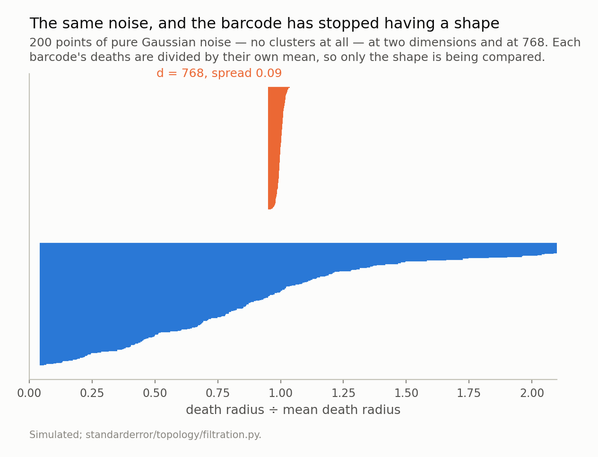
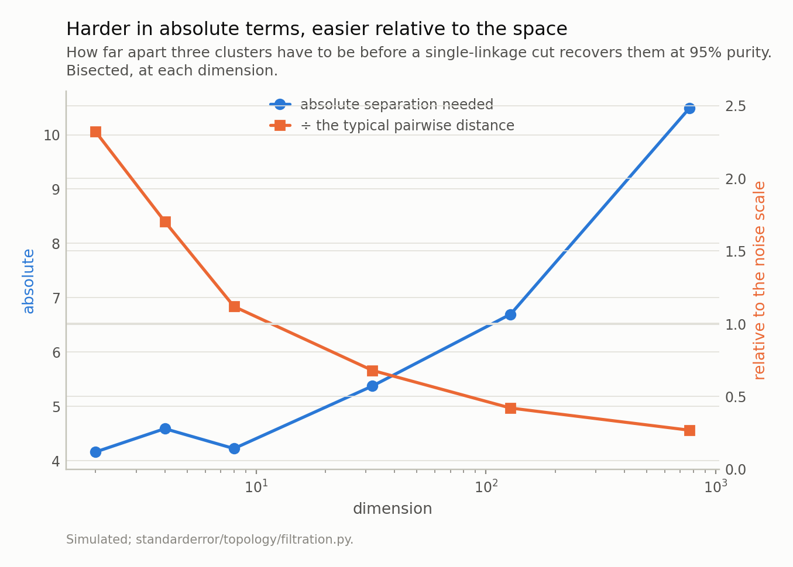
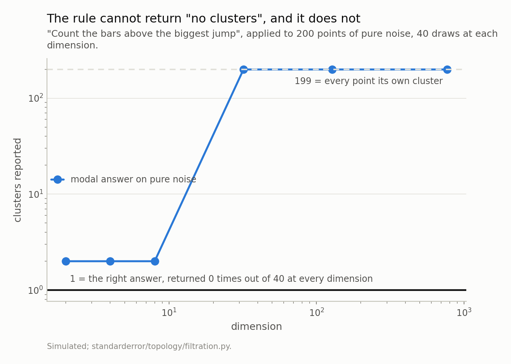
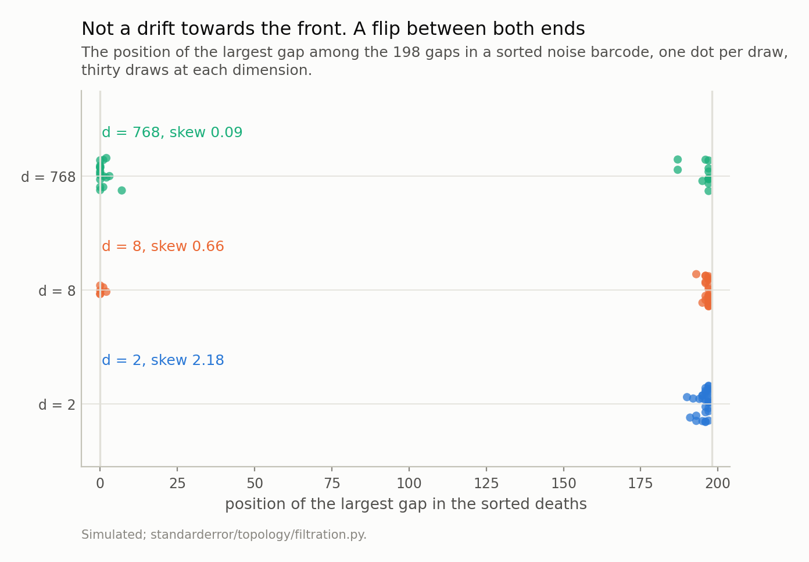
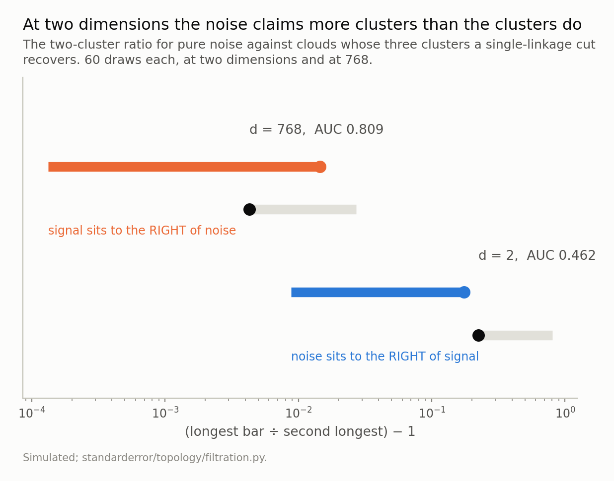
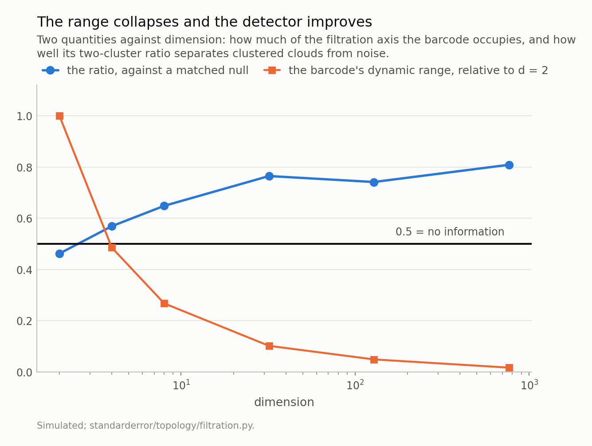

Disclosure: this post was written with the assistance of an AI system (Claude), which wrote the analysis code, ran the experiments and drafted the text. The topic, the constraints, the data choices and the final review are the author's.

*Three measurements, and the third one reversed the plan. First: the H0 death spread, as a fraction of its own mean, falls from 4.87 at two dimensions to 0.078 at 768 on pure noise. Second: the separation H0 needs to recover three clusters rises in absolute terms and falls relative to the scale of the space, 2.32 to 0.27, with every purity in the sweep above 0.99 — so the clustering is not what is going wrong. Third: the largest-gap rule reports "one cluster" zero times in forty draws of pure noise at every dimension, and its modal answer flips from 2 to n−1; while the two-cluster ratio read as an absolute number is not weak but inverted at low dimension — noise has a higher median than a cloud whose clusters are recovered perfectly, an AUC of 0.462, worse than a coin. Against a matched null the same ratio reaches 0.809 at 768 dimensions. The collapse of the dynamic range is what makes that possible.*

Episode 2 of *Topology for Language Models, Taught Through What Breaks*. The syllabus and the other episodes: https://jongha-jeon-dev.github.io/standarderror/lectures/

## What high dimensions do to a barcode, and what they do not

Episode 1 ended on a picture: 200 points of pure Gaussian noise, and a barcode whose bars all end within a few percent of the same radius. The obvious reading is that persistence stops working in high dimensions, and I planned this episode around it. That reading is wrong, and finding out how it is wrong took three measurements.

Start with the thing that is true. The quantity to watch is how much of the filtration axis the deaths occupy — the spread of the death times divided by their mean — because that is what a reader's eye is looking for when it looks for a gap.

```python
import numpy as np
from scipy.spatial.distance import pdist, squareform
from standarderror.topology.filtration import rips_h0

# Pure noise. No clusters, at any dimension.
print(f"{'d':>5}  {'mean death':>11}  {'spread / mean':>14}")
for d in [2, 4, 8, 32, 128, 768]:
    Y = np.random.default_rng([7, d, 0]).standard_normal((200, d))
    deaths = rips_h0(squareform(pdist(Y))).deaths
    spread = (deaths.max() - deaths.min()) / deaths.mean()
    print(f"{d:>5}  {deaths.mean():11.3f}  {spread:14.3f}")
```

```text
    d   mean death   spread / mean
    2        0.204           4.033
    4        0.729           2.040
    8        1.826           1.359
   32        5.664           0.438
  128       13.593           0.260
  768       36.814           0.087
```

That single draw loses a factor of 46 of its spread between the two dimensions, and as a median over fifteen draws at each dimension it is 62 — 4.87 at *d* = 2 against 0.078 at 768. The other column moves the opposite way: the mean death radius grows from 0.20 to 36.8 in that draw. The typical distance between two *points* does the same thing — 1.76 to 39.16, a factor of 22, as a median over the sweep — and it is that quantity, not the death radius, that the algebra below is about.

The collapse and the growth are the same fact, and it comes out of three lines of algebra worth doing because everything else in this episode is a consequence of them. For two independent standard Gaussian points in *d* dimensions, each coordinate of *x* − *y* has variance 2, so

$$
\lVert x - y \rVert^2 = 2 \chi^2_d, \qquad \mathbb{E} \lVert x - y \rVert^2 = 2d, \qquad \mathrm{Var} \lVert x - y \rVert^2 = 8d
$$

Take the square root. To first order a function *g* of a random variable has standard deviation |*g*′| times the original, so with *g* the square root,

$$
\mathbb{E} \lVert x - y \rVert \approx \sqrt{2d}, \qquad \mathrm{sd} \lVert x - y \rVert \approx \frac{\sqrt{8d}}{2\sqrt{2d}} = 1
$$

The mean grows like √*d* and the absolute spread tends to a **constant**, so the relative spread falls like 1/√(2*d*). Measured over 300-point clouds: the standard deviation is 0.917, 0.989, 1.005 at *d* = 2, 32, 768 — converging to 1 — and the relative spread is 0.0257 against a predicted 0.0255.

(The first version of that derivation dropped the factor of two in the delta step and predicted √2 for the standard deviation. The measurement said 1.005, which is how I found out.)

The figure below draws both barcodes with their deaths divided by their own mean, so that only the shape is being compared.



*At two dimensions the deaths spread over 4.03 times their own mean, and noise has visible structure — sparse patches, and therefore long bars. At 768 the spread is 0.087 and every bar ends within a few percent of the same radius. Which reads as bad news for the display, and turns out to be the reason the display becomes useful.*

Notice which one looks like it has structure. Two-dimensional noise has sparse patches, so it has long bars — a median two-cluster ratio of 1.1843 and a maximum, over forty draws, of 1.8908. Seven hundred and sixty-eight dimensional noise has none: median 1.0039, maximum 1.0168.

Hold onto that, because it is going to turn out to be the useful half.

## First measurement: the clustering is fine

Before blaming the display, check the method. How far apart do three clusters have to be before a single-linkage cut recovers them? Bisect for it, at each dimension, requiring 95% purity.



*The absolute separation rises from 4.16 to 10.49, which is the story people expect. Divided by the typical pairwise distance it falls from 2.32 to 0.27 — so relative to the scale of the space the clusters get **easier** to separate, and every purity in this sweep is at or above 0.989. Whatever is going wrong in high dimensions is not the clustering.*

In absolute terms the answer rises, from 4.16 at two dimensions to 10.49 at 768, and that is the story everyone expects from the phrase "curse of dimensionality". But the scale of the space rose too — the typical pairwise distance went from 1.79 to 39.20 — and dividing one by the other gives 2.32 at two dimensions falling to 0.27 at 768.

Relative to the space it lives in, the separation H0 needs *falls* by a factor of 8.7. And every purity in the detector sweep below is at or above 0.989. So single linkage is not the thing that breaks in high dimensions. It gets *better* at the job, measured against the only scale available to it.

Which leaves the summary.

## Second measurement: the rule cannot say "none"

The standard way to read a cluster count off a barcode is to find the biggest jump in the sorted deaths and count the bars above it. Ask it about a cloud with no clusters in it.

```python
# And what the usual rule says about that noise. It has one job --
# find the biggest jump in the sorted deaths -- and a sorted list of
# noise has a biggest jump, so it always finds one.
from collections import Counter

def gap_k(deaths):
    return len(deaths) - int(np.argmax(np.diff(deaths)))

for d in (2, 32, 768):
    ks = []
    for i in range(40):
        Y = np.random.default_rng([7, d, i]).standard_normal(
            (200, d))
        ks.append(gap_k(rips_h0(squareform(pdist(Y))).deaths))
    c = Counter(ks)
    print(f"d = {d:>3}   said 1 cluster: {c.get(1, 0)}/40   "
          f"modal answer: {max(c, key=lambda k: c[k])}   "
          f"range: {min(ks)}-{max(ks)}")
```

```text
d =   2   said 1 cluster: 0/40   modal answer: 2   range: 2-9
d =  32   said 1 cluster: 0/40   modal answer: 199   range: 2-199
d = 768   said 1 cluster: 0/40   modal answer: 199   range: 2-199
```

Zero out of forty, at every dimension. Not "rarely" — never. The rule's one job is to locate the largest gap in a sorted list, a sorted list of noise has a largest gap, and so the rule always finds clusters. It is structurally incapable of returning the right answer here, which is exactly the defect the scree-plot episode found in the elbow: a rule that reports a position in a list can never report that the list has no interesting position.



*Zero of forty draws returned 1 at any dimension. The rule locates the largest jump in a sorted list, and a sorted list of pure noise has a largest jump. What changes with dimension is only **where** it is: at d = 2 the modal answer is 2, and from d = 32 it is 199, because in a concentrated barcode the biggest gap is as often at the front as at the back — 18 draws of thirty against 10. This is the scree plot's elbow, which also cannot say zero.*

What changes with dimension is *where* the failure lands, and this is the one place where measuring it changed what I was going to say. I expected the largest gap to migrate steadily towards the front of the sorted deaths as the dimension rose. What it does instead is become bimodal — thirty draws at each of three dimensions below, one dot per draw, and the middle of the high-dimensional rows is empty.



*At d = 2 every one of the thirty draws puts the largest gap in the last ten positions, so the rule always answers 2. At d = 768 it is in the first ten 18 times and in the last ten 10 times, and in the whole of the middle 2 times. The skew of the death distribution is the mechanism: 2.18 at d = 2 against 0.09 at 768.*

The mechanism is one line of order statistics, and it is worth writing out because it also says *when* to expect the flip. For a sample of size *n* from a density *f*, the gap between neighbouring order statistics near a value *x* runs like 1/(*n* *f*(*x*)) — sorted values are sparse wherever the density is thin. So the largest gap in a barcode lands in whichever tail of the death distribution is thinnest. A right-skewed death distribution has exactly one thin tail, the long one on the right, and the gap goes there every time. A symmetric death distribution has two equally thin tails, and which one wins is decided by the draw.

That is measurable, so it does not have to stay a story. The skew of the deaths, as a median over the same thirty draws, is 2.18 at *d* = 2, 0.66 at *d* = 8, 0.14 at *d* = 32 and 0.09 at *d* = 768. Concentration is symmetrising the death distribution, which is the collapsing spread from the first section seen from another angle. And the position of the gap follows the skew rather than the dimension: at *d* = 2 it is in the last ten in 30 of 30 draws, at *d* = 8 — skew 0.66, halfway down — it is in the last ten 24 times and in the first ten 6, and by *d* = 768 it is in the last ten 10 times and in the first ten 18.

So the rule does not drift from one answer to another. It flips between the two most extreme answers available — 199 clusters or 2 — depending on which end of a noise barcode happens to have the bigger step, and that is exactly why `gap_rule_on_noise` reports a modal answer of 199 with a range of 2 to 199.

There is a silver lining in it. 199 clusters from 200 points is *obviously* wrong, and a wrong answer that looks wrong is far less dangerous than the plausible 2 you get in the dimension people draw their examples in.

## Third measurement, and it reversed the plan

So the rule is broken. What about the underlying number — the ratio of the longest bar to the next, which is what "this barcode strongly suggests two clusters" actually means?

Measure it on noise, and on clouds whose three clusters a single-linkage cut recovers.

```python
# The ratio people read as "how strongly does this say clusters",
# measured against a null built from the same shape of cloud. Noise
# versus three clusters that single linkage recovers.
from standarderror.topology.filtration import (
    separated_clusters, pairwise, purity)

def ratio(X):
    b = rips_h0(pairwise(X)).deaths
    return b[-1] / b[-2]

for d, sep in ((2, 5.4), (32, 7.0), (768, 13.6)):
    ns = min(3, d)
    noise = [ratio(np.random.default_rng([7, d, i]).standard_normal(
        (120, d))) for i in range(40)]
    sig, pur = [], []
    for i in range(40):
        X, lab = separated_clusters(d, sep, per=40, n_struct=ns,
                                    seed=300 + i)
        sig.append(ratio(X))
        pur.append(purity(pairwise(X), lab, 3))
    print(f"d = {d:>3}   noise median {np.median(noise):.4f}   "
          f"signal median {np.median(sig):.4f}   "
          f"clusters recovered: {np.mean(pur):.3f}")
```

```text
d =   2   noise median 1.1978   signal median 1.1711   clusters recovered: 0.992
d =  32   noise median 1.0191   signal median 1.0456   clusters recovered: 1.000
d = 768   noise median 1.0049   signal median 1.0166   clusters recovered: 1.000
```

Read the two-dimensional row again. Noise has a **higher** median ratio than the clustered cloud, on a cloud whose clusters that same run recovers at purity 0.992. The ratio is not a weak indicator at two dimensions; it is pointing the wrong way.



*Grey is noise, colour is the clustered cloud; the dot on each range is its median. At d = 2 the noise median is 1.2244 and the signal median 1.1749 — the wrong way round, giving an AUC of 0.462, worse than a coin, on a cloud whose clusters are recovered at purity 0.989. At d = 768 the numbers are tiny (1.0043 against 1.0145) and the AUC is 0.809. The absolute value of the ratio carries no information at either dimension; its position against a matched null carries more as the dimension rises.*

As a detector, scored by the area under its ROC curve, that is 0.462 at two dimensions — worse than a coin — and 0.809 at 768.

Which is the opposite of the episode I set out to write. The dynamic range does collapse; the barcode does stop having a readable shape; and the ratio gets *better*, monotonically, over the same range.

The reason is in the two numbers from the first section. Concentration squeezes the null much harder than it squeezes the signal. At two dimensions noise produces ratios anywhere from 1.0098 to 1.8908, so a real cluster structure has to clear a high and noisy bar. At 768 dimensions noise produces 1.0002 to 1.0168 — a null pinned into a band 53 times narrower — and a signal only has to clear that.

So the flat, structureless, unreadable barcode is not the problem. It is the reference.



*These move in opposite directions, and it is the same phenomenon. Concentration squeezes the null far harder than it squeezes the signal, so the barcode stops having a readable shape and starts having a usable reference. AUC 0.462 at d = 2 against 0.809 at d = 768, while the dynamic range falls by a factor of 62.*

## What this actually asks you to do

The recommendation follows from the shape of the failure rather than from taste, and it has two parts.

**Never read a barcode number absolutely.** There is no threshold on the two-cluster ratio that survives a change of dimension. At two dimensions a cutoff would have to sit near 1.22 to beat noise; at 768 dimensions every clustered cloud in this sweep is below 1.026. A rule of thumb calibrated on the examples in a tutorial — which are two- or three-dimensional, because they have to be drawable — is calibrated on the one regime where the quantity is anti-informative.

**Build the null from your own data.** Shuffle each coordinate independently, or draw from a Gaussian matched to your cloud's mean and covariance, compute the barcode fifty times, and ask where your real barcode's ratio falls in that distribution. That is one screenful of code, it costs fifty single-linkage runs, and it converts a number that carries no information into one that carries 0.81 of an AUC at the dimension embeddings actually live in.

And the thing not to do: conclude from a flat barcode that there is no structure. In 768 dimensions a cloud with three cleanly separated clusters produces a barcode with a median ratio of 1.0145. Flat is what structure looks like there.

## What to keep

1. The barcode's dynamic range collapses with dimension: 4.87 at d = 2 to 0.078 at d = 768, medians over fifteen draws.
2. The clustering does not. The separation H0 needs falls from 2.32 to 0.27 of the typical pairwise distance, and purity stays above 0.989.
3. "Count the bars above the biggest gap" returns "one cluster" zero times in forty draws of pure noise, at every dimension. It cannot say none.
4. Its modal answer on noise flips from 2 at d = 2 to 199 at d ≥ 32, because in a concentrated barcode the biggest gap is the first one.
5. The two-cluster ratio read absolutely is inverted at low dimension — AUC 0.462 — and improves with dimension against a matched null, to 0.809 at 768.
6. So build the null from your own data. The collapse of the dynamic range is what makes the null tight enough to be worth comparing against.

## Exercise

Take the embedding matrix from the last episode's exercise and compute its two-cluster ratio. Write the number down; it means nothing yet.

Now shuffle each coordinate of the matrix independently — this destroys every relationship between dimensions while keeping each dimension's marginal distribution exactly — and compute the ratio again. Fifty times. You now have a null distribution matched to your data in the only way that matters, and your original number has a position in it.

If it is inside the null, your barcode is telling you nothing, however large the ratio looked. If it is outside, you have a measurement, and its size is meaningless but its position is not.

Then do the part that is uncomfortable. Compare the null you just built with the null you would get from a Gaussian matched to your cloud's covariance. If those two nulls disagree, your answer depends on which one you chose — and that is the next episode, which is about the fact that the metric and the normalisation were decided upstream of any of this, and that they decide the filtration before the data gets a vote.

---

### Data

- No external data. Every cloud here is constructed in the episode and every number is produced by the code shown, executed when this page was built.
- Machinery: `standarderror/topology/filtration.py`, tested in `tests/test_filtration.py`.
- Where this stops: Beyer, Goldstein, Ramakrishnan and Shaft, "When is nearest neighbor meaningful?", *ICDT* (1999), for the concentration result the whole episode rests on; Aggarwal, Hinneburg and Keim, "On the surprising behavior of distance metrics in high dimensional space", *ICDT* (2001), for what it does to metric choice; Chazal and Michel, "An introduction to topological data analysis", *Frontiers in AI* 4 (2021), for the null-model practice this episode ends up recommending.

### Reproducibility

- **environment**: standarderror=0.1.0, python=3.11.15, numpy=2.4.4, scipy=1.16.3
- **code blocks**: executed at build time; the values the prose quotes are pinned, so drift fails the build
- **simulation**: 200 points of pure noise per draw for the null sweeps, 40 or 60 draws per dimension, and three 40-point clusters for the signal
- **determinism**: one generator per measurement, seeded from that measurement's own parameters — dimension and draw index — rather than advanced through a loop

Code: <https://github.com/jongha-jeon-dev/standarderror>
