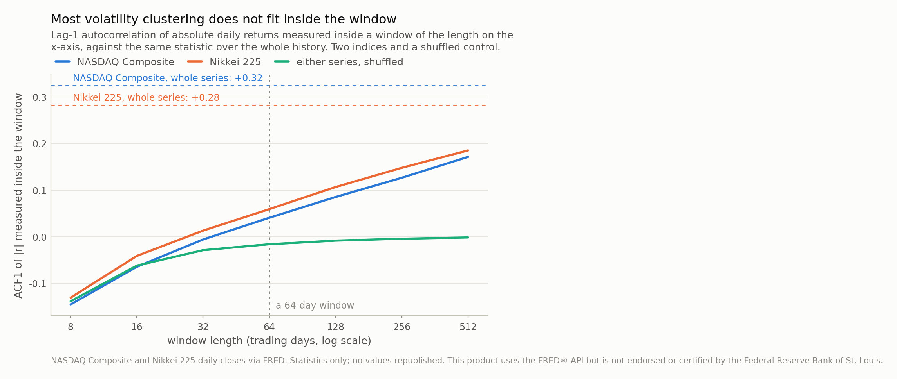
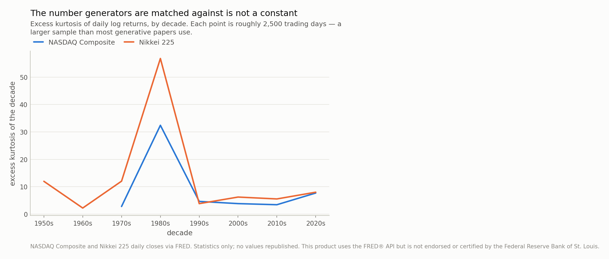

*Volatility clustering is the second thing anyone says about financial returns, and it is normally quoted as the lag-1 autocorrelation of absolute returns: **+0.32** for the NASDAQ Composite over 14,000 trading days since 1971, **+0.28** for the Nikkei 225 over 19,181 since 1949. Measured *inside* a 64-day window — the horizon generative models are trained and judged on — the same two series give +0.041 and +0.059, against a shuffled baseline near -0.016. About **18%** of the effect fits in the window. A previous post predicted this from a simulation; this is the real data, and it also says the number those models are matched against is unstable by a factor of 12 across decades and, on a ten-year sample, is decided by whether one Monday in 1987 is inside it.*

## A prediction from a simulation, and 33,000 days to test it on

Three posts ago I read a survey of diffusion models applied to finance and ran the
experiment it implied: train a small generative model on fixed-length windows of a
process whose answers are known, and see which stylised facts come back. One result
was awkward enough to be worth checking against reality.

A generator that emits 64-step windows can only represent dependence
that fits *inside* one. And at the volatility persistence an equity index normally
shows, I measured almost no clustering inside a short window — about
**+0.002** at 32 steps. If that carried over to real markets it
would mean something uncomfortable: that models trained on windows of this length are
being credited with reproducing a fact their architecture cannot express.

That was a simulation. This is not.

Two of the longest daily equity histories anyone publishes: the **NASDAQ Composite
from 1971**, 14,000 returns, and the
**Nikkei 225 from 1949**, 19,181 —
about 33,000 trading days between them, spanning 1987, 1990, 2000, 2008 and 2020.
Long enough that the tail events which decide these statistics are actually in the
sample.

## A fifth of it fits in 64 days

Volatility clustering is normally quoted as the lag-1 autocorrelation of absolute
returns, and on these series it is unmistakable:
**+0.32** for the NASDAQ,
**+0.28** for the Nikkei. Large moves arrive next to
large moves. Nobody disputes this and the data does not either.

Now measure the same statistic *inside* a 64-day window, averaging over
windows and never crossing a boundary. The NASDAQ gives **+0.041**.
The Nikkei gives **+0.059**.

Zero is the wrong thing to compare those to, because the lag-1 estimator is biased
downwards in short samples: shuffle the same returns and the within-window statistic
reads about -0.018. So for the NASDAQ the clustering genuinely
visible inside the window is +0.041 minus that baseline, or
**+0.059** — which is **18%** of the
+0.32 the same series shows over its whole history. The
Nikkei's own baseline-corrected figure is +0.073, or
26%.

Correcting for the baseline is the generous choice, and deliberately so: taken raw,
without crediting the model for the estimator's downward bias, the NASDAQ's
within-window clustering is 13%
of the headline number rather than 18%.

So the prediction held, and if anything it was conservative. Volatility clustering at
this horizon is mostly a statement about *which window you are in* — whether this
quarter is 2008 or 2017 — rather than about what happens from one day to the next
inside a quarter. The autocorrelation everyone quotes is dominated by the slow drift
of the volatility level across years, and a generator that emits one quarter at a time
never sees that drift.

Which makes window length a modelling decision of the first order rather than a
detail in a table. At 64 days a model is being asked for
18% of the effect; at 512 days, by the same measurement, it
would be asked for about
54%.

*Fig 1. Volatility clustering as normally quoted is the dashed line: **+0.32** for the NASDAQ over 14,000 days, **+0.28** for the Nikkei over 19,181. Inside a 64-day window — the horizon generative papers train on — the same series give +0.041 and +0.059, against a shuffled baseline of about -0.016. Net of that baseline the NASDAQ's within-window clustering is +0.059, which is 18% of the effect the dashed line reports. The curves only reach the dashed lines somewhere past the right edge of this chart.*

## An outside check on the persistence

That story rests on volatility moving slowly, so it is worth confirming from an
instrument that measures volatility directly rather than inferring it from returns.

The VIX is the options market's own estimate of the next month's volatility. Over
9,254 daily observations from 1990, its **lag-1
autocorrelation is +0.977**.

That is about as persistent as a financial series gets, and it is the number the
simulation assumed. Today's expected volatility is very nearly yesterday's. A process
that persistent barely moves within a quarter, which is exactly why so little of its
autocorrelation shows up inside a 64-day window — and it confirms the
mechanism from data that never entered the calculation above.

## And the number being matched is not a constant

Generative papers report matching an index's kurtosis. Real data has an opinion about
that phrasing.

Over its whole history the NASDAQ's excess kurtosis is
**9.4**. Split by decade — each about 2,500 trading
days, a *larger* sample than most such papers use — it runs from
**2.8** to **32.4**. The Nikkei
runs from 2.2 to 56.8. Factors of
12 and
26.

Both maxima are the 1980s, and both are essentially one week of the 1980s. Remove
October 1987 from the NASDAQ and remove the end of the Nikkei bubble, and the two
series look like their other decades. A fourth moment is a statistic about the largest
few observations, so a decade containing a crash and a decade not containing one are
not measuring the same quantity.

At realistic sample sizes it stops being a matter of degree. Take
400 contiguous ten-year stretches of NASDAQ history at random
start dates — ten years being a common sample — and the excess kurtosis does not come
out uncertain. It comes out **binary**.

The distribution is two-humped. The 81 samples that
contain **19 October 1987** average 29.2; the
319 that do not average
6.0. Every single sample above
13.2 contains that day and not one below it
does — one date classifies the estimate perfectly. The Nikkei splits the same way,
6.5 against
29.7, because October 1987 was global —
though its two humps overlap slightly rather than separating cleanly, so the exactness
is a property of one series and not a law.

So "the excess kurtosis of the NASDAQ over ten years" is not a market property measured
with error. It is a **yes/no question about one Monday**, and which answer you get
depends on a start date nobody chose for statistical reasons.

The mechanism is sample length rather than the crash itself, and that is the useful
part. Delete the same eight days from the full 14,000-day history and
the kurtosis moves only from 9.4 to
8.7. One week out of fifty-five years is
negligible; one week out of ten years decides the answer. A fourth moment needs a
sample long enough that no single week is pivotal, and ten years of daily data is not
that sample.

Two-year samples fail in the opposite direction: they average
4.3, *below* the full-history figure, because the
events that create a fourth moment are usually not in a two-year window at all. A
model matched to a two-year sample has been matched to a market with thin tails.

*Fig 2. Over the whole history the NASDAQ's excess kurtosis is 9.4 and the Nikkei's 9.7. By decade the NASDAQ runs from 2.8 to 32.4 and the Nikkei from 2.2 to 56.8 — factors of 12 and 26. Both spikes are the 1980s, and both are one week of it. A model matched to 'the kurtosis of the index' has been matched to a choice of sample period.*

*Fig 3. This distribution is not wide, it is **two-humped**, and the gap between the humps is a single trading day. Of the 400 NASDAQ samples, the 81 that contain 19 October 1987 average 29.2 and the rest average 6.0 — a perfect separation: every sample above 13.2 contains that day and none below it does. The Nikkei splits the same way, 6.5 against 29.7, because October 1987 was global — though its humps overlap slightly rather than separating cleanly. And the mechanism is sample length, not the crash: deleting that whole week from the full 14,000-day history moves the kurtosis only from 9.4 to 8.7.*

## The control that behaved on simulated data and not on this

Running the same battery on real indices turned up one thing I did not expect, and it
is a correction to the previous post rather than an extension of it.

| series and generator | excess kurtosis | ACF1 of \|r\| | ACF1 of r | leverage |
|---|---|---|---|---|
| NASDAQ — the series | 9.0 ± 0.8 | 0.045 ± 0.007 | 0.096 ± 0.008 | -0.074 ± 0.006 |
| NASDAQ — shuffled | 9.0 ± 0.7 | -0.006 ± 0.005 | -0.017 ± 0.005 | -0.004 ± 0.005 |
| NASDAQ — blocks of 16 | 9.7 ± 0.8 | 0.155 ± 0.007 | 0.034 ± 0.006 | -0.079 ± 0.006 |
| Nikkei — the series | 11.2 ± 1.7 | 0.064 ± 0.007 | 0.014 ± 0.006 | -0.075 ± 0.007 |
| Nikkei — shuffled | 8.9 ± 0.9 | -0.020 ± 0.005 | -0.016 ± 0.005 | 0.002 ± 0.005 |
| Nikkei — blocks of 16 | 11.2 ± 1.3 | 0.136 ± 0.007 | 0.011 ± 0.006 | -0.070 ± 0.007 |

The shuffle behaves as designed: it reproduces the kurtosis — because it *is* the
return distribution — and destroys the clustering. Fine, and the same as on simulated
data.

The **moving-block bootstrap does not**. On the GARCH path the simulated version of
this experiment used, blocks of 16 matched the truth almost exactly. Here they
*overshoot*: +0.155 against the
series' own within-window +0.045 for the
NASDAQ, and +0.136 against
+0.064 for the Nikkei.

The mechanism is worth spelling out because it is the same one as the headline result.
The bootstrap draws 16-day blocks from anywhere in fifty years, so a block from
2008 can land next to a block from 2017. Inside the stitched window, |r| is large for
sixteen days and then small for sixteen days — a step function. A step function has
strong lag-1 autocorrelation. So the block bootstrap does not preserve this market's
clustering; it manufactures a caricature of it, and the caricature scores higher than
the real thing.

That is only possible because real volatility moves *slower* than the block length,
which is the same fact as Fig 1. On the simulated path, persistence was low enough
that a block contained real variation and the splice added nothing.

One more column worth reading: **leverage**. Real indices have one — a negative return
is followed by a larger absolute move, -0.074
and -0.075 here. The symmetric
simulation had none by construction, and the shuffle destroys it. So on real data that
row carries information, and on the simulated data it did not. Which row is
informative depends on the process, and you cannot tell from the table.

## What this changes

**Report the window length next to any clustering claim, and report what fraction of
the full-sample statistic that window can hold.** It is two lines of code and, on this
data, the difference between claiming an effect of +0.32
and one of +0.059.

**Give the target an error bar and a sample period.** "Excess kurtosis 9.4" is a
property of 14,000 days ending in 2026. On
ten years it could have been anything from 3.5 to
30.5.

**Do not carry a control across datasets without re-checking it.** The block bootstrap
is a good baseline on a fast-mixing process and an actively misleading one here, and
nothing about the code changed between those two cases.

**And be careful which direction the fix runs.** None of this says windowed generative
models are useless. It says the *evidence* usually offered for them — a stylised-facts
table at a 64-day horizon — is weaker than it looks, and that a longer window or an
explicit volatility state would let a model be judged on the effect people actually
mean. That is a design suggestion, not a verdict.

## Where to be careful

**Two indices, and both are equity.** Neither is Korean, neither is intraday, and
neither is a single stock. The mechanism — slow volatility versus a short window —
should hold anywhere volatility is persistent, and the specific fractions should not
be assumed to.

**Lag-1 only.** Volatility clustering has structure at many lags and I have measured
one. A longer-lag measurement would show more of the effect inside a window, though
the direction of the argument does not change: whatever the lag, a window of
64 days cannot express dependence that operates over years.

**The NASDAQ has positive return autocorrelation within windows here**
(+0.096), which the efficient-market
version of the stylised facts says should be zero. Much of that is the 1970s, before
the market microstructure that removes it. I have not decomposed it, and it does not
touch the clustering result.

**Sample periods overlap.** The ten-year stretches in Fig 3 are drawn at random start
dates from one history, so they share data and the shape of that distribution is a
statement about this history rather than about ten-year windows in general. The
NASDAQ's separation on 19 October 1987 is exact; the Nikkei's humps overlap slightly
(11.7 against
12.8), so "perfectly classified" is a claim
about one series and not a law.

**And the previous post's conclusion about the block bootstrap was wrong for real
data.** I am leaving it as written there and correcting it here, because the useful
thing is that the same code gave opposite answers on simulated and real inputs, and
that is only visible if both are on the record.

---

### Data

- NASDAQ Composite daily close (NASDAQCOM), 1971-02-08 to 2026-08-18, 14,000 usable daily log returns; Nikkei 225 daily close (NIKKEI225), 1949-05-17 to 2026-08-19, 19,181 returns; CBOE Volatility Index (VIXCLS), 1990-01-02 to 2026-08-18, 9,254 daily levels. All via FRED, Federal Reserve Bank of St. Louis, downloaded 20 August 2026. This product uses the FRED® API but is not endorsed or certified by the Federal Reserve Bank of St. Louis.
- These series are not redistributable, so this post publishes statistics and never values: no return series, no dated observation, and no minimum or maximum, which are the most identifying values a return series has. Every figure plots a statistic against a parameter rather than a series against time. Input files are git-ignored and recorded by sha256 in the reproducibility notes.
- Loaded by `standarderror.sources.prices.load_prices`, which handles FRED's bare '.' for non-trading days, and reduced to statistics by `publishable_statistics`. Battery and controls from `standarderror.generative.stylised`, the same code the simulated version of this experiment used.

### Reproducibility

- **seed**: 20260804
- **environment**: standarderror=0.1.0, python=3.11.15, numpy=2.4.4, scipy=1.17.1, pandas=3.0.2
- **vintage_sha256**: NASDAQCOM: e1c0e32623619757, NIKKEI225: 13336bbc172c3dbb, VIXCLS: 4e9eab59bc1b650e
- **returns**: log returns in percent, `100 * diff(log(close))`, with non-trading days dropped rather than bridged, so no return spans a market holiday
- **within_window**: lag-1 correlation of |r| computed inside each window and averaged over windows, never across a window boundary; windows strided by 8 days
- **shuffled_baseline**: the same statistic on a permutation of the same returns; it is negative rather than zero because the lag-1 estimator is biased downwards in short windows, which is why zero is the wrong reference
- **kurtosis_spread**: 400 contiguous stretches per sample size at random start dates, because a real sample is a stretch of history and a random subset would understate the dependence between observations
- **block_sweep_nasdaq**: block 2: +0.118, block 4: +0.169, block 8: +0.177, block 16: +0.155, block 32: +0.113, block 64: +0.054
- **vix_check**: VIX level lag-1 autocorrelation +0.977 over 9,254 days, an independent read on the persistence the simulated version of this experiment assumed
- **cost**: about 6 seconds, cached under a hash of the configuration and of the input file bytes, so a new data vintage recomputes automatically

Code: <https://github.com/jonghajeon/standarderror>
