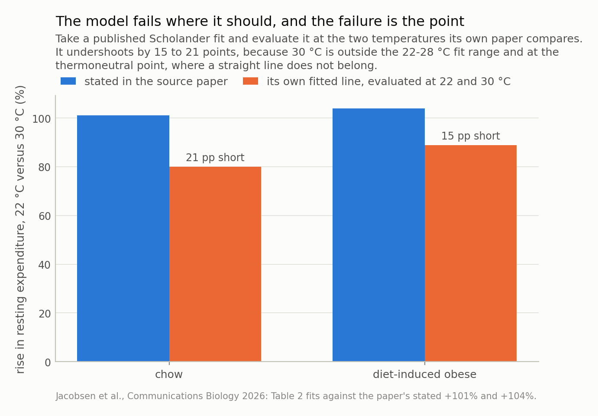

*On 21 August 2026, Berkeley announced that TOFA, an oral small molecule, made obese mice lose fat and not muscle, with energy expenditure **18% higher** and body temperature unchanged. A mouse in a metabolic cage does almost no external work, so that is a statement about heat **produced** beside a statement about heat **stored** — and heat produced but not stored has left. The required increase in heat loss equals the reported increase in expenditure **exactly**, independent of every physiological constant. Below its thermoneutral point a mouse also defends its temperature by making heat, so extra heat should displace that rather than add to it: the model predicts a rise of 0%, 0% and 18% at the paper's 4, 23 and 30 °C. Reported: 4%, 18%, 18%. The warm point matches exactly and **23 °C is 18 points out** — a gap that constant heat loss could only close with 2.3–3.2 °C of warming, which the paper's own thermometer excludes.*

## The claim, and the credit it deserves

On 21 August 2026 Berkeley announced that TOFA, an oral
acetyl-CoA carboxylase inhibitor, drove fat loss without muscle loss in
diet-induced obese mice. The paper landed in Science Advances the same week. Its
quantitative core is one sentence: energy expenditure rose about
18% in treated mice, with no change in body temperature.

Before anything else, the protocol deserves saying out loud, because most of what
follows would be a cheap shot otherwise. Expenditure was measured at **three** ambient
temperatures — 4, 23, 30 °C. It was adjusted
by ANCOVA with lean and fat mass as covariates, not divided by body weight. Body temperature was measured
and reported, with a p-value (0.971). Brown-fat and browning genes were
checked and found only marginally moved. Faecal energy was measured to rule out
malabsorption. That is a better protocol than this literature usually runs, and the
three-temperature design in particular is what makes the rest of this post possible.

The press release, separately, says "cells burn up to 18% more energy with no change
in physical activity" — which cannot be right, since cells do not have physical
activity. The 18% is whole-animal calorimetry. The cell work is
real but carries no percentage. That is a release-writing problem, not a paper problem,
and it is the last time this post will mention it.

## One sentence, two constraints

"Expenditure rose 18% and temperature did not move" reads like
one measurement. It is two, and they are not independent.

A mouse in a metabolic cage does almost no external work — it is not lifting anything
or going anywhere. So essentially all the energy it turns over leaves as heat, and a
reported 18% rise in energy expenditure is a reported
18% rise in **watts of heat produced**. That is the first
constraint, and it is just the first law.

The second is that heat has to go somewhere. In steady state it leaves at a rate set
by the gradient to the room: **H = C (T_body − T_ambient)**, Scholander's model, with
`C` the thermal conductance. A flat body temperature is a statement that **no heat was
stored**. Put the two together and
**EE′/EE = C′(T_b′ − T_a) / C(T_b − T_a)**, so exactly one of three things has to be
true: core temperature rose, conductance rose, or the animal was not in steady state.

The second option has a property worth pausing on. At fixed body and ambient
temperature the bracket cancels, and

**dC / C = dEE / EE, exactly.**

The required increase in heat loss equals the reported increase in expenditure, and no
value of the conductance appears. That matters because `C` is the constant this
literature agrees on least: the four published mouse fits used here run from
16 to
30 mW/°C
depending on whether the fit used resting or total expenditure and whether the cage
had bedding. Nearly a factor of two, and the headline answer does not care.

## First control: is the 18% real?

Before asking what the number implies, it is worth trying to break it. The standard way
an expenditure effect appears out of nothing is normalisation.

Expenditure is roughly linear in body mass with a **non-zero intercept**:
`EE = a + b·m`. So the ratio `EE/m` is `a/m + b`, which falls as mass rises. Dividing
by body weight therefore hands the lighter group a higher number for free — and a drug
that causes weight loss makes its own treated group lighter. This is old and
well-documented, and it is why Tschöp and colleagues told the field in 2011 to use
ANCOVA with mass as a covariate instead.

Simulating it: with expenditure linear in mass, 2,000 experiments per point,
8 animals a group, and **a true effect of exactly zero**, per-gram normalisation
reads +8.7% at this study's 18% weight
loss. About half the headline, from arithmetic alone. ANCOVA on the same data reads
+0.5%.

The paper used ANCOVA, with lean **and** fat mass as covariates. So the
18% survives the obvious objection, and the rest of this post is
worth writing. It is also worth noting how the figure legend puts it — calorimetry was
run "when body weight between groups reached significance" — so the groups did differ
in weight at measurement, and the adjustment was doing real work rather than
decorating.

*At this study's 18% weight loss, per-gram normalisation reads +8.7% out of a true effect of exactly zero — about half the headline. ANCOVA reads +0.5%. The paper used ANCOVA with lean and fat mass as covariates — both, not just body weight — so the 18% survives the obvious objection, which is why the rest of this post is worth writing.*

## What a thermostat does to a drug's apparent effect

Now the part that makes the three-temperature design pay off.

Below its thermoneutral point a mouse is cold, and it defends its core temperature by
burning fuel to make heat. That thermoregulatory heat is a **regulated** quantity: the
animal makes exactly as much as the gradient demands. So a drug that produces heat by
some *other* route does not add to it. It displaces it. The mouse turns its
thermogenesis down by the same number of watts, total heat production is unchanged, and
**the calorimeter sees nothing**.

At or above the thermoneutral point there is no thermogenesis running, nothing to give
back, and the whole drug effect appears — and must then be dissipated or stored.

So the prediction runs opposite to the intuition. A heat-producing drug looks
**smallest** where thermogenesis is largest. Against the paper's three temperatures:

| ambient | expenditure | share thermoregulatory | predicted rise | reported rise | gap |
|---|---|---|---|---|---|
| 4 °C (cold) | 0.81 W | 74% | +0% | +4% | +4 pp |
| 23 °C (room) | 0.37 W | 44% | +0% | +18% | +18 pp |
| 30 °C (thermoneutral) | 0.21 W | 0% | +18% | +18% | +0 pp |

The warm point matches exactly, which it must — at
30 °C the thermoregulatory share is zero, so the
model has no freedom there. The cold point nearly matches:
4% observed against 0% predicted, with
74% of expenditure available to absorb the effect.

**23 °C is 18 points out.** At room temperature the model says
44% of this mouse's expenditure is thermoregulatory:
163 mW of heat it was making on purpose, against a
drug contribution of 38 mW. Four times more thermogenesis
than the effect needed to hide in — and it did not hide.

One correction falls out of the same model. The paper reads the small cold-exposure
effect as evidence *against* a thermogenic mechanism: if TOFA worked through
thermogenesis, the argument goes, it should have shown up in the cold. The thermostat
says a small effect in the cold is what extra heat of **any** origin predicts, because
the regulated component absorbs it either way. That datum cannot separate the two
hypotheses. It is the 30 °C point that carries the
information, and there the paper's own reasoning is right.

*At 30 °C the model and the report agree exactly, because there is no thermogenesis left to displace. At 4 °C they nearly agree. At 23 °C the model says 44% of expenditure is thermoregulatory and could have absorbed the whole effect — so the reported 18% needs an explanation the thermostat does not supply.*

## So where did the heat go?

Three candidate resolutions for the 23 °C gap, and two of them can be closed.

**Core temperature rose.** At constant conductance the requirement is
2.3–3.2 °C, the range coming from whether you take the gradient to
measured core temperature (35.6 °C) or to the fitted line's x-intercept
(40.6 °C). Either way that is frank hyperthermia, well
above the 1.1 °C a mouse swings across its own day.
The paper's null is weak — with a rectal probe at published precision and
8 animals a group it can only exclude differences above 0.56 °C, and
telemetry would manage 0.21 °C — and it is still comfortably strong enough to
exclude 2.3 °C. **Ruled out, by the paper's own measurement.**

**The animal was not in steady state.** Over a four-day recording, no.

**Heat loss rose.** What is left, and the requirement is
18% — the same number as the expenditure rise, by the
cancellation above. Is that a lot? A dead mouse loses heat about
5.2 times faster than a live one at the same gradient, because
most of a mouse's insulation is vasomotor and postural rather than structural. So the
18% needed here is about
4% of the range the animal can traverse by
dilating its tail vessels, flattening its fur, changing posture, or using its nest less.
Physiologically trivial. Also completely unrecorded.

And it is not only the 23 °C reading. Invert each temperature at the rise reported
*there* — 4% in the cold,
18% at thermoneutrality — and the requirement is
1.3–1.5 °C
and 1.0–1.9 °C.
All six numbers exceed both detection limits. So heat loss must have risen at every
temperature the study ran, and the anomaly at 23 °C is a question about the
*mechanism*, not about whether the conclusion holds.

That is the finding. The study measured heat production and heat storage, and the two
together determine heat loss — so the experiment already contains the answer, in the
form of a number nobody wrote down. Tail temperature, skin temperature, posture scoring
or nest use would each have pinned it, and none is standard.

*The reported null on body temperature is weak — a rectal probe on 8 mice per group cannot see 0.56 °C — and it is still comfortably strong enough to exclude the 2.3–3.2 °C that constant heat loss would demand. So heat loss did not stay constant, and the conclusion follows from the paper's own measurement rather than against it.*

## Second control: where the model breaks

The heat-balance argument uses a published fit, so it is worth checking the fit against
the paper it came from before trusting it anywhere.

It fails, and the failure is instructive. Jacobsen and colleagues state resting
expenditure is +101% for chow mice and
+104% for obese mice at 22 °C against 30 °C. Take their
own fitted line and evaluate it at those two temperatures and you get
+80% and
+89% —
21 and
15 percentage points short respectively.

The reason is not an error in either place. The fit was estimated over
22–28 °C, and 30 °C is
outside it and at the thermoneutral point, where the real curve flattens and a straight
line does not belong. Asked only what it was fitted for — 22 against
28 °C — it gives
+55%, and there is no published figure to check
that against, which is precisely the trouble: the comparison everyone quotes is the one
that straddles the plateau.

Two consequences, both reported rather than smoothed over. Every **absolute** number in
this post carries that uncertainty near thermoneutrality, which is why the required
core-temperature rise is quoted as a range and never to a tenth of a degree. And the
**headline** number does not carry it at all, because the conductance requirement is a
ratio in which the constant cancels. The one thing this model is least sure about is the
one thing the conclusion does not use.

While there: the same Communications Biology paper argues mice have no thermoneutral
*zone* at all, only a thermoneutral *point* — below it expenditure climbs, above it core
temperature climbs, with no span where both are flat. If that is right, 30 °C is not a
neutral resting condition either, and heat added there has even less room to go
anywhere but into the animal.

*Worth reporting rather than tuning away. It means every absolute number in this post carries a real uncertainty near the thermoneutral point — and it does not touch the headline, because the conductance requirement is a ratio and cancels the constant entirely.*

## What this changes

**Report a heat-loss variable.** Tail or skin temperature, posture, nest use, or a
measured conductance. Any one of them turns "expenditure rose and temperature did not"
from an unfalsifiable pair into a closed budget. It is the cheapest missing measurement
in the field: an infrared camera pointed at a tail.

**State the housing temperature next to every expenditure effect, and expect the effect
to depend on it.** Not as a caveat — as a coefficient. The same drug producing the same
watts of heat reads 0% in the cold and
18% at thermoneutrality on this model. An effect size
reported without its ambient temperature is missing a unit.

**Do not read a small cold-exposure effect as evidence against thermogenesis.** The
thermostat predicts it for extra heat of any origin. The discriminating measurement is
at thermoneutrality, or it is the heat-loss variable.

**And keep using ANCOVA.** This paper did, and it is the reason its number survived the
first control. Per-gram normalisation would have manufactured +8.7% out
of nothing at this study's weight loss.

## Where to be careful

**The substitution model is a one-compartment caricature.** A real mouse's
thermoregulatory response is not a perfectly efficient dial: brown fat has a time
constant, shivering has a cost, and displacement need not be one-for-one in watts. If
substitution is only partly efficient, some of the 23 °C effect is real and the required
heat-loss increase is smaller than 18%. The
*direction* of the argument survives; the magnitude softens.

**I do not have the paper's absolute oxygen-consumption values.** They are in
supplementary figures I could not retrieve, so the watts in this post come from
published fits for mice of similar mass and diet rather than from these animals. If
these mice were metabolically far from that fit, the thermoregulatory shares in the
table move.

**Nor do I know how body temperature was measured.** The paper reports a p-value and no
method, so the 0.56 °C and 0.21 °C detection limits above bracket what it
could have been rather than stating what it was. The argument is built to survive
either: even the weaker instrument excludes what constant heat loss would need.

**23 °C is assumed to be below these animals' thermoneutral point.** That is what the
literature says for obese mice, and it is the load-bearing assumption for the anomaly.
If a 45 g mouse in a bare metabolic cage were effectively thermoneutral at 23 °C, the
gap closes and there is no anomaly — though the heat-loss requirement at 30 °C would
remain.

**One paper, one compound, one species.** The heat balance is general; that these three
particular numbers land where they do is not a claim about any other study. And nothing
here says whether TOFA works. The paper's central measurement survived
the control I ran at it; what I have computed is what that measurement obliges, and
then stopped.

---

### Data

- Berkeley News, 21 August 2026 — the announcement and the '18% more energy' phrasing. <https://news.berkeley.edu/2026/08/21/a-promising-new-weight-loss-and-diabetes-treatment-helps-burn-fat-while-keeping-muscle/>
- The paper: 'A multi-functional oral small molecule targeting energy and lipid metabolism to treat obesity and related metabolic disorders', Science Advances 2026, doi:10.1126/sciadv.aed3119 (open access; read via PubMed Central PMC13496183). Source of the three ambient temperatures, the ANCOVA adjustment, the body-temperature p-value and the group sizes. <https://pmc.ncbi.nlm.nih.gov/articles/PMC13496183/>
- Jacobsen et al., 'Neither rats nor mice have a broad thermoneutral zone: implications for physiological studies', Communications Biology 2026 — Table 2 Scholander fits used here (slope, intercept, x-intercept), the thermoneutral point, and the +101%/+104% warm-versus-cold figures. <https://www.nature.com/articles/s42003-026-09534-w>
- Abreu-Vieira et al., 'Integration of body temperature into the analysis of energy expenditure in the mouse', Mol Metab 2015;4:461-470 (open access) — the total-expenditure conductance, the lower critical temperature, and the post-mortem conductance that sets the vasomotor range. <https://pmc.ncbi.nlm.nih.gov/articles/PMC4443293/>
- Skop et al., 'Mouse Thermoregulation: Introducing the Concept of the Thermoneutral Point', Cell Reports 2020;31:107501 — resting core temperature, and the result that core temperature tracks ambient above the thermoneutral point. <https://www.cell.com/cell-reports/fulltext/S2211-1247(20)30391-0>
- Meyer et al., 'Body Temperature Measurements for Metabolic Phenotyping in Mice', Front Physiol 2017;8:520 — rectal-probe and telemetry precision, which sets what a reported null on body temperature can exclude. <https://www.frontiersin.org/journals/physiology/articles/10.3389/fphys.2017.00520/full>
- Tschop et al., 'A guide to analysis of mouse energy metabolism', Nature Methods 2012;9:57-63 — why expenditure must not be divided by body or lean mass, and the ANCOVA the paper under discussion correctly used. <https://www.nature.com/articles/nmeth.1806>
- Kaiyala & Schwartz, 'Toward a More Complete (and Less Controversial) Understanding of Energy Expenditure and Its Role in Obesity Pathogenesis', Diabetes 2011;60:17-23 — the algebra of the ratio artefact. <https://diabetesjournals.org/diabetes/article/60/1/17/14966>
- Scholander et al., 'Heat regulation in some arctic and tropical mammals and birds', Biol Bull 1950;99:237-258 — the heat-balance model this rests on.

### Licence notes

- Every input is a published number: figures and text from an open-access paper, and constants from the thermal-physiology literature. No unpublished or proprietary data is used and none is needed.
- This post is about what a measured metabolic rate has to obey. It is not a judgement on the compound, the laboratory, or the company commercialising it, and it is not medical advice. The paper's central number survives the statistical objection in section three; the argument that follows is about what that number implies, not about whether it is true.

### Reproducibility

- **seed**: 20260804
- **simulated experiments per point**: 2,000
- **module**: standarderror.physio.heat
- **tests**: tests/test_physio.py
- **config hash**: f9d37db85ea2c06f
- **runtime**: 2.1s

Code: <https://github.com/jonghajeon/standarderror>
