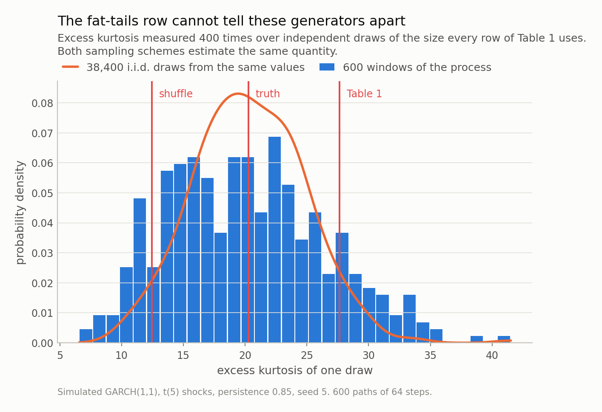
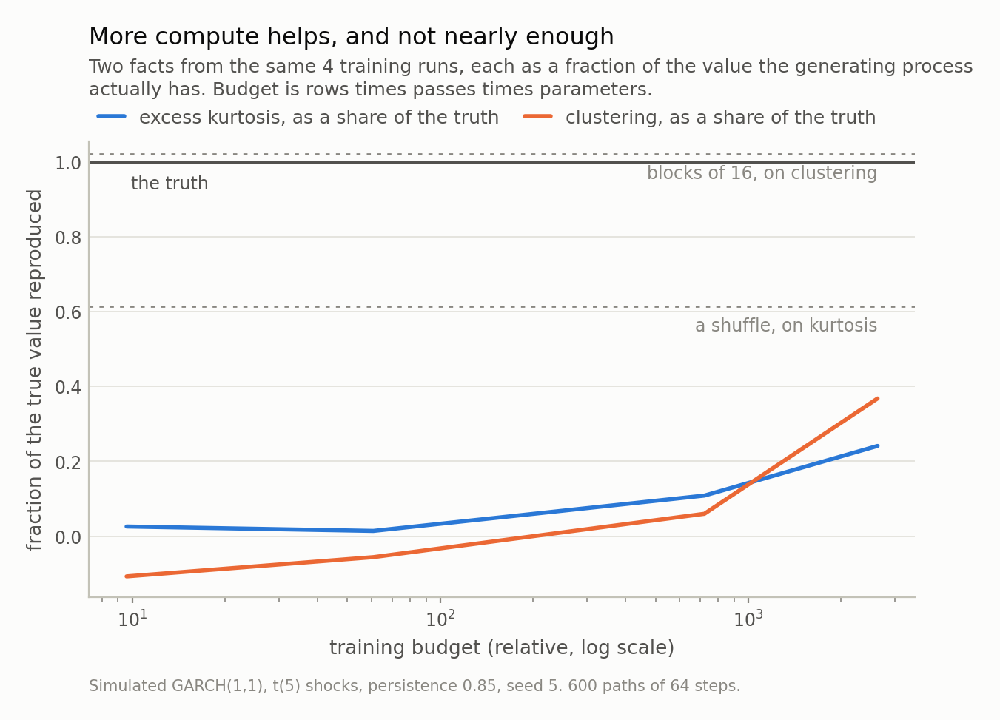

Disclosure: this post was written with the assistance of an AI system (Claude), which wrote the analysis code, ran the experiments and drafted the text. The topic, the constraints, the data choices and the final review are the author's.

*A survey posted this month collects the work applying diffusion models — the class behind image generators — to financial data: time series, limit order books, tabular data and other structured objects. Models like these are almost always judged on a table of stylised facts. This post summarises the survey, then runs the experiment a survey cannot, on a process whose answers are known, with the two generators that belong in every such table and are almost never in it. Shuffling the training returns reproduces the fat tails *exactly* and destroys every trace of volatility clustering; a small diffusion model does the opposite. Neither dominates, no weighting of the columns is neutral, and a hyperparameter that is not part of the model moved the table further than 250 times the training compute did.*

## A survey, and the question attached to it

Diffusion models are the thing behind image generators: learn to remove noise from a
corrupted sample, then start from pure noise and remove it repeatedly until something
plausible falls out. A survey posted to arXiv on 12 August
collects the work applying them to financial data, organised by what kind of data —
**time series**, **limit order books**, **tabular data**, **other structured objects** — and describes itself as the first survey dedicated to
this model family in finance. It ships an open repository of the papers it covers.

It names four reasons the class is attractive here, and they are the right four:
stable likelihood-based training, strong mode coverage, flexible conditioning, and **an SDE formulation that lines up with Ito calculus** — the last because a diffusion process
*is* an SDE, so the machinery already speaks the language quantitative finance is written
in.

I could not read the full text; repeated fetches were rate-limited. So the above is from
the abstract and the listing, and I will not characterise what is inside beyond that.
What I can do instead is run the question the whole field turns on, since it is a
question about *evaluation* rather than about any paper: **when a generative model of
returns matches the stylised facts, how much has it demonstrated?**

## The table that settles these arguments

There is a standard table: a row for fat tails, a row for the absence of autocorrelation
in returns, a row for autocorrelation in *absolute* returns — volatility clustering — and
often one for the leverage effect. The model's numbers sit next to the data's, they are
close, and that is the evidence. Two generators belong in that table and are almost never
in it.

An **i.i.d. bootstrap**: draw values from the training returns with replacement and lay
them end to end. This reproduces the return distribution *exactly*, kurtosis included,
because it *is* that distribution — and destroys every dependence, because the draws are
independent by construction.

A **moving-block bootstrap**: draw contiguous blocks instead of single values.
Dependence survives inside a block and breaks at the joins. One parameter, no training,
no architecture.

Neither is a rival to a diffusion model in what it can *do*. A bootstrap cannot be
conditioned on anything, cannot produce a value it has not already seen, and cannot
extrapolate — which is most of why you would want a generative model at all. That is
exactly why they belong in the table: they mark how much of a stylised-facts score is
available *without a model*, and until they are in it there is no way to know how much
of the score that is.

## First, check that the fact exists

Ground truth is a GARCH(1,1) path with Student-t shocks — fat tails and volatility
clustering, both put there on purpose, both with known values. The model generates
**64-step windows**, one path at a time, which creates a trap I walked into: a
generator emitting a 64-step window can only represent dependence that fits *inside*
64 steps. Equity-index volatility persistence is usually estimated around
**0.98**, and at that persistence the variance moves so slowly that
consecutive absolute returns inside a short window barely covary — inside a 32-step window
the lag-1 autocorrelation of absolute returns is
**+0.002**.

My first run used exactly that. The model failed to reproduce the clustering, and the
failure was mine — there was none inside the window to reproduce. Lower the persistence to
**0.85**, lengthen the window to 64, and the true in-window value is
**+0.153**, which is a fact that exists. The general form is
worth keeping: **before asking whether a model reproduces a statistic, measure that
statistic on the training windows.**

*Fig 1. The check to run before training anything. At the persistence an equity index usually estimates, 0.98, the variance moves too slowly for consecutive absolute returns inside a short window to covary: at 32 steps the clustering there is +0.002, and even at 64 it is only +0.048 against the +0.132 a 256-step window shows. A model asked to reproduce the 32-step figure has been handed nothing, and its failure would be the experiment's fault. At persistence 0.85 the 64-step window contains +0.153, which is why this post uses it. The shuffled line is here because zero is not the right reference: the estimator is biased downwards in short windows, which is the whole of the 8-step reading.*

## What the baselines do

Measured over all 14,993 windows of the path, the process has excess
kurtosis **20.3** and clustering
**+0.153**. Those are the numbers to beat.

Shuffling the returns gives clustering **-0.025** — nothing, and
39 standard errors from the truth, exactly as
designed. Its excess kurtosis is **12.5**, which I come
back to.

Blocks of 16 recover **+0.156** of the clustering —
102% of the true value, which
is a match within noise. Dependence does break at every join, and at short blocks that
shows: blocks of 2 reach only
+0.098. By 16 the joins are rare enough
not to matter. Excess kurtosis **24.4**. Three rows of
the standard table, one parameter, no model.

| generator | excess kurtosis | ACF1 of \|r\| | ACF1 of r | leverage | sd |
|---|---|---|---|---|---|
| the process, all 14,993 windows | 20.3 ± 1.4 | 0.153 ± 0.001 | -0.012 ± 0.001 | -0.002 ± 0.001 | 0.366 ± 0.002 |
| the process, the 600 drawn here | 27.7 ± 5.6 | 0.160 ± 0.007 | -0.006 ± 0.006 | -0.005 ± 0.006 | 0.382 ± 0.010 |
| shuffle the returns | 12.5 ± 1.6 | -0.025 ± 0.004 | -0.017 ± 0.005 | -0.004 ± 0.005 | 0.356 ± 0.003 |
| blocks of 16 | 24.4 ± 4.8 | 0.156 ± 0.007 | -0.018 ± 0.007 | 0.004 ± 0.006 | 0.374 ± 0.010 |
| diffusion model | 4.9 ± 1.9 | 0.056 ± 0.006 | -0.016 ± 0.005 | -0.005 ± 0.005 | 0.409 ± 0.008 |

The leverage column shows what kind of thing this table is. A symmetric GARCH has **no
leverage effect**; the true value is -0.002. A generator that
produced one here would not have scored a point — it would have invented a dependence
the data does not contain. The row is only readable if you already know the answer, and
on real data nobody does.

## And the fat-tails row cannot be measured anyway

Look at the first column of that table again. The process, sampled the way every row is
sampled, reports **27.7**. The shuffle reports
**12.5** — a factor of
2.2 apart. But the
shuffle is **exactly right in expectation**: it *is* the return distribution, so its
kurtosis is that distribution's kurtosis by construction. Something is wrong, and it is
not the shuffle.

It is the estimator. Draw 600 windows from the process
400 times and measure each draw's excess kurtosis: the
standard deviation of that estimate is **6.3**,
roughly 31%
of the value being estimated. The table's 27.7 is a
high draw; the shuffle's 12.5 is a low one. Same
quantity, same distribution.

A fourth moment is decided by the handful of largest observations in a sample, and
clustering makes that worse rather than better, because the largest observations arrive
together: one turbulent stretch contributes sixty-four big values at once, so a
contiguous sample is effectively far smaller than its value count suggests — here its
spread is 1.4 times
the i.i.d. one's at the same number of values.

The sampling seed alone does it too. The "1,000 steps, textbook endpoints" row of the next section and the
third rung of the budget ladder are **the same trained network with the same weights**,
differing only in the random draw used to generate. Their excess kurtosis figures are
1.67 and
2.20.

So fat tails are free twice over. Free to pass, because reproducing the return
distribution is enough and a shuffle does that for nothing. And effectively free to
fail, because at these sample sizes the row cannot resolve a factor of two. **A table
that reports kurtosis to two decimals and declares a match is reporting a coin flip.**
If the row appears at all it needs an error bar from repeated independent draws, not
from a bootstrap: the path bootstrap behind Table 1 gives
1.6 for the shuffle, about a third of the real spread.

*Fig 3. The generating process has an excess kurtosis of **20.3**. Estimated from 600 windows — the sample size every row of Table 1 uses — that estimate has a standard deviation of 6.3, about 31% of the value, and the draw the table happens to report is 27.7. The shuffle, which samples the marginal distribution and is therefore exactly right in expectation, drew 12.5. A table reporting either of those to two decimal places is reporting a coin flip.*

## What the diffusion model does

The model is a DDPM with the standard objective: corrupt a window to a randomly chosen
noise level, predict the noise that was added, then sample by undoing that repeatedly from
pure noise. Worth noting that this training task is *ordinary regression* — the forward
process has a closed form, so pairs can be manufactured in unlimited quantity from a
finite dataset. Hence no deep-learning framework here: the denoiser is a two-layer
perceptron on two CPUs, which is enough for the model class to *exist* and not enough for
it to be good.

At the largest budget I ran, the samples have excess kurtosis
**4.9** against a true
20.3 — about 24% of it, and far
enough below to survive the noise in the last section — and clustering
**+0.056** against a true
+0.153, about 37%. Returns are
uncorrelated, correctly. The standard deviation is
1.12 times the truth.

So the two generators fail in *opposite* places. The shuffle gets the distribution
exactly and the memory not at all; the model gets a fifth of the tails and a third of the
memory — relatively more of the dependence than of the distribution, which is the harder
half and the half a bootstrap cannot do. Neither dominates, and there is no weighting of
five columns in five different units that is not a choice someone made.

That is the finding, and it is about the table rather than about either generator. **A
single "realism" score over this battery would have ranked these two, and the ranking
would have been an artefact of the weights.**

*Fig 2. Blocks of 16 sit within 1.0 standard errors of the truth on every column here — a generator with one parameter, no training and no capacity to be conditioned on anything, indistinguishable from the process on four of the five facts this battery measures. The shuffle fails exactly one column, clustering, by 39 standard errors, because it has no memory whatsoever. The diffusion model misses clustering by 16 and overshoots the standard deviation by 5. The columns are not added up, because there is no weighting across four different units that is not a choice.*

## Was it just undertrained?

The obvious objection, and it deserves an answer rather than hedging. I ran
4 budgets spanning **274 times** the training
compute — wider layers, more passes, more noisings per window. At the smallest, excess
kurtosis 0.5 and clustering
-0.016: Gaussian noise with no memory. At the
largest, 4.9 and
+0.056. Both far above where they started, both still
well short.

Worth saying where that factor came from, because it is the sort of thing that quietly
flatters a chart: a rung *above* the largest here costs an hour of wall clock on two CPUs,
while a rung *below* the smallest costs ten seconds and widens the axis by the same
factor. I bought the span at the cheap end, and the top of it is set by the machine rather
than by the argument.

So this supports the narrow claim — not enough compute — and not the wider one, since
extrapolating a log-axis trend says nothing about where it stops. It does not touch the
argument either way. The claim is not that diffusion models fail this table; it is that
**the shuffle passes the tails row for free**, which is exact and needs no model at
all.

*Fig 4. Across 274 times the compute the clustering curve rises at every step and the kurtosis curve rises across the range with one step out of order — the two smallest budgets return excess kurtosis of 0.5 and 0.3 against a true 20.3, which is the same answer twice and not a decline. That is the answer to 'it was undertrained': the trend is real and the endpoint is still a long way short. Extrapolating a log-x trend says nothing reliable about where it stops, so this figure supports 'not enough compute' and not 'this much would do it'. The dashed lines are what the two untrained baselines reach for free.*

## The hyperparameter that moved the table more than the model did

This is the part I did not expect, and it is the sharpest version of the point.

The **forward process** — the schedule by which noise is added — is not part of the
model. It is a fixed list of numbers chosen before training. And the standard recipe
has a trap in it: the textbook schedule runs 1,000 steps, and shortening it to
200 to make sampling five times cheaper *while keeping the endpoints* leaves
the final noise level too low to have destroyed the signal. Terminal signal-to-noise
ratio **0.15** instead of 4e-05, so
the sampler starts from a standard normal draw when the correct starting distribution
is something else.

The failure is invisible in the worst possible way: the data is standardised before
training, so the mismatched start still has the right *variance* and only the higher
moments — the ones being measured — are damaged.

I caught it with a test that used no data at all. For Gaussian data the best possible
noise prediction has a closed form, so you can drive the sampler with the exact answer:
asked for standard deviation 2.5, the 1,000-step schedule returns
**2.501** and the 200-step one
**2.220**. The sampler is right; the
schedule is wrong.

Now the uncomfortable part. Three forward processes at one fixed budget, same data, same
seed, same network.

| forward process | steps | final beta | terminal SNR | excess kurtosis | ACF1 of \|r\| |
|---|---|---|---|---|---|
| 1,000 steps, textbook endpoints | 1,000 | 0.020 | 4.0e-05 | 1.7 ± 0.5 | 0.011 ± 0.005 |
| 200 steps, endpoints kept | 200 | 0.020 | 1.5e-01 | 2.4 ± 0.3 | 0.097 ± 0.006 |
| 200 steps, endpoints steepened | 200 | 0.067 | 1.0e-03 | 1.6 ± 0.2 | 0.030 ± 0.005 |

**The broken one wins.** On the clustering row — the informative row, the one a
shuffle cannot fake — the correct slow schedule reaches
+0.011, the correct fast one
+0.030, and the one whose starting distribution is
demonstrably wrong reaches **+0.097**, against a
true +0.153. The best clustering figure anywhere in this post
is not the largest model's +0.056; it is that one, at
0.27 times the largest rung's training cost. Excess
kurtosis barely moves across the three rows — so the schedule moved the row that carries
information and left the row that does not alone.

Why it scores better I cannot say. Two things differ between it and the slow schedule —
terminal SNR and step count — and the third row separates them only partly. Untangling
that is a paper, not a paragraph.

The part I can state plainly is the part that matters for reading someone else's table:
**a stylised-facts score moved further under a choice that is not part of the model than
under 250 times the training compute** — and it preferred the configuration I can prove is
wrong.

## What to ask of an evaluation table

None of this argues against the model class, and the survey's four appeals are untouched —
a bootstrap has none of them. Conditioning matters most in practice and is exactly what a
resampling scheme cannot do: if you want scenarios given a state, a bootstrap has nothing
to offer and a diffusion model does. The argument is about what a *table* can support.
Four things, all cheap:

**Put the shuffle in.** One line. If fat tails are the headline result, the shuffle is
the honest baseline for them, and it matches by construction.

**Put the block bootstrap in.** Two lines and one parameter, and it is the bar for "the
model learned the temporal structure". Report the block length; sweep it if you can.

**Give every row an error bar from repeated draws** — not from a bootstrap, which
understates a fourth moment's spread by a factor of three here. Any row whose error bar
covers a factor of two is not evidence, and should be labelled that way rather than
quoted to two decimals. While you are there, say what the true value *is*: a leverage
row means nothing without knowing whether the process has one.

**Report the schedule.** Steps, endpoints, terminal signal-to-noise ratio. A table that
moves this much under a forward-process choice cannot be read without it.

And one for the reader rather than the author: **a matched return distribution is not
evidence**. Fat tails are free. The dependence structure is not, and that is the column
to read first.

## Where to be careful

**One process, one window length, one architecture.** The qualitative claim — a shuffle
reproduces the return distribution exactly — is an identity and holds anywhere. Every
number attached to the diffusion model is specific to this setup and is not a property of
diffusion models.

**The budget is small, and I have said so twice.** A convolutional or attention denoiser
at a real budget would likely close much of both gaps. The ladder shows a direction, not a
limit. Training windows also overlap — strided by 8, so neighbours share
56 of their 64 values — which means the effective sample is well
below the 14,993 rows the model saw.

**And the survey itself I have only read from the outside.** The abstract, the
listing, the repository link. Nothing above describes its contents, evaluates its
judgements, or comments on any paper it reviews — the experiment stands on its own
and would have been worth running whatever the survey says.

---

### Data

- Zhuohan Wang and Carmine Ventre, 'Diffusion Models in Finance: A Survey', arXiv:2608.12583, 12 August 2026 (q-fin.CP). Organises the literature by financial data type (time series, limit order books, tabular data, other structured objects) and identifies four properties that make the model class attractive for finance: stable likelihood-based training; strong mode coverage; flexible conditioning; an SDE formulation that lines up with Ito calculus. Describes itself as the first survey dedicated to diffusion-family models in finance and ships an open repository at <https://github.com/ZhuoHan1998/Diffusion-Models-In-Finance>. <https://arxiv.org/abs/2608.12583>. **Read from the abstract and the listing only** — repeated full-text fetches were rate-limited, so nothing here characterises the survey's contents beyond what it says about itself, and no result of any paper it reviews is described.
- All data in this post is simulated. Ground truth is a GARCH(1,1) path with Student-t(5) shocks, arch 0.25, beta 0.6, persistence 0.85, omega 0.02, 120,000 steps, seed 5, generated by `standarderror.dynamics.sde.garch11`. No market data is used or redistributed, and no company appears.

### Reproducibility

- **seed**: 20260804
- **environment**: standarderror=0.1.0, python=3.11.15, numpy=2.4.4, scipy=1.17.1, scikit-learn=1.8.0
- **model**: DDPM with an epsilon-prediction objective, 1000-step linear schedule (beta 1e-4 to 0.02), a two-hidden-layer MLPRegressor denoiser, and a timestep embedding of one ramp plus two sine-cosine pairs. No torch in this environment and two CPUs, which is survivable because epsilon-prediction is a regression
- **windows**: 14,993 windows of 64 steps at stride 8; neighbouring windows share 56 values, so the effective sample is well below the row count
- **budget_ladder**: width 64 x 25 passes x 2 noisings (cost 10, 5s), width 128 x 40 passes x 3 noisings (cost 61, 19s), width 256 x 80 passes x 6 noisings (cost 721, 201s), width 384 x 110 passes x 8 noisings (cost 2630, 1332s)
- **scoring**: every generator scored on exactly 600 paths of 64 steps, because the pooled kurtosis estimate is sample-size dependent; pooled standard errors from 400 resamples of paths, per-path facts from the spread across paths
- **sampler_check**: ancestral sampling driven by the analytic optimal denoiser for Gaussian data of standard deviation 2.5 returns 2.501 at 1000 steps and 2.220 at 200
- **block_sweep**: block 2: ACF1(|r|) +0.098, block 4: ACF1(|r|) +0.143, block 8: ACF1(|r|) +0.154, block 16: ACF1(|r|) +0.156, block 32: ACF1(|r|) +0.146
- **cost**: about 36 minutes of fitting on two CPUs for the ladder plus the three schedule runs; cached under a hash of the configuration, and each rung cached separately, so the post re-renders in seconds

Code: <https://github.com/jongha-jeon-dev/standarderror>
