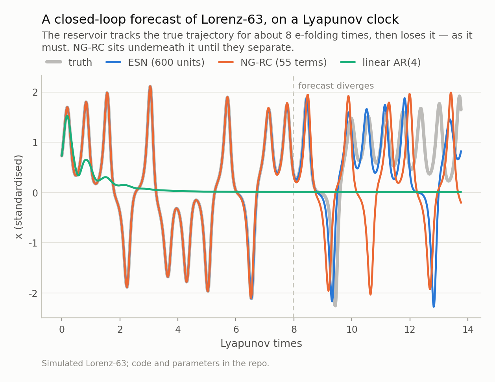
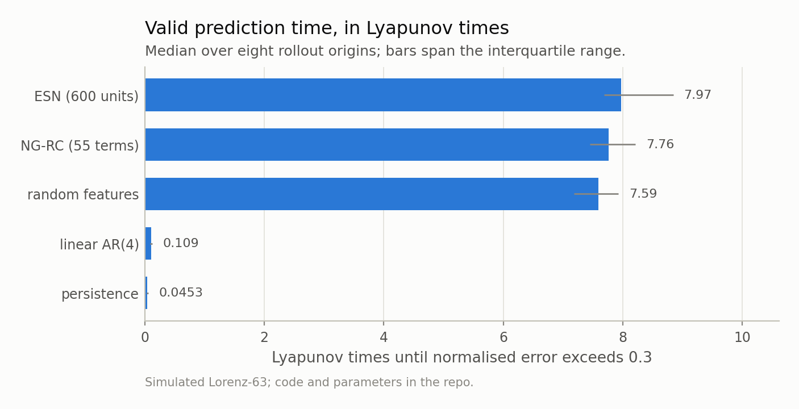
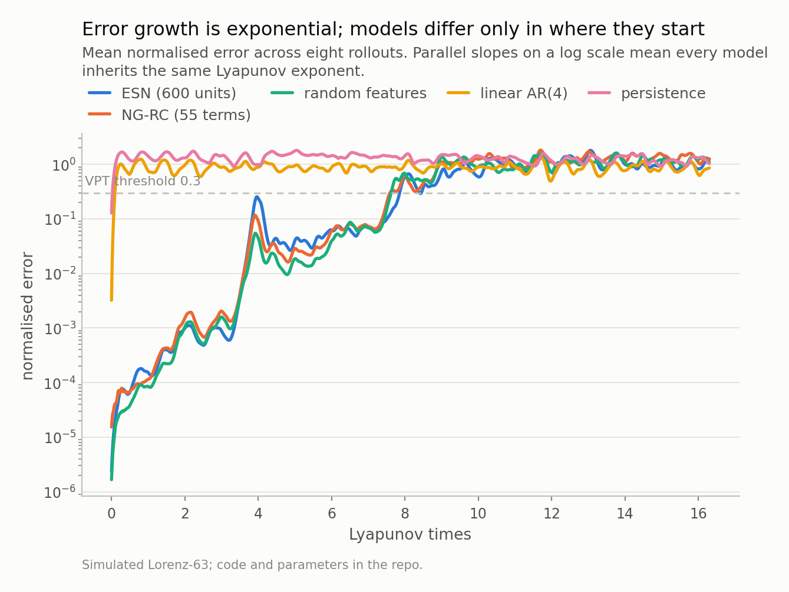
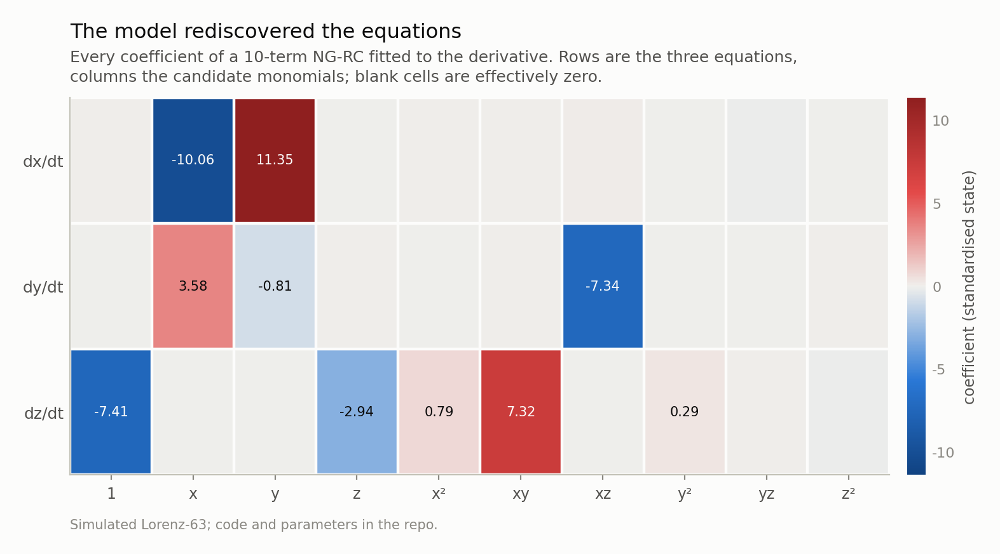
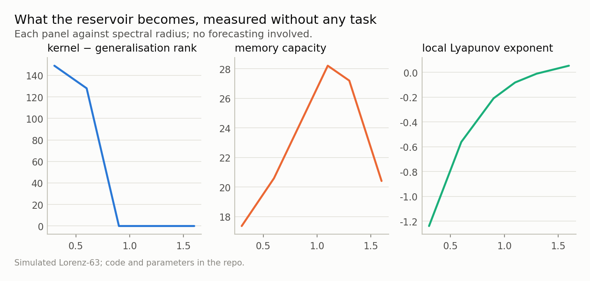
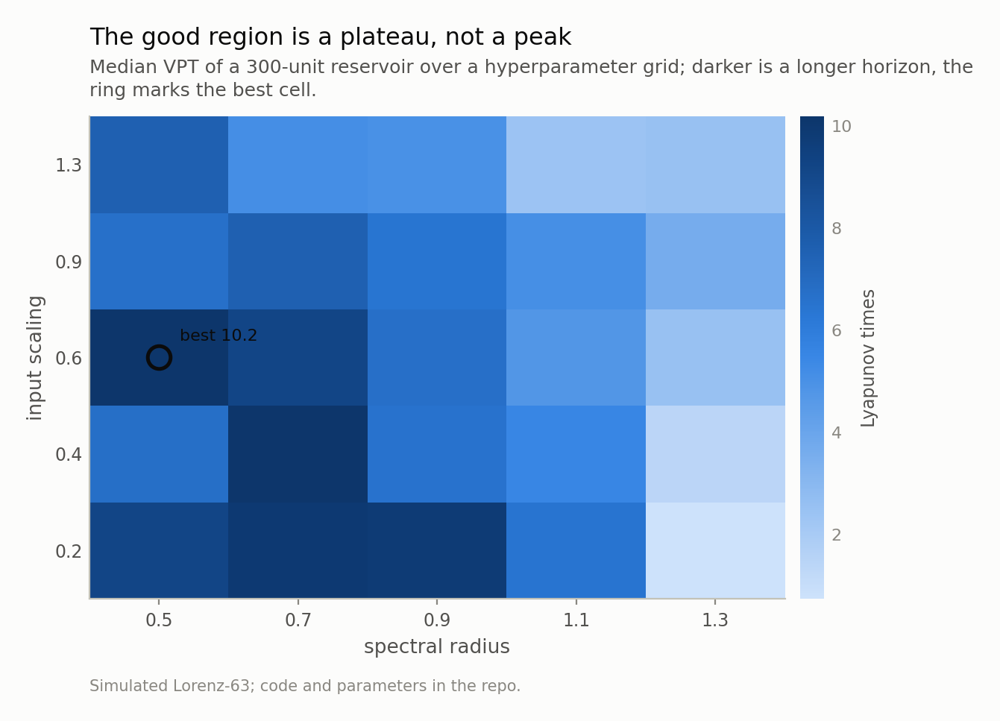

*On Lorenz-63 a 600-unit echo state network holds a closed-loop forecast for 8.0 Lyapunov times. A 55-term polynomial model you can print on one line gets 7.8. A static random-feature map with no memory at all gets 7.6. Linear AR gets 0.11. Here is what that ordering actually tells you — and what it means for anyone putting a recurrent model into a risk system.*

## The question people actually mean

"Can machine learning predict a chaotic system?" is a badly posed question, and
the way it is usually answered makes it worse. Someone trains a recurrent network
on a Lorenz trajectory, reports an R-squared of 0.999 on next-step prediction,
and concludes that the network learned the dynamics. It did not. Next-step
prediction on a smooth trajectory sampled every 0.02 time units is a task that
*persistence* — literally copying the last observation forward — solves to three
decimal places. The reported number measures the sampling rate, not the model.

The question worth asking is: **for how long does a forecast stay useful once you
stop feeding the model the truth?** Close the loop. Let the model's own output
become its next input, and see how long it survives.

Chaos gives us a natural clock for this. Nearby trajectories separate
exponentially at a rate given by the largest Lyapunov exponent. For Lorenz-63 at
the standard parameters I measure 0.9064 using the Benettin tangent-space
method with the analytic Jacobian, against the literature value of 0.9056 — so
one Lyapunov time, the interval over which an initial error grows by a factor of
e, is about 1.10 time units. Measuring forecast horizons in
Lyapunov times instead of seconds makes results comparable across systems,
sampling rates, and papers.

The metric is **valid prediction time (VPT)**: the point at which the normalised
forecast error first exceeds a threshold, here 0.3, with the error normalised by
the RMS amplitude of the truth. It is the standard convention in the reservoir
computing literature and it has the great virtue of being hard to game.

*Fig 1. One representative rollout. The dashed line marks the median valid-prediction time of the ESN across eight independent origins. Linear AR(4) is not a strawman — it is the best linear model of this data, and it is useless here.*

## Five models, one honest protocol

Everything below trains on the same 15,000 standardised samples — scaled with
training-set statistics only, because scaling with the full-series mean is a
leak that will flatter every model in the table — and is evaluated by closed-loop
rollout from 8 non-overlapping origins in held-out data. Reporting
one rollout is not enough: the interquartile range across origins is wide enough
that a single number can mislead by close to a factor of two.

The models, in order of how much you have to trust them:

- **Persistence.** The last value, repeated. The bar.
- **Linear AR(4).** Ridge-regularised linear autoregression on four lags. This is
  the control that tells you whether nonlinearity is doing anything.
- **Random features.** A 600-dimensional random `tanh` map on three lags, ridge
  readout. Nonlinear and wide, but *memoryless* — no recurrence. This one isolates
  how much of a reservoir's advantage comes from recurrence as opposed to merely
  being a big nonlinear basis.
- **NG-RC** (55 features). Next-generation reservoir computing: instead of
  a random recurrent network, an explicit polynomial expansion of three lags —
  constant, linear terms, and all quadratic monomials — with a ridge readout.
- **ESN** (600 units, 1204 readout features). A
  conventional echo state network: sparse random recurrent weights rescaled to
  spectral radius 0.9, `tanh` activation, ridge readout,
  with half the states squared to break the odd symmetry of `tanh`.

Results, median over rollouts, in Lyapunov times:

| model | VPT (median) | IQR |
|---|---|---|
| ESN (600 units) | **7.97** | 7.68 – 8.84 |
| NG-RC (55 terms) | 7.76 | 7.45 – 8.21 |
| random features | 7.59 | 7.18 – 7.93 |
| linear AR(4) | 0.11 | 0.09 – 0.13 |
| persistence | 0.05 | 0.03 – 0.06 |

Three things in that table are worth more than the ranking.

*Fig 2. The spread matters as much as the ranking: a single rollout can mislead by a factor of two, which is why a single-number VPT in a paper should be treated with suspicion.*

## 1. The slopes are the system's, not the model's

Plot the error growth on a log scale and the curves are close to parallel. Every
model inherits the same exponential divergence rate, because that rate is a
property of Lorenz-63 and not of anything you fit to it. What a better model buys
is a lower *intercept* — a smaller one-step error.

That has a consequence people consistently underrate. Because the error grows
exponentially, an improvement in one-step accuracy translates into only an
*additive* gain in horizon: halving the one-step error buys you ln(2)/λ ≈
0.77 Lyapunov times, no matter how good you already are. Going from a
thousandth to a millionth of a unit of one-step error — a huge engineering
achievement — buys about eight Lyapunov times, and then stops. There is no
model, and no amount of compute, that escapes this ceiling.

That is the upper bound. Finding 3 shows the two models here realise only about a
tenth of it, which is a separate and more practical problem.

This is the honest version of "chaos limits predictability", and it is worth
carrying into any conversation about forecasting a system with positive Lyapunov
exponent. The exponent sets the budget. Model quality decides how much of the
budget you actually get.

*Fig 3. The slopes are set by the system, not the model. What a better model buys you is a lower intercept — and because growth is exponential, halving the one-step error buys only a fixed additive amount of horizon.*

## 2. Recurrence is worth less than you would guess

The random-feature model has no memory whatsoever. It sees three lags through a
fixed random nonlinearity and regresses. It reaches 7.59
Lyapunov times — 95% of the ESN's
horizon, with no recurrent state, no spectral radius to tune, and no washout.

That is a useful result to internalise before reaching for a recurrent
architecture. For a system whose state is *observable* — here we feed the model
all three coordinates — a short delay embedding plus a nonlinear basis already
contains most of the information. Takens' theorem says as much: a delay embedding
of sufficient dimension reconstructs the attractor, so a static map on enough lags
can in principle be as good as a stateful one. Recurrence earns its keep when the
state is *partially observed* and the model must integrate information over an
unknown, possibly long window — which, to be fair, is exactly the situation in
most financial applications.

So the honest framing is not "reservoirs are overrated" but "test the memoryless
version first, because it is cheaper, easier to reason about, and often close."

## 3. The interpretable model is 0.21 Lyapunov times behind

NG-RC reaches 7.76 Lyapunov times against the ESN's
7.97, using 55 features instead of 1204 — a
factor of 22 fewer — and it fits in
0.01s against 3.41s.

And here is the part I did not expect. One step ahead the ESN is not marginally
better — it is **6.4 times** better, RMSE 1.97e-06 against
NG-RC's 1.26e-05, and a Diebold-Mariano test on
5,699 held-out steps puts the statistic at
-28.7 (p < 0.001). Not a close call. For scale, both are
four orders of magnitude below persistence's 1.53e-01, so
this is a comparison between two very accurate models.

Now put that through the arithmetic from finding 1. A 6.4-fold reduction in
one-step error should buy ln(6.4)/λ = **2.05 Lyapunov times**
of extra horizon. The ESN actually gains **0.21** — about
10% of it.

That gap is the most useful thing in this post. The exponential-growth argument
treats a forecast error as if it were an infinitesimal perturbation of the true
trajectory, growing at the system's Lyapunov rate. In a closed loop it is not: the
model's error is *structured*, it is re-injected as the next input, and whether it
compounds or partially cancels depends on the geometry of the model's error, not on
λ. Two models can sit an order of magnitude apart on one-step error and finish
within a rollout's noise of each other.

The operational lesson: **one-step accuracy and closed-loop horizon are different
quantities, and the mapping between them is model-specific.** A leaderboard built
on one-step error is not a leaderboard for the task you care about — which, since
one-step error is what almost every forecasting benchmark reports, is worth
sitting with.

The difference that matters is not accuracy. It is that NG-RC's readout is a linear
map over *named* monomials, so the model is not something you explain after the
fact — it is something you print. To make the point as sharply as possible, here is
the same model family fitted to the derivative instead of the next state, with a
single lag and quadratic terms: ten candidate monomials, three equations, thirty
coefficients in total.

The recovered sparsity pattern is the Lorenz system. Not similar to it — it:

| quantity | analytic | recovered |
|---|---|---|
| dx/dt coefficient on y | 11.352 | 11.352 |
| dx/dt coefficient on x | -10.000 | -10.056 |
| dy/dt coefficient on xz | -7.553 | -7.337 |
| dy/dt coefficient on x | 3.869 | 3.577 |
| dz/dt coefficient on xy | 8.340 | 7.319 |
| dz/dt coefficient on z | -2.667 | -2.935 |

Coefficients are in standardised-state units, which is why they are not 10 and 28
and 8/3; the analytic column carries the same rescaling. Two details were
load-bearing. The target uses **central** differences: a forward difference
estimates the derivative at t + dt/2 and biases every coefficient by
(1 − e^(−λdt))/(λdt), about 10% here — enough to make a correct model look wrong.
And the features are left unstandardised so the numbers can be compared to the
analytic values rather than merely ranked.

Where it is imperfect is instructive too. The `dz/dt` row picks up a spurious x²
term, because on the Lorenz attractor x² and xy are strongly correlated, and ridge
regression has no way to prefer one over the other. That is collinearity, not a
bug, and it is the same mechanism that makes feature attributions unstable on
lagged financial features — where every lag is nearly collinear with its
neighbours. This is why the attribution module in the repo defaults to permuting
*blocks* of related features rather than single columns.

The consequence for applied work is direct. Model validation functions do not ask
what your valid prediction time is. They ask what the model does and why, and they
are entitled to an answer that does not rest on a post-hoc attribution method with
its own failure modes. A model whose functional form is inspectable and which costs
you 0.21 Lyapunov times out of
8.0 is, for most regulated purposes,
straightforwardly the better model — and you cannot know the size of that trade
unless you measure it on a problem where you know the answer.

*Fig 4. Compare with Lorenz-63 itself: dx/dt = σ(y−x) is linear, dy/dt = x(ρ−z)−y contains xz, and dz/dt = xy−βz contains xy. The recovered sparsity pattern is exactly that. This is the model, not an explanation of the model.*

## What the reservoir actually is, measured without a task

Reservoirs are usually tuned by grid search over spectral radius and input
scaling, which tells you nothing about the object you built. There are cheap,
task-free diagnostics that do:

- **Memory capacity** (Jaeger): the total variance of past inputs linearly
  recoverable from the current state, bounded above by the reservoir size. How far
  back the reservoir can see.
- **Kernel rank minus generalisation rank** (Legenstein & Maass): drive the
  reservoir with many independent input streams and take the numerical rank of the
  resulting states — high rank means it separates different inputs. Then repeat
  with streams that share a common recent history — here you want *low* rank,
  because similar recent inputs should collapse to similar states. The difference
  is a task-free measure of useful computational capacity, maximised at
  ρ = 0.3 in this sweep. Read the *collapse* above
  ρ = 0.9 rather than the absolute level: kernel rank is bounded by the number of
  probe streams (150 here), so the low-ρ end is saturated by construction.
- **Local Lyapunov exponent of the driven reservoir**: perturb the state,
  evolve both copies under the same input, measure the growth rate. Negative means
  contracting and the echo state property holds; positive means the reservoir has
  its own chaos and will never forget its initial condition. The crossing is what
  people mean by "the edge of chaos", and in this sweep it sits nearest
  ρ = 1.3 — *not* at ρ = 1, which is the value the textbook
  rule of thumb would have you believe. The spectral radius bound is neither
  necessary nor sufficient once input scaling is non-trivial, so measure the thing
  itself.

The hyperparameter surface makes a related point. The region of good performance is
a broad plateau, not a peak. Any reported "we used spectral radius 0.9" implies far
more precision than the data supports, and the practical lesson is to spend your
tuning budget on the input scaling and the ridge parameter — which do matter — and
stop agonising over the third decimal place of ρ.

*Fig 5. These are task-free diagnostics. The local Lyapunov exponent crossing zero is the 'edge of chaos' people gesture at; it is measurable in a few seconds and it is not at spectral radius 1.*

*Fig 6. Reported hyperparameters imply more precision than the data supports. Anything in a wide band performs within noise of the best cell — worth knowing before you spend a week on Bayesian optimisation.*

## Taking this to data that matters

Everything above is on simulated data, deliberately. Lorenz-63 has ground truth: a
known attractor, a known Lyapunov exponent, and no measurement noise, so a claim
like "eight Lyapunov times" is falsifiable. Financial series have none of that. The
signal-to-noise ratio is brutal, the generating process is non-stationary, and
persistence is a genuinely strong competitor rather than a formality — which is
precisely why so many published financial forecasting results evaporate on
inspection.

So the value of the synthetic benchmark is not the number. It is the *protocol*:
scale on training data only, close the loop, evaluate from multiple origins, report
the spread, compare against persistence and a linear model, and test whether the
difference between two models is distinguishable from noise before you claim one is
better. Every one of those steps was load-bearing here. Skipping any of them would
have produced a more impressive-looking and less true result.

The next post in this series takes exactly this protocol to a public macro-financial
series — the US term spread and financial-conditions indices from FRED — and asks
the uncomfortable question: once you enforce this discipline, is there any
closed-loop predictability there at all, or does persistence win?

---

### Data

- Simulated Lorenz-63 (sigma=10, rho=28, beta=8/3), integrated with RK45 at rtol=1e-10; no external data required.

### Reproducibility

- **seed**: 20260804
- **environment**: quantpost=0.1.0, python=3.11.15, numpy=2.4.4, scipy=1.17.1
- **largest Lyapunov exponent (Benettin, analytic Jacobian)**: 0.9064 (literature value 0.9056)
- **Kaplan-Yorke dimension**: 2.062 (literature value 2.062)
- **rollout origins**: 8
- **fit time**: ESN 3.41s, NG-RC 0.01s

Code: <https://github.com/jonghajeon/quantpost>
