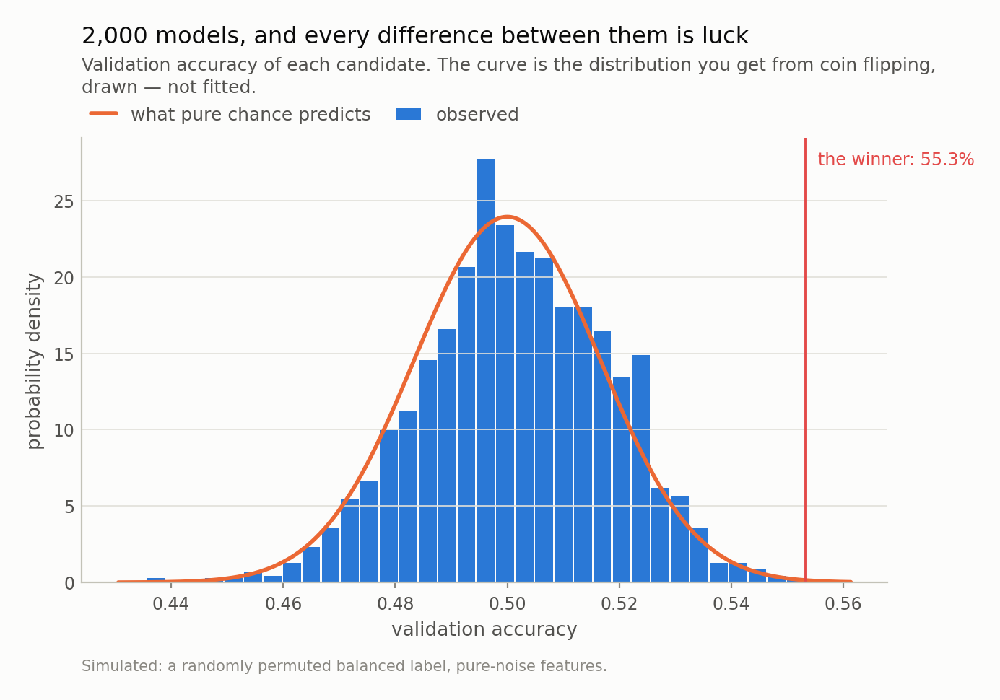

*I generated a target that cannot be predicted, gave 60 pure-noise variables to 2,000 models, and kept the best one. It called 55.3% correctly, which taken at face value is significant at p = 0.0008. Out of sample it got 49.9%. The interesting part is that its winning score was predictable before I started — from the number of models alone.*

## A result I can guarantee is fake

I built a dataset where I know the answer in advance, because I wrote it.

The thing to predict is a sequence of ones and zeros — exactly half of each,
shuffled at random. Think of it as a coin flip, except I have also removed the
nuisance of one side coming up slightly more often. The inputs are
60 columns of random numbers, generated independently of the target. No
column knows anything about the answer. Nothing can be learned here, and I can say
that with certainty rather than as a hypothesis.

Then I did what everybody does. I picked 4 of those 60
columns at random, fitted a small model, and measured how often it called the
answer correctly on data it had not been trained on. Then I did it again with a
different 4. 2,000 times.

The best of those 2,000 models called
**55.3%** of them correctly.

If I show you only that model — and why would I show you the other
1,999 — it looks like a finding. Take its
55.3% at face value and ask whether a coin could do that
well by accident: the answer is **p = 0.0008**. Less than one in a
thousand. In most contexts that ends the argument.

There is no signal. I am certain of it. So where did the
55.3% come from?

## Nothing went wrong — that is the problem

Here is the distribution of all 2,000 scores.

The bell curve drawn on top of it is **not fitted to the data.** It is the
distribution you get from flipping a coin 900 times, which is exactly what each
of these models is doing. Its width is fixed by arithmetic:
1.67 percentage points. The width I actually measured
across the 2,000 models is 1.68
percentage points.

So all of the apparent variation in model quality — the reason one model looks
better than another, the reason there is anything to choose between them — is
sampling noise, and theory got its size right to better than one part in a hundred.

And once you accept that, the winner stops being mysterious. If you draw
2,000 numbers from a bell curve, one of them is going to be near the
right edge. That is not a discovery about the model. It is a fact about drawing
2,000 numbers.

The scale of it is easy to underestimate. On its own, a model needs
52.9% — that is
2.9 percentage points above chance — to clear
a one-sided 5% test on 900 observations. Out of my 2,000 models,
**105** cleared that bar. The number you should
expect, if nothing whatsoever is going on, is about
89. I did not find
105 promising signals. I found the ordinary,
predictable output of asking the same question 2,000 times.

*Fig 1. The bell curve is not fitted to the bars — it is what coin flipping predicts, drawn on top. The models differ from each other by exactly as much as luck says they should. The winner is in the right tail, which is what a right tail is for.*

## The winner's score was knowable before I started

This is the part I find satisfying, and it is why I think the demonstration is
worth more than the warning.

"The largest of N draws from a known distribution" is a solved problem. It is
called an order statistic, and here the distribution is known exactly — the number
of correct calls in 900 coin flips — so no simulation and no approximation is
needed. For 2,000 models the arithmetic predicts a best score of
**55.7%**.

I measured **55.3%**.

Plot the best-so-far score against the number of models tried and the formula tracks
the experiment across three orders of magnitude — never more than
1.0 percentage points apart once more than ten models are
in, and 0.4 percentage points apart at the end.
Nothing is fitted. Your best model's score is a readout of your search budget.

Which means the arithmetic runs in the other direction too, and this is the table I
would pin above every desk where backtests happen. On a coin flip, with 900
observations to select on:

| for your best score to reach | models you need to try |
|---|---|
| 53% | 18 |
| 55% | 447 |
| 57% | 44,998 |
| 60% | 656,259,962 |

A 55% hit rate — the kind of number that gets a strategy funded — is
447 attempts away from nothing whatsoever. And "attempts" is broader than
it sounds. Every feature you added and dropped, every window length you tried,
every threshold you nudged, every time you re-ran it after a bad result: those are
all draws. Nobody counts them, and the counting is the whole ballgame.

*Fig 3. The line is order statistics — the exact expected maximum of N coin-flip draws — with nothing fitted. If your search sits on this line, your best model is indistinguishable from your search budget.*

## What it looks like when you only see the left half

Take the five models that scored best and plot their running tally of correct calls
minus wrong ones, straight through the boundary between the data I used to pick
them and the data I did not.

For the first 900 observations, five clean upward slopes, ending on average
+87 calls to the good. Then the line — and after it they
stop climbing and start wandering. Not flatly. At their best moment after selection
one of them was 42 calls above where I picked it; at its worst
another was 25 below. That is not a surprise either: a
coin-flip tally over 900 steps has a standard deviation of
30 calls, so swings of this size are the default, not an event.
What none of them does is keep making progress. Over the whole out-of-sample stretch
one ended 22 calls up and another
18 down, and the five together ended
+0.4 calls from where I picked them — an out-of-sample
**50.0%**, with the single best one, my champion at
p = 0.0008, managing **49.9%**.

Which is the trap in the picture. Had I shown you only the stretch from the line to
that peak and called it a live track record, you would have seen a strategy up
42 calls with nothing behind it at all.

Across all 2,000 models the correlation between validation accuracy
and test accuracy is **+0.039**, against a standard error of
0.022. It accounts for 0.15% of the variation in
test accuracy, which is a polite way of saying that the score you selected on
carries no information about the score you care about. That is exactly right: there
was nothing for the validation score to be informative *about*.

That left-half shape is worth memorising, because it is what every overfitted
backtest looks like, and it is indistinguishable by eye from a real one. The
difference is not in the picture. It is in whether the right half exists, and
whether anybody looked at it before deciding.

*Fig 2. Five confident climbs, then a random walk. After the line they run as far as +42 calls above the level they were picked at and 25 below it, and end +0.4 on average — 50.0% out of sample. Every backtest has a left half; ask what the right half looks like.*

## Where this simulation is kinder than reality

Two places where my setup is not quite the clean textbook case, and one of them
matters in the direction you would not guess.

My 2,000 models are not independent draws. They share a training set
and their feature subsets overlap, so the effective number of independent tries is
somewhat below 2,000 — which is why the observed best,
55.3%, sits a little *under* the
55.7% that independence predicts rather than scattered
either side of it. In real research the dependence is far stronger: variants of one
idea are highly correlated. That cuts both ways. It means the naive multiplicity
correction is too harsh, and it means the count of trials you should report is not
simply the number of notebook cells you ran.

The gentler simplification is that my target is exchangeable noise. Financial
series are not: they have autocorrelation, regime changes and drifting volatility,
all of which give a search *more* to latch onto, not less. The 900-observation
validation set here is also generous by the standards of a strategy tested on
monthly data, and a smaller selection set widens the chance distribution, which
pushes every number in Table 1 down. Fifty-five percent gets cheaper.

## The honest fixes, and their costs

None of this is new. The winner's curse, data snooping, multiple comparisons,
backtest overfitting — the statistics have been understood for decades, and the
finance literature in particular has been shouting about it since at least White's
Reality Check in 2000. What tends to be missing is not the warning but the
demonstration, so here is what to do about it, with the catch attached to each.

**Count your trials and say the number.** The single highest-value habit. Not just
model variants — every window, threshold, feature set and re-run. The count is part
of the result, and a paper or a pitch that omits it is not reporting a weaker
result, it is reporting an uninterpretable one.

**Correct for the count.** Multiplying your p-value by the number of trials
(Bonferroni) is the crude version: my winner's 0.0008 becomes
1.00, which is the correct verdict. It is also far too
conservative when the trials are correlated, as model variants always are. The
finance-specific tools — White's Reality Check, the Superior Predictive Ability
test, deflated Sharpe ratios — exist precisely to handle correlated searches, and
they are worth the afternoon.

**Hold out a set you touch exactly once.** Powerful and fragile: it works right up
until the result disappoints you and you go back for another look. At that point it
has silently become a validation set and you no longer have a test set.

**Prefer fewer, motivated candidates.** Ten hypotheses you can each explain beat
ten thousand from a grid search, not because grid search is wrong but because the
correction you owe scales with the count and the explanation does not.

The uncomfortable version of all this: a model that survives a search of
2,000 needs to clear a much higher bar than the same model would if it
were your first idea, and that bar depends on something invisible in the final
notebook — how many things you tried. Any result presented without that number is
missing the denominator.

Next in this series, a method that comes with a mathematical *guarantee* about how
often it will be right, and what happens when the one assumption behind that
guarantee quietly fails. I will show a nominal 90% interval realising under 60%.

---

### Data

- Fully simulated: a randomly permuted, exactly balanced binary label and 60 independent standard-normal features. No external data; every number is reproducible from the repo with a fixed seed.

### Reproducibility

- **seed**: 20260804
- **environment**: quantpost=0.1.0, python=3.11.15, numpy=2.4.4, scipy=1.17.1, scikit-learn=1.8.0
- **design**: 2,000 logistic regressions, each on 4 of 60 noise features
- **splits**: 1200 train / 900 validation / 900 test, contiguous and disjoint
- **class balance (train/validation/test)**: train 0.502, validation 0.503, test 0.493
- **chance sd of one model's accuracy**: 1.67pp (observed across models: 1.68pp)
- **order statistics**: exact, from the Binomial(900, 1/2) CDF — not the normal approximation, which is off by ~1.5x in the tail the trials table lives in

Code: <https://github.com/jonghajeon/quantpost>
