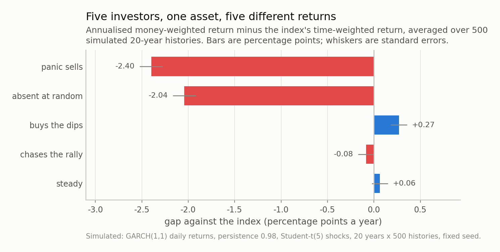
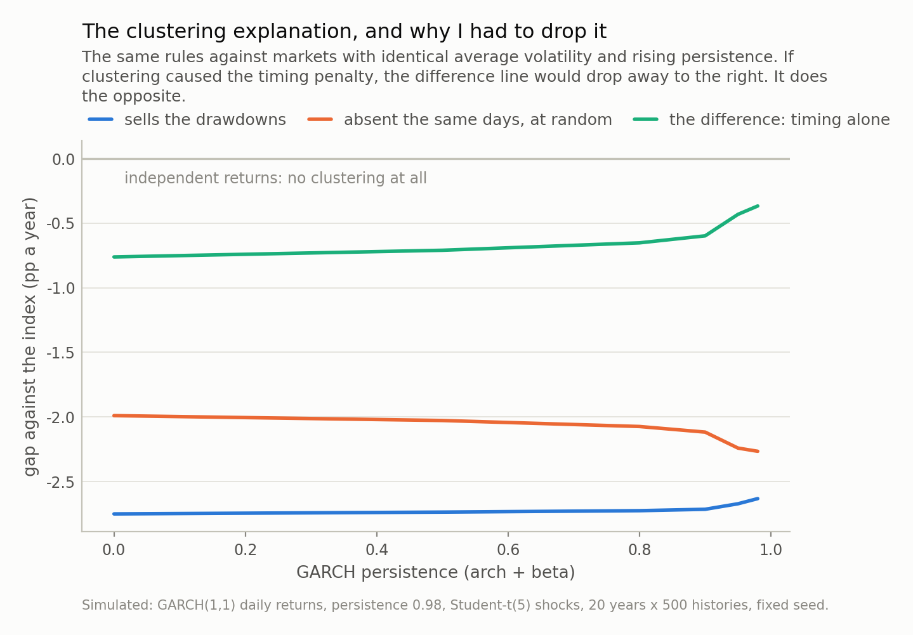
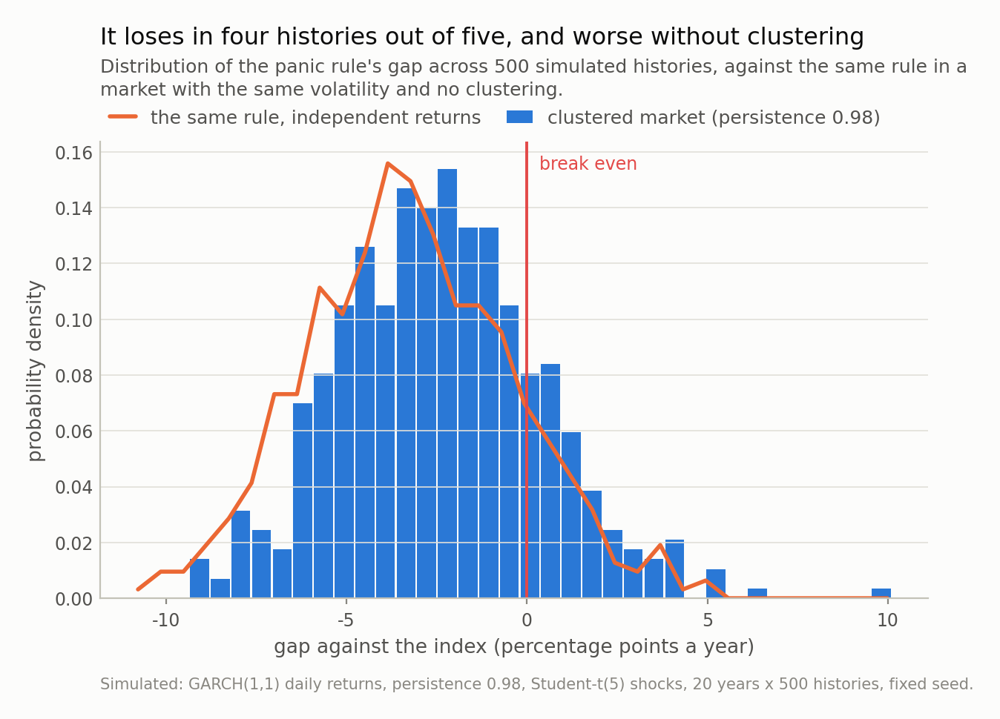

Disclosure: this post was written with the assistance of an AI system (Claude), which wrote the analysis code, ran the experiments and drafted the text. The topic, the constraints, the data choices and the final review are the author's.

*On 31 July 2026 the KOSPI rose 17.91%, the largest one-day gain in its history, and Korean individuals net sold a record 8.2543 trillion won into it. So I priced the rule: selling every 15% drawdown cost 2.40 percentage points a year in my simulations. I expected the cost to be missed rebounds, and a matched control says it is not — five sixths of it is simply being out of a rising market for 10 of 20 years, and the rest comes from a re-entry rule that will not buy back until the index has risen 12%.*

## Two records, one session

On 31 July 2026 the KOSPI rose **17.91%** — the largest one-day gain in the
index's history. In the same session, Korean individuals net sold
**8.2543 trillion won**, their largest daily net sale on record, and
foreign investors net bought **7.2197 trillion won**, theirs. Over the
week individuals net sold 6.5437 trillion.

I want to be careful about what that does and does not show, because the tempting
reading is a story about panic and the data cannot support it. An aggregate net
sale is the sum of forced margin liquidations, resting limit orders, index
rebalancing and deliberate decisions, and the four are indistinguishable in a
single number. Somebody being *liquidated* on the best day of the decade is a
different phenomenon from somebody *choosing* to sell into it, and you cannot tell
them apart from the tape.

What is worth doing instead is pricing the *rule*. Forget who did it and ask the
mechanical question: **if an investor reduces exposure after losses and restores it
after gains, what does that cost, and where does the cost come from?** That is
computable, it needs nobody's flow data, and the second half of the question turned
out to have a different answer from the one I was expecting when I started.

## The two returns of the same asset

Start with the distinction that makes this measurable.

The number a fund reports is a **time-weighted** return: compound the index's daily
moves and annualise. Every investor holding that index sees the same figure, and it
is indifferent to when anybody's money arrived.

The number an investor *earned* is a **money-weighted** return — the internal rate
of return of their actual cash flows. It is the rate that, applied to each
contribution for as long as that contribution was invested, reproduces the final
account value.

For a single lump sum held to the end the two are identical. As soon as money moves
they separate, and the difference is nothing but the timing of the flows. There is
no term in that arithmetic for how anybody felt.

So I built five investors in a simulated market — 20 years of daily returns with
volatility clustering and a 7% drift, run
500 times over — who hold the same index and differ only in when
their money moves:

- **steady** contributes one unit a month, forever, and never sells
- **chases the rally** doubles up after a month better than +3% and withdraws after
  one worse than -3%
- **buys the dips** does the exact opposite
- **panic sells** contributes steadily but liquidates the whole account when the
  index is 15% below its peak, returning when it has recovered to
  within 5%
- **absent at random** is the control that makes this post work, and I will come to
  it in a moment

The index earned **6.5% a year** for all of them.

## Exits matter. Contribution timing barely does.

The three rules that only vary their *contributions* land within a third of a point
of the index: **chases the rally** at -0.08 percentage points a
year, **buys the dips** at +0.27, **steady** at
+0.06.

That surprised me and it is worth sitting with, because it is the opposite of how
these arguments usually go. Doubling your monthly contribution after good months
and withdrawing after bad ones — for twenty years — cost about
0.08 of a percentage point. The reason is unglamorous: after
a decade of contributions the monthly flow is small relative to the account, so
tilting it moves almost nothing. If your worry is that you are bad at timing your
monthly transfer, the arithmetic says stop worrying.

**Panic selling** is a different animal: -2.40 points a year.
Same asset, same index, same 6.5%. It is negative in
81% of the 500 histories, so it is
not bad luck.

And before any interpretation, the number that explains most of it: that rule spent
an average of **10.2 of its 20 years in
cash**. A 15%-drawdown trigger with a 5% re-entry is not a mild risk control. In a
market with this much volatility it is a decision to be out of the market more than
half the time, and I did not appreciate that until I measured it.

*Fig 1. Every rule holds the same index and sees the same 6.5% a year; only the timing of the money differs. Note the two groups: the contribution tilts are worth a fraction of a point, while the exit rule costs 2.40 points. And note the matched control at -2.04 — an investor absent for the same days at random times, which is most of the way there.*

## I expected the rebound. It was mostly the drift.

Here is the hypothesis I started with, straight out of the previous post in this
series: the best days sit inside the crashes, so a rule that exits on a drawdown is
absent precisely for the rebound, and *that* is what it costs.

To test it I need a counterfactual that separates "out of the market" from "out at
the wrong moment". Comparing the panic rule with buy-and-hold cannot do that,
because it changes both at once. So: **absent at random** — an investor out of the
market for the same number of days, in absence episodes of the same lengths, placed
at random times. Same contributions, same cash rate, same everything except *when*
the absences fall.

That investor's gap is **-2.04 points a year**, against the
panic rule's -2.40.

So the decomposition is:

- **2.04 of the 2.40 points** —
  about five sixths — is simply being out of a rising market for a decade. Nothing
  clever, no timing, no rebound. Forgone drift.
- **0.36 points** is attributable to
  *when* the absences fell.

The big number is the boring one. "I sold and sat in cash for
10 of twenty years" explains most of the
damage before any behavioural story starts, and a story about missing rebounds was
doing work that plain arithmetic had already done.

The "missing the best days" channel is smaller than I expected too. The panic rule
held 45% of the market's top-1% days; the random
absentee held 49%. Under five percentage points
apart, for the same time out.

## And the timing part is not clustering either

That leaves 0.36 points of genuine
timing cost, which I still expected to be made of volatility clustering. It is not,
and the control is unambiguous about it.

I re-ran everything against markets with the **same average volatility** and rising
persistence, from zero — independent draws — up to the 0.98 typically estimated on
equity indices. Holding the unconditional variance fixed matters: if raising
persistence also made the market louder, the louder market alone would widen every
gap.

If clustering were the mechanism, the timing-only gap would grow with persistence.
It shrinks:
**-0.76 points
with independent returns**, narrowing to
-0.37
at equity-index persistence. Clustering makes this rule's timing slightly *less*
costly, and the distribution in Fig 3 says the same thing from the other side: the
no-clustering version of the panic rule averages
-3.25 points against -2.40 with
clustering. Worse, not better.

The actual mechanism is in the rule's own definition, and here is the table where
it shows up:

| investor | what they earned | gap | years in cash | best days held | index move while out |
|---|---|---|---|---|---|
| steady | 6.5% | +0.06pp | 0.0 | 100% | — |
| chases the rally | 6.4% | -0.08pp | 0.0 | 100% | — |
| buys the dips | 6.7% | +0.27pp | 0.0 | 100% | — |
| absent at random | 4.4% | -2.04pp | 10.1 | 49% | +11.2% |
| panic sells | 4.1% | -2.40pp | 10.2 | 45% | +13.7% |

**While the panic rule was in cash the index rose
13.7% per absence; while the random absentee was in
cash it rose 11.2%.** Of course it did. Exiting at
15% below the peak and re-entering at 5% below
it means the index has to climb about
11.8% before the rule is
allowed back in. The rally is not something the rule unluckily misses. **It is the
re-entry condition.** You wrote a rule that will not let you own the asset until it
has gone up, and then you were absent while it went up.

None of that contradicts the earlier post — the best days really do cluster inside
the crashes. It says that for *this* rule, that effect is a minor term next to two
larger ones: the drift you are not earning, and a re-entry threshold that
guarantees you buy back higher than you sold.

*Fig 2. Both cost lines are nearly flat in persistence, so the bulk of the penalty is not about clustering at all — it is forgone drift. And the timing-only difference goes the *wrong* way for my hypothesis: -0.76 points with independent returns against -0.37 at equity-index persistence. Clustering makes this rule's timing slightly *less* costly.*

*Fig 3. The distribution is shifted, not merely wide — the gap is negative in 81% of histories, so this is systematic and not bad luck. The overlaid curve is the same rule with clustering switched off, and it sits *further* left, at a mean of -3.25 against -2.40. That is the figure that killed the explanation I came in with.*

## Where I am overstating it

Four places, and the first one moves the number a lot.

**Cash earns nothing in my headline figures.** That is the objection I would raise
first, and it matters more than I expected: at a 3% cash rate the
panic rule's gap is **-1.11 points instead of
-2.40**. More than half the penalty is the yield you would
actually have earned on the sidelines. The ranking survives and the mechanism
survives, but anyone quoting "panic selling costs 2.4 points" — including this post's
own chart — is quoting a zero-interest world.

**My thresholds are aggressive.** Exit at 15% below the peak, re-enter at 5%: that
combination is out of the market
10.2 years in 20 here. A wider re-entry band
would spend less time in cash and forgo less drift, and the timing term would shrink
with it, because the re-entry gap *is* the timing term. Someone should sweep those
two thresholds; I have not, and the honest read of my figure is that it prices one
particular rule rather than "selling drawdowns" in general.

**GARCH is not the market.** It reproduces clustering and fat tails, which is what
the argument needed, and it has no jumps, no regime changes and a symmetric response
to good and bad news that equity indices measurably violate. The asymmetry would
matter here: real volatility rises more after falls, which lengthens absences.

**And the Korean flow numbers are a hook, not evidence.** I have estimated nothing
from them. What individuals as a group earned in 2026 is a question for account-level
data, which I do not have and almost nobody outside a regulator does.

## What I would actually take from this

**A drawdown rule is a market-timing strategy, and it should be backtested like
one.** "I sell when the index is 15% down" has an entry rule, an exit rule and a
measurable cost, and most of that cost is knowable before you look at a single
rebound: it is the drift you will not earn while you are out, times how long the
rule keeps you out. Compute *that* first. If the answer is "out half the time", the
rest of the analysis is a rounding error.

**Look at your re-entry condition before your exit condition.** The exit is the part
people agonise over and the re-entry is where the money goes. Any rule that requires
a recovery before it buys back has written "buy higher than I sold" into itself. If
you want a rule, put the re-entry on a calendar, not on a level.

**Ask which return a fund is quoting you.** Time-weighted is the industry standard
and it is the right number for judging the *manager*. Money-weighted is the right
number for judging your own *outcome*, and for a fund with volatile flows the two
can differ by more than the manager's entire claimed edge. Both are legitimate; only
one is about you.

**And keep the counterfactual matched.** The reason this post has a finding rather
than a moral is one extra simulated investor: absent for the same days, at random
times. Without it I would have written the story I expected — clustering, rebounds,
discipline — and the numbers would have looked like they agreed with me, because
2.40 points is a big number and big numbers are persuasive
even when their explanation is wrong.

Next in this series: the KOSPI has more than 800 listed companies, and I want to
find out how many of them a "diversified" index position is actually a bet on. That
one has a formula too, and the answer is a much smaller number than 800.

---

### Data

- Flow and index figures are quoted from published reports, not from a redistributed price series. 31 July 2026: the KOSPI rose 17.91% (+1,001.89 points) to 6,595.45, its largest one-day gain on record, while individuals net sold a record 8.2543 trillion won and foreigners net bought a record 7.2197 trillion won; individuals net sold 6.5437 trillion won over the week — Seoul Economic Daily, <https://en.sedaily.com/finance/2026/08/03/escaping-the-rollercoaster-kospi-index-recovers-6600-eyes>.
- Everything measured in this post is simulated with a fixed seed: GARCH(1,1) daily returns with Student-t shocks, 20-year histories, reproducible from the repo. No claim is estimated from Korean flow data.

### Reproducibility

- **seed**: 20260804
- **environment**: standarderror=0.1.0, python=3.11.15, numpy=2.4.4, scipy=1.17.1
- **market**: GARCH(1,1) log returns with t(5) shocks converted to simple returns and given a 7% annual drift, unconditional daily sd fixed at 1.1% while persistence is swept over (0.0, 0.5, 0.8, 0.9, 0.95, 0.98) (omega solved from the target variance, so only the arrival pattern changes)
- **histories**: 20 years x 500 independent histories for the headline figures; 120 per point for the persistence sweep
- **rules**: one unit contributed per 21-session month; 'chases' doubles after a month above +3% and withdraws a unit below -3%; 'buys dips' mirrors it; 'panics' liquidates on a 15% drawdown and re-enters at 5%
- **money-weighted return**: IRR by bisection on the terminal-value identity, annualised; a rule's own reallocation between the index and cash is not a cash flow, because the money never leaves the investor
- **cash rate**: 0% in the headline figures; at 3% the panic rule's gap is -1.11pp instead of -2.40pp

Code: <https://github.com/jongha-jeon-dev/standarderror>
