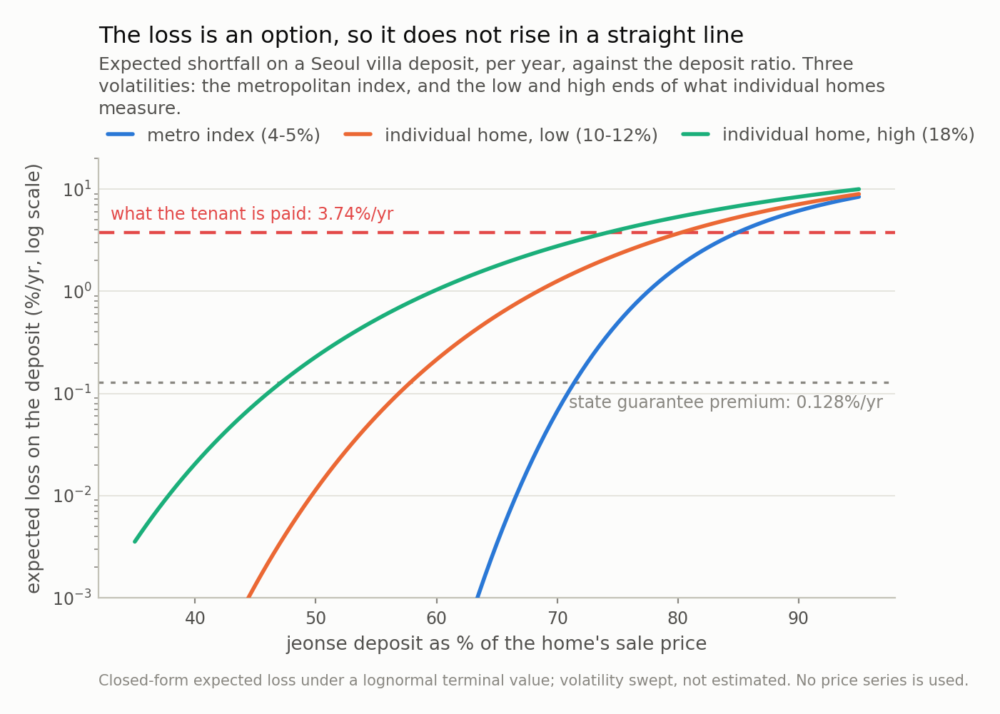
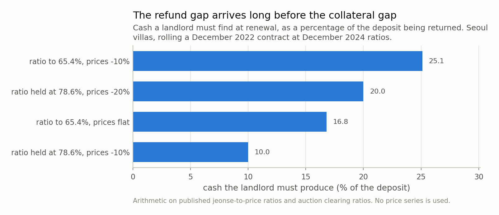

*Under Korea's jeonse system a tenant hands the landlord a lump sum worth half to four fifths of the home, pays no monthly rent for two years, and gets the sum back at the end. Everyone calls this an interest-free loan and stops there. It is a loan with a security structure: the tenant holds the first-loss tranche of a single-property mortgage, and the attachment point is one published ratio divided by another. A Seoul apartment tenant in January 2026 needs a 50% fall in the home's value before a single won is at risk. A Seoul villa tenant in December 2022 needed 0.5%. The compensation is the same in both cases: about 3.7% a year of free housing, net of what the money would otherwise earn. In one row that covers the expected loss more than a thousand times over; in the other it covers it once.*

## A loan everybody describes and nobody prices

Korea has a rental contract that exists nowhere else at scale. Under **jeonse** a
tenant hands the landlord a lump sum — commonly half to four fifths of what the home
is worth — lives there two years paying **no monthly rent at all**, and receives the
whole sum back at the end.

Every English explanation arrives at the same sentence: an interest-free loan from
tenant to landlord. Correct, and it is where they stop — which is a shame, because a
loan has a security structure and this one's decides everything.

Here is the tenant's payoff at the end of the term, with `D` the deposit, `M` any
mortgage ranking ahead of it, `V_T` the home's terminal value and `lambda` the fraction
of appraised value it fetches at a forced sale:

**min(D, max(0, lambda · V_T − M))**

Anyone who has looked at a securitisation has seen that expression. It is a
**first-loss tranche**. The tenant is not a customer paying rent but the most junior
creditor of a single-property loan, for an amount that is typically their entire net
worth. The rest of this post prices it.

## The one number that matters is arithmetic

Tranches have an **attachment point**: the collateral value at which they start taking
losses. Rearranging the payoff gives it immediately:

**V\* = (M + D) / lambda**

Stare at that, because of what is *not* in it. No volatility, no expected return, no
horizon, no model — one published number divided by another, and Korea publishes both
monthly: 전세가율, deposit over sale price, and 낙찰가율, winning bid over appraised
value, from the court auction statistics.

Take the friendliest case, `M = 0` — the deposit is the only claim. Two cohorts from
one city then sit at opposite ends of the same contract.

**A Seoul apartment, January 2026.** Deposit ratio 50.92%, an all-time
low since 2013 — not because deposits fell but because sale prices ran away from them.
Seoul apartments cleared 101% of appraisal at auction in July 2026,
a fourth straight month above par. Attachment point 0.504: the home
must fall **49.6%** before one won is at risk.

**A Seoul villa, December 2022.** Villas — 연립·다세대, the low-rise walk-ups for
people priced out of apartments — had a ratio of 78.6%. Seoul
villas clear 79%, and the ones nobody wants go for
41% after four failed rounds. Attachment point
0.995: the home must fall
**0.5%**.

Half of one percent against fifty. Same contract, same city, same statute, same
courts.

Two things about that gap, because the obvious way to describe it is wrong twice
over. First, it is **two** ratios moving, not one: of the
49 points, the deposit ratio accounts for
27.4 and the auction clearing ratio for
21.7. Move the deposit ratio alone and the
cushion goes to 22.2%, not to half a
percent. Villas are worse because the deposit is bigger *and* because a court gets
less for them, in roughly equal measure.

Second, resist dividing. Fifty over a half is "a factor of a hundred" and it means
nothing: the trigger is exactly linear in the deposit ratio — every point of ratio
costs 1.27 points of cushion, at every ratio,
which is why Fig 1 is three straight lines — so a ratio of two of its values is large
only because one sits near zero. The honest statistic is the difference in points.
There *is* real convexity here; it is in the next section, and it is about the loss.

None of which makes this clever. It is division, worth writing down because nobody
does it and because no number matters more to a prospective tenant.

*Fig 1. No model in this chart — it is (deposit + mortgage) / auction ratio, and nothing else. A Seoul apartment tenant in January 2026 needs a **50% fall** before a single won is at risk. A Seoul villa tenant in December 2022 needed **0.5%**. The lines are straight because the trigger is linear in the deposit ratio, so read the vertical gap in points, not as a ratio — and note that the two cohorts differ in the auction ratio as well as the deposit ratio, by 21.7 points of the 49.*

## Now the part that needs a model

Knowing the trigger is not knowing the risk. For that you need the chance of reaching
it, and there a model must be admitted. Mine is thin: lognormal terminal value, zero
drift, two-year term, one volatility parameter.

That parameter is the interesting choice. House price *indices* are quiet — Giacoletti
puts metropolitan index volatility at 4-5% a year. But the tenant does not own an index;
the tenant owns one building, and the same paper measures idiosyncratic volatility for
individual homes at **10-18% a year**. Pricing this off an index understates it three-
to four-fold.

So I swept it. Table 1 has every cohort; the two ends are what matter. At
12% a year over a two-year term, the January 2026 Seoul apartment
breaches with probability 0.00% and loses
0.0001% of the deposit a year; the December 2022 Seoul villa
breaches with probability **52%** and loses
**3.26%**. Four thousandths of a basis point to three
hundred basis points — four orders of magnitude.

*This* is the non-linearity, and note where it is not. The trigger in Fig 1 is a
straight line; the loss in Fig 2 spans four orders of magnitude over the same range.
Convexity is a property of the option, not of the arithmetic — far out of the money a
tranche is nearly free, at the money nearly worthless, with no gentle middle. Which is
why "the deposit ratio crept up a bit" is not a mild sentence.

Every cohort, with the first three columns published and the last two modelled:

| cohort | deposit ratio | auction ratio | fall needed | P(breach) | spread covers |
|---|---|---|---|---|---|
| Seoul apartment, Jan 2026 | 50.9% | 101% | 49.6% | <0.1% | >1,000x |
| Seoul, all housing, 2025 | 57.0% | 101% | 43.6% | <0.1% | >1,000x |
| nationwide, all housing, 2025 | 65.0% | 85% | 23.9% | 6.4% | 17x |
| Seoul villa, Dec 2024 | 65.4% | 79% | 17.2% | 15.2% | 6.0x |
| Seoul villa, Dec 2022 | 78.6% | 79% | 0.5% | 52.2% | 1.1x |

(The integral is easy to get wrong, so every cohort is checked against a
400,000-draw Monte Carlo. Largest disagreement:
0.0074 percentage points.)

*Fig 2. Between a 55% and an 80% deposit ratio the expected loss rises by roughly four orders of magnitude. Nothing about the contract changed across that range; the tenant simply moved from a tranche that is far out of the money to one that is at the money. The two reference lines are what the tenant receives for carrying it (3.74%/yr) and what the state charged to guarantee it (0.128%/yr).*

## What the tenant is paid for carrying it

A junior creditor should be compensated, and this one is — in kind. The tenant lives
rent-free, and Korea publishes the market price of that swap: the 전월세전환율, the
rate at which a deposit converts into monthly rent. In June 2026 it was
**6.06%** for Seoul and **6.62%** nationwide, a
record.

Subtract what the money would otherwise earn — the Base Rate is 2.75% after
July's hike — and the 0.128% guarantee premium. What is left is
compensation for credit risk and nothing else:

**3.74% a year.**

(For contrast, the Housing Lease Protection Act caps this rate at the Base Rate plus
2 points — **4.75%** — in a formula that
never mentions the security structure. It binds only on conversions mid-tenancy, so
nothing is being broken.)

Set that against the expected losses. For the January 2026 Seoul apartment it covers
the loss **more than a thousand times over** — still
192 times at the top of the
volatility range. For the December 2022 Seoul villa it covers the loss
**1.1 times**,
and 0.8 times at 18% — not at
all, since a first-loss tranche needs a risk premium *on top of* its expected loss.

A bond desk would say it this way. Given a loss-given-default of
75% — HUG recovers 24.9% on claims it takes
over — a spread of 3.74% a year fairly compensates an annual default
probability of about **5.0%**. That is a single-B
credit. Apartment tenants in Seoul are being paid single-B spreads to hold
something that, at a 51% attachment point, is closer to investment grade; villa
tenants in 2022 were paid the same spread to hold something well below it.

Which is the whole problem. The price was never wrong. **One price was quoted for two
completely different instruments.**

## Three ways to switch the mechanism off

A mechanism claim should come with a way to switch it off. This one has three.

**Take volatility to zero.** If prices never move, an out-of-the-money tranche never
breaches: the loss in Fig 2 is all option value. Except at the
December 2022 villa ratio, where the control cannot bite, because that cohort sat
0.51% from its attachment point. Take volatility to
**0.2% a year** — two orders of magnitude below any housing market ever measured —
and the breach probability is still **3.6%**, since half
a percent is under two standard deviations even then. At 2% it is
43%, at 12% 52%, at 18%
54%. So the control passes everywhere except at the ratio
actually being written, and there it says what the model cannot: the risk came not from
volatility but from signing half a percent from the edge.

**Take the liquidation haircut away.** Hold the ratio at 78.6%
and let the property sell at full appraised value. Expected loss falls from
3.26% a year to
0.34% — a factor of
10.
This is the control that reallocates blame. The villa deposit crisis was reported as
a story about falling prices; most of the loss here is not the price falling but the
21-point gap between a villa's appraisal and what a court
gets for it. Those call for different policies, and Korea has mostly debated the
first.

**Put a mortgage back in.** Every headline number above assumes none, which is why
they are floors. A senior lien takes the January 2026 Seoul apartment's
50% cushion to 30% at a
20% mortgage and 10% at 40%, with expected loss going
from 0.0001% a year to
2.60%. HUG capped the debt ratio at 80%.

## The crisis that arrived through the other door

Here is where my own model needs correcting, and the correction is the most useful
paragraph in the post.

Korea had a mass deposit-refund crisis in 2023 and 2024 without anything deserving the
word crash. For villas that fits Fig 1 — half a percent. But apartments also produced
tens of thousands of incidents, needing falls of tens of percent that never happened. A
collateral model cannot explain those, and I should not pretend it does.

There is a second mechanism, it is **linear**, and it fires first. When a contract rolls
over the landlord refunds `D` and collects a new deposit set by *today's* ratio and
price. The gap is cash he must find elsewhere.

Do that arithmetic on the published villa ratios with no price move at all. They went
from 78.6% in December 2022 to 65.4% in
December 2024, so a landlord refunding a completely unchanged house had to produce
**16.8% of the deposit in cash**; with a
10% price fall, 25.1%.

That is the shape of what happened. The collateral gap needs a large price move and is
an option; the funding gap needs no price move, is a straight line, and Korea generated
an enormous quantity of it. Whether it becomes a tenant's loss turns on something no
model here contains: whether the landlord had other money.

It is also why the falling ratio is not simply good news. Tenants repriced the tranche
by demanding a lower attachment point — the correct response — and every tenant who
did made every incumbent landlord's refund harder.

*Fig 3. The 'prices flat' bar contains no price move at all. Seoul villa deposit ratios fell from 78.6% to 65.4% between December 2022 and December 2024, so a landlord refunding an unchanged house had to produce 16.8% of the deposit in cash. That is a funding problem, it is linear, and it starts at price moves an order of magnitude smaller than the ones Fig 1 is about.*

## An accidental out-of-sample test

I did not plan this next number, and it is why I trust the rest.

My model says the December 2022 Seoul villa cohort lost about
3.26% of deposit a year. HUG — the state guarantor —
charged 0.128% a year to insure it: **25 times
too cheap.**

Now the same question with no model involved. Over 2020-2024 HUG paid **9조
4,189억원** of subrogation on incidents totalling **11조 441억원** across
50,941 cases and recovered **2조 3,458억원** — a
24.9% recovery rate — for a net loss of
**7.1조원**. Premiums over roughly the same window:
**3,525억원.**

A realised net loss ratio of **20x premium.**

Two unrelated routes — a lognormal integral on two published ratios, and a public
guarantor's audited cash flows — reaching the same order of magnitude. The agreement
is partly luck: HUG's book is not made of December 2022 Seoul villas, its recovery is
recovery *from landlords* rather than from property liens, and a guarantee also covers
fraud, which my model does not price. I would not defend the two agreeing to within a
factor of two. But the direction and magnitude are not in question, and neither
calculation knew about the other.

The building-type split says it a third time: 24,870
of the 50,941 incidents were villas against
13,251 for apartments — 1.9 to
one, in a country with far more apartments. That is where the attachment points were.

## What this means now

Jeonse is disappearing while I write this. In June 2026 monthly rent took
**54.1%** of Seoul apartment rental deals against
45.9% for jeonse — overtaking the deposit system in the country's
central market — and on 14 July 2026 the government floated a public trust to hold
deposits instead of landlords.

That proposal is a clean statement of the problem in tranche terms: if a public body
holds the deposit and pays the landlord a yield, the attachment point stops existing.
It also means the landlord no longer receives a lump sum, which was the only reason to
offer jeonse — so the honest description is not "jeonse made safe" but "jeonse ended,
with a transition period". Whether that is good policy my arithmetic cannot say.

What it can say is smaller and more useful. Anyone signing a jeonse contract can
compute their own attachment point first, from numbers the state publishes for free:
deposit over sale price, plus any registered mortgage, divided by the auction clearing
ratio for that building type in that district. Ten seconds, for the only figure that
matters. Nobody puts it on the contract, and there is no reason they could not.

## Where this is a caricature

**Lognormal, zero drift, one volatility.** Real house prices are autocorrelated and
skewed, volatility clusters, and two-year windows in Korea have been anything but
drift-free. A jump or regime model would fatten the left tail and make every loss figure
larger — the direction that does not rescue the conclusion.

**Volatility does not scale the way I made it scale.** Giacoletti's other finding is
that idiosyncratic house risk barely grows with holding period while index risk does,
so my √T scaling understates one-year and overstates five-year risk. Small over the
two-year term; not to be pushed further unfixed.

**The auction ratio is not the tenant's recovery.** 낙찰가율 is the winning bid over
*appraised* value, and appraisals are stale, contested and — the villa fraud cases
turned on this — sometimes inflated on purpose. Real recovery also loses court costs,
arrears and any tax lien outranking the tenant. Every figure here is optimistic on
that axis.

**And the tenant's real problem is one I did not model at all.** A bond desk holding
this tranche would hold a hundred. A household holds one, funded with everything it
has, and cannot diversify, hedge or sell it. Expected loss is the least of it: what
matters is a 75% loss of net worth in a single event, and no spread
I can compute makes that a reasonable position. That is an argument about position
sizing rather than pricing, and it is the strongest case against the instrument.

---

### Data

- Jeonse-to-sale-price ratio (전세가율) for Seoul apartments of 50.92% in January 2026, an all-time low since the series began in April 2013, breaking 50.87% of May 2023; Gangnam 37.7%, Songpa 39.4%, Yongsan 39.7%, Seocho 41.6% — KB부동산 monthly housing time series via 한국경제TV, 27 January 2026, <https://www.wowtv.co.kr/NewsCenter/News/Read?articleId=A202601270233>.
- Seoul villa (연립·다세대) jeonse-to-price ratio of 78.6% in December 2022, 68.5% in December 2023 and 65.4% in December 2024 — 한국부동산원 임대차시장 사이렌 via 한경비즈니스, 27 January 2025, <https://magazine.hankyung.com/business/article/202501271517b>.
- Composite jeonse-to-price ratios of 65% nationwide, 57% for Seoul, 65% for Gyeonggi and 68% for Incheon as of August 2025 — KB부동산, quoted in iM증권, 'From jeonse to monthly rent', 8 September 2025, <https://www.imfnsec.com/upload/R_E09/2025/09/%5B08074049%5D_251607.pdf>.
- Auction clearing ratios (낙찰가율) for July 2026: nationwide apartments 85.4%, a 16-month low, and Seoul apartments 101.0%, a fourth consecutive month above 100%; Incheon 80.4%, Busan 78.8% — 지지옥션 July 2026 auction report via 뉴스핌, 6 August 2026, <https://www.newspim.com/news/view/20260806000537>.
- Seoul villa auction clearing ratio of 79% against 102% for Seoul apartments, with non-redevelopment villas routinely failing three or four rounds and selling at 41-50% of appraised value — 지지옥션 via 디지털타임스, <https://www.dt.co.kr/article/12030827>.
- Jeonse-to-monthly-rent conversion rate (전월세전환율) of 6.06% for Seoul in June 2026, the highest since the series began in January 2018, and 6.62% nationwide; COFIX at 3.05% in June 2026 — 한국부동산원 via 뉴데일리, 20 July 2026, <https://biz.newdaily.co.kr/site/data/html/2026/07/20/2026072000203.html>.
- Bank of Korea Base Rate raised 25bp to 2.75% on 16 July 2026 — Bank of Korea monetary policy decision, <https://www.bok.or.kr/eng/bbs/E0000634/view.do?nttId=11062944>.
- HUG 전세보증금반환보증 premium schedule of 0.097%-0.211% a year depending on term, building type and debt ratio, with an 80% debt ratio limit and apartment appraisal capped at 140% of market value — 주택도시보증공사, <https://www.khug.or.kr/hug/web/ig/dr/igdr000001.jsp>.
- HUG guarantee incidents of 11조 441억원 across 50,941 cases in 2020-2024, subrogation of 9조 4,189억원 across 43,631 cases, recoveries of 2조 3,458억원 for a 24% recovery rate; by building type apartments 13,251 cases / 3조 2,685억원, 다세대 24,870 cases / 5조 1,960억원, officetels 10,648 cases / 2조 1,802억원 — 뉴시스, 22 October 2025, <https://www.newsis.com/view/NISX20251022_0003373232>.
- HUG cumulative guarantee supply of 99조 3,914억원 for 2020-2023 and premium income of 3,525억원 from January 2020 to August 2024, described as 0.35% of the outstanding guarantee balance — 뉴스토마토, <https://www.newstomato.com/readnews.aspx?no=1241569>.
- Monthly rent at 54.1% of Seoul apartment rental transactions in June 2026 against 45.9% for jeonse (8,819 against 7,477 deals) — Seoul Metropolitan Government via 파이낸셜뉴스, 22 July 2026, <https://www.fnnews.com/news/202607220822238116>.
- Seoul apartment jeonse listings down 32.8% year on year to 17,116 from 25,943, and villa jeonse prices up 0.44% in April 2026, the largest monthly rise in 12 years and 7 months — 한국부동산원 via 헤럴드경제, <https://biz.heraldcorp.com/article/10763783>.
- Government announcement of 14 July 2026 on a public trust ('안심신탁') to hold jeonse deposits instead of landlords, with mechanism, participation and guarantee terms all still undecided — 한국경제, <https://www.hankyung.com/article/202607217859O>.
- Idiosyncratic volatility of individual house capital gains of roughly 10-18% a year against 4-5% for metropolitan indices — Marco Giacoletti, 'Idiosyncratic Risk in Housing Markets', Review of Financial Studies 34(8), 2021, 3695-3741, <https://academic.oup.com/rfs/article-abstract/34/8/3695/6187964>.
- No price series is used or redistributed. Every input above is a published scalar; everything else in this post is closed form or fixed-seed simulation.

### Reproducibility

- **seed**: 20260804
- **environment**: quantpost=0.1.0, python=3.11.15, numpy=2.4.4, scipy=1.17.1
- **attachment**: the tenant receives min(D, max(0, lambda·V_T - M)), so the tranche attaches at (M + D)/lambda — no volatility, drift or horizon enters it
- **bound**: every headline figure sets M = 0, i.e. assumes no mortgage ranks ahead of the deposit, which makes the tenant's risk a floor rather than an estimate
- **loss**: expected shortfall integrated in closed form against a lognormal terminal value over a two-year term, zero drift, volatility swept over [0.05, 0.12, 0.18]
- **verification**: Monte Carlo, 400,000 draws per cohort; largest disagreement with the closed form 0.0074 percentage points; the exact trigger and the modelled one are asserted equal at every cohort, which is what catches a unit slip between the two code paths
- **decomposition**: of the 49.1pp gap between the January 2026 Seoul apartment and December 2022 Seoul villa triggers, the deposit ratio contributes 27.4pp and the auction clearing ratio 21.7pp
- **cross_check**: the model's mispricing factor for the December 2022 Seoul villa cohort is 25x; HUG's realised net loss ratio over 2020-2024 is 20x

Code: <https://github.com/jonghajeon/quantpost>
