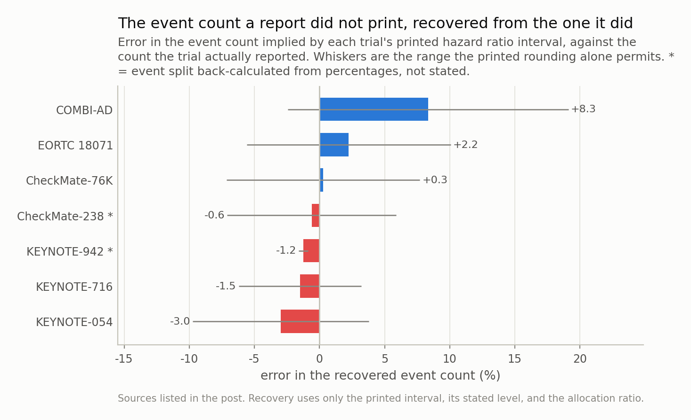
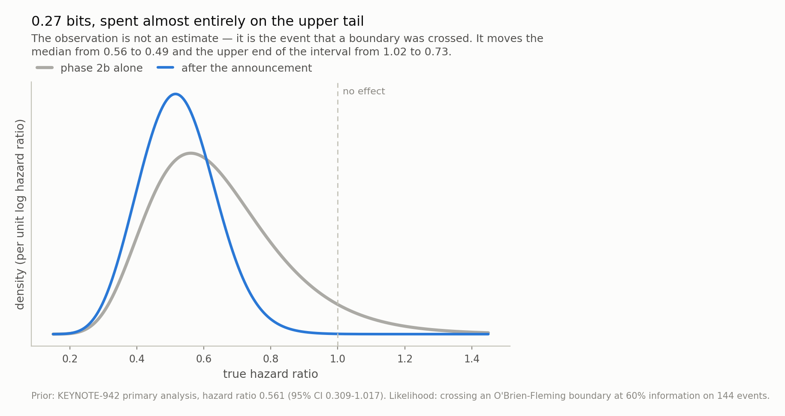

*On 19 August 2026, Merck and Moderna said their individualised mRNA cancer vaccine plus pembrolizumab beat pembrolizumab alone on both recurrence-free and distant metastasis-free survival in 1,137 patients with resected melanoma — the first phase 3 win for this class of therapy. The release is full of numbers and prints two hazard ratios, both of them from a different trial. About the phase 3 it gives the total randomised, the allocation ratio and the dose: no hazard ratio, no confidence interval, no p-value, no event count. It turns out that the width of a confidence interval is a statement about the number of events and nothing else, so on 7 earlier trials that published both, the event count can be read back out of the interval to **2.5%**. Run backwards, the same identity turns "statistically significant" into an upper bound on the hazard ratio — but the bound depends on the event count, so all the announcement pins down is a range from **0.57 to 0.72**. Against a prior built from the phase 2b, the whole announcement is worth **0.27 bits**, spent almost entirely on ruling out no effect.*

## The announcement

INTerpath-001 (NCT05933577) randomised 1,137
patients with completely resected stage IIB-IV cutaneous melanoma,
2:1, to intismeran autogene plus pembrolizumab or pembrolizumab
alone. On 19 August 2026 the sponsors said a pre-specified interim analysis
had shown statistically significant and clinically meaningful improvements in
investigator-assessed recurrence-free survival and in distant metastasis-free survival, with no new safety
signals and overall survival still immature. It is the first time an individualised
neoantigen therapy has won a phase 3, and it is a real event.

Now, the release is not short of numbers — that was this post's first draft and it was
wrong. Three dozen sit on the page: the dose, the construct
(up to 34 neoantigens per patient), melanoma epidemiology, pages of pembrolizumab safety tables,
and two hazard ratios with intervals — HR 0.51 (95% CI 0.294-0.887) for recurrence-free
survival, HR 0.411 (95% CI 0.200-0.843) for distant metastasis-free survival.

Read the label on those two. They are **KEYNOTE-942**, the 157-patient phase 2b, at
five-year follow-up. Not this trial. The release is explicit and every careful outlet
flagged it, but a hazard ratio sitting three paragraphs under a phase 3 win is the
number a reader carries away.

About the phase 3 the release gives three quantities — total randomised, allocation
ratio, dose — and none of the seven that would let you size it:
hazard ratio, confidence interval, p-value, event count, median RFS or DMFS, Kaplan-Meier rate at any timepoint or patients per arm. Nor does anything else: the companion
release is the same text, neither company filed an 8-K, the investor materials repeat
the release, and the registry record returns no results and has not been touched since
September 2025.

Which is ordinary practice, not concealment — journals and congresses take a dim view
of numbers that appeared in a press release first, and the earliest realistic venue is
ESMO in Madrid at the end of October, whose late-breaker deadline has not closed yet.
So the question is not why the numbers are missing. It is what is left: more than you
would think, and less than you would like.

## A confidence interval's width is a headcount

For a two-arm survival comparison the standard error of the log hazard ratio is
**SE = 1 / sqrt(D f)**, with **f = p_e (1 - p_e)**, where `D` is the total number of
**events** and `p_e` is the fraction of them in the treated arm. Sample size does not
appear: a patient who has not had an event carries almost no information about a hazard
ratio, which is why trials are sized in events.

This is usually introduced as Schoenfeld's asymptotic approximation to the log-rank
test, which undersells it. For exponential survival the exact maximum-likelihood
variance of the log hazard ratio is `1/D1 + 1/D0`, and
**1/D1 + 1/D0 = D / (D1 D0) = 1 / (D p_e (1 - p_e))** — the same number. It is a
counting identity in approximation's clothing, and the tests for this post check it
against that closed form rather than against another copy of itself.

Two consequences follow, and they are the whole post.

**The event count is recoverable.** The *width* of a printed interval contains no
information about the effect — only about how much data there was. So
`D = 4 z^2 / (f (log U - log L)^2)`, and any report that prints an interval has
also printed its event count, in a code.

**A future interval's width is knowable before the estimate is.** `exp(2 z SE)`
needs `D` and nothing else. Whatever hazard ratio INTerpath-001 eventually
reports, the precision of that report is already fixed.

One place to go wrong, and it is not small. `p_e` is the split of *events*, not of
patients, and a treatment that works contributes fewer events than its share of the
randomisation — at 2:1 allocation and a hazard ratio near 0.4
the two differ by a tenth of the implied event count, in a direction set by the effect
size. That last part is what makes it dangerous rather than merely imprecise. The fix
is available whenever a hazard ratio is: predict the split from it,
`p_e = p h / (p h + q)`.

*Mean absolute error 2.5% across 7 trials, worst case 8.3%. The rounding bracket contains the reported count in 6 of 7; the one it misses is KEYNOTE-942, whose event count is itself back-calculated from published percentages and misses by less than one event.*

## The control: seven trials that printed both

Adjuvant melanoma is a good place to test this: the setting has been studied
repeatedly with the same endpoint, and seven of those reports published a hazard
ratio, its interval, the level of that interval **and** the event count. So the
recovery has an answer key.

| trial | HR (printed CI) | level | events reported | recovered | error | rounding bracket |
|---|---|---|---|---|---|---|
| KEYNOTE-054 | 0.57 (0.43-0.74) | 98.4% | 351 | 341 | -3.0% | 319-365 |
| KEYNOTE-716 | 0.65 (0.46-0.92) | 95% | 136 | 134 | -1.5% | 128-140 |
| CheckMate-238 * | 0.65 (0.51-0.83) | 97.56% | 360 | 358 | -0.6% | 336-382 |
| CheckMate-76K | 0.42 (0.30-0.59) | 95% | 135 | 135 | +0.3% | 126-146 |
| COMBI-AD | 0.47 (0.39-0.58) | 95% | 414 | 449 | +8.3% | 404-501 |
| EORTC 18071 | 0.75 (0.64-0.90) | 95% | 528 | 540 | +2.2% | 500-585 |
| KEYNOTE-942 * | 0.561 (0.309-1.017) | 95% | 44 | 43 | -1.2% | 43-44 (misses) |

The mean absolute error is **2.5%**, worst case
8.3%. Using the observed event split instead of the
predicted one — cheating, since a press release does not carry it — improves it only to
2.1%. Skipping the correction and using the
allocation ratio costs 7.1%, signed by the design:
negative on four of the five balanced trials and near zero on the fifth, positive on
both 2:1 ones. Dropping the two rows whose event counts I
reconstructed from percentages makes it slightly *worse*,
3.1%, so the soft rows are not propping
it up.

**The largest single error available here is misreading the confidence level.** Two of
these are group-sequential designs reporting the interval that matches the alpha they
had left, not 95%: KEYNOTE-054 prints 98.4%, CheckMate-238 prints 97.56%. Read
KEYNOTE-054's as a 95% interval and its 351 events come back as
225 —
-35.8%, wrong by more than a third, on the strength of a
confidence level stated in a footnote.

The next is stranger, because it is not a statistical error at all. Six of the seven
print the interval to two decimal places, and that rounding alone permits a range of
event counts averaging ±7.3% — wider than most of the bars
in Fig 1, which is why the whiskers swallow them. The bracket contains the true count
in 6 of 7 cases, missing only KEYNOTE-942, by less
than a single event, on the row I derived from percentages rather than read.

## What breaks it, and what does not

Simulation separates the modelling error from the printing error, which published data
cannot: run the recovery on a simulated trial's own Cox output, where the interval is
exact to full precision and the event count is known.

0.4% under proportional hazards,
0.3% with
15%-a-year dropout, and — the part I did not expect —
0.0% when the effect is delayed by a
year, which is the failure mode an immunotherapy is most likely to have.

That last one looks like it should break everything and does not, for a reason worth
the caption below: the arithmetic sits downstream of the interpretation problem.

The one simulated case that does degrade the recovery is long follow-up with little
censoring (-4.0%),
where the Cox partial likelihood carries less information than the parametric identity
because the risk sets go lopsided. No report in the calibration set is in that regime.

So the ranking is: which confidence level the interval was printed at, then how many
decimals and whether you corrected the split — a footnote, a typesetting choice, one
line of code — and only then anything statistical, an order of magnitude down. That is
an unusual shape for an error budget. It normally runs the other way.

*The delayed-effect rows are the surprise. A twelve-month delay drags the estimated hazard ratio from 0.66 to 0.89 — the hazard ratio stops being a parameter and becomes a follow-up weighted average — and the event-count recovery does not notice, because the split it needs is predicted from the reported ratio, and the reported ratio is exactly what governs the split. The one statistical row above 1% is long follow-up with little censoring, which describes none of the seven reports: all of them censor most of their patients.*

## Applied to a release with no phase 3 numbers in it

Now run it backwards. Crossing an efficacy boundary at `z` means the observed effect
satisfied `|log HR| >= z SE`, so **HR <= exp(-z / sqrt(D f))** — an upper bound, not an
estimate. The announcement says the effect was at least this large and is silent about
how much larger. Two inputs are needed and neither was disclosed.

**The boundary.** At a first interim under O'Brien-Fleming spending the two-sided 0.05
boundary is exactly `1.96 / sqrt(t)` at information fraction `t` — 2.53 at
60%, not 1.96. An interim that clears its boundary has
cleared a higher bar than a final analysis would. Under Pocock spending the same look
asks only 2.10, and that choice alone is worth several hundredths
of a hazard ratio.

**The event count.** Two independent routes bracket it. Powering this setting for a
hazard ratio of 0.60-0.70 at 85-90% power needs
155-372 events at the final analysis,
and a first interim sits at 50-80%
of that, so 77-297. The
epidemiology instead — about 379 patients on pembrolizumab
alone, an annual recurrence hazard of 0.09-0.15
in this stage mix, mean follow-up of
1.2-2.0 years for a trial that opened in
mid-2023 — gives 83-251. Both routes
allow **83 to 251**.

Across that band the bound runs from **0.57 to
0.72**. The width is the point: one unpublished integer
moves the strongest available statement by
0.15 of hazard ratio, against a
total span of 0.47 to 0.75 for
every adjuvant melanoma regimen approved since 2015.

And the direction runs the wrong way round. The bound *rises* with the event count: a
larger interim needs a smaller effect to clear its boundary, so a bigger trial's bare
significance claim constrains the magnitude **less**. The announcement excludes a
hazard ratio above 0.65 — nivolumab's figure in the same setting — only if the interim
had at most 140 events, and above 0.70 only
up to 205. Both sit inside the plausible
band.

One prediction, so this is falsifiable at the meeting. At 83-251 events
and 2:1, the 95% interval will span a multiplicative factor of
**1.65 to
2.38** whatever the estimate is — a reported
0.60 would arrive with an interval near
0.43 to 0.83. Materially
narrower than that, and the trial had more events than either route allows.

*Inside the shaded band the bound runs from 0.57 to 0.72. Note the direction: the curves rise, so a larger trial's bare significance claim says less about magnitude, not more — the bound only excludes a hazard ratio above 0.65 if the interim had at most 140 events, and above 0.70 only up to 205. The dashed Pocock curve is the same claim under a different spending function, worth about 0.04 of hazard ratio on its own.*

## The announcement is worth a fraction of a bit

There is a cleaner way to say how much was learned. The observation is not an estimate;
it is the single event "the boundary was crossed", whose probability under a true log
hazard ratio is `Phi(-theta/SE - z)`. An ordinary likelihood, so it can update an
ordinary prior — and the natural prior is the phase 2b this trial was built on.

Which requires saying *which* KEYNOTE-942, because there are three published cuts and
they are not the same number:

| cut | median follow-up | RFS hazard ratio | 95% CI |
|---|---|---|---|
| primary analysis | 23 months | 0.561 | 0.309-1.017 |
| three-year update | 34.9 months | 0.510 | 0.288-0.906 |
| five-year update | 60.3 months | 0.510 | 0.294-0.887 |

The release quotes the five-year row. I use the **primary analysis**, for the reason
this series keeps returning to: the later cuts are conditioned on the trial having gone
on looking good. The primary analysis is the least selected of the three, so it is the
honest prior even though it is the least flattering.

One detail in that top row is worth stopping on: its interval **crosses 1**
(0.309 to 1.017), and the endpoint was met on a
pre-specified one-sided p of 0.0266 against a one-sided alpha of
0.10. The phase 2b that launched a 1,137-patient phase 3 was
a result whose interval included no effect, declared positive under a deliberately
permissive threshold. Defensible for a signal-finding trial, and a reminder of how much
"met its primary endpoint" varies in strength.

The choice does not drive the answer — each cut as prior gives a posterior median of
0.49,
0.47 and
0.47. What changes is how much the
announcement was worth: 0.27 bits against the primary
analysis, 0.15 against the five-year cut, because a
prior already giving the boundary 0.78
probability of being crossed had less left to learn. The more you already believed, the
less the news told you — and here that is the same integral, not a figure of speech.

At the centre of the event band the update moves the median from
0.56 to 0.49 and the upper
end of the interval from 1.02 to
0.73. The lower end moves from
0.31 to 0.29 — barely at all. That
asymmetry is what every significance test does: rule out no effect, stay nearly silent
about size.

Two ways to price it. How far the belief moved: 0.27 bits of
divergence. How surprising the news was: the prior gave the boundary being crossed
probability 0.67, so 0.58 bits of
surprisal. A yes/no answer cannot carry more than one bit under any accounting, and
most of that one was spent before the release went out.

Two caveats. Even the primary analysis is selected on having been significant, so it is
an optimistic prior — the winner's curse applies to it exactly as to a backtest, and
correcting would pull the posterior toward 1. And both endpoints were met, not one; but
distant metastasis is a subset of recurrence, so counting them as two observations
overstates the update by more than counting them as one understates it.

*Kullback-Leibler divergence 0.27 bits. The prior already assigned probability 0.67 to the boundary being crossed, so the surprisal is 0.58 bits — an upper limit of one bit, and most of it already spent. The lower end of the interval barely moves (0.31 to 0.29), which is the whole shape of the result: a significance test rules out the null and is nearly silent about how large the effect is.*

## What this changes

**Print the event count.** One integer, and it is the difference between a reader
bounding the effect within 0.15
of hazard ratio and not. Every topline release states the number randomised, which is
the number that does *not* determine the precision.

**Print the interval to three decimal places, and say which level it is.** Two
decimals throw away more than any statistical approximation here costs and more than
all of them together: ±7.3% of the event count against
4.8% for
every statistical row in Fig 2 summed. A 98.4% interval read as 95% understates the
data behind it by more than a third, and the level is usually in a footnote. Both are
typesetting decisions with statistical consequences, and nobody making them thinks of
them that way.

**Label a hazard ratio with its trial.** The two here belong to a 157-patient phase 2b
at five-year follow-up. The release says so; a reader skimming does not.

**And treat "statistically significant" as the bound it is** — "at least this large",
with a boundary set by when the look happened and a strength set by an event count.
Reported without that count it is one yes/no answer, worth 0.27 bits
against a prior that already expected it.

## Where to be careful

**Everything about INTerpath-001 here is a bracket around an unknown.** I have
guessed ranges for the event count, the information fraction, the spending function and
the data cutoff, and the bound is only as good as the loosest guess. At the meeting, the
interval-width prediction is the part to check: it does not depend on the effect at all.

**The epidemiological route is the weakest link, and even the arm sizes are
inferred.** It needs an annual recurrence hazard for a stage mix nobody has published
for this trial, and a mean follow-up I inferred from the enrolment period; if
enrolment closed earlier than I assume, the event count is higher and every bound
loosens toward 1. The 758 and 379
come from applying 2:1 to 1,137, since no
per-arm number was given — and the registry lists 1,089 as its
estimated enrolment, so the two public sources disagree by
4% on the least
contentious quantity in the trial.

**No verdict, in either direction.** A bound of 0.72 is not
a claim that the effect *is* 0.72; the true value could be
anywhere below it, and every phase 2b estimate sits well below it. Nothing here says
whether this therapy works or what it is worth to anyone. I have computed what a
disclosure constrains and stopped.

**Two of my seven answer-key rows are soft, and the set is narrow.** CheckMate-238's
event split comes from a health-technology assessment reading the paper's table rather
than the paper, and KEYNOTE-942's is back-calculated from percentages; without them
the headline error goes from 2.5% to
3.1%. And seven adjuvant melanoma trials
with one endpoint is a narrow calibration set. The identity is general; that it lands
within a few percent on *these* reports is a statement about these reports, and a
setting with heavier competing risks or crossover is worth checking separately.

---

### Data

- Merck & Moderna, INTerpath-001 topline release, 19 August 2026 — design, 1,137 randomised, 2:1 allocation, pre-specified interim, endpoints met. <https://www.merck.com/news/merck-and-moderna-announce-phase-3-interpath-001-trial-of-intismeran-autogene-plus-keytruda-met-endpoints-of-recurrence-free-survival-rfs-and-distant-metastasis-free-survival-dmfs-in-patient/>
- Moderna, the companion release, same date and same text. <https://news.modernatx.com/merck-and-moderna-announce-phase-3-interpath-001-trial-of-intismeran-plus-keytruda-met-endpoints-of-rfs-and-dmfs-in-melanoma>
- ClinicalTrials.gov NCT05933577 — INTerpath-001 registry record. Endpoint definition; estimated enrolment 1,089; hasResults false; last updated September 2025. <https://clinicaltrials.gov/study/NCT05933577>
- Absence of any phase 3 efficacy figure checked against: both companies' newsrooms, EDGAR full-text search for 'INTerpath-001' and 'intismeran' (no 8-K on the readout from either filer), Moderna's investor-relations events listing and its IR Insights video page, the registry above, and the trade press. STAT: 'the drugmakers did not immediately release detailed data'. BioPharma Dive: 'The companies didn't release detailed data but intend to do so at an upcoming medical meeting.' <https://www.statnews.com/2026/08/19/mrna-cancer-vaccine-trial-melanoma-merck-moderna/>
- KEYNOTE-942 five-year update, ASCO 2026 — RFS HR 0.51 (95% CI 0.294-0.887), DMFS HR 0.411 (95% CI 0.200-0.843), median follow-up 60.3 months. This is the cut the INTerpath-001 release quotes. <https://www.merck.com/news/moderna-and-merck-present-5-year-data-for-intismeran-autogene-in-combination-with-keytruda-pembrolizumab-in-patients-with-high-risk-stage-iii-iv-melanoma-following-complete-resection-at-the-20/>
- KEYNOTE-942 three-year update, ASCO 2024 LBA9512 — RFS HR 0.510 (95% CI 0.288-0.906). <https://www.merck.com/news/moderna-merck-announce-3-year-data-for-mrna-4157-v940-in-combination-with-keytruda-pembrolizumab-demonstrated-sustained-improvement-in-recurrence-free-survival-distant-metastasis-free-su/>
- KEYNOTE-054: Eggermont et al., N Engl J Med 2018;378:1789-1801 — HR 0.57, 98.4% CI 0.43-0.74, 135/216 events. <https://www.nejm.org/doi/full/10.1056/NEJMoa1802357>
- KEYNOTE-716: Luke et al., Lancet 2022;399:1718-1729 — HR 0.65, 95% CI 0.46-0.92, 54/82 events at the first interim. <https://www.thelancet.com/journals/lancet/article/PIIS0140-6736(22)00562-1/fulltext>
- CheckMate-238: Weber et al., N Engl J Med 2017;377:1824-1835 — HR 0.65, 97.56% CI 0.51-0.83. Event split read from the Scottish Medicines Consortium assessment SMC2112 rather than the paper. <https://scottishmedicines.org.uk/media/3958/nivolumab-opdivo-final-nov-2018-for-website.pdf>
- CheckMate-76K: Long et al., Nature Medicine 2023;29:2835-2843 (open access) — HR 0.42, 95% CI 0.30-0.59, 66/69 events, interim planned at ~123 events. <https://www.nature.com/articles/s41591-023-02583-2>
- COMBI-AD: FDA label for Tafinlar, NDA 202806/S-008, section 14.3 — HR 0.47, 95% CI 0.39-0.58, 166/248 events. <https://www.accessdata.fda.gov/drugsatfda_docs/label/2018/202806s008lbl.pdf>
- EORTC 18071: FDA label for Yervoy, BLA 125377/S-073, section 14.2 — HR 0.75, 95% CI 0.64-0.90, 234/294 events. <https://www.accessdata.fda.gov/drugsatfda_docs/label/2015/125377s073lbl.pdf>
- KEYNOTE-942 / mRNA-4157-P201 **primary analysis**, AACR 2023 CT001 — RFS HR 0.561 (95% CI 0.309-1.017), one-sided p=0.0266 against a one-sided alpha of 0.10; 24/107 vs 20/50 events (22.4% vs 40.0%); 18-month RFS 78.6% vs 62.2%; median follow-up 23 and 24 months. This is the cut used as this post's prior. <https://s29.q4cdn.com/435878511/files/doc_presentations/2023/Apr/16/aacr-23_ct001-mrna4157_april-16.pdf>
- Schoenfeld, D. (1981), 'The asymptotic properties of nonparametric tests for comparing survival distributions', Biometrika 68:316-319 — the variance identity everything here rests on.
- Lan, K.K.G. & DeMets, D.L. (1983), 'Discrete sequential boundaries for clinical trials', Biometrika 70:659-663 — the alpha-spending boundaries.

### Licence notes

- Every input is a published aggregate statistic — a press release, an FDA label, an open-access paper or a registry record. No patient-level data was used and none is needed; the whole method runs on numbers that were already printed for the public.
- This is a post about the information content of a disclosure. It is not a judgement on the therapy, the trial, the companies, or any security, and nothing here is medical or investment advice. A bound that permits a modest effect is not evidence of a modest effect.

### Reproducibility

- **seed**: 20260804
- **simulated trials per row**: 400 at 758:379
- **module**: standarderror.uq.survival
- **tests**: tests/test_survival.py
- **config hash**: e289e7f0c9159529
- **runtime**: 5.0s

Code: <https://github.com/jonghajeon/standarderror>
