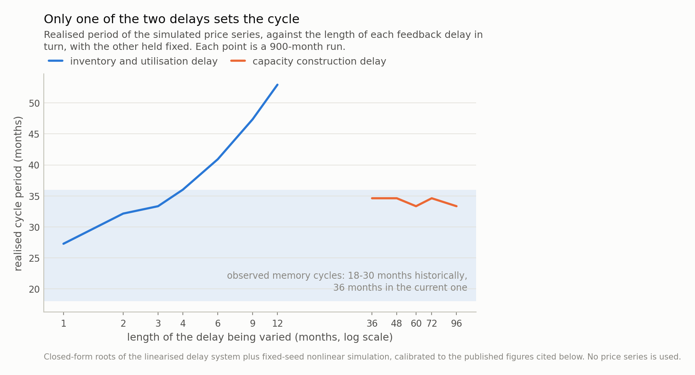
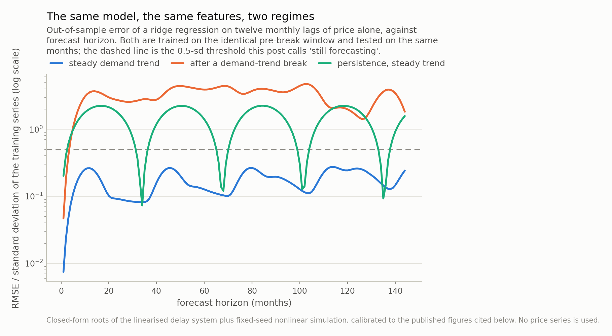
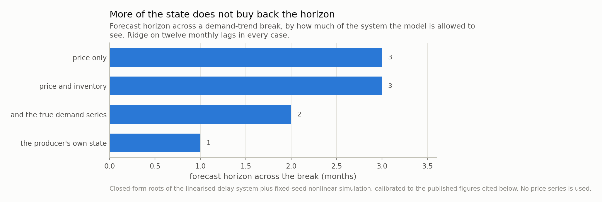

*Memory is short, and the statements being made about it run to years. So I built the loop that generates the cycle — supply responds to price with a lag, inventory integrates the imbalance, price responds to inventory — and tried to measure how far ahead it can be forecast. Three things came out, and the one I expected was wrong. The cycle's period is set by inventory and utilisation, which move in months, and is completely insensitive to the four-to-six-year fab construction delay that dominates every discussion of chip supply. Shifting a fifth of wafers onto memory that consumes three times as much of them per gigabyte costs 40% more wafers to deliver the bits that already existed. Saturation makes the cycle a limit cycle, so it is not hard to forecast at all: a ridge regression on twelve monthly lags of price holds skill out to the 144-month limit of the experiment, and a reservoir does no better. And one change breaks it — a single step in the demand growth *trend* takes the same model to 3 months and makes it worse than doing nothing. Which means a multi-year claim about a shortage is a demand-trend claim, not a cycle claim, and the two fail in completely different ways.*

## A question about a shortage, and what kind of question it is

Memory is short. Contract prices rose **90-95%** quarter
on quarter in the first quarter of 2026, **58-63%** in
the second and a forecast 13-18% in the third. Bit
supply growth for the year is capped near **16%** against
demand growth in the mid-thirties. Standard module lead times run
30-40+ weeks. High-bandwidth memory takes
about **23% of DRAM wafers** while producing about
16% of memory revenue, because a gigabyte of it consumes
roughly **3 times** the wafer capacity of a gigabyte of DDR5.

The question everyone is asking is how long this lasts, and the answers being
offered are measured in years. That is a forecast at a multi-year horizon. This
post is about what kind of object such a forecast is — not about whose is right,
which is not something arithmetic settles.

I went in expecting to find a horizon wall: a point past which the cycle is
unforecastable because it is a nonlinear feedback system, the way a weather
forecast dies at two weeks. I found the opposite, and the opposite is more useful.

## The loop, written down

Strip the industry to its feedback structure. Supply responds to price, but with a
lag — nobody raises utilisation or commissions a fab on today's number. Inventory
accumulates whatever imbalance is left over. Price responds to inventory.

In log deviations from a long-run path, with `p` price and `i` inventory relative to
its target:

**i_t = i_(t-1) + theta · sum_k g_k · p_(t - L_k)**

**p_t = (1 - d) · p_(t-1) - kappa · i_t**

Each `k` is a channel with its own gain `g_k` and delay `L_k`; `d` is the pull of
price toward long-run cost. Eliminate inventory and one linear delay difference
equation is left, whose characteristic polynomial is exact:

**z^L - (2-d) z^(L-1) + (1-d) z^(L-2) + kappa·theta · sum_k g_k · z^(L-L_k) = 0**

The first thing worth extracting is what happens at **d = 0**, no cost anchor. The
leading terms collapse to `(z-1)^2` — a double integrator — and a double integrator
under delayed proportional feedback is unstable at *every* positive gain and *every*
delay. The largest root at the configuration used here is
1.068, and there is no setting of the knobs that brings it
under one.

That is not a modelling nuisance. It says the thing that stops a memory market
diverging is not restraint in capacity planning. It is that cost per bit falls on a
learning curve and price is dragged toward it. Remove the learning curve and the
arithmetic has no equilibrium to offer.

One level effect belongs here rather than in the dynamics, because the two are easy
to conflate. Stacked memory consumes about **3 times** the wafer per
gigabyte, and it has gone from negligible to about **23% of DRAM
wafers**. Producing the *same* bits across that shift therefore takes
**40% more wafers** — the ratio of
1 + (r-1)m at the two mix levels, and nothing more than that. Spread over the twelve
years the simulation gives it, that is
2.9% a year of capacity growth spent standing
still. The real shift took closer to four years, which puts the drag at
**8.9% a year** against bit demand growth
that industry models put at 15%. More than half of all capacity growth, going to
deliver the bits that already existed.

With the anchor in, the dominant mode has a period of
**25 months** and grows at
5.0% a month — unstable, but bounded once
utilisation hits its ceiling and its floor. The nonlinear simulation settles into a
limit cycle of **34 months**, against
18-30 months for historical memory cycles
and about 36 months for the one running now.

## Only one of the two delays matters

There are two delays in the loop and they differ by more than an order of
magnitude. Utilisation and inventory move within a quarter. A leading-edge fab takes
**48-72 months** from groundbreaking to volume — six to
twelve months of permitting, twelve to eighteen of shell, nine to twelve of
cleanroom commissioning, twelve to fifteen of tool install and qualification, then
six to twelve of yield ramp, with specialised tools alone on
18-month lead times.

The naive expectation, and mine, is that the long delay sets the cycle. It does not.
Vary the fast delay from one month to twelve and the realised period moves
27 → 53 months. Vary the capacity
construction delay from 36 months to 96 — three years to
eight — and the period moves **1.3 months**, which at this
sampling resolution is nothing.

The construction lead time everyone discusses leaves no signature in the price
series at all. It is a real constraint on how much capacity arrives and when, and
it is dynamically invisible in the thing people read the cycle off.

One more piece of naive intuition to discard while we are here. The period is not a
fixed multiple of the delay: it depends on loop gain too, and in this family it
ranges from roughly three to fifteen times the delay depending on how strongly
utilisation responds. So "the cycle is about two years because fabs take about two
years" is wrong twice — wrong about which delay, and wrong to think a period can be
read back as a lead time at all.

*Fig 1. Stretching the fast loop from one month to twelve moves the cycle by 26 months. Stretching fab construction from three years to eight moves it by 1.3 — one sampling bin, which is to say nothing. The lead time that dominates every discussion of chip supply is the one with no signature in the price series.*

## The cycle turns out to be the easy part

Here is where I expected the wall and did not get one.

The unstable mode plus saturation is a **limit cycle**, and limit cycles are
forecastable. Fit a ridge regression to twelve monthly lags of log price — nothing
else, no inventory, no capacity, no industry knowledge — and predict *h* months
ahead, one fit per horizon, out of sample. Normalised error at twelve months:
**0.26** standard deviations, against
2.01 for persistence. It stays under the threshold all
the way to 144 months, which is where I stopped, not where it failed.

Fig 2 contains a free consistency check I did not plan. The persistence baseline's
error collapses almost to zero at horizons near 34, 68, 102 and 136 months — because
one full cycle later, doing nothing is accidentally right. Those dips are spaced by
the cycle period, measured by a baseline that knows nothing about the model, which is
about as independent a confirmation of the 34-month figure as
this setup can produce. It is also a warning about persistence as a baseline on any
periodic series: at the wrong horizon it looks unbeatable.

A 400-unit echo state network does no better. That is the honest headline for the
machine-learning half: on this series the nonlinearity buys nothing, because a
saturated limit cycle is smooth and nearly periodic and a linear map on enough lags
represents it perfectly well.

The reservoir was in fact the *fragile* option, and it is worth saying how rather
than leaving it in a footnote. At the default input scaling it failed outright on
every view with more than one channel; dropping the scaling to 0.15 fixed three of
them, and on the six-channel view it still reaches only **8 months** where the ridge
regression reaches 144. I did not tune per view, because tuning a model per
feature set and then comparing across feature sets measures the tuning. The honest
summary is that a reservoir on heterogeneous standardised inputs needs care that a
ridge on lags does not, and that on this problem the care buys nothing.

The shock size barely matters either, and the cleanest way to report that is to say
what does not move. Raising the monthly demand shock nearly sevenfold, from 1.2% to
8%, leaves the period unchanged to the resolution the measurement has
(**33.3** months against **33.3**) and the
median three-year peak-to-trough unchanged to two decimals
(2.03x against 2.03x). This
cycle is not noise-driven. It is structural, and structure is what models are good
at — which is the whole reason the first result came out the way it did.

So if the endogenous cycle is this forecastable, why is anyone uncertain?

## One thing breaks it, and it is not the dynamics

Change the **trend**, not the cycle.

Step the rate of demand growth once, from 15% a year to
35% — the shape of an AI-capex regime shift, and roughly the
gap between this year's published bit supply growth of about
16% and demand growth in the mid-thirties. Everything
else is identical: same model, same features, same training window, same test
months. The two simulated histories are the same series up to the break.

The horizon goes from 144+ months to **3 months**.

And it is worse than that, in a way worth dwelling on. At a twelve-month horizon
the post-break error is **3.55** standard deviations against
**0.84** for persistence. The model is not merely
uninformative; it is several times *worse than not forecasting at all*. A model that
has learned a cycle confidently extrapolates it, and a confident extrapolation of
the wrong regime is worse than an honest shrug.

Then the control that decides the interpretation. Give the model more to look at:
inventory, then the producer's own utilisation, product mix and capacity, then the
*true demand series itself* — data nobody outside the industry has. Horizons across
the break, in months:

| what the model sees | model | steady trend | after a break |
|---|---|---|---|
| price only | ridge on 12 lags | 144+ | 3 |
| price only | reservoir, 400 | 144+ | 0 |
| price and inventory | ridge on 12 lags | 144+ | 3 |
| price and inventory | reservoir, 400 | 144+ | 3 |
| the producer's own state | ridge on 12 lags | 144+ | 1 |
| the producer's own state | reservoir, 400 | 142 | 0 |
| and the true demand series | ridge on 12 lags | 143 | 2 |
| and the true demand series | reservoir, 400 | 8 | 0 |

Neither dimension of that table rescues anything. Every steady-trend row is at or
near the 144-month cap; every post-break row is inside a quarter, whether the
model is a ridge or a reservoir and whether it sees one channel or six. A training
window cannot contain a trend that has not happened yet, and no amount of state fixes
that, because the missing information is not about the present.

*Fig 2. On a steady demand trend the cycle is not merely forecastable, it is easy: normalised error 0.26 at a twelve-month horizon against 2.01 for persistence, and under the threshold out to the 144-month limit of the experiment. Step the demand trend once and the identical model reaches 3 months and is *worse* than persistence at twelve (3.55 against 0.84). Nothing about the model changed.*

*Fig 3. Bars are sorted by length, not by how much the model is shown. The 'true demand series' row hands it the producer's own utilisation, product mix and capacity *plus* demand itself — data nobody outside the industry has — and the horizon is 2 months against 3 for price alone. The limit is not what you can see. A training window cannot contain a trend that has not happened yet, and no feature fixes that.*

## What that makes a multi-year claim

Put the two halves together and the useful statement is a decomposition rather than
a forecast.

A forecast of memory prices contains two objects with completely different error
properties. The **cycle** is endogenous, structural, and easy — a linear model on a
year of monthly history tracks it as far out as I bothered to measure. The **trend**
is exogenous, and every large error in the experiment above came from it.

So when a statement runs to years, it is almost entirely a claim about the demand
trend, whatever the cycle language around it. That is worth knowing because the two
invite different scrutiny. A cycle claim can be checked against structure: what is
the loop gain, which delay dominates, where is inventory relative to the
8-10 week threshold that historically
flagged a turn. A trend claim cannot be checked that way at all. It rests on how
much compute gets built, and no property of the cycle has anything to say about it.

There is a second thing the model is clear about and I want to state carefully,
because it cuts against the natural reading of the first half. The capacity delay
being invisible in the *price series* does not make it unimportant — it makes it
unmeasurable from prices. Capacity committed today arrives four to six years out, so
the supply side of any 2030 statement is largely already determined and the demand
side is almost entirely not. That asymmetry is the reason multi-year forecasts of
this market disagree so much, and it is structural rather than a failure of anyone's
model.

I have no view here on how long the current shortage runs, and this post contains no
opinion about any company, any share price, or any investment.

## Where this is a caricature

**One product, one price, one region.** Real memory is several products with
different substitution elasticities, sold under contracts of different lengths, made
by a handful of producers whose capacity decisions are strategic rather than
mechanical responses to a price. A game between three producers is a different model
and would plausibly produce longer cycles than mine.

**The nonlinear period runs long.** The linearised dominant mode says
25 months and the simulation delivers
34, about
40% longer, because
saturation holds the system at its bounds for part of each swing. So the closed-form
analysis gets the *scaling* right — which delay matters, and in which direction —
and the level out by about
40%. Every period quoted
here is the simulated one for that reason.

**A single step in the trend is the friendliest possible break.** Real regime
changes are gradual, partly anticipated, and sometimes reversed. Gradual ones would
be easier to forecast than my step and anticipated ones much easier, so the
three-month horizon is a lower bound on what a real forecaster faces from a real
break — but the direction of the finding does not depend on the shape.

**Calibrated, not estimated.** The gains, the price response and the inventory
target are chosen so that the simulated cycle period, amplitude and inventory range
sit in the published ranges. That is calibration against a handful of scalars, not
estimation against a series, and a different calibration inside the same ranges
would move the numbers. What it would not move is the comparison, because both
columns of Table 1 come from the same calibration.

**And the horizon measure is a threshold on a curve.** I called it a horizon when
normalised error crosses 0.5. Move the threshold and every number moves;
the ratio between the two regimes barely does, which is the only thing the post
leans on.

---

### Data

- A leading-edge fab takes roughly 48-72 months from groundbreaking to volume production, split as design and permitting 6-12 months, shell construction 12-18, cleanroom commissioning 9-12, tool install and qualification 12-15 and yield ramp 6-12; specialised etch and deposition tool lead times in 2026 often exceed 18 months; fab utilisation above 90% extends standard logic lead times from 16 weeks to 34-40 — SupplyICs, 'Semiconductor Fab Construction Timeline and Capacity Analysis', 2026, <https://supplyics.com/insights/supply-chain/semiconductor-fab-construction-timeline-2026/>.
- Memory cycles have historically run 18-30 months; the cycle running from the mid-2023 trough had reached about 36 months by July 2026. 2026 bit supply growth capped near 16% against demand growth in the mid-thirties; HBM consuming about 23% of DRAM wafers with demand up 70% year on year; supplier inventories 3-5 weeks and channel inventories 7-9 against a historical warning threshold of 8-10; standard DRAM module lead times 30-40+ weeks; contract prices +90-95% quarter on quarter in Q1 2026, +58-63% in Q2 and a forecast +13-18% in Q3 — Luminix, 'DRAM Cycle Mid-2026 Update', July 2026, <https://www.useluminix.com/reports/industry-analysis/dram-cycle-position-analysis-peak-timing-indicators>.
- Each gigabyte of HBM consumes roughly three times the wafer capacity of DDR5 — Tom's Hardware, 19 December 2025, <https://www.tomshardware.com/pc-components/ram/hbm-is-eating-your-ram>.
- HBM at about 16% of total memory revenue, with the wafer trade ratio falling toward 1.5 as it approaches 25%; fab cycle times growing at a 14.8% compound annual rate since 2020; equipment spending per wafer area up over 150% since 2020; industry models assuming 15% annual DRAM bit growth and 95% utilisation — Semiconductor Engineering, 'From Latency To Reaction: Simulating The Next Wafer Demand Inflection', <https://semiengineering.com/from-latency-to-reaction-simulating-the-next-wafer-demand-inflection/>.
- The ongoing memory shortage and its framing as multi-year — '2024-present global memory supply shortage', Wikipedia, <https://en.wikipedia.org/wiki/2024%E2%80%93present_global_memory_supply_shortage>.
- No price series is used or redistributed. Every figure above is a published scalar; the series in this post are generated by the model described in it, at a fixed seed.

### Reproducibility

- **seed**: 20260804
- **environment**: standarderror=0.1.0, python=3.11.15, numpy=2.4.4, scipy=1.17.1
- **characteristic_polynomial**: z^L - (2-d) z^(L-1) + (1-d) z^(L-2) + kappa*theta*sum_k g_k z^(L-L_k), roots taken exactly; d is the reversion of price toward long-run cost
- **undamped**: at d = 0 the polynomial's largest root is 1.0678 > 1, and it exceeds one at every positive gain and delay: a double integrator under delayed proportional feedback has no stable configuration
- **dominant_mode**: period 24.5 months, |z| = 1.0504; the nonlinear run's realised period is 34.3 months, so saturation lengthens the cycle by about 40%
- **mix_drag**: moving 2% to 23% of wafers onto product consuming 3x the wafer per bit takes 40.4% more wafers for the same bits: 2.87%/yr over the model's 12-year adoption, 8.85%/yr over the 4 years it actually took
- **which_delay**: realised period moves 26 months across a 1-12 month fast delay and 1.3 months across a 36-96 month capacity delay
- **forecast**: direct multi-horizon ridge, one fit per horizon, trained on months 0-456 and tested on 486-600; horizon is the largest h with RMSE below 0.5 training standard deviations
- **reservoir**: 400 units, {'n_reservoir': 400, 'spectral_radius': 0.9, 'sparsity': 0.05, 'input_scaling': 0.15, 'leak_rate': 0.5, 'ridge': 1e-06, 'seed': 2}; the multi-channel views need the small input scaling to work at all, which is reported in the post rather than tuned away quietly

Code: <https://github.com/jonghajeon/standarderror>
