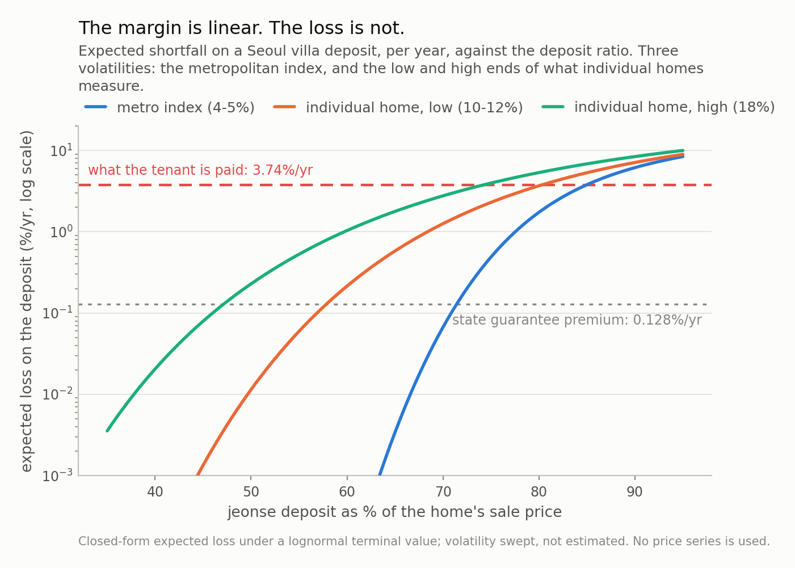

*Under Korea's jeonse system a tenant hands the landlord a lump sum worth half to four fifths of the home, pays no monthly rent for two years, and receives it back at the end. It is a secured loan, and secured loans have a safety margin you can compute: how far the home can fall before the deposit stops being fully covered. It is the deposit plus any registered mortgage, divided by what that kind of property fetches at a court auction — two figures Korea publishes monthly, and a number that appears on no contract. For a Seoul apartment at January 2026 ratios it is about 50%. For a Seoul villa at December 2022 ratios it was under a point. This post works out how to compute it, how much of it is arithmetic and how much is modelling, and the one mechanism it misses entirely.*

## A contract with a number missing

Korea has a rental arrangement that exists nowhere else at scale. Under **jeonse**,
a tenant hands the landlord a lump sum — commonly half to four fifths of what the
home is worth — lives there for two years paying **no monthly rent at all**, and
receives the whole sum back at the end.

It is easy to call this strange and much harder to call it bad. For decades it did
several useful things at once: it turned savings into housing without a mortgage, it
forced saving in a way monthly rent does not, and it was the standard rung between
renting and owning. Millions of households hold most of their net worth in one right
now.

It is also, unavoidably, a **secured loan** from tenant to landlord — and secured
loans have a quantity any lender asks for before signing: the **safety margin**, how
far the collateral can fall before the loan stops being fully covered. Korea publishes
both numbers you need to compute it. It appears on no contract and in no listing.

This post works it out: what the margin is, how much is arithmetic and how much is
modelling, and the one mechanism it misses entirely.

## The margin is two published ratios divided

Write `D` for the deposit, `M` for any mortgage registered ahead of it, `V_T` for
what the home is worth when the lease ends, and `lambda` for the fraction of
appraised value that kind of property fetches if it has to be sold at a court
auction. The tenant's claim pays

**min(D, max(0, lambda · V_T − M))**

which is fully covered as long as the home is worth at least

**V\* = (M + D) / lambda**

Note what is *not* in that expression: no volatility, no expected return, no horizon,
no model. The deposit ratio is 전세가율 — deposit over sale price. The liquidation
ratio is 낙찰가율 — winning bid over appraised value, published monthly by building
type and district.

Two worked examples, with `M = 0` so nothing else is in the way:

**Seoul apartments at January 2026 ratios.** Deposit ratio 50.92% — an
all-time low since the series began in 2013, not because deposits fell but because
sale prices ran ahead of them. Seoul apartments cleared
101% of appraisal at auction in July 2026, a fourth straight
month above par. Margin: **49.6%**.

**Seoul villas at December 2022 ratios.** Villas — 연립·다세대, much of the
affordable rental stock — had a deposit ratio of 78.6%, and Seoul
villas clear 79% at auction. Margin:
**0.5%**. By December 2024 the ratio had come down to
65.4%, which puts the same calculation at
17.2%.

Two things about the distance between those, because the obvious way to describe it
is wrong twice over.

First, it is **two** ratios moving, not one. Of the
49 points, the deposit ratio accounts for
27.4 and the auction clearing ratio for
21.7. Move the deposit ratio alone and the
margin goes to 22.2%, not to under a
point. Building type matters through both channels, in roughly equal measure.

Second, resist dividing. Fifty over a half is "a factor of a hundred" and means nothing
here: the margin is exactly **linear** in the deposit ratio — every point of ratio costs
1.27 points of margin, at every ratio, which is
why Fig 1 is three straight lines — so a ratio of two of its values is large only because
one sits near zero. The honest statistic is the difference in points.

None of which makes this clever. It is division, worth doing because the answer is
specific to your building and nobody hands it to you.

*Fig 1. No model in this chart — it is (deposit + mortgage) / auction ratio, and nothing else. A Seoul apartment tenant in January 2026 needs a **50% fall** before a single won is at risk. A Seoul villa tenant in December 2022 needed **0.5%**. The lines are straight because the trigger is linear in the deposit ratio, so read the vertical gap in points, not as a ratio — and note that the two cohorts differ in the auction ratio as well as the deposit ratio, by 21.7 points of the 49.*

## The margin is not the risk

Knowing how far the home can fall is not the same as knowing how likely that is,
and for the second question a model has to be admitted. Mine is thin on purpose:
lognormal terminal value, zero drift, two-year term, one volatility parameter.

That parameter is the interesting choice. House price *indices* are quiet —
Giacoletti's work on repeat sales puts metropolitan index volatility at 4-5% a year.
But a tenant is exposed to one building, not an index, and the same paper measures
idiosyncratic volatility for individual homes at **10-18% a year**. Reading this risk
off an index number understates it three- to fourfold, which is probably the most
transferable point here.

At 12% a year over a two-year term, the January 2026 Seoul
apartment case breaches its margin with probability 0.00% and
loses 0.0001% of the deposit a year in expectation; the
December 2022 Seoul villa case, 52% and
3.26%.

Here the two halves of the calculation behave completely differently, and it is worth
being precise. **The margin is linear. The loss is convex.** Fig 1 is a straight line;
Fig 2 spans four orders of magnitude across the same range. That convexity is a
property of the payoff, not of my parameters: a claim far below its threshold is nearly
riskless, one sitting at its threshold is nearly all risk, with no gentle middle. Which
is why "the deposit ratio went up a few points" is not a mild sentence, even though the
margin moved only a few points too.

Every case, side by side — the first three columns published or arithmetic, the last
two modelled:

| cohort | deposit ratio | auction ratio | fall needed | P(breach) | spread covers |
|---|---|---|---|---|---|
| Seoul apartment, Jan 2026 | 50.9% | 101% | 49.6% | <0.1% | >1,000x |
| Seoul, all housing, 2025 | 57.0% | 101% | 43.6% | <0.1% | >1,000x |
| nationwide, all housing, 2025 | 65.0% | 85% | 23.9% | 6.4% | 17x |
| Seoul villa, Dec 2024 | 65.4% | 79% | 17.2% | 15.2% | 6.0x |
| Seoul villa, Dec 2022 | 78.6% | 79% | 0.5% | 52.2% | 1.1x |

(The integral is easy to get wrong, so every row is checked against a
400,000-draw Monte Carlo. Largest disagreement:
0.0074 percentage points. The margin is also computed twice
by different code paths and asserted equal, which is how I caught a unit slip that
had already shipped one broken chart.)

*Fig 2. Between a 55% and an 80% deposit ratio the expected loss rises by roughly four orders of magnitude. Nothing about the contract changed across that range; the tenant simply moved from a tranche that is far out of the money to one that is at the money. The two reference lines are what the tenant receives for carrying it (3.74%/yr) and what the state charged to guarantee it (0.128%/yr).*

## What the deposit earns

The tenant is not lending for nothing. The return is paid in kind — a home occupied
rent-free — and Korea publishes the market price of that swap: the 전월세전환율, the
rate at which a deposit converts into monthly rent. In
June 2026 it was **6.06%** for Seoul and **6.62%**
nationwide, a record for the series.

Net of what the money would otherwise earn — the Base Rate is 2.75% after
July's increase — that is roughly **3.9% a year**, and
about 3.7% after a deposit-return guarantee premium of
0.128%. For readers who think in credit terms: at the loss rates above,
that is a comfortable multiple of expected loss in the apartment case and roughly
one times it in the December 2022 villa case.

The observation I would draw is narrow, and I want to keep it narrow. The conversion
rate is essentially **one national number**; the margin is **building-specific**, and
across Table 1 it runs from fifty points to under one. That is not evidence anyone was
cheated — deposit ratios are negotiated, tenants have preferences over building and
location, and much besides risk goes into what a home rents for. It does mean the
price is not where you look to find out how safe a deposit is. The margin is, and the
margin is free.

As for what margin is reasonable, the market has a rough convention: analysts describe
deposit ratios of **60-70%** as the band where jeonse and sale prices sit in stable
balance. Table 1 lets you turn any ratio into a breach probability at a volatility you
choose, which is more use than a band.

## Three ways to check the arithmetic

A claim built on a mechanism should come with ways to switch the mechanism off.
This one has three, and the second changed what I thought the answer was.

**Take volatility to zero.** If prices never move, a claim below its threshold never
breaches, so the loss in Fig 2 is all option value. The exception is the December 2022
villa ratio, where the control cannot bite: that case sat
0.51% from its threshold, and at a volatility of
**0.2% a year** — two orders of magnitude below any housing market ever measured —
the breach probability is still **3.6%**, because half a
point is under two standard deviations even then. At 2% it is
43%, at 12% 52%, at 18%
54%. So the control passes everywhere except at the
ratio that mattered most, and there it says something the model cannot: at that
margin, volatility is not what determines the outcome.

**Take the liquidation haircut away.** Hold the deposit ratio at
78.6% and let the property sell at full appraised value instead
of 79%. Expected loss falls from
3.26% a year to
0.34% — a factor of 10.
I did not expect that, and it moves the emphasis. Most of the modelled loss is not
the price falling; it is the 21-point gap between what a
villa is appraised at and what a court realises for it. Appraisal and liquidation
are a different problem from market risk, and the second is the one that gets
discussed.

**Put a mortgage back in.** Every figure above assumes none, which makes them upper
bounds rather than estimates. A senior lien takes the January 2026 Seoul apartment case
from 50% to 30% at a 20%
mortgage and 10% at 40% — the single biggest reason to
run this on your own building rather than a district average. The registered mortgage is
on the 등기부등본, and it is yours to look up.

## The mechanism the margin misses

Now the part where the arithmetic above is not enough, which is the most useful section
here.

Korea had a great deal of difficulty with deposit refunds in 2023 and 2024 without
anything deserving the word crash. For villas that fits Fig 1 — the margin was under a
point. But apartments, whose margins were tens of points, also saw many refund
problems, and the collateral arithmetic cannot explain those. I should not pretend it
does.

There is a second mechanism, it is **linear**, and it arrives first. When a lease
rolls over the landlord returns `D` and collects a new deposit set by *today's*
ratio and *today's* price. Any difference is cash that has to come from somewhere
else, and it has nothing to do with whether the collateral covers the claim.

Do that arithmetic on the published villa ratios with no price move at all. They went
from 78.6% to 65.4% between December 2022 and
December 2024, so a landlord returning a deposit on a completely unchanged home had to
produce **16.8% of it in cash**; with a 10%
price fall, 25.1%.

That is the shape of it. The collateral gap needs a large price move and is convex;
the funding gap needs no price move, is a straight line, and there was a great deal of
it. Whether a funding gap becomes a tenant's loss depends on something no model here
contains — whether the landlord could raise the difference — and in most cases they
could.

It also cuts against reading the falling ratio as unambiguously good. Asking for a
larger margin is the right response to a convex risk, and every tenant who did made
the incumbent landlord's refund arithmetic harder. Both are true at once, which is
usually a sign a single number is being asked to carry a judgement it cannot.

*Fig 3. The 'prices flat' bar contains no price move at all. Seoul villa deposit ratios fell from 78.6% to 65.4% between December 2022 and December 2024, so a landlord refunding an unchanged house had to produce 16.8% of the deposit in cash. That is a funding problem, it is linear, and it starts at price moves an order of magnitude smaller than the ones Fig 1 is about.*

## Where this is a caricature

**Lognormal, zero drift, one volatility.** Real house prices are autocorrelated and
skewed, volatility clusters, and two-year windows in Korea have been anything but
drift-free in either direction. A jump or regime model would fatten the left tail and
make every loss figure larger, which is the direction that does not rescue the
conclusion.

**Volatility does not scale the way I made it scale.** Giacoletti's other finding is
that idiosyncratic house risk barely grows with holding period while index risk does,
so my √T scaling understates one-year and overstates five-year risk. Small over the
two-year term; not to be pushed further unfixed.

**The auction ratio is not the tenant's recovery.** 낙찰가율 is the winning bid over
*appraised* value, and appraisals are stale, contested and occasionally wrong. Real
recovery also loses court costs, arrears and any tax lien that outranks the tenant,
and it takes time. Every figure here is optimistic on that axis, which is another
reason to treat the margin as a bound rather than a promise.

**The loss numbers are the least useful part.** An investor holding this kind of claim
would hold a hundred and care about expected loss, because a portfolio average is what
a portfolio delivers. A household holds one, and an average is not what it experiences.
That is a fact about position size rather than pricing, and no expected-loss figure
captures it — which is exactly why the number I would want before signing is the margin
in Fig 1, not anything in Fig 2. It is exact, it is specific to the building, and it
answers the question a household actually has.

**Guarantee statistics, for scale only.** HUG's published figures: 11조 441억원 of
deposit-return guarantee incidents across 50,941 cases over 2020-2024,
24,870 of them 다세대 against
13,251 apartments, 25% recovered on
claims taken over. Setting that against premium income produces a large ratio and an
earlier draft made something of it, but the pool is not the cohorts modelled here,
recovery from landlords is not lien recovery, and a guarantee covers fraud, which
nothing above prices. A sizing fact, not a verdict.

## The ten-second version

If you take one thing from this, take the recipe.

**(deposit + any registered mortgage) ÷ the auction clearing ratio for that building
type and district.** Subtract from one. That is how much the home can lose before your
deposit stops being fully covered.

Every input is public and free. The deposit is on your contract, the registered
mortgage on the 등기부등본, the auction clearing ratio published monthly by building
type and district. And the answer differs enormously between two buildings that would
look identical in a listing, which is the whole reason it is worth the thirty seconds.

Context, stated flatly because it is not my place to draw a conclusion from it. Jeonse's
share is falling: in June 2026 monthly rent took 54.1% of Seoul
apartment rental transactions against 45.9% for jeonse, and listings
were down 32.8% year on year. In July 2026 the government said it
would develop a proposal for a public body to hold deposits rather than landlords, with
mechanism, participation and guarantee terms all undecided.

Whether any of that is good policy is a question my arithmetic has no standing to
answer. What the arithmetic can do is put one specific, checkable number in front of
someone before they sign — and there is no reason that number could not simply be
printed on the contract.

---

### Data

- Jeonse-to-sale-price ratio (전세가율) for Seoul apartments of 50.92% in January 2026, an all-time low since the series began in April 2013, breaking 50.87% of May 2023; Gangnam 37.7%, Songpa 39.4%, Yongsan 39.7%, Seocho 41.6% — KB부동산 monthly housing time series via 한국경제TV, 27 January 2026, <https://www.wowtv.co.kr/NewsCenter/News/Read?articleId=A202601270233>.
- Seoul villa (연립·다세대) jeonse-to-price ratio of 78.6% in December 2022, 68.5% in December 2023 and 65.4% in December 2024 — 한국부동산원 임대차시장 사이렌 via 한경비즈니스, 27 January 2025, <https://magazine.hankyung.com/business/article/202501271517b>.
- Composite jeonse-to-price ratios of 65% nationwide, 57% for Seoul, 65% for Gyeonggi and 68% for Incheon as of August 2025 — KB부동산, quoted in iM증권, 'From jeonse to monthly rent', 8 September 2025, <https://www.imfnsec.com/upload/R_E09/2025/09/%5B08074049%5D_251607.pdf>.
- Auction clearing ratios (낙찰가율) for July 2026: nationwide apartments 85.4%, a 16-month low, and Seoul apartments 101.0%, a fourth consecutive month above 100%; Incheon 80.4%, Busan 78.8% — 지지옥션 July 2026 auction report via 뉴스핌, 6 August 2026, <https://www.newspim.com/news/view/20260806000537>.
- Seoul villa auction clearing ratio of 79% against 102% for Seoul apartments, with non-redevelopment villas routinely failing three or four rounds and selling at 41-50% of appraised value — 지지옥션 via 디지털타임스, <https://www.dt.co.kr/article/12030827>.
- Jeonse-to-monthly-rent conversion rate (전월세전환율) of 6.06% for Seoul in June 2026, the highest since the series began in January 2018, and 6.62% nationwide; COFIX at 3.05% in June 2026 — 한국부동산원 via 뉴데일리, 20 July 2026, <https://biz.newdaily.co.kr/site/data/html/2026/07/20/2026072000203.html>.
- Bank of Korea Base Rate raised 25bp to 2.75% on 16 July 2026 — Bank of Korea monetary policy decision, <https://www.bok.or.kr/eng/bbs/E0000634/view.do?nttId=11062944>.
- HUG 전세보증금반환보증 premium schedule of 0.097%-0.211% a year depending on term, building type and debt ratio, with an 80% debt ratio limit and apartment appraisal capped at 140% of market value — 주택도시보증공사, <https://www.khug.or.kr/hug/web/ig/dr/igdr000001.jsp>.
- HUG guarantee incidents of 11조 441억원 across 50,941 cases in 2020-2024, subrogation of 9조 4,189억원 across 43,631 cases, recoveries of 2조 3,458억원 for a 24% recovery rate; by building type apartments 13,251 cases / 3조 2,685억원, 다세대 24,870 cases / 5조 1,960억원, officetels 10,648 cases / 2조 1,802억원 — 뉴시스, 22 October 2025, <https://www.newsis.com/view/NISX20251022_0003373232>.
- HUG cumulative guarantee supply of 99조 3,914억원 for 2020-2023 and premium income of 3,525억원 from January 2020 to August 2024, described as 0.35% of the outstanding guarantee balance — 뉴스토마토, <https://www.newstomato.com/readnews.aspx?no=1241569>.
- Monthly rent at 54.1% of Seoul apartment rental transactions in June 2026 against 45.9% for jeonse (8,819 against 7,477 deals) — Seoul Metropolitan Government via 파이낸셜뉴스, 22 July 2026, <https://www.fnnews.com/news/202607220822238116>.
- Seoul apartment jeonse listings down 32.8% year on year to 17,116 from 25,943, and villa jeonse prices up 0.44% in April 2026, the largest monthly rise in 12 years and 7 months — 한국부동산원 via 헤럴드경제, <https://biz.heraldcorp.com/article/10763783>.
- Government announcement of 14 July 2026 on a public trust ('안심신탁') to hold jeonse deposits instead of landlords, with mechanism, participation and guarantee terms all still undecided — 한국경제, <https://www.hankyung.com/article/202607217859O>.
- Idiosyncratic volatility of individual house capital gains of roughly 10-18% a year against 4-5% for metropolitan indices — Marco Giacoletti, 'Idiosyncratic Risk in Housing Markets', Review of Financial Studies 34(8), 2021, 3695-3741, <https://academic.oup.com/rfs/article-abstract/34/8/3695/6187964>.
- No price series is used or redistributed. Every input above is a published scalar; everything else in this post is closed form or fixed-seed simulation.

### Reproducibility

- **seed**: 20260804
- **environment**: quantpost=0.1.0, python=3.11.15, numpy=2.4.4, scipy=1.17.1
- **attachment**: the tenant receives min(D, max(0, lambda·V_T - M)), so the tranche attaches at (M + D)/lambda — no volatility, drift or horizon enters it
- **bound**: every headline figure sets M = 0, i.e. assumes no mortgage ranks ahead of the deposit, which makes the tenant's risk a floor rather than an estimate
- **loss**: expected shortfall integrated in closed form against a lognormal terminal value over a two-year term, zero drift, volatility swept over [0.05, 0.12, 0.18]
- **verification**: Monte Carlo, 400,000 draws per cohort; largest disagreement with the closed form 0.0074 percentage points; the exact trigger and the modelled one are asserted equal at every cohort, which is what catches a unit slip between the two code paths
- **decomposition**: of the 49.1pp gap between the January 2026 Seoul apartment and December 2022 Seoul villa triggers, the deposit ratio contributes 27.4pp and the auction clearing ratio 21.7pp
- **guarantee_experience**: HUG's 2020-2024 figures are quoted for scale only: 50,941 incidents, 24.9% recovered on claims taken over. The pool is not the cohorts modelled here, recovery from landlords is not lien recovery, and fraud is not priced above, so no comparison against premium income is drawn

Code: <https://github.com/jonghajeon/quantpost>
