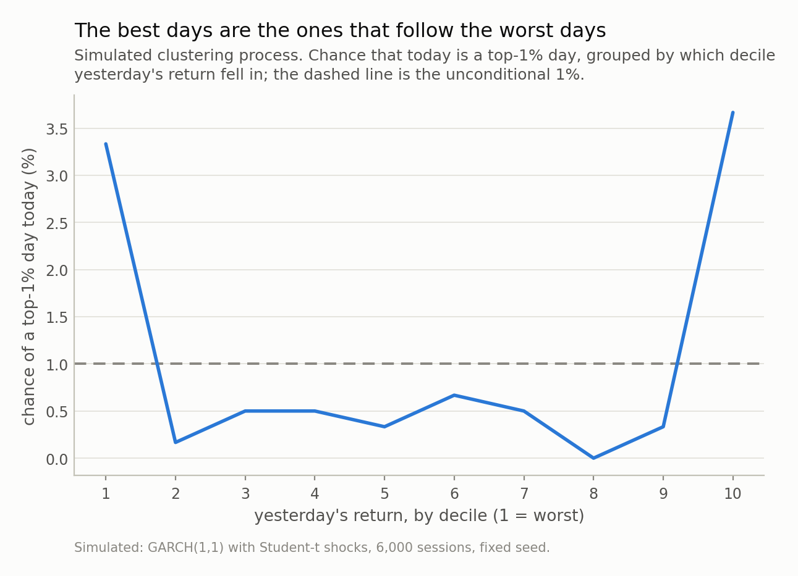
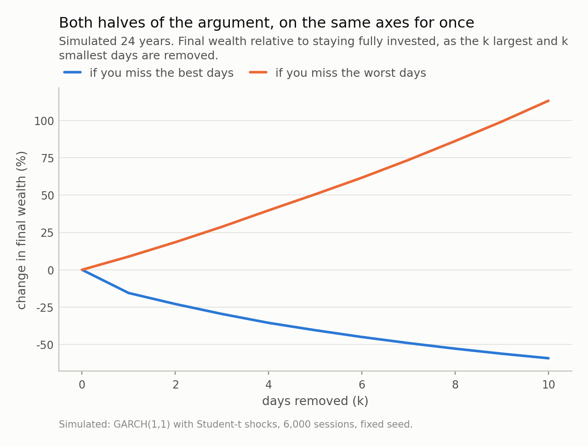

Disclosure: this post was written with the assistance of an AI system (Claude), which wrote the analysis code, ran the experiments and drafted the text. The topic, the constraints, the data choices and the final review are the author's.

*On 31 July 2026 the KOSPI rose 17.91% in a single session, the largest one-day gain in its history, days after a circuit breaker halted trading and inside the second-worst month the index has ever had. Under a Gaussian at 1.5% daily volatility that is an 11.9-sigma move with a return period of 10^30 years. Fat tails fix that in one line. What they do not fix is that the best day landed next to the worst — which under any i.i.d. model has a probability of exactly 2/n, or 1.3% for this year.*

## A day that no risk model contains

On 31 July 2026 the KOSPI closed up **17.91%** — 1,001.89 points,
to 6,595.45. It is the largest one-day gain in the index's history,
ahead of the 11.95% it managed on 30 October 2008. It happened days after
trading was halted by a circuit breaker for the eighth time this year, and inside a
month that fell 22.4% — the second-worst month the index has ever had,
behind October 1997.

Take that 17.91% and ask the question a risk system asks. If daily returns
were Gaussian with a calm-regime standard deviation of 1.5% — a typical figure for a
large equity index outside a crisis — the move is **11.9 standard
deviations**. The Gaussian probability of that is 10^-32, which
works out to a return period of **10^30 years**. The universe
is about 10^10 years old.

So the model is wrong, and everybody already knows the first answer: **fat tails**.
Replace the normal with a Student-t and the same move stops being absurd. At four
degrees of freedom, matched to the same 1.5% volatility, the return period falls
from 10^30 years to about
**110 years** — from unimaginable to something a
long-lived institution has already lived through.

That fix is real and it is one line of code. It is also the smaller half of the
problem, and this post is about the larger half.

*Fig 1. The vertical axis is a power of ten, so the gap between the Gaussian line and the Student-t lines is tens of orders of magnitude. This is the easy half of the problem: choosing a fat-tailed marginal moves a day like this from impossible to merely rare, and costs nothing but a parameter.*

## Fat tails are the easy half

The table below is the whole fat-tail argument, and I want it out of the way early
because it is not in dispute. Each row assumes a different calm-regime daily
volatility and reports the return period of a +17.91% day under three
distributions.

| assumed daily vol | the move, in σ | Gaussian | Student-t, df=4 | Student-t, df=3 |
|---|---|---|---|---|
| 1.00% | 17.9σ | 10^69 | 550 | 108 |
| 1.25% | 14.3σ | 10^44 | 227 | 55 |
| 1.50% | 11.9σ | 10^30 | 110 | 32 |
| 2.00% | 9.0σ | 10^16 | 35 | 14 |

Two things to notice. The Gaussian column is absurd everywhere in the range, so no
amount of arguing about the right volatility rescues it — the failure is the shape,
not the parameter. And — this one surprised me — the *monthly*
figure is not extreme at all. Scale 1.5% daily by the square root of 21 sessions and
22.4% in a month is 3.3 standard
deviations, a Gaussian return period of about
7 years. Nothing to report.

Which is its own small lesson about reporting frequency. Aggregate to months and the
central limit theorem quietly does its work: the sum of twenty-one wild days looks
almost well-behaved, and a monthly risk report would have shown a bad-but-ordinary
month where the daily data was screaming. If your tail statistics are computed on
monthly data, they are not tail statistics.

Fine. Use a Student-t, or an extreme-value tail, or a jump. All of them are
improvements, all of them are standard, and every risk textbook written since 1963
says so. Now here is what none of them do.

## The best day of the century, one session after the worst

The KOSPI's record gain did not arrive on a quiet Tuesday. It arrived in the middle
of the crash, in the same week as a trading halt, immediately after the index had
fallen roughly 41% from its June peak. The previous
record — that 11.95% in October 2008 — also arrived in the middle of a
crash. Both of the two largest one-day gains in this index's history happened while
it was falling apart.

That pattern has a probability attached, and it is worth computing, because the
computation does not depend on any distribution at all.

Suppose daily returns are i.i.d. — drawn independently from the same distribution,
whatever it is. Then every ordering of this year's returns is equally likely, so
the position of the best day and the position of the worst day are just a random
ordered pair of distinct days. Counting the pairs that are neighbours gives a
memorably simple answer: **2/n**, where n is the number of sessions. For 2026 up to
the end of July, 151 business days, that is
**1.3%**. Widen it to within three sessions and it is
3.9%. (I checked the formula against 200,000 simulated years:
1.38% against the exact 1.32%.)

Notice what is *not* in that expression. No volatility. No degrees of freedom. No
tail index. **Switching from a normal to a Student-t changes how large the moves
are and changes nothing whatsoever about when they arrive.** You can fit the
fattest tail in the literature and your model will still put the best day of the
decade on a random calendar date, uncorrelated with the worst.

Real markets do not work that way, and the mechanism is not mysterious: volatility
clusters. A shock raises tomorrow's expected volatility, which raises the chance of
a large move tomorrow, in *either* direction. Fit that and the pattern appears. In
a simulated series with clustering and nothing else — a plain GARCH(1,1) with
Student-t shocks — the chance that today is a top-1% *up* day, given that yesterday
was a bottom-1% *down* day, is 13.3%, against an
unconditional 1.0%. That is
13 times the base rate, with no skew, no asymmetry and no narrative
attached — just persistence in the variance. Group by yesterday's decile instead and
the shape is a U, not a slope: the bottom decile gives
3.3% and the top decile
3.7%, while the six middle deciles sit at or below
the unconditional rate. What predicts a big move is another big move, in either
direction.

*Fig 2. After a bottom-decile day the chance of a top-1% day is 3.3 times its unconditional rate; condition on a bottom-*1%* day instead and it is 13 times. The curve is U-shaped, not sloped: what predicts a big move is another big move, in either direction. No i.i.d. model, however fat its tails, can produce this shape.*

## Which quietly demolishes an argument you have heard

"Stay invested. Miss the ten best days of the last twenty years and you lose most
of your return." That chart is in every fund brochure, and it is arithmetically
true. It is also half of a sentence.

On my simulated 24 years: removing the ten best days costs
**59%** of final wealth.
Removing the ten worst days *adds*
**113%**. In compounding terms those
are 0.90 and
0.76 in logs — the same order of
magnitude, the mirror argument if anything the larger one, and only one of the two
lines has ever been drawn for a retail investor.

The clustering result tells you why you cannot have one without the other.
**90% of those ten best days occur while
the index is more than 10% below its previous peak**, with an average drawdown of
32% at the moment they happen. The best
days are not scattered through the good times. They are inside the crashes,
because that is where the volatility is. 31 July 2026 is the cleanest possible
illustration: to have captured the largest single-day gain in the index's history,
you had to be holding through a week that included two consecutive circuit breakers.

So "stay invested to capture the best days" is not a claim about upside. It is a
claim about being able to tolerate the downside, and it should be argued on those
terms.

*Fig 3. The left-hand argument is always shown and the right-hand one almost never is, and they are comparable in size — the one nobody draws being the larger. The honest reading is not "stay invested": it is that 90% of those best days happen while the index is more than 10% below its peak, so capturing them and sitting through the crash are one decision, not two.*

## How a risk model fails the test it passes

This is the part that matters if you own a model rather than a portfolio, and it is
why I care more about clustering than about tails.

On the same simulated series I built two static value-at-risk models at
1%, both estimated on the first half and both judged on the second, and
ran the two standard backtests on each.

The first is the naive one: a Gaussian VaR from the in-sample standard deviation. It
fails **Kupiec's proportion-of-failures test**, which asks only whether the *number*
of breaches is right — 1.90% observed against
1% expected, 57 breaches where
30 were expected, p = 1.1e-05. No
surprise: thin tail, too many exceptions. This is the failure the fat-tail
literature exists to fix.

So I fixed it, in the cheapest possible way: take the empirical 1st percentile of the
in-sample returns instead of a Gaussian quantile. No distributional assumption at
all, the fat tail handled non-parametrically. And it works — on the count:

- breaches 1.07% against 1% expected,
  **Kupiec p = 0.72**. Passes comfortably.
- **Christoffersen's independence test**, which asks whether the breaches arrive
  spread out or together: **p = 1.3e-05**. Fails
  outright.
- The probability of a breach tomorrow given a breach today is
  16%, against the 1% the model implies. The
  longest run of consecutive breaches is 3.

Same data, same model, two tests, opposite verdicts — and the fat-tail fix moved the
first verdict without touching the second. A capital buffer sized for
30 breaches spread across
12 years is not sized for
3 of them in 3 consecutive days. The count
was never the risk. The arrival pattern was.

The remedy is not exotic — let the volatility move (GARCH, EWMA, a realised
estimator, anything conditional) and report expected shortfall next to the quantile
so the *size* of a breach counts and not just the fact of it. But the diagnostic
matters more than the model: **run the independence test, and put its p-value beside
the coverage number.** A dashboard reporting "VaR exceptions: 32,
expected 30" is reporting the test the model passes.

## Where this argument is thinner than it looks

Four things I am not claiming.

**I did not estimate the volatility.** The repo holds no KOSPI price series — the
figures here are quoted from published reports, so the calm-regime volatility is an
assumption I swept across a range rather than a number I measured. That is why
Table 1 has four rows instead of one. The conclusion is stable across the range, but
"σ was really 3% by late July" is a legitimate objection, and the honest answer is
that a conditional model would have *known* that, which is the post's point rather
than a hole in it.

**One index, one episode.** Two record gains inside two crashes is a pattern with
two observations in it. The clustering evidence in Figs 2 and 3 is simulated, not
sampled from the KOSPI: it shows that a standard clustering model reproduces the
pattern, not that the KOSPI's parameters are the ones I chose.

**GARCH is not the truth either.** It reproduces volatility clustering and fat
tails, and it still assumes a fixed structure that no market has agreed to. It has
no jumps, no regime changes, and a symmetric response to good and bad news that
equity indices are known to violate.

**2/n assumes continuous i.i.d. returns.** With ties, or with a deterministic
calendar effect, the counting changes slightly. It does not change by anything that
matters at n ≈ 151: at 141 sessions the
figure is 1.42% rather than
1.32%.

What survives all four is narrow and, I think, useful: the arithmetic that makes a
+17.91% day impossible is about the shape of the distribution, and the
arithmetic that makes it land next to the crash is about dependence. The first is
what everyone reaches for. The second is where the money is.

Next in this series, back to dynamics: what a neural network is doing when it looks
like it has learned physics, and how to tell that apart from having memorised a
trajectory.

---

### Data

- KOSPI figures are quoted from published reports, not from a redistributed price series — this repo holds no index history and needs none, because every calculation takes the reported move as its input. 31 July 2026: +17.91% (+1,001.89 points) to 6,595.45, the largest one-day gain on record, surpassing +11.95% on 30 October 2008 — Seoul Economic Daily, <https://en.sedaily.com/finance/2026/08/03/escaping-the-rollercoaster-kospi-index-recovers-6600-eyes> and TradingKey, <https://www.tradingkey.com/analysis/stocks/us-stocks/262067341-kospi-surged-17-9-percent-largest-single-day-gain-history-july-31-2026-tradingkey>.
- 28 July 2026: the year's eighth circuit breaker, the KOSPI's threshold being an 8% fall, with halts on consecutive sessions for the first time — Seoul Economic Daily, <https://en.sedaily.com/finance/2026/07/28/breaking-news-kospi-triggers-circuit-breaker-8th-this-year>.
- July 2026 monthly return -22.4%, second only to October 1997's -27.2%; June peak near 9,385 and July low near 5,520 — TradingKey, <https://www.tradingkey.com/analysis/stocks/us-stocks/262067341-kospi-surged-17-9-percent-largest-single-day-gain-history-july-31-2026-tradingkey>.
- Everything else is simulated with a fixed seed: a GARCH(1,1) process with Student-t shocks, reproducible from the repo.

### Reproducibility

- **seed**: 20260804
- **environment**: standarderror=0.1.0, python=3.11.15, numpy=2.4.4, scipy=1.17.1
- **closed forms**: Gaussian and rescaled Student-t survival functions evaluated in logs (the probabilities underflow float64 by tens of orders of magnitude); adjacency probability (2kn - k(k+1)) / (n(n-1))
- **adjacency check**: exact 0.01325 against 200,000 Monte Carlo draws 0.01377
- **sessions**: 151 business days from 2026-01-02 to 2026-07-31 (ignoring Korean market holidays; at 141 sessions the adjacency probability is 1.42% instead of 1.32%)
- **simulation**: GARCH(1,1), omega=0.02, arch=0.1, garch=0.88, t(5) shocks, 6,000 sessions (24 years), unconditional daily sd 1.19%
- **VaR backtest**: two static VaR models at 1% — a Gaussian quantile and the empirical 1st percentile — both estimated on the first 3,000 sessions and tested on the next 3,000

Code: <https://github.com/jongha-jeon-dev/standarderror>
