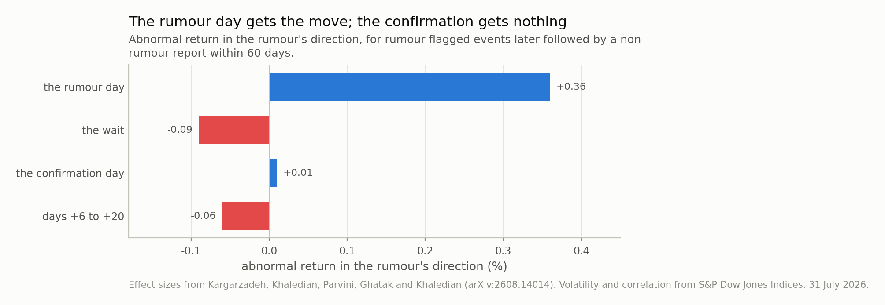
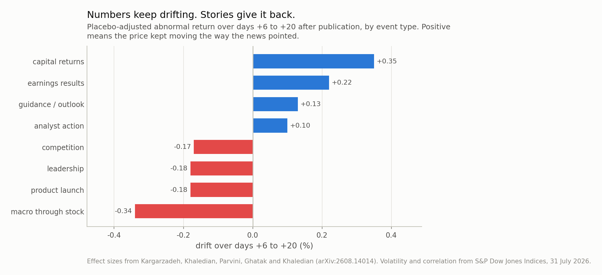
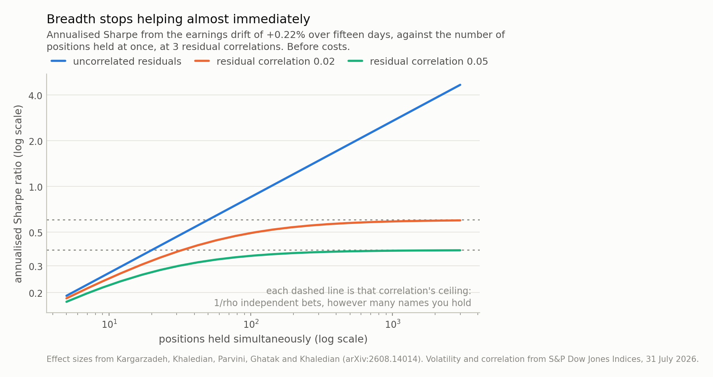

*'It's already priced in' and 'buy the rumour, sell the news' are two of the oldest things anyone says about markets, and both put the price move before the headline rather than after it. A paper posted this month tested them on **4.57 million** news articles across about 3,000 US stocks. Pooled over 1.68 million events the news-aligned move reaches +0.58% by the closing bell on publication day and +0.20% twenty days later — two thirds handed back. For rumours, the rumour day carries the whole move and the confirmation carries +0.01%. Underneath that, quantified news keeps drifting and story-driven news reverses. This post walks through the study and then does the one thing it deliberately does not: works out what effects of this size are worth, which turns on a single number neither of us measured.*

## Two sayings, and someone finally measured them

Markets have a pair of proverbs that say almost the same thing. **It's already
priced in**, meaning that by the time you read the headline the move has happened.
And **buy the rumour, sell the news**, meaning the money is made on the whisper and
given back on the confirmation. Both put the price move *before* publication, which
is a testable claim and an awkward one to test, because you need to know what every
article was about.

A paper posted to arXiv this month does it at a scale that makes the question
answerable: **4.57 million financial news articles** covering
roughly **3,000 US stocks** over 2023-2026. The sayings mostly hold. What is
more interesting is the structure underneath them, which is not folklore at all.

## How you label four and a half million articles

The measurement problem is the labelling problem. An event study needs to know what
happened, and "what happened" lives in prose.

The approach is the one that has quietly become standard for this kind of work, and
it is worth naming because it is the reusable part. A large language model acts as a
**teacher**, labelling a sample. A compact classifier is then **distilled** from
those labels through **active learning** — the model asks for labels where it is
least certain — and that small model labels the rest. You get an LLM's judgement at
a small model's cost per article, which at 4.57 million articles is the difference
between a study and a budget request.

Each article comes out with one of **17 event tags** and **5
attributes**. The tags are what you would expect and a few you might not: earnings
results, guidance, capital returns, analyst actions, M&A, legal and regulatory,
financing and dilution, insider and ownership, leadership, operations and supply,
product launch, competition, partnership, macro commentary through a single stock,
price commentary, other corporate, and promotional content. The attributes cut
across them — whether the news was **scheduled**, **forward-looking**, from a
**primary source**, **quantified**, or a **rumour**.

Two design choices matter more than the classifier.

First, articles are **clustered into stories**, so a first report is separated from
the follow-up coverage of the same event. Without that step the tenth article about
an acquisition looks like a tenth event, and the "anticipation" you measure is
partly just the press repeating itself. The paper's own estimate is that follow-up
coverage inflates measured anticipation by roughly **a third** — which is a large
enough correction to be the difference between a finding and an artefact.

Second, the comparison is against a **placebo**: 364,405 neutral-sentiment
news events, used to measure what a stock does around a news day that carries no
direction at all. Every drift number below is net of that baseline. This is the step
that separates "stocks move around news" from "stocks move *in the direction of*
news", and it is the reason the results are worth reading.

That machinery produces **1.68 million stock-day events** with
beta-adjusted abnormal returns around each.

## Finding one: the move is mostly over before you read it

Take every signed event, orient each one so that positive means "in the direction
the news pointed", and add up abnormal returns from five days before publication.

By the closing bell on publication day the running total is
**+0.58%**. Twenty trading days later it is
**+0.20%**.

The ratio is 2.8, and the plainer way to say it is that
**66% of the news-aligned move is handed back** after the
news is out. The proverb is not quite that nothing happens after publication —
something does, and it points backwards.

The rumour version is sharper, and it is the cleanest result in the paper. Take
events flagged as rumours that were later followed by a non-rumour report within
sixty days, so the same story is caught twice. The rumour day delivers
**+0.36%**. The wait between rumour and confirmation:
-0.09%. The confirmation day itself, when the thing is actually
announced: **+0.01%**. The following month:
-0.06%.

One basis point on the day the news is confirmed. Buy the rumour, sell the news.

*Fig 1. This is the saying, measured. The rumour day carries **+0.36%**; the day the story is actually confirmed carries **+0.01%** — inside rounding of nothing. Everything after the rumour, added up, is -0.14%.*

## Finding two: numbers drift, stories reverse

The pooled number hides the good part. Split by event type and the sign of the
post-publication drift splits with it.

Over days +6 to +20, placebo-adjusted. The first three columns are the paper's; the
last two are mine and are explained two sections down — ignore them for now.

| event tag | drift, +6 to +20 | p | events the p needs | dies at |
|---|---|---|---|---|
| capital returns | +0.35% | <0.001 | >9,862 | 35 bp |
| earnings results | +0.22% | <0.001 | >24,961 | 22 bp |
| guidance / outlook | +0.13% | 0.046 | 26,287 | 13 bp |
| analyst action | +0.10% | 0.012 | 70,414 | 10 bp |
| competition | -0.17% | 0.026 | 19,134 | 17 bp |
| product launch | -0.18% | 0.022 | 18,065 | 18 bp |
| leadership | -0.18% | 0.016 | 19,983 | 18 bp |
| macro through stock | -0.34% | <0.001 | >10,451 | 34 bp |

The four positive rows all carry a **number** — a dividend, an earnings figure, a
guidance range, a price target. They average
+0.20% and they keep drifting the way the news pointed for
weeks after it is public. The four negative rows are **stories** — a launch, a
change of leadership, a competitive threat, a macro argument routed through one
stock. They average -0.22% and give the move back.

The first half of that is not new: post-earnings announcement drift has been in the
literature since the 1960s and has survived every attempt to explain it away. What
the taxonomy adds is the other half and the contrast. **The market underreacts to
things it can put in a spreadsheet and overreacts to things it has to interpret**,
and the same fifteen-day window measures both, in opposite directions, on the same
stocks.

If you want one mechanism for it, the attribute list already contains the candidate:
*quantified*. A number can be plugged into a model slowly, by many people, over
weeks. A story is priced by whoever finds it most exciting, immediately.

*Fig 2. The four positive tags are the ones carrying a number — a dividend, an earnings figure, a guidance range, a target price — and they average +0.20%. The four negative ones are stories, and they average -0.22%. Same market, same window, opposite sign.*

## Finding three: news has a width

The third result is the one I would have missed, and it is about the second moment
rather than the first.

Publicity **raises volatility before** the publication day and volatility **falls
once the news is out**. Not because the news was calming, but because publication
resolves uncertainty: before it, the distribution of what might be announced is
wide; after it, there is only the announcement.

Anyone who has held an option through an earnings date has paid for this. It also
means a news-conditioned model has two things to predict, and the second one is the
better behaved: the direction of the move is nearly gone by the time you can read
about it, while the *width* is predictable ahead of a scheduled event and shrinks on
a known date.

## What effects of this size are worth

Here is the part the paper deliberately does not do, and where I can add something:
put these numbers in units you can judge.

Everything turns on one figure neither the paper nor I measured. On 31 July 2026
S&P's dispersion dashboard put **average pairwise correlation** among S&P 500
constituents at **0.05**, with implied constituent volatility at
44.42 and the dispersion index at 41.42 — just off an all-time high of
47.51. That single number lands twice, in opposite directions, and the
two landings are the whole of this section.

**First landing: it explains the size of the study.** At a pairwise correlation of
0.05, the systematic share of a single stock's variance is negligible, so
beta-adjusting an abnormal return removes only
**2.5%** of its volatility. Scale 44.42%
annual to fifteen trading days and a single event's abnormal return sits in about
**10.6%** of noise. Against that, a +0.22%
earnings drift is a per-event Sharpe of **0.021**.

Which lets you check the paper from outside. A reported p-value implies a minimum
sample: `n = (z sigma / effect)^2`. Earnings at p < 0.001 needs at least
**24,961** events. Analyst actions, at
+0.10% and p = 0.012, need over
**70,414**. Every one of those is comfortably
inside what 1.68 million events across 17 tags supplies — about
98,824 per tag on average, though tag sizes are certainly very
unequal and the paper does not publish the split, so this is a sanity check rather
than a verification. The p-values are consistent with the design, and the arithmetic
says independently why the study needed millions of articles rather than thousands.
At these effect sizes there was no cheaper way to find them.

**Second landing: the same number caps what they are worth.** Hold `n` positions
whose residual returns have pairwise correlation `rho` and you have
`n / (1 + (n-1) rho)` independent ones — the identity that turns an index of five
hundred names into a handful of bets. It converges to **1/rho**. So at
0.05 the ceiling is **20 independent
bets**, reached by about 171 names, and the earnings drift
pins at an annualised Sharpe of **0.37** however many
more you add. With genuinely uncorrelated residuals the same edge would be
1.9 at five hundred names and still climbing.

I should be careful about which correlation that is. The 0.05 figure is
the correlation of *raw* returns; residual correlation after beta-adjustment is
lower, and I do not know it. That is why Fig 3 sweeps it. The exact part is the
shape: whatever the residual correlation turns out to be, breadth buys you `1/rho`
and stops, and it stops early.

**And the cost line needs no citation at all**, because it is an identity: the
round-trip cost that consumes a gross edge *is* the gross edge. Every tag in Table 1
dies below **35 basis points** of round-trip cost, and
the median one below **18**. Take a ten-basis-point
round trip out of the earnings drift and the 0.37 Sharpe
becomes 0.20; at twenty it becomes
0.03.

*Fig 3. The paper makes no trading claim and this is why it was right not to. With uncorrelated residuals the earnings drift reaches a Sharpe of 1.9 at five hundred names and keeps going. At the 0.05 average pairwise correlation S&P reported for July 2026 it pins at 0.37, and it gets there by 171 names — past which breadth is free and worthless. All of this is before the costs in Table 1.*

## So what is it for

Reading the last section back, it sounds like a demolition, and it is the opposite.

The paper does not claim a trading strategy. It says, in its own words, that it is a
descriptive account of where the news-aligned move sits in event time and not a
causal claim about news moving prices. The arithmetic above is what happens when you
try to make the stronger claim anyway, and it fails for reasons that have nothing to
do with the measurement being wrong. The effects are real, carefully separated from
a placebo, and small.

What they are actually for is the last line of the abstract, which is easy to skim
past: the paper ships **a table of measured drift for each event tag, usable as a
prior in news-conditioned forecasting models**. That is the deliverable. A
+0.35% prior on the fifteen-day drift after a
capital-returns story is not a strategy, but it is a considerably better starting
point than zero, and it is the kind of thing that is worth having precisely because
it is too small to trade on its own and therefore unlikely to be arbitraged away by
someone reading the same paper.

The honest summary is that this is a measurement paper, the measurement is good, and
the numbers are small enough that knowing their size is the point.

## Where to be careful

**The paper's own caution, which deserves repeating.** Pre-publication drift mixes
genuine anticipation with reporting on moves that had already happened — a story
written *because* the stock moved will look like the stock moving before the story.
There is no way to fully separate those two from article timestamps, and the paper
says so rather than claiming the anticipation is all information leakage.

**My noise number is an implied volatility, not a realised one.** 44.42% is what
options were pricing on one day at the end of a month when dispersion had just set a
record. Realised single-stock volatility over 2023-2026 was lower on average, which
would *shrink* my sigma and *raise* every Sharpe and lower every implied sample
size. The direction of that error is against my conclusion, so the conclusion is not
resting on the choice — but the specific numbers would move.

**One date for the correlation.** 0.05 is a single reading, and an unusual
one: correlation that low is a dispersion regime, not a normal one. In a crisis it
runs five to ten times higher, which lowers the 20
bet ceiling further. Again the direction is against the trading reading, not for it.

**Fifteen days is not a holding period.** I treated days +6 to +20 as a
non-overlapping window and got 16.8 of them a year. A real
implementation would overlap positions, which changes the arithmetic in a way that
depends entirely on the overlap structure and cannot be done from published scalars.

**And I have not re-analysed anything.** The paper's data is not public. Every
effect size here is taken as reported; what I have added is arithmetic on top of
those numbers plus one outside volatility. If the effects are wrong, everything in
my section is wrong in exactly the same direction.

---

### Data

- Alireza Kargarzadeh, Nariman Khaledian, Navid Parvini, Sid Ghatak and Arman Khaledian, 'Buy the Rumor, Sell the News: When Is News Priced In?', arXiv:2608.14014, 14 August 2026 (cs.AI, cs.LG, q-fin.ST) — 4.57 million articles on about 3,000 US stocks over 2023-2026; 17 event tags and 5 attributes assigned by a compact classifier distilled from an LLM teacher by active learning; 1.68 million stock-day events with 364,405 neutral-sentiment events as a placebo; pooled cumulative abnormal return +0.58% by the close of publication day against +0.20% at day +20, a ratio of 2.8; rumour day +0.36%, the wait -0.09%, confirmation day +0.01%, days +6 to +20 -0.06%; placebo-adjusted drift over days +6 to +20 of +0.35% for capital returns, +0.22% earnings, +0.13% guidance, +0.10% analyst actions, -0.34% macro, -0.18% launches, -0.18% leadership and -0.17% competition. <https://arxiv.org/abs/2608.14014>.
- Average pairwise correlation among S&P 500 constituents of 0.05, implied constituent volatility (VIXEQ) of 44.42, the S&P 500 Dispersion Index at 41.42 after an all-time high of 47.51 on 21 July, and the VIX closing at 15.99 — all as of 31 July 2026, S&P Dow Jones Indices dispersion, volatility and correlation dashboard, <https://www.spglobal.com/spdji/en/documents/performance-reports/dashboard-dispersion-volatility-correlation.pdf>.
- No price series, article text or per-event data is used or redistributed, and the paper's data is not public. Every input above is a published scalar; everything else in this post is arithmetic on those scalars.

### Reproducibility

- **seed**: 20260804
- **environment**: quantpost=0.1.0, python=3.11.15, numpy=2.4.4, scipy=1.17.1
- **noise**: annualised implied constituent volatility 44.42 scaled to a 15-day window is 10.84%; removing the systematic share at rho = 0.05 leaves 10.56%, i.e. beta-adjustment removes 2.5% of the volatility
- **implied_n**: n = (z * sigma / effect)^2 from the reported p-value; for p reported as an upper bound the result is a lower bound on n and is shown with a > sign
- **breadth**: effective independent positions n / (1 + (n-1) rho), which converges to 1/rho; annualised Sharpe is the per-event Sharpe times the square root of effective breadth times the square root of 16.8 non-overlapping windows a year
- **ceiling**: at rho = 0.05 the ceiling is 20 independent bets and is 90% reached by 171 positions
- **not_reanalysis**: the paper's data is not public; nothing here recomputes its effects, and the effect sizes are taken as reported

Code: <https://github.com/jonghajeon/quantpost>
