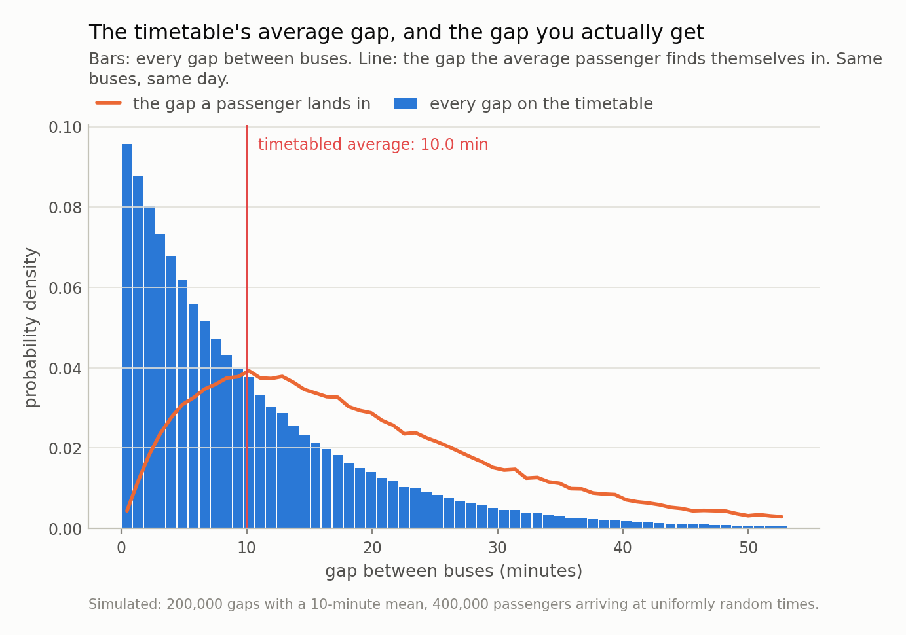

*Buses that average a 10-minute gap will, if the gaps are uneven, leave the average passenger sitting in a 20-minute gap and waiting 10 minutes instead of 5. Nobody is misremembering. The same arithmetic makes the average student's class bigger than the average class, and it has a one-line formula that says exactly how much bigger.*

## Two true statements that sound like a contradiction

The buses on a route come every 10 minutes on average. The average
passenger on that route is waiting inside a gap of
**20 minutes.**

Both of those are exactly true at the same time, on the same route, on the same
day. Nobody is exaggerating and no bus is missing. I simulated
200,000 gaps averaging precisely 10.0 minutes, dropped
400,000 passengers onto the timeline at random moments, and asked each
one how long the gap they had landed in turned out to be. The answer averaged
20.0 minutes — 99% longer than
the average gap.

The reason is almost annoyingly simple once you see it, and it is the same reason
your class was bigger than the average class and the queue you joined was slower
than the one you left.

**Long gaps are rare, but they are long.** A twenty-minute gap is one gap on the
timetable, exactly like a two-minute gap. But it is collecting passengers for ten
times as long. So when you pick a random *moment* rather than a random *gap*, you
are ten times more likely to be inside it. You are not sampling gaps. You are
sampling minutes, and long gaps own more of the minutes.

## The size of the penalty is not a matter of opinion

This has a name — the inspection paradox — and, more usefully, it has a formula.
The average gap *as experienced* is the true average plus the variance of the gaps
divided by that average.

That second term is the whole story. It is zero when every gap is identical and it
grows with unevenness, and it does not care at all what the average is. Two
timetables with the same 10-minute average gap and different
regularity give their passengers completely different days.

I ran four timetables, all with the same average gap, and let the simulated
passengers report back:

| timetable | unevenness | average gap | gap you land in | your wait |
|---|---|---|---|---|
| perfect timetable | 0.00 | 10.0 | 10.0 | 5.0 |
| mildly irregular | 0.50 | 10.0 | 12.5 | 6.3 |
| London bus | 1.00 | 10.0 | 20.0 | 10.0 |
| bunched | 1.60 | 10.0 | 35.8 | 17.9 |

The first row is the one I would point at, because it is the control that tells
you the effect is really about variance. With a perfect timetable the formula
predicts no penalty at all, and the simulation delivers
0.00% — zero, to within rounding. The effect switches off
exactly when the theory says it should, which is the difference between a
demonstration and a coincidence.

And your wait has its own version of the same formula: half the average gap,
multiplied by one plus the squared unevenness. On the third row that turns a
5-minute wait into 10.0 minutes — a
factor of 2.0. On the bunched timetable it is
3.6 times what the timetable implies. Across all four
timetables and both quantities, the simulation and the formula disagreed by at most
0.19%.

*Fig 1. Long gaps are rare but they are wide, so they collect passengers in proportion to how long they last. Nobody is mistaken and nothing is broken: the average passenger really is in a 20.0-minute gap while the average gap really is 10.0 minutes.*

*Fig 2. The four dots are simulations; the curve is the formula, with nothing fitted. At the left the two agree with the timetable — perfectly even gaps really do mean a 5-minute wait. Everything above that dashed line is bought with irregularity alone, at an unchanged average gap.*

## The same arithmetic, with no buses in it

Take a school with 62 classes and 1,620 students.
The average class has 26.1 students in it. Now ask a student how
big their class is: the average answer is **37.7** —
44% bigger.

Nothing has been miscounted. Big classes contain more students, so more students
report from inside them. The school's brochure quotes the first number and every
student's experience is the second, and both are honest. The formula is the same
one, with the same variance term.

Once you know the shape you find it everywhere:

**Queues.** You joined the slow one because the slow one is long, which is why you
could see it. Same reason the lane you switch into slows down: you spend more of
your time in whatever is moving slowly.

**Servers and jobs.** Sample a random *moment* on a machine and you are most
likely to catch it running its longest-running job, which is why "typical job
duration" measured by sampling running processes is systematically wrong.

**Anything measured by intercepting it.** Survey people in a park and you
oversample those who stay a long time. Ask about relationships and you oversample
long ones. Sample lines of code being edited and you oversample the files people
struggle with.

**Lending books, quietly.** A snapshot of loans that are currently outstanding
oversamples long-lived ones, because a six-month loan spends six months in the
snapshot and a five-year loan spends five years. "Average maturity in the book" and
"average maturity of loans written" are different numbers, and taking the first for
the second puts the variance term into the estimate instead of the footnote. The
same applies to any stock-versus-flow question: customers currently subscribed
versus customers ever acquired, tickets currently open versus tickets ever filed.

## What to do about it

The fix is never to argue with the number. Both numbers are right; they answer
different questions. It is to be able to say which question you asked.

**Ask what the sampling unit was.** Per gap or per minute. Per class or per
student. Per loan written or per loan outstanding. If the unit is the *encounter*
rather than the *thing*, expect the variance term and go looking for it.

**When you want the underlying average, weight by the inverse of size.** A student
survey estimates the average class size honestly if each student is weighted by
1/(their class size). Same trick for park visitors and for loans in a snapshot.
The estimator is standard, it is not a correction factor invented for the
occasion, and it needs the size to be recorded — which is the practical reason to
record it.

**And when you want the experienced average, say so.** Passengers do not care
about the timetable's average gap. They care about their wait, and their wait is
the number with the variance in it. For a transit operator that reframes the job:
2.0x is what my irregular timetable costs its passengers
at an unchanged average frequency, so **reducing bunching is worth more than adding
buses** until the bunching is gone. The same reframing applies to any queue you
run, and it does not appear in the average.

The general form of the lesson is one I keep meeting from other directions: the
average of a thing and the average experience of that thing are different numbers,
and the gap between them is variance. It shows up in prediction intervals whose
coverage is fine on average and terrible where it matters, and in model searches
whose best result is a fact about the number of attempts. Averages are compressions,
and it is always worth asking what got compressed.

Next time, back to models: what a neural network is doing when it looks like it has
learned physics, and how to tell that apart from having memorised a trajectory.

---

### Data

- Fully simulated: 200,000 bus gaps drawn from gamma distributions with a 10-minute mean and varying coefficient of variation, and 400,000 passengers arriving at uniformly random times. The class-size example is an illustrative distribution, not a real school. No external data; every number is reproducible from the repo with a fixed seed.

### Reproducibility

- **seed**: 20260804
- **environment**: standarderror=0.1.0, python=3.11.15, numpy=2.4.4
- **design**: 200,000 gaps per timetable, 400,000 passengers placed uniformly on the timeline; the gap each passenger lands in is found by search, not by sampling gaps in proportion to length
- **closed forms checked**: E[experienced] = E[X] + Var(X)/E[X] and E[wait] = E[X²]/(2E[X]); largest simulation-vs-formula disagreement across all four timetables and both quantities: 0.19%
- **control**: the equal-gap timetable, where the predicted penalty is exactly zero and the measured one is 0.00%

Code: <https://github.com/jonghajeon/standarderror>
