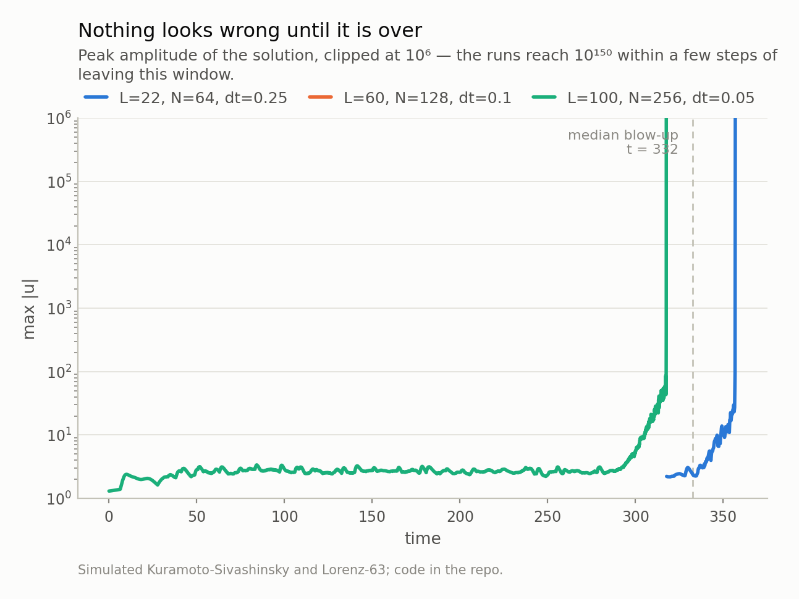
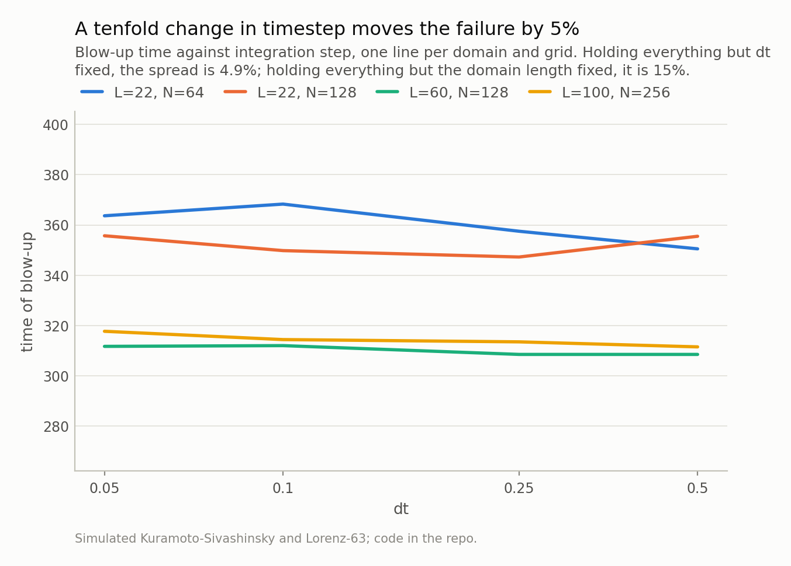
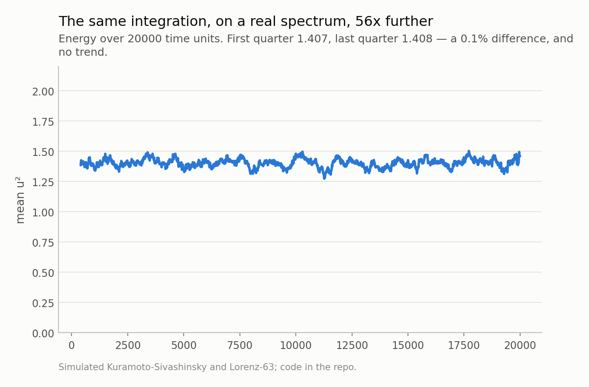

*A spectral solver that blew up at the same moment whatever I changed. Across 24 configurations, a tenfold change in timestep moved the failure by 5%, a finer grid by 5%, and swapping the entire time-stepping scheme by 3%. That invariance was the clue. Plus a Lyapunov exponent 27% too high for a reason that survives a convergence study. Neither bug is visible to a test that checks shapes; both are obvious to a test that checks a physical identity.*

## A bug that ignores your timestep is not a stability problem

I had a working Kuramoto-Sivashinsky solver. It ran, it produced the right kind of
spatiotemporal chaos, the amplitudes sat where the literature says they should, and
the tests were green. Then I asked it for a longer run and it blew up at
t ≈ 358.

The first thing you try is a smaller timestep. It blew up at t ≈
358. The second thing is a finer grid. Same. A different
domain length, which changes the number of unstable modes and the attractor
dimension: still the same order. Then I swapped the whole time-stepping scheme —
fourth-order exponential time differencing out, semi-implicit
Crank-Nicolson/Adams-Bashforth in, sharing no code path except the operators. Same
again.

I swept 24 configurations: two schemes, four domain-and-grid
combinations, four timesteps. Here is where the failure time actually moved, and
where it did not:

| knob varied (everything else fixed) | spread in failure time |
|---|---|
| timestep, over a 10× range | **4.9%** |
| grid resolution, 64 → 128 points | **5.2%** |
| time-stepping scheme | **2.6%** |
| domain length, 22 → 100 | 15% |

That table is the whole clue, and it took me embarrassingly long to read. A
numerical instability scales with the timestep — that is what makes it *numerical*.
Mine ignored the timestep almost entirely, ignored the grid, and ignored the
scheme. Something was running on a clock that had nothing to do with my
discretisation, and my job was to find out whose clock it was.

Kuramoto-Sivashinsky, in the convention I use, is

    u_t = −u·u_x − u_xx − u_xxxx

on a periodic domain. In Fourier space the linear part has growth rate k² − k⁴,
positive for k < 1 and maximised at k = 1/√2 with the value exactly
**0.25**. That number depends on neither the domain length nor the
resolution. And for double-precision ε,
ln(1/ε²) / 0.25 ≈ 288 — the right order of
magnitude for what I was seeing.

Two quantities that do not care about my discretisation, and a failure time that
also does not care. Something was growing at the equation's own maximum rate,
starting from machine epsilon. The residual domain-length dependence is the only
part that does not fit that story cleanly, and it is the honest loose end: a longer
domain puts more energy in modes near k = 1/√2 at t = 0, so the exponential starts
from a slightly larger seed and arrives slightly sooner.

*Fig 1. Peak amplitude sits at 2 for three hundred time units and then leaves the page within a few steps. Nothing in the solution looks wrong beforehand, which is what makes this class of bug expensive to find.*

*Fig 2. Flat lines. Across 24 configurations the timestep changes the failure time by 4.9%, the grid by 5.2%, and the choice of time-stepping scheme by 2.6%. A numerical instability does not behave like this.*

## The state had twice as many degrees of freedom as the problem

Here is the bug, and it is a modelling error dressed as an implementation detail.

The field `u` is real and lives on N grid points: **N real degrees of freedom**. I
was holding the state as `v = fft(u)`, a complex vector of length N: **2N real
degrees of freedom**. The extra N are not spare capacity, they are a constraint —
for a real field, `v[−k] = conj(v[k])`. A spectrum satisfying that is Hermitian;
the orthogonal complement is a space of states that do not correspond to any real
field at all.

Now trace what each part of the timestep does to that meaningless half.

The nonlinear term is `g · fft(real(ifft(v))²)`. Note `real(...)`. Taking the real
part **projects the anti-Hermitian component out**. So the nonlinear term never
sees it, never constrains it, and cannot damp it.

The linear term is `exp(dt·(k²−k⁴)) · v`, applied elementwise. Because k² − k⁴ is
even in k, this operator preserves the Hermitian symmetry — and it applies exactly
the same amplification to the anti-Hermitian half.

So the redundant half of my state was in free fall: amplified by the linear
operator at the equation's own growth rate, and invisible to the only term that
could have stopped it. Seeded, initially, by nothing more than the rounding error
in the first FFT.

I split the spectrum into its Hermitian and anti-Hermitian halves and measured
both. The anti-Hermitian norm starts at 7.1e-16 — floating
point noise — and grows exponentially at **0.216 per time
unit** (R² = 0.9999 over the fit window) against a predicted
0.25. The physical half, meanwhile, is *completely healthy for the
entire run*, sitting in its normal band the whole way.

The kill mechanism is the last piece, and it is why the solution looks fine until
it does not. A purely anti-Hermitian spectrum inverse-transforms to a purely
*imaginary* signal, so `real(ifft(v))` is mathematically immune to it. But not
numerically: once ‖v⁻‖ exceeds ‖v⁺‖ by a factor of 1/ε, extracting the real part
of their sum is catastrophic cancellation, and what comes out is rounding noise
scaled up by 10¹⁸. That crossing happens at t = 350 in my run.
The solver dies at t = 358, **8 time units later**.

Peak amplitude before that point: 2.11. Nothing to see.

*Fig 3. The physical half of the state is perfectly healthy for the entire run. The meaningless half grows exponentially from machine epsilon, and when its roundoff crosses the physical signal at t = 350, extracting the real part stops being meaningful. The solver dies 8 time units later.*

## Two schemes agreeing means nothing if they share the same state

The most expensive wrong turn was this: when I could not find the bug in the
time-stepping, I reimplemented the time-stepping. Two schemes of different order,
one explicit-exponential and one semi-implicit, agreeing on the failure. I read
that as evidence that the stepping was fine and the *problem* was somehow unstable.

That inference was backwards. Both schemes held the state in the same
over-parameterised representation, so they inherited the same defect. Cross-checking
two implementations only tests what they do not share.

What did find it was a reference that shared as little as possible: the same
semi-discrete system integrated in **real space** with a stiff implicit solver at
tight tolerances. Real space means N real unknowns and no redundant half, so there
was nothing to grow. That reference stayed bounded past t = 1200 while my spectral
code was dead at 355. One number, and the disagreement localised the bug to the
representation rather than the scheme.

The fix is three characters. Use `rfft` instead of `fft`. A real FFT stores only
the non-negative wavenumbers, so the anti-Hermitian half is **not
representable** — you cannot amplify a state you cannot express. Same scheme, same
operators, same coefficients; the bug becomes structurally impossible rather than
merely absent.

The repaired integrator runs to t = 20000, fifty-six times past
where the old one died, with mean energy 1.407 in the
first quarter against 1.408 in the last — a
0.1% difference and no trend. It matches the implicit
reference to a relative error of 2.2e-07 at t = 8, and it
is still fourth-order accurate.

One more detail worth stating, because it is the same class of mistake. NumPy puts
−N/2 in the Nyquist slot, and for an **odd**-order derivative that sign is
arbitrary — which makes the nonlinear term inconsistent there. So zero the Nyquist
wavenumber in the first-derivative multiplier. But do **not** zero it in k² − k⁴,
which some reference codes do: that leaves an undamped mode that is conserved
forever and feeds the nonlinearity. Even powers do not care about the sign; odd ones
do.

*Fig 4. Using a real-valued FFT makes the redundant modes unrepresentable, so there is nothing to amplify. The energy is stationary — the cheapest possible check, and one that would have flagged the original within a minute.*

## The second bug: right answer, wrong timestep

While validating the repaired solver I found the other one, and it is a cleaner
teaching example because it hides behind a *correct* convergence study.

To quote forecast horizons in Lyapunov times you need the largest Lyapunov
exponent, and the standard method evolves an orthonormal frame through the
linearised dynamics, re-orthonormalising each step. The frame update I had written
was `Q ← Q + dt·J·Q`. An Euler step.

On Lorenz-63 at dt = 0.01 that gives 1.1541 against the
literature's 0.9056 — **27% high**. At dt = 0.02 it is
1.3980, half again too large. Replacing the
update with the exact tangent propagator `expm(J·dt)` gives
0.8886 at dt = 0.01.

(That is still 1.9%
below the reference value, and the cause is different and benign: I am averaging
over 120 time units of trajectory, which is not long enough for the finite-time
exponent to have fully converged to its asymptotic value. That error shrinks with
trajectory length. Euler's does not.)

Every horizon in my previous post is quoted in Lyapunov times, so a
27% error in λ rescales every headline number in it. That is the kind
of bug that does not crash anything and does not look wrong.

And here is why a convergence study does not save you: **both methods converge.**
Euler's tangent error is O(dt·‖J‖²), so refine the step and it walks down onto the
right answer. Plot the two against dt and you see one curve essentially
flat across the whole range and another sliding down onto it from above — but if you
only ever ran the Euler version you would have seen a clean convergence plot and
concluded, correctly, that your estimator converges. Converging to the right answer
in the limit is not the same as being right at the step you actually use.

What catches it in one line is an identity rather than a limit. The Lyapunov
spectrum must sum to the divergence of the vector field, which for Lorenz-63 is
−(σ + 1 + β) = -13.667 — exactly, not approximately, and at any
timestep. Across this sweep the exact propagator's spectrum matches that trace to
within 0.00%, while Euler's is off by up to
10.5%. That test needs no reference implementation, no
literature value, and no convergence study. It is now in the suite, next to a check
that the Kaplan-Yorke dimension comes out at 2.06.

*Fig 5. At dt = 0.01 — the step this repo uses — the Euler tangent update gives 1.1541 against the exact propagator's 0.8886. Both are consistent and both converge, so a convergence study alone would have called the wrong one fine.*

## What kind of test would have caught these

Both bugs were live while the test suite was green, so it is worth being precise
about what those tests were missing. They checked that arrays had the right shape,
that nothing was NaN after a short run, and that the code executed. Every one of
those passed at t = 100 with a state whose meaningless half had already grown
eight orders of magnitude.

The tests that catch these are the ones that assert something *true about the
system* rather than something true about the code:

- **A conserved or stationary quantity.** Kuramoto-Sivashinsky has a bounded
  absorbing set, so mean u² fluctuates around a constant. Asserting no drift over a
  long run is three lines and would have caught bug one immediately.
- **An exact identity.** The Lyapunov spectrum summing to the trace of the
  Jacobian. No reference values, no tolerance-fiddling, holds at every timestep.
- **An independent reference that shares no code path.** Not a second scheme in the
  same representation — a different representation entirely. The value of a
  cross-check is exactly the code it does *not* share.
- **A long run.** Bug one was invisible for 300 time units. If your longest test
  is 100, you have tested the region where the bug hides.

None of that is specialised numerical-analysis practice; it is the same instinct as
testing behaviour rather than implementation. But it does require knowing one true
fact about your system that is not "the code returns an array" — and in scientific
computing there is always such a fact available, usually a conservation law or a
symmetry, and usually cheaper to assert than the mock you were going to write
instead.

The general lesson I actually took away is narrower and more useful than "write
better tests". **Count the degrees of freedom in your state and compare them to the
degrees of freedom in your problem.** If the state has more, something must enforce
the constraint, and you should be able to say what. If you cannot name it, the
unconstrained directions will find whatever amplification your system offers, and
they will do it from machine epsilon, on a schedule you can calculate in advance.

Next in this series: conformal prediction gives you a finite-sample coverage
guarantee that does not survive contact with a time series — and I will show the
nominal 90% interval realising under 60%, along with what to use instead.

---

### Data

- Simulated Kuramoto-Sivashinsky (u_t = -u u_x - u_xx - u_xxxx on a periodic domain) and Lorenz-63. No external data; every number here is reproducible from the repo with a fixed seed.

### Reproducibility

- **seed**: 20260804
- **environment**: standarderror=0.1.0, python=3.11.15, numpy=2.4.4, scipy=1.17.1
- **machine epsilon**: 2.220e-16
- **KS maximum linear growth rate**: max_k(k²−k⁴) = 0.25
- **configurations swept**: 24
- **fixed integrator verified to**: t = 20000
- **ETDRK4 vs implicit reference at t=8**: relative error 2.19e-07

Code: <https://github.com/jonghajeon/standarderror>
