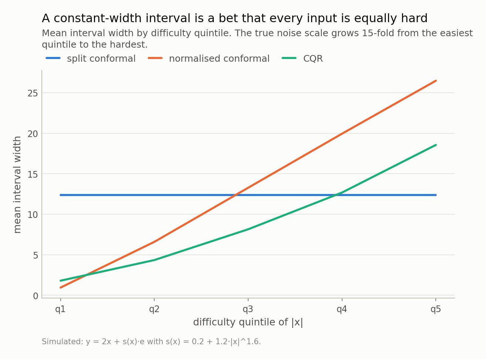
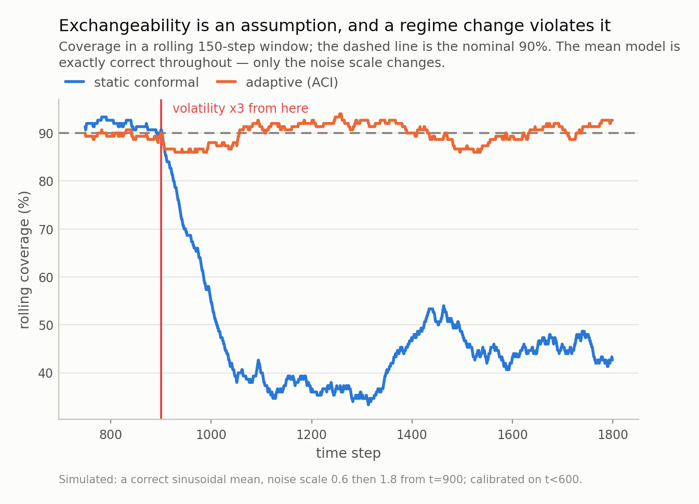

*Conformal prediction gives you a distribution-free coverage guarantee, and the theorem is correct: my intervals covered 91.0% against a promised 90%. They also covered the hardest fifth of the inputs 69% of the time, and after a volatility regime change they covered 42%. Neither is a bug. Both are what the guarantee always said, read carefully.*

## A guarantee you can actually check

Most uncertainty estimates in machine learning are decoration. A model reports a
variance, or a dropout spread, or a quantile head, and nobody ever measures
whether the 90% interval contains the truth 90% of the time. Conformal prediction
is the exception, and that is why it deserves the attention it has been getting:
it comes with a **distribution-free, finite-sample theorem.** No normality, no
correct model, no asymptotics. Wrap any point predictor, calibrate it on data it
has not seen, and coverage is guaranteed.

So I checked it, on a setup with nothing adversarial about it: 1500 points to
fit a model, 1500 held back to calibrate the intervals, 4000 to test, all
drawn independently from the same distribution. A nominal 90% split-conformal
interval covered **91.0%** of the test points.

A 91 that was promised as a 90 is where most write-ups stop, and it is worth
pausing on, because the theorem does not actually say "90.0% every time". It says
the coverage **averaged over calibration sets** lands in
[90.00%, 90.07%] for a calibration set of 1500. Any single
calibration set gives you a draw around that, with a standard deviation of about
1.0 percentage points here. So I ran the whole thing
200 times with fresh calibration and test sets:

- mean coverage **90.061%** — inside the theorem's window, which
  is only 0.07 percentage points wide
- standard deviation across runs 0.98pp, against the
  1.02pp that calibration and test sampling noise predict
- 11% of runs came out below 89%, and the 10th
  percentile was 88.8%

The mathematics is exactly right, in other words, and *one* run of it does not
demonstrate that. This is the first of three places where the guarantee is weaker
than the sentence people repeat about it, and the mildest. The other two are not
mild at all.

## 90% overall, 69% where you needed it

The guarantee is about coverage **averaged over inputs**. Average coverage is
compatible with almost any pattern of conditional coverage, and here is what the
pattern actually was.

I sorted the test set into five bins by how hard the input is — in this simulation
difficulty is exactly known, because I chose how the noise scale grows with |x| —
and measured coverage inside each bin. Split conformal covered the easiest fifth
**100%** of the time and the hardest fifth
**69%**. A spread of
31 percentage points, sitting inside a marginal
number of 91.0%.

If those bins were customers, or regions, or credit segments, you have just
shipped a risk system that is quietly wrong for a fifth of them and needlessly
conservative for another fifth — and your validation report says 90%, because it
is 90%.

The mechanism is not subtle once you look at the widths. Split conformal uses one
number: the 90th percentile of the absolute residuals on the
calibration set. Every test point gets the same interval,
±6.2 here, whether the true spread at that input
is small or large. In this setup the true noise scale grows
15-fold from the easiest quintile to the hardest, so one
width cannot possibly fit both ends. It
is not calibrated *badly*; it is calibrated to the average of a mixture, which is
what you asked for.

*Fig 1. Marginal coverage is an average over inputs, and an average hides exactly this. Split conformal is generous on easy inputs and short where it matters; the usual scaling fix inverts the failure rather than removing it. Only CQR is close to flat, and none of this is visible in the 90%.*

## The standard fix moved the failure instead of removing it

The textbook answer is normalised (locally adaptive) conformal prediction: divide
the residual by an estimate of the local difficulty, so the interval widens where
the model expects trouble. The marginal guarantee survives, because the score is
still a fixed function of the input and the outcome.

I did that, with a difficulty model fitted on the training split — a linear fit
of absolute residual against |x|. The hardest quintile went from
69% to
**97%**. Fixed.

And the easiest quintile fell from 100% to
**55%**.

The spread got *worse*: 31 percentage points became
45. The marginal coverage stayed at
89.8%, serenely reporting success through both
the repair and the new breakage.

The cause is mundane and it is the point: my difficulty model is misspecified. The
truth grows like |x|^1.6 and I fitted a straight line, so the estimate is too
large near zero relative to its own calibration constant, and the intervals there
end up too narrow. Nothing about conformal prediction failed. **The conformal
step inherits the shape of whatever you hand it, and it inherits mistakes
silently**, because its own diagnostic — marginal coverage — is blind to them by
construction.

What worked was fitting the two quantiles directly instead of a scale factor.
Conformalised quantile regression (CQR) landed within
11 percentage points across all five bins, worst bin
86%. It is also, and I did not expect this to be
so clean, **narrower on average** than plain split conformal:
9.1 against 12.4. Adapting
the width is not a cost you pay for fairness across inputs. Refusing to adapt is
a cost you pay for nothing.

*Fig 2. Split conformal's flat line is the whole problem: the same width is far too wide on the left and too narrow on the right. Note that CQR is *narrower on average* than split conformal while being more uniform — adapting is not a cost here, it is a free lunch you decline by not modelling scale.*

## Then time gets involved

Everything above assumed exchangeability — loosely, that the calibration data and
the test data are draws from the same thing in no particular order. Financial
series, demand series, sensor streams and user behaviour are not exchangeable, and
the failure here is not a matter of degree.

Second experiment. A series with a **correct** mean model: my predictions are the
true conditional mean, so nothing can be blamed on the point forecast. I
calibrated on the first 600 steps, all inside a calm stretch, and then the
volatility tripled.

Before the break, coverage 91%. After it,
**42%** — a nominal 90% interval covering four times
in ten, with a width frozen at 1.98 because the calibration
set has no idea anything happened. Over the whole test period it averages
54%, which is the number a quarterly review would see,
and which describes neither regime.

Reweighting does not save this. Weighted conformal prediction handles *covariate*
shift — the inputs move, the conditional law does not. Here the conditional law is
precisely what moved. No importance weight on the calibration points can conjure
residuals of a size that has never been observed.

Adaptive conformal inference (ACI) does recover: it nudges its own working level
up every time it misses and down every time it does not, and it came back to
90.2% overall and 90.3% after the
break. (Its first 19 intervals are unbounded while it
accumulates residuals, and an infinite interval covers trivially; excluding those,
90.0%.) Read the terms of that trade, though. ACI gives up the finite-sample
guarantee for a **long-run** one; it learns the world changed only by being wrong
for a while, so in the first hundred steps after the break it covered
86%; and the price is in the width, which went
from a median of 2.0 in the calm regime to
6.2 in the wild one. An interval that widens by
3.1x is being honest, but it is
also telling you your model no longer knows much, which is information a
dashboard reporting "coverage: 90%" actively hides.

*Fig 3. After the break the static interval covers 42% of the time while still calling itself 90%. ACI recovers, but read the small print: it trades the finite-sample guarantee for a long-run one, and it only knows the world changed because it started missing.*

## Where my setup is easier than yours

Four ways this simulation flatters everyone involved, including me.

**I knew what "hard" meant.** I binned by |x| because I wrote the noise scale as a
function of |x|. In a real problem the conditioning variable that exposes the
failure is not handed to you, and coverage will look fine in the bins you happened
to choose. This is not a small gap: distribution-free *conditional* coverage is
provably impossible without further assumptions — with continuous features, any
method with exact conditional coverage must produce infinitely wide intervals
almost everywhere (Foygel Barber, Candès, Ramdas & Tibshirani, 2021). Bins are
what we have.

**One dimension.** With one feature I can plot the whole story. In fifty
dimensions the hard region can be a thin shell nobody thinks to slice on.

**A generous calibration set.** 1500 calibration points make the quantile
index fine-grained. At 200 the discreteness bites — the smallest achievable level
moves in steps of 1/(n+1) — and the per-run scatter I measured above roughly
triples.

**CQR won partly because I helped it.** I gave the quantile models |x| as a
feature, so they *could* represent the V-shaped spread. Hand CQR a misspecified
quantile model and it degrades like anything else. What it really buys is that the
modelling burden moves somewhere visible: a bad quantile model shows up as a
strange width profile, which you can look at, rather than as a coverage deficit
hidden inside a marginal average.

## What to ask of an interval

None of this is an argument against conformal prediction. It is the only widely
used uncertainty method whose promise can be *checked*, and everything above was
found by checking it — which is exactly the property the alternatives lack. The
parametric Gaussian baseline in my table missed even the marginal number —
88.8% against a nominal 90% — and it is worth
knowing why, because my noise *is* conditionally Gaussian, which sounds like the
best case for it. Conditionally Gaussian with a varying scale is a scale mixture,
and a scale mixture is fat-tailed. The residual standard deviation is an average
over the mixture, so a plus-or-minus-1.645-sigma interval built from it is too
narrow for the tail it actually faces. The conformal step does not care: it takes
the empirical quantile of whatever the residual distribution turns out to be.

| method | overall | worst quintile | spread | mean width |
|---|---|---|---|---|
| Gaussian ±1.645σ | 88.8% | 65.4% | 35pp | 11.3 |
| split conformal | 91.0% | 69.4% | 31pp | 12.4 |
| normalised conformal | 89.8% | 55.0% | 45pp | 13.4 |
| CQR | 90.0% | 86.0% | 11pp | 9.1 |

Every row of that table would be reported as "90% coverage". Only the last one
would still look defensible if somebody asked how it does for the hardest fifth of
their customers, and the difference between the rows is entirely in a column nobody
puts on a model card.

Four questions, in the order I would ask them.

**1. Coverage in the worst subgroup, not just overall.** One number for the whole
test set cannot fail this test, so it is not a test. Bin by difficulty, by
segment, by anything you would be asked about separately, and report the worst
bin. It costs three lines of code and it is the number that decides whether the
interval is usable.

**2. Does the width vary with the input?** If every interval is the same width,
the method has assumed all inputs are equally hard. Sometimes true. Usually
checkable in one plot.

**3. Rolling coverage, not pooled coverage.** For anything with a time index,
pooled coverage averages regimes together and reports a number describing none of
them. A rolling window would have caught my break within one window.

**4. Which assumption is doing the work — and would you notice it failing?**
Exchangeability for split conformal; unchanged `Y | X` for the weighted version;
long-run stationarity of nothing much for ACI. The honest version of every
guarantee names its assumption, and the useful follow-up is whether your
monitoring would detect the violation before your users do.

Next in this series, a change of subject: why every bus you wait for seems late,
every class seems bigger than the average class, and every queue you pick seems
slower than the one beside it. One theorem covers all three, and it has a
one-line formula.

---

### Data

- Fully simulated. Cross-section: y = 2x + s(x)·e with x uniform on [-3, 3] and s(x) = 0.2 + 1.2·|x|^1.6. Time series: a correct sinusoidal mean with a step change in noise scale. No external data; every number is reproducible from the repo with a fixed seed.

### Reproducibility

- **seed**: 20260804
- **environment**: quantpost=0.1.0, python=3.11.15, numpy=2.4.4, scipy=1.17.1, scikit-learn=1.8.0
- **splits**: 1500 fit / 1500 calibrate / 4000 test, disjoint draws; the difficulty and quantile models see only the fit split
- **nominal level**: 90% (alpha = 0.1)
- **finite-sample bound**: [0.9000, 0.9007] for n_calib=1500. The bound is on the mean over calibration draws, so it is checked against 200 repeats (0.90061), not against the single headline run (0.9100)
- **regime change**: volatility 0.6 -> 1.8 at t=900; calibration ends at t=600
- **ACI**: gamma = 0.02, window = 300; the first interval is unbounded by construction (19 of 1200), so widths are quoted as medians

Code: <https://github.com/jonghajeon/quantpost>
