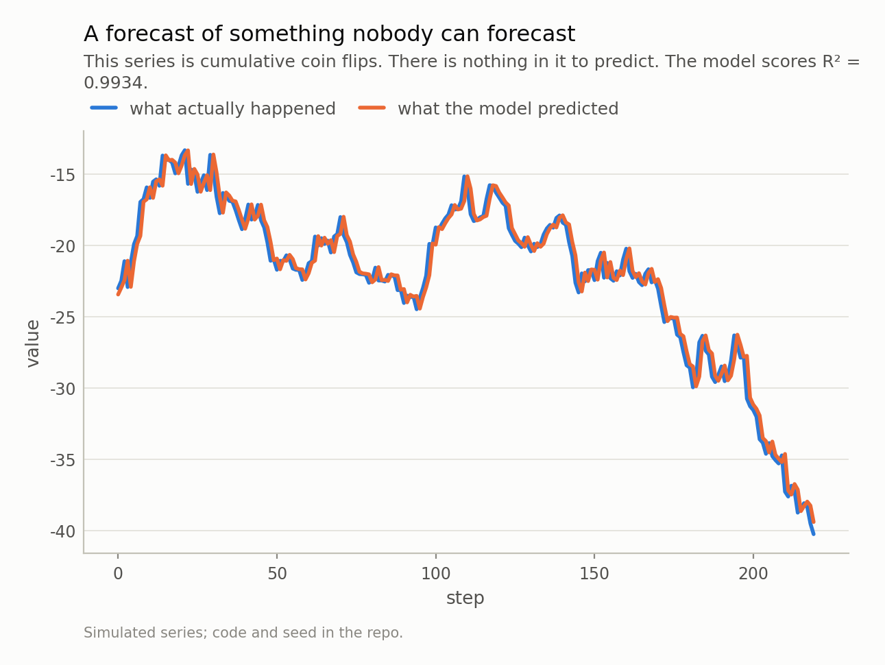
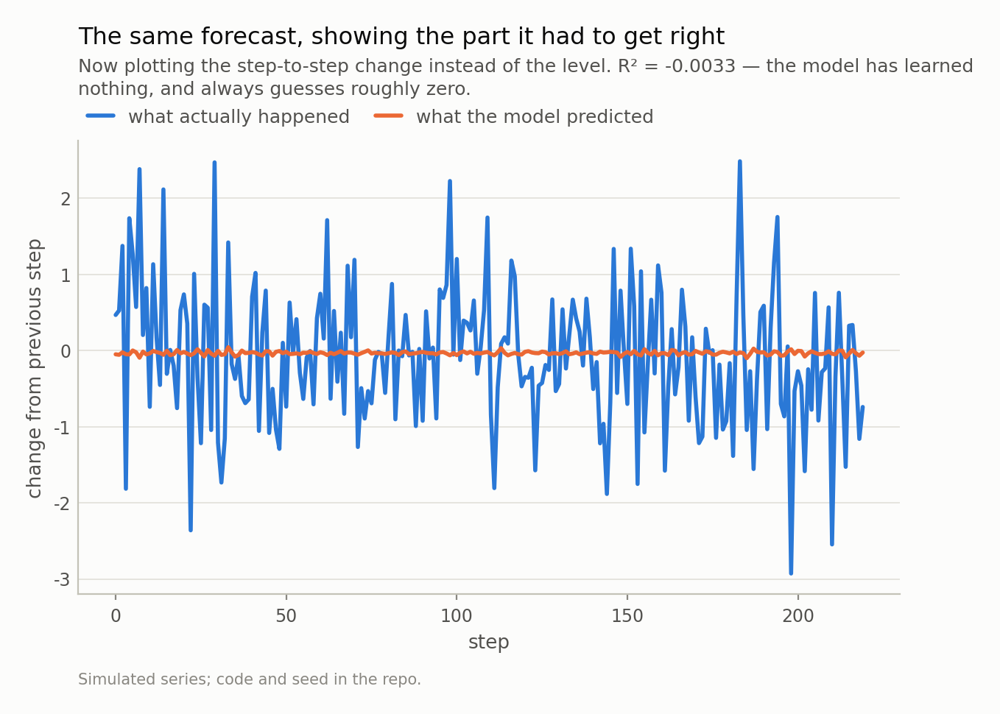
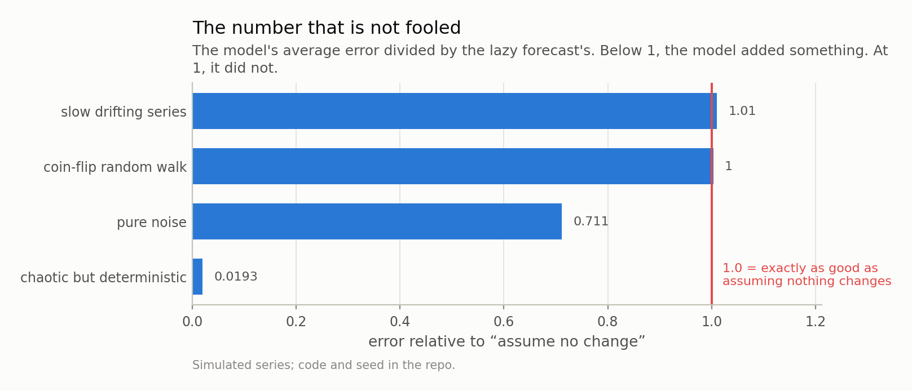

*I built a forecast for a series that is provably impossible to forecast — cumulative coin flips — and it scored R² = 0.99. The chart looks superb. The model knows nothing. This happens constantly, it is not a trick, and one substitution fixes it.*

## A chart that should make you suspicious

Here is a forecast. The predicted line sits on top of what actually happened so
closely that you have to look twice to see there are two lines at all. The standard
accuracy score, R², comes out at **0.9934**. In most rooms, that
chart ends the conversation.

The series is cumulative coin flips.

I generated it by adding a random number to the previous value, over and over. There
is no pattern in it. There cannot be a pattern in it — I wrote the code that made
it, and the next step is independent of everything that came before. Any forecast of
tomorrow's value is worthless by construction.

And yet the score is 0.99, and the chart is beautiful. Something is clearly wrong,
and it is not the model. It is the question we asked it.

*Fig 1. Two lines. You can barely see that there are two. If someone showed you this chart and an R² of 0.99, you would believe the model worked — and the series is a coin flip.*

## The model was asked an easy question

R² measures how much of the *variation* in a series your forecast explains. On a
series like this one, almost all of the variation is the fact that the value today
is nowhere near where it was two hundred steps ago. It wandered. Explaining that
wandering is trivial: today's value is an excellent guess for tomorrow's, because
one step is small compared to how far the series has travelled.

So the model scored 0.99 for knowing that Tuesday resembles Monday.

Watch what happens when I plot exactly the same forecast a different way. Instead of
the level, I show the *change* from one step to the next — which is the only thing
that was ever genuinely unknown. The forecast becomes a flat line at roughly zero,
while reality jumps around it. R² on the change: **-0.0033**.
Zero, or a hair below it.

Both charts show the same numbers from the same model. One says 0.99 and one says
0.00. The second one is the honest one, because it is scored on the quantity that
was actually at stake.

This is not a contrived example. Any slow-moving series behaves this way: prices,
temperatures, subscriber counts, queue lengths, sensor readings, portfolio values.
I ran the same model on a smoothly drifting series and it scored
0.9874 on the level and -0.0038 on the
change. Same illusion, and this time the series does have some real structure — the
score just isn't measuring it.

*Fig 2. The forecast is the flat line. All of that jagged movement is what the model was supposed to predict, and it predicted none of it. Same model, same data, same day — only the axis changed.*

## The one number that is not fooled

There is a simple fix, and it is older than any of the models people worry about.

Before you report anything, make the laziest possible forecast: **assume nothing
changes.** Tomorrow equals today. Then check whether your model beat it.

That comparison has a standard name, MASE, and it is just your model's average error
divided by the lazy forecast's average error. Below 1, you added something. At 1, you
did not. Above 1, you made things worse.

Here is the same model on four different series:

| series | R² on the level | error vs "assume no change" |
|---|---|---|
| coin-flip random walk | 0.9934 | **1.003** |
| slow drifting series | 0.9874 | **1.010** |
| chaotic but deterministic | 1.0000 | **0.019** |
| pure noise | -0.0034 | 0.711 |

The first column is nearly identical for the first three rows. The second column is
not remotely identical, and it is telling you something true. On the random walk the
model lands at 1.003 — laziness, to three decimal places. On the
chaotic series it reaches 0.019, roughly
52 times more accurate than the lazy forecast. That is a
model that genuinely learned the system it was shown.

Two scores, same data, opposite conclusions. Only one of them changes when the model
actually gets better.

*Fig 3. Same model, four kinds of series. On the random walk it lands at 1.003 and on the drifting series 1.010 — indistinguishable from doing nothing. On the deterministic chaotic series it reaches 0.019, about 52 times more accurate than laziness. That is what real skill looks like, and R² could not tell any of these apart.*

## Where this gets more interesting than a rule of thumb

The obvious lesson would be "always score on the change instead of the level". That
lesson is wrong, and it is worth seeing why, because the wrong version of this advice
is doing damage too.

Take the pure noise series — genuinely random, nothing to predict, and unlike the
random walk it does not wander anywhere. Subtract each value from the previous one
and something strange appears: the differences are now correlated, with a lag-1
correlation of **-0.50**. That is not a discovery about the
data. It is an artefact of subtracting, and it is exactly −0.5 in theory.

A model fitted to those differences scores R² =
**0.399**. Looks like a finding. Reconstruct the actual
level from it and the R² is -0.217 — negative, meaning
worse than just guessing the long-run average.

So differencing is not a safety measure either. Differencing a series that did not
need it manufactures structure that looks predictable and is not.

The other direction is worth knowing too. Laziness is not always a strong opponent.
On that same noise series, "assume nothing changes" scores R² =
-0.995 — far worse than useless, because yesterday's noise
tells you nothing about today's. Persistence is a brutal baseline on smooth series
and a terrible one on jumpy series, which is precisely why comparing against it is
informative instead of ceremonial.

What survives all of this is narrower and duller than a rule about differencing:
**compare your model to the lazy forecast, on the quantity you actually care
about.** Not on a transformed version that happens to score better.

## Three questions

If someone shows you a forecast — a vendor, a colleague, a paper, your own notebook
from last month — these three questions do most of the work:

**1. What does the lazy forecast score?** If nobody computed it, the number you were
shown is uninterpretable. This is not a hostile question; it takes one line of code
and it is the first thing a careful analyst runs.

**2. Is the score measured on the thing you care about?** Predicting a level you
already almost know is not the same as predicting a change you do not.

**3. Was the comparison made on data the model had never seen?** Everything above
assumed a clean split. Without one, all of these numbers get better and none of them
get truer.

None of this is a criticism of machine learning, and none of it needs a complicated
model to go wrong. My example was a four-parameter linear fit. The failure was
entirely in the scoring, which is where a surprising share of forecasting failures
live — not in the model, but in the sentence describing how well it did.

Next in this series, the same discipline applied to a much stronger claim: a method
that comes with a mathematical *guarantee* about how often it will be right. I will
show it missing that guarantee badly, and explain exactly which assumption it needed
and did not have.

---

### Data

- Four simulated series (random walk, slow autoregressive drift, Lorenz-63, white noise). No external data; every number is reproducible from the repo with a fixed seed.

### Reproducibility

- **seed**: 20260804
- **environment**: quantpost=0.1.0, python=3.11.15, numpy=2.4.4
- **protocol**: fit on the first half, score on the second; the naive scale for MASE comes from the training half only
- **series length**: 1500

Code: <https://github.com/jonghajeon/quantpost>
