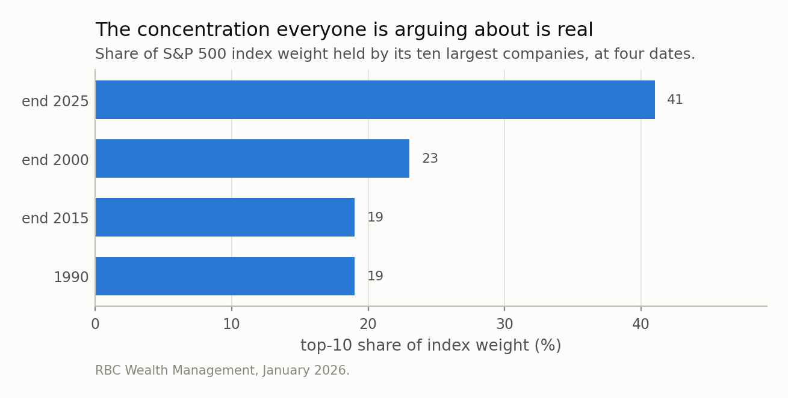
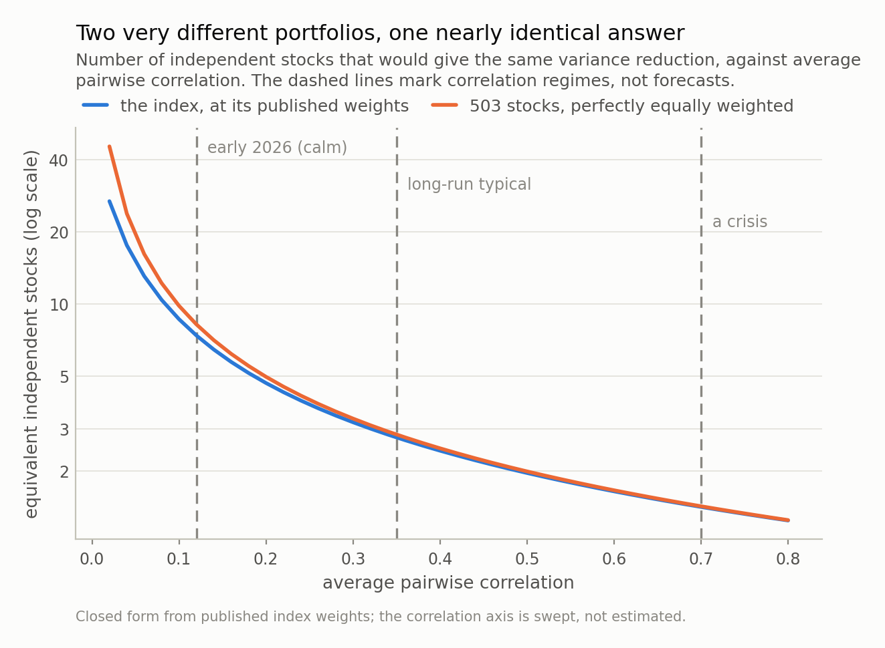

*The ten largest S&P 500 companies are around 41% of the index against roughly 19% in 1990, and the usual conclusion is that index investors are no longer diversified. There is a formula for that. It says the effective number of *holdings* has indeed collapsed — 503 companies, at most 57 of them in effect. It also says the number of independent *bets* is 2.77 at a typical correlation, that a perfectly equally weighted portfolio of the same 503 names would be 2.85 — so the whole concentration argument is worth 0.08 of one bet at that correlation, and less than that in a crisis.*

## A question with five correct answers

Open the holdings page of an S&P 500 fund and you will be told you own
**503 companies**. That is true, and it is the least informative true
thing available.

The ten largest of those companies are about **41%** of the
index by weight. In 1990 the figure was roughly 19%; at the end
of 2000, near the top of the dot-com bubble, about 23%; at
the end of 2015, back to 19%. The concentration is real, it
is unprecedented in the modern era, and the conclusion drawn from it — *you are not
diversified any more* — is repeated constantly.

That conclusion is testable. Diversification is not a mood; it is a statement about
variance, and there is a formula. Running it gives an answer that will annoy
everybody, including me, because I expected it to support the concentration
argument and it mostly does not.

*Fig 1. This is not in dispute and it is not small: the ten largest names went from about a fifth of the index to about two fifths, which takes the effective number of *holdings* from at most 176 to at most 48. What the same change does to the number of independent bets, at a typical correlation, is 2.83 to 2.75.*

## Answer one: how many holdings, in effect

The standard tool is the Herfindahl index — add up the squares of the weights —
and its reciprocal, which is the **effective number of holdings**. An equally
weighted portfolio of 100 stocks scores 100. A portfolio with half its money in one
name scores below 4 however many names are in the tail.

I only have the top ten weights, because those are what gets published. That turns
out not to matter, for a reason worth stating: HHI is *minimised* when the
remaining weight is spread perfectly evenly. So if I assume the other 493 companies
are all exactly the same size — the most diversified the tail could conceivably be
— I get a floor on HHI and therefore a **ceiling** on the effective number of
holdings. Not an estimate. A bound.

The bound is **57**.

503 companies; at most 57 of them in effect, and
really fewer. The concentration critics are right about this part, and it is not
close. Nor does the number depend on whose concentration figure you use: the same
calculation gives at most 48 at the 41% figure and at
most 44 at the 43% one that circulated in July. Run it
on the 1990 weighting and the ceiling was
176.

So on the weight measure the effective portfolio has shrunk by a factor of
3.7
in thirty-five years — from at most
176 names in effect to at most
48. That is a large change and the
critics own it.

Now the part that changes the conclusion.

## Answer two: how many bets

Effective holdings answers "how spread out is my money". It does not answer "how
many different things am I exposed to", and those are the same question only if the
holdings are independent. Stocks are not independent. They share an economy.

Put a correlation into the arithmetic and it collapses to one line. If every pair
of stocks has correlation *rho*, a portfolio's variance relative to a single
stock's is **rho + (1 - rho) × HHI**, where HHI is the sum of squared weights —
and the number of genuinely independent stocks that would achieve the same variance
reduction is the reciprocal of that. It is worth staring at for a second, because
the two terms are the whole argument. The second term is concentration — everything
the debate is about. The first term is correlation, and it does not care about
weights at all.

At a long-run typical average pairwise correlation of
0.35, the S&P 500 at its published weights is
**2.77 independent stocks**.

A perfectly equally weighted portfolio of the same 503 companies — the
most diversified object that can be built from these names, the thing the
concentration critics are implicitly asking for — is
**2.85**.

The difference is **0.08 of one bet** — under
3% of the total.

Everything written about index concentration in the past two years, priced in the
units that matter for portfolio variance, comes to about a tenth of a stock at that
correlation. The reason is visible in the formula: HHI here is
0.0175, and once *rho* is anything but tiny the first term dwarfs it
whatever you do to the weights.

One honest qualification, because the size of the effect is not constant and it
moves in an awkward direction. Concentration costs
0.83 of a bet at the
unusually low correlation of early 2026 —
10%
of the total — 0.08 at a typical
0.35, and 0.01 in a crisis.
So concentration matters most when correlation is low, which is when
diversification is working anyway, and matters least when correlation is high,
which is when you need it. Whatever else it is, it is not a risk that shows up when
risk shows up.

*Fig 2. The two lines are the S&P at its actual weights and a perfectly equally weighted 503-stock portfolio — the most diversified thing you could build from the same names. At a typical correlation of 0.35 they are 2.77 and 2.85 independent stocks. The entire concentration debate is the gap between those two numbers.*

## Which correlation, though

The number that actually moves the answer is the one nobody argues about, and it
moves it enormously.

Correlation is not a constant. Cboe publishes an implied correlation index derived
from S&P options, and in early 2026 it was **unusually low** — near 10 in late
January and just above 15 at February's close, on a scale where those figures mean
correlations of about 0.1 and 0.15. In a crisis the same measure runs
three to five times higher.

Take those regimes in turn, for the actual index:

- **calm, at 0.12** — 7.4 independent stocks
- **long-run typical, at 0.35** — 2.8
- **a crisis, at 0.7** — 1.4

Or all five answers together, which is the table I would put next to any fund's
holdings count:

| what you are counting | how many | how it is computed |
|---|---|---|
| companies you own | 503 | the fund's holdings page |
| effective holdings, by weight | at most 57 | 1 / HHI, tail assumed perfectly even |
| independent bets, calm (Cboe, early 2026) | 7.38 | 1 / (rho + (1-rho)·HHI), rho = 0.12 |
| independent bets, long-run typical | 2.77 | 1 / (rho + (1-rho)·HHI), rho = 0.35 |
| independent bets, a crisis | 1.42 | 1 / (rho + (1-rho)·HHI), rho = 0.7 |

Between the calm regime and the crisis regime your diversification falls by a
factor of 5, and it does so without a single weight
changing. That is the thing worth being alarmed about, and I have never seen it in
a fund fact sheet.

It also has an unpleasant timing property, which is the honest reason to care.
Correlation rises when markets fall. Diversification is therefore at its weakest at
exactly the moment it is supposed to be helping, and no rebalancing schedule fixes
that, because the problem is not your weights.

(The closed form is easy to get wrong, so I checked it against an explicit
one-factor Monte Carlo with 500,000 draws at four different correlations. Largest
disagreement: 0.25%.)

## Where the concentration worriers are still right

Having spent four sections deflating the argument, here is the strongest version of
it, because the diversification framing is not the only framing.

**Composition, not count.** Concentration has not changed how many bets you hold;
it has changed *what the single dominant bet is*. When the top ten are two fifths
of the index and most of them sell the same thing to each other, the common factor
you are exposed to stops being "the economy" and becomes something narrower. My
formula is completely blind to that. It counts bets; it has nothing to say about
what they are on, and a portfolio of 2.8 independent bets on
different things is not the same object as 2.8 bets on one supply
chain.

**Valuation, not variance.** The most concrete number in the RBC analysis is not a
weight: the top ten were around 41% of the index's weight and
about 32% of its expected earnings. That is a statement about what you are paying, not about how
spread out you are, and my arithmetic has no opinion on it whatsoever.

**And the counterfactual is not free.** "Diversify away from the concentration"
means holding something other than the market portfolio, which is an active bet
with its own concentration — equal weighting is a systematic tilt toward smaller
companies, rebalanced monthly, with turnover and tax to match. That may be a good
idea. It is not the neutral choice, and it should be argued on its own terms rather
than as a correction to an arithmetic problem it barely affects.

I am not going to tell you what to hold, and this post contains no view about
whether any of these companies are worth what they cost. What it contains is a
denominator.

## Where this is a caricature

**Equicorrelation is a cartoon.** One number for every pair is wrong: semiconductor
firms move together far more than a semiconductor firm and a utility. A realistic
block structure would put the effective number of bets somewhat *above* my figure
in calm regimes and somewhat below in crises, because real correlation matrices
have one dominant factor and several smaller ones. The direction of the
post's conclusion is unaffected, since the dominant factor is what is doing the
work either way.

**There is more than one definition of "effective bets".** I used the
variance-ratio one because it answers a question an investor actually has. Measures
built from the eigenvalues of the correlation matrix — Meucci's entropy-based
number of bets, or the participation ratio — give different figures for the same
portfolio, typically larger. They are answering a different question, and anyone
quoting one should say which.

**The weights are a snapshot.** March 2026, one index, one country. The tail is a
bound rather than a measurement.

**And an amusing measurement subtlety:** Alphabet appears twice in the top ten,
because its two share classes are separate index constituents. Whether you treat
that as one company or two changes the "top ten" total by roughly the weight of the
eleventh name — which is a decent reminder that even the number everyone is arguing
about is definition-dependent before you have done any mathematics at all.

Next in this series: what a neural network is doing when it looks like it has
learned physics, and how to tell that apart from having memorised a trajectory.

---

### Data

- S&P 500 top-10 index weights, March 2026 (NVIDIA 7.08%, Apple 6.19%, Microsoft 4.97%, Amazon 3.75%, Alphabet A 3.06%, Alphabet C 2.85%, Meta 2.67%, Broadcom 2.57%, Tesla 2.44%, Berkshire Hathaway 1.76%; 503 constituents) — Westmount Fundamentals, <https://westmountfundamentals.com/sp500-top-10-holdings-weight-2026>.
- Top-10 share of index weight of roughly 19% in 1990, 23% at end-2000, 19% at end-2015 and nearly 41% at end-2025, and the observation that the top 10 were about 41% of weight against about 32% of expected earnings — RBC Wealth Management, 22 January 2026, <https://www.rbcwealthmanagement.com/en-us/insights/the-great-narrowing-sp-500-concentration>.
- Cboe 1-Month Implied Correlation Index (COR1M) near 10 in late January 2026 and just above 15 at February's close — Cboe Index Insights, February 2026, <https://www.cboe.com/insights/posts/index-insights-february-2026>.
- No price series is used or redistributed. Every figure in this post is either quoted above or computed from those weights in closed form, with a Monte Carlo check.

### Reproducibility

- **seed**: 20260804
- **environment**: quantpost=0.1.0, python=3.11.15, numpy=2.4.4
- **identity**: portfolio variance under equicorrelation is rho + (1-rho)·HHI relative to one stock, so the equivalent number of independent stocks is its reciprocal
- **bound**: the tail beyond the top ten is assumed perfectly evenly spread, which minimises HHI; every effective-holdings figure here is therefore an upper bound (57.0 at the itemised March 2026 weights)
- **insensitivity**: March 2026 (itemised): at most 57, end 2025: at most 48, July 2026: at most 44
- **verification**: one-factor Monte Carlo, 500,000 draws at rho in (0.05, 0.12, 0.35, 0.70); largest disagreement with the closed form 0.25%

Code: <https://github.com/jonghajeon/quantpost>
