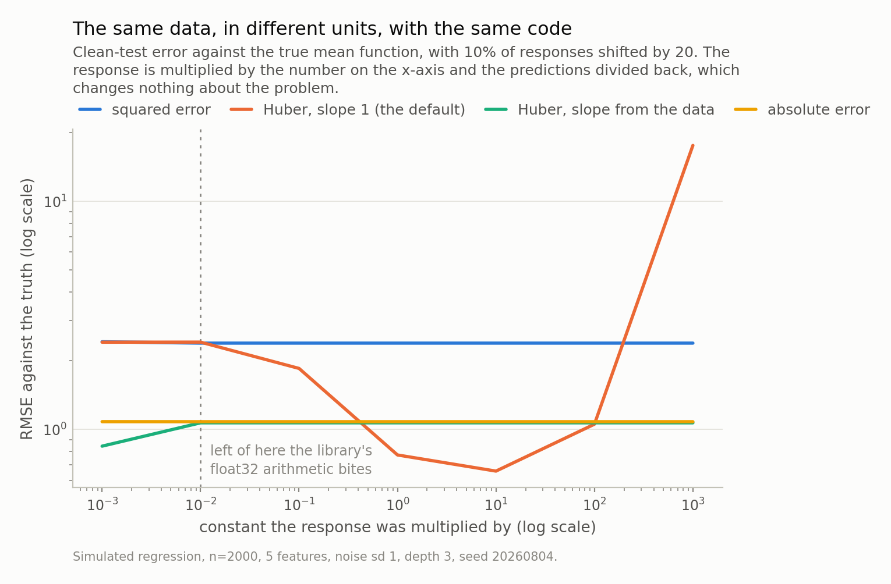
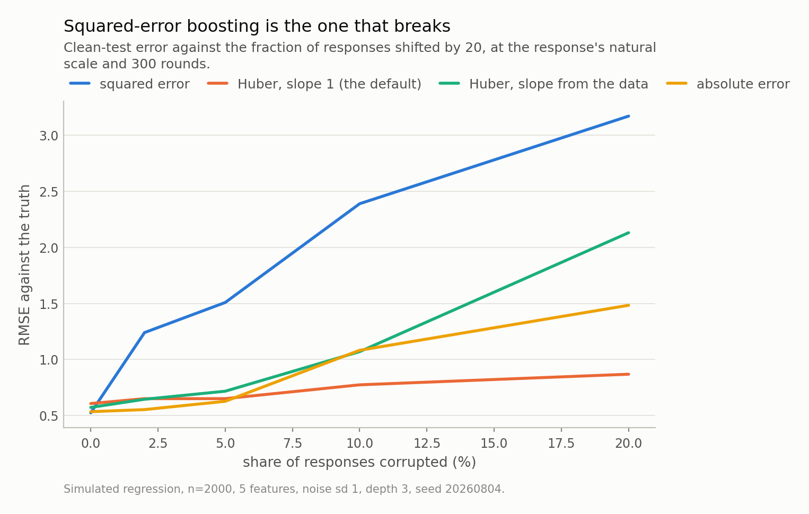

Disclosure: this post was written with the assistance of an AI system (Claude), which wrote the analysis code, ran the experiments and drafted the text. The topic, the constraints, the data choices and the final review are the author's.

*XGBoost's robust option is a Huber loss, and a Huber loss is a function of the residual **divided by a scale**. XGBoost's default for that scale is the number 1. So multiply your response by a constant — metres to centimetres, dollars to thousands — refit, divide the predictions back, and you get a different model. On a synthetic regression with 10% corrupted responses, that transformation moves the error from 0.66 to 17.54: at one end of the sweep the loss is fully robust, at the other it is no better than squared error. Squared error and absolute error do not move at all, because their losses contain no constant to be wrong about. A paper posted this summer fixes XGBoost's robustness with M-, S-, tau-estimators from robust regression; this post is the measurement that says why estimating the scale, rather than assuming it, is the part that matters.*

## A paper about making XGBoost robust

XGBoost fits a sequence of small trees to the residuals of the ones before it. The
default loss is squared error, which means the thing each new tree chases is a
residual, and a residual that is enormous because the response was wrong gets chased
just as hard as one that is informative.

A paper posted this summer takes that seriously. It shows XGBoost's performance is
degraded by both classical kinds of contamination — **vertical outliers**, an ordinary
`x` with a wrong `y`, and **leverage points**, an unusual `x` whose `y` does not follow
the pattern — and then borrows the standard toolkit of robust regression:
M-, S-, tau-estimators. Its conclusion is that a two-step procedure,
**MM-XGBoost**, gives the best trade-off between robustness and accuracy.

I could only read the abstract and the listing, so I will not describe its
experiments. What I can do is ask the question a reader of that abstract should ask:
XGBoost already ships a robust loss. Why was any of this necessary?

The answer is a number equal to 1.

## A robust loss is a function of the residual over a scale

Squared error is `r^2`. Absolute error is `|r|`. Neither contains a constant, and that
turns out to matter enormously.

Huber's loss does contain one. It is quadratic for small residuals and linear for
large ones, and the transition happens at `|r| = delta`. XGBoost implements a smooth
version, `reg:pseudohubererror`, as
**`delta^2 (sqrt(1 + (r/delta)^2) - 1)`** — quadratic near zero, linear far out, and
the gradient saturates at `delta`, which is exactly where the robustness comes from.
A point with a residual far beyond `delta` contributes a bounded push instead of a
proportional one.

Now look at what `delta` is. It is compared against a residual, so it is measured in
the units of the response. **It is a scale.** And robust statistics has always written
these losses as functions of `r / sigma` for that reason, with `sigma` estimated from
the data.

XGBoost's parameter is `huber_slope` and its default is **1**.

So here is a test that costs nothing. Take a fitting procedure, multiply the response
by a constant `s`, refit, divide the predictions by `s`. If the procedure is any good
this must return the same function, because `s` is a choice of units and not a fact
about the world. Formally, **`A(X, s y)(x) / s = A(X, y)(x)`** — scale equivariance.

Squared error passes exactly. Absolute error passes exactly. A Huber loss with a fixed
`delta` cannot pass, because after rescaling the residuals moved and the transition
point did not.

## How much does it matter? A factor of 27

Enough to decide whether your model is robust at all.

The setup: a synthetic regression with a known mean function, so error is measured
against the truth rather than against a held-out sample of the same contamination.
2000 rows, 5 features of which two do nothing,
10% of responses shifted by 20. Then the sweep:
multiply the response by everything from a thousandth to a thousand, refit, divide the
predictions back.

At the response's natural scale, the default-slope Huber gives **0.77**
against squared error's 2.39 — robust, and the reason the option exists.
Express the same response in hundreds instead, and it gives **2.41**.
Squared error at the same point: 2.39. **The robustness is simply gone**, and
nothing was done to the data that a change of measurement units does not do.

Across the whole sweep the default-slope Huber runs from 0.66 to 17.54, a
factor of 27. Squared error sits at 2.39 throughout, absolute
error at 1.08, and the version that sets its slope from a robust scale of the
response at 1.07. Those three are flat to six decimal places: their
equivariance gaps are 9e-07,
8e-07 and 4e-07, against
**0.26** for the default.

One line of the fix, and it is the whole content of the paper's design choice:
estimate the scale. `huber_slope = 1.4826 * MAD(y)` restores equivariance exactly.

*Fig 1. Three of these four losses are flat, because their transition points either do not exist or are set from the data. The default-slope Huber runs from 17.54 down to 0.66 and back — a factor of 27 across the sweep, from a choice of units. At the left of the sweep it is no better than squared error, which is to say not robust at all. The two lower flat lines sit almost exactly on top of each other, at 1.07 for the data-set slope and 1.08 for absolute error — a coincidence of this problem, not a missing series. Read the flat lines as the calibration: they move at the leftmost point too, which is where float32 arithmetic inside the library starts to matter rather than anything about the loss.*

## The default is not simply wrong, which is worse

Here is where it stops being a bug report.

Run the contamination sweep at the response's natural scale and the default-slope
Huber is **the most robust setting tested**. At
20% corruption it reaches
0.87 while squared error reaches
3.17 — 6.1
times its own clean-data error of 0.52. The paper's motivation
reproduces cleanly. And the setting that wins is the one Fig 1 shows to be robust by
accident.

That is because a `delta` which is *small* relative to the residual scale is
aggressively robust: almost every residual lands in the linear region, gradients
saturate, and outliers get very little say. A `delta` which is large is nearly squared
error. So the fixed default is not a wrong answer, it is an **unstated
bias-robustness trade-off**, and where you sit on it depends on the units you happened
to record your response in.

Which also means the well-behaved fix is not automatically the better model. Setting
`delta` from the MAD of the response gives 2.13 at
20% corruption — equivariant, and *less* robust than the
mis-scaled default. The reason is instructive: the MAD of a contaminated response is
inflated **by the outliers themselves**, from 3.35 clean to
3.82 corrupted, so it sets the transition point too high and
puts the outliers back inside the quadratic region.

The scale you need is the scale of the *residuals*. Which needs a fit. Which needs a
scale. That circularity is precisely why the paper's answer is a **two-step**
procedure and not a rescaling, and my one-shot control failing in exactly the
predicted way is the best evidence I can offer that its design is right.

*Fig 2. The paper's motivation, reproduced: at 20% contamination squared error is 6.1 times its clean-data error, while the default-slope Huber is the most robust setting here — the same setting Fig 1 shows to be robust only by accident of units. Two of these curves would swap places if the response were measured in hundreds.*

## The leverage result I nearly got backwards

The paper's other claim is about leverage points, and reproducing it took two
attempts.

My first construction put the contaminated rows eight standard deviations out in
**every** feature. The damage was nil — squared error was, if anything, slightly more
accurate than on clean data. I had a paragraph half-written explaining that tree
ensembles are immune to leverage points before I checked the construction.

They are not immune. They are immune to *my* leverage points, and for a reason that is
obvious once seen: a point far outside the range of everything else falls beyond the
outermost split, gets a leaf of its own, and that leaf covers a region no test point
ever reaches. The tree fences it off for free.

Move the same 10% of points in to
1.5 standard deviations and squared error goes to **1.97**
against 0.52 on clean data. At 12 standard
deviations the same contamination only reaches 1.04. **The danger falls as
the leverage rises.**

That inverts the linear-model intuition, where leverage is literally a distance and a
far-out point can take the fitted plane anywhere. For a tree the near point is the
dangerous one, because the splits that would isolate it also carve up territory that
real data occupies. Which has a practical edge to it: an outlier diagnostic borrowed
from linear regression — flag the points with high leverage — ranks danger in close to
the wrong order for a boosted tree.

*Fig 3. For a linear model, leverage is a distance and danger grows with it. For a tree ensemble it is the other way round: a point far outside the data falls beyond the outermost split and gets a leaf no test point visits. At 1.5 standard deviations, 10% contamination takes squared error to 1.97 against 0.52 clean; at 12 it only reaches 1.04. The first version of this experiment used the far case, measured almost no damage, and nearly reported that as a property of XGBoost. The two curves do not share a shape: squared error is worst at the nearest distance, while the robust variant peaks one step later, at 2.5. What they agree on is the right-hand half — past 3.5 standard deviations, moving the contamination further out buys nothing.*

## And robustness here is partly a round budget

One more thing worth knowing before reading anyone's robustness table, including mine.

| boosting rounds | squared error | Huber, slope 1 (the default) | Huber, slope from the data | absolute error |
|---|---|---|---|---|
| 100 | 1.59 | 0.72 | 0.72 | 0.93 |
| 300 | 2.39 | 0.77 | 1.07 | 1.08 |
| 1,000 | 3.76 | 0.99 | 2.03 | 1.11 |
| 3,000 | 4.72 | 1.68 | 3.47 | 1.26 |

Every column rises. A tree can always carve out a leaf for an outlier if you give it
enough rounds, so a robust loss **delays** overfitting to contamination rather than
preventing it. Squared error goes from
1.59 at 100 rounds to
4.72 at 3,000; even
absolute error, which has a bounded gradient everywhere, drifts from
0.93 to
1.26.

So a robustness comparison at an unstated number of rounds is not a comparison, and
some of what looks like a robust loss is early stopping in disguise. This also
complicates the "just use more rounds" answer to the units problem. On clean data at
the natural scale, the default-slope Huber is best at 300 rounds
(0.61); at a hundred times the scale it starts undertrained
(0.98) and needs **30 times the rounds** to reach
0.65, still short of the 0.61 the well-scaled
version managed at 300. You can pay for the units mistake in compute, at a poor
exchange rate.

## What to take from it

**Set `huber_slope`, or standardise the response.** If you use
`reg:pseudohubererror` and leave the slope at 1, you have made an assumption about
your units, not a modelling choice. `1.4826 * MAD(y)` costs one line and restores
equivariance. Standardising `y` before fitting does the same thing and is easier to
remember.

**Run the equivariance test on anything with a tuning constant in it.** Multiply the
response by a hundred, refit, divide back, compare. It takes two fits and it catches
this whole class of bug — a hyperparameter with units, where the default was chosen
for someone else's data. Huber's `delta` is the clearest case; it is not the only one.

**Report the round budget with any robustness claim**, because Table 1's columns all
move.

**And do not carry linear-model outlier intuition into a tree.** For a boosted tree,
the leverage point near the edge of the data is the one to worry about, not the one
far outside it.

None of which is an argument against the paper — it is the argument *for* it, arrived
at from outside. The reason to reach for M-, S- and tau-estimators is not that Huber's
loss is the wrong shape. It is that a robust loss needs a scale, that the scale has to
come from the data, and that getting it from the data honestly requires more than one
pass. The paper's answer to that is two steps and a name; mine is a one-line MAD
rescaling that restores equivariance and then loses to the bug it fixed. That gap is
the whole subject of robust regression, and it is why MM-XGBoost is a two-step
procedure.

## Where to be careful

**One synthetic problem, one contamination model.** The mean function, the noise, the
outlier magnitude and the tree depth are all mine, and every number moves if they
move. The exact part is the equivariance argument: a loss with a fixed transition point
cannot be scale equivariant, and that is arithmetic rather than a measurement. The
*sizes* — a factor of 27, 3.8 times the clean
error at near leverage — are specific to this setup.

**My contamination magnitude is absolute, on purpose.** 20 in the units of
the response at scale 1, not a multiple of the noise. Specifying contamination in
units of sigma would have made the experiment scale-free by construction and unable to
detect the thing it was built to detect.

**The sweep has a numerical floor.** At the smallest scale even the equivariant losses
move — squared error by about 1%, the Huber variants by more, which is what you would
expect if the pseudo-Huber Hessian underflows first. Read the sweep from about a
hundredth upward; the leftmost point is there as calibration, not as a result.

**I did not implement the paper's estimators.** There is no MM-XGBoost in this post,
no S-loss and no tau-loss. My control is a one-shot MAD rescaling, which is the
*shallowest* version of the paper's idea, and the fact that it restores equivariance
without matching the mis-scaled default's robustness is an argument for the deeper
version rather than a test of it.

**And the paper I have only read from the outside.** The abstract and the listing.
Nothing here characterises its experiments or its results, and the measurement above
would have been worth making whatever they turn out to be.

---

### Data

- Iris Aragon Mladosich and Christophe Croux, 'Robust XGBoosting for Regression', arXiv:2608.13590 (cs.LG, stat.CO, stat.ML); v1 dated 14 July 2026 in the submission history, announced in the 2608 batch. Shows that XGBoost's performance is affected by vertical outliers and leverage points, explores losses based on M-, S-, tau-estimators from robust regression, and reports that a two-step procedure, MM-XGBoost, gives the best trade-off between robustness and prediction accuracy. 30 pages plus 15 of supplement, 3 figures. <https://arxiv.org/abs/2608.13590>. **Read from the abstract and the listing only**, so nothing here describes its experiments, its data, or how its estimators are implemented.
- Everything measured in this post is simulated. n=2000 training rows, 800 clean test rows, 5 standard normal features of which two are irrelevant, mean function `3 sin(x1) + x2^2 - 2 x3`, Gaussian noise of standard deviation 1, seed 20260804. Contamination is constructed by `standarderror.robust.contamination`. No market data and no company appears.
- XGBoost 3.2.0, defaults as shipped except where stated: `max_depth=3`, `learning_rate=0.1`, `n_estimators=300`. The `huber_slope` default of 1 is XGBoost's, not a choice made here.

### Reproducibility

- **seed**: 20260804
- **environment**: standarderror=0.1.0, python=3.11.15, numpy=2.4.4, scipy=1.17.1, scikit-learn=1.8.0
- **equivariance_test**: fit on (X, s*y), predict, divide by s, compare across s; reported as the largest root-mean-square deviation from the s=1 predictions relative to their own root-mean-square, over s in (0.1, 1, 10, 100)
- **equivariance_gaps**: squared error: 8.6e-07, Huber, slope 1 (the default): 0.26, Huber, slope from the data: 4.5e-07, absolute error: 7.8e-07
- **error_measure**: RMSE against the true mean function on clean test points, never against held-out contaminated data, which would measure how well the outliers are reproduced
- **slope_from_the_data**: 1.4826 x MAD of the response, which is 3.35 on the clean response and 3.82 on the contaminated one — the inflation is why a one-shot rescaling is not the same thing as a two-step procedure
- **numerical_floor**: at the smallest scale tested (1e-3) even the equivariant losses move, by 1-2% for squared error and more for the Huber variants, consistent with float32 arithmetic in the library rather than with any property of the loss; the sweep is trustworthy from about 1e-2 upward
- **leverage_construction**: a fraction of rows moved to +/- `distance` standard deviations in the first feature only, with y set to the true mean at the new location plus 20, so the points are bad leverage rather than merely unusual
- **cost**: about 30 seconds of fitting for every grid in the post, cached under a hash of the configuration

Code: <https://github.com/jongha-jeon-dev/standarderror>
